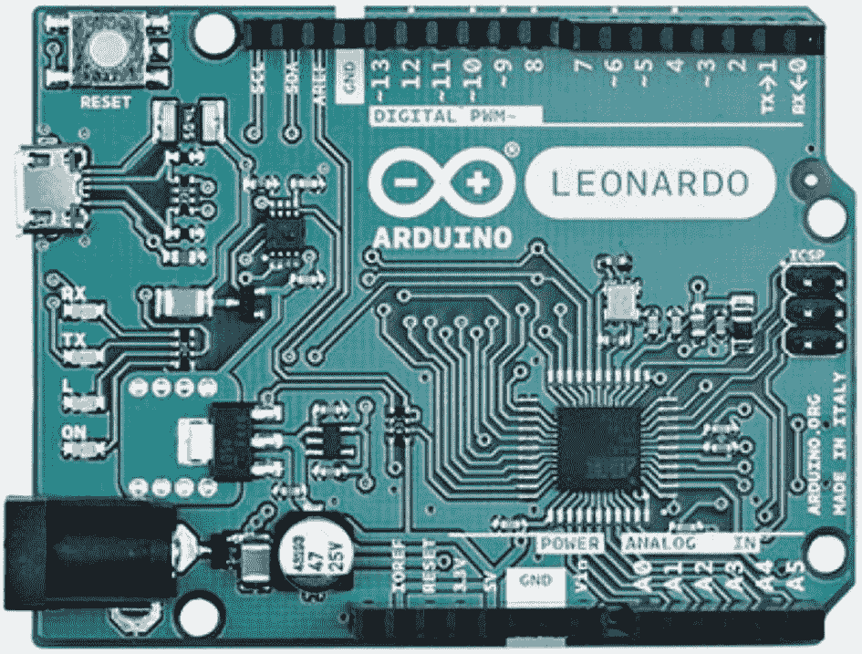
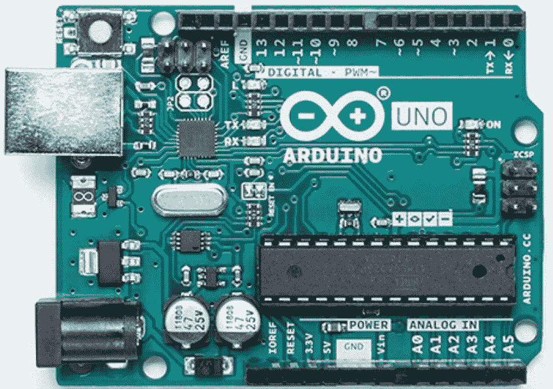
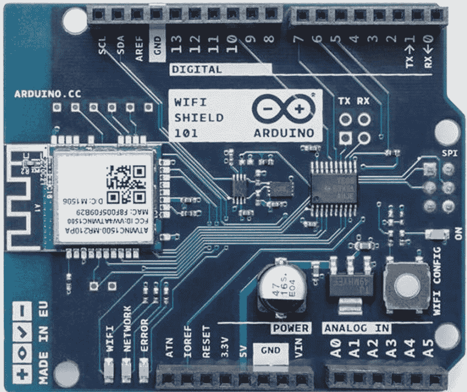
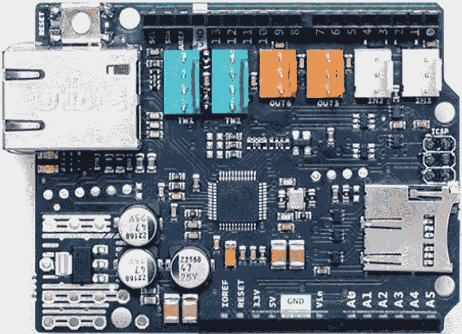
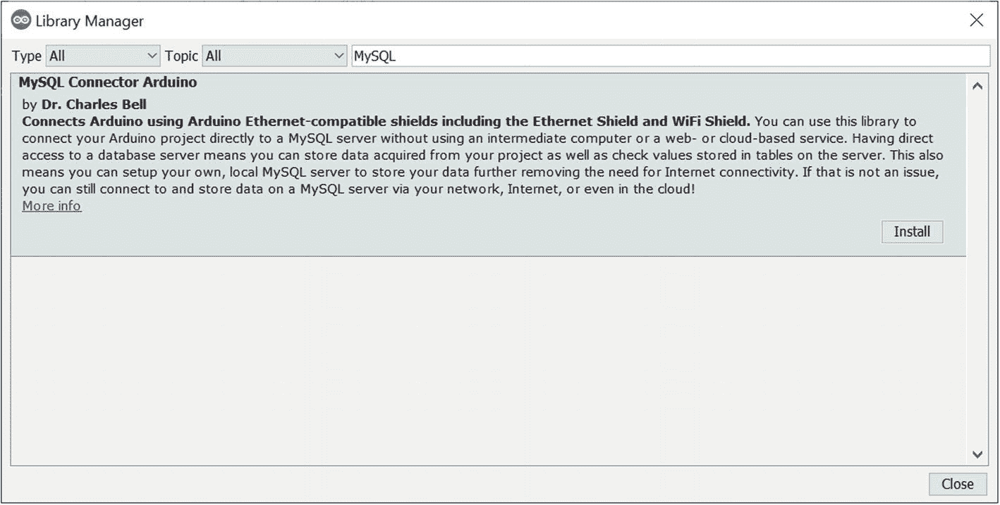
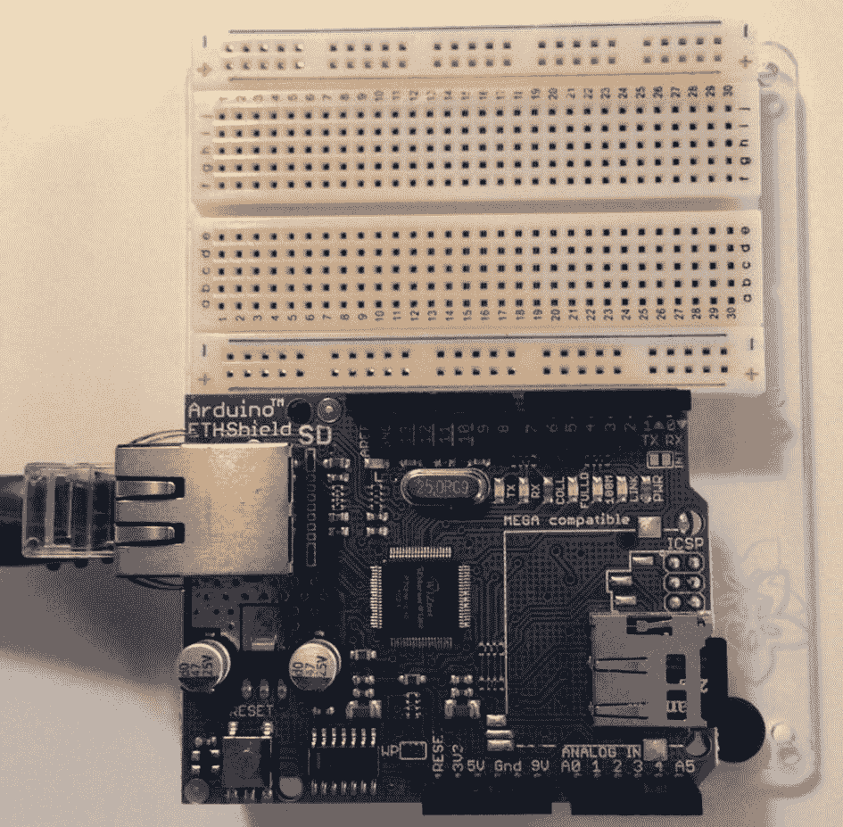
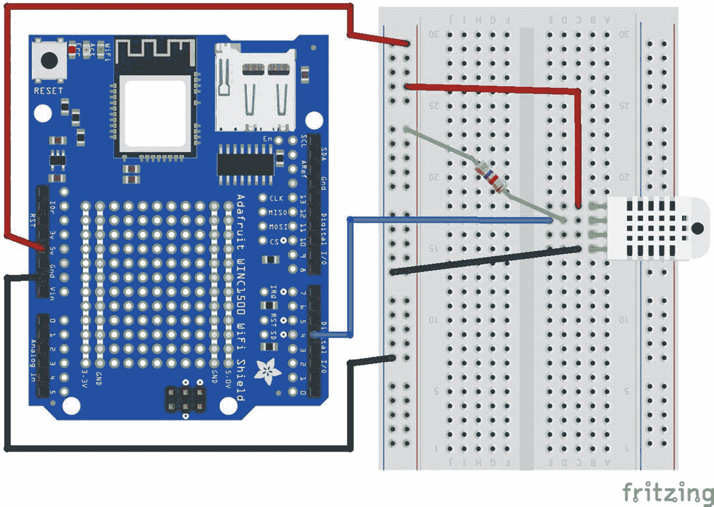
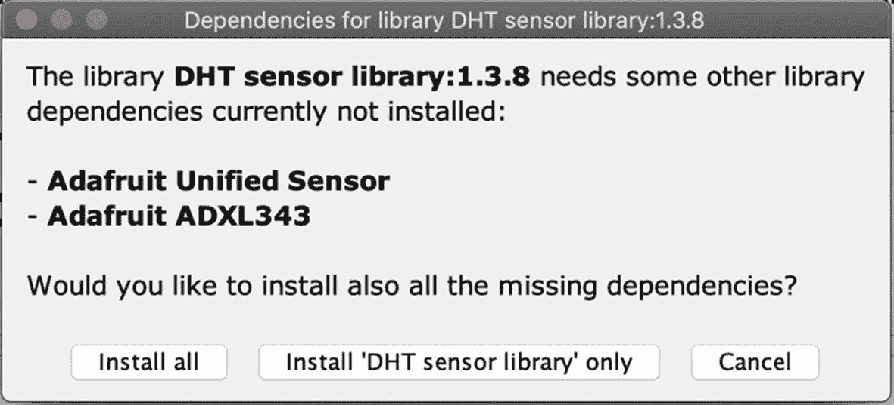

# 九、MySQL 和 Arduino：终于联合了！

在前几章中，我讨论了几种可以用来存储传感器数据的方法。其中一种方法是将数据存储在网络上的数据库中。如果您还记得，这有几个优点，尤其是您不必将传感器网络连接到互联网就能实现这一功能。

如果您的传感器节点连接到一个 Raspberry Pi，这并不难实现，但是如果您的传感器节点连接到一个 Arduino，您如何做到这一点呢？Arduino 本身可以是一个传感器节点，一个或多个传感器直接连接到 Arduino I/O 端口；或者，Arduino 可以是一个数据聚合器，使用 XBee 模块通过 ZigBee 无线网络从其他传感器节点收集数据，如您在第六章中所见。但是，如何在不使用第三方应用程序或基于云的解决方案的情况下将数据插入 MySQL 呢？

本章介绍了一个新的数据库连接器库，使您能够将传感器数据从 Arduino 发送到 MySQL 数据库。

## 介绍连接器/Arduino

恭喜你！你刚刚进入了一个 Arduino 项目的新世界。借助专门为 Arduino 设计的新数据库连接器，您可以将 Arduino 项目直接连接到 MySQL 服务器，而无需使用中间计算机或基于 web 的服务。

直接访问数据库服务器意味着您可以将从项目中获取的数据存储在数据库中。您还可以检查存储在服务器上的表中的值。该连接器允许您将传感器网络保持在本地，甚至可以与互联网或任何其他外部网络断开连接。

如果您使用了其他一些存储 Arduino 数据的方法，例如将数据写入闪存(如安全数字卡)或 EEPROM 设备，您可以完全取消手动数据复制和提取方法。同样，如果您的项目无法或不想连接到 Internet 来保存数据，那么写入本地数据库服务器的能力也可以解决这个问题。

将数据保存在数据库中不仅可以保存数据供以后分析，还意味着您的项目可以将数据提供给更复杂的应用程序。更好的是，如果您的项目使用大量数据进行计算或查找，您可以将数据存储在服务器上，只检索计算或操作所需的数据，而无需占用 Arduino 上的大量内存。显然，这为 Arduino 项目开辟了一条全新的道路！

数据库连接器被命名为 Connector/Arduino。它在为 Arduino 平台构建的库中实现了 MySQL 客户端通信协议(称为数据库连接器)。此后，当讨论一般概念和特性时，我引用 Connector/Arduino，并将实际的源代码称为 Connector/Arduino 库、连接器或简单的库。

为使用该库而编写的草图(程序)允许您对 SQL 语句进行编码以插入数据，并运行小型查询以从数据库返回数据(例如，使用查找表)。

您可能想知道，内存和处理能力有限的微控制器怎么可能支持将数据插入 MySQL 服务器的代码。您可以这样做，因为与 MySQL 服务器通信的协议不仅广为人知且有据可查，而且是专门设计为轻量级的。这是 MySQL 吸引嵌入式开发者的小细节之一。

为了与 MySQL 通信，Arduino 必须通过网络连接到 MySQL 服务器。为此，Arduino 必须使用以太网或 WiFi 屏蔽，并连接到可以连接到数据库服务器的网络或子网(您甚至可以通过互联网连接)。该库与大多数新的 Arduino 以太网、WiFi 和支持标准以太网库的兼容克隆屏蔽兼容。

Caution

如果您使用的 WiFi 或以太网屏蔽或模块不是 100%兼容 Arduino，您可能会在使用连接器时遇到问题。确保选择使用 Arduino 标准以太网系列的屏蔽和模块。如果它们有自己的库，它们可能与连接器/Arduino 不兼容，或者，最糟糕的情况是，您可能需要修改连接器代码才能使用它。

### 硬件要求

连接器/Arduino 需要至少 32KB 内存的 Arduino 或 Arduino 克隆。如果您使用的是 Duemilanove 之类的旧 Arduino，请确保您的版本使用的是 ATmega328P 处理器。图 9-1 和 9-2 描绘了两种最常见的 Arduino 板。



图 9-2

Arduino Leonardo(由 arduino.cc 提供)



图 9-1

Arduino Uno(由 arduino.cc 提供)

请注意，莱昂纳多和乌诺的标题是不同的。您可能看不到电路板上的细微差异，但 Leonardo 具有内置的 USB 通信功能，可以使用鼠标和键盘、四个附加的数字引脚、六个模拟引脚和一个脉冲宽度调制(PWM)引脚。有关差异和新特性的更多信息，请参见 [`www.arduino.cc/en/Guide/ArduinoLeonardoMicro?from=Guide.ArduinoLeonardo`](http://www.arduino.cc/en/Guide/ArduinoLeonardoMicro%253Ffrom%253DGuide.ArduinoLeonardo) 。

连接器/Arduino 还需要 Arduino 以太网或 WiFi 屏蔽或同等设备。这是因为该库引用了为以太网屏蔽编写的以太网库。如果您有其他形式的以太网屏蔽，或者如果您正在使用的以太网屏蔽需要不同的库，您必须对该库稍加修改才能使用它。您将在后面的部分中看到这一点。图 9-3 为 Arduino 以太网盾 2，图 9-4 为 Arduino WiFi 盾。

Note

虽然 WiFi 盾在 Arduino 网站上被列为退役，但你仍然可以在大多数在线零售商网站上找到它们。也有多种 Arduino 克隆 WiFi 屏蔽可以使用。一定要找到一个与 Arduino 的以太网库兼容的。



图 9-4

arduino WiFi 101 shield(arduino . cc 提供)



图 9-3

arduino Ethernet Shield 2(arduino . cc 提供)

What about the Due?

连接器已经过测试，可与 Due 和类似的克隆板一起工作。如果你有一个 Due，你可以使用一个 Arduino 以太网屏蔽 <sup>1</sup> 与连接器。

### 内存呢？

连接器/Arduino 是作为 Arduino 库实现的。尽管该协议是轻量级的，但是库确实会消耗一些内存。事实上，该库需要大约 28KB 的闪存来加载。因此，它需要 ATmega328 或类似的(或更新的)带有 32KB 闪存的处理器。

这看起来似乎没有太多的空间来编程您的传感器节点，但事实证明，对于大多数传感器来说，您真的不需要那么多。如果你这样做了，你总是可以升级到一个内存更大的新 Arduino。例如，最新的 Arduino，Due，有 512KB 的内存用于程序代码。基于此，仅仅 28KB 的开销是微不足道的。

### 安装 MySQL 连接器/Arduino

要开始使用这个库，你只需从 Arduino IDE 安装它，就像我们在其他项目中所做的那样。回想一下，我们需要打开一个新的草图，然后选择草图➤包括库➤管理库…，当对话框打开时，在搜索框中输入 MySQL。然后点击*安装*按钮安装 MySQL 连接器/Arduino，如图 9-5 所示。

该库是开源的，许可为 GPLv2，归 Oracle 公司所有。因此，您打算共享的对库的任何修改都必须符合 GPLv2 许可。虽然它不是 Oracle 或 MySQL 官方支持的产品，但您可以使用 GPLv2 下的库。



图 9-5

安装 MySQL 连接器/Arduino

Database Connectors for MYSQL

MySQL 有很多数据库连接器。Oracle 为各种语言提供了许多数据库连接器，包括。你可以在 [`http://dev.mysql.com/downloads/connector/`](http://dev.mysql.com/downloads/connector/) 找到连接器。

*   *连接器/ODBC* :符合标准 ODBC

*   *连接器/网络*:视窗。Net 平台

*   *连接器/J* : Java 应用程序

*   *连接器/Python* : Python 应用

*   *连接器/C++* :标准化的 C++应用程序

*   *Connector/node . js*:JavaScript 应用

*   PHP 的 MySQL 本地驱动 (mysqlnd): PHP 连接器

如您所见，几乎所有您可能遇到的编程语言都有一个连接器——现在甚至还有一个用于 Arduino 的连接器！

既然已经安装了连接器/Arduino 库，就可以开始编写支持数据库的草图了！在您进入库源代码之前，让我们首先检查一下使用库的一些限制。

### 限制

鉴于目标平台是一个内存有限的小型微控制器，在 Arduino 平台上使用复杂的库有一些限制。关于 Connector/Arduino，你应该知道的第一件事是，它不是一个小库:它会消耗大量内存。虽然该库使用动态内存来将内存使用保持在最低水平，但需要多少内存取决于您如何使用连接器。

更具体地说，您需要限制创建的字符串常量的数量。如果您发出简单的数据插入命令(`INSERT INTO`)，一个简单的计算方法是连接器使用的长度比所有字符串的长度总和多一点。如果向服务器查询数据，连接器使用的数据会比返回的一行数据的累积大小多一点。

如果您使用的是最新的 Arduino Due 或具有大量内存的类似主板，这可能不是问题。但是还有其他的考虑。以下是连接器/Arduino 的已知限制:

*   查询字符串(SQL 语句)必须适合内存。这是因为该类使用内部缓冲区来构建要发送到服务器的数据包。建议使用 PROGMEM 将长字符串存储在程序存储器中(见`cmd_query_P`)。详见 [`www.arduino.cc/reference/en/language/variables/utilities/progmem/`](http://www.arduino.cc/reference/en/language/variables/utilities/progmem/) 。

*   结果集一次读取一行，一次读取一个字段。

*   结果集中一行的组合长度必须适合内存。

*   立即处理服务器错误响应。连接器将错误代码和消息打印到串行监视器。

既然您已经了解了连接器的高级工作原理、所需的硬件以及如何下载和安装连接器，那么让我们开始使用连接器来编写将数据插入 MySQL 服务器的草图。

还有一个限制值得一提。该连接器被编写为支持 Oracle 公司的 MySQL 的当前和最新版本。其他供应商还维护了其他变体，但是大多数都有一些修改，引入了微妙的不兼容性。例如，已知至少有一种变体会导致连接器出现问题。 <sup>2</sup> 如果您在 MySQL 服务器上使用连接器时遇到奇怪的错误或问题，请确保您使用的是 Oracle 发布的服务器二进制文件。切换到 MySQL 的基础或“原始”源代码可以解决许多小问题和不兼容性。

Tip

如果您想了解关于连接器的最新信息，包括即将发布的版本，或者如果您需要关于连接器问题的帮助，请访问位于 [`https://github.com/ChuckBell/MySQL_Connector_Arduino/wiki`](https://github.com/ChuckBell/MySQL_Connector_Arduino/wiki) 的连接器 GitHub 资源库。

What about the ESP8266?

由于微控制器和 WiFi 模块等小型廉价 ESP 的流行，您在规划传感器网络时可能会遇到这些问题。使用它们完全没问题，因为它们可以使用 Arduino IDE 进行编程。但是，您应该仔细阅读连接器的文档，因为它需要对您的脚本进行一些小的更改，以便能够与 ESP 模块一起使用。甚至有一个样本草图，你可以查看的想法。

## 支持建筑连接器/Arduino 的草图

让我们从一个简单的草图开始，这个草图设计用来在 MySQL 的一个表中插入一行。你在创造一个“你好，世界！”草图(但保存在数据库表中)。所有支持数据库的草图共享相同的公共构建块。这些包括设置要使用的数据库、使用一组特定的包含文件创建草图、连接到数据库服务器以及执行查询。本节将介绍创建和执行启用数据库的草图所需的基本步骤。

### 数据库设置

您首先需要的是一台数据库服务器！如果你喜欢限制未知的东西，你可以使用你的台式机或笔记本电脑(在试验嵌入式系统时，这总是一个好的实践)。为了简化示例，我使用了一台运行 MySQL 的笔记本电脑。然而，如果您在前一章中构建了一个 Raspberry Pi MySQL 数据库服务器，那么您可以自由地使用您崭新的 Raspberry Pi 数据库服务器。

我还通过仅使用`setup()`方法连接到 MySQL 服务器并发出查询来保持示例的简单性。这简化了事情，因为`setup()`方法只被调用一次。如果您想看看发出多个`INSERT`语句时会发生什么，可以随意将`INSERT`语句移到`loop()`方法中。确保包含`delay()`调用，以允许库有足够的时间来执行和协商协议。试图太快发出太多查询可能会导致奇怪的错误或丢失行。

首先创建一个数据库和一个表来存储数据。对于这个实验，您创建了一个简单的表，它有两列:一个文本列(char)用于存储消息，一个`TIMESTAMP`列用于记录保存行的日期和时间。我发现`TIMESTAMP`数据类型是存储传感器数据的绝佳选择。您很少会不想知道样本是何时采集的！最重要的是，MySQL 使它非常容易使用。事实上，您甚至不需要向服务器传递一个令牌`NULL`值，因为它自己生成并存储当前时间戳。 <sup>3</sup>

清单 9-1 显示了一个 MySQL 客户端(名为`mysql`)会话，它创建数据库和表，并手动向表中插入一行。草图将从您的 Arduino 执行一个类似的`INSERT`语句。通过发出一个`SELECT`命令，你可以看到每次表被更新。

Note

对于本章中的例子，我使用的是 MySQL Shell，但是如果您愿意，您也可以使用旧的 MySQL 客户端。

```py
> mysqlsh --sql --uri root@localhost:33060
MySQL Shell 8.0.19

Copyright (c) 2016, 2019, Oracle and/or its affiliates. All rights reserved.
Oracle is a registered trademark of Oracle Corporation and/or its affiliates.
Other names may be trademarks of their respective owners.

Type '\help' or '\?' for help; '\quit' to exit.
Creating a session to 'root@localhost:33060'
Fetching schema names for autocompletion... Press ^C to stop.
Your MySQL connection id is 18 (X protocol)
Server version: 8.0.19 MySQL Community Server - GPL
No default schema selected; type \use <schema> to set one.
> CREATE DATABASE test_arduino;
Query OK, 1 row affected (0.0190 sec)
> USE test_arduino;
Default schema set to `test_arduino`.
Fetching table and column names from `test_arduino` for auto-completion... Press ^C to stop.
> CREATE TABLE hello (source char(20), event_date timestamp DEFAULT CURRENT_TIMESTAMP ON UPDATE CURRENT_TIMESTAMP);
Query OK, 0 rows affected (0.0503 sec)
> CREATE USER 'arduino_user'@'%' IDENTIFIED WITH mysql_native_password BY 'secret';
Query OK, 0 rows affected (0.0126 sec)
> GRANT ALL ON *.* to 'arduino_user'@'%';
Query OK, 0 rows affected (0.0108 sec)
> INSERT INTO hello (source) VALUES ('From Laptop');
Query OK, 1 row affected (0.0080 sec)
> SELECT * FROM hello;
+-------------+---------------------+
| source      | event_date          |
+-------------+---------------------+
| From Laptop | 2020-03-04 13:24:14 |
+-------------+---------------------+

Listing 9-1Creating the Test Database

```

注意，这里我创建了数据库以及访问该数据库的用户。您可能会注意到`CREATE USER`命令中的一个新短语。`IDENTIFIED WITH mysql_native_password`子句告诉 MySQL 使用本地密码插件，而不是更新的`sha256_password`插件。如果您有一个较旧版本的 MySQL 服务器(5.7 和更低版本)，您不需要这个子句，因为它可能会生成错误。

Tip

如果您有连接问题，请确保为您的 MySQL 服务器启用`mysql_native_password`插件，或者在创建您想要用来从 Arduino 连接的用户时使用前面的条款。

注意，我还创建了一个带有时间戳列的简单表，用于记录事件的日期和时间。这是一个非常简单的例子，但是您可以使用这些技术来帮助您的数据库更易于使用。也就是说，您不必计算一行的日期和时间，只需插入数据并让数据库处理它。酷。

Designing Tables for Storing Sensor Data

为传感器网络设计表格时，请务必仔细选择正确的数据类型和长度(如果适用)。几个月后，当你发现自己辛辛苦苦构建的传感器网络由于选择了错误的数据类型而被截断时，那将是一场悲剧。同样，如果在保存数据时遇到传感器节点或聚集节点失败的问题，请检查角色的长度和其他字段，以确保没有超出分配的大小(长度)。

### 设置 Arduino

这个例子需要的硬件是一个 Arduino 或 shield 兼容的克隆和一个 Arduino 以太网 shield。以太网屏蔽有多种形式，但我更喜欢 Arduino 品牌的屏蔽，因为它们更可靠。

Buyer Beware: Check Compatibility

在大多数情况下，被描述为“盾兼容”的 Arduino 克隆体是可以安全使用的，但是你应该经常检查。我有一次没有做到这一点，以为自己在一个“100%兼容”的以太网屏蔽上找到了很多东西，却发现它有一个恼人的缺陷，需要我移除屏蔽才能上传草图。虽然 shield 工作正常，我也经常使用，但它不是 100%兼容。

我喜欢将我的 Arduino 安装在一个平台上，以便更容易操作，并且不太可能不小心将它放在导电的表面或物体上，或者更糟糕的是，它可能会不小心划伤我的桌子！继续将以太网屏蔽安装到您的 Arduino 上。确保所有销都就位。图 9-6 显示我的 Arduino 和以太网盾安装在一个平台 <sup>4</sup> 上，旁边有一个方便的小试验板。



图 9-6

带以太网屏蔽的 Arduino

### 开始新的草图

是时候开始写你的草图了。打开你的 Arduino 环境，创建一个名为`hello_mysql.ino`的新草图。以下部分详细介绍了一个典型的支持 MySQL 数据库的草图的各个部分。您从所需的包含文件开始。

#### 包括文件

要使用连接器/Arduino 库，请记住它需要一个以太网屏蔽，因此需要以太网库。我们还需要包括用于建立连接和发出查询的连接器头。下面显示了一个支持 MySQL 数据库的草图至少需要包含的所有库头文件。现在就开始输入这些:

```py
#include <Ethernet.h>
#include <MySQL_Connection.h>
#include <MySQL_Cursor.h>

```

Note

本书中的例子不需要包含`Ethernet.h`头，但是如果出现编译错误，包含它也是可以的。

#### 初步设置

设置好包含文件后，接下来必须处理一些初步声明。这些包括对以太网库和连接器/Arduino 的声明。

以太网库要求您设置服务器的 MAC 地址和 IP 地址。MAC 地址是一串十六进制数字，不需要任何特殊的东西，但是它在您网络上的机器中应该是唯一的。它使用动态主机控制协议(DHCP)来获取 IP 地址、DNS 和网关信息。服务器的 IP 地址是使用`IPAddress`类定义的(正如您所期望的，它将值存储为一个由四个整数组成的数组)。

另一方面，以太网类也允许您为 Arduino 提供一个 IP 地址。如果您为 Arduino 分配 IP 地址，该地址对于它所连接的网段必须是唯一的。请务必使用 IP 扫描仪，以确保您选择的 IP 地址尚未被使用。

下面显示了 10.0.1.X 网络中节点的这些语句:

```py
byte mac_addr[] = { 0xDE, 0xAD, 0xBE, 0xEF, 0xFE, 0xED };
IPAddress server_addr(10,0,1,35);  // IP of the MySQL *server* here

```

接下来，您需要为 Connector/Arduino 设置一些变量。您需要定义对库的引用和一些字符串，用于草图中使用的数据。至少包括一个用户 ID 字符串、一个密码字符串和一个您使用的查询字符串。最后一个字符串是可选的，因为您可以在查询调用中直接使用文字字符串，但是为查询语句生成字符串是一个很好的实践。这也是使查询参数化以便重用的最佳方式。

以下是完成草图声明所需的语句示例:

```py
EthernetClient client;
MySQL_Connection conn((Client *)&client);

char user[] = "arduino_user";      // MySQL user login username
char password[] = "secret";        // MySQL user login password
char INSERT_SQL[] = "INSERT INTO test_arduino.hello (source) VALUES ('Hello from Arduino!')";

```

请注意`INSERT`语句。您包括一个字符串来表明您正在从您的 Arduino 运行查询。

#### 连接到 MySQL 服务器

预备工作到此结束；让我们写点代码吧！接下来，更改`setup()`方法。这是应该放置连接到 MySQL 服务器的代码的地方。回想一下，每次 Arduino 启动时，这个方法只被调用一次。清单 9-2 显示了所需的代码。

```py
void setup() {
  Serial.begin(115200);
  while (!Serial); // wait for serial port to connect
  Ethernet.begin(mac_addr);
  Serial.println("Connecting...");
  if (conn.connect(server_addr, 3306, user, password)) {
    delay(1000);
    // insert query here //
  }
  else
    Serial.println("Connection failed.");
}

Listing 9-2Setup() Method

```

代码以调用`Ethernet`库来初始化网络连接开始。回想一下，当您使用`Ethernet.begin()`方法时，只传递 MAC 地址，如示例所示，这会导致`Ethernet`库使用 DHCP 来获取 IP 地址。如果您想手动分配 IP 地址，请参见 [`http://arduino.cc/en/Reference/EthernetBegin`](http://arduino.cc/en/Reference/EthernetBegin) 中的`Ethernet.begin()`方法文档。

接下来是对串行监视器的调用。虽然不完全必要，但是包含它是一个好主意，这样您就可以看到由 Connector/Arduino 编写的消息。如果您在连接或运行查询时遇到问题，请确保使用串行监视器，以便可以看到库发送的消息。

现在调用`delay()`方法。您发出一秒钟的等待命令，以确保您有时间启动串行监视器，并且不会错过调试语句。如果您需要更多时间来启动串行监视器，请随意尝试更改该值。

延迟之后，您向串行监视器打印一条语句，表明您正在尝试连接到服务器。连接到服务器是对我们之前用名为`connect()`的方法创建的 Connector/Arduino 类的一次调用。您传递 MySQL 数据库服务器的 IP 地址、服务器监听的端口以及`user name`和`password`。如果这个调用通过，代码将进入下一个`delay()`方法调用。

在发出额外的 MySQL 命令之前，需要这种延迟来减缓执行速度。与前面的延迟一样，根据您的硬件和网络延迟，您可能不需要此延迟。如果您强烈反对使用延迟来避免延迟问题，您应该进行试验。另一方面，如果连接失败，代码会通过 print 语句告诉您连接已经失败。

注意注释行，`// insert query here //`。这是我们放置示例查询的地方，以便 Arduino 向 MySQL 发送一次数据。如果我们将它放在`loop()`方法中，它将多次发送数据，对于这个例子，这不是我们想要的。

#### 运行查询

现在是运行查询的时候了。将这段代码放在成功连接后执行的分支中。清单 9-3 显示了我们将用来运行`INSERT`查询的代码部分。花点时间通读一下。注意，我们创建了一个`MySQL_Cursor`类的新实例，执行查询，然后检查结果是否有错误(false 表示失败)。最后，我们简单地删除实例，因为我们不再需要它了。

```py
Serial.print("Recording hello message...");
// Initiate the query class instance
MySQL_Cursor *cur_mem = new MySQL_Cursor(&conn);
// Execute the query
int res = cur_mem->execute(INSERT_SQL);
if (!res) {
  Serial.println("Query failed.");
} else {
  Serial.println("Ok.");
}
// Note: since there are no results, we do not need to read any data
// Deleting the cursor also frees up memory used
delete cur_mem;

Listing 9-3Connecting and Running a Query

```

请注意，您只需调用一个名为`cur_mem->execute()`的方法，并向其传递您之前定义的查询。是的，就是这么简单！

最后，在这个例子中,`loop()`方法是空的，因为我们在开始时只做了一个查询。

```py
void loop() {
}

```

#### 还有一件事…

至此，您已经拥有了设置和运行连接器的基本草图所需的一切。然而，在绘制草图时，你可能需要考虑两件事。首先，您应该启用调试模式，以便在出现错误时可以看到更多信息。其次，如果您计划执行`SELECT`查询，启用 select 代码。默认情况下，这两种模式都是关闭的，以便通过禁用部分代码来节省几个字节。

例如，对串行监视器的许多调试打印语句会比您可能拥有的多消耗一点空间。类似地，用于处理来自服务器的数据以进行`SELECT`查询的代码也占用了一些空间。当使用像 Arduino 这样的小设备时，有时保存几个字节可能会使草图稳定和成功。

要打开调试模式，导航到 Arduino 库目录中的`MySQL_Connector_Arduino/src`文件夹下的`MySQL_Packet.h`文件。在版本行之后立即添加以下代码行(以粗体显示)。这将允许在出现错误时打印额外的诊断数据。

```py
#define MYSQL_OK_PACKET     0x00
#define MYSQL_EOF_PACKET    0xfe
#define MYSQL_ERROR_PACKET  0xff
#define MYSQL_VERSION_STR   "1.2.0"
#define DEBUG

```

Tip

启动新草图时，始终启用调试模式。一旦你让它正常工作，你可以删除它。

要启用选择模式，请在版本行后添加以下代码行(以粗体显示)。这将启用支持选择查询的代码部分。

```py
#define MYSQL_OK_PACKET     0x00
#define MYSQL_EOF_PACKET    0xfe
#define MYSQL_ERROR_PACKET  0xff
#define MYSQL_VERSION_STR   "1.2.0"
#define WITH_SELECT

```

### 测试草图

现在，除了 loop()方法之外，您已经拥有了完成草图所需的所有代码。在这种情况下，您让它成为一个空方法，因为您没有做任何重复的事情。清单 9-4 显示了完成的草图。

Tip

如果您在让连接器工作时遇到问题，请参阅“连接器/Arduino 故障排除”部分，然后返回到此项目。

```py
/**
 * Beginning Sensor Networks Second Edition
 * Example: Hello, MySQL!
 *
 * This code module demonstrates how to create a simple database-enabled
 * sketch.
 *
 * Dr. Charles Bell 2020
 */
#include <MySQL_Connection.h>
#include <MySQL_Cursor.h>

byte mac_addr[] = { 0xDE, 0xAD, 0xBE, 0xEF, 0xFE, 0xED };

IPAddress server_addr(10,0,1,35);  // IP of the MySQL *server* here
char user[] = "arduino_user";      // MySQL user login username
char password[] = "secret";        // MySQL user login password
// Sample query
char INSERT_SQL[] = "INSERT INTO test_arduino.hello (source) VALUES ('Hello, Arduino!')";

EthernetClient client;
MySQL_Connection conn((Client *)&client);

void setup() {
  Serial.begin(115200);
  while (!Serial); // wait for serial port to connect
  Ethernet.begin(mac_addr);
  Serial.print("My local IP is: ");
  Serial.println(Ethernet.localIP());
  Serial.println("Connecting...");
  if (conn.connect(server_addr, 3306, user, password)) {
    delay(1000);
    Serial.print("Recording hello message...");
    // Initiate the query class instance
    MySQL_Cursor *cur_mem = new MySQL_Cursor(&conn);
    // Execute the query
    int res = cur_mem->execute(INSERT_SQL);
    if (!res) {
      Serial.println("Query failed.");
    } else {
      Serial.println("Ok.");
    }
    // Note: since there are no results, we do not need to read any data
    // Deleting the cursor also frees up memory used
    delete cur_mem;
  }
  else
    Serial.println("Connection failed.");
}

void loop() {
}

Listing 9-4“Hello, MySQL!” Sketch

```

在你按下按钮编译和上传草图之前，让我们讨论一下可能发生的几个错误。如果 MySQL 服务器的 IP 地址或`user name`和`password`错误，您可能会在串行监视器中看到如下所示的连接失败。注意这里它告诉我们要寻找什么；用户 id 和密码不正确。

```py
My local IP is: 192.168.42.12
Connecting...
...trying...
Error: 84 = Access denied for user 'arduino_user'@'192.168.42.12' (using password: YES).
Connection failed.

```

如果您的 Arduino 连接到 MySQL 服务器，但查询失败，您会在串行监视器中看到如下所示的错误。注意它告诉我们要寻找什么；表名错误(不存在)。

```py
My local IP is: 192.168.42.12
Connecting...
...trying...
Connected to server version: 8.0.18
Recording hello message...Error: 60 = Table 'test_arduino.hello_arduino' doesn't exist.
Query failed.

```

请务必仔细检查您的 MySQL 服务器的源代码和 IP 地址，以及选择的用户名和密码。如果您在连接时仍然遇到问题，请参阅“连接器/Arduino 故障排除”一节中的测试内容列表，以确保您的 MySQL 服务器配置正确。

仔细检查服务器安装和草图中的信息后，编译草图并上传到 Arduino。然后启动串口监视器，观察连接 MySQL 服务器的过程。下面显示了代码的完整和成功执行:

```py
My local IP is: 192.168.42.12
Connecting...
...trying...
Connected to server version: 8.0.18
Recording hello message...Ok.

```

哇，是这个吗？不是很有趣，是吗？如果您在您的串行监视器中看到如前所示的语句，请放心，Arduino 已经连接到 MySQL 服务器并向其发出查询。要进行检查，只需返回到`mysql`客户端或 MySQL shell，并在表上发出一个`SELECT`。但是首先，多次运行草图，在表中发布几个插入。

有两种方法可以做到这一点。

首先，你可以在你的 Arduino 上按下*重置*。如果让串行监视器运行，Arduino 会按顺序显示消息，如下所示。第二，可以再次上传草图。在这种情况下，串行监视器关闭，您必须重新打开它。这种方法的优点是每次都可以更改查询语句，从而将不同的行插入到数据库中。现在继续尝试，并检查您的数据库的变化。

```py
My local IP is: 192.168.42.12
Connecting...
...trying...
Connected to server version: 8.0.18
Recording hello message...Ok.
My local IP is: 192.168.42.12
Connecting...
...trying...
Connected to server version: 8.0.18
Recording hello message...Ok.
My local IP is: 192.168.42.12
Connecting...
...trying...
Connected to server version: 8.0.18
Recording hello message...Ok.

```

让我们检查一下试运行的结果。为此，您使用`mysql`客户机连接到数据库服务器，并发出一个`SELECT`查询。清单 9-5 显示了示例中三次运行的结果。注意每次运行的不同时间戳。正如你所看到的，我运行了一次，然后等了几分钟又运行了一次(我用了我的 Arduino 以太网盾上的*重置*按钮)，然后马上又运行了一次。很酷，不是吗？

```py
$ mysqlsh --uri root@localhost:33060 --sql
MySQL Shell 8.0.18

Copyright (c) 2016, 2019, Oracle and/or its affiliates. All rights reserved.
Oracle is a registered trademark of Oracle Corporation and/or its affiliates.
Other names may be trademarks of their respective owners.

Type '\help' or '\?' for help; '\quit' to exit.
Creating a session to 'root@localhost:33060'
Fetching schema names for autocompletion... Press ^C to stop.
Your MySQL connection id is 37 (X protocol)
Server version: 8.0.18 MySQL Community Server - GPL
No default schema selected; type \use <schema> to set one.
 MySQL  localhost:33060+ ssl  SQL > SELECT * FROM test_arduino.hello;
+-----------------+---------------------+
| source          | event_date          |
+-----------------+---------------------+
| From Laptop     | 2020-03-10 14:21:21 |
| Hello, Arduino! | 2020-03-10 14:48:11 |
| Hello, Arduino! | 2020-03-10 14:54:24 |
| Hello, Arduino! | 2020-03-10 14:54:41 |
| Hello, Arduino! | 2020-03-10 14:54:56 |
+-----------------+---------------------+
5 rows in set (0.0003 sec)

Listing 9-5Verifying the Connection

```

### 以太网盾 2 怎么样？

如果你计划使用 Ethernet Shield 2，你不需要做任何改变。连接器和示例草图无需修改即可工作。

### WiFi 盾呢？

如果您计划使用 WiFi shield，您需要进行一些小的更改，以启用连接器中的 WiFi 特定代码。 <sup>5</sup> 改变连接器代码非常简单。打开`MySQL_Packet.h`文件，添加以下代码行替换(或注释掉)`#include <Ethernet.h>`行:

```py
#ifdef ARDUINO_ARCH_ESP32
    #include <Arduino.h>
#elif ARDUINO_ARCH_ESP8266
    #include <ESP8266WiFi.h>
#else
    #include <WiFi.h>
//    #include <Ethernet.h>
#endif

```

您需要使用一种可用的 WiFi 连接机制，并注释掉`Ethernet.begin()`呼叫。这里显示了一个有变化的示例`setup()`方法:

```py
// WiFi card example
char ssid[] = "my_lonely_ssid";
char pass[] = "horse_with_silly_name";

Connector my_conn;        // The Connector/Arduino reference

void setup() {
  Serial.begin(115200);
  while (!Serial);        // wait for serial port to connect. Leonardo only

  // WiFi section
  int status = WiFi.begin(ssid, pass);
  // if you're not connected, stop here:
  if ( status != WL_CONNECTED) {
    Serial.println("Couldn't get a WiFi connection!");
    while(true);
  }
  // if you are connected, print out info about the connection:
  else {
    Serial.println("Connected to network");
    IPAddress ip = WiFi.localIP();
    Serial.print("My IP address is: ");
    Serial.println(ip);
  }
...

```

参见 [`http://arduino.cc/en/Guide/ArduinoWiFiShield`](http://arduino.cc/en/Guide/ArduinoWiFiShield) 了解更多如何使用连接方法将 WiFi 盾连接到接入点的示例。

如果您计划将 WiFi shield 与比 Arduino Uno Rev3 更旧的 Arduino 一起使用，您需要在 IOREF 引脚上使用跳线，如此处所示(由 arduino.cc 提供),以便 WiFi shield 正常工作。WiFi shield 页面提供了这一点以及在您的项目中使用 WiFi shield 的许多其他非常重要的信息。

### WiFi 101 盾呢？

也可以使用较新的 WiFi 101 盾。您必须修改 MySQL_Packet.h 文件，使其类似于 WiFi 盾，如下所示:

```py
#ifdef ARDUINO_ARCH_ESP32
    #include <Arduino.h>
#elif ARDUINO_ARCH_ESP8266
    #include <ESP8266WiFi.h>
#else
    #include <WiFi101.h>
//    #include <Ethernet.h>
#endif

```

Tip

如果您的主板具有 WiFi 功能，请务必检查它需要哪个 WiFi 库，并相应地更换连接器。

## 连接器/Arduino 故障排除

如上所述设置和使用连接器/Arduino 通常会取得成功。然而，在有些情况下，设置并不十分正确，本章中的例子根本不起作用。很多问题都可以归咎于你选择的 Arduino 硬件，网络环境设置，甚至 MySQL 服务器配置。

例如，如果您的 Arduino 硬件不是官方的 Arduino 产品，如果它比书中使用的示例更新，或者如果您的以太网屏蔽是克隆的或有线网络屏蔽之外的东西，您可能会遇到让一切正常工作的问题。

如果这种情况发生在你身上，不要放弃！ <sup>6</sup> 本节旨在为您提供一些提示和技巧，帮助您找出硬件、软件、网络和操作系统中可能导致连接器无法工作的问题。

我没有详尽地描述所有案例所需的所有步骤，而是提出了一个分类法，您可以用它来诊断和解决您的问题。有几类问题领域。我将依次讨论这些问题:

*   MySQL 服务器配置

*   MySQL 用户帐户问题

*   网络配置

*   连接器安装

*   其他人

以下部分解释了该问题，并提出了原因和解决方案。可能是这些问题中的一个或多个导致你的草图失败。使用这一部分的最好方法是从头到尾通读一遍，一路上检查你的系统。每一部分都建立在前一部分的基础上，确保所有可能的问题都以有序的方式得到解决。我确信你可以用这种技术让你的素描发挥作用。

Tip

Arduino 站点有一个非常好的 Arduino 常规帮助的疑难解答部分。除了遵循本节中的建议之外，您还应该参考本页。 [`http://arduino.cc/en/Guide/troubleshooting`见](http://arduino.cc/en/Guide/troubleshooting)。

### MySQL 服务器配置

导致 MySQL 草图失败或无法正常工作的最常见问题之一与 MySQL 服务器的配置方式有关。通常，您可能会在串行监视器中看到连接到服务器的错误。本节包含导致此问题的许多原因。

#### 服务器没有使用网络

MySQL 服务器可以配置为使用`--skip-networking`选项禁用网络。在这种情况下，您可以使用`mysql`客户端连接到本地机器(安装了 MySQL 的机器)上的 MySQL 服务器，但是从另一台主机访问该机器会失败。

不使用第二台计算机来检查这一点的最好方法(这也是一个可行的测试)是使用如下的`mysql`客户端。要测试到服务器的本地连接，请运行以下命令(替换您的用户名和密码):

```py
$ mysql -uroot -psecret

```

如果这有效，那么您的服务器是活动的并且正在接受连接。如果这不起作用，请参考 MySQL 在线参考手册，检查您的配置和其他方法，以确保 MySQL 正常运行。

现在，让我们尝试通过网络连接。每当您使用如下所示的主机选项时，都会触发此操作。注意，这几乎是相同的命令，但是在本例中，您提供了服务器(您的机器)的 IP 地址和 MySQL 的端口:

```py
$ mysql -uroot -psecret -h 10.0.1.23 --port 3306

```

这模拟了 Arduino 如何连接到 MySQL 服务器。如果工作正常，它会验证您的 MySQL 服务器是否还活着，并使用提供的 IP 和端口接受网络连接。请确保在草图中使用这些设置。

如果命令失败，找到您的`mysql.cnf`文件(对于某些 Windows 安装为`mysql.ini`),并删除跳过网络选项。您可以通过在该行的第一列放置一个#来禁用它。一旦你完成了这些，一定要重启你的 MySQL 服务器以使改变生效，然后再次尝试之前的测试。

#### 无法连接，使用了正确的 IP 地址

与`--skip-networking`选项密切相关的另一个问题是`--bind-address`选项。该选项确保 MySQL 在特定的 IP 地址上监听和通信。它主要用于多宿主系统(具有多个网络适配器的计算机)。如果启用了该选项，并且没有将其设置为与安装该选项的主机相同的 IP 地址，MySQL 服务器将表现出与上一个问题类似的行为。

测试这个问题使用与上一个例子相同的测试。解决方法就是在 MySQL 配置文件中注释掉 bind-address 选项。如果你改变了配置文件，记得重启你的 MySQL 服务器。

#### 我可以本地连接，但不能远程连接

如果前面的问题没有解决问题，或者如果您的 MySQL 服务器配置正确，但您仍然无法连接，则您的计算机可能正在运行防火墙或类似的端口阻止应用程序。最好的测试方法是使用第二台计算机和`mysql`客户端应用程序来尝试连接到服务器。如果您收到与服务器没有响应相关的错误或类似错误，则服务器可能正在阻止连接。同样，从远程计算机使用的命令是

```py
$ mysql -uroot -psecret –- 10.0.1.23 --port 3306

```

要解决此问题，您必须更改防火墙或端口阻止应用程序。MySQL 默认使用端口 3306。请务必检查您的防火墙应用程序，确保它允许通过端口 3306 进行连接(入站和出站)。如果没有，请启用此端口，然后再次尝试您的草图。

Tip

有关为网络访问设置 MySQL 服务器以及特定于平台的安装步骤的更多信息，请参见在线 MySQL 参考手册。

### MySQL 用户帐户问题

另一个非常常见的问题是如何创建 MySQL 用户。更具体地说，它与在`CREATE USER`或`GRANT`语句中选择主机名有关。例如，如果发出以下命令，从 Arduino 或第二台电脑连接时可能会出现问题:

```py
> CREATE USER 'joe'@'10.0.1.23' IDENTIFIED BY 'secret';
Query OK, 0 rows affected (0.01 sec)
> GRANT SELECT ON test_arduino.* TO 'joe'@'10.0.1.24';
Query OK, 0 rows affected (0.01 sec)

```

你看到问题了吗(有三个)？首先，您创建了一个拥有特定主机(10.0.1.23)的用户，但是后来您将对`test_arduino`数据库的`SELECT`特权授予了同一个用户——或者您真的这么做了吗？

Note

对于 MySQL 服务器的新版本，示例中显示的`GRANT`语句可能会失败。

这是第二个问题。在`GRANT`语句中，您使用了主机 10.0.1.24，这意味着当用户`joe`从 10.0.1.24 连接时，他可以看到`test_arduino`数据库。

第三个问题源于第二个问题。因为您没有引用现有的用户和主机组合，所以 MySQL 不要求 joe 在从主机 10.0.1.24 连接时使用密码。通过查询`mysql.user`表可以看到这种情况:

```py
> SELECT user, host, password from mysql.user WHERE user = 'joe';
+------+-----------+-------------------------------------------+
| user | host  | password  |
+------+-----------+-------------------------------------------+
| joe  | 10.0.1.23 | *14E65567ABDB5135D0CFD9A70B3032C179A49EE7 |
| joe  | 10.0.1.24 |   |
+------+-----------+-------------------------------------------+
2 rows in set (0.00 sec)

```

啊哈，你说。啊哈。这里的教训是始终确保您选择的用户和主机与您想要连接的机器的 IP(或主机名)相匹配。

但是你可能在想，“DHCP 呢？”如果你像大多数草图和例子一样使用 DHCP，那么你可能不知道你的 Arduino 被分配了什么 IP 地址。那你会怎么做？

减少主机名和权限问题的方法之一是使用通配符。考虑前面命令的替代方法:

```py
> CREATE USER 'joe'@'10.0.1.%' IDENTIFIED BY 'secret';
Query OK, 0 rows affected (0.00 sec)
> GRANT SELECT ON test_arduino.* TO 'joe'@'10.0.1.%';
Query OK, 0 rows affected (0.00 sec)
> SELECT user, host, password from mysql.user WHERE user = 'joe';
+------+----------+-------------------------------------------+
| user | host | password  |
+------+----------+-------------------------------------------+
| joe  | 10.0.1.% | *14E65567ABDB5135D0CFD9A70B3032C179A49EE7 |
+------+----------+-------------------------------------------+
1 row in set (0.00 sec)

```

注意，这里使用了一个`%`作为 IP 地址的最后一部分。这有效地允许用户从该子网上的任何计算机进行连接。酷！另请注意，您的两个用户帐户的问题已经解决。

与用户帐户相关的其他问题包括忘记密码、拼写错误或在分配密码时使用大写字母(或非大写字母)。所有这些用户帐户问题都可以用`mysql`客户端应用程序来测试。我建议从第二台计算机尝试本地和远程连接。如果它远程工作，你知道帐户设置正确。当你连接到你的 Arduino 用户帐户时，一定要做一两个`SELECT`，以确保权限设置正确。

还有一个问题可能会导致连接问题。回想一下我们讨论过的`mysql_native_password`插件。如果您使用的是 MySQL 的最新版本，您需要在创建用户时为每个用户设置密码，或者设置密码插件默认值。

要为每个用户启用`mysql_native_password`插件，添加如下所示的子句:

```py
CREATE USER 'user'@'%' IDENTIFIED WITH mysql_native_password BY 'secret';

```

如果您已经创建了用户，您可以使用`ALTER USER`命令来更改密码插件。

```py
ALTER USER 'user'@'%' IDENTIFIED WITH mysql_native_password;

```

要使本机密码插件成为所有用户的默认插件，请将以下内容添加到配置文件中，然后重新启动 MySQL:

```py
[mysqld]
...
default-authentication-plugin=mysql_native_password
...

```

### 网络配置

当网络出现问题时，问题并不总是显而易见的。我没有列出许多常见的错误情况或具体的例子，而是讨论了您需要检查以确保工作正常的事情。

当出现网络问题时，您可能会遇到或观察到无法连接到您的 MySQL 服务器。是的，您可能会以几乎相同的方式看到前面描述的相同问题。

检查您是否有网络问题的最佳方式是将第二台计算机连接到您用于 Arduino 的同一条网络电缆，并尝试连接您的朋友`mysql`客户端。请务必检查电脑是否设置为从 DHCP 获取其 IP 地址，以及所有其他网络设置是否与您的 Arduino 相同(无静态 DNS 等)。

这一点非常重要，因为如果你的电脑配置了静态 IP，而 Arduino sketch 使用的是 DHCP(反之亦然)，这可能会掩盖问题！例如，如果没有可用的 DHCP 服务器，Arduino sketches 配置为动态获取 IP 地址将会失败。

如果您使用与 Arduino 相同的电缆将第二台计算机连接到您的网络，并且它可以工作，但草图仍然不工作，您应该考虑您的以太网屏蔽有故障或与您的硬件不兼容的可能性。查看供应商或制造商的网站，了解任何限制或兼容性解决方法。我至少在一个场合见过这种情况。另一种可能是防护罩出了故障(很少，但确实会发生)。

现在，如果您的计算机无法连接到您的 MySQL 服务器，请检查以下项目以确保您的网络配置正确。其中一些可能看起来有点愚蠢，但我可以向你保证，我个人至少遇到过一次:

*   路由器/交换机打开了吗？ <sup>8</sup>

*   您使用的子网是否正确？

*   您是否按照正确的顺序为`Ethernet.begin()`使用了正确的选项？详见在线 Arduino 库参考页面( [`http://arduino.cc/en/Reference/EthernetBegin`](http://arduino.cc/en/Reference/EthernetBegin) )。

*   如果您尝试使用 DHCP，您的网络上有 DHCP 服务器吗？

*   网络电缆是否插入交换机/路由器？ <sup>9</sup>

*   检查交换机/路由器上的灯。是否显示线缆已连接？否则，您的电缆可能有问题。

再次检查并解决所有这些问题，回到第二台计算机，并尝试连接。当它工作时，你的草图应该连接到 MySQL 服务器。

Note

完整的网络教程或概述超出了本书的范围。然而，在谷歌搜索中键入几个关键词，会给你很多诊断网络问题的好建议。

另一个尝试是为以太网屏蔽加载一个示例草图。例如，加载、编译和运行 *WebClient* 草图。你应该看到的是从对 [`google.com`](http://google.com) 的搜索请求中返回的大量数据。如果这有效，你可以确定你的以太网屏蔽工作正常，你的数据库服务器或者你的草图仍然有问题。

### 连接器安装

潜在问题的最后一个主要方面与连接器的安装方式有关。如果您已经完成了这一步，并且您的草图编译和上传正确，那么您没有任何与连接器安装相关的问题。我在下面几节中描述了最常见的安装问题。

#### 与“没有命名的模块”相关的编译错误

如果您遇到编译错误，抱怨没有名为 Connector 的模块或类似的错误，那么您没有将库安装在正确的位置。回到本章前面的“安装 MySQL 连接器/Arduino”一节，并确保您已经安装了库。

如果您从 GitHub 下载了库，您必须确保将库文件放在正确的位置。事实上，您的 libraries 文件夹可能不在您认为的位置。请务必检查首选项对话框以找到默认位置。libraries 文件夹应该是 sketchbook 位置的子文件夹。

你已经正确复制了连接器的最好标志是你可以在*文件* ➤ *示例*菜单中看到 *MySQL 连接器 Arduino* 子菜单。

#### 与包含文件相关的编译错误

像这样的错误可能是由于在`#include <MySQL***.h>`语句中使用引号和括号造成的。如果您使用引号，并且文件没有复制到您的项目文件夹或其子文件夹中，您可能会看到编译错误。正确的方法是对位于`libraries`文件夹中的连接器文件使用括号。

### 其他人

还有一些你可能遇到的其他问题不属于前面的类别。

#### 串行监视器中出现奇怪的字符

如果您在串行监视器输出中看到垃圾或奇怪的字符，可能是您对`Serial.begin()`方法的设置与串行监视器设置不匹配。从串行监视器的下拉列表中选择合适的速度，然后再次尝试您的草图。

#### 串行监视器无输出

这个很难诊断。有时 Arduino 会挂起，或者存在硬件问题，如屏蔽未完全就位、电量不足，甚至草图太大而无法放入内存(请参见下一节)。出现这种情况时，请仔细检查您的硬件是否正确安装了所有组件，并确保您的 Arduino IDE 串行端口和主板设置正确。

#### 我的素描太大了

因为连接器使用大量程序内存，所以在编译草图时可能会耗尽空间。当这种情况发生时，您可能会得到如下错误:

```py
Binary sketch size: 32510 bytes (of a 32256 byte maximum).

```

如果发生这种情况，请尽可能删除所有不必要的变量、字符串、包含文件和代码。Arduino 网站上的故障排除部分有几个条目是关于减小草图大小的建议。

在极端情况下，您可以编辑连接器本身的源文件并删除不需要的特征。在这种情况下，您希望通过注释掉不使用的方法来移除它们。

Note

在 IDE 的某些版本中，修改文件可能需要重新加载草图以激活 IDE 中的更改。

### 这些都没有解决我的问题——接下来怎么办？

如果您已经尝试了前面几节中的建议，但仍有问题，请返回到顶部，再次尝试解决方案。如果这不能解决问题，请尝试不同的 Arduino(如 Uno)和不同的以太网屏蔽。测试和诊断应该已经排除了所有其他问题，只剩下 Arduino 硬件是可疑的。

现在你已经知道了 MySQL 数据库草图的基本要求，让我们简短地浏览一下 Connector/Arduino 库，了解一下有哪些方法可供你使用。

## MySQL 连接器/Arduino 代码之旅

在您着手一个项目之前，让我们花点时间浏览一下这个库的源代码。本节将更详细地研究这个库及其支持方法。如果您不打算扩展或修改这个库，您可以直接跳到项目部分。

### 图书馆文件

MySQL 连接器 Arduino 文件夹包含许多文件和一个目录。以下列表描述了每个文件:

*   *示例*:包含使用库的示例代码的目录

*   extras :包含文档和使用说明的目录

*   src :包含库源代码的目录

*   `keywords.txt`:为库保留的关键字列表

*   `library.propertie` *s* :包含库的 Arduino 属性的文件

*   `README.md`:介绍性文件

源代码分布在几个源文件中，每个文件都有自己的用途。下面列出了源代码模块(头文件`.h`和源文件`.cpp`及其用途:

*   `MySQL_Connection`:处理初始握手和一般客户端/服务器连接

*   `MySQL_Cursor`:处理查询及其结果集的执行

*   `MySQL_Encrypt_Sha1`:对连接握手进行 SHA1 加密

*   `MySQL_Packet`:处理客户端/服务器连接的低级包格式、传输和接收

如果需要更改连接器，可以将更改集中在适当的模块中。例如，如果您需要调整连接器连接到服务器的方式，请在`MySQL_Connection.h` / `.cpp`中查找。

### 场结构

当与服务器通信时，库使用许多结构。在返回结果集时，有一种结构是您经常使用的。它被称为`field_struct`，如下图所示。这个你可以在`MySQL_Cursor.h`里找到。

```py
// Structure for retrieving a field (minimal implementation).
typedef struct {
  char *db;
  char *table;
  char *name;
} field_struct;

```

字段结构用于检索字段的元数据。请注意，您将获得数据库、表和字段名。在涉及连接的查询中，这允许您确定字段来自哪个表。用于填充该字段结构的方法`get_field()`，在内存中创建字符串。当您完成对数据的读取或操作时，您有责任释放这些内存(字符串)。

还有两种处理结果集的结构:`column_names`和`row_values`。我将在下一节更详细地讨论这些问题，但是为了完整起见，在这里将它们包括在内。使用`column_names`获取列信息，使用`row_value`获取结果集中的行值。你也可以在`MySQL_Cursor.h`找到这些。

```py
// Structure for storing result set metadata.
typedef struct {
  int num_fields;     // actual number of fields
  field_struct *fields[MAX_FIELDS];
} column_names;

// Structure for storing row data.
typedef struct {
  char *values[MAX_FIELDS];
} row_values;

```

现在您已经理解了使用库方法所涉及的结构，让我们来研究一下您可以用来与 MySQL 服务器通信的方法。

### 公共方法

库——或者更具体地说，类——通常有一个或多个公共方法，任何调用者(程序)都可以通过类的实例化来使用这些方法。类也有一些私有的部分，它们通常是帮助器方法，为类做一些内部的事情。这些方法可以抽象类的某些部分，或者简单地隐藏调用者不需要访问的数据和操作(想想抽象数据类型)。因此，公共方法和属性是设计者允许调用者访问的东西。

连接器/Arduino 库有许多定义库功能的公共方法。有连接、执行查询和从数据库返回结果(行)的方法。每个都在适当的代码模块中声明。我将在后面的小节中演示如何使用这些方法。

我们将看看三个最常用模块的公共方法。SHA1 模块没有适用于支持 MySQL 的草图的方法。

#### MySQL_Connection

下面显示了`MySQL_Connection.h`文件中`MySQL_Connection`类的公共方法的方法声明。我将在下面的段落中讨论每种方法的细节。

```py
boolean connect(IPAddress server, int port, char *user, char *password,
                char *db=NULL);
int connected() { return client->connected(); }
const char *version() { return MYSQL_VERSION_STR; }
void close();

```

如您所见，`connect()`方法是连接 MySQL 数据库服务器时必须调用的方法。这个方法必须在 Ethernet 类初始化之后，库中任何其他方法之前调用。它需要服务器的 IP 地址、服务器的端口以及用于连接的用户名和密码。还可以指定默认数据库，这样就不必在 SQL 命令中指定数据库。

它返回一个布尔值，其中 true 表示成功，false 表示在连接到服务器时出现了一些错误。如果您在连接到服务器时遇到问题，您应该尝试使用`mysql`客户端和草图中定义的 IP、端口、用户和密码从网络上的另一台机器进行连接，以确保连接性，并且没有用户或密码问题。

如果 Arduino 连接到服务器，则`connected()`方法返回 true，否则返回 false。如果长时间不活动或出现错误，您可以使用此方法来测试连通性。

`version()`方法返回您连接的服务器版本。只有当连接成功时，它才有效。

`close()`方法断开与服务器的连接并关闭连接。如果您定期连接和断开连接，请始终调用此方法。

#### MySQL_Cursor

下面显示了`MySQL_Cursor.h`文件中`MySQL_Cursor`类的公共方法的方法声明。我将在下面的段落中讨论每种方法的细节。

```py
boolean execute(const char *query, boolean progmem=false);
void show_results();
void close();
column_names *get_columns();
row_values *get_next_row();
int get_rows_affected() { return rows_affected; }
int get_last_insert_id() { return last_insert_id; }

```

`execute()`方法是您可以用来执行查询(SQL 语句)的方法。该方法采用一个常量字符串引用，其中包含您希望执行的查询。如果字符串是使用程序空间定义的，也可以传递它。在这种情况下，您将`progmem`参数设置为`true`。有关使用程序空间(称为 PROGMEM)的更多信息，请参见 Arduino 在线参考( [`www.arduino.cc/en/Reference/PROGMEM`](http://www.arduino.cc/en/Reference/PROGMEM) )。基本上，如果您需要更多的数据空间，但是能够负担得起使用程序空间来存储数据，那么您应该使用这个方法来执行程序空间中的字符串。

`show_results()`方法既是如何为`SELECT`查询从数据库中检索数据的一个例子，也是一个可以在发出`execute()`调用后执行的方法。该方法一次读取一行，并将其发送到串行监视器。对于测试查询和试验新草图来说，这是很方便的。

另一方面，如果您想从数据库中读取行并处理数据，您可以编写自己的方法来完成这项工作。您必须首先使用`execute()`执行查询；然后，如果有结果集，使用`get_columns()`读取列标题(服务器总是首先发送列标题)，并使用迭代器`get_next_row()`读取行。

如果您想检索 SQL 命令返回的受影响的行数，您可以在执行查询后使用`get_rows_affected()`方法来获取该值。类似地，您可以使用`get_last_insert_id()`获得最后插入的自动增量值，但这仅在使用自动增量时有效。

#### MySQL _ 数据包

这个模块在大多数草图中并不常用，但是有一个方法值得一提。在游标或连接器类中可以使用`print_packet()`方法将数据包数据写入串行监视器。如果您尝试修改连接器以用于不同的板或客户机/服务器协议，您可以将此方法放在关键位置以显示数据包中的数据。使用方法之前，请确保打开调试模式。

### 示例用途

除了连接到数据库服务器，库的两个用途是发出不返回结果的查询(比如`INSERT`)和从返回结果集的查询中返回行(比如`SELECT`或`SHOW VARIABLES`)。以下各节演示了其中的每一个选项。

#### 没有结果的查询

您已经在“Hello，MySQL！”例子。回想一下，这只是一个对`execute()`的调用，将查询作为字符串传递。下面显示了一个不返回结果的查询示例:

```py
MySQL_Cursor *cur_mem = new MySQL_Cursor(&conn);
int res = cur_mem->execute(INSERT_SQL);
if (!res) {
  Serial.println("Query failed.");
} else {
  Serial.println("Ok.");
}
delete cur_mem;

```

#### 返回结果的查询

从服务器返回结果(行)稍微复杂一点，但也不过分。要从服务器读取结果集，必须首先读取结果集头和字段数据包，然后读取数据行。具体来说，您必须预测、读取和解析以下数据包:

*   *结果集头包*:列数

*   *字段包*:列描述符

*   *EOF 包*:标记:场尾包

*   *行数据包*:行内容

*   *EOF 包*:标记:数据包结束

这意味着 MySQL 服务器首先发送您必须读取的字段数量和字段(列)列表，然后行数据出现在一个或多个包中，直到没有更多行。读取结果集的算法如下:

1.  读取结果集标题中的列数。

2.  读取字段直到 EOF。

3.  读取行直到 EOF。

我们来看看`show_results()`方法的内容；参见清单 9-6 。

```py
void MySQL_Cursor::show_results() {
  column_names *cols;
  int rows = 0;

  // Get the columns
  cols = get_columns();
  if (cols == NULL) {
    return;
  }

  for (int f = 0; f < columns.num_fields; f++) {
    Serial.print(columns.fields[f]->name);
    if (f < columns.num_fields-1)
      Serial.print(',');
  }
  Serial.println();

  // Read the rows
  while (get_next_row()) {
    rows++;
    for (int f = 0; f < columns.num_fields; f++) {
      Serial.print(row.values[f]);
      if (f < columns.num_fields-1)
        Serial.print(',');
    }
    free_row_buffer();
    Serial.println();
  }

  // Report how many rows were read
  Serial.print(rows);
  conn->show_error(ROWS, true);
  free_columns_buffer();

  // Free any post-query messages in queue for stored procedures
  clear_ok_packet();
}

Listing 9-6Displaying Result Sets

```

这是怎么回事？请注意执行查询的代码结构；如果有结果(`execute()`不返回`NULL`)，则读取列标题。从`get_columns()`方法返回的是一个包含字段结构数组的结构。结构如下所示:

```py
// Structure for retrieving a field (minimal implementation).
Typedef struct {
  char *db;
  char *table;
  char *name;
} field_struct;

// Structure for storing result set metadata.
Typedef struct {
  int num_fields; // actual number of fields
  field_struct *fields[MAX_FIELDS];
} column_names;

```

注意,`column_names`结构有一个字段数组。使用该数组以`field_struct`的形式获取每个字段的信息(如前所示)。在该结构中，您可以获得数据库名、表名和列名。在代码中，您只需打印出列名和列名后的逗号。

接下来，使用一个名为`get_next_row()`的特殊迭代器读取行，它返回一个指向包含字段值数组的行结构的指针:

```py
// Structure for storing row data.
typedef struct {
  char *values[MAX_FIELDS];
} row_values;

```

在这种情况下，当`get_next_row()`返回一个有效的指针(不是`NULL`)时，您读取每个字段并打印出值。

你可能想知道`MAX_FIELDS`是什么。这是确保限制列(字段)数组的一种简单方法。这在`MySQL_Cursor.h`中定义，并设置为 32 ( `0x20`)。如果你想节省几个字节，你可以把这个值改为更低的值，但是要注意:如果你超过了这个值，你的代码将会进入 wonkyville <sup>10</sup> (未引用指针)。所以小心行事。

还要注意对`free_row_buffer()`和`free_columns_buffer()`的调用。这些是在读取列和行值时释放任何分配的内存所需的内存清理方法(嘿，你必须把它放在某个地方！).在处理完行之后，调用`free_row_buffer()`，在方法结束时调用`free_columns_buffer()`。如果您没有将这些添加到您自己的查询处理程序方法中，您将很快耗尽内存。

为什么是手动的？嗯，就像`MAX_FIELDS`设定一样，我想保持简单，因此尽可能节省空间。自动垃圾收集会增加大量代码。

您可以使用此方法作为模板来构建自己的自定义查询处理程序。例如，您可以在 LCD 上显示数据，或者在草图的另一部分使用信息，而不是将数据打印到串行监视器上。

作为练习，您可以更改库以显示条形和虚线输出(称为网格)。这并不特别困难，但是需要的代码不仅仅是几个字节(这也是我没有把它放在库中的原因)。如果您想知道如何为每个字段打印多少个破折号，请记住您首先阅读字段(包括每个字段的大小)。挑战在于打印条形和破折号，以便它们在显示区域中排成一行。

既然您已经更熟悉连接器/Arduino 库，让我们重新检查第六章中的 Arduino 传感器节点——但是这一次，您添加代码来将传感器数据保存到 MySQL 服务器。

Adjusting the Speed of Query Results

该库在`wait_for_client()`方法(在`mysql.cpp`中)中包含一个延迟，可以调整该延迟以提高返回查询结果的速度。它目前被设置为适度延迟。根据您的网络延迟和与数据库服务器的接近程度(如，没有网络跃点)，您可以大大降低该值。最初添加它是为了帮助防止较慢的无线网络出现问题。

## 项目:构建 MySQL Arduino 客户端

在前面的章节中，您了解了什么是 Connector/Arduino，以及如何使用它让 Arduino MySQL 客户端更新 MySQL 数据库服务器中的表。在本节中，您将重温上一章中的传感器节点示例，并让它将数据保存到数据库，而不是串行监视器。在这种情况下，我们将使用 WiFi 屏蔽，因为这是将 Arduino 板连接到网络的一种更常见的方式。

因为所有使用连接器/Arduino 库的例子都是一样的，所以您的进度会更快。此外，为了进一步简化示例，您没有使用 XBee 模块，而是将传感器连接到 Arduino。让我们从硬件设置开始。

Note

我重复从第章到第章的步骤，以提供完整的解释和演练。我跳过了读取 DHT22 的代码细节，因为那部分是相同的。

### 硬件设置

该项目所需的硬件包括 Arduino、WiFi 屏蔽、DHT22 湿度和温度传感器、试验板、4.7K 欧姆电阻(颜色:黄色、紫色、红色、金色)和试验板跳线。除了 WiFi 盾之外，这与第六章的项目设置相同。

Tip

如果你被卡住了或者想要更多的信息，在 Adafruit 的网站上有一个极好的教程。 [`http://learn.adafruit.com/dht`见](http://learn.adafruit.com/dht)。

首先将 Arduino 放在试验板旁边。如果您还没有这样做，请在您的 Arduino 上安装 WiFi 盾。在继续操作之前，请确保所有引脚都已固定在其插槽中。

将 DHT22 传感器插入试验板的一侧，如图 9-7 所示。请经常参考这一点，并在打开 Arduino 电源(或将其连接到笔记本电脑)之前仔细检查您的连接。你要避免电混沌理论中的意外实验。



图 9-7

DHT22 接线

接下来，将 Arduino 的电源连接到试验板。用一根跳线将 Arduino 上的 5V 引脚连接到试验板电源轨，用另一根跳线将 Arduino 上的接地(GND)引脚连接到试验板的接地轨。这些电线就位后，您就可以为传感器布线了。您使用四个引脚中的三个，如表 9-1 所示。

表 9-1

DHT22 连接

<colgroup><col class="tcol1 align-left"> <col class="tcol2 align-left"></colgroup> 
| 

别针

 | 

连接到

 |
| --- | --- |
| one | +5V |
| Two | Arduino 上的引脚 4，VCC 和数据引脚之间的 4.7K 欧姆电阻(强上拉) |
| three | 不连接 |
| four | 地面 |

Note

我们对 DHT22 使用引脚 4，因为一些 WiFi 屏蔽使用引脚 7。

### 软件设置

要将 DHT22 与 Arduino 配合使用，您需要拥有最新的 DHT22 库。您可以通过搜索库管理器直接从 Arduino IDE 安装库。打开 Arduino IDE，然后打开一个新的草图，从菜单中选择*草图* ➤ *包含库* ➤ *管理库……*。图 9-8 显示了库管理器。


图 9-8

图书馆经理

库管理器可能需要一些时间来连接到服务器并下载最新的目录。完成后，您可以在右上角的文本框中键入`DHT22`并按下`ENTER`。这将在库目录中搜索所有匹配的库。

从 Adafruit 选择 DHT 传感器库，点击`Install`。如果系统提示您安装支持库，请点击`Install all`以确保所有必备软件都已安装，如图 9-9 所示。



图 9-9

安装所有库

### 设置传感器数据库

您还需要在 MySQL 服务器上创建一个表。下面显示了创建测试数据库和表所需的 SQL 语句。使用 MySQL Shell 的`mysql`客户端来执行这些命令。

```py
CREATE DATABASE dht22_test;
CREATE TABLE dht22_test.temp_humid (
  `id` int(11) NOT NULL AUTO_INCREMENT,
  `temp_c` float DEFAULT NULL,
  `rel_humid` float DEFAULT NULL,
  PRIMARY KEY (`id`)
);

```

现在您已经配置好了硬件并建立了数据库，让我们写一些代码吧！

Tip

务必将`#include <WiFi.h>`添加到`MySQL_Packet.h`文件中，以便与 WiFi 盾一起使用。

### 编写代码

代码与第六章的项目非常相似，除了您添加了连接 MySQL 服务器和插入传感器数据所需的代码。这个代码模块演示了一个温度和湿度传感器节点形式的基本数据收集节点。它使用普通的 DHT22 传感器，连接到带有 WiFi 屏蔽的 Arduino。

在这个项目中，我们还将看到连接器的两个最新特性:与指定的默认数据库连接，以及检索受影响的行和上次插入的 id。我们还将看到如何组织代码以使其更易于阅读的例子。 <sup>11</sup>

更具体地说，我们将读取传感器并将数据写入 MySQL 到它自己的名为`read_data()`的方法中。我们还将连接 MySQL 的连接代码移动到一个名为`connect_to_mysql()`的方法中。

我们将集中讨论 MySQL 部分的代码，而不是遍历代码的每一个细微差别。打开一个新草图，并将其命名为`dht22_mysql.ino`。或者，从图书网站下载示例代码。清单 9-7 显示了完整的源代码。

```py
/*
  Beginning Sensor Networks Second Edition
  Example: Arduino Hosted Sensor Node

  This sensor node uses a DHT22 sensor to read temperature and humidity
  printing the results in the serial monitor.
*/
#include "DHT.h"
#include <WiFi.h>
#include <MySQL_Connection.h>
#include <MySQL_Cursor.h>

#define DHTPIN 4          // DHT22 data is on pin 4
#define read_delay 5000   // 5 seconds
#define DHTTYPE DHT22     // DHT22 (AM2302)

byte mac_addr[] = { 0xDE, 0xAD, 0xBE, 0xEF, 0xFE, 0xED };

IPAddress server_addr(192,168,42,8);  // IP of the MySQL *server* here
char user[] = "arduino_user";      // MySQL user login username
char password[] = "secret";        // MySQL user login password

// Sample query
char INSERT_DATA[] = "INSERT INTO temp_humid (temp_c, rel_humid) VALUES (%s, %s)";
char DEFAULT_DATABASE = "dht22_test";
char ssid[] = "SSID";
char pass[] = "PASSWORD";

WiFiClient client;
MySQL_Connection conn((Client *)&client);

DHT dht(DHTPIN, DHTTYPE);

/*
 * Read the data from the sensor and save it in the database.
 */
void read_data() {
  char query_buf[128];
  char temp_str[20];
  char humidity_str[20];
  int rows_affected;
  int last_insert_id;

  // Read humidity
  float humidity = dht.readHumidity();
  // Read temperature as Celsius
  float temp_c = dht.readTemperature();

  // Check for errors and return if any variable has no value
  if (isnan(temp_c) || isnan(humidity)) {
    Serial.println("ERROR: Cannot read all data from DHT-22.");
    return;
  }

  // Convert values to strings for the string buffer
  dtostrf(temp_c, 7, 2, temp_str);
  dtostrf(humidity, 7, 2, humidity_str);
  sprintf(query_buf, INSERT_DATA, temp_str, humidity_str);

  Serial.print("Humidity: ");
  Serial.print(humidity);
  Serial.print("%, ");
  Serial.print(temp_c);
  Serial.print("C ... ");

  // Initiate the query class instance
  MySQL_Cursor *cur_mem = new MySQL_Cursor(&conn);
  // Execute the query
  int res = cur_mem->execute(query_buf);
  if (!res) {
    Serial.println("Query failed.");
  } else {
    Serial.println("Ok.");
  }
  // Get the last insert id and rows affected
  rows_affected = cur_mem->get_rows_affected();
  last_insert_id = cur_mem->get_last_insert_id();
  Serial.print(rows_affected);
  Serial.print(" rows affected, last insert id = ");
  Serial.println(last_insert_id);

  delete cur_mem;
}

/*
 * Connect to MySQL
 */
void connect_to_mysql() {
  // Now connect to MySQL
  Serial.println("Connecting...");
  if (conn.connect(server_addr, 3306, user, password, DEFAULT_DATABASE)) {
    delay(1000);
  } else {
    Serial.println("Connection failed.");
  }
}

void setup() {
  Serial.begin(115200);
  while (!Serial); // wait for serial port to connect
  Serial.println("Welcome to the DHT-22 Arduino MySQL example!");
  // WiFi section
  Serial.println("Starting WiFi.");
  int status = WiFi.begin(ssid, pass);
  // if you're not connected, stop here:
  if (status != WL_CONNECTED) {
    Serial.println("Couldn't get a WiFi connection!");
    while(true);
  }
  // if you are connected, print out info about the connection:
  else {
    Serial.println("Connected to network");
    IPAddress ip = WiFi.localIP();
    Serial.print("My IP address is: ");
    Serial.println(ip);
  }
  dht.begin();
  Serial.println("Starting Sensor Data Collection:");
  connect_to_mysql();
}

void loop() {
  delay(read_delay);
  if (conn.connected()) {
    read_data();
  } else {
    conn.close();
    Serial.println("Retrying connection.");
    connect_to_mysql();
  }
}

Listing 9-7Reading a DHT22 Sensor

```

请注意，`setup()`方法的代码与前面的例子相同，只是在这个例子中，您连接到 WiFi，连接到 MySQL，设置 DHT 库，然后退出。将数据插入 MySQL 数据库的代码在`read_data()`方法中。让我们看看形成查询字符串的代码。为了清楚起见，我在这里重复代码作为摘录:

```py
char INSERT_DATA[] = "INSERT INTO temp_humid (temp_c, rel_humid) VALUES (%s, %s)";
...
char query_buf[128];
char temp_str[20];
char humidity_str[20];
...
float humidity = dht.readHumidity();
float temp_c = dht.readTemperature();
...
// Convert values to strings for the string buffer
dtostrf(temp_c, 7, 2, temp_str);
dtostrf(humidity, 7, 2, humidity_str);
sprintf(query_buf, INSERT_DATA, temp_str, humidity_str);
...

```

Arduino 平台上有一个关于浮点到字符串转换的特性。您必须使用`dtostrf()`方法，通过字符缓冲区将浮点数转换成字符串。您可以在过程中指定大小和精度。然后，我们使用这些字符串从大小为 128 的静态缓冲区构建一个字符串，使用`sprintf()` <sup>12</sup> 方法来格式化和填充表的值。

Caution

注意数组大小！如果您打算保存传感器节点返回的字符串数据，请确保您的查询适合内存。

如果您的网络与这里描述的不同，您可以相应地更改`IPAddress`变量。同样，如果您的用户和密码不同，也要确保更改这些值。最后，如果想降低采样率，可以相应调整`read_delay`。

一旦你将所有的代码输入到你的 Arduino 环境中，并且你的 Arduino 已经准备好了，是时候进行测试了。如果有问题，请参考前面的常见错误部分。

### 测试执行

执行草图意味着将它上传到你的 Arduino 并观看它运行。如果您尚未连接 Arduino，现在就可以连接。我喜欢从画草图开始。单击 Arduino 应用程序左侧的复选标记，观察底部信息屏幕中的输出。如果您看到错误，请修复它们并重试编译。常见错误包括丢失 DHT22 库(这可能需要重新启动 Arduino 应用程序)、键入错误、语法错误等。一旦一切编译正确，你就可以点击工具栏上的*上传*按钮来上传你的草图了。

上传完成后，单击工具栏右侧的按钮打开串行监视器。观察 Arduino 连接到 MySQL 服务器，以及每次记录传感器数据时打印的消息。让它运行几次，以生成一些数据。清单 9-8 显示了您应该看到的典型输出。

```py
Welcome to the DHT-22 Arduino MySQL example!
Starting WiFi.
Connected to network
My IP address is: 192.168.42.13
Connecting...
...trying...
Connected to server version 8.0.18
Deleting all rows from table ... Ok.
18 rows affected.
Starting Sensor Data Collection:
Humidity: 39.80%, 23.20C ... Ok.
1 rows affected, last insert id = 462
Humidity: 39.70%, 23.20C ... Ok.
1 rows affected, last insert id = 463
Humidity: 39.70%, 23.20C ... Ok.
1 rows affected, last insert id = 464
Humidity: 39.70%, 23.20C ... Ok.
1 rows affected, last insert id = 465
Humidity: 39.70%, 23.20C ... Ok.
1 rows affected, last insert id = 466
Humidity: 39.70%, 23.20C ... Ok.
1 rows affected, last insert id = 467

Listing 9-8Example Execution of the DHT22 MySQL Example

```

Tip

如果出现“确认超时”错误，请尝试拔下传感器插头再插回，或者在草图运行时断开并重新连接电源线。请务必小心避免 ESD！

一旦观看 Arduino 旋转的刺激结束，请通过断开 USB 电缆来停止 Arduino。现在，您可以检查数据库，以确保记录了传感器数据。清单 9-9 显示了所需的步骤。您在这里所做的只是在桌面上发出一个`SELECT`命令。每次 Arduino 记录数据时，您都会看到一行。

```py
> select * from dht22_test.temp_humid;
+-----+--------+-----------+
| id  | temp_c | rel_humid |
+-----+--------+-----------+
| 535 |   23.5 |      39.6 |
| 536 |   23.5 |      39.6 |
| 537 |   23.5 |      39.6 |
| 538 |   23.5 |      39.6 |
| 539 |   23.5 |      39.6 |
| 540 |   23.5 |      39.6 |
| 541 |   23.5 |      39.6 |
| 542 |   23.5 |      39.7 |
| 543 |   23.5 |      39.6 |
| 544 |   23.5 |      39.6 |
| 545 |   23.5 |      39.6 |
| 546 |   23.5 |      39.6 |
| 547 |   23.5 |      39.6 |
| 548 |   23.5 |      39.6 |
+-----+--------+-----------+
14 rows in set (0.0004 sec)

Listing 9-9Example Data Collected

```

如果你看到类似的输出，恭喜你！您刚刚构建了第一个支持数据库的基于 Arduino 的传感器节点。这是构建传感器网络的重要一步，因为您现在已经拥有了构建更复杂的无线传感器节点和聚合节点所需的工具，可以将传感器数据插入数据库。

### 为了更多乐趣

一旦你对这个项目的测试和实验感到满意，如果你像我一样有一颗好奇的心，你可能会开始发现你可以做些什么来改进代码和项目。我在这里列出几个供你自己考虑。不要害怕调整和修改——这是使用 Arduino 的最大乐趣之一！

*   更改代码以存储华氏温度。

*   将采样率更改为每 15 分钟一次或每小时一次。

*   更改表以添加新列，并使用触发器自动将温度转换为华氏温度。提示:`ALTER TABLE dht22_test.temp_humid ADD COLUMN temp_f float AFTER temp_c`。

*   对于专家:与其从 DHT22 中拆分数据并将两个值存储在数据库中，不如将原始值存储在数据库中并使用视图来拆分这些值。

你认为这是一种趋势吗？最后两点建议将一些逻辑从 Arduino 移到数据库中。这是一个非常好的实践，您应该通过学习更多关于 MySQL 服务器提供的视图、函数、触发器和事件等特性来磨练它。

因为 Arduino 平台是一个容量有限的小型设备，所以将数据操作转移到数据库服务器不仅节省了处理能力，还节省了内存使用。让数据库服务器完成繁重的数据转换工作也可以让您更频繁地读取传感器读数。

要了解关于触发器、视图和事件的更多信息，请参阅在线 MySQL 参考手册。

接下来的两个部分展示了一些如何在草图中使用连接器的例子。这些都不是完整的项目；相反，它们旨在作为使用连接器编写自己草图的模板。

## 项目示例:从变量插入数据

在编写连接器时，我在博客上发现了一些不熟悉 C 编程的人或一般编程新手的帖子。这太棒了，因为这意味着 Arduino 正在接触到它的一些目标受众！

不断出现的一个问题是如何执行一个从传感器提供值的`INSERT`查询，或者如何用存储在变量中的值构造一个`INSERT`语句。我们在前面的 DHT22 例子中通过使用字符串看到了这一点。但是如果你想插入整数呢？简单来说，你想添加的所有东西都必须转换成一个字符串。

诀窍是知道使用哪种格式说明符。例如，我们对字符串使用一个，对整数使用另一个，等等。下面列出了一些更常用的格式说明符。更多选项参见`sprintf()`文档。一个这样的位置是 [`www.tutorialspoint.com/c_standard_library/c_function_sprintf.htm`](http://www.tutorialspoint.com/c_standard_library/c_function_sprintf.htm) 。

*   `%c`:字符

*   `%i`:整数

*   `%s`:一串字符

*   `%x`:十六进制数(基数 16)

现在，让我们看一段代码来做一些前面的格式化。清单 9-10 显示了一个示例草图，演示了如何获取一个值(可能是从传感器或类似设备读取的)并创建一个`INSERT`语句。这恰好显示了一个`INSERT`语句，但是该技术也适用于填充其他语句的`WHERE`子句。

```py
/*
  Beginning Sensor Networks Second Edition
  Example: Formatting data for SQL statements.
*/
void setup() {
  Serial.begin(115200);
  while (!Serial); // wait for serial port to connect
  Serial.println("Welcome to the SQL string format example!");
  // SQL command formatting string
  const char INSERT_DATA[] = "INSERT INTO test_arduino.temps VALUES (%s, %i, '0x%x')";
  // Buffers for strings
  char query[128];
  char temp_buff[10];
  // Some variables
  float float_val = 26.9;
  int int_val = 13;
  int hex_val = 251;
  // Convert float to string
  dtostrf(float_val, 1, 1, temp_buff);
  // Format the string
  sprintf(query, INSERT_DATA, temp_buff, int_val, hex_val);
  // Show the result
  Serial.println(query);
}

void loop() {
}

Listing 9-10SQL String Formatting

```

如果你想亲自尝试一下，你可以。只需打开一个新的草图，将代码放在`setup()`方法中并运行它。我在`sql_format.ino`中命名了这个例子。您应该会看到以下输出:

```py
Welcome to the SQL string format example!
INSERT INTO test_arduino.temps VALUES (26.9, 13, '0xfb')

```

在这个例子中，我还向您展示了如何处理浮点值。回想一下，Arduino `sprintf()`方法不支持浮点值，所以您必须首先将浮点值转换为字符串，然后在您的`sprintf()`方法中使用该字符串。你用来转换浮点值的方法是`dtostrf()`。

如果通读代码示例，您会看到这个新字符串是如何形成的。这个结果字符串可以发送到数据库，并将值插入到数据库中。

## 项目示例:如何执行选择查询

有时，您需要从数据库服务器中获取信息，用于计算或显示(或传输)标签。例如，假设您有一个传感器，需要使用依赖于其他数据的公式进行校准或转换。与其编写所有这些东西(可能有几十个或几百个)，在这个过程中消耗大量内存，为什么不将这些信息存储在数据库表中，并在需要查找值时进行查询呢？

类似地，假设您想要在 LCD 上显示文本字符串，或者甚至在串行监视器上显示，但是这些字符串取决于正在读取的传感器。也就是说，传感器可能位于不同的位置。您可以通过将这些字符串放在一个表中并在需要时获取它们来节省空间，而不是对所有这些字符串进行编码，从而占用大量空间。

在本节中，我将演示几个示例，说明如何使用连接器从数据库返回数据。

Tip

该库包含许多用于查询数据库和使用草图中的数据的方法。如果您希望在串行监视器中看到数据，它还包括显示数据的有用方法。请注意，这段代码确实给编译后的草图增加了大约 2KB。根据 Arduino 的内存大小，如果您在草图中添加了多个查询，您可能会耗尽空间。有关减小草图大小的建议，请参见“我的草图太大”故障排除部分。

### 在串行监视器中显示结果集

如果您想运行一个查询并在串行监视器中显示结果，您可以使用内置方法`show_results()`。该方法打印以逗号分隔的列名，然后遍历结果集并打印以逗号分隔的值。

代码非常简单。您只需要调用`execute()`，向其传递查询字符串，然后调用`show_results()`方法。当然，串行监视器必须打开，您才能看到结果。下面显示了一个名为 show_data()的方法示例，该方法演示了该技术:

```py
void show_data() {
  Serial.print("Getting all rows from the table ... ");

  MySQL_Cursor *cur_mem = new MySQL_Cursor(&conn);
  // Execute the query
  int res = cur_mem->execute(SELECT_SQL);
  if (!res) {
    Serial.println("Query failed.");
  } else {
    Serial.println("Ok.");
  }
  cur_mem->show_results();
  delete cur_mem;
}

```

假设您执行了前面的 DHT22 项目，那么当您运行这段代码时，您将会得到与下面类似的结果。请注意，您可以使用 DHT22 代码作为剥离 DHT 特定部分的基础，或者您可以下载该书的示例代码并打开名为`select_mysql.ino`的草图。

```py
Welcome to the MySQL SELECT example!
Starting WiFi.
Connected to network
My IP address is: 192.168.42.13
Connecting...
...trying...
Connected to server version 8.0.18
Getting all rows from the table:Ok.
id,temp_c,rel_humid
540,23.5,39.6
541,23.5,39.6
542,23.5,39.7
543,23.5,39.6
544,23.5,39.6
545,23.5,39.6
546,23.5,39.6
547,23.5,39.6
548,23.5,39.6
14 rows in result.

```

### 编写自己的显示方法

有些情况下，您可能希望构建自己的迭代器来读取查询的结果集。例如，您可能希望在 LCD 上显示结果，或者将结果发送到网络中的另一个节点。幸运的是，您可以通过使用大量助手方法编写自己版本的`show_results()`来做到这一点。我在上一节中讨论了如何使用`show_results()`方法，但是我讨论的是该方法中用于编写您自己的方法的方法。正如您将看到的，帮助器方法已经可供您使用，命名这些方法是为了更容易看到代码是如何工作的。

这些包括用于检索列名的`get_columns()`；`get_next_row()`，是读取行的迭代器；内存清理方法`free_columns_buffer()`和`free_row_buffer()`。在处理完该行的数据后调用`free_row_buffer(`方法，在读取完所有行后调用`free_columns_buffer()`方法。

清单 9-11 显示了先前`show_data()`方法的修改版本，显示了读取作为参数传递的查询、执行查询，然后读取列和行的所有步骤。我们会稍微修饰一下，让事情变得更有趣一些。该代码可以在`custom_results.ino`草图中的示例代码中找到。

```py
/*
 * Custom show results example
 */
void show_data(char *query) {
  column_names *cols;
  int rows = 0;
  char buffer[24];

  Serial.print("Getting all rows from the table ... ");

  // Execute the query
  MySQL_Cursor *cur_mem = new MySQL_Cursor(&conn);
  int res = cur_mem->execute(query);
  if (!res) {
    Serial.println("Query failed.");
    return;
  } else {
    Serial.println("Ok.\n");
  }

  // Fetch the columns and print them
  cols = cur_mem->get_columns();
  for (int f = 0; f < cols->num_fields; f++) {
    sprintf(buffer, COL_FORMAT, cols->fields[f]->name);
    Serial.print(buffer);
  }
  Serial.println();

  // Print a separator
  for (int f = 0; f < cols->num_fields; f++) {
    Serial.print("----------  ");
  }
  Serial.println();

  // Read the rows and print them
  row_values *row = NULL;
  do {
    row = cur_mem->get_next_row();
    if (row != NULL) {
      for (int f = 0; f < cols->num_fields; f++) {
        sprintf(buffer, COL_FORMAT, row->values[f]);
        Serial.print(buffer);
      }
      Serial.println();
    }
  } while (row != NULL);

  delete cur_mem;
}

Listing 9-11Custom Query Results Method

```

请注意，您首先必须阅读这些列。这是因为 MySQL 总是在发送任何行之前发送列名。一旦读取了列，就可以使用 iterator helper 方法读取行，直到没有行返回为止。

`get_columns()`方法返回一个指向特殊结构的指针，该结构包含字段的数量和一个字段数组，该数组也是一个特殊结构。下面显示了这两种结构；你可以在清单 9-11 中看到它们的用法。

```py
// Structure for retrieving a field (minimal implementation).
typedef struct {
  char *db;
  char *table;
  char *name;
} field_struct;

// Structure for storing result set metadata.
typedef struct {
  int num_fields; // actual number of fields
  field_struct *fields[MAX_FIELDS];
} column_names;

```

方法`get_next_row()`返回一个指针，指向一个包含字符串数组的类似结构。这是因为从服务器返回的所有数据(行)都是作为字符串返回的。如果需要，您可以将这些值转换为其他数据类型。

下面是第二个结构:

```py
// Structure for storing row data.
typedef struct {
  char *values[MAX_FIELDS];
} row_values;

```

您可能想知道为什么您必须进行内存清理。简单地说，为了使连接器尽可能轻便，一些方便的例程被有意省略了。一个典型的例子是在读取列和行数据期间清除(释放)分配的内存。前面的示例显示了这些调用的正确位置。

Caution

如果没有像图中所示的那样释放内存，将会导致草图的执行速度迅速下降，并最终冻结或挂起。

一旦创建了这样的方法，就可以在草图的其他地方使用它来执行和处理查询结果，如下所示:

```py
const char TEST_SELECT_QUERY[] = "SELECT * FROM world.city LIMIT 10";
show_data(TEST_SELECT_QUERY);

```

如果您计划编写一个这样的方法来将数据发送到其他地方，请注意您使用的代码量，并消除任何不必要的字符串和转换(浮点转换需要一个名为`dtostf()`的库，它会给编译后的草图增加 2KB)。

如果您在 DHT22 示例之后执行此代码，您将在串行监视器中看到类似于以下代码的输出:

```py
Welcome to the MySQL Custom SELECT example!
Starting WiFi.
Connected to network
My IP address is: 192.168.42.13
Connecting...
...trying...
Connected to server version 8.0.18
Getting all rows from the table ... Ok.

        id      temp_c   rel_humid
----------  ----------  ----------
       540        23.5        39.6
       541        23.5        39.6
       542        23.5        39.7
       543        23.5        39.6
       544        23.5        39.6
       545        23.5        39.6
       546        23.5        39.6
       547        23.5        39.6
       548        23.5        39.6

```

### 示例:从数据库获取查找值

尽管前面的示例向您展示了如何处理多行结果集以显示大量数据，但查询数据库更常见的原因是返回一个特定值或一组值以在草图中使用。通常，这是通过使用旨在返回单行的查询来完成的。例如，它可以从查找表中返回特定的值。

与前面的示例一样，您必须从列数据开始按顺序处理结果集。这种类型的查询不需要它，所以可以忽略它。您还需要对行进行迭代，因为结果集以一个特殊的包终止，并且`get_next_row()`方法读取该包，如果遇到它就返回`NUL` L(表示没有更多的行)。清单 9-12 显示了从数据库中读取并使用单个值所需的代码。如果这个例子将被多次调用或者从你的草图中的几个地方被调用，那么它可以被做成一个单独的方法。

```py
int get_data() {
  row_values *row = NULL;
  long head_count = 0;

  // Initiate the query class instance
  MySQL_Cursor *cur_mem = new MySQL_Cursor(&conn);
  // Execute the query
  cur_mem->execute(SELECT_SQL);
  // Fetch the columns (required) but we don't use them.
  column_names *columns = cur_mem->get_columns();

  // Read the row (we are only expecting the one)
  do {
    row = cur_mem->get_next_row();
    if (row != NULL) {
      head_count = atol(row->values[0]);
    }
  } while (row != NULL);
  // Deleting the cursor also frees up memory used
  delete cur_mem;

  return head_count;
}
...
void setup() {
...
  connect_to_mysql();
  int count = get_data();
  // Show the result
  Serial.print("NYC pop = ");
  Serial.println(count);
}

Listing 9-12Getting a Lookup Value

```

如您所见，该库支持处理返回结果集的查询的能力。这些命令包括`SELECT`、`SHOW`以及类似的命令。

如果您执行此示例，您应该会看到以下输出或类似内容:

```py
Welcome to the MySQL lookup table example!
Starting WiFi.
Connected to network
My IP address is: 192.168.42.13
Connecting...
...trying...
Connected to server version 8.0.18
NYC pop = 12886

```

然而，请注意(再次)Arduino 平台的可用内存量非常有限。用几个返回大型结果集的复杂查询构建草图可能会耗尽 Arduino 板上的内存，比如 Uno 和 Leonardo。如果你的草图很大，你可能要考虑移动到 Due 板。

## 部件购物清单

完成本章中的项目需要一些组件。所有这些组件都在前面的章节中使用过。它们列于表 9-2 中。

表 9-2

所需组件

<colgroup><col class="tcol1 align-left"> <col class="tcol2 align-left"> <col class="tcol3 align-left"> <col class="tcol4 align-left"></colgroup> 
| 

项目

 | 

供应商

 | 

是吗？成本美元

 | 

所需数量

 |
| --- | --- | --- | --- |
| Arduino Uno，莱昂纳多(任何支持盾牌的) | 各种各样的 | 25 美元及以上 | one |
| 以太网盾 arduino | [`www.sparkfun.com/products`](http://www.sparkfun.com/products/) | 24.95 美元及以上 | one |
| Arduino WiFi 盾 | [`www.sparkfun.com/products/13287`](http://www.sparkfun.com/products/13287) | $16.95 | one |
| 试验板 | [`www.sparkfun.com/products/9567`](http://www.sparkfun.com/products/9567) | $5.95 | one |
| 试验板跳线 | [`www.sparkfun.com/products/8431`](http://www.sparkfun.com/products/8431) | $3.95 | one |
| DHT22 | [`www.sparkfun.com/products/10167`](http://www.sparkfun.com/products/10167) | $9.95 | one |
| [`www.adafruit.com/products/385`](http://www.adafruit.com/products/385) |
| 150 欧姆电阻器 | 各种各样的 | 变化 | one |

## 摘要

使用连接器/Arduino 库，您可以使您的传感器节点更加复杂。通过使您的传感器节点能够将数据保存在 MySQL 数据库中，您还可以通过使数据更容易访问并存储在非常可靠的位置(数据库服务器)来增强您的监控解决方案。

在本章中，您了解了如何编写支持数据库的 Arduino 草图，并详细浏览了连接器/Arduino 库。有了这些知识，你就可以开始创建一个真正的传感器网络了。在下一章中，您将使用前几章中积累的知识来创建您的第一个传感器网络，该网络包含 MySQL 数据库服务器、Arduino 聚合节点和无线传感器节点。

<aside aria-label="Footnotes" class="FootnoteSection" epub:type="footnotes">Footnotes 1

我无法让无线防护网正常工作。WiFi 库需要在这方面做一些工作，因为它会导致编译错误。查看 WiFi 指南页面，了解有关使用 WiFi 盾的最新信息。

  2

是的，我直截了当地说，反对营销材料可能暗示不是所有的 MySQL 变体都是 100%兼容的。有些对客户端协议进行了微小的更改，这导致连接器以意外的方式运行，并且在某些情况下会失败。

  3

MySQL 的旧版本(8.0 之前)可能需要传递`NULL`作为`TIMESTAMP`列的值。

  4

Adafruit 的试验板和安装板([www . Adafruit . com/products/275](http://www.adafruit.com/products/275))。

  5

假设你已经从 [`https://github.com/arduino/wifishield`](https://github.com/arduino/wifishield) 下载并安装了 WiFi 盾库。

  6

尽管令人满意，请不要给你的小阿杜诺双向飞碟射击课。并没有失去一切，大多数问题都可以通过一点耐心和这里描述的技巧来解决。

  7

这对凡人来说是不可能的壮举。

  8

你会惊讶地发现这种情况经常发生——当你发现一旦有适当的电源供应，它就能很好地工作时，你会感到多么卑微。

  9

去过那里，做过那个。两次。你知道它有两端，对吧？

  10

一种不稳定的状态，不稳定是常态。

  11

有许多方法可以组织代码。这绝不是唯一的或者可能是最好的方法。

  12

详见 [`www.cplusplus.com/reference/cstdio/sprintf/`](http://www.cplusplus.com/reference/cstdio/sprintf/) 的`sprintf()`文档。

 </aside>