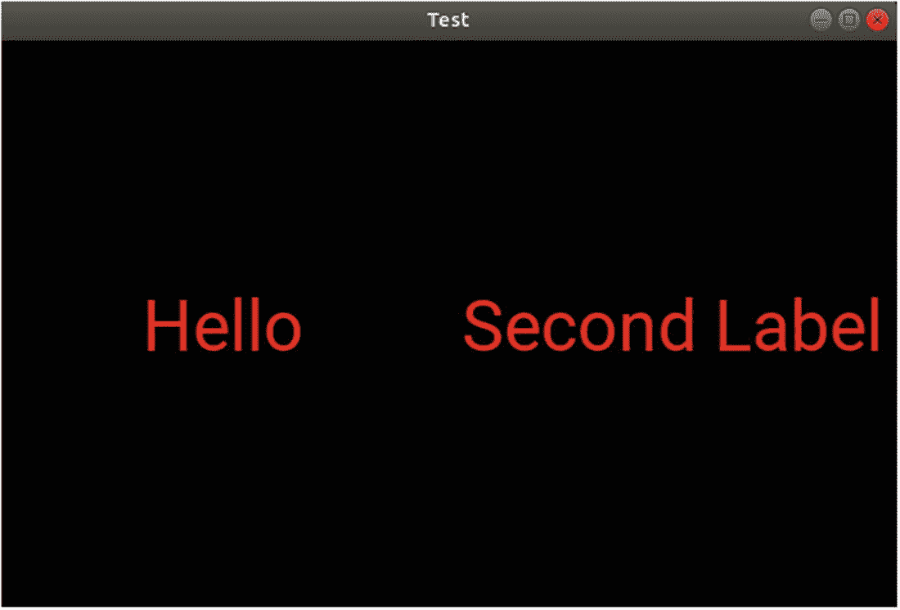
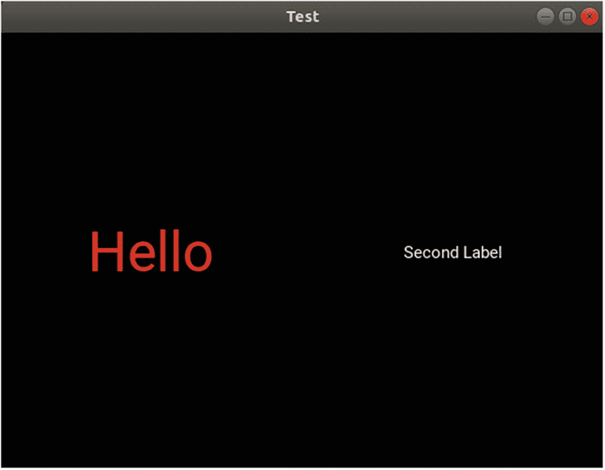
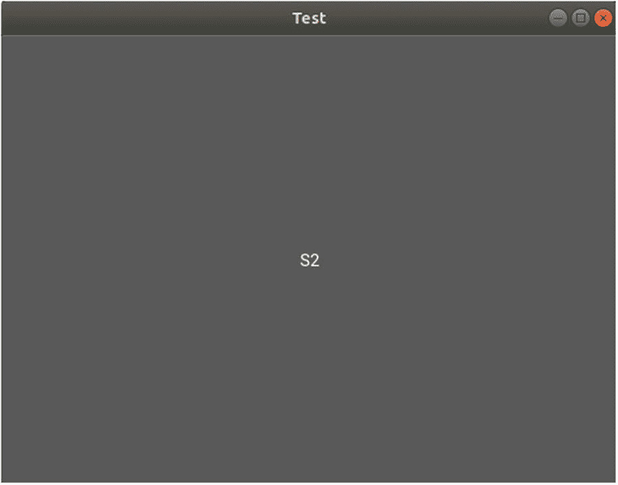
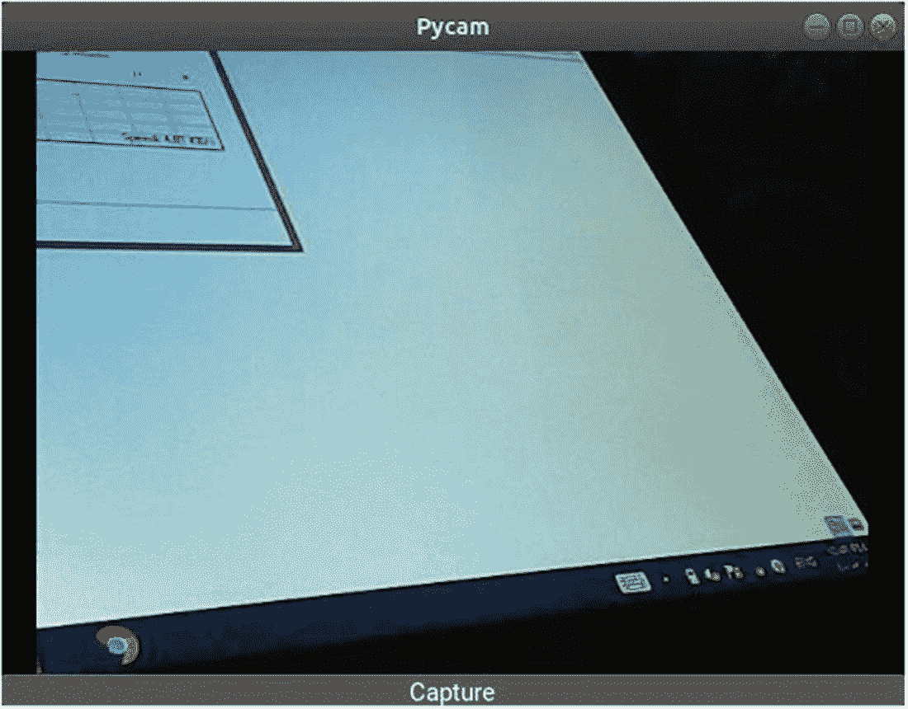

# 四、创建和管理多个屏幕

在前一章中，我们使用相机小部件访问了 Android 相机。引入了 Kivy 画布来调整摄像机的旋转。为了限制给定 canvas 指令对某些小部件的影响，我们讨论了`PushMatrix`和`PopMatrix`指令。之后，我们创建了一个 Android Kivy 应用来连续捕捉图像并将它们发送到 Flask 服务器，后者将它们显示在一个 HTML 页面中。

在这一章中，我们通过将按钮分离到不同的屏幕来创建一个更方便的设计。Kivy 支持用于构建屏幕的`Screen`类和用于管理此类屏幕的`ScreenManager`类。我们可以从一个屏幕导航到另一个屏幕。本章从讨论如何创建定制小部件开始，这将帮助我们理解如何创建一个具有多个屏幕的应用。

## 修改现有小部件

Kivy 支持许多现有的小部件，比如`Button`、`Label`、`TextInput`等等。它支持修改现有的小部件来覆盖它们的默认行为。我们可以使用`Label`小部件作为测试用例。

`Label`类包含一些默认值作为它的属性。例如，默认情况下，text 属性设置为空字符串，文本颜色为白色，默认字体大小等于 15 SP(与缩放比例无关的像素)。我们将根据清单 4-1 中显示的 KV 代码覆盖这三个属性。标签的文字设置为`"Hello"`，文字颜色为红色，字体大小为 50 SP。

```py
Label:
    text: "Hello"
    color: 1,0,0,1
    font_size: "50sp"

Listing 4-1Overriding Properties of a Widget Inside the KV File

```

清单 4-2 中显示的 Python 代码创建了一个名为`TestApp`的新类，该类扩展了用于构建新应用的`kivy.app.App`类。它假设您将之前的 KV 代码保存在一个名为`test.kv`的文件中。

```py
import kivy.app

class TestApp(kivy.app.App):
    pass

app = TestApp()
app.run()

Listing 4-2The Generic Code for Building a Kivy Application

```

当您运行应用时，您将在图 4-1 中看到结果。属性已正确更改。您可能想知道这些属性是否会因新标签而改变。我们可以通过创建一个新的标签小部件来回答这个问题。


图 4-1

一个只有标签部件的 Kivy 应用

清单 4-3 中的新 KV 代码创建了一个保存两个标签的`BoxLayout`。第一个标签的属性是根据前面的示例设置的，而第二个标签只是将其文本更改为“第二个标签”。

```py
BoxLayout:
    Label:
        text: "Hello"
        color: 1,0,0,1
        font_size: "50sp"
    Label:
        text: "Second Label"

Listing 4-3Adding Two Label Widgets to the Application Inside the BoxLayout Root Widget

```

运行应用后，第二个标签没有根据图 4-2 中的窗口改变颜色和字体大小。原因是这两个标签都是`Label`类的独立实例。当创建一个新实例时，它从`Label`类继承属性的默认值。如果给定实例的某些属性发生了更改，这并不意味着其他实例的属性也会发生更改。为了使两个标签具有相同的文本颜色，我们可以改变`Label`类的`color`属性。因此，它的所有实例都将继承这种颜色。


图 4-2

仅覆盖一个标签小部件的属性，而将另一个设置为默认值

为了编辑 KV 文件中的类，类名被插入到`<>`之间，没有任何缩进。清单 4-4 中的 KV 文件覆盖了`Label`类的文本颜色和字体大小属性。通过创建`Label`类的两个实例，两者都将根据图 4-3 继承文本颜色和字体大小。



图 4-3

更改所有标签小部件的属性

```py
BoxLayout:
    Label:
        text: "Hello"
    Label:
        text: "Second Label"

<Label>:
    color: 1,0,0,1
    font_size: "50sp"

Listing 4-4Editing a Class in the KV Language

```

## 创建自定义小部件

清单 4-4 中的代码修改了`Label`类，使得它的所有实例都具有指定的文本颜色和字体大小。先前的属性会丢失。有时，我们可能会对此类属性以前的默认值感兴趣。

为了保持`Label`类以前的属性，我们可以创建一个新的自定义类来扩展`Label`类。这个自定义类继承了父类`Label`的默认属性，我们也可以修改它的一些属性。

清单 4-5 中的 KV 代码创建了一个名为`CustomLabel`的新定制类，它继承了`Label`类。因此，如果您需要创建一个带有默认属性的标签小部件，您可以实例化`Label`类。要使用修改后的属性，实例化`CustomLabel`类。在这个例子中，第一个标签是`CustomLabel`类的一个实例，其中文本颜色和字体大小被改变。第二个标签是`Label`类的一个实例，具有这两个属性的默认值。

```py
BoxLayout:
    CustomLabel:
        text: "Hello"
    Label:
        text: "Second Label"

<CustomLabel@Label>:
    color: 1,0,0,1
    font_size: "50sp"

Listing 4-5Creating a New Custom Label Widget by Extending the Label Class Inside the KV File

```

使用该 KV 文件运行应用后的结果如图 4-4 所示。



图 4-4

使用自定义标签小部件

### 在 Python 中定义自定义类

在清单 4-5 中，在 KV 文件中创建了一个名为`CustomLabel`的新定制类，它继承了`Label`类并修改了它的一些属性。在 KV 文件中进行继承限制了新类的能力，因为我们不能在其中编写函数。

我们可以创建新的类，并在 Python 代码中进行继承。然后，我们将在 KV 文件中引用这个类来修改它的属性。这有助于在新的自定义类中编写 Python 函数。清单 4-6 中的例子创建了一个名为`CustomLabel`的新的空类，它扩展了`Label`类。

```py
import kivy.app
import kivy.uix.label

class CustomLabel(kivy.uix.label.Label):
    pass

class TestApp(kivy.app.App):
    pass

app = TestApp()
app.run()

Listing 4-6Inheriting the Label Class Within the Python File

```

`test.kv`文件的内容如清单 4-7 所示。注意，我们只是引用了 KV 中现有的类，而不是像上一节那样创建它。

```py
BoxLayout:
    CustomLabel:
        text: "Hello"
    Label:
        text: "Second Label"

<CustomLabel>:
    color: 1,0,0,1
    font_size: "50sp"

Listing 4-7Referring to the Custom Class Created in the Python File Inside the KV File

```

我们可以通过在名为`MyLayout`的 Python 文件中创建一个扩展了`BoxLayout`类的类来稍微改变一下前面的应用，如清单 4-8 所示。因为这个类继承了`BoxLayout`类，所以我们可以在任何使用`BoxLayout`的地方使用它。例如，我们可以用新的类替换 KV 文件中的`BoxLayout`。

```py
import kivy.app
import kivy.uix.label
import kivy.uix.boxlayout

class CustomLabel(kivy.uix.label.Label):
    pass

class MyLayout(kivy.uix.boxlayout.BoxLayout):
    pass

class TestApp(kivy.app.App):
    def build(self):
        return MyLayout()

app = TestApp()
app.run()

Listing 4-8Creating a New Custom Layout by Extending the BoxLayout Class

```

清单 4-9 中给出了新的 KV 文件。它通过在`<>`之间添加名称来引用自定义的`MyLayout`类。这个类有两个子部件，分别是`CustomLabel`和`Label`。

注意，我们必须在`TestApp`类中定义`build()`函数来返回`MyLayout`类的一个实例。这是因为 KV 文件本身不会为`TestApp`返回布局。KV 文件简单地创建了两个名为`MyLayout`和`CustomLabel`的定制小部件。

```py
<MyLayout>:
    CustomLabel:
        text: "Hello"
    Label:
        text: "Second Label"

<CustomLabel>:
    color: 1,0,0,1
    font_size: "50sp"

Listing 4-9Referencing the Custom BoxLayout Class Inside the KV File

```

我们还可以根据清单 4-10 中的 KV 文件返回 KV 文件中 TestApp 类的布局。在本例中，KV 文件定义了两个新的小部件，并返回了一个名为`MyLayout`的小部件。这个小部件代表了`TestApp`类的布局。Python 代码目前不必实现`build()`函数。

```py
MyLayout:

<MyLayout>:
    CustomLabel:
        text: "Hello"
    Label:
        text: "Second Label"

<CustomLabel>:
    color: 1,0,0,1
    font_size: "50sp"

Listing 4-10Using the Custom BoxLayout Class

```

此时，我们能够在 Python 文件中创建一个新的类来扩展一个小部件类，在 KV 文件中引用它，并修改它的一些属性。这使我们能够开始学习如何创建一个具有多个屏幕的应用。

## 创建和管理屏幕

以前，在构建应用时会创建一个自定义类来扩展`kivy.app.App`类。该应用有一个窗口，我们可以在其中添加小部件。所有小工具都在一个屏幕内。有时，我们需要将同一个应用的小部件组织到不同的屏幕中，每个屏幕做不同的工作。Kivy 里的屏幕和 Android 里的活动差不多。一个 Android 应用可以有多个活动，一个 Kivy 应用可以有多个屏幕。

为了创建一个屏幕，我们将扩展`kivy.uix.screenmanager.Screen`类，而不是扩展`kivy.app.App`类。清单 4-11 显示了创建两个名为`Screen1`和`Screen2`的类的 Python 文件，每个屏幕一个，扩展了`Screen`类。还有一个应用类叫做`TestApp`。

```py
import kivy.app
import kivy.uix.screenmanager

class Screen1(kivy.uix.screenmanager.Screen):
    pass

class Screen2(kivy.uix.screenmanager.Screen):
    pass

class TestApp(kivy.app.App):
    pass

app = TestApp()
app.run()

Listing 4-11Creating Two Screens by Extending the Screen Class

```

根据清单 4-11 中的 Python 代码，创建了两个空屏幕。它们的布局在与该应用相关的`test.kv`文件中给出，如清单 4-12 所示。注意屏幕类名写在`<>`之间。每个屏幕都有一个`name`属性。两个屏幕的名字分别是`Screen1`和`Screen2`。有一个屏幕管理器有两个孩子，这是两个屏幕。屏幕管理器有一个名为`current`的属性，它告诉窗口中哪个屏幕当前是活动的。该属性接受屏幕名称。每个屏幕都有一个名为`manager`的属性，对应于屏幕的管理者。我们可以用它来访问 KV 文件中的管理器。

```py
ScreenManager:
   Screen1:
   Screen2:

<Screen1>:
    name: "Screen1"
    Button:
        text: "Button @ Screen 1"
        on_press: root.manager.current = "Screen2"

<Screen2>:
    name: "Screen2"
    Button:
        text: "Button @ Screen 2"
        on_press: root.manager.current = "Screen1"

Listing 4-12Defining the Layout of the Two Screens and Adding Them as Children to the ScreenManager Class

```

为了从一个屏幕切换到另一个屏幕，我们在每个屏幕上添加了一个按钮。当这样的按钮被按下时，使用`root.manager.current`属性改变当前屏幕。在第一个屏幕中，当前屏幕变为第二个屏幕。第二个屏幕的情况正好相反。如果当前属性没有在屏幕管理器中指定，它默认为管理器中的第一个屏幕。图 4-5 显示了运行应用后的结果。


图 4-5

屏幕管理器中添加的第一个屏幕显示为应用启动屏幕

点击按钮使用管理器的`current`属性改变当前屏幕，如图 4-6 所示。



图 4-6

从一个屏幕移动到另一个屏幕

我们可以明确指定当应用开始使用`current`属性时应该显示哪个屏幕，如清单 4-13 所示。当应用启动时，它将打开第二个屏幕。

```py
ScreenManager:
   current: "Screen2"
   Screen1:
   Screen2:

Listing 4-13Using the current Property of the ScreenManager Class to Explicitly Specify the Startup Screen

```

### 访问屏幕内的小部件

添加屏幕及其管理器后，小组件树如下所示。根小部件是`ScreenManager`，它包含两个子部件`Screen`。每个屏幕都有一个`Button`小部件。为了理解如何访问树中的特定部件，研究部件树是很重要的。

*   应用
    *   Root(屏幕管理器)
        *   屏幕
            1.  纽扣

        *   屏幕 2
            1.  纽扣

假设我们需要从 KV 文件访问第一个屏幕中的按钮。我们如何做到这一点？首先，我们需要使用`app`关键字访问应用本身。然后，使用`root`关键字访问应用的根小部件。注意，根小部件是一个`ScreenManager`。因此，当前命令是`app.root`。根小部件中的子部件是可以使用`screens`属性访问的屏幕。`app.root.screens`命令返回**管理器**中可用屏幕的列表，如下一行所示:

```py
[<Screen name="Screen1">, <Screen name="Screen2">]

```

第一个屏幕是列表的第一个元素，因此可以使用索引 0 来访问。因此，访问第一个屏幕的完整命令是`app.root.screens[0]`。

在访问目标屏幕后，我们可以像以前一样使用`ids`字典访问其中的按钮。假设按钮的 ID 为`b1`。如果是这种情况，访问该按钮的命令如下:

```py
app.root.screens[0].ids["b1"]

```

在创建屏幕并使用屏幕管理器控制它们之后，我们可以开始修改前面的项目，将小部件分隔在两个屏幕上。

## 修改实时摄像机捕捉应用以使用屏幕

在前一章的清单 3-37 和 3-38 中，创建了一个 Kivy 应用，该应用持续捕获要发送到 HTTP 服务器的图像，在那里接收到的图像显示在一个 HTML 页面中。配置和捕获图像所需的所有小部件都在同一个屏幕上。在本节中，他们将被分成不同的屏幕，每个屏幕都有特定的工作要做。

第一步是通过添加两个屏幕来准备 Python 文件。第一个屏幕用要捕捉的图像的宽度和高度配置服务器。第二个屏幕捕捉图像并将其发送到服务器。清单 4-14 中修改后的 Python 代码有两个新类，名为`Configure`和`Capture`，它们扩展了`Screen`类。

```py
import kivy.app
import requests
import kivy.clock
import kivy.uix.screenmanager
import threading

class Configure(kivy.uix.screenmanager.Screen):
    pass

class Capture(kivy.uix.screenmanager.Screen):
    pass

class PycamApp(kivy.app.App):
    num_images = 0

    def cam_size(self):
        camera = self.root.screens[1].ids['camera']
        cam_width_height = {'width': camera.resolution[0], 'height': camera.resolution[1]}

        ip_addr = self.root.screens[0].ids['ip_address'].text

        port_number = self.root.screens[0].ids['port_number'].text
        url = 'http://' + ip_addr + ':' + port_number + '/camSize'

        try:
            self.root.screens[0].ids['cam_size'].text = "Trying to Establish a Connection..."
            requests.post(url, params=cam_width_height)
            self.root.screens[0].ids['cam_size'].text = "Done."
            self.root.current = "capture"
        except requests.exceptions.ConnectionError:
            self.root.screens[0].ids['cam_size'].text = "Connection Error! Make Sure Server is Active."

    def capture(self):
        kivy.clock.Clock.schedule_interval(self.upload_images, 1.0)

    def upload_images(self, *args):
        self.num_images = self.num_images + 1
        print("Uploading image", self.num_images)

        camera = self.root.screens[1].ids['camera']

        print("Image Size ", camera.resolution[0], camera.resolution[1])
        print("Image corner ", camera.x, camera.y)

        pixels_data = camera.texture.get_region(x=camera.x, y=camera.y, width=camera.resolution[0], height=camera.resolution[1]).pixels

        ip_addr = self.root.screens[0].ids['ip_address'].text

        port_number = self.root.screens[0].ids['port_number'].text
        url = 'http://' + ip_addr + ':' + port_number + '/'
        files = {'media': pixels_data}

        t = threading.Thread(target=self.send_files_server, args=(files, url))
        t.start()

    def build(self):
        pass

    def send_files_server(self, files, url):
        try:
            requests.post(url, files=files)
        except requests.exceptions.ConnectionError:
            self.root.screens[1].ids['capture'].text = "Connection Error! Make Sure Server is Active."

app = PycamApp()
app.run()

Listing 4-14Using the Screen Class to Redesign the Live Camera Capture Application Created in Listing 3-37

```

KV 文件中的小部件树如下所示。请注意，小部件在两个屏幕上是分开的。

*   应用
    *   根(`ScreenManager`)

    *   配置屏幕
        *   `BoxLayout`
            *   `Label`

            *   `TextInput` ( `ip_address`)

            *   `TextInput` ( `port_number`)

            *   `Button` ( `cam_size`)

        *   捕获屏幕
            *   `BoxLayout`
                *   `Camera` ( `camera`)

                *   `Button` ( `capture`)

应用的 KV 文件如清单 4-15 所示，其中每个屏幕都有一个`BoxLayout`用于分组其小部件。配置屏幕有一个`Label`小部件，为用户显示说明。有两个`TextInput`小部件，用户可以在其中输入 IPv4 地址和服务器监听请求的端口号。它还包括`Button`小部件，用于根据摄像机的尺寸发送`POST`消息。捕捉屏幕包括相机小部件本身和一个开始捕捉图像的按钮。

两个屏幕都分组在`ScreenManager`下。请注意，配置屏幕是添加到管理器的第一个屏幕，因此它将在应用启动时显示。

```py
ScreenManager:
    Configure:
    Capture:

<Capture>:
    name: "capture"
    BoxLayout:
        orientation: "vertical"
        Camera:
            id: camera
            size_hint_y: 18
            resolution: (1024, 1024)
            allow_stretch: True
            play: True
            canvas.before:
                PushMatrix:
                Rotate:
                    angle: -90
                    origin: root.width/2, root.height/2
            canvas.after:
                PopMatrix:
        Button:
            id: capture
            font_size: 30
            text: "Capture"
            size_hint_y: 1
            on_press: app.capture()

<Configure>:
    name: "configure"

    BoxLayout:
        orientation: "vertical"
        Label:
            text: "1) Enter the IPv4 address of the server.\n2) Enter the port number. \n3) Press the Configure Server button. \nMake sure that the server is active."
            font_size: 20
            text_size: self.width, None
            size_hint_y: 1
        TextInput:
            text: "192.168.43.231"
            font_size: 30
            id: ip_address
            size_hint_y: 1
        TextInput:
            text: "6666"
            font_size: 30
            id: port_number
            size_hint_y: 1
        Button:
            id: cam_size
            font_size: 30
            text_size: self.width, None
            text: "Configure Server"
            size_hint_y: 1
            on_press: app.cam_size()

Listing 4-15The KV File of the Live Camera Capture Project After Using Screens

```

一旦用户按下配置服务器的按钮，就会返回摄像头小部件的尺寸，并根据从`TextInput`小部件中检索到的 IPv4 地址和端口号向服务器发送一条`POST`消息。第一屏如图 4-7 所示。


图 4-7

指定 IP 和端口号的应用的主屏幕

消息发送成功后，管理器的当前屏幕变为截图屏幕，如图 4-8 所示。在该屏幕中，用户可以按下捕获按钮，以便开始捕获并将捕获的图像发送到服务器。



图 4-8

应用中的第二个屏幕，在这里可以捕捉图像并将其发送到服务器

请注意如何从小部件树中访问小部件。如前一节所述，`ScreenManager`是根，有两个屏幕。每个屏幕都有许多小部件，可以使用它们的 id 进行访问。例如，可以使用以下命令从 KV 文件访问 Camera 小部件。

```py
app.root.screens[1].ids['camera']

```

在这个项目中，我们对从 KV 文件引用小部件不感兴趣，而是从 Python 文件引用。例如，必须从`PycamApp`类的`cam_size()`函数内部访问 Camera 小部件。在这种情况下，与前一个命令的区别在于如何访问应用。可以使用`self`关键字来引用它。因此，用于访问 Python 中的 Camera 小部件的命令如下。

```py
self.root.screens[1].ids['camera']

```

我们使用索引为`1`的`screen`,因为 Camera 小部件位于其中。这样，我们成功地从索引为`1`的第二个屏幕访问了一个小部件。如果我们需要访问 ID 为`ip_address`的`TextInput`小部件，这可以在 Python 代码的第一个屏幕中找到，那么使用下一个命令。除了小部件的 ID 之外，只需指定屏幕的索引。

```py
self.root.screens[0].ids['ip_address']

```

要访问端口号，使用下一个命令:

```py
self.root.screens[0].ids['port_number']

```

完成服务器端和客户端应用后，我们就可以开始发布它们了。

### 发布服务器端应用

为了从 Python 项目创建可执行文件，我们可以使用 PyInstaller 库。我们可以使用`pip install pyinstaller`命令安装这个库。

在构建可执行文件之前，我们可以稍微改变一下服务器应用。这是因为它不允许我们更改 IPv4 地址和端口号。我们曾经使用以下终端命令来执行服务器应用:

```py
ahmedgad@ubuntu:~/Desktop$ python3 FlaskServer.py

```

当从终端执行一个 Python 文件时，一些参数在`sys.argv`列表中传递给它。如果在终端中没有指定参数，那么列表中将有一个包含 Python 脚本名称的项目，可以通过以下命令访问该项目:

```py
sys.argv[0]

```

参数可以列在 Python 脚本的名称之后。例如，下一个命令将 IPv4 地址和端口号作为参数传递给脚本。

```py
ahmedgad@ubuntu:~/Desktop$ python3 FlaskServer.py 192.168.43.231 6666

```

为了访问 Python 脚本中的 IPv4 地址并将其存储在名为`ip_address`的变量中，我们使用了下一个命令。使用索引`1`,因为它是列表中的第二个参数。

```py
ip_address = sys.argv[1]

```

同样，使用下一个命令将端口号存储到`port_number`变量中。请注意，使用了索引`2`。

```py
port_number = sys.argv[2]

```

清单 4-16 中列出的服务器应用的新 Python 代码从终端参数中获取 IPv4 地址和端口号。在`app.run()`方法中，主机和端口参数从`ip_address`和`port_number`变量中取值，而不是静态定义的。

```py
import flask
import PIL.Image
import base64
import webbrowser
import sys
import os

app = flask.Flask(import_name="FlaskUpload")

cam_width = 0
cam_height = 0

html_opened = False

@app.route('/camSize', methods = ['GET', 'POST'])
def cam_size():
    global cam_width
    global cam_height

    cam_width = int(float(flask.request.args["width"]))
    cam_height = int(float(flask.request.args["height"]))

    print('Width',cam_width,'& Height',cam_height,'Received Successfully.')

    return "OK"

@app.route('/', methods = ['POST'])
def upload_file():
    global cam_width
    global cam_height
    global html_opened

    file_to_upload = flask.request.files['media'].read()

    image = PIL.Image.frombytes(mode="RGBA", size=(cam_width, cam_height), data=file_to_upload)
    image = image.rotate(-90)
    print('File Uploaded Successfully.')

    im_base64 = base64.b64encode(image.tobytes())

    html_code = '<html><head><meta http-equiv="refresh" content="1"><title>Displaying Uploaded Image</title></head><body><h1>Uploaded Image to the Flask Server</h1></body></html>'

    # The HTML page is not required to be opened from the Python code but open it yourself externally.
    html_url = os.getcwd()+"/templates/test.html"
    f = open(html_url,'w')
    f.write(html_code)
    f.close()

    if html_opened == False:
        webbrowser.open(html_url)
        html_opened = True

    return "SUCCESS"

ip_address = sys.argv[1]#"192.168.43.231"
port_number = sys.argv[2]#6666
app.run(host=ip_address, port=port_number, debug=True, threaded=True)

Listing 4-16Modified Python Code for the Server-Side Application for Fetching the IPv4 Address and Port Number from the Command-Line Arguments

```

安装后，可以使用以下命令将项目转换为可执行文件。只需将`<python-file-name>`替换为服务器的 Python 文件名。`--onefile`选项使 PyInstaller 生成一个二进制文件。只要未指定 Python 文件的完整路径，请确保在执行该文件的位置执行该命令。

```py
pyinstaller --onefile <python-file-name>.py

```

命令完成后，二进制文件将存在于`dist`文件夹中，根据 Python 文件名命名。PyInstaller 为正在使用的操作系统创建一个可执行文件。如果在 Linux 机器上执行这个命令，那么就会产生一个 Linux 二进制文件。如果在 Windows 中执行，那么将创建一个 Windows 可执行文件(`.exe`)。

可执行文件可以存放在您选择的存储库中，用户可以下载并运行服务器。Linux 可执行文件可在此页面下载，文件名为: [`https://www.linux-apps.com/p/1279651`](https://www.linux-apps.com/p/1279651) 。因此，为了运行服务器，只需下载文件并运行下面的终端命令。记得根据 CamShare 的当前路径更改终端的路径。

```py
ahmedgad@ubuntu:~/Desktop$ python3 CamShare 192.168.43.231 6666

```

### 将客户端 Android 应用发布到 Google Play

之前的 APK 文件只是用于调试，不能在 Google Play 上发布，因为它只接受发布版 apk。为了创建应用的发布版本，我们使用下面的命令:

```py
ahmedgad@ubuntu:~/Desktop$ buildozer android release

```

为了在 Google Play 上被接受，在您的发布 APK 上签名非常重要。有关签署 APK 的说明，请阅读本页: [`https://github.com/kivy/kivy/wiki/Creating-a-Release-APK`](https://github.com/kivy/kivy/wiki/Creating-a-Release-APK) 。还记得将目标 API 级别至少设置为 26，如前所述。

您可以在 Google Play 创建一个开发者帐户来发布您自己的应用。CamShare Android 应用可在此处获得: [`https://play.google.com/store/apps/details?id=camshare.camshare.myapp`](https://play.google.com/store/apps/details%253Fid%253Dcamshare.camshare.myapp) 。

您可以下载 Android 应用，将其连接到服务器，并捕捉将在服务器上的 HTML 页面中显示的图像。

## 摘要

作为总结，本章介绍了通过扩展 Kivy 小部件来构建定制小部件。这允许我们编辑它们的属性一次，并多次使用它们。本章还介绍了用于跨多个屏幕组织应用小部件的`Screen`和`ScreenManager`类。为了指定应用一启动就显示哪个屏幕，`ScreenManager`的当前属性被设置为所需屏幕的名称。这些屏幕用于重新设计第三章中现场摄像机捕捉项目的界面。

在下一章中，将应用本章和所有前面章节中介绍的 Kivy 概念来创建一个多关卡跨平台游戏，在该游戏中，玩家收集大量随机分布在屏幕上的硬币。会有怪物试图杀死玩家。下一章通过让游戏开发变得非常简单并解释每一行代码，让读者从零到英雄。