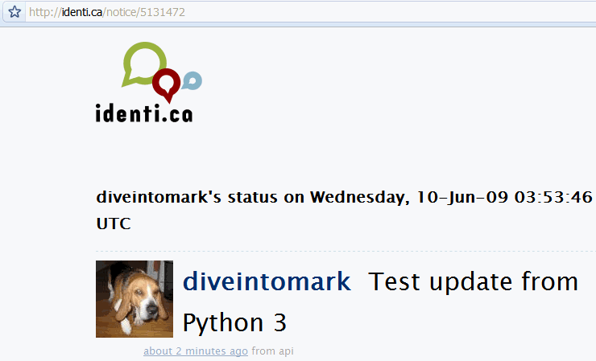

# Chapter 14 HTTP Web 服务

# Chapter 14 HTTP Web 服务

> " A ruffled mind makes a restless pillow. " — Charlotte Brontë

## 深入

简单地讲，HTTP web 服务是指以编程的方式直接使用 HTTP 操作从远程服务器发送和接收数据。如果你要从服务器获取数据，使用 HTTP `GET`；如果你要向服务器发送新数据，使用 HTTP `POST`. 一些更高级的 HTTP Web 服务 API 也允许使用 HTTP `PUT` 和 HTTP `DELETE`来创建、修改和删除数据。 换句话说，HTTP 协议中的“verbs (动作)” (`GET`, `POST`, `PUT` 和 `DELETE`) 可以直接对应到应用层的操作：获取，创建，修改，删除数据。

这个方法主要的优点是简单, 它的简单证明是受欢迎的。数据 — 通常是 XML 或 JSON — 可以事先创建好并静态的存储下来 ，或者由服务器端脚本动态生成, 并且所有主要的编程语言(当然包括 Python)都包含 HTTP 库用于下载数据。调试也很方便; 由于 HTTP web 服务中每一个资源都有一个唯一的地址(以 URL 的形式存在), 你可以在浏览器中加载它并且立即看到原始的数据.

HTTP web 服务示例:

*   [Google Data API](http://code.google.com/apis/gdata/) 允许你同很多类型的 Google 服务交互, 包括 [Blogger](http://www.blogger.com/) 和 [YouTube](http://www.youtube.com/)。
*   [Flickr Services](http://www.flickr.com/services/api/) 允许你向[Flickr](http://www.flickr.com/)下载和上传图片。
*   [Twitter API](http://apiwiki.twitter.com/) 允许你在[Twitter](http://twitter.com/)发布状态更新。
*   […以及更多](http://www.programmableweb.com/apis/directory/1?sort=mashups)

Python 3 带有两个库用于和 HTTP web 服务交互:

*   [`http.client`](http://docs.python.org/3.1/library/http.client.html) 是实现了[RFC 2616](http://www.w3.org/Protocols/rfc2616/rfc2616.html), HTTP 协议的底层库.
*   [`urllib.request`](http://docs.python.org/3.1/library/urllib.request.html) 建立在`http.client`之上一个抽象层。 它为访问 HTTP 和 FTP 服务器提供了一个标准的 API，可以自动跟随 HTTP 重定向， 并且处理了一些常见形式的 HTTP 认证。

那么，你应该用哪个呢？两个都不用。取而代之, 你应该使用 [`httplib2`](http://code.google.com/p/httplib2/),一个第三方的开源库,它比`http.client`更完整的实现了 HTTP 协议，同时比`urllib.request`提供了更好的抽象。

要理解为什么`httplib2`是正确的选择，你必须先了解 HTTP。

## HTTP 的特性

有五个重要的特性所有的 HTTP 客户端都应该支持。

### 缓存

关于 web 服务最需要了解的一点是网络访问是极端昂贵的。我并不是指“美元”和“美分”的昂贵(虽然带宽确实不是免费的)。我的意思是需要一个非常长的时间来打开一个连接，发送请求，并从远程服务器响应。 即使在最快的宽带连接上，*延迟*（从发送一个请求到开始在响应中获得数据所花费的时间）仍然高于您的预期。路由器的行为不端，被丢弃的数据包，中间代理服务器被攻击 — 在公共互联网上[没有沉闷的时刻(never a dull moment)](http://isc.sans.org/)，并且你对此无能为力。

`Cache-Control: max-age` 的意思是“一个星期以内都不要来烦我。”

HTTP 在设计时就考虑到了缓存。有这样一类的设备(叫做 “缓存代理服务器”) ，它们的唯一的任务是就是呆在你和世界的其他部分之间来最小化网络请求。你的公司或 ISP 几乎肯定维护着这样的缓存代理服务器, 只不过你没有意识到而已。 它们的能够起到作用是因为缓存是内建在 HTTP 协议中的。

这里有一个缓存如何工作的具体例子。 你通过浏览器访问[`diveintomark.org`](http://diveintomark.org/)。该网页包含一个背景图片， [`wearehugh.com/m.jpg`](http://wearehugh.com/m.jpg)。当你的浏览器下载那张图片时,服务器的返回包含了下面的 HTTP 头:

```py
HTTP/1.1 200 OK
Date: Sun, 31 May 2009 17:14:04 GMT
Server: Apache
Last-Modified: Fri, 22 Aug 2008 04:28:16 GMT
ETag: "3075-ddc8d800"
Accept-Ranges: bytes
Content-Length: 12405
<mark>Cache-Control: max-age=31536000, public</mark>
<mark>Expires: Mon, 31 May 2010 17:14:04 GMT</mark>
Connection: close
Content-Type: image/jpeg 
```

`Cache-Control` 和 `Expires` 头告诉浏览器(以及任何处于你和服务器之间的缓存代理服务器) 这张图片可以缓存长达一年。 *一年!* 如果在明年，你访问另外一个也包含这张图片的页面，你的浏览器会从缓存中加载这样图片*而不会产生任何网络活动*.

等一下，情况实际上更好。比方说，你的浏览器由于某些原因将图片从本地缓存中移除了。可能是因为没有磁盘空间了或者是你清空了缓存，不管是什么理由。然而 HTTP 头告诉说这个数据可以被公共缓存代理服务器缓存(`Cache-Control`头中`public`关键字说明这一点)。缓存代理服务器有非常庞大的存储空间，很可能比你本地浏览器所分配的大的多。

如果你的公司或者 ISP 维护着这样一个缓存代理服务器，它很可能仍然有这张图片的缓存。 当你再次访问`diveintomark.org` 时, 你的浏览器会在本地缓存中查找这张图片, 它没有找到, 所以它发出一个网络请求试图从远程服务器下载这张图片。但是由于缓存代理服务器仍然有这张图片的一个副本，它将截取这个请求并从*它的*缓存中返回这张图片。 这意味这你的请求不会到达远程服务器; 实际上, 它根本没有离开你公司的网络。这意味着更快的下载(网络跃点变少了) 和节省你公司的花费(从外部下载的数据变少了)。

只有当每一个角色都做按协议来做时，HTTP 缓存才能发挥作用。一方面，服务器需要在响应中发送正确的头。另一方面，客户端需要在第二次请求同样的数据前理解并尊重这些响应头。 代理服务器不是灵丹妙药，它们只会在客户端和服务器允许的情况下尽可能的聪明。

Python 的 HTTP 库不支持缓存，而`httplib2`支持。

### 最后修改时间的检查

有一些数据从不改变，而另外一些则总是在变化。介于两者之间，在很多情况下数据还没变化但是*将来可能*会变化。 CNN.com 的供稿每隔几分钟就会更新，但我的博客的供稿可能几天或者几星期才会更新一次。在后面一种情况的时候，我不希望告诉客户端缓存我的供稿几星期，因为当我真的发表了点东西的时候，人们可能会几个星期后才能阅读到(由于他们遵循我的 cache 头—"几个星期内都不用检查这个供稿")。另一方面，如果供稿没有改变我也不希望客户端每隔 1 小时就来检查一下!

`304: Not Modified` 的意思是 “不同的日子，同样的数据(same shit, different day)。”

HTTP 对于这个问题也有一个解决方案。当你第一次请求数据时，服务器返回一个`Last-Modified`头。 顾名思义：数据最后修改的时间。`diveintomark.org`引用的这张背景图片包含一个`Last-Modified`头。

```py
HTTP/1.1 200 OK
Date: Sun, 31 May 2009 17:14:04 GMT
Server: Apache
<mark>Last-Modified: Fri, 22 Aug 2008 04:28:16 GMT</mark>
ETag: "3075-ddc8d800"
Accept-Ranges: bytes
Content-Length: 12405
Cache-Control: max-age=31536000, public
Expires: Mon, 31 May 2010 17:14:04 GMT
Connection: close
Content-Type: image/jpeg 
```

如果第二(第三，第四）次请求同样一个资源，你可以在你的请求中发送一个`If-Modified-Since`头，其值为你上次从服务器返回的时间。如果从那时开始，数据已经发成过变化，服务器会忽略`If-Modified-Since`头并返回新数据和`200`状态码给你。否则的话，服务器将发回一个特殊的 HTTP `304` 状态码, 它的含义是“从上次请求到现在数据没有发生过变化.” 你可以在命令行上使用[curl](http://curl.haxx.se/)来测试:

```py
you@localhost:~$ curl -I <mark>-H "If-Modified-Since: Fri, 22 Aug 2008 04:28:16 GMT"</mark> http://wearehugh.com/m.jpg
HTTP/1.1 304 Not Modified
Date: Sun, 31 May 2009 18:04:39 GMT
Server: Apache
Connection: close
ETag: "3075-ddc8d800"
Expires: Mon, 31 May 2010 18:04:39 GMT
Cache-Control: max-age=31536000, public 
```

为什么这是一个进步？因为服务器发送`304`时, *它没有重新发送数据*。你得到的仅仅是状态码。即使你的缓存副本已经过期，最后修改时间检查保证你不会在数据没有变化的情况下重新下载它。 (额外的好处是，这个`304` 响应同样也包含了缓存头。代理服务器会在数据已经“过期”的情况下仍然保留数据的副本; 希望数据*实际上*还没有改变，并且下一个请求以`304`状态码返回，并更新缓存信息。)

Python 的 HTTP 库不支持最后修改时间检查，而`httplib2` 支持。

### ETags

ETag 是另一个和最后修改时间检查达到同样目的的方法。使用 ETag 时，服务器在返回数据的同时在`ETag`头里返回一个哈希码(如何生成哈希码完全取决于服务器，唯一的要求是数据改变时哈希码也要改变) `diveintomark.org`引用的背景图片包含有`ETag` 头.

```py
HTTP/1.1 200 OK
Date: Sun, 31 May 2009 17:14:04 GMT
Server: Apache
Last-Modified: Fri, 22 Aug 2008 04:28:16 GMT
<mark>ETag: "3075-ddc8d800"</mark>
Accept-Ranges: bytes
Content-Length: 12405
Cache-Control: max-age=31536000, public
Expires: Mon, 31 May 2010 17:14:04 GMT
Connection: close
Content-Type: image/jpeg 
```

`ETag` 的意思是 “太阳底下没有什么新东西。”

当你再次请求同样的数据时，你在`If-None-Match`头里放入 ETag 值。如果数据没有发生改变，服务器将会返回`304`状态码。同最后修改时间检查一样，服务器发回的*只有*`304` 状态码，不会再一次给你发送同样的数据。通过在请求中包含 ETag 哈希码，你告诉服务器如果哈希值匹配就不需要重新发送同样的数据了，因为你仍然保留着上次收到的数据.

再一次使用`curl`:

```py
 HTTP/1.1 304 Not Modified
Date: Sun, 31 May 2009 18:04:39 GMT
Server: Apache
Connection: close
ETag: "3075-ddc8d800"
Expires: Mon, 31 May 2010 18:04:39 GMT
Cache-Control: max-age=31536000, public 
```

1.  ETag 一般使用引号包围, *但是引号是值的一部分*。它们不是分隔符；`ETag`头里面唯一的分隔符是`ETag` 和 `"3075-ddc8d800"`之间的冒号。这意味着你也需要将引号放在`If-None-Match`头发回给服务器。

Python HTTP 库不支持 ETag，而`httplib2`支持.

### 压缩

当我们谈论 HTTP web 服务的时候, 你总是会讨论到在线路上来回运送文本数据。可能是 XML，也可能是 JSON，抑或仅仅是纯文本。不管是什么格式，文本的压缩性能很好。XML 章节中的示例供稿在没压缩的情况下是 3070 字节，然而在 gzip 压缩后只有 941 字节。仅仅是原始大小的 30%!

HTTP 支持[若干种压缩算法](http://www.iana.org/assignments/http-parameters)。最常见的两种是[gzip](http://www.ietf.org/rfc/rfc1952.txt) 和 [deflate](http://www.ietf.org/rfc/rfc1951.txt)。当你通过 HTTP 请求资源时，你可以要求服务器以压缩格式返回资源。你在请求中包含一个`Accept-encoding`头，里面列出了你支持的压缩算法。如果服务器也支持其中的某一种算法，它就会返回给你压缩后的数据(同时通过`Content-encoding`头标识它使用的算法)。接下来的事情就是由你去解压数据了。

Python 的 HTTP 库不支持压缩，但`httplib2`支持。

### 重定向

[好的 URI 不会变化](http://www.w3.org/Provider/Style/URI)，但是有很多 URI 并没有那么好。网站可能会重新组织，页面移动到新位置。即使是 web 服务也可能重新安排。一个联合供稿`http://example.com/index.xml` 可能会移动到`http://example.com/xml/atom.xml`。或者当一个机构扩张和重组的时候，整个域名都可能移动; `http://www.example.com/index.xml` 变成 `http://server-farm-1.example.com/index.xml`.

`Location` 的意思是 “看那边!”

每一次你向 HTTP 服务器请求资源的时候, 服务器都会在响应中包含一个状态码。 状态码`200`的意思是一切正常，这就是你请求的页面; 状态码`404`的意思是找不到页面; (你很可能在浏览网页的时候碰到过 404)。300 系列的状态码意味着某种形式的重定向。

HTTP 有多种方法表示一个资源已经被移动。最常见两个技术是状态码`302` 和 `301`。 状态码 `302` 是一个 *临时重定向*; 它意味着, 资源被被临时从这里移动走了; (并且临时地址在`Location` 头里面给出)。状态码`301`是*永久重定向*; 它意味着，资源被永久的移动了; (并且在`Location`头里面给出了新的地址)。如果你得到`302`状态码和一个新地址, HTTP 规范要求你访问新地址来获得你要的资源，但是下次你要访问同样的资源的时候你应该重新尝试旧的地址。但是如果你得到`301`状态码和新地址, 你从今以后都应该使用新的地址。

`urllib.request`模块在从 HTTP 服务器收到对应的状态码的时候会自动“跟随”重定向, 但它不会告诉你它这么干了。你最后得到了你请求的数据，但是你永远也不会知道下层的库友好的帮助你跟随了重定向。结果是，你继续访问旧的地址，每一次你都会得到新地址的重定向，每一次`urllib.request`模块都会友好的帮你跟随重定向。换句话说，它将永久重定向当成临时重定向来处理。这意味着两个来回而不是一个，这对你和服务器都不好。

`httplib2` 帮你处理了永久重定向。它不仅会告诉你发生了永久重定向，而且它会在本地记录这些重定向，并且在发送请求前自动重写为重定向后的 URL。

## 避免通过 HTTP 重复地获取数据

我们来举个例子，你想要通过 HTTP 下载一个资源, 比如说一个 Atom 供稿。作为一个供稿, 你不会只下载一次，你会一次又一次的下载它。 (大部分的供稿阅读器会美一小时检查一次更新。) 让我们先用最粗糙和最快的方法来实现它，接着再来看看怎样改进。

```py
>>> import urllib.request
>>> a_url = 'http://diveintopython3.org/examples/feed.xml'

<class 'bytes'>
>>> print(data)
<?xml version='1.0' encoding='utf-8'?>
<feed xmlns='http://www.w3.org/2005/Atom' xml:lang='en'>
  <title>dive into mark</title>
  <subtitle>currently between addictions</subtitle>
  <id>tag:diveintomark.org,2001-07-29:/</id>
  <updated>2009-03-27T21:56:07Z</updated>
  <link rel='alternate' type='text/html' href='http://diveintomark.org/'/>
  … 
```

1.  在 Python 中通过 HTTP 下载东西是非常简单的; 实际上，只需要一行代码。`urllib.request`模块有一个方便的函数`urlopen()` ，它接受你所要获取的页面地址，然后返回一个类文件对象，您只要调用它的`read()`方法就可以获得网页的全部内容。没有比这更简单的了。
2.  `urlopen().read()`方法总是返回`bytes`对象,而不是字符串。记住字节仅仅是字节，字符只是一种抽象。 HTTP 服务器不关心抽象的东西。如果你请求一个资源，你得到字节。 如果你需要一个字符串，你需要确定[字符编码](http://feedparser.org/docs/character-encoding.html),并显式的将其转化成字符串。

那么，有什么问题呢？作为开发或测试中的快速试验，没有什么不妥的地方。我总是这么干。我需要供稿的内容，然后我拿到了它。相同的技术对任何网页都有效。但一旦你考虑到你需要定期访问 Web 服务的时候，(*例如* 每隔 1 小时请求一下这个供稿), 这样的做法就显得很低效和粗暴了。

## 线路上是什么？

为了说明为什么这是低效和粗暴的，我们来打开 Python 的 HTTP 库的调试功能，看看什么东西被发送到了线路上(即网络上).

```py
>>> from http.client import HTTPConnection

>>> from urllib.request import urlopen

Connection: close
reply: 'HTTP/1.1 200 OK'
…further debugging information omitted… 
```

1.  正如我在这章开头提到的，`urllib.request` 依赖另一个标准 Python 库, `http.client`。正常情况下你不需要直接接触`http.client`。 (`urllib.request` 模块会自动导入它。) 我们在这里导入它是为了让我们能够打开`HTTPConnection`类的调试开关，`urllib.request` 使用这个类去连接 HTTP 服务器。
2.  调式开关已经打开，有关 HTTP 请求和响应的信息会实时的打印出来。正如你所看见的，当你请求 Atom 供稿时, `urllib.request`模块向服务器发送了 5 行数据。
3.  第一行指定了你使用的 HTTP 方法和你访问的资源的路径(不包含域名)。
4.  第二行指定了你请求的供稿所在的域名。
5.  第三行指定客户端支持的压缩算法。我之前提到过，`urllib.request` 默认不支持压缩。
6.  第四行说明了发送请求的库的名字。默认情况下是`Python-urllib`加上版本号。`urllib.request`和`httplib2`都支持更改用户代理, 直接向请求里面加一个`User-Agent`头就可以了(默认值会被覆盖).

我们下载了 3070 字节，但其实我们可以只下载 941 个字节.

现在让我们来看看服务器返回了什么。

```py
# continued from previous example

Server: Apache

Accept-Ranges: bytes

Expires: Mon, 01 Jun 2009 19:23:06 GMT
Vary: Accept-Encoding
Connection: close
Content-Type: application/xml

>>> len(data)
3070 
```

1.  `urllib.request.urlopen()`函数返回的`response`对象包含了服务器返回的所有 HTTP 头。它也提供了下载实际数据的方法，这个我们等一下讲。
2.  服务器提供了它处理你的请求时的时间。
3.  这个响应包含了`Last-Modified`头。
4.  这个响应包含了`ETag`头。
5.  数据的长度是 3070 字节。请注意什么东西*没有*出现在这里: `Content-encoding`头。你的请求表示你只接受未压缩的数据，(`Accept-encoding: identity`), 然后当然，响应确实包含未压缩的数据。
6.  这个响应包含缓存头，表明这个供稿可以缓存长达 24 小时。(86400 秒).
7.  最后，通过调用`response.read()`下载实际的数据. 你从`len()`函数可以看出，一下子就把整个 3070 个字节下载下来了。

正如你所看见的，这个代码已经是低效的了；它请求(并接收)了未压缩的数据。我知道服务器实际上是支持 gzip 压缩的, 但 HTTP 压缩是一个可选项。我们不主动要求，服务器不会执行。这意味这在可以只下载 941 字节的情况下我们下载了 3070 个字节。Bad dog, no biscuit.

别急，还有更糟糕的。为了说明这段代码有多么的低效，让我再次请求一下同一个供稿。

```py
# continued from the previous example
>>> response2 = urlopen('http://diveintopython3.org/examples/feed.xml')
send: b'GET /examples/feed.xml HTTP/1.1
Host: diveintopython3.org
Accept-Encoding: identity
User-Agent: Python-urllib/3.1'
Connection: close
reply: 'HTTP/1.1 200 OK'
…further debugging information omitted… 
```

注意到这个请求有什么特别之处吗？它没有变化。它同第一个请求完全一样。没有`If-Modified-Since`头. 没有`If-None-Match`头. 没有尊重缓存头，也仍然没有压缩。

然后，当你发送同样的请求的时候会发生什么呢？你又一次得到同样的响应。

```py
# continued from the previous example

Date: Mon, 01 Jun 2009 03:58:00 GMT
Server: Apache
Last-Modified: Sun, 31 May 2009 22:51:11 GMT
ETag: "bfe-255ef5c0"
Accept-Ranges: bytes
Content-Length: 3070
Cache-Control: max-age=86400
Expires: Tue, 02 Jun 2009 03:58:00 GMT
Vary: Accept-Encoding
Connection: close
Content-Type: application/xml
>>> data2 = response2.read()

3070

True 
```

1.  服务器仍然在发送同样的聪明的头: `Cache-Control` 和 `Expires` 用于允许缓存, `Last-Modified` 和 `ETag`用于“是否变化”的跟踪。甚至是`Vary: Accept-Encoding`头暗示只要你请求，服务器就能支持压缩。但是你没有。
2.  再一次，获取这个数据下载了一共 3070 个字节…
3.  …和你上一次下载的 3070 字节完全一致。

HTTP 设计的能比这样工作的更好。 `urllib`使用 HTTP 就像我说西班牙语一样 — 可以表达基本的意思，但是不足以保持一个对话。HTTP 是一个对话。是时候更新到一个可以流利的讲 HTTP 的库了。

## 介绍 `httplib2`

在你使用`httplib2`前, 你需要先安装它。 访问[`code.google.com/p/httplib2/`](http://code.google.com/p/httplib2/) 并下载最新版本。`httplib2`对于 Python 2.x 和 Python 3.x 都有对应的版本; 请确保你下载的是 Python 3 的版本, 名字类似`httplib2-python3-0.5.0.zip`。

解压该档案，打开一个终端窗口, 然后切换到刚生成的`httplib2`目录。在 Windows 上，请打开`开始`菜单, 选择`运行`, 输入`cmd.exe` 最后按`回车(ENTER)`.

```py
c:\Users\pilgrim\Downloads> <mark>dir</mark>
 Volume in drive C has no label.
 Volume Serial Number is DED5-B4F8

 Directory of c:\Users\pilgrim\Downloads

07/28/2009  12:36 PM    <DIR>          .
07/28/2009  12:36 PM    <DIR>          ..
07/28/2009  12:36 PM    <DIR>          httplib2-python3-0.5.0
07/28/2009  12:33 PM            18,997 httplib2-python3-0.5.0.zip
               1 File(s)         18,997 bytes
               3 Dir(s)  61,496,684,544 bytes free

c:\Users\pilgrim\Downloads> <mark>cd httplib2-python3-0.5.0</mark>
c:\Users\pilgrim\Downloads\httplib2-python3-0.5.0> <mark>c:\python31\python.exe setup.py install</mark>
running install
running build
running build_py
running install_lib
creating c:\python31\Lib\site-packages\httplib2
copying build\lib\httplib2\iri2uri.py -> c:\python31\Lib\site-packages\httplib2
copying build\lib\httplib2\__init__.py -> c:\python31\Lib\site-packages\httplib2
byte-compiling c:\python31\Lib\site-packages\httplib2\iri2uri.py to iri2uri.pyc
byte-compiling c:\python31\Lib\site-packages\httplib2\__init__.py to __init__.pyc
running install_egg_info
Writing c:\python31\Lib\site-packages\httplib2-python3_0.5.0-py3.1.egg-info 
```

在 Mac OS X 上, 运行位于`/Applications/Utilities/`目录下的`Terminal.app`程序。在 Linux 上，运行`终端(Terminal)`程序, 该程序一般位于你的`应用程序`菜单，在`Accessories` 或者 `系统(System)`下面。

```py
you@localhost:~/Desktop$ <mark>unzip httplib2-python3-0.5.0.zip</mark>
Archive:  httplib2-python3-0.5.0.zip
  inflating: httplib2-python3-0.5.0/README
  inflating: httplib2-python3-0.5.0/setup.py
  inflating: httplib2-python3-0.5.0/PKG-INFO
  inflating: httplib2-python3-0.5.0/httplib2/__init__.py
  inflating: httplib2-python3-0.5.0/httplib2/iri2uri.py
you@localhost:~/Desktop$ <mark>cd httplib2-python3-0.5.0/</mark>
you@localhost:~/Desktop/httplib2-python3-0.5.0$ <mark>sudo python3 setup.py install</mark>
running install
running build
running build_py
creating build
creating build/lib.linux-x86_64-3.1
creating build/lib.linux-x86_64-3.1/httplib2
copying httplib2/iri2uri.py -> build/lib.linux-x86_64-3.1/httplib2
copying httplib2/__init__.py -> build/lib.linux-x86_64-3.1/httplib2
running install_lib
creating /usr/local/lib/python3.1/dist-packages/httplib2
copying build/lib.linux-x86_64-3.1/httplib2/iri2uri.py -> /usr/local/lib/python3.1/dist-packages/httplib2
copying build/lib.linux-x86_64-3.1/httplib2/__init__.py -> /usr/local/lib/python3.1/dist-packages/httplib2
byte-compiling /usr/local/lib/python3.1/dist-packages/httplib2/iri2uri.py to iri2uri.pyc
byte-compiling /usr/local/lib/python3.1/dist-packages/httplib2/__init__.py to __init__.pyc
running install_egg_info
Writing /usr/local/lib/python3.1/dist-packages/httplib2-python3_0.5.0.egg-info 
```

要使用`httplib2`, 请创建一个`httplib2.Http` 类的实例。

```py
>>> import httplib2

200

b"<?xml version='1.0' encoding='utf-8'?>\r\n<feed xmlns="
>>> len(content)
3070 
```

1.  `httplib2`的主要接口是`Http`对象。你创建`Http`对象时总是应该传入一个目录名，具体原因你会在下一节看见。目录不需要事先存在，`httplib2`会在必要的时候创建它。
2.  一旦你有了`Http`对象, 获取数据非常简单，以你要的数据的地址作为参数调用`request()`方法就可以了。这会对该 URL 执行一个 HTTP `GET`请求. (这一章下面你会看见怎样执行其他 HTTP 请求, 比如 `POST`。)
3.  `request()` 方法返回两个值。第一个是一个`httplib2.Response`对象，其中包含了服务器返回的所有 HTTP 头。比如, `status`为`200` 表示请求成功。
4.  `content` 变量包含了 HTTP 服务器返回的实际数据。数据以`bytes`对象返回，不是字符串。 如果你需要一个字符串，你需要[确定字符编码](http://feedparser.org/docs/character-encoding.html)并自己进行转换。

> ☞你很可能只需要一个`httplib2.Http`对象。当然存在足够的理由来创建多个，但是只有当你清楚创建多个的原因的时候才应该这样做。从不同的 URL 获取数据不是一个充分的理由，重用`Http`对象并调用`request()`方法两次就可以了。

### 关于`httplib2`返回字节串而不是字符串的简短解释

字节串。字符串。真麻烦啊。为什么`httplib2`不能替你把转换做了呢？由于决定字符编码的规则依赖于你请求的资源的类型，导致自动转化很复杂。`httplib2`怎么知道你要请求的资源的类型呢？通常类型会在`Content-Type` HTTP 头里面列出,但是这是 HTTP 的可选特性，并且并非所有的 HTTP 服务器都支持。如果 HTTP 响应没有包含这个头，那就留给客户端去猜了。(这通常被称为“内容嗅探(content sniffing)” ，但它从来就不是完美的。)

如果你知道你期待的资源是什么类型的(这个例子中是 XML 文档), 也许你应该直接将返回的`字节串(bytes)`对象传给`xml.etree.ElementTree.parse()` 函数。只要(像这个文档一样)XML 文档自己包含字符编码信息，这是可以工作的。但是字符编码信息是一个可选特性并非所有 XML 文档包含这样的信息。如果一个 XML 文档不包含编码信息，客户端应该去查看`Content-Type` HTTP 头, 里面应该包含一个`charset`参数。

[I support RFC 3023 t-shirt](http://www.cafepress.com/feedparser)

但问题更糟糕。现在字符编码信息可能在两个地方：在 XML 文档自己内部，在`Content-Type` HTTP 头里面。如果信息在*两个*地方都出现了，哪个优先呢？根据[RFC 3023](http://www.ietf.org/rfc/rfc3023.txt) (我发誓，这不是我编的), 如果在`Content-Type` HTTP 头里面给出的媒体类型(media type)是`application/xml`, `application/xml-dtd`, `application/xml-external-parsed-entity`, 或者是任何`application/xml`的子类型，比如`application/atom+xml` 或者 `application/rss+xml` 亦或是 `application/rdf+xml`, 那么编码是

1.  `Content-Type` HTTP 头的`charset`参数给出的编码, 或者
2.  文档内的 XML 声明的`encoding`属性给出的编码, 或者
3.  UTF-8

相反，如果在`Content-Type` HTTP 头里面给出的媒体类型(media type)是`text/xml`, `text/xml-external-parsed-entity`, 或者任何`text/AnythingAtAll+xml`这样的子类型, 那么文档内的 XML 声明的`encoding`属性完全被忽略，编码是

1.  `Content-Type` HTTP 头的`charset`参数给出的编码, 或者
2.  `us-ascii`

而且这还只是针对 XML 文档的规则。对于 HTML 文档，网页浏览器创造了[用于内容嗅探的复杂规则(byzantine rules for content-sniffing)](http://www.adambarth.com/papers/2009/barth-caballero-song.pdf) [PDF], [我们正试图搞清楚它们。](http://www.google.com/search?q=barth+content-type+processing+model).

“[欢迎提交补丁](http://code.google.com/p/httplib2/source/checkout).”

### `httplib2`怎样处理缓存。

还记的在前一节我说过你总是应该在创建`httplib2.Http`对象是提供一个目录名吗? 缓存就是这样做的目的。

```py
# continued from the previous example

200

b"<?xml version='1.0' encoding='utf-8'?>\r\n<feed xmlns="
>>> len(content2)
3070 
```

1.  没什么惊奇的东西。跟上次一样，只不过你把结果放入两个新的变量。
2.  HTTP `状态(status)`码同上次一样还是`200`。
3.  下载的内容也一样。

谁关心这些东西啊？退出你的 Python 交互 shell 然后打开一个新的会话，我来给你演示。

```py
# NOT continued from previous example!
# Please exit out of the interactive shell
# and launch a new one.
>>> import httplib2

3070

200

True 
```

1.  让我们打开调试开关来看看线路上是什么。这是使用`httplib2`打开`http.client`调试开关的方法. `httplib2`会打印出发给服务器的所有数据以及一些返回的关键信息。
2.  使用同之前一样的目录创建`httplib2.Http`对象。
3.  请求同之前一样的 URL。 *什么也没有发生。* 更准确的说，没有东西发送到服务器，没有东西从服务器返回。没有任何形式的网络活动。
4.  但我们还是接收到了数据，实际上是所有的数据。
5.  我们也接收到表示请求成功的 HTTP 状态码。
6.  这里是奥秘所在: 响应是从`httplib2`的本地缓存构造出来的。你创建`httplib2.Http`对象是传入的目录里面保存了所有`httplib2`执行过的操作的缓存。

线路上有什么？没有东西。

> ☞如果你想要打开`httplib2`的调试开关，你需要设置一个模块级的常量(`httplib2.debuglevel`), 然后再创建`httplib2.Http`对象。如果你希望关闭调试，你需要改变同一个模块级常量, 接着创建一个新的`httplib2.Http`对象。

你刚刚请求过这个 URL 的数据。那个请求是成功的(`状态码: 200`)。该响应不仅包含 feed 数据，也包含一系列缓存头，告诉那些关注着的人这个资源可以缓存长达 24 小时(`Cache-Control: max-age=86400`, 24 小时所对应的秒数)。 `httplib2` 理解并尊重那些缓存头，并且它会在`.cache`目录(你在创建`Http`对象时提供的)保存之前的响应。缓存还没有过期，所以你第二次请求该 URL 的数据时, `httplib2`不会去访问网络，直接返回缓存着的数据。

我说的很简单，但是很显然在这简单后面隐藏了很多复杂的东西。`httplib2`会*自动*处理 HTTP 缓存，并且这是*默认的*行为. 如果由于某些原因你需要知道响应是否来自缓存，你可以检查 `response.fromcache`. 否则的话，它工作的很好。

现在，假设你有数据缓存着，但是你希望跳过缓存并且重新请求远程服务器。浏览器有时候会应用户的要求这么做。比如说，按`F5`刷新当前页面，但是按`Ctrl+F5`会跳过缓存并向远程服务器重新请求当前页面。你可能会想“嗯，我只要从本地缓存删除数据，然后再次请求就可以了。” 你可以这么干，但是请记住, 不只是你和远程服务器会牵扯其中。那些中继代理服务器呢？ 它们完全不受你的控制，并且它们可能还有那份数据的缓存，然后很高兴的将其返回给你, 因为(对它们来说)缓存仍然是有效的。

你应该使用 HTTP 的特性来保证你的请求最终到达远程服务器，而不是修改本地缓存然后听天由命。

```py
# continued from the previous example
>>> response2, content2 = h.request('http://diveintopython3.org/examples/feed.xml',

send: b'GET /examples/feed.xml HTTP/1.1
Host: diveintopython3.org
user-agent: Python-httplib2/$Rev: 259 $
accept-encoding: deflate, gzip
cache-control: no-cache'
reply: 'HTTP/1.1 200 OK'
…further debugging information omitted…
>>> response2.status
200

False

{'status': '200',
 'content-length': '3070',
 'content-location': 'http://diveintopython3.org/examples/feed.xml',
 'accept-ranges': 'bytes',
 'expires': 'Wed, 03 Jun 2009 00:40:26 GMT',
 'vary': 'Accept-Encoding',
 'server': 'Apache',
 'last-modified': 'Sun, 31 May 2009 22:51:11 GMT',
 'connection': 'close',
 '-content-encoding': 'gzip',
 'etag': '"bfe-255ef5c0"',
 'cache-control': 'max-age=86400',
 'date': 'Tue, 02 Jun 2009 00:40:26 GMT',
 'content-type': 'application/xml'} 
```

1.  `httplib2` 允许你添加任意的 HTTP 头部到发出的请求里。为了跳过*所有*缓存(不仅仅是你本地的磁盘缓存，也包括任何处于你和远程服务器之间的缓存代理服务器), 在`headers`字典里面加入`no-cache`头就可以了。
2.  现在你可以看见`httplib2`初始化了一个网络请求。`httplib2` 理解并尊重*两个方向*的缓存头， — 作为接受的响应的一部分以及*作为发出的请求的一部分*. 它注意到你加入了一个`no-cache`头，所以它完全跳过了本地的缓存，然后不得不去访问网络来请求数据。
3.  这个响应*不是*从本地缓存生成的。你当然知道这一点，因为你看见了发出的请求的调试信息。但是从程序上再验证一下也不错。
4.  请求成功；你再次从远程服务器下载了整个供稿。当然，服务器同供稿数据一起也返回了完整的 HTTP 头。这里面也包含缓存头, `httplib2`会使用它来更新它的本地缓存，希望你*下次*请求该供稿时能够避免网络请求。HTTP 缓存被设计为尽量最大化缓存命中率和最小化网络访问。即使你这一次跳过了缓存，服务器仍非常乐意你能缓存结果以备下一次请求

### `httplib2`怎么处理`Last-Modified`和`ETag`头

`Cache-Control`和`Expires` 缓存头 被称为*新鲜度指标(freshness indicators)*。他们毫不含糊告诉缓存，你可以完全避免所有网络访问，直到缓存过期。而这正是你在前一节所看到的: 给出一个新鲜度指标, `httplib2` *不会产生哪怕是一个字节的网络活动* 就可以提供缓存了的数据(当然除非你显式的要求跳过缓存).

那如果数据*可能*已经改变了, 但实际没有呢? HTTP 为这种目的定义了`Last-Modified`和`Etag`头。 这些头被称为*验证器(validators)*。如果本地缓存已经不是新鲜的，客户端可以在下一个请求的时候发送验证器来检查数据实际上有没有改变。如果数据没有改变，服务器返回`304`状态码，*但不返回数据*。 所以虽然还会在网络上有一个来回，但是你最终可以少下载一点字节。

```py
>>> import httplib2
>>> httplib2.debuglevel = 1
>>> h = httplib2.Http('.cache')

connect: (diveintopython3.org, 80)
send: b'GET / HTTP/1.1
Host: diveintopython3.org
accept-encoding: deflate, gzip
user-agent: Python-httplib2/$Rev: 259 $'
reply: 'HTTP/1.1 200 OK'

{'-content-encoding': 'gzip',
 'accept-ranges': 'bytes',
 'connection': 'close',
 'content-length': '6657',
 'content-location': 'http://diveintopython3.org/',
 'content-type': 'text/html',
 'date': 'Tue, 02 Jun 2009 03:26:54 GMT',
 <mark>'etag': '"7f806d-1a01-9fb97900"',</mark>
 <mark>'last-modified': 'Tue, 02 Jun 2009 02:51:48 GMT',</mark>
 'server': 'Apache',
 'status': '200',
 'vary': 'Accept-Encoding,User-Agent'}

6657 
```

1.  取代供稿，我们这一次要下载的是网站的主页，是 HTML 格式的。这是你第一次请求这个页面，`httplib2`没什么能做的，它在请求中发出最少量的头。
2.  响应包含了多个 HTTP 头… 但是没有缓存信息。然而，它包含了`ETag` 和 `Last-Modified`头。
3.  在我写这个例子的时候，这个页面有 6657 字节。在那之后，它很可能已经变了, 但是不用担心这一点。

```py
# continued from the previous example

connect: (diveintopython3.org, 80)
send: b'GET / HTTP/1.1
Host: diveintopython3.org

accept-encoding: deflate, gzip
user-agent: Python-httplib2/$Rev: 259 $'

True

200

'304'

6657 
```

1.  你再次请求同一个页面，使用同一个`Http`对象(以及同一个本地缓存)。
2.  `httplib2` 将`ETag` validator 通过`If-None-Match`头发送回服务器。
3.  `httplib2` 也将`Last-Modified` validator 通过`If-Modified-Since`头发送回服务器。
4.  服务器查看这些验证器(validators), 查看你请求的页面，然后判读得出页面在上次请求之后没有改变过, 所以它发回了`304` 状态码*不带数据*.
5.  回到客户端，`httplib2` 注意到`304`状态码并从它的缓存加载页面的内容。
6.  这可能会让人有些困惑。这里实际上有*两个* 状态码 — `304` (服务器这次返回的, 导致`httplib2`查看它的缓存), 和 `200` (服务器*上次*返回的, 并和页面数据一起保存在`httplib2`的缓存里)。`response.status`返回缓存里的那个。
7.  如果你需要服务器返回的原始的状态码，你可以从`response.dict`里面找到, 它是包含服务器返回的真实头部的字典.
8.  然而，数据还是保存在了`content`变量里。一般来说，你不需要关心为什么响应是从缓存里面来的。(你甚至不需要知道它是从缓存里来的， 这是一件好事。 `httplib2` 足够聪明，允许你傻瓜一点。) `request()`返回的时候, `httplib2`就已经更新了缓存并把数据返回给你了。

### `http2lib`怎么处理压缩

“我们两种音乐都有，乡村的和西方的。”

HTTP 支持两种类型的压缩。`httplib2`都支持。

```py
>>> response, content = h.request('http://diveintopython3.org/')
connect: (diveintopython3.org, 80)
send: b'GET / HTTP/1.1
Host: diveintopython3.org

user-agent: Python-httplib2/$Rev: 259 $'
reply: 'HTTP/1.1 200 OK'
>>> print(dict(response.items()))

 'accept-ranges': 'bytes',
 'connection': 'close',
 'content-length': '6657',
 'content-location': 'http://diveintopython3.org/',
 'content-type': 'text/html',
 'date': 'Tue, 02 Jun 2009 03:26:54 GMT',
 'etag': '"7f806d-1a01-9fb97900"',
 'last-modified': 'Tue, 02 Jun 2009 02:51:48 GMT',
 'server': 'Apache',
 'status': '304',
 'vary': 'Accept-Encoding,User-Agent'} 
```

1.  每一次`httplib2` 发送请求，它包含了`Accept-Encoding`头来告诉服务器它能够处理`deflate` 或者 `gzip`压缩。
2.  这个例子中，服务器返回了 gzip 压缩过的负载，当`request()`方法返回的时候，`httplib2`就已经解压缩了响应的体(body)并将其放在 `content`变量里。如果你想知道响应是否压缩过, 你可以检查`response['-content-encoding']`; 否则，不用担心了.

### `httplib2`怎样处理重定向

HTTP 定义了 两种类型的重定向: 临时的和永久的。对于临时重定向，除了跟随它们其他没有什么特别要做的, `httplib2` 会自动处理跟随。

```py
>>> import httplib2
>>> httplib2.debuglevel = 1
>>> h = httplib2.Http('.cache')

connect: (diveintopython3.org, 80)

Host: diveintopython3.org
accept-encoding: deflate, gzip
user-agent: Python-httplib2/$Rev: 259 $'

Host: diveintopython3.org
accept-encoding: deflate, gzip
user-agent: Python-httplib2/$Rev: 259 $'
reply: 'HTTP/1.1 200 OK' 
```

1.  这个 URL 上没有供稿。我设置了服务器让其发出一个到正确地址的临时重定向。
2.  这是请求。
3.  这是响应: `302 Found`。这里没有显示出来，这个响应也包含由一个`Location`头给出实际的 URL.
4.  `httplib2` 马上转身并跟随重定向，发出另一个到在`Location`头里面给出的 URL: `http://diveintopython3.org/examples/feed.xml` 的请求。

“跟随” 一个重定向就是这个例子展示的那么多。`httplib2` 发送一个请求到你要求的 URL。服务器返回一个响应说“不，不, 看那边.” `httplib2` 给新的 URL 发送另一个请求.

```py
# continued from the previous example

{'status': '200',
 'content-length': '3070',

 'accept-ranges': 'bytes',
 'expires': 'Thu, 04 Jun 2009 02:21:41 GMT',
 'vary': 'Accept-Encoding',
 'server': 'Apache',
 'last-modified': 'Wed, 03 Jun 2009 02:20:15 GMT',
 'connection': 'close',

 'etag': '"bfe-4cbbf5c0"',

 'date': 'Wed, 03 Jun 2009 02:21:41 GMT',
 'content-type': 'application/xml'} 
```

1.  你调用`request()`方法返回的`response`是最终 URL 的响应。
2.  `httplib2` 会将最终的 URL 以 `content-location`加入到 `response`字典中。这不是服务器返回的头，它特定于`httplib2`。
3.  没什么特别的理由, 这个供稿是压缩过的.
4.  并且是可缓存的. (等一下你会看到，这很重要。)

你得到的`response`给了你*最终* URL 的相关信息。如果你希望那些最后重定向到最终 URL 的中间 URL 的信息呢？`httplib2` 也能帮你。

```py
# continued from the previous example

{'status': '302',
 'content-length': '228',
 'content-location': 'http://diveintopython3.org/examples/feed-302.xml',
 'expires': 'Thu, 04 Jun 2009 02:21:41 GMT',
 'server': 'Apache',
 'connection': 'close',
 'location': 'http://diveintopython3.org/examples/feed.xml',
 'cache-control': 'max-age=86400',
 'date': 'Wed, 03 Jun 2009 02:21:41 GMT',
 'content-type': 'text/html; charset=iso-8859-1'}

<class 'httplib2.Response'>
>>> type(response.previous)
<class 'httplib2.Response'>

>>> 
```

1.  `response.previous`属性持有前一个响应对象的引用，`httplib2`跟随那个响应获得了当前的响应对象。
2.  `response` 和 `response.previous` 都是 `httplib2.Response` 对象。
3.  这意味着你可以通过`response.previous.previous` 来反向跟踪重定向链到更前的请求。(场景: 一个 URL 重定向到第二个 URL，它又重定向到第三个 URL。这可能发生!) 在这例子里，我们已经到达了重定向链的开头，所有这个属性是`None`.

如果我们再次请求同一个 URL 会发生什么?

```py
# continued from the previous example

connect: (diveintopython3.org, 80)

Host: diveintopython3.org
accept-encoding: deflate, gzip
user-agent: Python-httplib2/$Rev: 259 $'

True 
```

1.  同一个 URL, 同一个 `httplib2.Http` 对象 (所以也是同一个缓存)。
2.  `302` 响应没有缓存，所以`httplib2` 对同一个 URL 发送了另一个请求。
3.  再一次，服务器以`302`响应。但是请注意什么*没有* 发生: 没有第二个到最终 URL, `http://diveintopython3.org/examples/feed.xml` 的请求。原因是缓存 (还记的你在前一个例子中看到的`Cache-Control`头吗？)。 一旦 `httplib2` 收到`302 Found` 状态码, *它在发出新的请求前检查它的缓存*. 缓存中有`http://diveintopython3.org/examples/feed.xml`的一份新鲜副本, 所以不需要重新请求它了。
4.  当 `request()`方法返回的时候，它已经从缓存中读取了 feed 数据并返回了它。当然，它和你上次收到的数据是一样的。

换句话说，对于临时重定向你不需要做什么特别的处理。`httplib2` 会自动跟随它们，而一个 URL 重定向到另一个这个事实上不会影响`httplib2`对压缩，缓存, `ETags`, 或者任何其他 HTTP 特性的支持。

永久重定向同样也很简单。

```py
# continued from the previous example

connect: (diveintopython3.org, 80)
send: b'GET /examples/feed-301.xml HTTP/1.1
Host: diveintopython3.org
accept-encoding: deflate, gzip
user-agent: Python-httplib2/$Rev: 259 $'

True 
```

1.  又一次，这个 URL 实际上并不存在。我设置我的服务器来执行一个永久重定向到`http://diveintopython3.org/examples/feed.xml`.
2.  这就是: 状态码 `301`。 但是再次注意什么*没有*发生: 没有发送到重定向后的 URL 的请求。为什么没有? 因为它已经在本地缓存了。
3.  `httplib2` “跟随” 重定向到了它的缓存里面。

但是等等! 还有更多!

```py
# continued from the previous example

True

True 
```

1.  这是临时和永久重定向的区别: 一旦 `httplib2`跟随了一个永久重定向, 所有后续的对这个 URL 的请求会被透明的重写到目标 URL 而*不会接触网络来访问原始的 URL*。 记住, 调试还开着, 但没有任何网络活动的输出。
2.  耶, 响应是从本地缓存获取的。
3.  耶, 你(从缓存里面)得到了整个供稿。

HTTP. 它可以工作。

## HTTP GET 之外

HTTP web 服务并不限于`GET`请求。当你要创建点东西的时候呢？当你在论坛上发表一个评论，更新你的博客，在[Twitter](http://twitter.com/) 或者 [Identi.ca](http://identi.ca/)这样的微博客上面发表状态消息的时候, 你很可能已经使用了 HTTP `POST`.

Twitter 和 Identi.ca 都提供一个基于 HTTP 的简单的 API 来发布并更新你状态(不超过 140 个字符)。让我们来看看[Identi.ca 的关于更新状态的 API 文档](http://laconi.ca/trac/wiki/TwitterCompatibleAPI) :

> **Identi.ca 的 REST API 方法: statuses/update** 更新已认证用户的状态。需要下面格式的`status`参数。请求必须是`POST`.
> 
> URL
> 
> `https://identi.ca/api/statuses/update._`format`_`
> 
> Formats
> 
> `xml`, `json`, `rss`, `atom`
> 
> HTTP Method(s)
> 
> `POST`
> 
> Requires Authentication
> 
> true
> 
> Parameters
> 
> `status`. Required. The text of your status update. URL-encode as necessary.

怎么操作呢？要在 Identi.ca 发布一条消息, 你需要提交一个 HTTP `POST`请求到`http://identi.ca/api/statuses/update._format_`. (`format`字样不是 URL 的一部分; 你应该将其替换为你希望服务器返回的请求的格式。所以如果需要一个 XML 格式的返回。你应该向`https://identi.ca/api/statuses/update.xml`发送请求。) 请求需要一个参数`status`, 包含了你的状态更新文本。并且请求必须是已授权的。

授权? 当然。要在 Identi.ca 上发布你的状态更新, 你得证明你的身份。Identi.ca 不是一个维基; 只有你自己可以更新你的状态。Identi.ca 使用建立在 SSL 之上的[HTTP Basic Authentication](http://en.wikipedia.org/wiki/Basic_access_authentication) (也就是[RFC 2617](http://www.ietf.org/rfc/rfc2617.txt)) 来提供安全但方便的认证。`httplib2` 支持 SSL 和 HTTP Basic Authentication, 所以这部分很简单。

`POST` 请求同`GET` 请求不同, 因为它包含*负荷(payload)*. 负荷是你要发送到服务器的数据。这个 API 方法*必须*的参数是`status`, 并且它应该是*URL 编码*过的。 这是一种很简单的序列化格式，将一组键值对(比如字典)转化为一个字符串。

```py
 'status=Test+update+from+Python+3' 
```

1.  Python 带有一个工具函数用于 URL 编码一个字典: `urllib.parse.urlencode()`.
2.  这就是 Identi.ca API 所期望的字典。它包含一个键，`status`, 对应值是状态更新文本。
3.  这是 URL 编码之后的字符串的样子。这就是会通过线路发送到 Identi.ca API 服务器的 HTTP `POST` 请求中的*负荷* .

```py
>>> from urllib.parse import urlencode
>>> import httplib2
>>> httplib2.debuglevel = 1
>>> h = httplib2.Http('.cache')
>>> data = {'status': 'Test update from Python 3'}

>>> resp, content = h.request('https://identi.ca/api/statuses/update.xml', 
```

1.  这是`httplib2`处理认证的方法。 `add_credentials()`方法记录你的用户名和密码。当`httplib2` 试图执行请求的时候，服务器会返回一个`401 Unauthorized`状态码, 并且列出所有它支持的认证方法(在 `WWW-Authenticate` 头中). `httplib2`会自动构造`Authorization`头并且重新请求该 URL.
2.  第二个参数是 HTTP 请求的类型。这里是`POST`.
3.  第三个参数是要发送到服务器的*负荷* 。我们发送包含状态消息的 URL 编码过的字典。
4.  最后，我们得告诉服务器负荷是 URL 编码过的数据。

> ☞`add_credentials()`方法的第三个参数是该证书有效的域名。你应该总是指定这个参数! 如果你省略了这个参数，并且之后重用这个`httplib2.Http`对象访问另一个需要认证的站点，可能会导致`httplib2`将一个站点的用户名密码泄漏给其他站点。

发送到线路上的数据:

```py
# continued from the previous example
send: b'POST /api/statuses/update.xml HTTP/1.1
Host: identi.ca
Accept-Encoding: identity
Content-Length: 32
content-type: application/x-www-form-urlencoded
user-agent: Python-httplib2/$Rev: 259 $

status=Test+update+from+Python+3'

Host: identi.ca
Accept-Encoding: identity
Content-Length: 32
content-type: application/x-www-form-urlencoded

user-agent: Python-httplib2/$Rev: 259 $

status=Test+update+from+Python+3' 
```

1.  第一个请求，服务器以`401 Unauthorized`状态码返回。`httplib2`从不主动发送认证头，除非服务器明确的要求。这就是服务器要求认证头的方法。
2.  `httplib2` 马上转个身，第二次请求同样的 URL 。
3.  这一次，包含了你通过`add_credentials()`方法加入的用户名和密码。
4.  成功!

请求成功后服务器返回什么？这个完全由 web 服务 API 决定。 在一些协议里面(就像 [Atom Publishing Protocol](http://www.ietf.org/rfc/rfc5023.txt)), 服务器会返回`201 Created`状态码，并通过`Location`提供新创建的资源的地址。Identi.ca 返回`200 OK` 和一个包含新创建资源信息的 XML 文档。

```py
# continued from the previous example

<?xml version="1.0" encoding="UTF-8"?>
<status>

 <truncated>false</truncated>
 <created_at>Wed Jun 10 03:53:46 +0000 2009</created_at>
 <in_reply_to_status_id></in_reply_to_status_id>
 <source>api</source>

 <in_reply_to_user_id></in_reply_to_user_id>
 <in_reply_to_screen_name></in_reply_to_screen_name>
 <favorited>false</favorited>
 <user>
  <id>3212</id>
  <name>Mark Pilgrim</name>
  <screen_name>diveintomark</screen_name>
  <location>27502, US</location>
  <description>tech writer, husband, father</description>
  <profile_image_url>http://avatar.identi.ca/3212-48-20081216000626.png</profile_image_url>
  <url>http://diveintomark.org/</url>
  <protected>false</protected>
  <followers_count>329</followers_count>
  <profile_background_color></profile_background_color>
  <profile_text_color></profile_text_color>
  <profile_link_color></profile_link_color>
  <profile_sidebar_fill_color></profile_sidebar_fill_color>
  <profile_sidebar_border_color></profile_sidebar_border_color>
  <friends_count>2</friends_count>
  <created_at>Wed Jul 02 22:03:58 +0000 2008</created_at>
  <favourites_count>30768</favourites_count>
  <utc_offset>0</utc_offset>
  <time_zone>UTC</time_zone>
  <profile_background_image_url></profile_background_image_url>
  <profile_background_tile>false</profile_background_tile>
  <statuses_count>122</statuses_count>
  <following>false</following>
  <notifications>false</notifications>
</user>
</status> 
```

1.  记住, `httplib2`返回的数据总是字节串(bytes), 不是字符串。为了将其转化为字符串，你需要用合适的字符编码进行解码。Identi.ca 的 API 总是返回 UTF-8 编码的结果, 所以这部分很简单。
2.  这是我们刚发布的状态消息。
3.  这是新状态消息的唯一标识符。Identi.ca 用这个标识来构造在 web 上查看该消息的 URL。

下面就是这条消息:



## HTTP POST 之外

HTTP 并不只限于`GET` 和 `POST`。 它们当然是最常见的请求类型，特别是在 web 浏览器里面。 但是 web 服务 API 会使用`GET`和`POST`之外的东西, 对此`httplib2`也能处理。

```py
# continued from the previous example
>>> from xml.etree import ElementTree as etree

>>> status_id
'5131472' 
```

1.  服务器返回的是 XML, 对吧? 你知道如何解析 XML.
2.  `findtext()`方法找到对应表达式的第一个实例并抽取出它的文本内容。在这个例子中，我们查找`&lt;id&gt;`元素.
3.  基于`&lt;id&gt;`元素的文本内容，我们可以构造出一个 URL 用于删除我们刚刚发布的状态消息。
4.  要删除一条消息，你只需要对该 URL 执行一个 HTTP `DELETE`请求就可以了。

这就是发送到线路上的东西:

```py
 Host: identi.ca
Accept-Encoding: identity
user-agent: Python-httplib2/$Rev: 259 $

'

Host: identi.ca
Accept-Encoding: identity

user-agent: Python-httplib2/$Rev: 259 $

'

>>> resp.status
200 
```

1.  “删除该状态消息.”
2.  “对不起，Dave, 恐怕我不能这么干”
3.  “没有授权‽ 恩. 请删除这条消息…
4.  …这是我的用户名和密码。”
5.  “应该是完成了!”

证明确实是这样的，它不见了。


## 进一步阅读

`httplib2`:

*   [`httplib2`项目页面](http://code.google.com/p/httplib2/)
*   [更多`httplib2`的代码示例](http://code.google.com/p/httplib2/wiki/ExamplesPython3)
*   [正确的处理 HTTP 缓存: 介绍`httplib2`](http://www.xml.com/pub/a/2006/02/01/doing-http-caching-right-introducing-httplib2.html)
*   [`httplib2`: HTTP 持久化和认证](http://www.xml.com/pub/a/2006/03/29/httplib2-http-persistence-and-authentication.html)

HTTP 缓存:

*   [HTTP 缓存教程](http://www.mnot.net/cache_docs/) 来自 Mark Nottingham
*   [怎用使用 HTTP 头控制缓存](http://code.google.com/p/doctype/wiki/ArticleHttpCaching) 位于 Google Doctype

RFCs:

*   [RFC 2616: HTTP](http://www.ietf.org/rfc/rfc2616.txt)
*   [RFC 2617: HTTP Basic Authentication](http://www.ietf.org/rfc/rfc2617.txt)
*   [RFC 1951: deflate compression](http://www.ietf.org/rfc/rfc1951.txt)
*   [RFC 1952: gzip compression](http://www.ietf.org/rfc/rfc1952.txt)