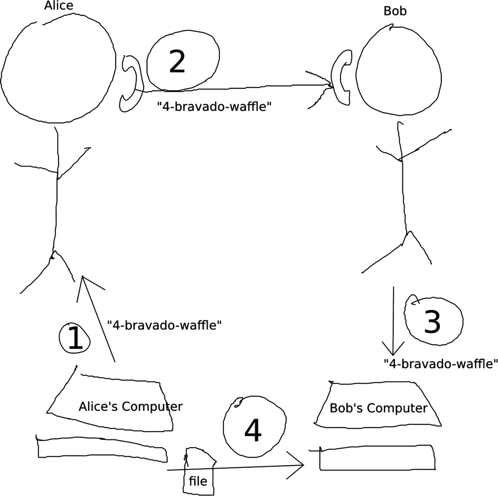
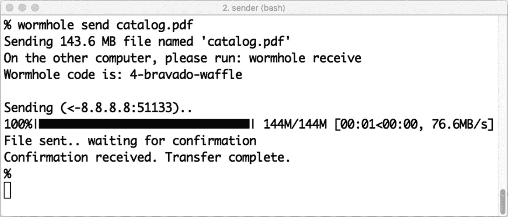
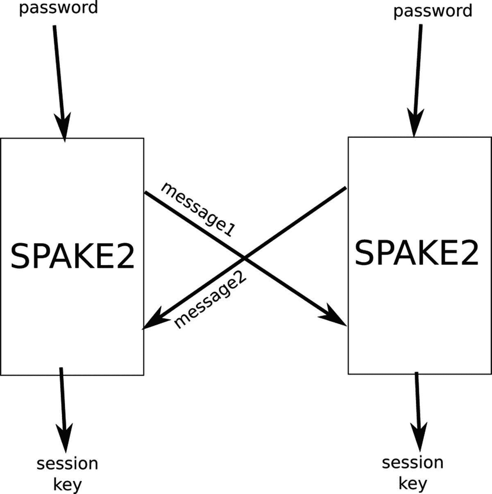

# 七、魔法虫洞

魔法虫洞是一个安全的文件传输工具，它的座右铭是“安全地将东西从一台电脑转移到另一台电脑”这对于特定的一次性传输情况最为有用，例如:

*   在一次会议上，您刚刚坐在某人旁边，您想从您的笔记本电脑上给他们一个您最喜欢的项目的 tarball。

*   你正在和某人打电话，需要给他们一张你正在电脑上看的照片。

*   您刚刚为一位同事建立了一个新帐户，需要从他们的计算机上安全地获取他们的 SSH 公钥。

*   您希望将旧计算机中的 GPG 私钥复制到新的便携式计算机中。

*   IRC 上的一位同事希望您从您的计算机上给他们发送一个日志文件。

这个工具的一个与众不同的特点是使用了一个**虫洞** **代码**:一个像“4-虚张声势-胡说八道”这样的短短语，它能够实现传输，并且必须从发送客户端传送到接收客户端。当爱丽丝给鲍勃发送一个文件时，爱丽丝的电脑会显示这个短语。Alice 必须设法让 Bob 知道这个短语:通常，她会在电话里对他说，或者通过 SMS 或 IRC 键入。该代码由一个数字和几个单词组成，旨在方便准确地转录，即使在嘈杂的环境中。

这些代码是一次性使用的。安全属性很简单:第一个正确声明代码的接收者将得到文件，其他人没有。这些属性是*强*的:没有其他人可以得到文件，因为它是加密的，只有第一个正确的声明可以计算出解密密钥。它们只依赖于客户端软件的行为:没有服务器或互联网窃听者可以违反它们。魔法虫洞是独一无二的结合了强大的保密性和简单的工作流程。

## 它看起来像什么

Magic Wormhole 目前只能作为基于 Python 的命令行工具使用，但是移植到其他语言和运行时环境的工作正在进行中。最重要的项目是开发一个 GUI 应用(可以拖放要传输的文件)和一个移动应用。



图 7-3

魔法虫洞工作流程图


图 7-2

接收者截图



图 7-1

发送器屏幕截图

*   1:爱丽丝在她的电脑上运行`wormhole send FILENAME`，它告诉她虫洞代码(“4-虚张声势-华夫”)。

*   2:然后，她在电话中向 Bob 口述。

*   3:鲍勃将虫洞代码输入他的电脑。

*   4:两台计算机连接，然后加密并传输文件。

## 它是如何工作的

魔法虫洞客户端(发送者和接收者)连接到同一个**会合服务器**并交换少量短消息。这些消息用于运行一个名为 **SPAKE2** 的特殊加密密钥协商协议，这是一个基本 Diffie-Hellman 密钥交换协议的认证版本(参见下面的参考资料了解更多详细信息)。

每一方通过输入一个密码来启动他们的 SPAKE2 协议状态机:随机生成的虫洞代码。他们的一半产生一个信息传递到另一边。当该消息被传递时，另一方将其与他们自己的内部状态相结合，以产生会话密钥。当双方使用相同的虫洞代码时，他们的两个会话密钥将是相同的。每次协议运行时，他们都会得到一个新的随机会话密钥。他们使用这个会话密钥来加密所有后续的消息，提供一个安全的连接来找出文件传输细节的其余部分。



图 7-4

空间 2 图

任何试图拦截连接的攻击者都只有一次机会猜对密码。如果他们错了，两个会话密钥将完全不同，攻击者将无法解密其余的消息。真正的客户端会注意到不匹配，并在尝试发送任何文件数据之前退出，并显示一条错误消息。

一旦他们建立了安全连接，魔法虫洞客户端就交换他们想要传输的信息，然后他们一起工作建立一个**传输**连接，批量数据传输将通过该连接进行。这从双方打开一个侦听 TCP 网络套接字开始。他们找出所有可能引用这个套接字的 IP 地址(可能有多个)并建立一个**连接提示**列表，他们用会话密钥对其加密并通过 rendezvous 服务器发送到另一端。

每一端都尝试与其收到的每个连接提示建立直接连接。第一次成功的尝试用于文件传输。如果双方都在同一个本地网络上(例如，当两台计算机都在同一个会议 WiFi 上时)，这是可行的。由于它们都试图相互连接(不管哪一方发送文件)，如果至少有一台机器是具有公共 IP 地址的服务器，这也是可行的。实际上，这似乎在三分之二的情况下建立了直接联系。

如果两台机器位于不同的 NAT 防火墙之后，所有的直接连接都将失败。在这种情况下，他们退回到使用中央**中转中继**服务器，该服务器基本上将两个入站 TCP 连接粘合在一起。

在所有情况下，文件数据都是用会话密钥加密的，所以无论是会合服务器还是中转中继都不能看到文件的内容。

通过导入`wormhole`库和进行 API 调用，同样的协议可以在其他应用中使用。例如，像 Signal 或 Wire 这样的加密即时消息应用可以利用这一点将朋友的公钥安全地添加到您的地址簿中:您可以告诉朋友一个虫洞代码，而不是复制一个大的密钥字符串。

## 网络协议、传输延迟、客户端兼容性

从发送方启动工具到最后一个字节到达接收方的总传输时间大致是三个阶段的总和:

*   等待接收者输入完虫洞代码；

*   执行密钥协商并协商中转连接；

*   通过加密通道传输文件。

第一阶段取决于人类:程序会愉快地等待几天，让接收者最终输入虫洞代码。最后一个阶段取决于文件的大小和网络的速度。只有中间阶段真正在协议的控制之下，所以我们想让它尽可能快。我们尽量减少必须交换的消息数量，并使用低延迟实时协议来加速这一阶段。

集合服务器有效地为每对客户端提供了持久的广播信道(即“发布订阅”服务器)。发送方首先连接，给接收方留言，然后等待响应。稍后，当接收方的人最终启动他们的`wormhole`程序时，接收者将连接并收集该消息，并发送一些它自己的消息。如果任一客户端出现网络问题，它们的连接可能会断开，必须重新建立连接。

### 网络协议和客户端兼容性

正如本书第一章所见，Twisted 使得在 TCP 或 UDP 上构建定制协议变得非常容易。我们可以为会合连接建立一个简单的基于 TCP 的协议。但是当我们考虑未来时，我们希望看到其他语言和运行时环境中的魔法虫洞客户端，比如网页或移动操作系统。我们为命令行 Twisted 应用构建的协议可能不容易在其他语言中实现，或者它可能需要禁止这些程序访问的网络:

*   Web 浏览器可以执行 WebSockets 和 WebRTC，但不能执行原始 TCP 连接。

*   浏览器扩展可以做网页能做的一切，甚至更多，但必须用专门的 JavaScript 实现，因为二进制协议不是很自然。

*   iOS/Android 可以进行 HTTP，但是电源管理可能会禁止长时间的连接，并且非 HTTP 请求可能不会激活无线电。

因此，为了跨运行时的兼容性，我们必须坚持 web 浏览器可以做的事情。

最简单的协议是使用优秀的`treq`包进行简单的 HTTP GETs 和 POSTs，它为基于 Twisted 的程序提供了一个类似于`requests`的 API。然而，不清楚客户端应该多久轮询一次服务器:我们可能每秒轮询一次，浪费了大量带宽来检查一个小时内不会发生的响应。或者，我们可以通过每分钟只检查一次来节省带宽，代价是给本应只需一两秒钟的实用程序增加 60 秒的延迟。即使每秒轮询一次也会增加不必要的延迟。对于实时连接，连接的完成速度与网络传送消息的速度一样快。

减少这种延迟的一个技巧是“HTTP 长轮询”(有时称为 COMET)。在这种方法中，magic wormhole 客户端将像往常一样进行 GET 或 POST，但是中继服务器将假装花费很长时间来传递响应(实际上，服务器将只是停止响应，直到另一个客户端连接接收文件)。一个限制是，服务器通常必须在 30-60 秒内以某种方式响应*，通常是“请重试”错误，否则客户端 HTTP 库可能会放弃。此外，连续的消息(如客户端发送的第二条和第三条消息)不会立即交付:发送请求所花费的时间必须添加到每条消息的延迟中。*

 *另一种 web 兼容的实时技术称为“服务器发送事件”，它作为`EventSource` JavaScript 对象暴露给 web 内容。这是进行长轮询的一种更有原则的方式:客户端进行常规的 GET，但是将`Accept`请求头设置为特殊值`text/event-stream`，以告诉服务器连接应该保持打开。响应应该包含一个编码事件流，每个事件占一行。这在服务器上很容易实现；但是，Twisted 没有现成的库。消息只在一个方向上传播(服务器到客户端)，但这是我们的协议所需要的，因为我们可以在上游方向使用 POSTs。最大的缺点是一些网络浏览器(特别是 IE 和 Edge)不支持它。

我们的解决方案是使用 **WebSockets** 。这是一个很好的标准化协议，在大多数浏览器中实现，并作为库在许多编程语言中可用。得益于优秀的**高速公路**库(将在下一章描述)，从 Python 和 Twisted 中使用它很容易。这个连接看起来就像一个长期的 HTTP 会话，这使得它更容易与现有的 HTTP 栈集成(并且使得它更有可能通过代理和 TLS 终结器工作)。Keepalives 是自动处理的。而且它是一个快速、实时的协议，所以消息被尽可能快地传递。

如果我们没有高速公路，我们可能会重新考虑。WebSockets 实现起来有些复杂，因为它们使用了一种特殊的帧(以防止困惑的服务器将流量误解为其他协议:您不希望攻击者的网页使您的浏览器向您公司的内部 FTP 服务器发送删除命令)。

将来，rendezvous 服务器可能会使用多种协议，而不仅仅是 WebSockets。WebRTC 是最引人注目的，因为它包括对 ICE 和 STUN 的支持。这些是执行“NAT 打洞”的协议，因此两个客户端可以建立直接的传输连接，尽管它们都在防火墙后面。WebRTC 主要用于音频/视频聊天，但它包括专门用于普通数据传输的 API。大多数浏览器都很好地支持 WebRTC。浏览器到浏览器的魔法虫洞很容易构建，并且可能比当前的 CLI 工具执行得更好。

问题是浏览器环境之外的支持很少，部分是因为音频/视频的焦点。大多数库似乎把所有的精力都花在支持音频编解码器和视频压缩算法上，留给基本连接层的时间很少。我见过的最有前途的都是用 C++写的，对它来说 Python 绑定是二等的，使得构建和打包很困难。

另一个竞争者是为 IPFS 开发的 libp2p 协议。这依赖于大型分布式哈希表(DHT)中的大量节点，而不是中央服务器，但已经过良好的测试，至少在 Go 和 JavaScript 中有很好的实现。libp2p 的 Python 版本很有前途。

## 服务器架构

Rendezvous 服务器被写成一个`twisted.application.service.MultiService`，带有一个用于主 WebSocket 连接的监听端口。

WebSockets 基本上是 HTTP，Autobahn 库使得两者可以使用同一个端口。在未来，这将让我们托管的网页和其他资产的一个基于网络的版本的魔法虫洞从同一来源的汇合服务。为了进行设置，Rendezvous 服务器看起来像这样:

```py
from twisted.application import service
from twisted.web import static, resource
from autobahn.twisted.resource import WebSocketResource
from .rendezvous_websocket import WebSocketRendezvousFactory

class Root(resource.Resource):
    def __init__ (self):
        resource.Resource. __init__ (self)
        self.putChild(b"", static.Data(b"Wormhole Relay\n", "text/plain"))

class RelayServer(service.MultiService):
    def __init__ (self, rendezvous_web_port):
        service.MultiService. __init__ (self)
        ...
        root = Root()
        wsrf = WebSocketRendezvousFactory(None,self._rendezvous)
        root.putChild(b"v1", WebSocketResource(wsrf))

```

`self._rendezvous`是我们的`Rendezvous`对象，它为 Rendezvous 服务器动作提供内部 API:向通道添加消息、订阅通道等。当我们添加附加协议时，它们都将使用同一个对象。

`WebSocketResource`是 Autobahn 的类，用于在任何 HTTP 端点添加 WebSocket 处理程序。我们将它附加为 Root 的“v1”子节点，因此如果我们的服务器在`magic-wormhole.io`上，那么 Rendezvous 服务将位于 URL`ws://magic-wormhole.io/v1`上。我们为协议的未来版本保留`v2/`之类的。

必须给`WebSocketResource`一个工厂:我们使用来自相邻模块的`WebSocketRendezvousFactory`。该工厂生成我们的`WebSocketRendezvous`类的协议实例，该类有一个`onMessage`方法，该方法检查每个消息的有效载荷，解析内容，并调用适当的动作:

```py
def onMessage(self, payload, isBinary):
    msg = bytes_to_dict(payload)
    try:
        if "type" not in msg:
            raise Error("missing 'type'")
        self.send("ack", id=msg.get("id"))

        mtype = msg["type"]
        if mtype == "ping":
            return self.handle_ping(msg)
        if mtype == "bind":
            return self.handle_bind(msg)
        ...

```

### 持久数据库

当两个客户端同时连接时，rendezvous 服务器会立即将消息从一个客户端传递到另一个客户端。但是在等待第二个客户机连接时，至少必须缓冲初始消息:有时只缓冲几秒钟，但有时要缓冲几个小时或几天。

早期版本的 rendezvous 服务器将这些消息保存在内存中。但是每次主机重新启动(例如，升级操作系统)时，这些消息都会丢失，此时任何等待的客户端都会失败。

为了解决这个问题，服务器被重写以将所有消息存储在 SQLite 数据库中。每次消息到达时，服务器做的第一件事就是将它附加到一个表中。一旦消息被安全地存储，副本就被转发给另一个客户端。`Rendezvous`对象包装了一个数据库连接，每个方法执行选择和插入。

正如下一节所描述的，客户端也被重新编写以允许丢失连接，状态机重新传输服务器没有确认的任何消息。

这项工作的一个有趣的副作用是它启用了一种“离线模式”:两个客户端可以交换消息，而不必同时连接。虽然这不能实现直接的文件交换操作，但它*允许像为消息应用交换公钥这样的用例。*

## 运输客户:可取消的延期

在计算出一个会话密钥后，虫洞客户端可以安全地通信，但是它们所有的数据仍然由会合服务器转发。这对于批量文件传输阶段来说太慢了:每个字节都必须上传到服务器，然后再返回到另一个客户机。使用直接连接会更快(也更便宜)。然而，有时客户端不能进行直接连接(例如，它们都在 NAT 盒后面)，在这种情况下，它们必须使用“中转中继”服务器。**中转客户端**负责尽可能实现最佳连接。

如前所述，每个客户端打开一个侦听 TCP 端口，计算出它们的 IP 地址，然后将地址+端口发送到另一端(通过加密的集合通道)。为了适应未来的连接机制(可能是 WebRTC)，这被概括为一组各种类型的“连接提示”。当前客户端识别三种提示:直接 TCP、中转 TCP 和 Tor 隐藏服务 TCP。每个提示都包含一个优先级，因此客户可以鼓励使用更便宜的连接。

双方都从高优先级提示开始，开始连接到它们能够识别的每个提示。任何使用中转中继的提示都会被延迟几秒钟，以支持直接连接。

完成协商过程的第一个连接将赢得比赛，此时我们使用`defer.cancel()`放弃所有失败者。这些可能仍在等待开始(处于强加于中继连接的两秒钟延迟中)，或试图完成 DNS 解析，或已连接但等待协商完成。

延迟取消巧妙地处理了所有这些情况，因为它给了延迟的最初创建者一个机会来避免做一些现在无论如何都会被忽略的工作。如果这个延迟已经链接到另一个延迟，那么`cancel()`调用将遵循这个链，并被传递到尚未触发的第一个延迟。对我们来说，这意味着取消一个正在等待套接字连接的竞争者将会取消连接尝试。或者取消一个已连接但仍在等待连接握手的连接将会关闭该连接。

通过将过程的每一步都构建为另一个延迟，我们不需要跟踪这些步骤:一个简单的`cancel()`就可以做正确的事情。

我们用 src/wormhole/transit.py 中的实用函数来管理这种竞争:

```py
class _ThereCanBeOnlyOne:
    """Accept a list of contender Deferreds, and return a summary Deferred. When the first contender fires successfully, cancel the rest and fire the summary with the winning contender's result. If all error, errback the summary.
    """
    def __init__ (self, contenders):
        self._remaining = set(contenders)
        self._winner_d = defer.Deferred(self._cancel)
        self._first_success = None
        self._first_failure = None
        self._have_winner = False
        self._fired = False

def _cancel(self, _):
    for d in list(self._remaining):
        d.cancel()
    # since that will errback everything in _remaining, we'll have
    # hit _maybe_done() and fired self._winner_d by this point

    def run(self):
        for d in list(self._remaining):
            d.addBoth(self._remove, d)
            d.addCallbacks(self._succeeded,self._failed)
            d.addCallback(self._maybe_done)
        return self._winner_d

    def _remove(self, res, d):
        self._remaining.remove(d)
        return res

    def _succeeded(self, res):
        self._have_winner = True
        self._first_success = res
        for d in list(self._remaining):
            d.cancel()

    def _failed(self, f):
        if self._first_failure is None:
            self._first_failure = f

    def _maybe_done(self, _):
        if self._remaining:
            return
        if self._fired:
            return self._fired = True
        if self._have_winner:
            self._winner_d.callback(self._first_success)
        else:
            self._winner_d.errback(self._first_failure)

def there_can_be_only_one(contenders):
    return _ThereCanBeOnlyOne(contenders).run()

```

这是作为函数而不是类公开的。我们需要将一个 Deferred 集合变成一个新的 Deferred，一个类构造函数只能返回新的实例(不是 Deferred)。如果我们将`_ThereCanBeOnlyOne`作为主 API 公开，调用者将被迫使用笨拙的`d = ClassXYZ(args).run()`语法(确切地说是我们隐藏在函数中的语法)。这将增加犯错误的机会:

*   如果他们叫两次`run()`呢？

*   如果他们子类化它呢？我们承诺的兼容性是什么样的？

注意，如果*所有的*竞争者延迟失败，那么延迟的摘要也将失败。在这种情况下，errback 函数将接收与第一个竞争者失败一起交付的任何失败实例。这里的想法是有效地报告共模故障。每个目标可能会表现为以下三种方式之一:

*   成功连接(可能快也可能慢)；

*   失败是因为特定于目标的原因:它使用了我们无法到达的 IP 地址，或者网络过滤器阻止了数据包；

*   失败的原因不是特定的目标，例如，我们甚至没有连接到互联网；

如果我们是后一种情况，所有的连接失败都是一样的，所以报告哪一个并不重要。记录第一次应该足以让用户找出哪里出错了。

## 中转中继服务器

中转继电器的代码在`magic-wormhole-transit-relay`包中。它目前使用自定义的 TCP 协议，但我希望添加一个 WebSockets 接口，使基于浏览器的客户端也能使用它。

中继的核心是一个协议，它将成对的实例(每个客户端一个)链接在一起。每个实例都有一个“伙伴”，每次数据到达时，都将相同的数据写到伙伴中:

```py
class TransitConnection(protocol.Protocol):
    def dataReceived(self, data):
        if self._sent_ok:
            self._total_sent += len(data)
            self._buddy.transport.write(data)
            return
        ...

    def buddy_connected(self, them):
        self._buddy = them
        ...
        # Connect the two as a producer/consumer pair. We use streaming=True,
        # so this expects the IPushProducer interface, and uses
        # pauseProducing() to throttle, and resumeProducing() to unthrottle.
        self._buddy.transport.registerProducer(self.transport,True)
        # The Transit object calls buddy_connected() on both protocols, so
        # there will be two producer/consumer pairs.

    def buddy_disconnected(self):
        self._buddy = None
        self.transport.loseConnection()

    def connectionLost(self, reason):
        if self._buddy:
            self._buddy.buddy_disconnected()
        ...

```

代码的其余部分与准确识别哪些连接应该配对在一起有关。传输客户端一连接就写一个握手字符串，中继寻找写了相同握手的两个客户端。`dataReceived`方法的其余部分实现了一个状态机，它等待握手到达，然后将其与其他连接进行比较以找到匹配。

当好友被链接时，我们在他们之间建立了生产者/消费者关系:Alice 的 TCP 传输被注册为 Bob 的生产者，反之亦然。当 Alice 的上行链路比 Bob 的下行链路快时，连接到 Bob 的`TransitConnection`的 TCP `Transport`就会填满。然后它将调用爱丽丝的`Transport`上的`pauseProducing()`，这将从反应器的可读列表中移除她的 TCP 套接字(直到`resumeProducing()`被调用)。这意味着中继在一段时间内不会从该套接字读取数据，导致内核的入站缓冲区填满，此时内核的 TCP 堆栈会缩小 TCP 窗口广告，通知 Alice 的计算机停止发送数据，直到它赶上。

最终结果是 Alice 观察到的传输速率没有超过 Bob 所能处理的。如果没有这种生产者/消费者链接，Alice 将以她连接允许的最快速度向中继写入数据，中继必须缓冲所有数据，直到 Bob 赶上。在我们添加这个之前，当人们向非常慢的接收者发送非常大的文件时，中继偶尔会耗尽内存。

## 虫洞客户端架构

在客户端，`wormhole`包提供了一个`Wormhole`库来通过服务器建立虫洞式连接，一个`Transit`库来建立加密的直接 TCP 连接(可能通过中继)，以及一个命令行工具来驱动文件传输请求。大部分代码都在`Wormhole`库中。

`Wormhole`对象是用一个简单的工厂函数构建的，并且有一个基于延迟的 API 来分配一个虫洞代码，发现选择了什么代码，然后发送/接收消息:

```py
import wormhole

@inlineCallbacks
def run():
    w = wormhole.create(appid, relay_url, reactor)
    w.allocate_code()
    code = yield w.get_code()
    print "wormhole code:", code
    w.send_message(b"outbound message")
    inbound = yield w.get_message()
    yield w.close()

```

我们使用一个`create`工厂函数，而不是类构造函数，来构建我们的虫洞对象。这让我们可以将实际的类保持私有，因此我们可以更改实现细节，而不会在将来导致兼容性的破坏。例如，实际上有两种虫洞物体。默认有一个基于延迟的接口，但是如果你传递一个可选的`delegate=`参数到`create`，你会得到一个替代的调用委托对象的接口，而不是触发一个延迟的。

使用一个反应器，而不是在内部导入一个，以允许调用应用控制使用哪种类型的反应器。这也使得单元测试更容易编写，因为我们可以传入一个假的反应器，例如，网络套接字被切断，或者我们可以显式控制时钟。

在内部，我们的`Wormhole`对象使用了十几个小型状态机，每个状态机负责连接和密钥协商过程的一小部分。例如，虫洞代码开头的短整数(`4-bravado-waffle`中的“4 ”)被称为*铭牌*,这些都是由一个单独的专用状态机分配、使用和释放的。同样，服务器托管着一个*邮箱*，两个客户端可以在这里交换消息:每个客户端都有一个状态机来管理这个邮箱的视图，知道何时打开或关闭邮箱，并确保所有消息都在正确的时间发送。

## 延迟 vs 状态机，一次性观察器

虽然基本的消息流非常简单，但是完整的协议相当复杂。这种复杂性源于容忍连接失败(和随后的重新连接)以及服务器关闭(和随后的重新启动)的设计目标。

客户端可能分配或保留的每个资源都必须在正确的时间释放。因此，认领名牌和邮箱的过程是经过精心设计的，尽管连接来来往往，但总是向前推进。

另一个设计目标使它变得更加复杂:使用该库的应用可以将它们的状态保存到磁盘，完全关闭，然后在稍后的时间重新启动，并从它们停止的地方继续。这是为一直在启动和关闭的消息应用设计的。为此，应用需要知道虫洞消息何时到达，以及如何序列化协议的状态(以及应用中的其他一切)。这样的应用必须使用**委托** API。

对于数据流驱动的系统来说，延迟是一个很好的选择，在这种系统中，任何给定的动作都只能发生一次，但是它们很难序列化。对于可能前滚后滚的状态，或者可能发生多次的事件(更像是“流”接口)，状态机可能更好。虫洞代码的早期版本使用了更多的延迟，并且更难处理连接丢失和重启。在当前版本中，延迟仅用于顶级 API。其他的都是状态机。

`Wormhole`对象使用了十几个互锁的状态机，所有这些都是用**自动机**实现的。Automat 本身不是 Twisted 的一部分，但它是由 Twisted 社区的成员编写的，它的第一个用例是 Twisted 的`ClientService`(这是一个维护到给定端点的连接的实用程序，在连接丢失时或连接过程失败时重新连接；魔法虫洞使用`ClientService`连接到会合服务器)。

作为一个具体的例子，图 7-5 显示了管理铭牌分配的**分配器**状态机。这些是由 rendezvous 服务器根据发送方的请求分配的(除非发送方和接收方已经离线决定了代码，在这种情况下，双方都直接将代码键入他们的客户端)。

在任何给定的时刻，到 rendezvous 服务器的连接要么建立，要么不建立，这两种状态之间的转换导致一个`connected`或`lost`消息被分派给大多数状态机，包括分配器。分配器保持在两种“空闲”状态之一(`S0A`空闲+断开，或`S0B`空闲+连接)，直到/除非需要它。如果上级代码决定需要一个铭牌，它发送`allocate`事件。如果此时分配器已经连接，它会告诉 Rendezvous 连接器发送一个`allocate`消息(标有`RC.tx_allocate`的框)，然后进入状态`S1B`，等待响应。当响应到达时(`rx_allocated`，它将选择组成剩余代码的随机字，通知`Code`状态机已经分配了一个(`C.allocated()`)，并移动到终端`S2: done`状态。

在收到`rx_allocated`响应之前，我们无法知道请求是否被成功传递。因此，我们必须 1:确保在每次重新建立连接时重新传输请求；第二:确保请求是等幂的，这样服务器对两个或更多请求的反应就像对单个请求的反应一样。这确保了服务器在这两种情况下都能正常运行。


图 7-5

分配器状态机

在建立连接之前，我们可能会被要求分配一个铭牌。从`S1A`到`S1B`的路径是在两种情况下`allocate`请求被传输的地方:在发现分配需求之前连接，在发送分配请求但是还没有听到响应之后重新连接。

这种模式出现在我们的大多数状态机中。对于更复杂的例子，查看铭牌或邮箱机器，它们在 rendezvous 服务器上创建或订阅一个命名通道。在这两种情况下，状态排成两列:左边是“断开”，右边是“连接”。列中的垂直位置表示我们到目前为止已经完成的工作(或者我们还需要做的工作)。失去联系让我们从右向左移动。建立连接使我们从左向右移动，通常发送一个新的请求消息(或重新发送一个较早的消息)。收到一个响应使我们向下移动，就像从一个更高层次的状态机得到完成某件事的指令一样。

顶层的 **Boss** 机器是状态机让位于延期者的地方。导入 magic wormhole 库的应用可以请求一个延迟，当一个重要事件发生时，这个延迟将被触发。例如，应用可以创建一个虫洞对象，并像这样分配代码:

```py
from twisted.internet import reactor
from wormhole.cli.public_relay import RENDEZVOUS_RELAY
import wormhole

# set APPID to something application-specific

w = wormhole.create(APPID, RENDEZVOUS_RELAY, reactor)
w.allocate_code()
d = w.get_code()
def allocated_code(code):
    print("the wormhole code is:{}".format(code))
d.addCallback(allocated_code)

```

分配器状态机将`allocated`消息传递给代码机(`C.allocated`)。代码机会把代码交付给 Boss ( `B.got_code`)，Boss 机会把代码交付给虫洞对象(`W.got_code`)，虫洞对象会把代码交付给任何等待的 Deferreds(通过调用`get_code())`构造的)。

## 一次性观察者

以下摘自`src/wormhole/wormhole.py`的摘录显示了用于管理虫洞代码交付的“一次性观察者”模式，包括分配(如上所述)和交互输入:

```py
@implementer(IWormhole, IDeferredWormhole)
class _DeferredWormhole(object):
    def __init__ (self):
        self._code = None
        self._code_observers = []
        self._observer_result = None
        ...

    def get_code(self):
        if self._observer_result is not None:
            return defer.fail(self._observer_result)
        if self._code is not None:
            return defer.succeed(self._code)
        d=defer.Deferred()
        self._code_observers.append(d)
        return d

    def got_code(self, code):
        self._code = code
        for d in self._code_observers:
            d.callback(code)
        self._code_observers[:] = []

    def closed(self, result):
        if isinstance(result,Exception):
            self._observer_result = failure.Failure(result)
        else:
            # pending Deferreds get an error
            self._observer_result = WormholeClosed(result)
        ...
        for d in self._code_observers:
            d.errback(self._observer_result)

```

可以被调用任意次。对于标准 CLI filetransfer 工具，发送客户端分配代码，并等待`get_code()`触发，以便它可以向用户显示代码(用户必须将代码口述给接收者)。接收客户端被*告知*代码(或者作为调用参数，或者通过交互式输入，在单词上用制表符补全)，所以它不需要调用`get_code()`。其他应用可能有理由多次调用它。

我们希望所有这些查询得到相同的答案(或错误)。我们希望他们的回调链是独立的。

## 承诺/未来与延期

未来来自卡尔·休伊特的演员模型，Joule 和 E 等语言，以及其他早期的对象能力系统(在这些系统中，它们被称为承诺)。它们代表了一个*还*不可用的值，但是(可能)最终会解决某个问题，或者可能会“中断”并且永远不会引用任何东西。

这让程序谈论尚不存在的事物。这可能看起来没有帮助，但是有很多有用的东西可以用尚不存在的东西来做。您可以安排工作在它们变得可用时发生，并且您可以将它们传递给能够自己安排这项工作的函数。在更高级的系统中，**承诺管道**让你发送消息*到*一个承诺，如果那个承诺实际上完全存在于不同的计算机上，消息将追逐承诺到目标系统，这可以省去几次往返。一般来说，它们帮助程序员向编译器或解释器描述他们未来的意图，因此它可以更好地计划做什么。

**deferred**密切相关，但为 Twisted 所独有。它们更多的是作为回拨管理工具，而不是完全成熟的承诺。为了探究它们之间的区别，我们应该首先解释真正的承诺是如何工作的。

在 E 语言中，对象能力语言最充分地探索了承诺，有一个名为`makePromiseResolverPair()` `,`的函数返回两个*独立的*对象:一个承诺和一个解析器。解决承诺的唯一方法是和解决者在一起，学习解决的唯一方法是和承诺在一起。该语言提供了一种特殊的语法，即“when”块，它允许程序员编写只有在承诺被解析为某个具体值后才会执行的代码。如果魔法虫洞是用 E 写的，`get_code()`方法会返回一个承诺，它会这样显示给用户:

```py
p = w.get_code();
when (p) {
    writeln("The code is:", p);
}

```

由于对象能力社区和 TC39 标准组织之间相当大的重叠，现代 JavaScript (ES6)中的承诺是可用的。这些承诺没有任何等待解决的特殊语法，而是依赖于 JavaScript 方便的匿名函数(包括 ES6 中引入的**箭头函数**语法)。相应的 JavaScript 代码如下所示:

```py
p=w.get_code();
p.then(code=>{console.log("The code is:",code);});

```

E 的承诺、JS 的承诺和 Twisted 的延期承诺之间的一个显著区别在于你如何将它们链接在一起。Javascript `then()`方法返回一个*新的*承诺，当回调函数结束时触发(如果回调返回一个中间承诺，那么在中间承诺触发之前`then()`承诺不会触发)。因此，给定一个“父”承诺，您可以像这样构建两个独立的处理链:

```py
p=w.get_code();
function format_code(code){
    return slow_formatter_that_returns_a_promise(code);
}
p.then(format_code).then(formatted => {console.log(formatted);});
function notify_user(code){
    return display_box_and_wait_for_approval(code);
}
p.then(notify_user).then(approved => {console.log("code delivered!");});

```

在 JavaScript 中，这两个动作将“并行”运行，或者至少不会互相干扰。

另一方面，Twisted 的延迟创建了一个回调链*，而*没有创建额外的延迟。

```py
d1=w.get_code()
d=d1.addCallback(format_code)
assert d1 is d # addCallback returns the same Deferred!

```

这看起来有点像 JavaScript 的“属性构造”模式，在 web 框架(例如 d3.js、jQuery)中很常见，它通过许多属性调用来构建对象:

```py
s = d3.scale()
      .linear()
      .domain([0,100])
      .range([2,40]);

```

延迟的这种链接行为可能会导致意外，尤其是在尝试创建并行执行行时:

```py
d1 = w.get_code()
d1.addCallback(format_code).addCallback(print_formatted)

# wrong!

d1.addCallback(notify_user).addCallback(log_delivery)

```

在那个例子中，`notify_user`只在 `print_formatted`结束后被调用*，它不会被代码调用:取而代之的是`print_formatted` *返回*的任何值。我们的编码模式(两行，每行以`d1.addCallback`开头)是骗人的。事实上，上面的代码完全等同于:*

```py
d1 = w.get_code()
d1.addCallback(format_code)
d1.addCallback(print_formatted)
d1.addCallback(notify_user) # even more obviously wrong!
d1.addCallback(log_delivery)

```

相反，我们需要一个新的延迟，它将以相同的值触发，但让我们建立一个新的执行链:

```py
def fanout(parent_deferred, count):
    child_deferreds = [Deferred() for i in range(count)]
    def fire(result):
        for d in child_deferreds:
            d.callback(result)
    parent_deferred.addBoth(fire)
    return child_deferreds
d1 = w.get_code()
d2, d3 = fanout(d1,2)
d2.addCallback(format_code)
d2.addCallback(print_formatted)
d3.addCallback(notify_user)
d3.addCallback(log_delivery)

```

这已经够麻烦的了，在我的项目中，我通常会创建一个名为`OneShotObserverList`的实用程序类。这个“观察者”有一个`when_fired()`方法(返回一个新的、独立的延迟)和一个`fire()`方法(触发所有方法)。`when_fired()`可在`fire()`之前或之后调用。

上面引用的魔法虫洞代码(`get_code() / got_code()`)是完整`OneShotObserverList`的子集。连接过程有几种可能失败的方式，但是它们都用一个失败实例调用`closed()`(一个成功的/有意的关闭将调用没有失败的`closed()`，然后它被包装在一个`WormholeClosed`异常中)。这段代码确保了由`get_code()`返回的每个延迟将被触发一次，要么成功(和代码)，要么失败。

## 最终发送，同步测试

来自 E 和对象能力社区的承诺的另一个方面是**最终发送**。这是一个为事件循环的后续循环排队方法调用的工具。在 Twisted 中，这基本上是一个`reactor.callLater(0, callable, argument)`。在 E 和 JavaScript 中，承诺自动为它们的回调提供这种保证。

最终发送是避免大量排序风险的简单而可靠的方法。例如，想象一个通用的观察者模式(比上面描述的简单的`OneShotObserverList`拥有更多的功能):

```py
class Observer:
    def __init__ (self):
        self.observers = set()
    def subscribe(self, callback):
        self.observers.add(callback)
    def unsubscribe(self, callback):
        self.observers.remove(callback)
    def publish(self, data):
        for ob in self.observers:
            ob(data)

```

现在，如果回调函数之一调用`subscribe`或`unsubscribe`，在循环中间修改观察器列表，会发生什么？根据迭代的工作方式，新添加的回调可能会接收到当前事件，也可能不会。在 Java 中，迭代器甚至可能抛出一个`ConcurrentModificationException`。

可重入性是另一个潜在的意外:如果某个回调向同一个观察者发布了一条新消息，那么在第一次调用仍在运行时，将会第二次调用`publish`函数，这可能违反了程序员可能做出的许多常见假设(尤其是如果函数在实例变量中保存状态)。最后，如果回调引发了一个异常，剩下的观察者会看到这个事件吗，还是会被绕过？

这些意外的相互作用被统称为“计划协调风险”，其后果包括事件丢失、事件重复、不确定的排序和无限循环。

精心的编程可以避免许多这样的失败模式:我们可以在迭代之前复制观察器列表，捕捉/丢弃回调中的异常，并使用标志来检测可重入调用。但是在每个调用中使用最终发送要简单得多，也更健壮:

```py
def publish(self, data):
    for ob in self.observers:
        reactor.callLater(0, ob, data)

```

我已经在许多项目中成功地使用了这种方法(Foolscap，Tahoe-LAFS ),它清除了整类的错误。缺点是测试变得更加困难，因为最终发送的效果无法同步检查。此外，缺乏因果堆栈跟踪使得调试变得棘手:如果回调引发异常，回溯并不能弄清楚*为什么*调用那个函数。延期者也有类似的担忧，对此`defer.setDebugging(True)`函数可以有所帮助。

对于 Magic Wormhole，我一直在尝试使用同步单元测试来代替最终发送。

## 延迟异步测试

Twisted 有一个名为**试验**的单元测试系统，它通过提供处理延迟的专门方法来构建在 stdlib `unittest`包之上。最明显的特性是，测试用例可以返回一个 Deferred，测试运行程序将等待它触发，然后才宣布成功(或者允许下一个测试运行)。当与`inlineCallbacks`结合使用时，这使得测试某些事情以特定的顺序发生变得容易:

```py
@inlineCallbacks
def test_allocate_default(self):
    w = wormhole.create(APPID,self.relayurl, reactor)
    w.allocate_code()
    code = yield w.get_code()
    mo = re.search(r"^\d+-\w+-\w+$", code)
    self.assert_(mo, code)
    # w.close() fails because we closed before connecting
    yield self.assertFailure(w.close(), LonelyError)

```

在该测试中，`w.allocate_code()`启动代码的分配，而`w.get_code()`返回一个延迟，它将最终触发完整的代码。在这之间，虫洞对象必须联系服务器并分配一个铭牌(测试在`setUp()`启动一个本地会合服务器，而不是依赖真实的服务器)。`yield w.get_code()`接受这个延迟，等待它完成，然后将结果分配给`code`，这样我们可以稍后测试它的结构。

当然，真正发生的是测试函数返回一个 Deferred 并返回到事件循环，然后在将来的某个时候，服务器的响应到达并导致函数从它停止的地方恢复。如果一个 bug 阻止了`get_code()`延迟被触发，测试将安静地等待两分钟(默认超时)，然后声明一个错误。

`self.assertFailure()`子句接受一个延迟和一个异常类型列表(`*args`)。它等待延迟解决，然后要求它返回一个异常:如果延迟的`.callback()`被调用(即不是错误)，`assertFailure`测试失败。如果延迟的`.errback()`被调用时出现*错误*类型的错误，那么它也不能通过测试。

对我们来说，这有三个目的。虫洞 API 要求你在完成后调用`w.close()`，而`close`返回一个延迟，当一切都完全关闭时触发。我们使用这个来避免移动到下一个测试，直到所有的东西都停止从上一个测试移动(所有的网络套接字都关闭，所有的定时器都已经退休)，这也避免了从试验中触发“不干净的反应堆”错误。

这种延迟也为应用提供了一种发现连接错误的方法。在这个测试中，我们只运行一个客户端，所以没有人让它连接，延迟的`close`将被错误恢复为`LonelyError`。我们使用`assertFailure`来确保没有*和*错误发生，这捕获了所有我们的单元测试被设计来寻找的常见编码错误，比如可能因为我们在某个地方拼错了一个方法而产生的`NameError`。

第三个目的是防止整体考试不及格。在其他测试中，当虫洞成功连接时，我们在测试结束时使用一个简单的`yield w.close()`。但是在这种情况下，`LonelyError` errback 看起来像是 Trial 的问题，它会将测试标记为失败。使用`assertFailure`告诉 Trial 这个延迟失败是可以的，只要它以一种非常特殊的方式失败。

## 延迟同步测试

`test_allocate_default`实际上是一个**集成测试**，一次测试系统的多个部分(包括会合服务器和环回网络接口)。这些测试往往是彻底的，但有点慢。他们也不提供可预测的覆盖面。

等待延迟发生的测试(要么从测试中返回一个，要么在`@inlineCallbacks`函数中调用一个，要么调用`assertFailure`)意味着你不能完全确定*那个事件什么时候*会发生。当应用等待库做一些事情时，这种关注点的分离是很好的:触发回调的细节是库的工作，而不是应用。但是在单元测试期间，你应该确切地知道会发生什么。

Trial 提供了三个延迟管理工具，它们不会*而不是*等待延迟的触发:`successResultOf`、`failureResultOf`和`assertNoResult`。这些断言表明被延迟的当前处于特定状态，而不是等待转换发生。

它们通常与`Mock`类一起使用，以“进入”一些测试中的代码，在已知的时间引发特定的内部转换。

作为一个例子，我们将看看魔法虫洞的`tor`支持的测试。这个特性向命令行工具添加了一个参数，这使得所有连接都通过 Tor 守护进程进行路由，因此`wormhole send --tor`不会向 rendezvous 服务器(或接收方)泄露您的 IP 地址。寻找(或启动)一个合适的 Tor 守护进程的细节被封装在一个`TorManager`类中，并且依赖于外部的`txtorcon`库。我们可以用一个`Mock`来代替`txtorcon`，然后我们测试它上面的所有东西，以确保我们的`TorManager`代码像预期的那样运行。

这些测试测试了我们所有的 Tor 代码，而没有真正与一个真正的 Tor 守护进程对话(这显然是缓慢的、不可靠的和不可移植的)。他们通过假设`txtorcon`像宣传的那样工作来实现这一点。我们不断言`txtorcon`实际上做了什么:相反，我们记录并检查我们告诉`txtorcon`做的一切，然后我们模拟正确的`txtorcon`响应，并检查我们自己的代码对这些响应所做的一切。

最简单的测试是查看没有安装`txtorcon`时会发生什么:正常操作应该不会受到影响，但是试图使用`--tor`应该会导致错误消息。为了更容易模拟，`tor_manager`。py 模块通过将`txtorcon`变量设置为 None 来处理导入错误:

```py
# tor_manager.py

try:
    import txtorcon
except ImportError:
    txtorcon = None

```

这个模块有一个`get_tor()`函数，它被定义为返回一个延迟，该延迟或者由一个`TorManager`对象触发，或者由一个`NoTorError`失败触发。它返回一个 Deferred，因为在正常使用中，它必须在发生任何事情之前建立到 Tor 控制端口的连接，这需要时间。但是在这个特定的例子中，我们知道它应该立即解决(用`NoTorError`，因为我们发现了`ImportError`，而没有等待任何东西。所以，测试看起来像这样:

```py
from ..tor_manager import get_tor
class Tor(unittest.TestCase):
    def test_no_txtorcon(self):
        with mock.patch("wormhole.tor_manager.txtorcon",None):
            d = get_tor(None)
        self.failureResultOf(d, NoTorError)

```

`mock.patch`确保`txtorcon`变量为 None，即使`txtorcon`包在测试期间总是可导入的(我们的`setup.py`将`txtorcon`标记为`[dev]` extra 中的依赖项)。当我们的测试重新获得控制权时，`get_tor()`返回的 Deferred 已经处于 errback 状态。`self.failureResultOf(d, *errortypes)`断言给定的延迟已经失败，具有给定的错误类别之一。因为`failureResultOf`会立即测试延迟的，所以它会立即返回。我们的`test_no_txtorcon`不返回延期，也不使用`@inlineCallbacks`。

一个类似的测试在`get_tor()`中进行前提条件检查。对于这个函数所做的每一个类型检查，我们通过一个调用来练习它。例如，`launch_tor=`参数是一个布尔标志，表示`tor_manager`是否应该生成 Tor 的一个新副本，或者尝试使用一个已存在的副本。如果我们传入一个不是`True`或`False`的值，我们应该期待 Deferred 以`TypeError`触发:

```py
def test_bad_args(self):
    d = get_tor(None, launch_tor="not boolean")
    f = self.failureResultOf(d,TypeError)
    self.assertEqual(str(f.value), "launch_tor= must be boolean")

```

整个测试同步运行，不需要等待任何延迟。像这样的测试集合在 11 毫秒内练习了`tor_manager`模块中的每一行和每一个分支。

另一个常见的测试是确保 Deferred 还没有被触发，因为我们还没有触发允许它触发的条件。这之后通常是一行触发事件的代码，然后是一个断言，表明被延迟的问题要么成功解决(具有某个特定的值)，要么失败(具有某个特定的异常)。

magic wormhole `Transit`类管理用于批量数据传输的(希望是直接的)客户端到客户端 TCP 连接。每一端监听一个端口，并根据它可能拥有的每个 IP 地址(包括几个不太可能到达的本地地址)建立一个“连接提示”列表。然后，每一方同时启动与所有对等方提示的连接。第一个成功连接并执行正确握手的人被宣布为获胜者，所有其他人都被取消。

一个名为`there_can_be_only_one()`(前面描述过)的实用函数用于管理这种竞争。它接受许多单独的延迟，并返回一个在第一个延迟成功时触发的延迟。Twisted 有一些效用函数做类似的事情(`DeferredList`一直存在)，但是我们需要一些东西来抵消所有失败的竞争者。

为了测试这一点，我们使用试验的`assertNoResult(d)`和`value = successResultOf(d)`

特点:

```py
class Highlander(unittest.TestCase):
    def test_one_winner(self):
        cancelled = set()
        contenders = [Deferred(lambda d, i=i: cancelled.add(i))
                      for i in range(5)]
        d = transit.there_can_be_only_one(contenders)
        self.assertNoResult(d)
        contenders[0].errback(ValueError())
        self.assertNoResult(d)
        contenders[1].errback(TypeError())
        self.assertNoResult(d)
        contenders[2].callback("yay")
        self.assertEqual(self.successResultOf(d),"yay")
        self.assertEqual(cancelled, set([3,4]))

```

在这个测试中，我们确保组合延迟没有立即触发，并且即使一些组件延迟失败，它也不会触发。当一个组件成员成功时，我们检查组合延迟是否以正确的值触发，以及剩余的竞争者是否已被取消。

`successResultOf()`和`failureResultOf()`有一个问题:不能在同一个 Deferred 上多次调用它们，因为它们在内部给 Deferred 添加了一个回调，这会干扰任何后续的回调(包括对`successResultOf`的额外调用)。没有很好的理由这样做，但是如果您有一个检查延迟的状态的子例程，并且您多次使用该子例程，这可能会给您带来一些混乱。但是，`assertNoResult`可以随便叫多少次。

### 同步测试和最终发送

Twisted 的社区几年来一直朝着这种直接/嘲笑的风格发展。我最近才开始使用它，但是我对结果很满意:我的测试更快、更彻底、更有确定性。然而，我仍然感到困惑:使用最终发送有很多价值。在`there_can_be_only_one()`中，竞争者延迟大多独立于附加到结果的回调，但是我仍然担心错误，如果回调在事件循环的不同回合执行，我会感觉更舒服。

但是，如果不等待延期点火，任何涉及实际反应堆的东西都很难测试。因此，我正在寻找将这种即时测试风格与最终发送实用程序相结合的方法。

当我第一次开始使用 finally send 时，Glyph 看到了我用`reactor.callLater(0, f)`做的事情，他给我写了一个更好的版本，我们在 Foolscap 和 Tahoe-LAFS 都使用。它维护一个单独的回调队列，并且在任何给定时刻只有一个`callLater`未完成:如果有成千上万个活动调用，这将更有效，并且避免依赖`reactor.callLater`维护等值计时器的激活顺序。

他的`eventually()`的一个很好的特性是它带有一个名为`flushEventualQueue()`的特殊函数，这个函数反复循环队列，直到队列为空。这应该允许像这样编写测试:

```py
class Highlander(unittest.TestCase):
    def test_one_winner(self):
        cancelled = set()
        contenders = [Deferred(lambda d, i=i: cancelled.add(i))
                      for i in range(5)]
        d = transit.there_can_be_only_one(contenders)
        flushEventualQueue()
        self.assertNoResult(d)
        contenders[0].errback(ValueError())
        flushEventualQueue()
        self.assertNoResult(d)
        contenders[1].errback(TypeError())
        flushEventualQueue()
        self.assertNoResult(d)
        contenders[2].callback("yay")
        flushEventualQueue()
        self.assertEqual(self.successResultOf(d),"yay")
        self.assertEqual(cancelled, set([3,4]))

```

缺点是`flushEventualQueue`依赖于最终发送管理器的单例实例，这存在使用环境反应器的所有问题。为了干净利落地处理这个问题，`there_can_be_only_one()`应该给这个管理器一个参数，就像现代 Twisted 的代码将反应器*传递给需要它的*函数，而不是直接导入一个。事实上，如果我们依赖于`reactor.callLater(0)`，我们可以用一个`Clock()`实例测试这段代码，并手动循环时间来刷新队列。未来版本的代码可能会使用这种模式。

## 摘要

Magic Wormhole 是一个文件传输应用，具有强大的安全属性，其核心源于 SPAKE2 加密算法，并具有一个用于嵌入到其他应用中的库 API。它使用 Twisted 来管理多个并发的 TCP 连接，这通常可以在两个客户端之间实现快速的直接传输。Autobahn 库提供 WebSocket 连接，这将支持与未来基于浏览器的客户端兼容。测试套件使用 Twisted 实用函数来检查每个延迟的状态，因为它们在它们的操作阶段循环，允许快速同步测试。

## 参考

*   魔法虫洞首页`:` [`http://magic-wormhole.io`](http://magic-wormhole.io)

*   GitHub 开发页面: [`https://github.com/warner/magic-wormhole`](https://github.com/warner/magic-wormhole)

*   SPAKE2: [`http://www.lothar.com/blog/54-spake2-random-elements/`](http://www.lothar.com/blog/54-spake2-random-elements/)

*   WebSockets: [`https://developer.mozilla.org/en-US/docs/Web/API/WebSockets_API`](https://developer.mozilla.org/en-US/docs/Web/API/WebSockets_API)

*   请求: [`http://python-requests.org/`](http://python-requests.org/)

*   treq: [`https://github.com/twisted/treq`](https://github.com/twisted/treq)

*   高速公路: [`https://crossbar.io/autobahn/`](https://crossbar.io/autobahn/)

*   libp2p: [`https://libp2p.io/`](https://libp2p.io/)

*   自动机: [`https://github.com/glyph/Automat`](https://github.com/glyph/Automat)

*   期货:[`https://en.wikipedia.org/wiki/Future_(programming)`](https://en.wikipedia.org/wiki/Future_(programming))

*   JavaScript 承诺: [`https://developer.mozilla.org/en-US/docs/Web/JavaScript/Guide/Using_promises`](https://developer.mozilla.org/en-US/docs/Web/JavaScript/Guide/Using_promises)

*   e 承诺: [`http://wiki.erights.org/wiki/Promise`](http://wiki.erights.org/wiki/Promise)

*   最终发送: [`https://en.wikipedia.org/wiki/E_(programming_language)`](https://en.wikipedia.org/wiki/E_(programming_language))

*   计划-协调危害: [`http://erights.org/talks/thesis/`](http://erights.org/talks/thesis/)

*   最终()效用: [`https://github.com/warner/foolscap/blob/master/src/foolscap/eventual.py`](https://github.com/warner/foolscap/blob/master/src/foolscap/eventual.py)*