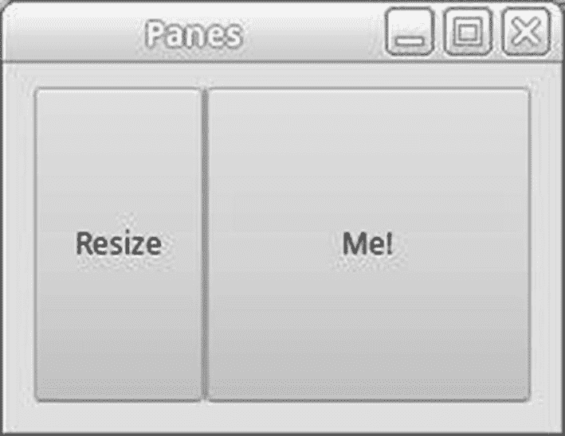
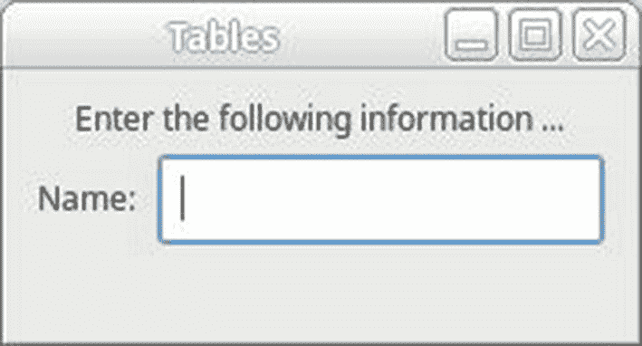
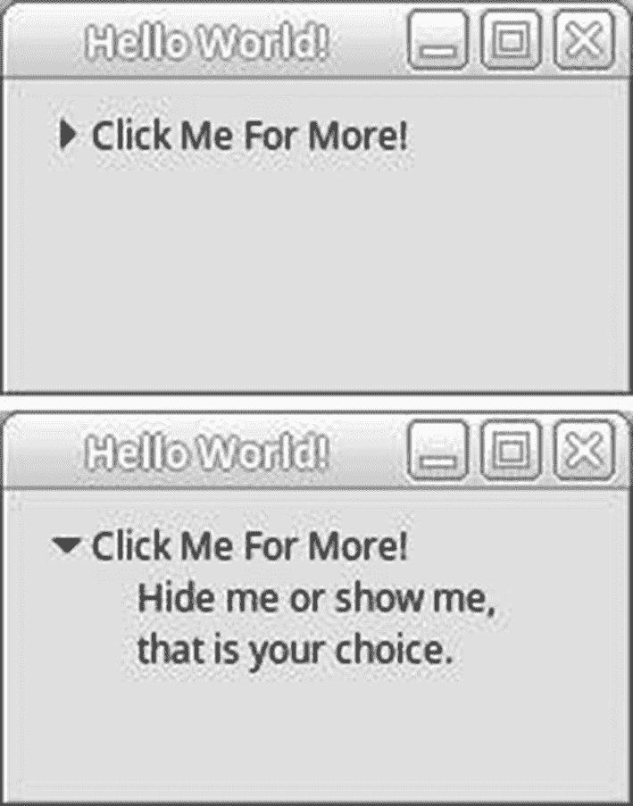

# 四、容器

第三章介绍了创建基本 GTK+ 应用所需的基本要素。它还引入了信号、回调方法、`Gtk.label`类、`Gtk.Button`类和`Gtk.Container`类。

在本章中，您将扩展我们对`Gtk.Container`类的知识。然后我们展示两种被包含的小部件:布局和装饰容器。此外，我们涵盖了许多派生的小部件，包括盒子、笔记本、手柄盒和扩展器。

最后一个小部件`Gtk.EventBox`，允许小部件利用 GDK 事件。

涵盖了以下主题。

*   `Gtk.Container`类及其后代的用途

*   如何使用布局容器，包括框、表、网格和窗格

*   何时使用固定集装箱

*   如何使用事件盒向所有小部件提供事件

## GTK。容器

在过去的章节中已经简要地介绍了这个类，但是现在我们将更深入地介绍这个类。这是必要的，这样您就有了关于容器的必要基础知识，这样我们就可以在后续章节中讨论所有的派生类。

`Gtk.Container`类是一个抽象类。因此，永远不要试图创建该类的实例，而只创建派生类的实例。

容器类的主要用途是允许父部件包含一个或多个子部件。GTK+ 中有两种类型的容器部件，一种用于布置孩子和装饰者，另一种除了定位孩子之外还添加了某种功能。

### 装饰容器

在第三章中，你被介绍到了`Gtk.ApplicationWindow`，一个从`Gtk.Window`衍生而来的窗口，它是从`Gtk.Bin`衍生而来的——一种容器类，只能容纳一个子部件。从这个类派生的小部件被称为装饰容器，因为它们向子小部件添加了某种类型的功能。

例如，`Gtk.Window`为 it child 提供了一些额外的功能，可以放在顶级小部件中。其他示例装饰器包括`Gtk.Frame`小部件，它在它的子部件周围绘制一个框架，`Gtk.Button`，它使它的子部件成为一个可点击的按钮，以及`Gtk.Expander`，它可以向用户隐藏或显示它的子部件。所有这些部件都使用`add`方法来添加子部件。

`Gtk.Bin`只公开了一个方法`get_child`。`Gtk.Bin`类的唯一目的是提供一个可实例化的小部件，从中可以派生出所有只需要一个子小部件的子类。它是公共基础的中心类。

```py
binwin = Gtk.Bin()

```

源自`Gtk.Bin`的小部件包括窗口、对齐、框架、按钮、组合框、事件框、扩展器、处理框、滚动窗口和工具项。这些容器中的许多将在本章的后续章节中介绍。

### 布局容器

GTK+ 提供的另一种容器小部件叫做布局容器。这些小部件用于排列多个小部件。布局容器可以通过它们是直接从`Gtk.Container`派生出来的这一事实来识别。

顾名思义，布局容器的目的是根据用户的偏好、您的指令和内置规则正确地排列它们的子容器。用户偏好包括使用主题和字体偏好。这些可以被覆盖，但是在大多数情况下，你应该尊重用户的偏好。还有管理所有容器小部件的调整大小规则，这将在下一节中介绍。

布局容器包括框、固定容器、窗格部件、图标视图、布局、菜单外壳、笔记本、套接字、表格、文本视图、工具栏和树视图。我们将在本章和本书的其余部分介绍大多数布局部件。我们没有涉及到的更多信息可以在 PyGObject API 参考( [`http://lazka.github.io/pgi-docs/#Gtk-3.0`](http://lazka.github.io/pgi-docs/%2523Gtk-3.0) )文档中找到。

### 调整子项的大小

除了排列和装饰子部件，容器还负责调整子部件的大小。调整大小分两个阶段执行:大小申请和大小分配。简而言之，这两个步骤协商小部件可用的大小。这是小部件、其祖先和其子部件之间的递归通信过程。

尺寸需求指的是孩子想要的尺寸。这个过程从顶级小部件开始，它会询问其子部件的首选尺寸。孩子们问他们的孩子等等，直到到达最后一个孩子。

此时，最后一个孩子根据需要在屏幕上正确显示的空间和程序员的任何大小请求来决定它想要的大小。例如，`Gtk.Label`小部件要求足够的空间来在屏幕上完全显示其文本，或者如果您要求它有更大的尺寸，则要求更多的空间。

然后，子窗口将这个大小传递给它的祖先，直到顶层小部件根据其子窗口的请求获得所需的空间量。

每个小部件都将其大小首选项作为宽度和高度值存储在一个`Gtk.Requisition`对象中。请记住，请购单只是一个请求；父小部件不一定要接受它。

当顶级小部件确定了它需要的空间量后，大小分配就开始了。如果您已经将顶层小部件设置为不可调整大小，则该小部件将永远不会调整大小。不会发生进一步的操作，请购单将被忽略；否则，顶级小部件会将自身调整到所需的大小。然后，它将可用空间量传递给其子部件。重复这个过程，直到所有的窗口小部件都调整了自己的大小。

每个小部件的大小分配存储在每个孩子的`Gtk.Allocation`结构的一个实例中。这个结构被传递给子部件，以便用`size_allocate()`调整大小。程序员也可以显式地调用这个函数，但是在大多数情况下这样做并不是一个好主意。

在大多数情况下，孩子们会得到他们想要的空间，但在某些情况下这是不可能的。例如，当顶级小部件无法调整大小时，申请不被接受。

相反，一旦小部件被其父部件分配了一个尺寸，小部件就别无选择，只能用新的尺寸重画自己。因此，在调用`size_allocate()`的地方要小心。在大多数情况下，`set_size_request()`最适合用来调整窗口小部件的大小。

### 集装箱信号

`Gtk.Container`类目前提供四种信号。这些是`"add"`、`"check_resize"`、`"remove"`和`"set_focus_child"`。

*   `"add"`:一个子部件被添加或打包到容器中。即使您没有显式调用`add()`，而是使用小部件的内置打包函数，也会发出这个信号。

*   容器正在检查在采取进一步行动之前是否需要为其子容器调整大小。

*   `"remove"`:已从容器中移除一个子容器。

*   容器的一个子容器已经从窗口管理器接收到焦点。现在您已经知道了`Gtk.Container`类的用途，我们将继续学习其他类型的容器小部件。你已经了解了窗口，一种`Gtk.Bin`小部件，所以我们将从一个叫做`Gtk.Box`的布局容器开始这一章。

## 水平和垂直框

`Gtk.Box`是一个容器小部件，允许在一个一维的矩形区域中打包多个孩子。有两种类型的盒子:一种是垂直盒子，它将子元素打包成一列；另一种是水平盒子，它将子元素打包成一行。

### 注意

在 GTK+ 2.x 中，`Gtk.Box`是一个抽象类。两个子类`Gtk.HBox`和`Gtk.VBox`分别用于创建水平和垂直的盒子。在 GTK+ 3.x 中，这两个类已经被弃用，而`Gtk.Box`已经成为一个真正的类，可以用来创建水平和垂直的盒子。

应用的图形输出如清单 4-1 所示。请注意，名称的显示顺序与它们被添加到数组中的顺序相同，即使每个名称都被打包在开始位置。请注意，名称的显示顺序与它们被添加到数组中的顺序相同，即使每个名称都被打包在开始位置。

```py
#!/usr/bin/python3

import sys
import gi
gi.require_version('Gtk', '3.0')
from gi.repository import Gtk

names = ["Andrew", "Joe", "Samantha", "Jonathan"]

class AppWindow(Gtk.ApplicationWindow):

def __init__(self, *args, **kwargs):
    super().__init__(*args, **kwargs)
    vbox = Gtk.Box(orientation=Gtk.Orientation.VERTICAL, spacing=0)
    for name in names:
        button = Gtk.Button.new_with_label(name)
        vbox.pack_start(button, True, True, 0)
        button.connect("clicked", self.on_button_clicked)
        button.set_relief(Gtk.ReliefStyle.NORMAL)
    self.set_border_width(10)
    self.set_size_request(200, -1)
    self.add(vbox)
    self.show_all()

def on_button_clicked(self, widget):
    self.destroy()

class Application(Gtk.Application):

    def __init__(self, *args, **kwargs):
        super().__init__(*args, application_id="org.example.myapp",
                         **kwargs)
        self.window = None

    def do_activate(self):
        if not self.window:
            self.window = AppWindow(application=self, title="Boxes")
        self.window.show_all()
        self.window.present()

if __name__ == "__main__":
    app = Application()
    app.run(sys.argv)

Listing 4-1Vertical Boxes with Default Packing

```

图 4-1 显示了运行清单 4-1 的结果。


图 4-1

默认包装的垂直框

在分析清单 4-2 ，`Gtk.Box`时使用了同样的一套方法。`Gtk.Box`使用同一套方法。

与每个小部件一样，您需要在使用对象之前初始化`Gtk.Box`。所有传递的参数都是关键字参数。默认方向如果没有关键字`"orientation"`被传递，默认是`Gtk.Orientation.HORIZONTAL`。其他关键词也可以，比如`"spacing"`。如果`"homogeneous"`关键字被设置为`True`，那么所有的孩子都被给予最小的空间来容纳每个窗口小部件。

```py
vbox = Gtk.Box(orientation=Gtk.Orientation.VERTICAL, spacing=0)

```

`"spacing"`关键字参数在每个孩子和它的邻居之间放置默认数量的像素间距。如果该框未设置为等间距，则在添加子项时，可以针对单个单元格更改该值。

由于在将标签添加到小部件后，您不需要进一步访问清单 4-2 中的标签，应用不会存储指向每个对象的单独指针。当父类被销毁时，它们都被自动清理。然后使用一种叫做`packing.Gtk.Box`小部件的方法将每个按钮添加到框中。

通过使用`pack_start()`将小部件添加到框中，子对象有三个自动设置的属性。扩展设置为`True`，自动为单元格提供分配给盒子的额外空间。这个空间被平均分配给所有请求它的单元。fill 属性也被设置为`True`，这意味着小部件扩展到所有提供的额外空间，而不是用填充填充它。最后，单元格与其相邻单元格之间的填充量被设置为零像素。

```py
vbox.pack_start(button, True, True, 0)

```

由于函数的命名，打包框可能有点不直观。考虑这个问题的最好方法是从包装的开始考虑。如果在开始位置打包，则会添加子对象，第一个子对象出现在顶部或左侧。如果在结束位置打包，第一个子对象会出现在盒子的底部或右侧。

还应该注意的是，`pack_start()`和`pack_end()`方法不仅指定打包参数，它们还将小部件添加到指定的小部件实例中。如果调用一个打包方法，就没有必要调用`add()`方法来添加小部件。事实上，如果您试图用打包方法和`add()`方法添加同一个小部件，这是一个运行时错误。

```py
#!/usr/bin/python3

import sys
import gi
gi.require_version('Gtk', '3.0')
from gi.repository import Gtk

names = ["Andrew", "Joe", "Samantha", "Jonathan"]

class AppWindow(Gtk.ApplicationWindow):

    def __init__(self, *args, **kwargs):
        super().__init__(*args, **kwargs)
        vbox = Gtk.Box(orientation=Gtk.Orientation.VERTICAL, spacing=0)
        for name in names:
            button = Gtk.Button.new_with_label(name)
            vbox.pack_end(button, False, False, 5)
            button.connect("clicked", self.on_button_clicked)
            button.set_relief(Gtk.ReliefStyle.NORMAL)
        self.set_border_width(10)
        self.set_size_request(200, -1)
        self.add(vbox)
        self.show_all()

    def on_button_clicked(self, widget):
        self.destroy()

class Application(Gtk.Application):

    def __init__(self, *args, **kwargs):
        super().__init__(*args, application_id="org.example.myapp",
                         **kwargs)
        self.window = None

    def do_activate(self):
        if not self.window:
            self.window = AppWindow(application=self, title="Boxes")
        self.window.show_all()
        self.window.present()

if __name__ == "__main__":
    app = Application()
    app.run(sys.argv)

Listing 4-2Vertical_Boxes Specifying Packing Parameters

```

因为我们从末尾开始打包每个部件，所以它们在图 4-2 中以相反的顺序显示。包装从盒子的末端开始，在前一个孩子之前包装每个孩子。您可以自由地散布对开始和结束打包函数的调用。GTK+ 跟踪两个参考位置。因为我们从末尾开始打包每个小部件，所以它们以相反的顺序显示。包装从盒子的末端开始，在前一个孩子之前包装每个孩子。您可以自由地散布对开始和结束打包函数的调用。GTK+ 跟踪两个参考位置。


图 4-2

指定包装参数的垂直框

通过将 expand 属性设置为`True`，单元格将会扩展，从而占用分配给小部件不需要的额外空间。通过将 fill 属性设置为`True`，小部件会扩展以填充单元格可用的额外空间。表 4-1 提供了扩展和填充属性所有可能组合的简要描述。

表 4-1

扩展和填充属性

<colgroup><col class="tcol1 align-left"> <col class="tcol2 align-left"> <col class="tcol3 align-left"></colgroup> 
| 

发展

 | 

充满

 | 

结果

 |
| --- | --- | --- |
| 真实的 | 真实的 | 单元格会扩展，从而占据分配给框额外空间，子小部件会扩展以填充该空间。 |
| 真实的 | 错误的 | 单元格会扩展，从而占据额外的空间，但小部件不会扩展。相反，多余的空间是空的。 |
| 错误的 | 真实的 | 单元格和小部件都不会扩展来填充额外的空间。这与将两个属性都设置为 False 是一回事。 |
| 错误的 | 错误的 | 单元格和小部件都不会扩展来填充额外的空间。如果调整窗口大小，单元格不会自动调整大小。 |

在前面的`pack_end()`调用中，每个单元格被告知在自身和任何相邻单元格之间放置五个像素的间距。此外，根据表 4-1 ,无论是单元格还是它的子窗口小部件都不会扩展来占用盒子提供的额外空间。

```py
vbox.pack_end(button, True, True, 0)

```

### 注意

如果你有使用其他图形工具包编程的经验，GTK+ 提供的大小协商系统可能看起来很奇怪。然而，你很快就会了解它的好处。如果您更改用户界面，GTK+ 会自动调整所有内容的大小，而不是要求您以编程方式重新定位所有内容。随着你继续学习 GTK+，你会发现这是一个巨大的好处。

虽然在向用户显示之前，您应该尝试确定`Gtk.Box`小部件中元素的顺序，但是可以使用`reorder_child()`对盒子中的子小部件进行重新排序。

```py
vbox.reorder_child(child_widget, position)

```

通过使用这种方法，您可以将一个子部件移动到`Gtk.Box`中的一个新位置。第一个小部件在`Gtk.Box`容器中的位置从零开始索引。如果您指定的位置值为–1 或大于子项数量的值，则小部件将被放置在框的最后一个位置。

## 水平和垂直窗格

`Gtk.Paned`是一种特殊类型的容器小部件，它恰好包含两个小部件。在它们之间放置了一个调整大小的条，允许用户通过向一个方向或另一个方向拖动该条来调整两个小部件的大小。当用户交互或编程调用移动滚动条时，两个小部件中的一个会收缩，而另一个会扩展。

### 注意

在 GTK+ 2.x 中，`Gtk.Paned`是一个抽象类。两个子类`Gtk.HPaned`和`Gtk.VPaned`分别用于创建水平和垂直的盒子。在 GTK+ 3.x 中，这两个类已经被弃用，而`Gtk.Paned`已经成为一个真正的类，可以用来创建水平和垂直窗格。

有两种类型的面板部件:水平调整大小和垂直调整大小。与框一样，`Gtk.Paned`提供了水平和垂直窗格的所有功能。清单 4-3 显示了一个简单的例子，其中两个`Gtk.Button`窗口小部件被放置为一个水平窗格的子窗口。

```py
#!/usr/bin/python3

import sys
import gi
gi.require_version('Gtk', '3.0')
from gi.repository import Gtk

class AppWindow(Gtk.ApplicationWindow):

    def __init__(self, *args, **kwargs):
        super().__init__(*args, **kwargs)
        self.set_border_width(10)
        hpaned = Gtk.Paned.new(Gtk.Orientation.HORIZONTAL)
        button1 = Gtk.Button.new_with_label("Resize")
        button2 = Gtk.Button.new_with_label("Me!")
        button1.connect("clicked", self.on_button_clicked)
        button2.connect("clicked", self.on_button_clicked)
        hpaned.add1(button1)
        hpaned.add2(button2)
        self.add(hpaned)
        self.set_size_request(225, 150)
        self.show_all()

    def on_button_clicked(self, button):
        self.destroy()

class Application(Gtk.Application):

    def __init__(self, *args, **kwargs):
        super().__init__(*args, application_id="org.example.myapp",
                         **kwargs)
        self.window = None

    def do_activate(self):
        if not self.window:
            self.window = AppWindow(application=self, title="Panes")
        self.window.show_all()
        self.window.present()

if __name__ == "__main__":
    app = Application()
    app.run(sys.argv)

Listing 4-3Horizontal Paned with Buttons

```

如图 4-3 所示，`Gtk.Paned`小部件在其两个子部件之间放置了一个竖条。通过拖动该栏，一个小部件收缩，而另一个则扩展。事实上，可以移动滚动条，使一个孩子完全隐藏在用户的视野之外。你学习如何用`pack1()`和`pack2()`方法来防止这种情况。



图 4-3

带按钮的水平窗格

在图 4-3 中，我们用下面的内容创建了一个`Gtk.Paned`对象。

```py
hpaned = Gtk.Paned.new(Gtk.Orientation.HORIZONTAL)

```

如果您想使用垂直窗格小部件，您只需要调用下面的。

```py
vpaned = Gtk.Paned.new(Gtk.Orientation.VERTICAL)

```

所有的`Gtk.Paned`函数都可以与任何一种类型的面板部件一起工作。

由于`Gtk.Paned`只能处理两个孩子，GTK+ 提供了打包每个孩子的功能。在下面的例子中，`pack1()`和`pack2()`方法被用来将两个孩子添加到`Gtk.Paned`。这些函数使用`Gtk.Paned`小部件的 resize 和 shrink 属性的默认值。

```py
hpaned.add1(button1);
hpaned.add2(button2);

```

前面的`add1()`和`add2()`方法调用来自清单 4-3 并且等同于下面的。

```py
hpaned.pack1(label1, False, True);
hpaned.pack2(label2, True, True);

```

`pack1()`和`pack2()`中的第二个参数指定当调整窗格大小时，子部件是否应该扩展。如果您将此项设置为`False`，无论您将可用区域扩大多少，子部件都不会扩展。

最后一个参数指定是否可以使子元素小于其大小要求。在大多数情况下，您希望将此设置为`True`，这样用户可以通过拖动调整大小栏来完全隐藏小部件。如果您想阻止用户这样做，请将第三个参数设置为`False`。表 4-2 说明了调整大小和收缩属性是如何相互关联的。

表 4-2

调整大小和收缩属性

<colgroup><col class="tcol1 align-left"> <col class="tcol2 align-left"> <col class="tcol3 align-left"></colgroup> 
| 

调整大小

 | 

收缩

 | 

结果

 |
| --- | --- | --- |
| 真实的 | 真实的 | 当调整窗格大小时，小部件会占用所有可用空间，用户可以将它调整到小于其要求的大小。 |
| 真实的 | 错误的 | 调整窗格大小时，小工具会占用所有可用空间，但可用空间必须大于或等于小工具的大小要求。 |
| 错误的 | 真实的 | 小部件不会调整自己的大小来占据窗格中额外的可用空间，但是用户可以使它小于它的尺寸要求。 |
| 错误的 | 错误的 | 微件不会调整自身大小以占用窗格中的额外可用空间，并且可用空间必须大于或等于微件的大小申请。 |

您可以使用`set_position()`轻松设置调整大小栏的确切位置。相对于容器的顶部或左侧，以像素为单位计算位置。如果您将条形的位置设置为零，并且小部件允许缩小，则条形会一直移动到顶部或左侧。

```py
paned.set_position(position)

```

大多数应用希望记住调整大小栏的位置，这样当用户下次加载应用时，它可以恢复到相同的位置。可以用`get_position()`检索调整大小条的当前位置。

```py
pos = paned.get_position()

```

提供了多种信号，但其中最有用的是 move-handle，它告诉你什么时候调整大小条被移动了。如果您想记住调整大小栏的位置，它会告诉您何时需要检索新值。

## 网格

到目前为止，我介绍的所有布局容器小部件都只允许在一个维度中打包孩子。

然而，`Gtk.Grid`小部件允许你在二维空间中打包孩子。

与使用多个`Gtk.Box`小部件相比，使用`Gtk.Grid`小部件的一个优点是相邻行和列中的子部件会自动相互对齐，这与盒中盒的情况不同。然而，这也是一个缺点，因为你不会总是希望一切都按照这种方式排列。

图 4-4 显示了一个包含三个小部件的简单网格。请注意，单个标签跨越两列。这说明了一个事实，即只要区域是矩形的，网格就允许一个小部件跨越多列和/或多行。



图 4-4

网格显示名称

清单 4-4 将两个`Gtk.Label`小部件和一个`Gtk.Entry`小部件插入 2 乘 2 区域(您将在第五章中学习如何使用`Gtk.Entry`小部件，但这将让您了解接下来会发生什么)。

```py
#!/usr/bin/python3

import sys
import gi
gi.require_version('Gtk', '3.0')
from gi.repository import Gtk

class AppWindow(Gtk.ApplicationWindow):

    def __init__(self, *args, **kwargs):
        super().__init__(*args, **kwargs)
        self.set_border_width(10)
        self.set_size_request(150, 100)
        grid = Gtk.Grid.new()
        label1 = Gtk.Label.new("Enter the following information ...")
        label2 = Gtk.Label.new("Name: ")
        entry = Gtk.Entry.new()
        grid.attach(label1, 0, 0, 2, 1)
        grid.attach(label2, 0, 1, 1, 1)
        grid.attach(entry, 1, 1, 1, 1)
        grid.set_row_spacing(5)
        grid.set_column_spacing(5)
        self.add(grid)

class Application(Gtk.Application):

    def __init__(self, *args, **kwargs):
        super().__init__(*args, application_id="org.example.myapp",
                         **kwargs)
        self.window = None

    def do_activate(self):
        if not self.window:
            self.window = AppWindow(application=self, title="Tables")
        self.window.show_all()
        self.window.present()

if __name__ == "__main__":
    app = Application()
    app.run(sys.argv)

Listing 4-4Grids Displaying Name

```

### 栅格间距

如果你想设置网格中每一列的间距，你可以使用`set_column_spacing()`。这个函数在`set_row_spacing()`中用于在行之间添加填充。这些功能会覆盖网格先前的任何设置。`set_row_spacing()`在行间添加衬垫。这些功能会覆盖网格先前的任何设置。

```py
grid.set_column_spacing(5)

```

`grid.attach()`方法需要五个参数，如下所示。

```py
Grid.attach(child_widget, left_pos, top_pos, width, height)

```

## 固定集装箱

`Gtk.Fixed`小部件是一种布局容器，允许您按像素放置小部件。使用这个小部件时可能会出现许多问题，但是在我们探讨缺点之前，让我们看一个简单的例子。

清单 4-5 显示了包含两个按钮的`Gtk.Fixed`小部件，分别位于(0，0)和(20，30)位置，相对于小部件的左上角。

```py
#!/usr/bin/python3

import sys
import gi
gi.require_version('Gtk', '3.0')
from gi.repository import Gtk

class AppWindow(Gtk.ApplicationWindow):

    def __init__(self, *args, **kwargs):
        super().__init__(*args, **kwargs)
        self.set_border_width(10)
        fixed = Gtk.Fixed.new()
        button1 = Gtk.Button.new_with_label("Pixel by pixel ...")
        button2 = Gtk.Button.new_with_label("you choose my fate.")
        button1.connect("clicked", self.on_button_clicked)
        button2.connect("clicked", self.on_button_clicked)
        fixed.put(button1, 0, 0)
        fixed.put(button2, 22, 35)
        self.add(fixed)
        self.show_all()

    def on_button_clicked(self, widget):
        self.destroy()

class Application(Gtk.Application):

    def __init__(self, *args, **kwargs):
        super().__init__(*args, application_id="org.example.myapp",
                         **kwargs)
        self.window = None

    def do_activate(self):
        if not self.window:
            self.window = AppWindow(application=self, title="Fixed")
        self.window.show_all()
        self.window.present()

if __name__ == "__main__":
    app = Application()
    app.run(sys.argv)

Listing 4-5Specifying Exact Locations

```

用`Gtk.Fixed.new()`初始化的`Gtk.Fixed`小部件允许您在特定位置放置特定大小的小部件。使用`put()`在指定的水平和垂直位置放置微件。

```py
fixed.put(child, x, y)

```

固定容器的左上角由位置(0，0)引用。您应该只能指定小部件的真实位置或正空间中的位置。固定容器会自行调整大小，因此每个小部件都是完全可见的。

如果您需要在小部件被放入`Gtk.Fixed`容器后移动它，您可以使用`move()`。您需要注意不要覆盖已经放置的小部件。在重叠的情况下，`Gtk.Fixed`小部件不提供通知。相反，它试图呈现具有不可预测结果的窗口。

```py
fixed.move(child, x, y)

```

这给我们带来了使用`Gtk.Fixed`小部件的固有问题。第一个问题是你的用户可以随意使用任何他们想要的主题。这意味着用户机器上的文本大小可能不同于您机器上的文本大小，除非您明确设置了字体。不同的用户主题中，小部件的大小也各不相同。这可能导致错位和重叠。这在图 4-5 中有所说明，图中显示了两张截图，一张字体较小，一张字体较大。


图 4-5

Gtk 中不同字体大小引起的问题。固定集装箱

您可以显式设置文本的大小和字体以避免重叠，但在大多数情况下不建议这样做。为弱视用户提供了辅助功能选项。如果您更改他们的字体，一些用户可能无法阅读屏幕上的文本。

当您的应用被翻译成其他语言时，使用`Gtk.Fixed`会出现另一个问题。用户界面在英语中可能看起来很棒，但在其他语言中显示的字符串可能会导致显示问题，因为宽度不是恒定的。此外，从右向左阅读的语言，如希伯来语和阿拉伯语，不能用`Gtk.Fixed`小部件正确地映射。最好使用可变尺寸的容器，例如本例中的`Gtk.Box`或`Gtk.Grid`。

最后，当使用`Gtk.Fixed`容器时，在图形界面中添加和删除小部件可能会很痛苦。更改用户界面需要您重新定位所有的小部件。如果您的应用有很多小部件，这就带来了长期维护的问题。

另一方面，你有网格、盒子和其他各种自动格式化的容器。如果您需要在用户界面中添加或删除小部件，就像添加或删除单元格一样简单。这使得维护更加有效，这是您在大型应用中应该考虑的事情。

因此，除非您知道这些问题不会困扰您的应用，否则您应该使用可变大小的容器来代替`Gtk.Fixed`。提供此容器只是为了让您知道，如果出现合适的情况，它是可用的。即使在合适的情况下，灵活的容器几乎总是更好的解决方案，并且是正确的做事方式。

## 使增大者

容器只能处理一个孩子。通过单击扩展器标签左侧的三角形，可以显示或隐藏子级。在图 4-6 中可以看到这个动作前后的截图。



图 4-6

一辆 Gtk。膨胀容器

清单 4-6 向您介绍了最重要的`Gtk.Expander`方法。

```py
#!/usr/bin/python3

import sys
import gi
gi.require_version('Gtk', '3.0')
from gi.repository import Gtk

class AppWindow(Gtk.ApplicationWindow):

    def __init__(self, *args, **kwargs):
        super().__init__(*args, **kwargs)
        self.set_border_width(10)
        self.set_size_request(200, 100)
        expander = Gtk.Expander.new_with_mnemonic("Click _Me For More!")
        label = Gtk.Label.new ("Hide me or show me,\nthat is your choice.")
        expander.add(label)
        expander.set_expanded(True)
        self.add(expander)

class Application(Gtk.Application):

    def __init__(self, *args, **kwargs):
        super().__init__(*args, application_id="org.example.myapp",
                         **kwargs)
        self.window = None

    def do_activate(self):
        if not self.window:
            self.window = AppWindow(application=self, title="Hello World!")
        self.window.show_all()
        self.window.present()

if __name__ == "__main__":
    app = Application()
    app.run(sys.argv)

Listing 4-6Gtk.Expander Container

```

激活一个`Gtk.Expander`窗口小部件会使其根据当前状态展开或收缩。

### 小费

几乎每个显示标签的小部件都有助记符。在可能的情况下，您应该始终使用该功能，因为有些用户更喜欢使用键盘浏览应用。

如果您希望在扩展标签中包含一个下划线字符，您应该在它前面加上第二个下划线。如果你不想利用助记符特性，你可以用标准字符串作为标签，使用`Gtk.Expander.new()`来初始化`Gtk.Expander`，但是向用户提供助记符作为一个选项总是一个好主意。在普通的扩展标签中，下划线字符不会被解析，而是被视为另一个字符。

`Gtk.Expander`小部件本身是从`Gtk.Bin`派生出来的，这意味着它只能包含一个子部件。和其他包含一个子组件的容器一样，您需要使用`expander.add()`来添加子组件。

通过调用`expander.set_expanded()`可以显示或隐藏`Gtk.Expander`容器的子部件。`expander.set_expanded()`。

```py
expander.set_expanded(boolean)

```

默认情况下，GTK+ 不会在扩展标签和子部件之间添加任何间距。要添加像素间距，可以使用`expander.set_spacing()`添加填充。

```py
expander.set_spacing(spacing)

```

## 笔记本

`Gtk.Notebook`小部件将子小部件组织成多个页面。用户可以通过单击小部件一边出现的选项卡在这些页面之间切换。

您可以指定选项卡的位置，尽管默认情况下它们显示在顶部。您也可以完全隐藏选项卡。图 4-7 显示了一个带有两个选项卡的`Gtk.Notebook`小部件，它是用清单 4-7 中的代码创建的。


图 4-7

具有多页的笔记本容器

创建笔记本容器时，必须为每个选项卡指定一个标签小部件和一个子小部件。标签可以添加到前面或后面，插入，重新排序和删除。

```py
#!/usr/bin/python3

import sys
import gi
gi.require_version('Gtk', '3.0')
from gi.repository import Gtk

class AppWindow(Gtk.ApplicationWindow):

    def __init__(self, *args, **kwargs):
        super().__init__(*args, **kwargs)
        self.set_border_width(10)
        self.set_size_request(250, 100)
        notebook = Gtk.Notebook.new()
        label1 = Gtk.Label.new("Page 1")
        label2 = Gtk.Label.new("Page 2")
        child1 = Gtk.Label.new("Go to page 2 to find the answer.")
        child2 = Gtk.Label.new("Go to page 1 to find the answer.")
        notebook.append_page(child1, label1)
        notebook.append_page(child2, label2)

        notebook.set_tab_pos(Gtk.PositionType.BOTTOM)
        self.add(notebook)

class Application(Gtk.Application):

    def __init__(self, *args, **kwargs):
        super().__init__(*args, application_id="org.example.myapp",
                         **kwargs)
        self.window = None

    def do_activate(self):
        if not self.window:
            self.window = AppWindow(application=self, title="Notebook")
        self.window.show_all()
        self.window.present()

if __name__ == "__main__":
    app = Application()
    app.run(sys.argv)

Listing 4-7Container with Multiple Pages

```

在你创建一个`Gtk.Notebook`之后，除非你给它添加标签，否则它不是很有用。要将标签添加到标签列表的末尾或开头，可以分别使用`notebook.append_page()`或`notebook.prepend_page()`。这些方法中的每一个都接受一个子部件，以及一个显示在选项卡中的部件，如下所示。

### 小费

选项卡标签不一定是`Gtk.Label`小部件。例如，您可以使用一个包含标签和关闭按钮的`Gtk.Box`小部件。这允许您在标签中嵌入其他有用的小部件，比如按钮和图像。

每个笔记本页面只能显示一个子部件。然而，每个孩子可以是另一个容器，所以每个页面可以显示许多部件。事实上，可以使用`Gtk.Notebook`作为另一个`Gtk.Notebook`标签的子部件。

### 警告

将笔记本放在笔记本中是可能的，但是要小心，因为它很容易混淆用户。如果必须这样做，请确保将子笔记本的选项卡放在笔记本的另一侧，而不是父笔记本的选项卡。通过这样做，用户能够找出哪些标签属于哪个笔记本。

如果想在特定位置插入一个 tab，可以使用`notebook.insert_page()`。此函数允许您指定选项卡的整数位置。位于插入的选项卡之后的所有选项卡的索引增加 1。

```py
notebook.insert_page (child, tab_label, position)

```

用于向`Gtk.Notebook`添加标签的三个函数都返回所添加标签的整数位置，如果操作失败，则返回–1。

### 笔记本属性

在清单 4-7 中，为`Gtk.Notebook`设置了 tab-position 属性，这是通过以下调用完成的。

```py
notebook.set_tab_pos(position)

```

通过使用`Gtk.PositionType`枚举可以在`notebook.set_tab_pos()`中设置标签位置。其中包括`Gtk.PositionType.TOP`、`Gtk.PositionType.BOTTOM`、`Gtk.PositionType.LEFT`、`Gtk.PositionType.RIGHT`。

如果你想给用户多种选择，但又想分多个阶段展示，笔记本是很有用的。如果您在每个选项卡中放置几个并使用`notebook.set_show_tabs()`隐藏选项卡，您可以让用户在选项之间来回移动。这个概念的一个例子是你在操作系统中看到的许多向导，类似于`Gtk.Assistant`小部件提供的功能。

```py
notebook.set_show_tabs(show_tabs)

```

在某个时候，`Gtk.Notebook`用尽了空间来存储标签。为了解决这个问题，您可以使用`notebook.set_scrollable()`将笔记本标签设置为可滚动。

```py
notebook.set_scrollable(scrollable)

```

该属性强制对用户隐藏选项卡。提供了箭头，以便用户能够滚动选项卡列表。这是必要的，因为选项卡只显示在一行或一列中。

如果调整窗口大小，使所有选项卡都无法显示，选项卡将变为可滚动的。如果您将字体大小设置得足够大，以至于无法绘制所有选项卡，也会发生滚动。如果选项卡占用的空间可能会超过分配的空间，那么您应该始终将该属性设置为`True`。

### 选项卡操作

GTK+ 提供了多种功能，允许您与已经存在的选项卡进行交互。在了解这些方法之前，了解这些方法中的大多数会导致发出更改当前页面信号是很有用的。当处于焦点的当前选项卡发生更改时，会发出此信号。

如果你可以添加标签，也必须有一个方法来删除标签。通过使用`notebook.remove_page()`，您可以根据索引引用移除标签。如果在将小部件添加到`Gtk.Notebook`之前没有增加引用计数，这个函数将释放最后一个引用并销毁子部件。

```py
notebook.remove_page(page_number)

```

您可以通过调用`notebook.reorder_child()`来手动重新排列选项卡。您必须指定要移动的页面的子部件以及它应该移动到的位置。如果指定一个大于制表符数量的数字或负数，制表符将被移动到列表的末尾。

```py
notebook.reorder_child(child, position)

```

有三种方法可用于更改当前页面。如果知道想要查看的页面的具体索引，可以使用`notebook.set_current_page()`移动到该页面。

```py
notebook.set_current_page(page_number)

```

有时，您可能还希望切换到下一个或上一个标签，这可以通过调用`notebook.next_page()`或`notebook.prev_page()`来完成。如果调用这两个函数中的任何一个会导致当前选项卡降到零以下或超过当前的选项卡数，则什么也不会发生；该呼叫被忽略。

当决定移动到哪个页面时，了解当前页面和选项卡总数通常是有用的。这些值可以分别用`notebook.get_current_page()`获得。

## 事件框

包括`Gtk.Label`在内的各种小部件不会响应 GDK 事件，因为它们没有关联的 GDK 窗口。为了解决这个问题，GTK+ 提供了一个名为`Gtk.EventBox`的容器小部件。事件框通过为对象提供一个 GDK 窗口来捕捉子部件的事件。

清单 4-8 通过使用事件盒捕获`button-press-event`信号。双击标签时，标签中的文本会根据其当前状态进行更改。当单击发生时，没有任何可见的事情发生，尽管在这种情况下仍然通过使用事件框发出信号(`Gtk.Label)`)。双击标签时，标签中的文本会根据其当前状态进行更改。当单击发生时，没有任何可见的事情发生，尽管在这种情况下仍然会发出信号。

```py
#!/usr/bin/python3

import sys
import gi
gi.require_version('Gtk', '3.0')
from gi.repository import Gtk, Gdk

class AppWindow(Gtk.ApplicationWindow):

    def __init__(self, *args, **kwargs):
        super().__init__(*args, **kwargs)
        self.set_border_width(10)
        self.set_size_request(200, 50)
        eventbox = Gtk.EventBox.new()
        label = Gtk.Label.new("Double-Click Me!")
        eventbox.set_above_child(False)
        eventbox.connect("button_press_event", self.on_button_pressed, label)
        eventbox.add(label)
        self.add(eventbox)
        eventbox.set_events(Gdk.EventMask.BUTTON_PRESS_MASK)
        eventbox.realize()

    def on_button_pressed(self, eventbox, event, label):
        if event.type == Gdk.EventType._2BUTTON_PRESS:
            text = label.get_text()
            if text[0] == 'D':
                label.set_text("I Was Double-Clicked!")
            else:
                label.set_text("Double-Click Me Again!")
        return False

class Application(Gtk.Application):

    def __init__(self, *args, **kwargs):
        super().__init__(*args, application_id="org.example.myapp",
                         **kwargs)
        self.window = None

    def do_activate(self):
        if not self.window:
            self.window = AppWindow(application=self, title="Hello World!")
        self.window.show_all()
        self.window.present()

if __name__ == "__main__":
    app = Application()
    app.run(sys.argv)

Listing 4-8Adding Events to Gtk.Label

```

当使用一个事件盒时，你需要决定事件盒的`Gdk.Window`应该位于其子窗口的上方还是下方。如果事件框窗口在上方，则事件框内的所有事件都将进入事件框。如果窗口在下面，子部件窗口中的事件首先到达那个部件，然后到达它的父部件。

### 注意

如果你设置窗口的位置如下，事件会首先到达子部件。但是，这只适用于关联了 GDK 窗口的小部件。如果子窗口是一个`Gtk.Label`小部件，它就没有能力自己检测事件。因此，在清单 4-8 中将窗口的位置设置为上方还是下方并不重要。

事件框窗口的位置可以用`eventbox.set_above_child()`移动到其子窗口的上方或下方。默认情况下，所有事件框的该属性都设置为`False`。这意味着所有事件都由首次发出信号的小部件处理。小部件完成后，事件将被传递给它的父部件。

```py
eventbox.set_above_child(above_child)

```

接下来，您需要向事件框添加一个事件掩码，以便它知道小部件接收的是什么类型的事件。指定事件屏蔽的`Gdk.EventMask`枚举值如表 4-3 所示。如果需要设置多个值，可以将一个由`Gdk.EventMask`值组成的按位列表传递给`eventbox.set_events()`。

表 4-3

Gdk .事件掩码值

<colgroup><col class="tcol1 align-left"> <col class="tcol2 align-left"></colgroup> 
| 

价值

 | 

描述

 |
| --- | --- |
| Gdk .事件掩码. EXPOSURE_MASK | 当小部件公开时接受事件。 |
| gdk . event mask . pointer _ motion _ mask-事件遮罩 | 接受离开窗口附近时发出的事件。 |
| Gdk。事件掩码。指针 _ 运动 _ 提示 _ 掩码 | 限制 GDK _ 运动 _ 通知事件的数量，这样它们就不会在每次鼠标移动时发出。 |
| gdk . event mask . button _ motion _ mask-事件遮罩 | 当任何按钮被按下时接受指针运动事件。 |
| gdk . event mask . button 1 _ motion _ mask | 按下按钮 1 时接受指针运动事件。 |
| gdk . event mask . button 2 _ motion _ mask | 按下按钮 2 时接受指针运动事件。 |
| gdk . event mask . button 3 _ motion _ mask | 按下按钮 3 时接受指针运动事件。 |
| gdk . event mask . button _ press _ mask-事件遮罩 | 接受鼠标按键事件。 |
| gdk . event mask . button _ release _ mask-事件遮罩 | 接受鼠标按钮释放事件。 |
| gdk . event mask . key _ press _ mask-事件遮罩 | 接受键盘上的按键事件。 |
| gdk . event mask . key _ release _ mask-事件遮罩 | 接受键盘上的按键释放事件。 |
| Gdk。事件掩码。输入 _ 通知 _ 掩码 | 接受进入窗口附近时发出的事件。 |
| Gdk。EventMask.LEAVE_NOTIFY_MASK | 接受离开窗口附近时发出的事件。 |
| Gdk。事件掩码。焦点 _ 变化 _ 掩码 | 接受焦点事件的改变。 |
| Gdk。事件掩码.结构 _ 掩码 | 接受窗口配置发生更改时发出的事件。 |
| Gdk。事件掩码.属性 _ 更改 _ 掩码 | 接受对对象属性的更改。 |
| Gdk。事件掩码。可见性 _ 通知 _ 掩码 | 接受可见性事件的更改。 |
| Gdk。EventMask.PROXIMITY_IN_MASK | 接受当鼠标光标进入小部件附近时发出的事件。 |
| Gdk。EventMask.PROXIMITY_OUT_MASK | 接受当鼠标光标离开小部件附近时发出的事件。 |
| Gdk。事件掩码.子结构 _ 掩码 | 接受更改子窗口配置的事件。 |
| Gdk.EventMask.SCROLL_MASK | 接受所有滚动事件。 |
| Gdk。事件掩码。所有事件掩码 | 接受所有类型的事件。 |

在小部件上调用`eventbox.realize()`之前，你*必须*调用`eventbox.set_events()`。如果 GTK+ 已经实现了一个小部件，你必须使用`eventbox.add_events()`来添加事件掩码。

在调用`eventbox.realize()`之前，您的`Gtk.EventBox`还没有关联的`Gdk.Window`或任何其他 GDK 小工具资源。通常，实现发生在父实现时，但事件框是个例外。当你在一个 widget 上调用`window.show()`时，由 GTK+ 自动实现。当你调用`window.show_all()`时，事件框不会被实现，因为它们被设置为不可见。在事件盒上调用`eventbox.realize()`是解决这个问题的简单方法。

当您意识到您的事件框时，您需要确保它已经作为一个孩子添加到一个顶级小部件中，否则它将无法工作。这是因为，当您实现一个小部件时，它会自动实现它的祖先。如果它没有祖先，GTK+ 不快乐，实现失败。

事件盒实现后，它有一个关联的`Gdk.Window`。`Gdk.Window`是一个类，指的是屏幕上绘制小部件的矩形区域。它和`Gtk.Window`不是一回事，后者指的是带有标题栏等的顶层窗口。一个`Gtk.Window`包含许多`Gdk.Window`对象，每个子部件一个。它们用于在屏幕上绘制小部件。

## 测试你的理解能力

本章向您介绍了 GTK+ 中包含的许多容器小部件。以下两个练习允许您练习您所学到的关于这些新部件的知识。

### 练习 1:使用多个容器

容器的一个重要特征是每个容器可以容纳其他容器。为了真正理解这一点，在本例中，您使用了大量的容器。主窗口底部显示一个`Gtk.Notebook`和两个按钮。

笔记本应该有四页。每个笔记本页面应该包含一个移动到下一页的`Gtk.Button`(最后一页的`Gtk.Button`应该绕到第一页)。

在窗口底部创建两个按钮。第一个应该移动到`Gtk.Notebook`中的前一页，如果必要的话，绕到最后一页。第二个按钮应该关闭窗口，并在单击时退出应用。

练习 1 是一个要实现的简单应用，但是它阐明了几个要点。首先，它展示了`Gtk.Box`的用处，以及如何将垂直和水平框一起使用来创建复杂的用户界面。

的确，同样的应用可以用一个`Gtk.Grid`作为窗口的直接子窗口来实现，但是用一个水平框来对齐底部的按钮要容易得多。您会注意到按钮被打包在盒子的末尾，这使它们与盒子的右侧对齐，这对于盒子来说更容易实现。

此外，您还看到了容器可以并且应该用来容纳其他容器。例如，在练习 1 中，a `Gtk.Window`持有一个垂直的`Gtk.Box`，它持有一个水平的`Gtk.Box`和一个`Gtk.Notebook`。随着应用规模的增长，这种结构会变得更加复杂。

完成练习 1 后，继续练习 2。在下一个问题中，您使用窗格容器而不是垂直框。

### 练习 2:更多容器

在本练习中，您将扩展练习 1 中编写的代码。不要使用垂直的`Gtk.Box`来放置笔记本和水平的按钮框，而是创建一个垂直的`Gtk.Paned`小部件。

除了这个改变之外，你应该隐藏`Gtk.Notebook`标签，这样用户不按下按钮就不能在页面之间切换。在这种情况下，您无法知道页面何时被更改。因此，`Gtk.Notebook`页面中的每个按钮都应该包含在它自己的扩展器中。扩展标签允许您区分笔记本页面。

一旦你完成了练习 2，你就已经练习了`Gtk.Box`、`Gtk.Paned`、`Gtk.Notebook`和`Gtk.Expander`——这四个重要的容器贯穿了本书的其余部分。

在继续下一章之前，您可能想测试一下本章中的几个容器，这些容器在练习 1 和 2 中是不需要的。这让你练习使用所有的容器，因为后面的章节不会回顾过去的信息。

## 摘要

在本章中，你学习了两种类型的容器部件:装饰器和布局容器。涵盖的装饰器类型有扩展器和事件盒。包含的布局容器类型有盒子、窗格、网格、固定容器和笔记本。

事件盒容器将在后面的章节中出现，因为除了`Gtk.Label`之外还有其他部件不能处理 GDK 事件。这是在您了解这些小部件时指定的。在后面的章节中你也会看到大多数的容器。

虽然这些容器是 GTK+ 应用开发所必需的，但是在大多数应用中，仅仅在容器中显示`Gtk.Label`和`Gtk.Button`小部件并不是非常有用(或者有趣)。除了基本的用户交互之外，这种类型的应用几乎不提供任何功能。

因此，在下一章中，你将会学到许多允许你与用户交互的小部件。这些小部件包括按钮、切换、文本输入和微调按钮的类型。