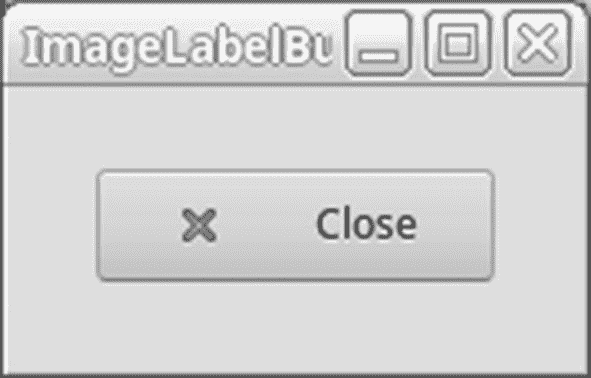
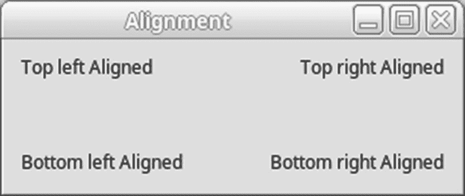

# 十二、自定义小部件

到目前为止，您已经了解了很多关于 GTK+ 及其支持库的知识。您已经掌握了足够的知识，可以使用 PyGTK 提供的小部件来创建自己的复杂应用。

然而，你还没有学会的一件事是如何创建你自己的小部件。因此，本章致力于从现有的 GTK+ 类中派生新的类。我们将通过一些例子向您展示使用 PyGTK 实现这一点是多么容易。

在本章中，您将学习如何从 GTK+ 小部件中派生出新的类和小部件。我们提供了几个如何做到这一点的例子，并讨论了在这个过程中可能遇到的一些问题。

## 图像/标签按钮

从 GTK+ 3.1 开始，所有库存物品都被弃用。虽然我同意这个决定，但我对`Gtk.Button`没有被扩展到包含一个按钮选项来显示图像和文本感到失望。去掉 use-stock 属性后，`Gtk.Button`只能显示文本或图像，但不能同时显示两者。

解决这个问题的方法很容易实现，但是非常重复，而且根本不是面向对象的。您可以在“使用按钮”一节中看到一个如何实现该变通方法的示例。你可以很容易地看到，如果你有很多按钮要编码，这个解决方案将是非常重复的，并且你没有很好地利用这个实现的代码重用。

另一个争论点是程序员被迫从字符串中查找他们想要的真实图像。如果新的实现为您做了这些工作，并且您需要向新的小部件提供的只是查找字符串，那会怎么样呢？毕竟，您可能希望使用来自用户默认主题的图像，所以让新的小部件来完成所有工作。

图 12-1 显示了清单 12-1 所示程序创建的图像标签按钮。这个简单的实现展示了如何扩展标准`Gtk.Button`的功能和风格。



图 12-1

工作中的 ImageLabelButton

清单 12-1 展示了`ImageLabelButton`的类实现。

```py
#!/usr/bin/python3

import sys
import gi
gi.require_version('Gtk', '3.0')
from gi.repository import Gtk

class ImageLabelButton(Gtk.Button):

    def __init__(self, orientation=Gtk.Orientation.HORIZONTAL,
                  image="image-missing", label="Missing", *args,
                  **kwargs):
        super().__init__(*args, **kwargs)
        # now set up more properties
        hbox = Gtk.Box(orientation, spacing=0)
        if not isinstance(image, str):
            raise TypeError("Expected str, got %s instead." % str(image))
        icon_theme = Gtk.IconTheme.get_default()
        icon = icon_theme.load_icon(image, -1,
                                    Gtk.IconLookupFlags.FORCE_SIZE)
        img = Gtk.Image.new_from_pixbuf(icon)
        hbox.pack_start(img, True, True, 0)
        img.set_halign(Gtk.Align.END)
        if not isinstance(label, str):
            raise TypeError("Expected str, got %s instead." % str(label))
        if len(label) > 15:
            raise ValueError("The length of str may not exceed 15 characters.")
        labelwidget = Gtk.Label(label)
        hbox.pack_start(labelwidget, True, True, 0)
        labelwidget.set_halign(Gtk.Align.START)
        self.add(hbox)

class AppWindow(Gtk.ApplicationWindow):

    def __init__(self, *args, **kwargs):
        super().__init__(*args, **kwargs)
        self.set_border_width(25)
        button = ImageLabelButton(image="window-close", label="Close")
        button.connect("clicked", self.on_button_clicked)
        button.set_relief(Gtk.ReliefStyle.NORMAL)
        self.add(button)
        self.set_size_request(170, 50)

    def on_button_clicked(self, button):
        self.destroy()

class Application(Gtk.Application):

    def __init__(self, *args, **kwargs):
        super().__init__(*args, application_id="org.example.myapp",
                         **kwargs)
        self.window = None

    def do_activate(self):
        if not self.window:
            self.window = AppWindow(application=self,
                                    title="ImageLabelButton")
            self.window.show_all()
            self.window.present()

if __name__ == "__main__":
    app = Application()
    app.run(sys.argv)

Listing 12-1ImageLabelButton Class Implementation

```

要理解的第一点是，当创建一个`Gtk.Button`时，按钮的样式是在分配 image 或 label 属性时设置的。一旦指定，按钮的样式就不能更改。新款`ImageLabelButton`也是如此。

为了开始我们的讨论，让我们仔细看看小部件的初始化。我们允许两个新属性并覆盖一个现有属性。属性标签覆盖父属性，但使用方式与标签小部件的文本相同。属性方向和图像是新的。它们分别用于指定标签/图像的方向(水平或垂直)和字符串名称，以查找相应的默认主题图标。

其余的初始化代码很简单。使用默认方向或关键字参数指定的方向创建一个`Gtk.Box`。接下来，如果指定了 image 关键字，则在默认用户主题中查找名称，获取图标，并将图像添加到`Gtk.Box`。接下来，如果指定了标签，则创建一个`Gtk.Label`，并将其添加到`Gtk.Box`。最后，将框添加到按钮。

我们通过调整图像和标签文本的对齐方式改变了`Gtk.ImageLabelButton`类，这样无论按钮的大小如何，它们都保持居中。我们使用了`set_halign()`方法，并关闭了`pack_start()`方法中使用的填充和扩展属性。

注意，我们没有覆盖底层`Gtk.Button`的任何其他方法或属性。在这种情况下，没有必要以任何其他方式修改按钮。`ImageLabelButton`表现得像普通的`Gtk.Button`一样。因此，我们已经完成了创建一个新的按钮类的任务。

最重要的是，新类中有一些错误检测代码来捕捉无效的数据类型和值。您提供这种参数检查，这一点怎么强调都不为过。缺少适当的错误消息和适当的错误检测会毁掉您为新类所做的所有工作，因为它没有提供足够的调试信息来纠正甚至是很小的错误或问题，这将导致您的类被废弃。

## 自定义消息对话框

子类化 GTK+ 小部件的另一个原因是通过将更多的行为集成到小部件中来节省工作。例如，在显示对话框之前，标准的 GTK+ 对话框需要大量的初始化工作。通过将标准的外观和感觉集成到所有的消息对话框中，您可以解决重复的工作量。

减少创建对话框所需工作量的方法是创建一个包含您需要的所有功能的设计，使用默认设置或可以激活附加选项/值的参数。在清单 12-2 中，让我们看看一个定制的问题对话框，看看它是如何工作的。

```py
class ooQuestionDialog(Gtk.Dialog):

hbox = None
vbox = None

    def __init__(self, title="Error!", parent=None,
                  flags=Gtk.DialogFlags.MODAL, buttons=("NO",
                  Gtk.ResponseType.NO, "_YES",
                           Gtk.ResponseType.YES)):
        super().__init__(title=title, parent=parent, flags=flags,
                         buttons=buttons)
        self.vbox = self.get_content_area()
        self.hbox = Gtk.Box(orientation=Gtk.Orientation.HORIZONTAL, spacing=5)

        icon_theme = Gtk.IconTheme.get_default()
        icon = icon_theme.load_icon("dialog-question", 48,
                                    Gtk.IconLookupFlags.FORCE_SVG)
        image = Gtk.Image.new_from_pixbuf(icon)
        self.hbox.pack_start(image, False, False, 5)
        self.vbox.add(self.hbox)

    def set_message(self, message, add_msg=None):
        self.hbox.pack_start(Gtk.Label(message), False, False, 5)
        if add_msg != None:
           expander = Gtk.Expander.new_with_mnemonic( \ "_Click
                me for more information.")
           expander.add(Gtk.Label(add_msg))
           self.vbox.pack_start(expander, False, False, 10)

    def run(self):
        self.show_all()
        response = super().run()
        self.destroy()
        return response

Listing 12-2A Customized Question Dialog Implementation

```

这个对话框有一个预定义的设计，对于我们所有的消息对话框都是通用的。它包含以下元素。

*   每种类型的消息对话框都有单独的类。

*   对话框总是包含一个图标。显示的图标取决于显示的对话框类型(消息、信息、错误等)。).

*   对话框总是显示主要消息。

*   显示的按钮的数量和类型有一个逻辑默认值，用户可以覆盖它。

*   所有对话框默认为模态。

*   对话框中还会显示一条附加消息。它包含在一个扩展器中，可以在对话框显示的任何时候使用。

*   类别提供了两个额外的方法。第一种方法`set_message()`，设置主要对话消息和可选的附加消息。第二个方法，`run()`，显示对话框，运行对话框，销毁对话框，并返回`response_id`。如果您想要显示一个非模态对话框，那么`run()`方法是可选的。当然，你必须在`run()`对话框中提供额外的功能来实现。

实例化和运行对话框非常简单。以下代码执行打开对话框所需的所有任务。

```py
dialog = ooQuestionDialog(parent=parentwin)
dialog.set_message("This is a test message.\nAnother line.",
                   add_msg="An extra message line.”)
response = dialog.run()

```

很明显，将自定义设计加载到对话框中既有优点也有缺点。主要的缺点是将设计和功能结合在一起。最大的好处是，如果你想改变设计，只有一个地方可以修改。

从这个例子中，用户可以很容易地为错误、消息、信息和警告对话框创建类似的子类。请记住，一致性是这项任务的关键。

## 多线程应用

多线程应用是任何高端 GTK+ 应用的核心，它是任何利用数据库、网络通信、客户机-服务器活动、进程间通信和任何其他使用长时间运行事务的进程的应用。所有这些应用都需要多个进程或线程来管理与独立实体之间的通信，以便相互提供和接收信息。

GTK+ 是一个单线程库。从多个线程访问其 API 不是线程安全的。所有 API 调用必须来自应用的主线程。这意味着长时间运行的事务会使用户界面看起来冻结，有时会持续很长时间。

解决这个问题的关键是将所有长时间运行的事务转移到其他线程。但是，这并不容易，因为它涉及到设置线程和为两个或多个线程或进程提供某种类型的线程安全通信。

大多数关于图形用户界面的书籍通常会忽略这个问题，而专注于图形用户界面本身。这对读者来说是一种极大的伤害，因为读者在职业生涯中遇到的几乎所有 GUI 应用都是多线程的，但是读者对这种类型的应用没有经验。

本书提供了一个示例，让您更好地了解多线程应用的样子以及如何组织它的基础知识。该示例不是构建多线程应用的唯一方法，但它确实提供了这种应用的所有基础。对于您的项目，细节和方法可能有所不同，但是您遵循的是我们的示例所提供的相同的基本大纲。

清单 12-3 是多线程应用的例子。这是一个非常简单的程序，它从另一个线程请求信息，主线程正确地等待供应商线程提供数据。我们在清单之后详细描述了这个例子。

```py
#!/usr/bin/python3

import sys, threading, queue, time
import gi
gi.require_version('Gtk', '3.0')
from gi.repository import Gtk

def dbsim(q1, q2):
    while True:
        data = q1.get()
        # the request is always the same for our purpose
        items = {'lname':"Bunny", 'fname':"Bugs",
                 'street':"Termite Terrace", 'city':"Hollywood",
                 'state':"California", 'zip':"99999", 'employer':"Warner
                 Bros.", 'position':"Cartoon character", 'credits':"Rabbit
                 Hood, Haredevil Hare, What's Up Doc?"}
        q2.put(items)
        q1.task_done()

class AppWindow(Gtk.ApplicationWindow):

    def __init__(self, *args, **kwargs):
        super().__init__(*args, **kwargs)
        self.lname    = None
        self.fname    = None
        self.street   = None
        self.city     = None
        self.state    = None
        self.zip      = None
        self.employer = None
        self.position = None
        self.credits  = None
        self.q1 = queue.Queue()
        self.q2 = queue.Queue()
        self.thrd = threading.Thread(target=dbsim, daemon=True,
                                     args=(self.q1, self.q1, self.q2))
        self.thrd.start()

        # window setup
        self.set_border_width(10)
        grid = Gtk.Grid.new()
        grid.set_column_spacing(5)
        grid.set_row_spacing(5)
        # name
        label = Gtk.Label.new("Last name:")
        label.set_halign(Gtk.Align.END)
        grid.attach(label, 0, 0, 1, 1)
        self.lname = Gtk.Entry.new()
        grid.attach(self.lname, 1, 0, 1, 1)
        label = Gtk.Label.new("First name:")
        label.set_halign(Gtk.Align.END)
        grid.attach(label, 2, 0, 1, 1)
        self.fname = Gtk.Entry.new()
        grid.attach(self.fname, 3, 0, 1, 1)
        # address
        label = Gtk.Label.new("Street:")
        label.set_halign(Gtk.Align.END)
        grid.attach(label, 0, 1, 1, 1)
        self.street = Gtk.Entry.new()
        grid.attach(self.street, 1, 1, 1, 1)
        label = Gtk.Label.new("City:")
        label.set_halign(Gtk.Align.END)
        grid.attach(label, 2, 1, 1, 1)
        self.city = Gtk.Entry.new()
        grid.attach(self.city, 3, 1, 1, 1)
        label = Gtk.Label.new("State:")
        label.set_halign(Gtk.Align.END)
        grid.attach(label, 0, 2, 1, 1)
        self.state = Gtk.Entry.new()
        grid.attach(self.state, 1, 2, 1, 1)
        label = Gtk.Label.new("Zip:")
        label.set_halign(Gtk.Align.END)
        grid.attach(label, 2, 2, 1, 1)
        self.zip = Gtk.Entry.new()
        grid.attach(self.zip, 3, 2, 1, 1)
        # employment status
        label = Gtk.Label.new("Employer:")
        label.set_halign(Gtk.Align.END)
        grid.attach(label, 0, 3, 1, 1)
        self.employer = Gtk.Entry.new()
        grid.attach(self.employer, 1, 3, 1, 1)
        label = Gtk.Label.new("Position:")
        label.set_halign(Gtk.Align.END)
        grid.attach(label, 2, 3, 1, 1)
        self.position = Gtk.Entry.new()
        grid.attach(self.position, 3, 3, 1, 1)
        label = Gtk.Label.new("Credits:")
        label.set_halign(Gtk.Align.END)
        grid.attach(label, 0, 4, 1, 1)
        self.credits = Gtk.Entry.new()
        grid.attach(self.credits, 1, 4, 3, 1)
        # buttons
                      bb = Gtk.ButtonBox(Gtk.Orientation.HORIZONTAL)
        load_button = Gtk.Button.new_with_label("Load")
        bb.pack_end(load_button, False, False, 0)
        load_button.connect("clicked", self.on_load_button_clicked)
        save_button = Gtk.Button.new_with_label("Save")
        bb.pack_end(save_button, False, False, 0)
        save_button.connect("clicked", self.on_save_button_clicked)
        cancel_button = Gtk.Button.new_with_label("Cancel")
        bb.pack_end(cancel_button, False, False, 0)
        cancel_button.connect("clicked", self.on_cancel_button_clicked)

        # box setup

        vbox = Gtk.Box.new(orientation=Gtk.Orientation.VERTICAL,
        spacing=5) vbox.add(grid)
        vbox.add(bb)
        self.add(vbox)

    def on_cancel_button_clicked(self, button):
        self.destroy()

    def on_load_button_clicked(self, button):
        self.q1.put('request')
        # wait for the results to be
        queued data = None
        while Gtk.events_pending() or data ==
            None: Gtk.main_iteration()
            try:
                data = self.q2.get(block=False)
            except queue.Empty:
                continue
        self.lname.set_text(data['lname'])
        self.fname.set_text(data['fname'])
        self.street.set_text(data['street'])
        self.city.set_text(data['city'])
        self.state.set_text(data['state'])
        self.zip.set_text(data['zip'])
        self.employer.set_text(data['employer'])
        self.position.set_text(data['position'])
        self.credits.set_text(data['credits'])
        self.q2.task_done()

    def on_save_button_clicked(self, button):
        self.lname.set_text("")
        self.fname.set_text("")
        self.street.set_text("")
        self.city.set_text("")
        self.state.set_text("")
        self.zip.set_text("")
        self.employer.set_text("")
        self.position.set_text("")
        self.credits.set_text("")

class Application(Gtk.Application):

    def __init__(self, *args, **kwargs):
        super().__init__(*args, application_id="org.example.myapp",
                         **kwargs)
        self.window = None

    def do_activate(self):
        if not self.window:
            self.window = AppWindow(application=self, title="Multi-Thread")
        self.window.show_all()
        self.window.present()

if __name__ == "__main__":
    app = Application()
    app.run(sys.argv)

Listing 12-3Multithreaded Application

```

在我们详细检查清单之前，让我们描述一下应用需求，看看我们是如何满足这些需求的。

我们的应用模拟了一个数据库客户机和一个服务器——都在一个多线程程序中。主窗口向线程服务器请求数据，并等待响应。服务器等待请求，然后将数据返回给客户端。应用的客户端是一个简单的 GTK+ 应用，显示从服务器获取的数据。服务器是在一个线程中运行的单个 Python 函数。它等待一个请求，提供数据，然后等待下一个请求。

所有这些的关键是 GTK+ 客户机不会冻结，不管服务器需要多长时间将数据返回给客户机。这允许应用(和所有其他应用)继续处理桌面事件。

让我们开始检查顶部的清单——`dbsim`服务器函数，它代表*数据库模拟器*。我们让这个函数尽可能简单，以揭示基本的功能。该代码是一个无限循环，它等待一个事务出现在队列中。`q1.get()`尝试从队列中读取事务，并在事务可用时等待返回。`dbsim`不处理交易数据；相反，它只是构建一个 Python 字典。然后用`q2.put(items)`将字典放在返回队列中。最后，处理返回到永久循环的顶部，并等待下一个事务。

这里显示的解决方案对于单个客户端工作得很好，但是当多个客户端试图访问服务器时就会崩溃，因为没有办法将客户端请求与返回的数据同步。我们需要增强应用来提供这种级别的同步。

如果您想从服务器尝试更长的事务时间，可以在`q1.get()`和`q2.put(items)`语句之间插入一个`time.sleep()`语句。这证明了客户端在长时间运行的事务中不会冻结。

现在让我们看看客户端是如何工作的。客户端是一个标准的 GTK+ 应用，除了`on_load_button_clicked()`方法。该方法访问数据库模拟器线程，以获取信息来填写主窗口上显示的输入字段。第一个任务是将请求发送到数据库模拟器。它通过将请求放在模拟器读取的队列中来实现这一点。

现在我们到了困难的部分。我们如何在不使主线程休眠的情况下等待返回的信息？我们通过将方法放在一个循环中来处理未决事件，直到从服务器获得信息。让我们来看看这个紧密的循环。

```py
while Gtk.events_pending() or data == None:
    Gtk.main_iteration()
    try:
        data = self.q2.get(block=False)
    except queue.Empty:
        continue

```

`while`语句通过检查是否有待处理的 GTK+ 事件以及数据是否已经放入目标变量来开始循环。如果任一条件为`True`，则进入紧循环。接下来，我们处理一个 GTK+ 事件(如果准备好了的话)。接下来，我们尝试从服务器获取数据。`self.q2.get(block=False)`是非阻塞请求。如果队列是空的，那么会引发一个异常，然后被忽略，因为我们需要继续循环，直到数据可用。

一旦成功获取数据，`on_load_button_clicked()`方法继续用提供的信息填充显示的输入字段。

这个谜题还有一个部分。看看创建服务器线程的语句。

```py
self.thrd = threading.Thread(target=dbsim, daemon=True, args=(self.q1, self.q2))

```

该语句的关键部分是`daemon=True`参数，它允许线程等待主线程结束，当主线程结束时，它会杀死服务器线程，以便应用优雅地结束。

这个应用示例具有两个线程之间通信的所有基础。我们有两个请求和返回数据的队列。我们有一个线程来执行客户端所需的所有长时间运行的事务。最后，我们有一个在等待服务器信息时不会死机的客户机。这是多线程 GUI 应用的基本架构。

## 对齐部件的正确方式

在 GTK+ 3.0 之前，对齐小部件的正确方式是通过`Gtk.Alignment`类。从 GTK+ 3.0 开始，这个类就被弃用了，因此似乎消除了对齐小部件的简单方法。但事实上，`Gtk.Widget`类中有两个方法可以对齐任何容器中的小部件:`halign()`和`valign()`方法。

这些方法易于使用，并在 90%的情况下提供程序员希望的对齐类型。清单 12-4 展示了如何使用`Gtk.Widget`对齐方法产生由`halign()`和`valign()`方法提供的所有对齐类型。

```py
#!/usr/bin/python3

import sys
import gi
gi.require_version('Gtk', '3.0')
from gi.repository import Gtk

class AppWindow(Gtk.ApplicationWindow):

    def __init__(self, *args, **kwargs) :
        super().__init__(*args, **kwargs)
        self.set_border_width(10)
        self.resize(300, 100)
        # create a grid
        grid1 = Gtk.Grid()
        grid1.height = 2
        grid1.width = 2
        grid1.set_column_homogeneous(True)
        grid1.set_row_homogeneous(True)
        self.add(grid1)
        # build the aligned labels
        label1 = Gtk.Label('Top left Aligned')
        label1.can_focus = False
        label1.set_halign(Gtk.Align.START)
        label1.set_valign(Gtk.Align.START)
        grid1.attach(label1, 0, 0, 1, 1)
        label2 = Gtk.Label('Top right Aligned')
        label2.can_focus = False
        label2.set_halign(Gtk.Align.END)
        label2.set_valign(Gtk.Align.START)
        grid1.attach(label2, 1, 0, 1, 1)
        label3 = Gtk.Label('Bottom left Aligned')
        label3.can_focus = False
        label3.set_halign(Gtk.Align.START)
        label3.set_valign(Gtk.Align.END)
        grid1.attach(label3, 0, 1, 1, 1)
        label4 = Gtk.Label('Bottom right Aligned')
        label4.can_focus = False
        label4.set_halign(Gtk.Align.END)
        label4.set_valign(Gtk.Align.END)
        grid1.attach(label4, 1, 1, 1, 1)

class Application(Gtk.Application):

    def __init__(self, *args, **kwargs):
        super().__init__(*args, application_id="org.example.myapp",
                         **kwargs)
        self.window = None
        gtk_version = float(str(Gtk.MAJOR_VERSION)+'.'+str(Gtk.MINOR_VERSION))
        if gtk_version < 3.16:
           print('There is a bug in versions of GTK older that 3.16.')
           print('Your version is not new enough to prevent this bug from')
           print('causing problems in the display of this solution.')
           exit(0)

    def do_activate(self):
        if not self.window:
            self.window = AppWindow(application=self,
                                    title="Alignment")
            self.window.show_all()
            self.window.present()

if __name__ == "__main__":
    app = Application()
    app.run(sys.argv)

Listing 12-4Aligning Widgets

```

当您运行此示例时，您会看到显示了四种不同的校准，如图 12-2 所示。



图 12-2

对齐示例

下面的代码片段展示了如何将单个标签小部件与`Gtk.Grid`单元格的左上角对齐。

```py
label1.set_halign(Gtk.Align.START)
label1.set_valign(Gtk.Align.START)

```

正如您所看到的，对齐一个小部件非常简单，并且开销减少了，因为我们没有为每个对齐的小部件调用一个新的类。这种对齐小部件的方法应该足以满足大多数应用的需求。

## 摘要

本章给出了三个小部件定制示例，这些示例应该为您创建自己的定制小部件提供了足够的信息。提高应用的可用性和质量还有很多可能性。