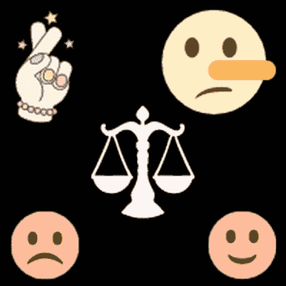
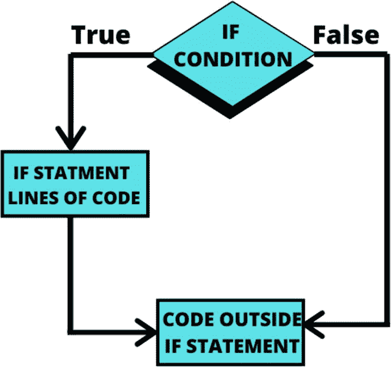
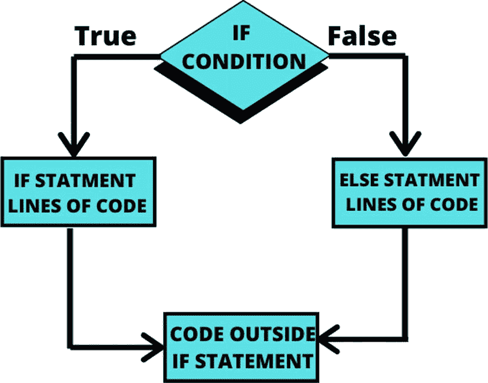
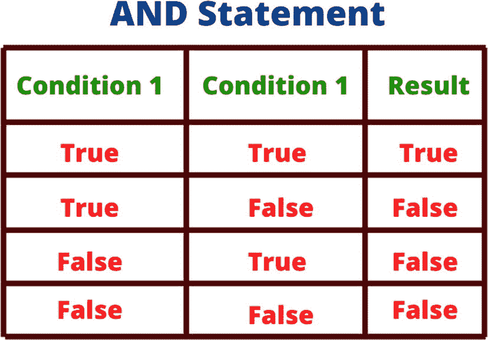

# 九、听从我的命令！

在前一章中，我们学习了所有关于字符串的知识，以及如何使用它们来创建字母和数字的字符串，如何以我们想要的任何方式操作字符串，如何从用户那里获得输入并将其转换成我们想要的数据类型，以及如何根据我们的喜好格式化输出(尤其是在打印语句中)。

在这一章中，让我们看看如何用“if 和 else”语句来命令我们的计算机。



## 真或假

在编程中，真或假决定了你的程序走向。如果“某事”是真的，就做“某事”。如果是假的，就做“别的”。你可以用前面的“条件”创建许多程序。

所以，要给你的系统下命令，你需要三样东西(图 9-1 )。


图 9-1

条件及其结果

1.  将由 Python 评估的条件

2.  真或假的结果

3.  根据结果决定下一步发生什么的语法，即根据结果指向两种结果之一的语法

先看结果真假。“真”和“假”也是 Python 中的值。它们被称为布尔值。就像我们有我们的字符串和数字一样，我们可以将布尔值赋给变量，将它们转换成另一种值类型，找到它的类型(布尔值)，等等。你想看看怎么做吗？

让我们为本章创建一个新的脚本文件。我创建了一个名为 condition.py 的文件。我将在本章中使用和重用这个文件。真和假需要用大写的 T 和 F 来写，否则你会得到一个错误，所以请记住这一点。

让我们创建变量“a”和“b”并给它们赋值“真”和“假”。

```py
a = True
b = False
print('a is {} & b is {}'.format(a,b))

```

当您运行前面的代码时，您将得到这样的结果:

```py
= RESTART: C:/Users/aarthi/AppData/Local/Programs/Python/Python38-32/condition.py
a is True & b is False

```

好了，现在我们知道如何使用布尔值了。但是它们到底是什么呢？您知道布尔实际上只是 1 和 0 吗？O:

哦，是的，你的真被你的计算机读为 1，假被你的计算机读为 0。你的电脑是一个非常简单的生物。它将你发送给它的所有复杂、怪异的代码和脚本转换成非常简单的基于 1 和 0 的值。真值和假值都转换为它们的基数-1 和 0。

我们何不验证一下这是不是真的？如果我把布尔值转换成整数，我应该得到 1 或 0。

```py
a = True
a = int(a)
b = False
b= int(b)
print('a is {} & b is {}'.format(a,b))

```

我修改了前面的代码，并插入了整数转换。让我们看看我们得到了什么:

```py
= RESTART: C:/Users/aarthi/AppData/Local/Programs/Python/Python38-32/condition.py
a is 1 & b is 0

```

看那个！True 转换为 1，False 转换为 0！

同样，您可以使用 bool()方法将数字和字符串转换为布尔值。任何不是空字符串或数字 0 的值都将返回 True。是的，即使是负数也会返回 True！我们为什么不测试一下呢？

我将在我的 Shell 中直接测试相同的内容。

1 转换为 True。

```py
>>> bool(1)
True

```

0 转换为 False。

```py
>>> bool(0)
False

```

一个包含某些内容的字符串会转换为 True。对于内部只有一个空格的字符串也是如此。

```py
>>> bool('hi there!')
True

```

空字符串转换为 False。

```py
>>> bool('')
False

```

Python 中有一个值“None”。它基本上意味着里面什么都没有。如果将“None”赋给一个变量，该变量中的值将被替换为空值。自然，“无”会转换为 False。

```py
>>> bool(None)
False

```

在后面的章节中，我们将会看到更多的叫做列表、元组和集合的值。当我们这样做时，您会注意到，包含某些内容的列表、元组和集合会转换为 True，而空列表、元组和集合会转换为 false。

## 比较并决定

好了，我们已经看过结果了。但是我们如何得到它们呢？我们需要返回这些结果的条件，不是吗？Python 有很多条件你可以用！你想看看吗？我要再次提醒你这里的数学课。

还记得大于号(>)和小于号(

是的，你可以用那些符号作为你的条件！为什么我们不在我们的壳里测试它们呢？

3 大于 5 吗？

```py
>>> 3 > 5
False

```

没有。

```py
>>> 3 < 5
True

```

但是 3 比 5 小吗？哦，是的！

快看，成功了！你甚至可以测试是否相等。两个数相等吗？只要用两个等号代替一个，就可以了！

```py
>>> 3 == 3
True

```

太好了。

您还可以使用不等于运算符来查看两个值是否不相等！=，像这样:

```py
>>> 2 != 2
False

```

2 不等于 2 吗？不，它们是相等的，所以你得到一个假的。

你也可以用字符串来做这个，不仅仅是数字。

```py
>>> 'hello' == 'Hello'
False

```

我们有一个错误。你能猜到原因吗？没错。Python 是区分大小写的，所以“H”不等于“H”。

您可以使用< =符号检查某个值是否小于或等于另一个值，从而简化计算。

```py
>>> 2 <= 2
True

```

前面的代码为真，因为即使 2 不小于 2，它也肯定等于 2，并且由于其中一个条件为真，因此结果为真。

同样，您可以使用> =符号检查某个值是否大于或等于另一个值。

```py
>>> 3 >= 5
False

```

3 既不大于也不等于 5，因此结果为假。

## 如果发生这种情况，请执行以下操作(命令！)

我们现在知道所有关于“真”、“假”和条件的事情。下一步是什么？当然是命令！

Python 中有一个漂亮的小工具可以用来发出命令。这就是所谓的“如果”陈述。你能猜出它是做什么的吗？给你个提示:跟“如果”有关。:P

到目前为止，您已经知道了如何创建条件以及如何解释它们的结果(真或假)，现在让我们将所有这些放在一起给出一个命令。

事实上这很简单。简单地说，这就是“if”语句的作用:它检查一个条件，如果该条件为真，那么它执行一条或多条语句。如果这不是真的，那么这些语句将不会被执行，你的程序将会进入下一行代码。

让我快速演示一下“if”语句是如何工作的，以便你更好地理解它(图 9-2 )。



图 9-2

“如果”语句

“if”语句的语法如下:

```py
if comparison:
      lines of code

```

“if”有一个小“I”，if 语句内的语句要写缩进，基本就是空格/制表符。比较后的冒号“:”也是必需的。如果您不缩进“内部”代码行，那么 Python 不会知道这些代码行属于“If”语句，并且只应在条件为真时执行。所以，记得缩进，好吗？

好了，现在我们知道了 if 语句是如何工作的，让我们来测试一下。如果某人的年龄小于 5 岁，我想印“你是个小孩”。就这样。

我们如何做到这一点？嗯……条件可能是`age < 5`或类似的东西。如果我想把 5 岁包括在这个列表中，那么我可以把它列为`age <= 5`。我可以在我的声明中包含一个打印声明，基本上就是说“你是一个小孩子”。应该可以了，对吧？我们来测试一下！

```py
age = input("What's your age? ")
age = int(age)
if age <= 5:
    print("You're a little kid :)")

```

我创建了一个变量 age，从用户那里获得输入，并将默认字符串转换成整数，这样就可以与数字进行比较。

运行前面的代码，您将得到这样的结果:

```py
= RESTART: C:\Users\aarthi\AppData\Local\Programs\Python\Python38-32\condition.py
What's your age? 5
You're a little kid :)

```

耶，成功了！您已经在 Python 中执行了第一个条件命令。庆祝的时间到了。


现在，我要你给出任何一个大于 5 的数字，看看你会得到什么。

你试过吗？你什么也得不到，对吗？嗯，那不理想。让我们在下一节解决这个问题吧！

## 不然呢？

我们看到，如果条件为真，我们可以执行“if”语句的内部语句。但如果不是真的，什么都不会发生。但是如果我想发生什么呢？如果孩子大于 5 岁，那么我希望打印出“你是一个大孩子”。我该怎么做？

“if”语句伴随着“else”语句。如果“if”语句为假，它们就会被执行。让我来说明这是如何工作的(图 9-3 )。



图 9-3

“if else”语句

else 语句的语法非常简单:

```py
else:
      inner lines of code

```

您应该在“else”后面加上一个冒号，因为这次我们不需要检查条件。同样，就像你的“if”语句一样，把你的内部代码行放在缩进、制表符或空格之后。

现在让我们来测试一下这是如何工作的！

```py
age = input("What's your age? ")
age = int(age)
if age <= 5:
    print("You're a little kid! :)")
else:
    print("You're a big kid! :)")

```

现在让我们假设年龄为 8 岁，看看我们的程序会做什么:

```py
= RESTART: C:\Users\aarthi\AppData\Local\Programs\Python\Python38-32\condition.py
What's your age? 8
You're a big kid! :)

```

哇哦！

## 不止一个条件！O:

你知道，有时候，事情不只是黑与白，对吗？如果有人超过 5 岁，他们不一定还是孩子。如果他们超过 12 岁，他们就是青少年了。如果他们超过 18 岁，他们就是成年人了。但是我们的项目没有考虑所有这些。嗯…不完整，你不觉得吗？让我们解决这个问题。

有一种叫做“elif”的语句可以插入到“if”和“else”语句之间。你能猜出 elif 是做什么的吗？名字里就有，不是吗？如果某个值为假，那么我们将检查第二个条件，看看*和*是否为真。在用 else 语句结束之前，可以像这样一个接一个地堆叠任意数量的 elif 语句。让我来说明这是如何工作的。

elif 语句的语法(在 if 之后，else 之前)如下(图 9-4 ):


图 9-4

“if elif else”语句

```py
elif condition:
     Inner lines of code

```

让我们现在测试一下我们的 elifs，好吗？我将创建一个主要的“if”条件来测试 if `age <= 5`(小孩)。如果这不是真的，我们将包括另一个测试是否`age <= 12`(大孩子)的条件。我们将包含第三个条件来测试`age <= 19`(青少年)，最后包含第四个条件来测试`age >= 20`(成人)。

好的，听起来不错，但是 else 语句是用来做什么的呢？else 语句将捕捉所有其他内容。例如，如果您的用户错误地输入了一个字符串或任何其他非数字值，那么您的 else 语句将“捕捉”到这一点，并要求他们重新运行程序。够清楚了吗？我们要不要用代码写这个，看看是否可行？好吧。

```py
age = input("What's your age? ")
age = int(age)
if age <= 5:
    print("You're a little kid! :)")
elif age <= 12:
    print("You're a big kid! :)")
elif age <= 19:
    print("You're a teenager! :)")
elif age >= 20:
    print("Wow, you're an adult already!")
else:
    print("Looks like you've not entered a number. Please re-run the program")

```

我将运行年龄为 13 岁的前面几行代码。

```py
= RESTART: C:\Users\aarthi\AppData\Local\Programs\Python\Python38-32\condition.py
What's your age? 13
You're a teenager! :)

```

现在，我要你每次用不同的年龄值(数字或其他)运行这个程序，看看你得到了什么。你为什么不试着也给一根绳子呢？玩得开心！

## 迷你项目-猜数字游戏

这将是一个简单的小游戏。我们不会在这里使用“ *Turtle* ”，但是你可以随意在游戏的任何部分使用它。


所以，游戏是这样工作的:当游戏开始时，程序会生成一个 1 到 10 之间的数字(包括 1 和 10)。然后，用户有三次猜对数字的机会。如果他们猜对了任何一个数字，他们就赢了。否则，他们就输了。简单吧？我们试试吧！

1.  我们先导入“随机”模块。我们需要这个模块，因为我们将在游戏开始时生成一个 1 到 10 之间的数字，用户需要猜这个数字。

1.  让我们从打印一条介绍游戏的消息开始。然后，让我们生成我们的随机数。我们将使用“随机”模块的 randrange()方法。你还记得这个方法吗？它从该范围内生成一个随机数，不包括该范围内的最后一个数。我们需要一个介于 1 和 10 之间的数字，所以范围是 1，11。

    ```py
    print('Guess a number and win!')
    number = random.randrange(1,11)

    ```

2.  然后，让我们从用户那里得到第一个猜测。输入通常是字符串，所以我们先把它们转换成整数。

    ```py
    guess1 = input('Guess a number between 1 and 10 - Your first try: ')
    guess1 = int(guess1)

    ```

3.  现在，我们将开始我们的比较。如果第一次猜测与数字相等，则打印一条成功消息。如果没有，开始一个“else”语句。在 else 语句中，重新开始。得到第二个猜测，在“else”中，开始一个内部“if”语句，检查第二个猜测是否与要猜测的数字相同。

    ```py
    if(guess1 == number):
        print('You guessed it right! :)')
    else:
        guess2 = input('Guess again - Your second try: ')
        guess2 = int(guess2)
        if(guess2 == number):
            print('You guessed it right! :)')

    ```

4.  我们将在第三次尝试中做同样的事情。

    ```py
    else:
        guess3 = input('Guess again - Your final try: ')
        guess3 = int(guess3)
        if(guess3 == number):
           print('You guessed it right! :)')

    ```

5.  最后，最后一个“else”语句。如果他们在三次尝试后仍然没有猜中，那么程序将运行最后的“else”语句并打印一条悲伤的消息。☹，为什么我们不告诉他们号码是多少？他们可能想知道，对吗？

6.  而且，就是这样！一个简单的小程序。

    ```py
    else:
        print('Sorry! You used up all your tries! :(')
        print('The number was {}'.format(number))

    ```

```py
import random

```

不如我们来看看这个游戏行不行？让我们运行上面的代码，我们将得到这个:

```py
= RESTART: C:\Users\aarthi\AppData\Local\Programs\Python\Python38-32\condition.py
Guess a number and win!
Guess a number between 1 and 10 - Your first try: 5
Guess again - Your second try: 7
You guessed it right! :)

```

第二次试就猜到了！哇哦！

让我们再试一次:

```py
= RESTART: C:\Users\aarthi\AppData\Local\Programs\Python\Python38-32\condition.py
Guess a number and win!
Guess a number between 1 and 10 - Your first try: 10
Guess again - Your second try: 6
Guess again - Your final try: 3
Sorry! You used up all your tries! :(
The number was 2

```

哎呀，这次我错过了。数字是 2。☹

## 情况越积越多！

有时，您可能希望同时检查多个条件。或者你可能希望你的情况与它的实际情况相反。

Python 为您提供了两个选项来实现这一点。这些被称为*逻辑操作符*，你可以用它们来组合条件语句(比较)并得出最终的真或假结果。迷茫？不要这样。我会解释的。

第一个是 ***和*** 运算符。如果在两个或更多比较上使用“与”运算符，那么条件将返回 true *只有*如果 ***所有*** 比较都为 true。

语法如下:

```py
(comparison1) and (comparison2)

```

您也可以编写不带括号的比较，执行仍然会正常进行(比较优先于逻辑操作符)，但是包含它们以使执行顺序更清晰总是一个好的做法。

让我解释一下“and”操作符是如何工作的。英语中“and”是什么意思？包容一切，围绕“和”，对吗？所以，当你在两个或更多的条件周围使用这个语句时，只有当它周围的所有条件都为真时，最后的结果才为真。如果其中一个条件为假，那么即使另一个条件为真，你也会得到一个假的结果。我为什么不用一个例子来解释这个呢？(图 9-5 )



图 9-5

“与”语句及其结果

你现在明白“和”是怎么运作的了吧？

接下来，您有了 ***或*** 运算符。这是怎么回事？很简单，真的。在英语中，“或”是“非此即彼”的意思，我说的对吗？因此，如果“或”运算符周围的任一条件为真，则整个语句为真。

如果在两个或更多比较上使用“或”运算符，那么如果这些比较中的任何一个**为真，则条件将返回真。**

 **语法如下:

```py
(comparison1) or (comparison2)

```

让我来说明“或”语句是如何工作的(图 9-6 )。


图 9-6

“或”语句及其结果

最后，还有 ***而不是*** 运算符。这里没什么好猜的。很简单，不是吗？“not”运算符只是颠倒了结果。如果比较的结果为真，那么在比较语句中使用“not”运算符将返回假，反之亦然。

语法如下:

```py
not(comparison)

```

您也可以在其他逻辑语句中使用“not”运算符:

```py
not((comparison1) and (comparison2))

```

在编程中，你需要确保你总是关闭括号。在前面的语法中，我们用两组括号将每个比较括起来，中间是“and”运算符，另一组括号将所有比较括起来。

让我们通过在 Python Shell 中测试这些语句来结束本章:

```py
>>> (5 > 3) and (4 < 3)
False

```

5 大于 3，但 4 不小于 3。如果我们使用“或”操作符，

```py
>>> (5 > 3) or (4 < 3)
True

```

我们得到一个真值，因为其中一个比较为真。

现在就来结合逻辑语句吧！我们为什么不用数学运算来做比较，让事情变得复杂一点呢？

```py
>>> ((5 > 3) or (4 < 3)) and ((3 + 2) == 5)
True

```

花一分钟仔细阅读前面的陈述。先看看括号的位置。我用括号将每个操作(大于、小于和加法)括起来，一个括号包含“或”语句，另一个括号包含等于操作。如果我漏掉了其中的一个括号，我要么会得到一个错误，要么运算的顺序会被打乱，我的答案会是错误的。

现在让我们测试“not”运算符。

```py
>>> not(5 > 3)
False

```

5 > 3 是真的，但是因为我在比较中使用了“not”操作符，所以得到了一个假的。

```py
>>> not((5 > 3) or (4 < 3))
False

```

“或”运算的结果为真，因为其中一个语句为真，但由于我对所有语句都使用了“非”，所以最终结果为假。

```py
>>> (5 > 3) and (not(4 < 3))
True

```

原来，前面的操作返回 false 是因为 4 < 3 is not true. But I used “not” on 4 < 3, which made the final result of the comparison True. So *为真，而 True* 为真。

我要在这里停止测试，但我要你全力以赴！为什么不把所有你知道的数学运算符与比较运算符和逻辑运算符结合起来呢？尝试不同的组合，看看你会得到什么。编程就是要实验。实验去吧！

## 摘要

在这一章中，我们学习了如何命令我们的电脑做我们想做的事情。我们学习了布尔值和条件以及它们的结果。然后，我们继续学习“if”、“else”和“elif”语句，以及如何使用它们来命令我们的计算机。最后，我们看了“and”、“or”和“not”以及它们的用法。像往常一样，我们也做了一些小项目。

在下一章，让我们看看用循环来自动化我们的程序。你会发现在用海龟创建图形时，这是一种受欢迎的解脱。**