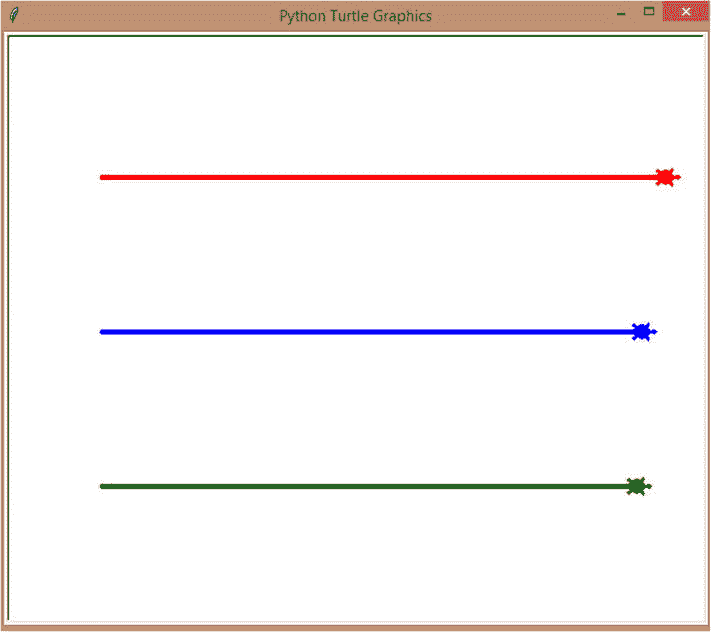

# 十四、让我们创造真实世界的对象

在前一章中，我们研究了真正的自动化功能。我们研究了如何使用函数节省时间、空间和代码行，定义函数，调用函数，向函数发送参数，使用默认参数，将值返回到调用语句，以及接受任意参数和列表作为参数。b

在这一章中，让我们看看如何用面向对象编程(OOPs)进行真实世界的编程。我们将会看到类、初始化函数、self、用户定义的属性和方法，以及在我们的类上创建对象。我们还将了解如何访问我们的属性和函数，以及如何更改属性值。

## 什么是面向对象编程？


Python 中的一切都是对象。它有自己的属性和方法记得吗？现实世界就是这样。就拿我们人类来说吧。我们有属性，比如我们的身高、体重、眼睛颜色、头发颜色等等。同样，我们也有“方法”，比如我们跑步、走路、说话、做事，对吗？

Python 中的一切都反映了我们现实世界中的对象。例如，字符串有长度这样的属性，但是有拆分、大写等方法。人类是一个“群体”，在这个“群体”之下存在着个体的人类，他们有自己的价值观(不同的发色、体重、身高等。).类似地，“字符串”也是一个组，在这个组下，您可以使用自己的属性和方法创建自己的单独字符串。

这就是面向对象编程的核心:真实世界的编程。您可以为项目创建自己的对象，而不是使用预定义的对象及其方法和属性。你看到这里的可能性了吗？现在世界是你的了！

但这是一个庞大的主题，不可能在一章中涵盖所有内容。我也不想让你太困惑。你是来学习 Python 和创建好玩的项目的，我们不用 OOPs(面向对象编程)也能创建本书中的项目。但是我会给你一个 OOPs 的介绍，让你了解它的基本知识。听起来不错？好吧，那我们开始吧！

## 来证明一下吧！

我刚才说了 Python 里一切都是对象，不是吗？为什么我们不证明一下呢？

让我们从一个整数(一个数)开始，检查它的类型。

```py
num = 10
print(type(num))

```

运行前面的代码，您将得到这样的结果:

```py
= RESTART: C:\Users\aarthi\AppData\Local\Programs\Python\Python38-32\oops.py
<class 'int'>

```

有意思。在下一节中，您将看到类是您在 Python 中创建对象的方式，所以本质上，整数是一个类，保存整数的变量是对象。好吧，但是剩下的数据类型呢？

```py
s = 'Hello'
print(type(s))
b = True
print(type(b))
f = 1.0
print(type(f))
def fName():
    pass
print(type(fName))

```

运行整个程序，你会得到这个:

```py
= RESTART: C:\Users\aarthi\AppData\Local\Programs\Python\Python38-32\oops.py
<class 'int'>
<class 'str'>
<class 'bool'>
<class 'float'>
<class 'function'>

```

哇哦！都是课！所以在 Python 中一切确实都是对象。

## 班级

还记得我之前提到的那些团体吗？如果您想要创建自己的对象，则需要创建一个组，您可以在该组下创建这些对象。“人类”是一个群体，每个人都是一个独立的对象。每个人都有一套我们共有的属性和方法，对吗？

类似地，每组对象都有一组通用的属性和方法，所以让我们为该组创建一个蓝图，并使用自己的一组值分别创建每个对象。

迷茫？不要这样。一会儿就清楚了。

你需要 ***类*** 来创建这些蓝图。

为了对真实世界建模，让我们创建一个“Human”类，它具有反映我们人类的属性和方法。

```py
class Human:
    sample = 'Sample property value'

```

就这样！你有你的第一堂课。这不是强制性的，但是在命名你的类的时候，第一个字母要大写，这样当你创建你的对象的时候，你可以更好的区分它们。

好吧。我们有一节课，但是下一节是什么？我们的对象在哪里？你需要创造它们。为什么我们不创建一个“人类 1”对象呢？

```py
human1 = Human()

```

就这么简单。现在，您可以访问类内部的属性值，如下所示:

```py
print(human1.sample)

```

运行前面的代码，您将得到这样的结果:

```py
= RESTART: C:/Users/aarthi/AppData/Local/Programs/Python/Python38-32/oops.py
Sample property value

```

有效！

## 有自己价值的对象

到目前为止，我们还没有创建基于我们在其上创建的对象来改变其属性值的动态类。

为此，您需要使用一个名为 __init__()函数的“class”预定义方法。也就是 init 前两个下划线，init 后两个下划线，后跟()。

使用这种方法，您可以在创建对象时发送对象的单个值，以便将它们分配给类的属性。让我们看看如何:

```py
class Human:
    def __init__(self,name,age,hair,eye,pet):
        self.name = name
        self.age = age
        self.hair = hair
        self.eye = eye

```

因此，定义 init 函数并接受创建对象时所需的属性。我们的属性将是姓名、年龄、头发(头发颜色)、眼睛(眼睛颜色)和宠物(他们宠物的名字)。

但这还不是全部。一开始就有这个特殊的属性，“自我”。那是什么？你想猜猜吗？什么是自我？你自己？那么它应该是被创造的对象，不是吗？绝对的！

“自我”是被创建的对象，我们正在为该对象创建属性，并为其分配可接受的值。只要遵循变量命名约定，您可以随意命名它。程序员使用“自我”，所以他们知道它是什么。

好了，现在我们已经创建了一个“适当的”类，让我们创建我们的对象。

```py
human1 = Human('Susan',8,'brunette','blue','Barky')

```

我们的第一个对象是“human1 ”,它将是“human”类的一个对象，我们已经为它发送了一些属性。确保按照 init()函数期望的顺序发送属性，否则可能会出现错误。

你可以像那样创建任意数量的对象。让我们创建另一个。

```py
human2 = Human('Johny',10,'blond','green','Boxer')

```

到目前为止，这看起来类似于一个常规的函数调用。那为什么要用类呢？

首先，你不需要返回任何东西来访问这些属性。

```py
print(human1.name)
print(human2.eye)

```

您的对象的名称，后跟一个句点和属性，您就可以开始了。

让我们运行它，我们将得到以下结果:

```py
= RESTART: C:/Users/aarthi/AppData/Local/Programs/Python/Python38-32/oops.py
Susan
green

```

没错。我们得到了我们想要的。

## 操纵你的对象

与函数不同，我们也可以改变对象的属性值。

```py
human2.eye = 'brown'
print('Eye color: {}'.format(human2.eye))

```

运行所有程序，你会得到这个:

```py
= RESTART: C:/Users/aarthi/AppData/Local/Programs/Python/Python38-32/oops.py
Susan
green
Eye color: brown

```

看那个。值已更改。

所以，对象是字典和函数的混合体。它们是两个世界中最好的，甚至更多！

就像在字典中一样，您可以使用“del”关键字删除对象的属性，或者只删除整个对象，如下所示:

```py
del human2.eye
del human1

```

但是不像你的数据结构(列表、字典等等。)，不能循环遍历一个对象。☹

## 对象做事情

当我开始这一章的时候，记得我说过什么吗？对象有属性(就像我们一样)，它们做事情或者事情对它们做(就像我们一样)。那么，我们为什么不添加一堆让我们的对象做事情的“方法”呢？

您将创建常规的旧函数，但这次只在类内部创建。

让我们的对象说话，行走，奔跑，好吗？或者只是模拟一样。

```py
class Human:
    def __init__(self,name,age,hair,eye,pet):
        self.name = name
        self.age = age
        self.hair = hair
        self.eye = eye

    def talk(self):
        print('{} talking'.format(self.name))

    def green(self):
        print('Hello there!')

    def walk(self):
        print("{} is walking".format(self.name))

human1 = Human('Susan',8,'brunette','blue','Barky')
human2 = Human('Johny',10,'blond','green','Boxer')

```

你注意到我们如何使用自我了吗？从类中访问对象的名字。“自我”是调用函数的对象。每个函数都需要接受“self”来指示调用它的对象，不管是否在函数中使用它的属性值，否则在运行程序时会出错。

让我们现在调用我们的函数，看看我们得到了什么:

```py
human1.talk()
human1.greet()
human2.walk()

```

运行前面的代码，您将得到这样的结果:

```py
= RESTART: C:/Users/aarthi/AppData/Local/Programs/Python/Python38-32/oops.py
Susan talking
Hello there!
Johny is walking

```

哇，太好了！

## **`turtle`** 与对象赛跑

既然我们知道了类是如何工作的，以及如何用它们来创建对象，为什么我们不试着用它们来复制我们的海龟赛跑呢？我相信我们现在可以让代码更简单。

我们将创建一个 *turtle* 类来创建我们的 Turtle，用一个用户定义的 move()方法随机移动 Turtle(在 1-10 的范围内)。

1.  让我们从导入海龟和随机模块以及设置海龟屏幕开始。让我们也把主海龟藏起来。

1.  让我们创建一个`turtle`类。初始化函数将接受颜色、x 和 y 来改变海龟的颜色，并将海龟移动到起始位置。

```py
import turtle, random
s = turtle.getscreen()
turtle.hideturtle()

```

1.  那么，我们来定义一下 self.turtle，为什么是 self.turtle 而不是 self？嗯，“self”指的是我们正在创建的对象，所以如果我们想要在该对象上创建一个 turtle，我们需要创建一个包装对象，在我的例子中就是 self.turtle。您可以随意命名它。

```py
class Turtle:
    def __init__(self,color,x,y):

```

这样，原始对象不会被重新分配，我们仍然可以创建一只乌龟。

1.  接下来，让我们更改笔的大小、颜色和形状。

```py
self.turtle = turtle.Turtle()

```

1.  最后，让我们把乌龟移动到给定的位置。

```py
self.turtle.pensize(5)
self.turtle.color(color)
self.turtle.shape('turtle')

```

1.  现在我们已经完成了 init()函数，让我们创建一个 move()函数。它只是随机地让乌龟向前移动，就像我们在原程序中做的那样。

```py
self.turtle.penup()
self.turtle.goto(x,y)
self.turtle.pendown()

```

```py
    def move(self):
        self.turtle.forward(random.randint(1,10))

```

我们班到此为止！

1.  现在，让我们创建我们的对象。我将创建三个对象，红色、蓝色和绿色，以及它们的相关值。

1.  现在，在 0–99(100 次迭代)的范围内，让我们为每一次迭代调用三只乌龟的 move()函数。

```py
red = Turtle('Red',-250,150)
blue = Turtle('Blue',-250,0)
green = Turtle('Green',-250,-150)

```

```py
for i in range(100):
    red.move()
    blue.move()
    green.move()

```

就这样！我们的程序工作吗(图 14-1 )？



图 14-1

有阶级的乌龟赛跑

当然了，红队赢了！

## 摘要

在这一章中，我们看了如何用面向对象编程(OOPs)进行真实世界的编程。我们看了类、初始化函数、self、用户定义的属性和方法，以及在我们的类上创建对象。我们还研究了如何访问我们的属性和函数，以及如何更改属性值。

在下一章中，让我们看看文件，如何创建、打开和修改它们。