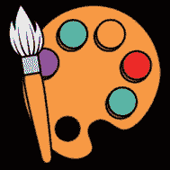
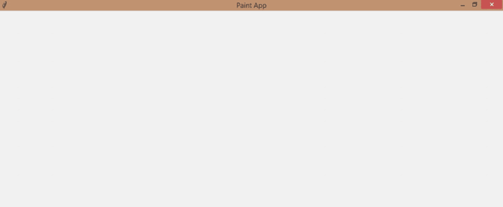
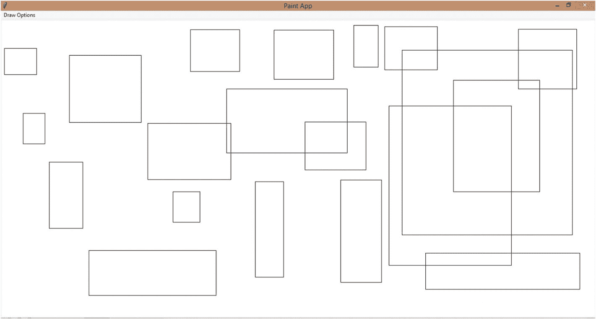
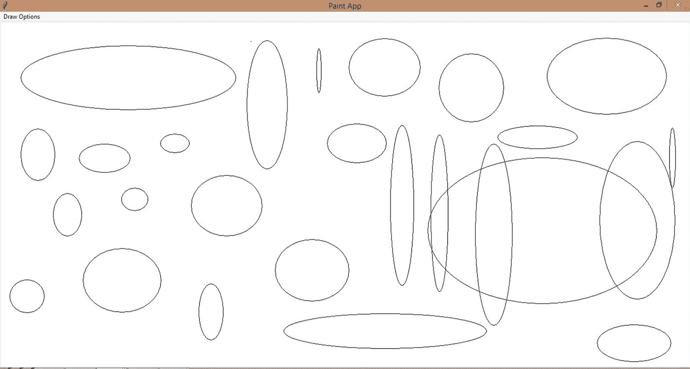
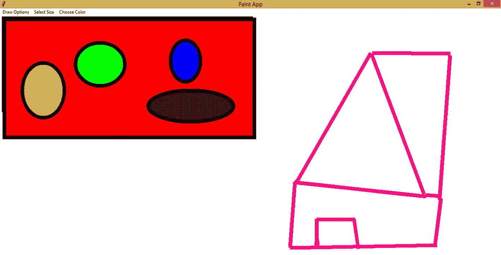
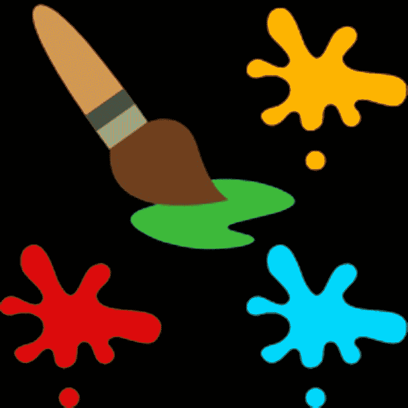

# 十八、项目：使用 Tkinter 绘制应用

在前一章中，我们学习了如何用 *Tkinter* 创建井字棋应用。我们还学习了所有关于事件的知识，以及如何使用它们让我们的应用响应外部事件(鼠标点击、键盘按键等)。).

在这一章中，我们将学习所有关于使用“画布”在你的 *Tkinter* 屏幕上“绘画”的知识，并使用它来制作一个绘画应用。你可以用笔画画，画圆形/椭圆形、直线和正方形/长方形。您还可以更改笔的大小以及形状的轮廓颜色和填充颜色。这是一个简单，但完整的应用！

## 绘画应用–解释



我们的绘画应用将会非常棒！你将能够徒手画直线、正方形、长方形、椭圆形和圆形。你也可以从数百种不同的颜色中选择。酷吧？

一旦我们完成了，它看起来就像图 18-1 一样。


图 18-1

最终应用

我不是艺术家，所以请原谅我的基本图纸，但你可以看到这个应用是多么强大，对不对？最棒的是，这只是一个起点。您可以扩展此应用，添加更多功能，并将其变成您想要的任何东西。

分享给你的朋友，有绘画比赛，或只是玩得开心！

## 开始

先从导入 *Tkinter* 开始。像往常一样，让我们导入所有内容，但是这样做只会导入“外部”类。它不会导入内部的，比如颜色选择器。我们需要颜色选择器来为我们的应用创建调色板。那么，让我们也导入它。

```py
from tkinter import *
from tkinter import colorchooser

```

现在，让我们创建并初始化我们的变量。要在屏幕上绘图，您需要坐标，即鼠标指针在屏幕上点击位置的 x 和 y 点。让我们创建 x 和 y 变量，并在开始时将它们分别赋值为 0。

我现在用了一种新的分配方式。让事情变得简单，不是吗？

```py
x, y = 0,0

```

接下来，让我们创建一个变量“color ”,并从一开始就把它设置为 None(没有值)。你也可以让它成为一个空字符串。这个变量将在将来保存我们的形状的填充颜色。我们还需要一种颜色作为我们的“笔”或形状的轮廓，所以让我们创建一个可变的“轮廓”,默认为黑色。我们还需要一支笔的大小。默认情况下会是 1。

```py
color = None
outline = 'black'
sizeVal = 1

```

## 设置屏幕

现在，让我们设置我们的屏幕。我们将默认设置屏幕的状态为“缩放”,因此它会扩展到全屏。此外，我们将配置我们的行和列，使第一个单元格(行 0 和列 0)扩展到屏幕的整个宽度和高度。我们可以将画布放在这个单元格中，这样它也可以扩展到全屏。

```py
w = Tk()
w.title('Paint Application')
w.state('zoomed')
w.rowconfigure(0,weight=1)
w.columnconfigure(0,weight=1)

```

我们将权重设为 1，让程序知道这个特定的行和列应该扩展到它的最大容量。

让我们运行我们的程序，我们得到这个(图 18-2 )。



图 18-2

我们的 Tkinter 屏幕

太好了。

## 创建画布

现在，让我们创建画布。我们需要使用 Canvas 方法来做到这一点，并将其放置在窗口“w”中。让我们也使我们的画布的背景默认为“白色”。

```py
#create a canvas
canvas = Canvas(w, background="white")

```

接下来，我将把画布放在第一行和第一列(0)，并使它在所有方向(北、南、东、西)都具有粘性，这样它就可以向所有方向扩展并占据整个空间(这是我们目前的整个屏幕)。

```py
canvas.grid(row=0,column=0,sticky="NSEW")

```

让我们现在运行程序，我们得到这个(图 18-3 )。


图 18-3

帆布

完美！我们现在有了我们的白色画布。

## 创建您的第一个菜单(形状)

如果你看了完整的应用，你会注意到我们有多个菜单可供选择。第一个是形状菜单。你可以选择用钢笔还是画线、正方形或圆形。让我们现在创建菜单。

你已经知道如何创建菜单。让我们创建一个包含所有菜单的主菜单。我们的“绘图选项”菜单将成为我们“主”菜单的第一个子菜单。让我们添加一个级联，并标记它。

```py
main = Menu(w)
menu1 = Menu(main)
main.add_cascade(label='Draw Options',menu = menu1)

```

最后，让我们添加四个命令，“钢笔”，“直线”，“正方形”和“圆形”。但是我们需要将选择值发送给“select”函数，该函数将依次调用相关的函数来进行相应的绘制。让我们用λ来实现。我们要给我们的选项编号，钢笔是 1，线条是 2，正方形是 3，圆形是 4。

```py
menu1.add_command(label='Pen', command=lambda: select(1))
menu1.add_command(label='Line', command=lambda: select(2))
menu1.add_command(label='Square', command=lambda: select(3))
menu1.add_command(label='Circle', command=lambda: select(4))

```

最后，让我们配置窗口的“主”菜单。将来，这一行应该出现在我们创建了所有四个菜单之后。

```py
w.config(menu=main)

```

如果你现在运行你的程序，并尝试点击菜单项，你会得到一个错误，因为你的“选择”功能还没有定义，但你仍然会看到你的菜单，就像这样(图 18-4 )。


图 18-4

第一个菜单(绘图选项)

哇哦！第一步成功了！

## 让我们的抽奖选项发挥作用吧！

现在我们有了绘图选项菜单，让我们让它工作。让我们首先创建“选择”函数，它将画布与相关的鼠标点击绑定在一起。在菜单上创建这个函数(函数调用)。我们需要两种绑定。

对于手绘，我们需要一个 <b1-motion>bind，每当鼠标左键在屏幕上点击和拖动时，它就会画一条线。所以，我们基本上会在每 2 分钟的点之间得到一些细线，所以基本上几百条连接在一起的细线就组成了我们的手绘。</b1-motion>

然后，我们需要一个 <buttonrelease-1>bind，当鼠标左键在屏幕上点击和拖动后释放时，它可以绘制直线、正方形或圆形。因此，结果将是从点击点到释放点的直线、正方形或圆形。</buttonrelease-1>

让我们现在做那件事。让我们以“选项”的形式接收我们的号码。如果 options 为 1，则取消绑定<buttonrelease-1>，因此，如果我们之前选择了其他选项，现在它将被取消选择，并且在我们释放笔之后，我们将不会获得形状或线条。然后，我们绑定<b1-motion>，调用 draw_line 函数。</b1-motion></buttonrelease-1>

```py
def select(options):
    if options == 1:
        #selected Pen, create bind
        canvas.unbind("<ButtonRelease-1>")
        canvas.bind('<B1-Motion>',draw_line)

```


类似地，对于 2，解除绑定<b1-motion>使笔不再活动，绑定<buttonrelease-1>并调用 draw_line 函数。</buttonrelease-1></b1-motion>

```py
if options == 2:
    #selected line, create bind
    canvas.unbind("<B1-Motion>") #so pen is no longer active
    canvas.bind('<ButtonRelease-1>',draw_line)

```


对于 3，调用 draw_square 函数。

```py
elif options == 3:
    #selected square, create bind
    canvas.unbind("<B1-Motion>")
    canvas.bind('<ButtonRelease-1>',draw_square)

```

对于 4，调用 draw_circle 函数。

```py
elif options == 4:
    #selected circle, create bind
    canvas.unbind("<B1-Motion>")
    canvas.bind('<ButtonRelease-1>',draw_circle)

```

## 获取鼠标位置

在创建 draw_line 函数之前，我们需要获取鼠标位置。如您所知，我们可以使用我们的“事件”来实现这一点。因此，让我们在我们的函数之外创建另一个绑定(在菜单的正上方和函数定义的正下方),将任何鼠标左键点击绑定到画布。

所以，每次你的用户点击画布时，我们都要记录下背景中画布的 x 和 y 位置。

我们不会绘制任何东西，直到用户选择了一个绘制选项，但是我们仍然要做好准备，好吗？

```py
canvas.bind('<Button-1>',position)

```

现在，定义绑定上面的函数。接收函数定义中的“事件”。让我们也加载全局 x 和 y 值，并将 event.x 和 event.y 值(鼠标单击的 x 和 y 坐标位置)赋给 x 和 y 全局变量。

在画布上单击鼠标左键，获取鼠标的当前位置。

```py
def position(event):
    global x,y
    x,y = event.x,event.y

```

就这样！你可以打印出 x 和 y，看看这个函数的运行。让这成为我们的小活动，好吗？

## 让我们画出我们的线

现在，让我们创建一个函数，它将为我们的手绘绘制迷你线和直线。我们需要什么？

canvas 中有一个 create_line 函数，可以用来，是的，你猜对了，画直线！你只需要给出起点和终点的坐标点。您还可以指定“填充”，这实际上是线条的颜色。

我们将使用“轮廓”颜色，因为我们希望线条颜色和形状轮廓颜色一致。您也可以指定线条的宽度。让我们给 sizeVal 作为这个属性的值。

但是你需要小心你提到的坐标值。先提起点的 x，y 坐标，再提终点的 x，y 坐标。更重要的是，要在一个元组中提到所有四个值，否则会出现错误。

```py
def draw_line(event):

```

让我们加载我们的 x 和 y 值，这是鼠标第一次点击的点，我们使用 position()函数不断计算。让我们也加载 sizeVal，它目前为 1。一旦我们写了让用户手动改变线条宽度的代码行，它就会自动更新。

```py
global x,y,sizeVal

```

现在，开始的 x 和 y 位置是包含鼠标单击点的 x 和 y 位置(position()函数)。结束 x 和 y 位置是事件的 x 和 y 位置。

在手绘的情况下，每次拖动鼠标(同时仍然按下鼠标左键)，我们都会为每一分钟的变化获得一个新的事件，以及新的 x 和 y 位置。

对于绘制直线，终点是释放鼠标按钮的时间。

```py
canvas.create_line((x,y,event.x,event.y),fill=outline, width = sizeVal)

```

最后，让我们用事件的 x 和 y 值来更新 x 和 y 值。手绘的时候特别需要这个，这样就可以重新开始了。

```py
x,y = event.x,event.y

```

让我们现在运行我们的程序。

当我们试图像这样在屏幕上画画时，什么也没有发生。为什么呢？我们还没有启动任何选项。但是，如果我选择钢笔或线条(从菜单中)，我可以在画布上绘图(图 18-5 )。


图 18-5

徒手和直线

## 正方形和长方形！

现在让我们画正方形和长方形。过程类似。在 canvas 中有一个 create_rectangle 方法。再次给出元组内的开始和结束坐标。在这种情况下，你可以提到两种颜色，轮廓和填充颜色，最后是形状的宽度。

然后，让我们将当前事件的 x 和 y 值(鼠标释放)赋给第一个 x 和 y 值(鼠标左键单击)。

```py
def draw_square(event):
    global x,y,sizeVal
    canvas.create_rectangle((x,y,event.x,event.y), outline=outline, fill=color, width = sizeVal)
    x,y = event.x,event.y

```

就这样！让我们现在运行我们的程序。选择“正方形”，按住鼠标按钮，将其拖到您想要的点，然后释放按钮。你会得到一个正方形或长方形。试试看！

我就是这么做的(图 18-6 )。:P



图 18-6

正方形和长方形

漂亮的正方形和长方形！

## 圆形和椭圆形！

最后，让我们画圆和椭圆。还有一种方法叫做 create_oval。完美的椭圆形是圆形，对吗？你也需要给出这个方法的起点和终点。

您的起点是您按下鼠标按钮的时候，终点是您最后释放鼠标按钮的点的 x 和 y 值(鼠标释放事件)。

```py
def draw_circle(event):
    global x,y,sizeVal
    canvas.create_oval((x,y,event.x,event.y), outline=outline, fill=color, width= sizeVal)
    x,y = event.x,event.y

```

让我们运行程序，我们得到这个(图 18-7 )。



图 18-7

环

很好！我们已经完成了所有的绘图功能。我们快到了！

## 选择尺寸！

现在，让我们进入我们节目的第二个菜单。到目前为止，我们的线条和轮廓的宽度都太窄了。如果我们希望它们更厚呢？为此我们也需要选择。让我们创造它们吧！我将创建从 1、5、10 到 30 的尺码。1 是我们设置的默认值。

让我们为尺寸创建一个新的子菜单 menu2。将它放在 menu1 代码之后，但在菜单配置代码行之前。每个选项都将是一个大小，我将为每个选项的点击调用 changeSize 函数。我们将把大小作为参数发送给这个函数。

```py
menu2 = Menu(main)
main.add_cascade(label='Select Size', menu = menu2)
menu2.add_command(label='1', command=lambda: changeSize(1))
menu2.add_command(label='5', command=lambda: changeSize(5))
menu2.add_command(label='10', command=lambda: changeSize(10))
menu2.add_command(label='15', command=lambda: changeSize(15))
menu2.add_command(label='20', command=lambda: changeSize(20))
menu2.add_command(label='25', command=lambda: changeSize(25))
menu2.add_command(label='30', command=lambda: changeSize(30))

```

现在，定义函数来改变大小。您可以将该函数放在 select()函数之后，或者您想要的任何地方，只要它在 menu2 的代码行(函数调用)之上。

这是一个非常简单的过程。让我们接收我们的大小，加载全局 sizeVal，并将我们的大小赋给 sizeVal。就这样！因为 sizeVal 是全局的，并且被加载到我们所有的绘图函数中，所以一旦我们改变了大小，下一次我们绘图时，新的大小将反映在该绘图中。

```py
def changeSize(size):
    global sizeVal
    sizeVal = size

```

让我们检查一下这个是否有效！我准备把大小改成 15 后画一堆线(图 18-8 )。


图 18-8

更改轮廓的宽度

这些线条很粗。:D

## 很多很多颜色！

现在，让我们创建第三个菜单，让我们改变轮廓和填充颜色的图纸。

让我们创建一个 menu3，它只包含两个选项，一个用于更改线条颜色，另一个用于更改填充颜色，每个选项调用各自的函数。

```py
menu3 = Menu(main)
main.add_cascade(label = 'Choose Color', menu = menu3)
menu3.add_command(label='Line Color', command = set_line_color)
menu3.add_command(label='Fill Color', command = set_fill_color)

```

现在，让我们定义这些函数。我们将使用我们的颜色选择器来创建我们的调色板。colorchooser 中有一个 askcolor 方法，可以在我们需要时打开调色板(在这种情况下，当单击“线条颜色”选项时)。这将在新窗口中打开。让我们为这个窗口设置一个标题:选择颜色。

```py
def set_line_color():
    global outline
    getColor = colorchooser.askcolor(title="Choose color")

```

现在，你不能就这样使用 getColor。当我们选择一种颜色时，比如说红色，这是它在 getColor 中注册的格式:

```py
((255.99609375, 0.0, 0.0), '#ff0000')

```

元组中的第一个值包含另一个保存 rgb 颜色值的元组(我们颜色的红、绿、蓝阴影)。元组中的第二个值包含我们刚刚选择的颜色的十六进制值。它们是一样的，你可以把它写成“红色”。这些只是你提及颜色的不同形式。你真的不需要了解它们或者记住它们。只要知道每个阴影有十六进制和 rgb 值，你可以使用，你的计算机可以识别。

现在，我们不能使用整个元组。我们只需要它的一个值。让我们检索第二个值并使用它，好吗？

```py
outline = getColor[1]

```

现在，每次我们改变“线条颜色”,“轮廓”的值也会改变，这将反映在我们的下一个绘图中。

现在，让我们做同样的填充颜色。

```py
def set_fill_color():
    global color
    getColor = colorchooser.askcolor(title="Choose color")
    color = getColor[1]

```

这就是我们的颜色！让我们检查它是否工作，好吗？让我们点击“线条颜色”，看看调色板是否打开(图 18-9 )。


图 18-9

颜色！

有效！

现在，让我们选择我们的颜色(图 18-10 )。



图 18-10

最终应用，完成！

我们所有的颜色都非常完美！

## 我已经画完了！

好了，我们有了一个小小的绘画应用。我们已经心满意足了！但是如果我们想重新开始呢？我们需要一个选项来清空画布。让我们来创造吧！

首先，菜单。

```py
menu4 = Menu(main)
main.add_cascade(label = 'Clear', menu = menu4)
menu4.add_command(label = 'Clear', command = clear_screen)

```

现在，clear_screen()函数。我们只需要一行代码:canvas.delete('all ')。这将删除画布上的所有内容。

```py
def clear_screen():
    canvas.delete('all')

```

这就是选项出现的方式(图 18-11 )。


图 18-11

清楚的

画一些东西，选择清除选项，看到一切都消失了！不过在你做之前先截图吧！

我们已经完成了我们的绘画应用！:O 最后，如果您还没有编写它，请编写主循环代码行，我们就完成了。

```py
w.mainloop()

```

## 整个程序

现在，整个程序按照它应该被创建的顺序:

```py
from tkinter import *
from tkinter import colorchooser

x, y = 0,0
color = None
outline = 'black'
sizeVal = 1

w = Tk()
w.title('Paint App')
w.state('zoomed')
w.rowconfigure(0,weight=1)
w.columnconfigure(0,weight=1)

#create a canvas
canvas = Canvas(w, background="white")
canvas.grid(row=0,column=0,sticky="NSEW")

def draw_line(event):
    global x,y,sizeVal
    canvas.create_line((x,y,event.x,event.y),fill=outline, width = sizeVal)
    x,y = event.x,event.y

def draw_square(event):
    global x,y,sizeVal
    canvas.create_rectangle((x,y,event.x,event.y), outline=outline, fill=color, width = sizeVal)
    x,y = event.x,event.y

def draw_circle(event):
    global x,y,sizeVal
    canvas.create_oval((x,y,event.x,event.y), outline=outline, fill=color, width= sizeVal)
    x,y = event.x,event.y

def select(options):
    if options == 1:
        #selected Pen, create bind
        canvas.unbind("<ButtonRelease-1>")
        canvas.bind('<B1-Motion>',draw_line)
    if options == 2:
        #selected line, create bind
        canvas.unbind("<B1-Motion>") #so pen is no longer active
        canvas.bind('<ButtonRelease-1>',draw_line)
    elif options == 3:
        #selected square, create bind
        canvas.unbind("<B1-Motion>")
        canvas.bind('<ButtonRelease-1>',draw_square)
    elif options == 4:
        #selected circle, create bind
        canvas.unbind("<B1-Motion>")
        canvas.bind('<ButtonRelease-1>',draw_circle)

def position(event):
    global x,y
    x,y = event.x,event.y

def changeSize(size):
    global sizeVal
    sizeVal = size

def set_line_color():
    global outline
    getColor = colorchooser.askcolor(title="Choose color")
    outline = getColor[1]

def set_fill_color():
    global color
    getColor = colorchooser.askcolor(title="Choose color")
    color = getColor[1]

def clear_screen():
    canvas.delete('all')

canvas.bind('<Button-1>',position)

#options
main = Menu(w)
menu1 = Menu(main)
main.add_cascade(label='Draw Options',menu = menu1)
menu1.add_command(label='Pen', command=lambda: select(1))
menu1.add_command(label='Line', command=lambda: select(2))
menu1.add_command(label='Square', command=lambda: select(3))
menu1.add_command(label='Circle', command=lambda: select(4))

menu2 = Menu(main)
main.add_cascade(label='Select Size', menu = menu2)
menu2.add_command(label='1', command=lambda: changeSize(1))
menu2.add_command(label='5', command=lambda: changeSize(5))
menu2.add_command(label='10', command=lambda: changeSize(10))
menu2.add_command(label='15', command=lambda: changeSize(15))
menu2.add_command(label='20', command=lambda: changeSize(20))
menu2.add_command(label='25', command=lambda: changeSize(25))
menu2.add_command(label='30', command=lambda: changeSize(30))

menu3 = Menu(main)
main.add_cascade(label = 'Choose Color', menu = menu3)
menu3.add_command(label='Line Color', command = set_line_color)
menu3.add_command(label='Fill Color', command = set_fill_color)

menu4 = Menu(main)
main.add_cascade(label = 'Clear', menu = menu4)
menu4.add_command(label = 'Clear', command = clear_screen)

w.config(menu=main)
w.mainloop()

```



## 摘要

在这一章中，我们学习了如何使用“画布”在屏幕上“绘画”,并用它来制作一个绘画应用。我们用钢笔画画，画了圆形/椭圆形、直线和正方形/长方形。我们还改变了你的笔的大小和形状的轮廓颜色和填充颜色。

在下一章，让我们回到我们最初的包，`turtle`包。让我们用`turtle`、记分牌等等创建一个成熟的蛇应用。这将是一次有趣的旅程。系好安全带。