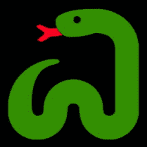
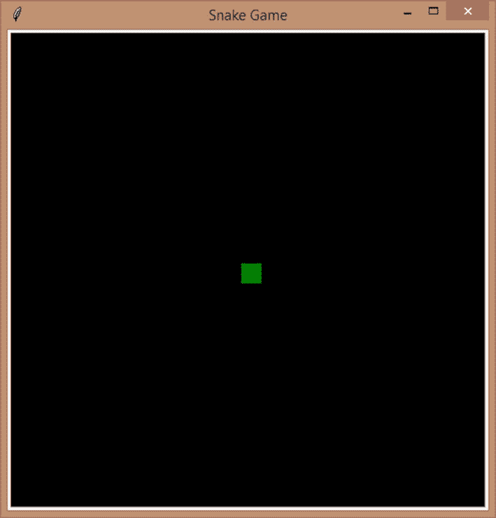
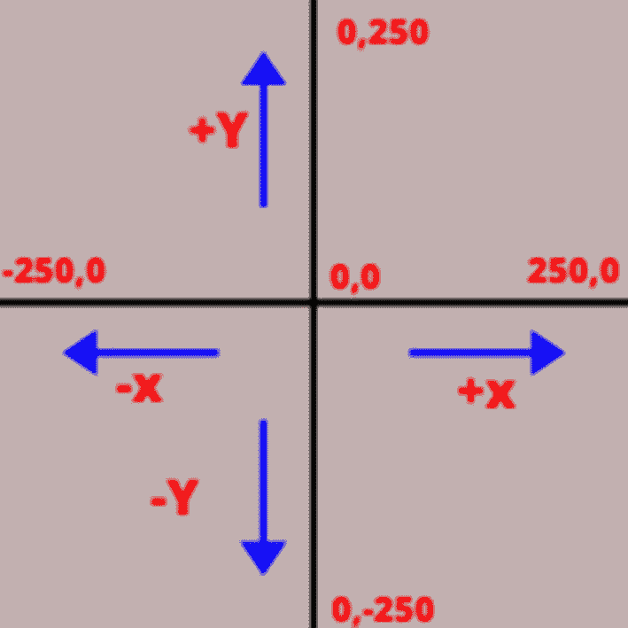
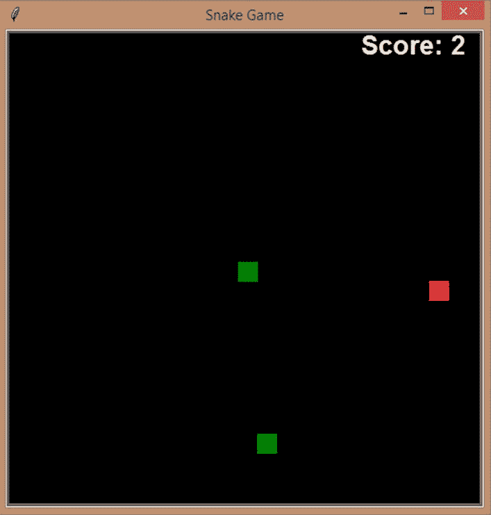
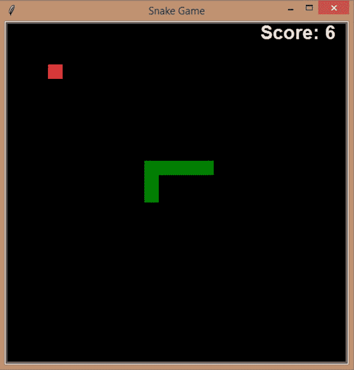
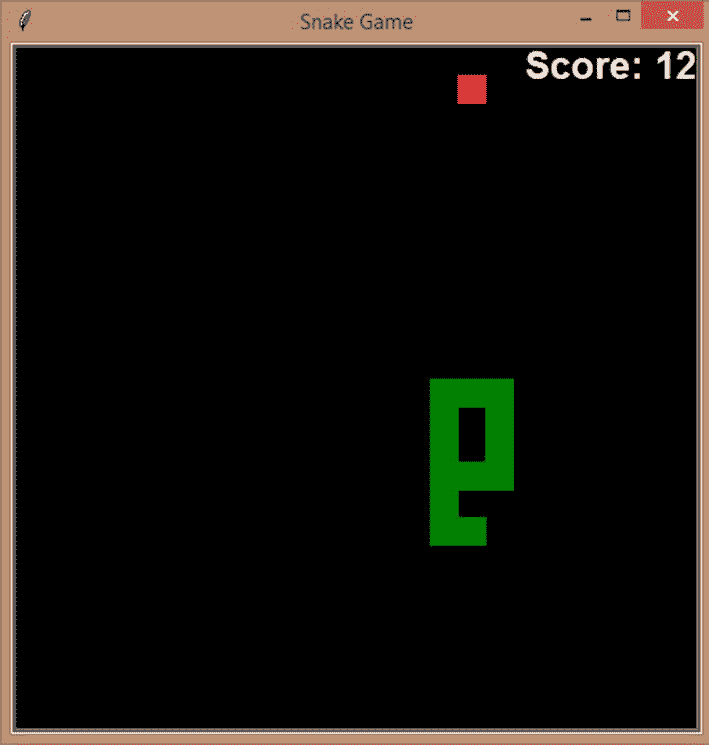

# 十九、项目：`turtle`贪食蛇游戏

在前几章中，我们深入研究了 *Tkinter* 。我们学习了如何在 *Tkinter* 中创建窗口小部件，设计它们的样式，让它们在事件发生时做一些事情，以及在画布上绘图。我们还着眼于创建两个大项目——一个井字棋和一个绘画应用。

本章我们回到`turtle`。所有这些章节我们都在研究`turtle`，但是我们从来没有创造出一个真实世界的应用。所以，让我们在本章中创建一个贪食蛇游戏。

## 贪食蛇游戏



这是一个非常简单的游戏。你有你的蛇，它在我们的游戏中被画成一个正方形。我们从它的头部开始，当你按下任何一个箭头键时，头部就会向箭头所指的方向移动。

然后，你有一个红色的，成熟的苹果，正好和你的蛇头一样大。它出现在随机的位置，引诱你的蛇头去吃它。

每当你的蛇接触到苹果时(我们假设它当时吃了苹果)，你的苹果就会消失在蛇的胃里。蛇是一部分一部分长的(刚吃过，所以应该是长的吧？).另一个苹果出现在屏幕上的另一个随机位置。

蛇每吃一个苹果，记分牌就加 1。

但是如果蛇头撞上了屏幕的四面墙中的任何一面或者撞上了自己的身体(长这么大！)，游戏结束！☹

够简单的游戏，不是吗？你玩过吗？我们的最终游戏看起来会像这样(图 19-1 )。


图 19-1

贪食蛇游戏

我们的蛇当时已经吃了六个苹果，长了六个身体部位(包括头在内有七个)。

那好吧。既然您已经知道了贪食蛇游戏是如何工作的，那么您一定对我们需要编写什么样的代码来实现这一切有一个简单的想法。别担心。我会详细解释一切。

此外，不要混淆你需要写每段代码的顺序。当我解释事情的时候，它可能看起来很混乱，但是我已经在这一章的结尾按照正确的顺序包括了整个代码。自己编游戏的时候可以参考一下。

我们开始吧！这将是一个稍微有点长，但非常有益的旅程！

## 导入所需的模块

这个游戏需要三个模块。你需要乌龟包来画蛇、得分和苹果。你需要随机包装，使苹果出现在随机的位置，这是游戏的主要方面之一。

最后，你需要“时间”包。我们以前见过这个包，它让一个循环或函数暂停一段指定的时间。我们现在需要它来让我们的蛇以可控的速度移动。如果我们不调整节奏，我们的蛇会在一眨眼的时间里离开屏幕。

```py
import turtle
import time
import random

```

## 设置海龟屏幕

我们将设置一个海龟屏幕，步骤和我们通常使用的一样。将标题设为“贪食蛇游戏”，背景色设为“黑色”。

```py
s = turtle.Screen()
s.title('Snake Game')
s.bgcolor('Black')

```

但是在本例中，我们将使用 setup()函数来设置屏幕的宽度和高度(以像素为单位)。我们需要一个指定的宽度和高度，这样我们就知道屏幕上的所有内容，这样我们就可以指定精确的坐标来移动我们的蛇。

```py
s.setup(width = 500, height = 500)

```

最后，让我们去掉每当我们在屏幕上画东西时出现的动画。动画是漂亮的，是的，但是我们将会画这么多东西，画得太快了，以至于动画化每一幅画对我们的游戏来说都不是很好。

您可以使用 tracer()方法(在我们的屏幕中)并输入 0 来实现这一点。看那个！你已经在`turtle`中学到了一堆新东西。

```py
s.tracer(0) #gets rid of animation

```

现在，运行程序，你会得到一个像这样的黑屏(图 19-2 )。


图 19-2

游戏屏幕

## 创建并初始化所需的变量

我们已经在我们的节目中看到了这一点。无论何时你创建一个程序，你都需要一些贯穿整个程序的“全局”变量。我们也有一些。

有一个“蛇”列表，它将包含我们蛇的每一部分的“龟”。每当我们绘制一条蛇的一部分(包括头部)时，我们将创建一只新的乌龟，这样所有的乌龟可以一起工作，同时绘制整条蛇。通过将这些海龟存储在一个列表中，我们可以随时访问它们，并得到它们的位置(你会看到如何操作)。

```py
snake = []

```

我们要做 20 码的。这是你的方块的宽度和高度(蛇头，蛇的部分，苹果)。我要把这个值设为常数。

```py
size = 20

```

让我们还创建一个变量“key”来存储按下了哪个键:“u”表示上箭头键，“d”表示下箭头键，“l”表示左箭头键，“r”表示右箭头键。当我们开始游戏时，这个值将是一个空字符串。

```py
key = ''

```

最后，让我们做一个“score”变量，并在开始游戏时将其值初始化为 0。

```py
score = 0

```

## 画头像

现在我们已经初始化了变量，让我们画出我们的头，让它出现在我们的屏幕上。

我们将为此创建一个新的海龟(头)。使其速度为 0，形状为正方形，颜色为绿色。最后，将其移动到位置 0，0(屏幕中心)。

```py
#Draw head
head = turtle.Turtle()
head.speed(0)
head.shape('square')
head.color('Green')
head.penup()
head.goto(0, 0)

```

让我们也将这个头添加到“蛇”列表中。因为列表是空的，所以它将占据列表的第一个位置。

```py
snake.append(head) #get the first head

```

运行程序，告诉我你看到了什么。还是黑屏吗？我们的乌龟在哪里？！

好吧，我想我们看不到任何东西，因为有追踪器。我们去掉了动画，记得吗？这次我们需要一个游戏循环来纠正错误。

在 *Pygame* 中你会学到更多关于游戏循环的知识，但是现在，只要知道每个游戏都需要一个永不结束的循环(通常是 while 循环)在游戏还“开着”的时候运行。

现在让我们创建这样一个循环，并使用(我们屏幕的)update()方法在每次循环执行时更新屏幕。

```py
while True:
    s.update()

```

就这样！现在再次运行程序，你会在你的屏幕中间看到一个可爱的小蛇头(图 19-3 )。



图 19-3

蛇头

## 画第一个苹果

现在我们已经画了蛇，让我们在它的第一个随机位置画第一个苹果。为此我们需要另一只乌龟，我们打算给它取名为“苹果”。

```py
#Draw first apple
apple = turtle.Turtle()
apple.speed(0)
apple.shape('square')

```

使它的颜色为红色，让我们把它移动到一个随机的位置。

```py
apple.color('Red')
apple.penup()

```

阅读下面一行代码。我们正在生成一个介于–11 和 11 之间的随机数，并将其乘以 20。如果你把某个东西乘以 20，你就在创造 20 的倍数，这正是我们想要的，因为我们的蛇头每次移动都会向前移动 20 点。

如果我们的蛇必须获胜，它应该能够完全叠加苹果，因此苹果应该与蛇出现在同一条运动线上。我们需要 20 的倍数才能实现。

为什么是–11，11 的范围？嗯，你可以把它放大一点，也许是-11，12，所以实际范围是-11 到 11，但整个前提是苹果应该出现在屏幕内。

–11 * 20 等于–220。这是我们正方形左上角的 x，y 位置，然后是正方形，大小为 20。所以，我们正方形的右上角将是–240，对吗？

这就是它应该结束的地方。如果我们再向左移动，我们的苹果可能会消失。

```py
aX = random.randint(-11,11)*20
aY = random.randint(-11,11)*20

```

最后，让我们来看看我们刚刚创建的随机 x 和 y 坐标。

```py
apple.goto(aX,aY)

```

你有没有注意到我们的笔(头和苹果)总是“向上”？那是因为我们不会和他们一起抽签。这次乌龟(笔)将成为游戏角色，而不是他们的图画。

让我们运行程序，我们得到这个(图 19-4 )。


图 19-4

头和第一个苹果

太好了。我们有一个蛇头，固定在屏幕的中间，一个苹果出现在屏幕内的任意位置。

多次运行这个程序，你会注意到苹果每次都被画在不同的位置。酷吧？

现在，在程序的最后(在这一行之前添加下一行代码)，添加以下内容:

```py
s.mainloop()

```

这是为了确保在我们关闭屏幕之前，屏幕是打开的，所以在我们玩游戏的时候，提示不会出现在 Shell 中。

## 我的屏幕记录了我的箭头按压吗？

大多数游戏都有移动控制。我们要么使用操纵杆，要么使用键盘按键。我们的游戏很简单，所以我们会坚持使用键盘按键。

当我们按下箭头键时，我们能让我们的蛇动起来吗？向上、向下、向左或向右箭头键。

要让您的屏幕“监听”键盘按键，即知道按键被按下，请使用屏幕的 listen()方法。现在，你的屏幕正在监听。将这几行代码放在你画出第一个苹果和蛇头之后，但是在 while 循环(游戏循环)之前。

```py
#Listen to the events and act
s.listen()

```

现在，当按键发生时，您可以使用 onkeypress()方法来调用用户定义的函数。这类似于我们在 *Tkinter* 中的工作方式，唯一的区别是我们的函数调用在我们寻找的“事件”之前。

我们的事件是“上”、“下”、“左”和“右”。这些是 onkeypress()函数所期望的值，所以将它们放在引号内，并且不改变大小写。你的函数可以是任何东西。我把我的设定好了，设定好了，设定好了，设定好了，设定好了。

```py
s.onkeypress(set_up,'Up')
s.onkeypress(set_down,'Down')
s.onkeypress(set_left,'Left')
s.onkeypress(set_right,'Right')

```

现在我们已经调用了我们的函数，我们需要创建它们(否则我们会得到一个错误)。让我们定义一下 onkeypresses 上面的函数。每个函数将加载全局“key”变量，并将值更改为“up”、“down”、“right”或“left”。

但是我们需要记录一些东西。在贪食蛇游戏中，蛇不能向后移动，否则它们只会撞到自己的身体(从而结束游戏)，所以我们需要检查用户是否试图向后移动。

例如，如果 key 的当前值是‘down ’,那么接下来我们不应该将该值更改为‘up’。忽略特定按键等等。

```py
def set_up():
    global key #so the global variable key can be used in a local context here
    if(key != 'down'):
        key = 'up'
def set_down():
    global key
    if(key != 'up'):
        key = 'down'
def set_left():
    global key
    if(key != 'right'):
        key = 'left'
def set_right():
    global key
    if(key != 'left'):
       key = 'right'

```

好吧，我们已经正式改变方向了。但是如果我们现在运行这个程序，我们看不出有什么不同。按键。发生什么事了吗？没有。我们还没有编写让我们的蛇移动的代码！让我们接下来做那件事。

## 让我们的蛇头移动

所以，在贪食蛇游戏中，一旦我们设定了一个方向，蛇就会自动向那个方向移动，直到我们再次改变方向。所以基本上，一旦蛇开始移动，它会继续移动，直到撞到什么东西。

为了创建这种自动移动，我们将在游戏循环中调用 moveHead()函数。

```py
while True:
    s.update()
    moveHead()

```

但是，我们不会就此止步。我们将在每次迭代时以 0.2 秒的延迟运行 while 循环，这样人眼就可以看到蛇在移动。

循环的每次迭代都在几微秒内执行。Python 和你的电脑就是这么强大，这么快。但是，这是一个游戏。我们需要人眼能看到的东西，所以让我们放慢我们的程序，好吗？每次迭代后让它休眠 0.2 秒。

```py
time.sleep(0.2)

```

好了，现在我们完成了“while”循环，让我们创建 moveHead()方法来设置头部的 x 和 y 坐标。

我们将为每个函数调用连续改变头部的 x 和 y 坐标 20 点(这发生在 0.2 秒的延迟)，因此头部每 0.2 秒向前移动 20 点(图 19-5 )。



图 19-5

游戏屏幕坐标

请看前面的插图。如果你想向左移动你的蛇，减少 X 的值，同时保持 Y 的值不变。若要向右移动，请增加 X 的值。若要向上移动，请增加 Y 的值(X 保持不变)。若要向下移动，请减小 y 的值。

够简单吗？现在让我们把它应用到我们的代码中吧！

```py
#Make it move based on the set direction

```

我们不需要在这个函数中加载“key ”,因为我们没有改变/重新分配它的值。我们只是在找回它的价值。使用 xcor()和 ycor()方法检索“头”龟(我们游戏中的蛇头)的当前 x 或 y 坐标。现在你知道为什么我们在列表中存储整个海龟了。这是为了让我们可以用它来获得很多关于它的信息(比如它的位置)。

增加或减少 x 或 y 坐标的“大小”(20 像素)，因为这是我们的测量。我们的苹果也将出现在这些点上。

```py
def moveHead():
    if key == 'up':
        head.sety(head.ycor() + size)
    if key == 'down':
        head.sety(head.ycor() - size)
    if key == 'left':
        head.setx(head.xcor() - size)
    if key == 'right':
        head.setx(head.xcor() + size)

```

现在，运行程序并尝试让蛇移动(图 19-6 )。会的！


图 19-6

移动蛇头

如果你试着向后移动，它不会。你为什么不试着自己看看？

## 让记分牌开始吧

现在我们的蛇头在动了，我们需要开始得分了。在我们让蛇每次“吃”一个苹果时都成长之前，让我们在屏幕的右上角绘制记分卡，这样我们就可以跟踪代码。将这段代码放在你画第一个苹果的代码下面。不要担心订单。我将把整个代码按照正确的顺序粘贴到本章的末尾。

我将为记分牌创建另一只海龟，因为我想让它在其他海龟工作的时候“画”分数。我将它定位在点 120，120(朝向右上角)。

```py
#Draw the score
sc = turtle.Turtle()
sc.speed(0)
sc.pencolor('White')
sc.penup()
sc.goto(120,220)

```

首先，让我们用 Arial 字体写“分数:0”，20 分，粗体格式。随着游戏的进展，我们会更新数值。

```py
sc.write('Score:0',font=('Arial',20,'bold'))

```

让我们最终隐藏这只乌龟，因为我们只需要它画的东西(不像“苹果”和“蛇”龟)。

```py
sc.hideturtle()

```

运行程序，你得到这个(图 19-7 )。


图 19-7

创建记分板

是的，我们有记分牌了！伙计们，我们快到了！

## 我们的蛇在吃东西！

现在我们已经完成了我们的记分牌，让我们让我们的蛇吃。现在，如果我们的蛇碰到苹果，什么也不会发生。它会从旁边经过。它不会长大，我们的苹果也不会消失。

将接下来的几行代码(在函数定义之前)放在“while 循环”中，紧接在 s.update()方法之后。

所以，我们要检查我们的蛇的“头”和苹果之间的距离。如果该距离小于或等于 0，也就是说，如果蛇头完全与苹果合并，那么我们希望完成两件事情:

1.  在另一个随机位置绘制的新苹果。我们将创建一个 drawApple()函数来完成这项工作。

2.  蛇的尾部又多了一个身体部分。我们将创建一个新的“海龟”作为我们头部的身体部分。让我们创建一个 drawSnake()函数来完成这项工作。

*Turtle* 有一个 distance()方法，它检查一个对象是否在另一个对象的特定距离内。在我们的例子中，我们将检查我们的对象是否与另一个对象没有距离(完全叠加)。

```py
#check for eating
if head.distance(apple) <= 0: #completely superimposed
    drawApple()
    #Create a new body part
    drawSnake() #keep the tail - old head

```

让我们将 Score 的值增加 1，并调用 changeScore()方法，将 score 的当前值发送给它。此方法将更新记分卡。

```py
score += 1
changeScore(score)

```

好了，这就是我们的 while 循环(现在)。我们现在需要定义三个函数(在调用“while”循环之上):一个绘制新的苹果，一个更改分数，下一个绘制新的蛇身体部分，因为它必须生长(它刚刚吃了东西，不是吗？).

```py
#Draw apple function

```

按照和之前画第一个苹果时一样的步骤，得到下一个 x 和 y 坐标，然后把“苹果”龟移动到那个点。就这样！

```py
def drawApple():
    aX = random.randint(-11,11)*20
    aY = random.randint(-11,11)*20
    apple.goto(aX,aY)

```

现在，让我们画蛇的身体部分。每当我们的蛇头吃一个苹果，我们就要创造一个新的乌龟。所以，每次我们的 drawSnake()函数被调用时，一个新的 turtle“sBody”就会被创建。它将是方形的，颜色是绿色的，就像我们的蛇“头”一样。让我们将新的部分添加到“snake”列表中。

```py
#draw snake
def drawSnake():
    sBody = turtle.Turtle()
    sBody.speed(0)
    sBody.shape('square')
    sBody.color('Green')
    sBody.penup()
    snake.append(sBody) #insert at the end

```

现在，让我们研究 changeScore 方法。让比分“海龟”sc 回到 120，220 的位置(起始位置)。让我们使用 clear()方法清除当前的内容，用当前的分数创建一个新的字符串，并重写文本。因为速度为 0，所以你不会看到任何实时发生的情况，所以对于我们人类的眼睛来说，它看起来就像记分牌在无缝地更新自己。

```py
def changeScore(score):
    sc.goto(120,220)
    sc.clear()
    string = 'Score: {}'.format(score)
    sc.write(string,font=('Arial',20,'bold'))
    sc.hideturtle()

```

让我们运行程序，尝试吃一些苹果(图 19-8 )。



图 19-8

创建新的蛇的部分(蛇吃)

嗯，记分牌似乎在正常更新。苹果确实消失了，并出现在一个新的位置。每次我们的蛇吃东西时，我们似乎都会得到新的“身体部分”,但它们没有连接在一起，也没有一起移动。并且，看起来新的身体部分正在彼此之上出现(在屏幕的中间)，所以对我们的眼睛来说，我们只看到一个身体部分，而现在应该有两个(因为分数是 2)。

为什么呢？我们还没有要求他们这么做。你知道，在编程中，你需要对每一件小事进行详细的说明。所以，我们就这么做吧，好吗？

## 让整条蛇动起来

让我们通过调用 moveBody()来更新 while 循环。这个函数会将蛇的身体部分附加到头部，并使身体部分随之移动。

一旦我们完成了，我们的 while 循环将看起来像这样:

```py
while True:
    s.update()
    #check for eating
    if head.distance(apple) <= 0: #completely superimposed
        drawApple()
        #Create a new body part
        drawSnake() #keep the tail - old head
        score += 1
        changeScore(score)
    moveBody() #RIGHT HERE!
    moveHead()
    time.sleep(0.2)

```

确保对 moveBody()函数的调用是在 moveHead()函数之前的**,这样它们在新的头部被绘制之前移动，这样看起来就像实际的移动。**

现在，让我们定义 moveBody()函数。我们基本上要交换坐标。

因为我们在程序开始时附加了" head "," snake "列表的第 0 个索引将包含我们的" head "海龟，对吗？然后，我们附加了其他身体部分，也在蛇头后添加了乌龟。所以，为了模拟运动，我们需要这些身体部位移动它们的坐标。

现在，只有“Head”移动，因为这是我们编写的唯一代码(moveHead()函数)。所以，每次“头”移动到一个新的坐标，紧挨着它的身体部分(在“蛇”列表中)应该移动到头的旧坐标。现在，第一个身体部位旁边的身体部位应该移动到第一个身体部位的旧位置，以此类推，直到蛇的所有部位都向前移动了 20 个像素。

我们如何才能做到这一点？在编程中，每当你想交换值时，你需要一个临时变量来保存旧值。

因此，我们将创建一个临时列表 temp 来存储蛇身体部位的所有当前 x 和 y 坐标。

为此，我们将创建一个“for”循环来遍历“snake”列表。

```py
def moveBody():
    temp = []
    #create a list of the current positions

```

让我们在列表的一个“项目”中只存储每个蛇部分的 x 和 y 坐标。我们将在一个列表中创建字典。

```py
for i in snake:
    x = i.xcor()
    y = i.ycor()
    temp.append({'x': x, 'y': y})

```

现在我们有了临时名单，让我们交换一下。我们不需要改变第零个索引中的项目的位置(这是我们的头，它自己移动)，所以让我们创建一个 for 循环，从 1 开始循环到蛇的长度(1-(len–1))，这只是身体部分。

```py
#Move entire body
for i in range(1,len(snake)):

```

因为“temp”已经有了整条蛇(包括头部)的“旧的”x 和 y 坐标，我们就使用它。所以，让我们让第 I 个位置的乌龟(从第一个索引开始)去第 I–1 个位置的乌龟的 x 和 y 坐标(这是我们的头，开始)。

就是这样！因为我们使用了一个字典来存储我们在 temp 中的值，所以我们需要像这样访问它们。因此，“temp”中第一项的 x 值将是 temp[0]['x']，依此类推。

```py
snake[i].goto(temp[i-1]['x'],temp[i-1]['y'])

```

让我们检查一下我们的蛇现在是否移动(图 19-9 )。



图 19-9

让整条蛇动起来

它完美地移动和生长。哇哦！

现在，游戏的最后一部分。碰撞检查！

## 碰撞检查

在为下一次睡眠移动头部之前，我们需要做碰撞检查，这样下一次移动就不会发生。我们将调用 checkCollision 函数，如果有冲突，它将返回 True，如果函数调用的结果确实为 True，我们将打破游戏循环(while loop)。更新后的 while 循环如下:

```py
while True:
    s.update()
    #check for eating
    if head.distance(apple) <= 0: #completely superimposed
        drawApple()
        #Create a new body part
        drawSnake() #keep the tail - old head
        score += 1
        changeScore(score)
    moveBody()
    moveHead()
    #Before moving the head for the next round, check for collision
    if checkCollision():
        break
    time.sleep(0.2)

```

例如，如果我们将碰撞检查放在其他地方，在身体移动之前，我们可能会在游戏中看到不一致。例如，尝试在 moveBody()和 moveHead()之间放置碰撞检查。乍一看，这似乎合乎逻辑，但通过这样做，你正在创建一个身体，移动它，但随后在你移动头部的 之前立即检查碰撞 ***。这将导致身体碰撞，因为现在你的第一个身体部位和你的头在同一位置。***

因此，在检查碰撞之前，让我们完全移动我们的蛇。

现在，让我们定义碰撞检查函数。这个函数将加载全局“key”变量，因为我们要把它改回一个空字符串，所以移动会暂时停止。

我们还将创建一个变量“collision ”,并将其默认值设为 False。

```py
def checkCollision():
    global key
    collision = False

```

先检查一下有没有撞墙。很简单，真的。如果头部的 x 或 y 坐标大于 240 或小于–240，则碰撞为真。

```py
#wall collision
if head.xcor() < -240 or head.xcor() > 240 or head.ycor() < -240 or head.ycor() > 240:
    collision = True

```

现在，对于身体碰撞，让我们再次循环 1 到蛇列表的长度(只有身体部分，而不是头部)。如果头部的 x 和 y 坐标与蛇身体任何部分的 x 和 y 坐标相同，那么就发生了身体碰撞，碰撞再次成立。

```py
#body collision
for i in range(1,len(snake)):
    if head.xcor() == snake[i].xcor() and head.ycor() == snake[i].ycor():
       collision = True

```

最后，如果碰撞是真的，那么让 key 再次成为空字符串(暂停移动)。游戏基本上结束了。如果 collision 不为真，那么什么都不会发生，下一次“while”循环将继续。

```py
if collision == True:
    key = '' #pause the movement

```

接下来我们需要做三件事:

1.  暂停程序 1 秒钟，让用户意识到游戏已经结束。

2.  将蛇(及其所有部分)和苹果从屏幕上移开，这样它就基本上“消失”了。

3.  画一个“游戏结束”的信息。我们需要一只新的海龟来做这件事。我们将保留记分卡，以便用户知道他们最后的得分。

    ```py
    time.sleep(1) #pause for a bit so user registers what happened

    ```

让我们通过“蛇”循环，并将其所有部分移动到 2000，2000(基本上离开屏幕)。让我们也把苹果搬到一个更远的位置。

```py
        for s in snake:
            s.goto(2000,2000) #make it go off the screen
        apple.goto(2500,2500)
We’re going to create an ordinary Turtle, move it to the point -170,0 and draw ‘GAME OVER’ in white.
        #game over message
        game = turtle.Turtle()
        game.penup()
        game.goto(-170,0)
        game.pencolor('white')
        game.write('GAME OVER!',font=('Arial',40,'bold'))
        game.hideturtle()
return collision

```

最后，让我们将碰撞返回到调用函数。就是这样！我们已经完成了我们的游戏！

让我们检查一下碰撞是否有效，好吗？

先检查一下有没有撞墙(图 19-10 )。


图 19-10

壁碰撞

是的，它工作了。

现在进行车身碰撞(图 19-11 )。



图 19-11

身体碰撞

那边有一条盘绕的蛇！

在提到的 1 秒钟延迟后，一切都消失了，我们只剩下记分牌和“游戏结束”的消息。如果用户想再次玩，他们必须再次运行程序(图 19-12 )。


图 19-12

游戏结束消息

咻！时间很长，但绝对值得！我希望你和我一起创作这个游戏时有很多乐趣。我知道我做到了！

## 整个代码

现在，正如承诺的那样，整个代码:

```py
#import the required modules
import turtle
import time
import random

#setup the screen
s = turtle.Screen()
s.title('Snake Game')
s.bgcolor('Black')
s.setup(width = 500, height = 500)
s.tracer(0) #gets rid of animation

#create and assign the required variables
snake = []
size = 20
key = ''
score = 0

#Draw the head
head = turtle.Turtle()
head.speed(0)
head.shape('square')
head.color('Green')
head.penup()
head.goto(0, 0)
snake.append(head) #get the first head

#Draw the first apple
apple = turtle.Turtle()
apple.speed(0)
apple.shape('square')
apple.color('Red')
apple.penup()
#generate a random integer that's a multiple of 20
#multiples of 20 that doesn't go beyond the screen (250,-250)
aX = random.randint(-11,11)*20
aY = random.randint(-11,11)*20
apple.goto(aX,aY)

#Draw the scoreboard at the beginning
sc = turtle.Turtle()
sc.speed(0)
sc.pencolor('White')
sc.penup()
sc.goto(120,220)
sc.write('Score:0',font=('Arial',20,'bold'))
sc.hideturtle()

#Change the direction of the snake
def set_up():
    #so the global variable key can be used in a local context here
    global key
    if(key != 'down'):
        key = 'up'
def set_down():
    global key
    if(key != 'up'):
        key = 'down'
def set_left():
    global key
    if(key != 'right'):
        key = 'left'
def set_right():
    global key
    if(key != 'left'):
       key = 'right'

#Make the snake move based on the set direction
def moveHead():
    if key == 'up':
        head.sety(head.ycor() + size)
    if key == 'down':
        head.sety(head.ycor() - size)
    if key == 'left':
        head.setx(head.xcor() - size)
    if key == 'right':
        head.setx(head.xcor() + size)

#make the new snake body move (if the snake has grown)
def moveBody():
    temp = []
    #create a list of the current positions
    for i in snake:
        x = i.xcor()
        y = i.ycor()
        temp.append({'x': x, 'y': y})
    #Move entire body
    for i in range(1,len(snake)):
        snake[i].goto(temp[i-1]['x'],temp[i-1]['y'])

#Draw apple function
def drawApple():
    #generate a random integer that's a multiple of 20
    #multiples of 20 that doesn't go beyond the screen (250,-250)
    aX = random.randint(-11,11)*20
    aY = random.randint(-11,11)*20
    apple.goto(aX,aY)

#Create a new snake part
def drawSnake():
    sBody = turtle.Turtle()
    sBody.speed(0)
    sBody.shape('square')
    sBody.color('Green')
    sBody.penup()
    snake.append(sBody) #insert at the end

#Update the score
def changeScore(score):
    sc.goto(120,220)
    sc.clear()
    string = 'Score: {}'.format(score)
    sc.write(string,font=('Arial',20,'bold'))
    sc.hideturtle()

#Check for collision – wall & body
def checkCollision():
    global key
    collision = False
    #wall collision
    if head.xcor() < -240 or head.xcor() > 240 or head.ycor() < -240 or head.ycor() > 240:
        collision = True
    #body collision
    for i in range(1,len(snake)):
        if head.xcor() == snake[i].xcor() and head.ycor() == snake[i].ycor():
           collision = True
    if collision == True:
        key = '' #pause the movement
        time.sleep(1) #pause for a bit so user registers what happened
        for s in snake:
            s.goto(2000,2000) #make it go off the screen
        apple.goto(2500,2500)
        #game over message
        game = turtle.Turtle()
        game.penup()
        game.goto(-170,0)
        game.pencolor('white')
        game.write('GAME OVER!',font=('Arial',40,'bold'))
        game.hideturtle()
    return collision

#Listen to the events and act on the required key presses
s.listen()
s.onkeypress(set_up,'Up')
s.onkeypress(set_down,'Down')
s.onkeypress(set_left,'Left')
s.onkeypress(set_right,'Right')

#The main game loop that keeps the game running
while True:
    s.update()
    #check for eating
    if head.distance(apple) <= 0: #completely superimposed
        drawApple()
        #Create a new body part
        drawSnake() #keep the tail - old head
        score += 1
        changeScore(score)
    #Move the body first, and then the head to the new position
    moveBody()
    moveHead()
    #Before moving the head for the next round, check for collision
#If there's a collision, stop the game loop – no more movement
    if checkCollision():
        break
    #A delay of 0.2 seconds before each movement
    time.sleep(0.2)

#Keep the screen open until the user closes it
s.mainloop()

```

## 摘要

在这一章中，我们用我们的`turtle`包创建了一个贪食蛇游戏。我们学到了很多新东西，比如使用时间模块暂停你的程序一会儿，创建游戏循环，获取你的海龟的位置，移动你的游戏角色，碰撞检查，在 2D 游戏中记分，等等。

在下一章中，让我们来了解一下关于 *Pygame* 的一切。我们将学习如何在 *Pygame* 中创建简单的 2D 游戏，这是专门为制作游戏而创建的。