# 十六、Python 网络自动化实验室：Ansible、pyATS、Docker 和 Twilio API

本章旨在向您介绍 Python `virtualenv`和 Docker 概念，并向您展示探索 Python 外部模块和特性的其他方式。到目前为止，在本书中，我们重点介绍了如何使用 Python 的基本 Telnet 和 SSH 远程访问方法来探测、配置和管理实验室拓扑中的网络设备。在一个生产环境中，我们通常不会得到一个专用的 Linux 服务器来进行测试和实现；通常你会得到一个 Linux 服务器上的有限资源，可以和其他工程师共享。我们必须学习如何绕过这些障碍，并在这样的生产环境中实现我们的解决方案(或应用)。在本章结束时，你将能够在 Python 虚拟环境中进行测试，而不会影响现有的 Python 设置。您将快速入门 Ansible 和 pyATS (Genie ),并了解如何在 Linux 和 Python 上使用 Sendmail 发送电子邮件。最后，您将学习使用 Python 应用监控网络设备的 CPU 利用率，然后使用免费的 Twilio SMS 帐户通过 Twilio API 向您的智能手机发送 SMS。您将探索如何适应其他开源工具，并相应地编写 Python 程序。

## Python 网络自动化开发实验室

我们已经接近这本书的结尾，在这一章中，你将探索一些 Python 网络自动化实验室。本章将向您介绍不同的网络自动化工具，帮助您踏上网络自动化之旅。有专门的网站和文档介绍 Ansible、pyATS 和 Docker。因此，仅仅通过阅读本书的一个章节，从技术上来说是不可能深入理解这些工具的。尽管如此，安装和学习这些工具是值得的，这样您就可以自己决定这些工具是否能帮助您实现网络自动化的梦想。不是每个网络工程师都想以写 Python 代码为生，但仍然想体验网络自动化的真正力量。在这种情况下，这些现成的工具将服务于最常见的网络自动化场景，您不必编写真正的 Python 代码。

但是，请注意，没有两个客户端网络环境是相同的，也没有两个组织的 IP 流量具有相同的优先级或特征。如果你读到这里，仍然认为网络自动化只包括自动化网络工程师的一般任务及其思维过程，那你就错了。这项工作的一半都是关于处理数据的，也就是说，你如何提取和使用这些数据为你的组织带来好处，用代码行代替可重复的任务。因此，每个场景中都不可避免地涉及到一些定制和编写代码。简而言之，本章将作为 Ansible、pyATS 和 Docker 的快速入门指南。

Red Hat 的 Ansible 在网络配置管理方面越来越受欢迎；它是一个开源工具，最初是作为操作系统的配置管理工具开发的。最近，同样的工具被用来管理网络设备。Ansible 的一大好处是，Ansible 用户不必编写真正的代码，如 Python 或 JavaScript 他们用叫做 YAML 的伪代码写代码。是的，编写 YAML 代码介于编写真正的代码和使用基于 GUI 的软糖代码之间。Ansible 只不过是一个基于 Python 的`paramiko`、`netmiko`和`nornir`库的简化的 YAML 应用，但它比仅仅用 Python 编码要用户友好得多。与其他竞争对手一样，它使用无代理推送方法而非拉取方法，将 YAML 文件用于端点自动化。Ansible 可能是第一个网络自动化工具，许多网络工程师甚至在进入 Python 之前就会与之交互。或者，你可能是一个经验丰富的 Python 程序员，并爱上 Ansible 和 Ansible Tower 友好的用户界面和易于遵循和理解的 YAML 工作流设计。Ansible 使用 YAML，它比脚本编程语言更像应用；使用 Ansible，用户不需要知道任何编程语言。不是所有的网络工程师都想精通 Python 编程；他们想要一个预制的工具，所以 Ansible 可能是答案。我坚信 Ansible 对很多机构最大的吸引力就是它的低准入门槛(甚至比 Python 还低)。但同时，这从一个工程师的角度来看是一种失望，这可能会导致许多工程师过早地放弃他们的编程语言之旅。

在本章中，您将看到一些快速安装和启动实验。pyATS 和 Nornir 是思科认可和开发的工具；这里将向您介绍 pyATS，作为快速启动指南。pyATS 不是一种编程语言；相反，它是一个网络探测和信息收集工具，而不是配置工具。对于配置，可以使用 Nornir，但它只是一个具有更多用户友好功能的`netmiko`的重写版本，其中`netmiko`是`paramiko`的改进版本，它明确专注于多供应商网络自动化。这些都是很棒的工具，值得花时间去探索它们。本章还将谈到 Docker 作为生产中的资源节约工具。Docker 是一个可以在 Linux 或 Windows 系统上运行的容器化解决方案。Docker 在企业网络自动化方面有很多用例。尽管如此，Docker 主要用作 Linux 服务器上运行和执行任务或应用的实例。它们占用的空间很小，可以在整个虚拟机不适合运行单个任务的地方运行，例如在专用虚拟机上运行夜间系统检查。我们将在各自的章节中进一步讨论这些工具。在这一章的后半部分，你将被引导建立两个 Docker 镜像的实验室，并学习如何使用 Docker。此外，作为实验的一部分，您将了解如何在 Python 中使用 REST API。

首先，你将安装 Python 的`virtualenv`，并学习如何在 Python 虚拟环境中工作；然后使用`virtualenv`向您介绍 Ansible 和 pyATS。在第三个实验中，您将安装 Docker 并从 Docker Hub 下载我专门构建的 Python 网络自动化服务器，并学习使用 Docker 容器来代替实际的虚拟机。在某些情况下，Docker 可能是运行独立 Python 应用而不浪费大量计算能力的最佳替代环境。

## Ansible 快速入门指南:虚拟实验室 1

在开发 Python 应用时，有很多情况下您希望在不影响生产 Python 服务器的情况下测试新的 Python 模块。正如前面章节中所讨论的，Python 服务器通常是在 Linux 操作系统上实现的。随着你对 Linux 操作系统的了解越来越多，当一切都按设计运行时，操作 Linux 系统是一种乐趣。尽管如此，在引入新软件时，或者在这种情况下，在工作的 Python 环境中引入不同的 Python 库时，事情可能并且将会变得非常糟糕。您可能需要花费数小时来排除错误安装的程序，并尝试删除该软件，将操作系统恢复到良好的系统健康状态。`virutalenv`是一个 Python 工具，用于创建隔离的环境，包含它们的 Python 副本、`pip`和专用存储空间，以保存从 PyPl 安装的测试库。它允许用户在同一台机器上同时处理多个具有不同依赖关系的项目。您可以将`virtualenv`视为 Python 库测试的快速沙箱。

在本实验中，您将快速了解如何在您的 Ubuntu 服务器上设置 Python `virtualenv`，为 Ansible 创建`virtualenv`并测试 Ansible 探测信息，以及在您的实验室中对 Cisco 设备进行快速配置更改。注意 Ansible 不是像 Python、Perl、JavaScript 那样的编程语言；这是一个使用 YAML 来协调 IP 设备的框架。在 Ansible 下面，它是用 Python 写的，而且，对于 SSH 连接，它依赖于`paramiko`，正如我们在第七章中所学的。

很多人问我应该先学 Ansible 还是先学 Python？我认为答案取决于每个人对使用 Python 实现网络自动化的了解程度。既然你已经读到这里，你可能已经知道你的答案了:首先学习 Python，然后尝试 Ansible。因为来自 Red Hat 的 Ansible(以及某种程度上来自 Cisco 的 pyATS [Genie])是如此强大，不需要工程师去写真正的代码，它可以误导 Python 学习者认为你没有必要学习 Python；这是先学 Ansible 后学 Python 的最大弊端。

以下内容是在 Ubuntu 20.04 LTS 服务器环境下安装`virtenv`模块的快速启动指南。按照这些简单的步骤设置您的环境，以完成下面的 Ansible 启动实验。如果您使用 CentOS(或任何 Red Hat)操作系统，这个过程会稍有变化，但基本功能是相同的。图 16-1 显示了本实验中使用的逻辑连接和设备。

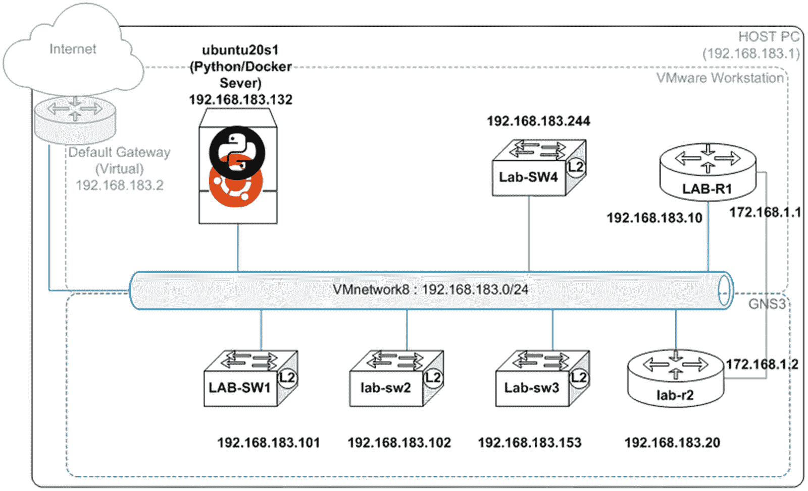

图 16-1。

Ansible virtualenv 实验室使用的设备

### 安装 virtualenv 并开始使用 Ansible

让我们在你的 Ubuntu 20 LTS 服务器上安装`virtualenv`模块，为本章的第一个实验做好准备。按照每个步骤完成`virtualenv`的安装。

<colgroup><col class="tcol1 align-left"> <col class="tcol2 align-left"></colgroup> 
| 

#

 | 

工作

 |
| --- | --- |
| **1** | SSH 进入您的 Ubuntu 服务器，并执行以下步骤来启动并运行下一个实验。使用 Ubuntu 的高级打包工具将 Ubuntu 20.04 LTS 更新和升级至最新版本。`pynetauto@ubuntu20s1:~$` `sudo apt update``pynetauto@ubuntu20s1:~$` `sudo apt -y upgrade` |
| **2** | 为了使您的 Python 环境更加健壮，安装一些额外的包和开发工具，以确保为编程环境设置了 Linux 服务器。最好以 root 用户身份安装这些软件包。`pynetauto@ubuntu20s1:~$ su -``Password: ********``root@ubuntu20s1:~#` `apt update``root@ubuntu20s1:~#` `apt-get install -y``root@ubuntu20s1:~#` `apt install -y build-essential python3-dev libssl-dev libffi-dev``root@ubuntu20s1:~#` `apt install -y python3-pip``root@ubuntu20s1:~#` `apt install -y python3-pip` |
| **3** | 您将使用`venv` Python 模块来配置`python3`虚拟环境，这是标准 Python 3 库的一部分。`root@ubuntu20s1:~#` `apt install -y python3-venv``root@ubuntu20s1:~#` `apt install sshpass # For ansible ssh login``root@ubuntu20s1:~#` `su - pynetauto` |
| **4** | 使用`mkdir`来创建一个目录(环境),你的虚拟环境将在其中生存。使用`cd`命令切换到新目录。`pynetauto@ubuntu20s1:~$` `mkdir venv1``pynetauto@ubuntu20s1:~$` `cd venv1``pynetauto@ubuntu20s1:~/venv1$` |
| **5** | 进入目录后，创建您的测试环境。使用`ls` Linux 命令查看环境目录中的项目，在本例中是`ansible_venv`。`pynetauto@ubuntu20s1:~/venv1$` `python3 -m venv ansible_venv``pynetauto@ubuntu20s1:~/venv1$` `ls ansible_venv``bin  include  lib  lib64  pyvenv.cfg  share` |
| **6** | 激活并启动新的虚拟环境。`./`表示当前工作目录或您正在其中工作的目录。一旦您激活了您的虚拟环境，您将在 CLI 的开头看到`(ansible_venv)`。`pynetauto@ubuntu20s1:~/venv1$` `source ./ansible_venv/bin/activate``(ansible_venv) pynetauto@ubuntu20s1:~/venv1$` |
| **7** | 如果您的 Linux 命令行前面有`(ansible_venv)`，这意味着您处于虚拟环境中。运行`Python –V`或`python3 –V`确认 Python 版本。如果您只有 Python 版本 3，您可以使用`Python`或`Python3`在这个环境中运行您的脚本。`(ansible_venv) pynetauto@ubuntu20s1:~/venv1$` `Python -V``Python 3.8.2``(ansible_venv) pynetauto@ubuntu20s1:~/venv1$` `python3 -V``Python 3.8.2` |
| **8** | 要退出或停用环境，使用`deactivate`命令退出您的`virtualenv`。`(ansible_venv) pynetauto@ubuntu20s1:~/venv1$` `deactivate``pynetauto@ubuntu20s1:~/venv1$` |
| **9** | 要重新激活相同的环境，如果您已经在`netautovenv`目录中，使用相同的`./ansible_venv/bin/activate`命令。`pynetauto@ubuntu20s1:~/venv1$` `source ./ansible_venv/bin/activate``(ansible_venv) pynetauto@ubuntu20s1:~/venv1$` |
| **10** | 要启动我们的 Ansible 实验室，首先安装`paramiko`，然后使用`pip3 install`命令安装 Ansible。Ansible 使用`paramiko`作为它到网络设备的 SSH 连接，所以这是一个先决条件。`pynetauto@ubuntu20s1:~/venv1$ source ./ansible_venv/bin/activate``(ansible_venv) pynetauto@ubuntu20s1:~/venv1$` `pip3 install paramiko``(ansible_venv) pynetauto@ubuntu20s1:~/venv1$``pip3 install ansible``(ansible_venv) pynetauto@ubuntu20s1:~/venv1$` `ansible --version``ansible 2.9.12` |
| **11** | 在 Ansible 安装之后，再次在`ubuntu20s1`服务器上生成 SSH 密钥。`(ansible_venv) pynetauto@ubuntu20s1:~/venv1$` `ssh-keygen``Generating public/private rsa key pair.``Enter file in which to save the key (/home/pynetauto/.ssh/id_rsa):``Created directory '/home/pynetauto/.ssh'.``Enter passphrase (empty for no passphrase): **********``Enter same passphrase again: **********``Your identification has been saved in /home/pynetauto/.ssh/id_rsa``[... omitted for brevity]``+----[SHA256]-----+``(ansible_venv) pynetauto@ubuntu20s1:~/venv1$` |
| **12** | 使用`ls ansible_venv/bin/ansible*`检查 Ansible 中可用的命令。`(ansible_venv) pynetauto@ubuntu20s1:~/netautovenv$` `ls ansible_venv/bin/ansible*``ansible_venv/bin/``ansible``ansible_venv/bin/``ansible-console``ansible_venv/bin/``ansible-inventory``ansible_venv/bin/``ansible-test ansible_venv``/bin/``ansible-config``ansible_venv/bin/``ansible-doc``ansible_venv/bin/``ansible-playbook``ansible_venv/bin/``ansible-vault``ansible_venv/bin/``ansible-connection``ansible_venv/bin/``ansible-galaxy``ansible_venv/bin/``ansible-pull` |
| **13** | 接下来，使用`sudo /home/pynetauto/.ssh/config`命令打开 SSH 配置文件，并添加 Cisco 设备支持的安全密钥交换。更新后，您的文件应该如下所示:`(ansible_venv) pynetauto@ubuntu20s1:~/venv1$` `nano /home/pynetauto/.ssh/config``Update the ~/.ssh/config file for the correct security key exchange.``GNU nano 4.8` `/home/pynetauto/.ssh/config``Host 192.168.183.10``KexAlgorithms +diffie-hellman-group1-sha1``Host 192.168.183.20``KexAlgorithms +diffie-hellman-group1-sha1``Host 192.168.183.101``KexAlgorithms +diffie-hellman-group1-sha1``Host 192.168.183.102``KexAlgorithms +diffie-hellman-group1-sha1``Host 192.168.183.153``KexAlgorithms +diffie-hellman-group1-sha1``Host 192.168.183.244``KexAlgorithms +diffie-hellman-group1-sha1``^G Get Help  ^O Write Out    ^W Where Is   ^K Cut Text    ^J Justify   ^C Cur Pos``^X Exit      ^R Read File    ^\ Replace    ^U Paste Text  ^T To Spell  ^_ Go To Line`现在，尝试使用以下命令 SSH 到每台设备。确保您可以成功登录到每台设备。另外，`R1`使用旧的 AES 类型的密钥交换，并且与 Ubuntu 服务器有问题，因此不在本实验中。对于 CML 或更新的 Cisco 设备，您还可以强制服务器使用`diffie-hellman-group1-sha1`进行密钥交换。`(ansible_venv) pynetauto@ubuntu20s1:~/netautovenv$` `ssh pynetauto@192.168.183.10``(ansible_venv) pynetauto@ubuntu20s1:~/netautovenv$` `ssh pynetauto@192.168.183.20``(ansible_venv) pynetauto@ubuntu20s1:~/netautovenv$` `ssh pynetauto@192.168.183.101``(ansible_venv) pynetauto@ubuntu20s1:~/netautovenv$` `ssh pynetauto@192.168.183.102``(ansible_venv) pynetauto@ubuntu20s1:~/netautovenv$``ssh -oKexAlgorithms=+diffie-hellman-group1-sha1 pynetauto@192.168.183.153``(ansible_venv) pynetauto@ubuntu20s1:~/netautovenv$` `ssh -oKexAlgorithms=+diffie-hellman-group1-sha1 pynetauto@192.168.183.244`使用 SSH 登录每台路由器和交换机非常重要。在第一次提示时，接受新的 RSA 密钥指纹，以允许从 Python 服务器到每个设备的 SSH 连接。`(ansible_venv) pynetauto@ubuntu20s1:~/venv1/ansible$` `ssh pynetauto@192.168.183.244`主机‘192 . 168 . 183 . 244(192 . 168 . 183 . 244)’的真实性无法成立。RSA key fingerprint is sha 256:1 type 2 xgth HANA 9ee+nvbqemnnw 6 eha 5i/xygj 8 zu 1 P4。您确定要继续连接吗(是/否/[指纹])？**是**警告:已将“192 . 168 . 183 . 244”(RSA)永久添加到已知主机列表中。如果您在通过 SSH 登录时遇到问题，请打开 known_hosts 文件并清除条目，然后再次尝试 SSH 登录。`(ansible_venv) pynetauto@ubuntu20s1:~/venv1$` `sudo nano /home/pynetauto/.ssh/known_hosts` |
| **14** | 现在，使用 Ansible 命令首次以交互方式登录到您的一个网络设备。对网络中的每台设备运行以下命令。以下示例是使用 Ansible ad hoc 命令登录到`LAB-R1` (192.168.183.10)的 SSH。`(ansible_venv) pynetauto@ubuntu20s1:~/netautovenv$` `ansible all -i 192.168.183.10, -c network_cli -u pynetauto -k -m ios_facts -e ansible_network_os=ios``SSH password:********``[WARNING]: default value for `gather_subset` will be changed to `min` from `!config` v2.11 onwards``192.168.183.10 &#124; SUCCESS => {``"ansible_facts": {``"ansible_net_all_ipv4_addresses": [``"192.168.183.10",``"172.168.1.1"``],``"ansible_net_all_ipv6_addresses": [],``"ansible_net_api": "cliconf",``"ansible_net_filesystems": [``"flash0:"``[...omitted for brevity]``"ansible_net_iostype": "IOS",``"ansible_net_memfree_mb": 246866.65625,``"ansible_net_memtotal_mb": 314934.875,``"ansible_net_model": "IOSv",``"ansible_net_neighbors": {},``"ansible_net_python_version": "3.8.2",``"ansible_net_serialnum": "9M39W7I3ODBU6XCMNZ5GB",``"ansible_net_system": "ios",``"ansible_net_version": "15.6(2)T",``"ansible_network_resources": {},``"discovered_interpreter_python": "/usr/bin/python3"``},``"changed": false``}``(ansible_venv) pynetauto@ubuntu20s1:~/venv1$` |
| **15** | 我们可以去 Ansible 的官方网站获取有用的信息和技术文档。Red Hat 提供了大量关于如何开始使用 Ansible 以及如何使用 Ansible 实现网络自动化的文档。URL: [`https://docs.ansible.com/ansible/latest/network/getting_started/first_playbook.html`](https://docs.ansible.com/ansible/latest/network/getting_started/first_playbook.html)URL: [`https://docs.ansible.com/ansible/latest/modules/ios_facts_module.html`](https://docs.ansible.com/ansible/latest/modules/ios_facts_module.html)让我们转到第一个 playbook HTML URL，快速测试 Ansible 能为您做什么。一旦你上了网站，进入`first_playbook.yml`，在你的`virtualenv`中，用相同的名字创建一个新的 YAML 文件。将其修改为用 Cisco 替换 Vyatta，第一个剧本将类似于此。该行动手册将获取您设备的主机名和操作系统。`(ansible_venv) pynetauto@ubuntu20s1:~/venv1$` `pwd``/home/pynetauto/venv1``(ansible_venv) pynetauto@ubuntu20s1:~/venv1$` `nano first_playbook.yml``GNU nano 4.8` `first_playbook.yml``--- # indicates that this is a YAML file``- name: Network Getting Started First Playbook``connection: network_cli``gather_facts: false``hosts: all``tasks:``- name: Get config for Cisco devices``ios_facts:``gather_subset: all``- name: Display the config``debug:``msg: "The hostname is {{ ansible_net_hostname }} and the OS is {{ ansible_net_version }}"``^G Get Help  ^O Write Out    ^W Where Is   ^K Cut Text    ^J Justify   ^C Cur Pos``^X Exit      ^R Read File    ^\ Replace    ^U Paste Text  ^T To Spell  ^_ Go To Line`来源: [`https://docs.ansible.com/ansible/latest/network/getting_started/first_playbook.html`](https://docs.ansible.com/ansible/latest/network/getting_started/first_playbook.html) |
| **16** | 按照文档运行`first_playbook.yml`。下面的例子使用了`LAB-R1`，但是您可以使用另一个设备的 IP 地址来运行`ansible-playbook`命令。您现在已经完成了您的第一次`ansible-playbook``(ansible_venv) pynetauto@ubuntu20s1:~/netautovenv$` `ansible-playbook -i 192.168.183.10, -u pynetauto -k -e ansible_network_os=ios first_playbook.yml``SSH password: ********``PLAY [Network Getting Started First Playbook] **************************************``TASK [Get config for Cisco IOS devices] ********************************************``[WARNING]: default value for `gather_subset` will be changed to `min` from `!config` v2.11 onwards``ok: [192.168.183.10]``TASK [Display the config] **********************************************************``ok: [192.168.183.10] => {``"msg": "The hostname is LAB-R1 and the OS is 15.6(2)T"``}``PLAY RECAP *************************************************************************``192.168.183.10             : ok=2    changed=0    unreachable=0    failed=0    skipped=0    rescued=0    ignored=0` |
| **17** | 现在创建一个简单的`show_clock.yml`来获取设备上的时间。由于我们不想重新发明轮子，我们将借用旧的 Ansible playbook 在您的设备上执行`show`时钟。源代码位置在代码后引用。`(ansible_venv) pynetauto@ubuntu20s1:~/venv1$` `nano show_clock.yml``GNU nano 4.8` `show_clock.yml``---``- hosts: all``gather_facts: no``connection: local``vars_prompt:``- name: "mgmt_username"``prompt: "Username"``private: no``- name: "mgmt_password"``prompt: "Password"``tasks:``- name: SYS &#124; Define provider``set_fact:``provider:``host: "{{ inventory_hostname }}"``username: "{{ mgmt_username }}"``password: "{{ mgmt_password }}"``- name: IOS &#124; Show clock``ios_command:``provider: "{{ provider }}"``commands:``- show clock``register: clock``- debug: msg="{{ clock.stdout }}"``^G Get Help  ^O Write Out    ^W Where Is   ^K Cut Text    ^J Justify   ^C Cur Pos``^X Exit      ^R Read File    ^\ Replace    ^U Paste Text  ^T To Spell  ^_ Go To Line`来源: [`https://github.com/brona/ansible-cisco-ios-example/blob/master/show_clock.yml`](https://github.com/brona/ansible-cisco-ios-example/blob/master/show_clock.yml) |
| **18** | 现在要检查设备上的时间，运行下面的`ansible-playbook`命令。请注意，这个虚拟环境不会影响安装在虚拟机上的实际主机 Linux 操作系统或其他软件。Ansible 将只在这个虚拟环境中工作，一旦`ansible_venv`被停用，你将不再能够访问 Ansible，直到你重新激活`ansible_venv`。以下是在`lab-sw2` (192.168.183.102)上运行剧本的示例。`(ansible_venv) pynetauto@ubuntu20s1:~/netautovenv$` `ansible-playbook -i 192.168.183.102, -u pynetauto -k -e ansible_network_os=ios show_clock.yml``SSH password` `:********``Username:` `pynetauto``Password:` `********``PLAY [show clock] ******************************************************************``TASK [SYS &#124; Define provider] *******************************************************``ok: [192.168.183.102]``TASK [IOS &#124; Show clock] ************************************************************``[WARNING]: provider is unnecessary when using network_cli and will be ignored``ok: [192.168.183.102]``TASK [debug] ***********************************************************************``ok: [192.168.183.102] => {``"msg": [``"*19:17:03.351 UTC Wed Jan 13 2021"``]``}``PLAY RECAP *************************************************************************``192.168.183.102            : ok=3    changed=0    unreachable=0    failed=0    skipped=0    rescued=0    ignored=0` |
| **19** | 现在，停用测试 Python 虚拟环境，并检查您的本地服务器上是否安装了 Ansible。`(ansible_venv) pynetauto@ubuntu20s1:~/venv1/ansible$` `deactivate``pynetauto@ubuntu20s1:~/venv1/ansible$ python3``Python 3.8.2 (default, Jul 16 2020, 14:00:26)``[GCC 9.3.0] on linux``Type "help", "copyright", "credits" or "license" for more information.``>>> import ansible``Traceback (most recent call last):``File "<stdin>", line 1, in <module>``ModuleNotFoundError: No module named 'ansible'` |

你刚刚学会如何使用`virtualenv`。您在 Python 虚拟环境中安装了 Ansible，并简要介绍了 Ansible 作为一种网络工具。Ansible 是一个很棒的配置管理工具，也是必备的工具集。但是，这不是一本关于 Ansible 或使用 Ansible 的网络自动化的书。这是本书中关于可行性讨论的结尾。如果你想了解更多关于 Ansible 的知识，你应该访问 Red Hat 的官方 Ansible 网站或者购买一本单独的 Ansible 书籍来扩展你的知识。

接下来，让我们在 Python `virtualenv`中安装 pyATS，并找出 pyATS 与其他工具的不同之处。

## pyATS (Genie)快速入门指南:虚拟实验室 2

pyATS 是思科系统内部支持的核心框架，最初是为思科内部工程团队开发的。它使用 Genie 库作为 pyATS 标准库，使用 XPRESSO 作为 pyATS web 仪表板。目前，pyATS 是思科测试自动化解决方案的核心。这个工具对于网络社区来说是一个相对较新的网络自动化工具。它更像是一个信息收集和网络系统监控工具，而不是像 Red Hat 的 Ansible 那样的真正的配置管理工具。

pyATS 更多的是一个辅助工具，而不是主要的自动化工具。一些受支持的功能包括:

*   思科为跨不同平台/功能的内部思科工程师提供的默认测试框架，运行数百万 CI/CD、健全性、回归、规模、HA、解决方案

*   被数百万工程师和开发人员使用

*   一个标准的开源、平台/厂商无关的库系统(Genie)

*   管理您的测试套件、测试平台、测试结果及其见解的 web 仪表板(XPRESSO)

*   以库、扩展、插件和 API 的形式集成支持其他集成工具

*   支持在基础设施堆栈之上构建客户的业务逻辑和解决方案

*   主要关注思科设备

以下是思科官方 pyATS 文档和入门指南的链接。如果您打算留在思科网络领域，那么 pyATS 和 Nonir 值得一读。但是如果你对你的网络自动化用例有更大的计划，那么坚持使用网络自动化工具，它更倾向于厂商中立。见图 16-2 。

网址: [`https://developer.cisco.com/docs/pyats/`](https://developer.cisco.com/docs/pyats/) (pyATS 简介)

网址: [`https://developer.cisco.com/docs/pyats-getting-started/`](https://developer.cisco.com/docs/pyats-getting-started/) (pyATS 入门)

图 16-2。

pyATS virtualenv 实验室使用的设备

与之前的`virtualenv`实验一样，您将创建一个新目录，并在新目录中运行`virtualenv`。按照这些步骤开始你的新的`virtualenv`吧。

<colgroup><col class="tcol1 align-left"> <col class="tcol2 align-left"></colgroup> 
| 

#

 | 

工作

 |
| --- | --- |
| **1** | 创建一个名为`mygenie`的新目录，并将`cd`放入新目录。进入目录后，创建一个新的虚拟环境来测试 pyATS。要创建并激活 pyATS 测试环境，请键入以下命令:`pynetauto@ubuntu20s1:~/venv1$` `mkdir mygenie``pynetauto@ubuntu20s1:~/venv1$` `cd mygenie``pynetauto@ubuntu20s1:~/venv1/mygenie$` `python3 -m venv genie_venv``pynetauto@ubuntu20s1:~/venv1/mygenie$` `ls genie_venv``bin  include  lib  lib64  pyvenv.cfg  share``pynetauto@ubuntu20s1:~/venv1/mygenie$` `source ./genie_venv/bin/activate``(genie_venv) pynetauto@ubuntu20s1:~/venv1/mygenie$` |
| **2** | 用库安装 pyATS。您可能会收到一些与`bdist_wheel-`相关的消息，但是您可以忽略这些消息并继续。`(genie_venv) pynetauto@ubuntu20s1:~/venv1/mygenie$` `pip3 install pyATS[library]` |
| **3** | 运行`git clone`命令从 [GitHub 下载示例。com](http://github.com) 。`(genie_venv) pynetauto@ubuntu20s1:~/venv1/mygenie$``git clone``Cloning into 'examples'...``remote: Enumerating objects: 142, done.``remote: Counting objects: 100% (142/142), done.``remote: Compressing objects: 100% (103/103), done.``remote: Total 765 (delta 58), reused 94 (delta 32), pack-reused 623``Receiving objects: 100% (765/765), 1.03 MiB &#124; 1.05 MiB/s, done.``Resolving deltas: 100% (385/385), done.` |
| **4** | 然后运行`pyats run job`命令来检查 pyATS 的运行状态。如果`basic_example_job.py`运行成功，那么您的安装是好的，您可以开始了。`(genie_venv) pynetauto@ubuntu20s1:~/venv1/mygenie$` `cd examples``(genie_venv) pynetauto@ubuntu20s1:~/venv1/mygenie/examples$` `pyats run job basic/basic_example_job.py` |
| **5** | 在继续之前，您必须为 Excel 安装额外的库，这是 pyATS 以后正常工作的先决条件。`(genie_venv) pynetauto@ubuntu20s1:~/venv1/mygenie/examples$``cd``(genie_venv) pynetauto@ubuntu20s1:~/venv1/mygenie$` `pip3 install xlrd xlwt xlsxwriter` |
| **6** | Genie 使用 YAML testbed JSON 文件进行设备连接和认证。安装`pyats.contrib`，这是一个要求。`(genie) pynetauto@ubuntu20s:~/genie$` `pip3 install pyats.contrib` |
| **7** | 接下来，创建一个用于认证的`testbed.yml`文件。使用同样的`pyats create`命令来帮助你创建一个`testbed.yml`文件。以下示例为交换机 3 和交换机 4 创建了一个`testbed.yml`文件:`(genie_venv) pynetauto@ubuntu20s1:~/venv1/mygenie$` `genie create testbed interactive --output testbed.yml --encode-password``Start creating Testbed yaml file ...``Do all of the devices have the same username? [y/n] y``Common Username:` `pynetauto``Do all of the devices have the same default password? [y/n] y``Common Default Password (leave blank if you want to enter on demand):``Do all of the devices have the same enable password? [y/n] y``Common Enable Password (leave blank if you want to enter on demand):``Device hostname:` `Lab-sw3``IP (ip, or ip:port):` `192.168.183.153`协议(ssh，Telnet，...):ssh`OS (iosxr, iosxe, ios, nxos, linux, ...):` `iosxe``More devices to add ? [y/n]` `y``Device hostname:` `Lab-SW4``IP (ip, or ip:port):` `192.168.183.244`协议(ssh，telnet，...):ssh`OS (iosxr, iosxe, ios, nxos, linux, ...):` `iosxe``More devices to add ? [y/n]` `n``Testbed file generated:``testbed.yml`注根据安装的 pyATS 版本，需要用`pyats create testbed interactive --output testbed.yml --encode-password`命令替换之前的命令`genie create testbed interactive --output testbed.yml --encode-password`。 |
| **8** | 快速查看新创建的`testbed.yml`文件。`(genie_venv) pynetauto@ubuntu20s1:~/venv1/mygenie$` `cat testbed.yml``devices:``Lab-SW4:``connections:``cli:``ip: 192.168.183.244``protocol: ssh``credentials:``default:``password: '%ENC{w5PDosOUw5fDosKQwpbCmA==}'``username: pynetauto``enable:``password: '%ENC{w5PDosOUw5fDosKQwpbCmA==}'``os: iosxe``type: iosxe``Lab-sw3:``connections:``cli:``ip: 192.168.183.153``protocol: ssh``credentials:``default:``password: '%ENC{w5PDosOUw5fDosKQwpbCmA==}'``username: pynetauto``enable:``password: '%ENC{w5PDosOUw5fDosKQwpbCmA==}'``os: iosxe``type: iosxe` |
| **9** | 首先，在两个交换机上使用`genie parse`命令，然后是`show version`命令。您可以使用设备名称来运行命令，如下所示。以下示例显示了交换机 4 的结果。对于`Lab-sw3`:`(genie_venv) pynetauto@ubuntu20s1:~/venv1/mygenie$` `genie parse "show version" --testbed-file testbed.yml --devices Lab-sw3``0%&#124;                                                        &#124; 0/1 [00:00<?, ?it/s]{``"version": {``"chassis_sn": "93RJPGR4I08",``"compiled_by": "mmen",``"compiled_date": "Wed 22-Mar-17 08:38",``"curr_config_register": "0x101",``"hostname": "Lab-sw3",``"image_id": "vios_l2-ADVENTERPRISEK9-M",``"image_type": "developer image",``"last_reload_reason": "Unknown reason",``"mem_size": {``"non-volatile configuration": "256"``},``"number_of_intfs": {``"Gigabit Ethernet": "16",``"Virtual Ethernet": "1"``},``"os": "IOS",``"platform": "vios_l2",``"processor_board_flash": "0K",``"returned_to_rom_by": "reload",``"rom": "Bootstrap program is IOSv",``"system_image": "flash0:/vios_l2-adventerprisek9-m",``"uptime": "1 hour, 47 minutes",``"version": "15.2(20170321:233949)",``"version_short": "15.2"``}``}``100%&#124;██████████████████████████████████████████████████████████████████████████████████████████████████████████████████████████&#124; 1/1 [00:01<00:00,  1.17s/it]`对于`Lab-SW4`:`(genie_venv) pynetauto@ubuntu20s1:~/venv1/mygenie$` `genie parse "show version" --testbed-file testbed.yml --devices Lab-SW4``0%&#124;                                                       &#124; 0/1 [00:00<?, ?it/s]{``"version": {``"chassis_sn": "9B66XQMVHID",``"compiled_by": "mmen",``"compiled_date": "Wed 22-Mar-17 08:38",``"curr_config_register": "0x101",``"hostname": "Lab-SW4",``"image_id": "vios_l2-ADVENTERPRISEK9-M",``"image_type": "developer image",``"last_reload_reason": "Unknown reason",``"mem_size": {``"non-volatile configuration": "256"``},``"number_of_intfs": {``"Gigabit Ethernet": "16",``"Virtual Ethernet": "1"``},``"os": "IOS",``"platform": "vios_l2",``"processor_board_flash": "0K",``"returned_to_rom_by": "reload",``"rom": "Bootstrap program is IOSv",``"system_image": "flash0:/vios_l2-adventerprisek9-m",``"uptime": "1 hour, 51 minutes",``"version": "15.2(20170321:233949)",``"version_short": "15.2"``}``}``100%&#124;██████████████████████████████████████████████████████████████████████████████████████████████████████████████████████████&#124; 1/1 [00:00<00:00,  1.38it/s]` |
| **10** | 使用以下`genie parse`命令检索您的设备信息:`(genie_venv) pynetauto@ubuntu20s1:~/venv1/mygenie$` `genie parse "show ip int brief" --testbed-file testbed.yml --devices Lab-sw3``0%&#124;                                                       &#124; 0/1 [00:00<?, ?it/s]{``"interface": {``"GigabitEthernet0/0": {``"interface_is_ok": "YES",``"ip_address": "unassigned",``"method": "unset",``"protocol": "up",``"status": "up"``},``[...omitted for brevity]``"Vlan1": {``"interface_is_ok": "YES",``"ip_address": "192.168.183.153",``"method": "NVRAM",``"protocol": "up",``"status": "up"``}``}``}``100%&#124;██████████████████████████████████████████████████████████████████████████████████████████████████████████████████████████&#124; 1/1 [00:00<00:00,  1.08it/s]` |
| **11** | 在 nano 文本编辑器中修改`testbed.yml`以包含所有 CML 路由器和交换机。让`SW3`和`SW4`使用 Telnet，并配置其他人使用 SSH 进行测试。或者，您可以重新运行`pyats create testbed interactive --output testbed.yml --encode-password`命令来重新创建该文件。你可以从本章的下载页面找到`testbed.yml`文件。由于页面限制，部分内容被省略。`(genie_venv) pynetauto@ubuntu20s1:~/venv1/mygenie$` `pyats create testbed interactive --output testbed.yml --encode-password``(genie_venv) pynetauto@ubuntu20s1:~/venv1/mygenie$` `cat testbed.yml``devices:``LAB-R1:``connections:``cli:``ip: 192.168.183.10``protocol: ssh``credentials:``default:``password: '%ENC{w5PDosOUw5fDosKQwpbCmA==}'``username: pynetauto``enable:``password: '%ENC{w5PDosOUw5fDosKQwpbCmA==}'``os: iosxe``type: iosxe``[... omitted for brevity]``lab-sw2:``connections:``cli:``ip: 192.168.183.102``protocol: ssh``credentials:``default:``password: '%ENC{w5PDosOUw5fDosKQwpbCmA==}'``username: pynetauto``enable:``password: '%ENC{w5PDosOUw5fDosKQwpbCmA==}'``os: iosxe``type: iosxe` |
| **12** | 使用以下命令测试 Genie:`(genie_venv) pynetauto@ubuntu20s1:~/venv1/mygenie$` `genie parse "show clock" --testbed-file testbed.yml --devices[hostname]``0%&#124;                                                  &#124; 0/1 [00:00<?, ?it/s]{``"day": "13",``"day_of_week": "Wed",``"month": "Jan",``"time": "20:02:59.396",``"timezone": "UTC",``"year": "2021"``}``100%&#124;██████████████████████████████████████████████████████████████████████████████████████████████████████████████████████████&#124; 1/1 [00:00<00:00,  1.50it/s]``[...omitted for brevity]``0%&#124;                                                   &#124; 0/1 [00:00<?, ?it/s]{``"day": "13",``"day_of_week": "Wed",``"month": "Jan",``"time": "19:59:35.229",``"timezone": "UTC",``"year": "2021"``}`现在更改`show`命令，并在多个设备上运行`show cdp neigh`命令。`(genie_venv) pynetauto@ubuntu20s1:~/venv1/mygenie$` `genie parse "show cdp neigh" --testbed-file testbed.yml --devices[hostname]``0%&#124;                                                &#124; 0/1 [00:00<?, ?it/s]Parsed command 'show cdp neigh' but it returned empty``100%&#124;██████████████████████████████████████████████████████████████████████████████████████████████████████████████████████████&#124; 1/1 [00:00<00:00,  1.28it/s]``0%&#124;                                                 &#124; 0/1 [00:00<?, ?it/s]{``"cdp": {``"index": {``"1": {``"capability": "S I",``"device_id": "Lab-sw3.pynetauto.local",``"hold_time": 141,``"local_interface": "GigabitEthernet0/0",``"platform": "Gig",``"port_id": "0/0"``},``"2": {``"capability": "S I",``"device_id": "Lab-SW4.pynetauto.local",``"hold_time": 146,``"local_interface": "GigabitEthernet0/0",``"platform": "Gig",``"port_id": "0/0"``},``[...omitted for brevity]`如果连接的接口禁用了 CDP，结果将返回错误:`Parsed command 'show cdp neigh' but it returned empty`。您可能需要在受影响的接口上启用`cdp enable`命令。 |
| **13** | 让我们快速安装将在本实验中使用的`pandas`库。如果已经安装了`pandas`，可以跳过这一步。让我们安装`pandas`模块进行数据分析，并将数据存储到 Excel 中。`(genie_venv) pynetauto@ubuntu20s1:~/venv1/mygenie$` `pip3 install pandas` |
| **14** | pyATS 是思科及其内部工程团队认可的优秀工具，但它的真正威力在哪里？如果 pyATS 的数据收集能力与 Python 的数据处理能力相结合，这将使我们能够轻松地收集和存储数据。下面是 pyATS 与 Python `re`(正则表达式模块)在交互式会话中结合的一个例子。您可以将 pyATS 与 Python 正则表达式结合使用，并将任何值用作变量或将它们存储到 Excel 文件中。这是一个交互式的例子，您可以跟着做，但是您输入的内容也可以保存为扩展名为`.py`的脚本文件。`(genie_venv) pynetauto@ubuntu20s1:~/venv1/mygenie$` `python3``Python 3.8.2 (default, Jul 16 2020, 14:00:26)``[GCC 9.3.0] on linux``Type "help", "copyright", "credits" or "license" for more information.``>>>` `import os``>>>` `show_ver = os.popen('genie parse "show version" --testbed-file testbed.yml --devices[hostname]')``100%&#124;████████████████████   1/1 [00:00<00:00,  1.54it/s]``100%&#124;████████████████████&#124; 1/1 [00:00<00:00,  2.84it/s]``100%&#124;████████████████████&#124; 1/1 [00:00<00:00,  2.80it/s]``100%&#124;████████████████████&#124; 1/1 [00:00<00:00,  2.07it/s]``100%&#124;████████████████████&#124; 1/1 [00:00<00:00,  3.48it/s]``100%&#124;████████████████████&#124; 1/1 [00:00<00:00,  2.41it/s]``# Press [Enter] key once.``>>>` `output = show_ver.read()``>>>` `print(output)``{``"version": {``"chassis": "IOSv",``"chassis_sn": "9M39W7I3ODBU6XCMNZ5GB",``"compiled_by": "prod_rel_team",``"compiled_date": "Tue 22-Mar-16 16:19",``"curr_config_register": "0x0",``"hostname": "LAB-R1",``"image_id": "VIOS-ADVENTERPRISEK9-M",``"image_type": "production image",``"last_reload_reason": "Unknown reason",``"main_mem": "460017",``"mem_size": {``"non-volatile configuration": "256"``},``[...omitted for brevity]``{``"version": {``"chassis_sn": "93GM5T0AAL2",``"compiled_by": "mmen",``"compiled_date": "Wed 22-Mar-17 08:38",``"curr_config_register": "0x101",``"hostname": "lab-sw2",``"image_id": "vios_l2-ADVENTERPRISEK9-M",``"image_type": "developer image",``"last_reload_reason": "Unknown reason",``"mem_size": {``"non-volatile configuration": "256"`},`"number_of_intfs": {``"Gigabit Ethernet": "16",``"Virtual Ethernet": "1"``},``"os": "IOS",``"platform": "vios_l2",``"processor_board_flash": "0K",``"returned_to_rom_by": "reload",``"rom": "Bootstrap program is IOSv",``"system_image": "flash0:/vios_l2-adventerprisek9-m",``"uptime": "2 hours, 25 minutes",``"version": "15.2(20170321:233949)",``"version_short": "15.2"``}``}` |
| **15** | 正如在交互式会话中所确认的，输出数据类型是保存到变量 output 的字符串类型。`>>>` `type(output)``<class 'str'>`导入`re`模块，使用你在第五章中学到的一个很酷的正则表达式来捕捉你想要的特定信息。这里，示例使用了 lookahead ( `?=`)和 look ahead(`?<=`)正则表达式示例。在下面的代码中，使用正向后视和正向前视从上一步的输出中获取每个设备的主机名:`>>>` `import re``>>>` `p1 = re.compile(r'(?<=\"hostname\": \").+(?=\")')``>>>` `m1 = p1.findall(output)``>>>` `m1``['LAB-R1', 'LAB-SW1', 'Lab-SW4', 'Lab-sw3', 'lab-r2', 'lab-sw2']`在下面几行中，再次使用 lookbehind 和 lookahead 从输出中获取每个设备的正常运行时间:`>>>` `p2 = re.compile(r'(?<=\"uptime\": \").+(?=\")')``>>>` `m2 = p2.findall(output)``>>>` `m2``['6 hours, 52 minutes', '6 hours, 52 minutes', '12 hours, 14 minutes', '10 hours, 13 minutes', '12 hours, 12 minutes', '10 hours, 39 minutes']`我们希望使用 Python 将正常运行时间信息转换成条形图，因此您必须首先将小时和分钟转换成正确的十进制格式。看一下下面的转换，把时间转换成两位小数。只有当您的所有设备都已经启动并运行了一个多小时，以下 Python 代码才会起作用，因此正常运行时间的输出是“x 小时 y 分钟”`>>> uptime = []` `# create empty list called uptime``>>>``for x in m2:``...``y = [int(s) for s in x.split() if s.isdigit()]``...``z = (y[1]/60)``...``a = round(y[0] + z, 2)``...``uptime.append(a)``...``>>>``print(uptime)``[6.87, 6.87, 12.23, 10.22, 12.2, 10.65]` |
| 如果您设备的正常运行时间少于 60 分钟，请使用以下 Python 代码:`>>> uptime = []``>>> for x in m2` `:``...     y = [int(s) for s in x.split() if s.isdigit()]``...     z = (y[0]/60)``...     a = round(z, 2)``...     uptime.append(a)``...``>>> print(uptime)``[0.25, 0.22, 0.24, 0.19, 0.18, 0.21]` |
| Fifteen | 现在，使用 dictionary `zip`特性将这两个列表转换成一个 Python 字典。我们需要使用`dict(zip(m1, uptime))`函数将十进制的设备名称列表和正常运行时间列表结合起来。结果应该如下所示:`>>>``device_uptime = dict(zip(m1,uptime))``>>>``print(device_uptime)``{'LAB-R1': 6.87, 'LAB-SW1': 6.87, 'Lab-SW4': 12.23, 'Lab-sw3': 10.22, 'lab-r2': 12.2, 'lab-sw2': 10.65}`让我们使用`pandas`模块将字典转换成`pandas`数据帧，并保存为 Excel 电子表格，以供报告之用。在将字典转换成`pandas`数据帧时，您将添加头:`host`表示设备名，`uptime`表示运行时间。Python 网络自动化的关键成功因素是如何处理和处理这些关键数据，以满足您和您公司的需求。`>>>``type(device_uptime)``<class 'dict'>``>>>``import pandas as pd``>>>``df = pd.DataFrame(list(device_uptime.items()),columns = ['host','uptime'])``>>>``df``host  uptime``0   LAB-R1    6.87``1  LAB-SW1    6.87``2  Lab-SW4   12.23``3  Lab-sw3   10.22``4   lab-r2   12.20``5  lab-sw2   10.65``>>>``df.to_excel('device_uptime.xlsx')` |
| **16** | 检查文件是否存在于`mygenie`目录中。使用 WinSCP 通过 SCP 登录到`ubuntu20s1`服务器，将`device_uptime.xlsx`文件的副本下载到您的 Windows 主机 PC 上，并在 Excel 中打开它，以确认数据已经以 Excel 格式正确保存。参见图 16-3 和图 16-4 。`pynetauto@ubuntu20s1:~$` `cd venv1``pynetauto@ubuntu20s1:~/venv1$` `cd mygenie``pynetauto@ubuntu20s1:~/venv1/mygenie$` `ls``device_uptime.xlsx  examples  genie_venv  testbed.yml`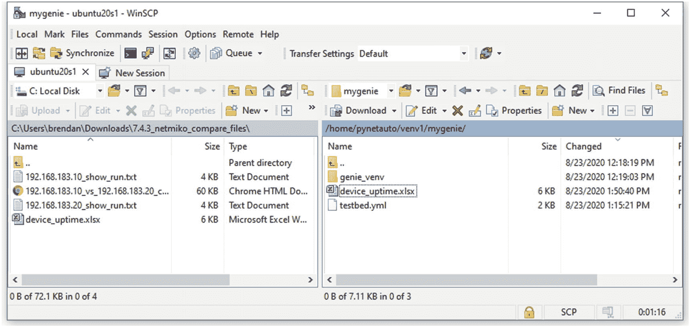图 16-3。WinSCP，从 ubuntu20s1 服务器检索 device_uptime.xlsx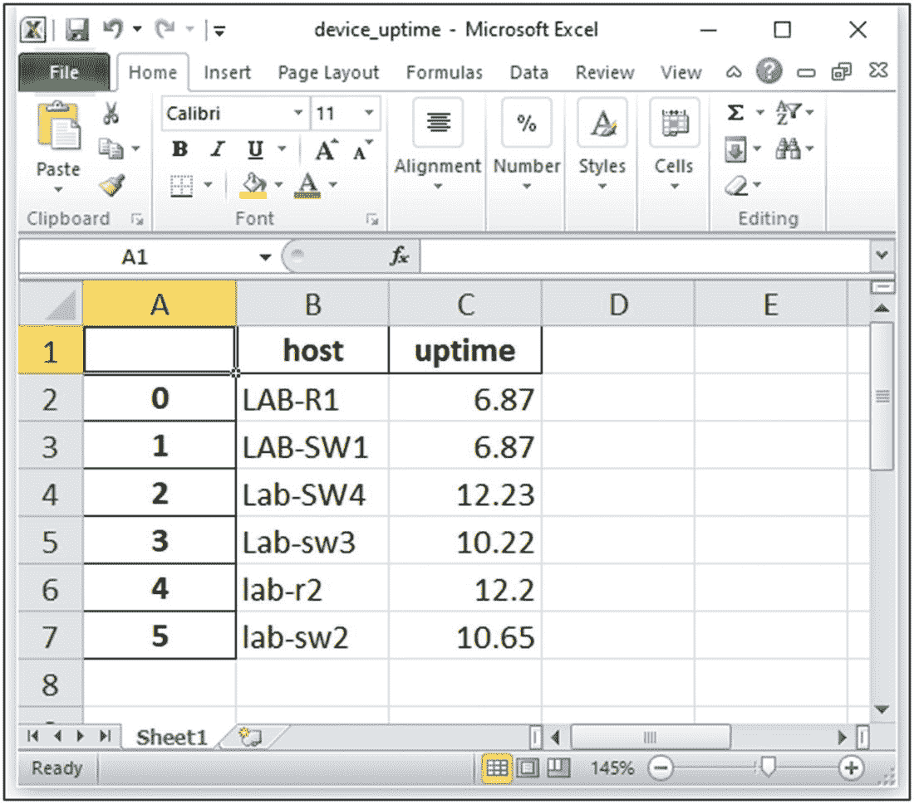图 16-4。主机，在 Excel 中打开 device_uptime.xlsx |
| **17** | 现在，在您的 Windows 主机 PC(或 Ubuntu 服务器的桌面)上，您可以编写一些简单的 Python 代码来转换步骤 15 中的字典，并将其转换为图形。您也可以使用`pandas`读取 Excel 文件，并将其转换成数据帧，以达到相同的结果。(这对于 Linux 命令行来说效果不好，因为它没有直接的图形支持。)在从 Windows 主机的命令提示符下编写脚本之前，使用下面显示的`pip3`命令安装`pandas`和`matplotlib`:`C:\Users\brendan>` `cd Desktop``C:\Users\brendan\Desktop>` `pip3 install pandas``C:\Users\brendan\Desktop>` `pip3 install matplotlib`编写以下代码，并将脚本保存在 Windows 桌面上。在你的 Windows 桌面上创建一个 Python 文件，另存为`device_uptime_graph.py`。`import matplotlib.pyplot as plt` `# import matplotlib library``import pandas as pd` `# import pandas library``device_uptime = {'LAB-R1': 6.87, 'LAB-SW1': 6.87, 'Lab-SW4': 12.23, 'Lab-sw3': 10.22, 'lab-r2': 12.2, 'lab-sw2': 10.65}``# Resulting dictionary from step 15``df = pd.DataFrame(list(device_uptime.items()),columns = ['host','uptime'])` `# Convert dictionary into pandas dataframe with column titles 'host' & 'uptime'``#print(df)``df.plot(kind='bar',x='host',y='uptime')` `# Plot a bar graph with host as x-axis and uptime(float) as y-axis``plt.show()` `# Display graph`现在，从 PowerShell 或 Windows 命令提示符运行该脚本，或者双击该脚本。如果一切正常，您的数据将显示为条形图，如下所示。或者，您可以将它们转换为不同类型的图形，并应用相同的方法将数据转换为数据帧，并根据需要创建图形。您可以从 Excel 中创建相同的图表，但是您现在知道了使用 Python 创建用于报告的图表的另一种方法。见图 16-5 。`C:\Users\brendan\Desktop>``python device_uptime_graph.py`图 16-5。设备正常运行时间示例的 matplotlib 图 |
| **18** | 在本实验结束时，确保使用`deactivate`命令并停止虚拟环境。`(genie_venv) pynetauto@ubuntu20s1:~/venv1/mygenie$` `deactivate``pynetauto@ubuntu20s1:~/venv1/mygenie$` |

已经向您介绍了思科自己的 pyATS，以帮助您实现网络自动化之旅。您已经使用 Python 的 re 模块收集设备的系统正常运行时间数据，然后使用`pandas`模块将数据转换成 pandas 数据帧。作为最后一步，您已经使用`matplotlib`库将数据转换成一个简单的条形图。将数据转换为图形的任务称为数据可视化。

如果您想从 Ubuntu Server 的桌面运行之前的实验，请先尝试安装 VMware Workstation 工具，以便在您的 Windows 主机 PC 和 Linux 虚拟机之间进行复制和粘贴。遵循以下 URL 中的说明，并使用“方法 2:从 VMware 主机安装”

URL: [`https://websiteforstudents.com/how-to-install-vmware-guest-tools-on-ubuntu-20-04-18-04/`](https://websiteforstudents.com/how-to-install-vmware-guest-tools-on-ubuntu-20-04-18-04/)

## 使用导入的 Docker 映像的 Sendmail Lab

Docker 是一个面向开发者和系统管理员的分布式应用开放平台，它的座右铭是“构建、发布、运行”这是一个可扩展的容器管理服务。它是另一种虚拟技术，可以帮助您成功地将 Linux 网络自动化服务器部署到生产环境中，并且只利用服务器资源的一小部分。Docker 于 2013 年 3 月首次推出，是一款基于平台即服务软件应用的容器。Docker 使用虚拟化技术为软件和工具提供隔离的容器。这些容器使用定义明确的通道在主机和 Docker 容器之间进行通信。它还提供了一个框架来隔离一个应用及其对称为*容器*的自包含单元的依赖。Docker 容器类似于虚拟机，但 Docker 是一个没有内核和操作系统的虚拟机，容器必须依赖托管服务器的内核进行操作。容器化已经成为 IT 界的流行语，因为公司可以用更少的服务器资源做更多的事情，特别是在敏捷和基于 DevOps 的项目中。换句话说，通过 Kubernetes 编排的 Docker 解决方案可以通过提高 IT 资源的利用率和降低每个节点的运营成本，为公司节省成百上千美元。

Docker 的著名口号是“开发，运输，在任何地方运行。”Docker 是一个开发人员的工具，可以帮助他们快速开发应用，并将其装入容器中，然后可以部署在网络中的任何地方。Docker 占用空间很小，因为它依赖于主机服务器的本地资源，并且它不是真正意义上的虚拟机，因为它没有自己的操作系统。Docker 容器映像只是快照映像的可运行实例或进程。您可以创建、启动、停止、移动或删除容器。尽管容器没有自己的操作系统，但它运行时有自己的文件系统、自己的网络和自己的独立于主机的进程树。对于不同部门的团队来说，比如开发、QA 和操作，使用容器在应用之间无缝地工作变得更加容易。您可以在任何地方部署 Docker 容器，在任何物理或虚拟机上，甚至在云上。

如果我们必须用不到 20 页的篇幅来介绍 Docker，那么最好用真实的图像来弄脏你的手。除了这本书之外，你可以按照自己的进度了解 Docker。在这里，为了加快您的进度，您将从 Docker Hub 下载一个预留的 Python 网络自动化 Docker 映像，并使用下载的映像来测试 Python 实验室，就像您一直在使用`ubuntu20s1`和`centos8s1`服务器一样。见图 16-6 。

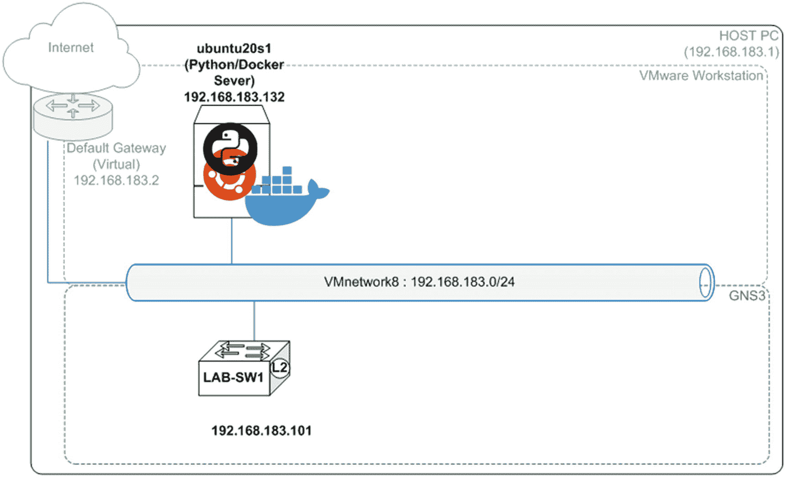

图 16-6。

Sendmail Docker 实验室，二手设备

### Docker 组件和帐户注册

Docker 就像一个专门构建的虚拟机，没有携带完整操作系统的负担，因为它依赖于主机的 Linux 内核来运行，占用空间很小。您可以在一个平台上运行许多 Docker 容器，而不会有系统资源争用的问题。让我们快速回顾一下 Docker 解决方案由哪些组件组成；我们不会涉及太多的细节，因为我们想把重点放在 Docker 的实用方面。

Docker 有以下组件:

*   Docker 有跨平台支持；它可以作为服务安装在 Linux、macOS 和 Windows 上。

*   Docker 引擎用于构建 Docker 映像和创建 Docker 容器。

*   Docker Hub 是用于托管各种 Docker 映像的注册表。

*   Docker Compose 用于定义使用多个 Docker 容器的应用。

需要注册 Docker 帐户才能在线使用 Docker 的全部功能。注册后，我们可以轻松访问数百个专门构建的 Docker 图像，并立即启动和运行我们的应用。要从 Docker Hub 登录并下载 Docker 映像，您需要一个 Docker Hub 帐户。为了让您为本次实验做好准备，请访问以下 URL 并注册您的 Docker Hub 帐户。这是重要的一步，因为您将需要您的帐户遵循这一部分。

URL: [`https://hub.docker.com/`](https://hub.docker.com/)

一旦你完成了注册，并有一些空闲时间阅读，请访问 Docker Hub 页面，熟悉 Docker 的工作方式。

URL: [`https://www.docker.com/get-started`](https://www.docker.com/get-started)

### 码头设备

对于本实验，所有任务都将从 Ubuntu 服务器执行。按照以下步骤在您的`ubuntu20s1`服务器上安装 Docker。幸运的是，Docker 在 Ubuntu 上的安装非常容易，不到 15 分钟你就可以启动并运行了。

<colgroup><col class="tcol1 align-left"> <col class="tcol2 align-left"></colgroup> 
| 

#

 | 

工作

 |
| --- | --- |
| **1** | 像往常一样，让我们从一个`apt update`命令开始，升级你的 Ubuntu 20 LTS 服务器。如果您有一段时间没有更新您的服务器软件包，这将需要几分钟的时间。`pynetauto@ubuntu20s1:~$` `sudo apt update``[sudo] password for pynetauto: ***********``pynetauto@ubuntu20s1:~$` `sudo apt upgrade -y` |
| **2** | 输入以下命令下载并安装 Docker 包:`pynetauto@ubuntus20s1:~$` `sudo apt install docker.io -y` |
| **3** | 要启用 Docker，输入`enable`命令，并使用`docker –version`命令检查安装的版本。`pynetauto@ubuntus20s1:~$` `sudo systemctl enable --now Docker``pynetauto@ubuntu20s1:~$` `sudo systemctl status docker``pynetauto@ubuntu20s1:~$` `sudo docker --version``Docker version 19.03.8, build afacb8b7f0` |
| **4** | 将您自己添加到 Docker 组来运行`sudo`命令。用您的用户 ID 替换`pynetauto`。运行最后一个命令以使更改生效。`pynetauto@ubuntus20s1:~$` `sudo usermod -aG docker pynetauto``pynetauto@ubuntu20s1:~$` `sudo gpasswd -a $USER docker``pynetauto@ubuntu20s1:~$ newgrp docker` |
| **5** | 通过运行`hello-world`命令来测试 Docker，这将打开一个容器来运行`hello-world`命令。`pynetauto@ubuntu20s1:~$` `docker run hello-world``Unable to find image 'hello-world:latest' locally``latest: Pulling from library/hello-world``0e03bdcc26d7: Pull complete``Digest: sha256:4cf9c47f86df71d48364001ede3a4fcd85ae80ce02ebad74156906caff5378bc``Status: Downloaded newer image for hello-world:latest``Hello from Docker!``This message shows that your installation appears to be working correctly.``[... omitted for brevity]``For more examples and ideas, visit:``https://docs.docker.com/get-started/` |
| **6** | 运行`docker ps –a`检查`hello-world`命令是否成功运行。此外，运行`docker images`命令来检查下载的 Docker 图像。`pynetauto@ubuntu20s1:~$` `docker ps -a``CONTAINER ID        IMAGE               COMMAND             CREATED             STATUS                     PORTS               NAMES``ef48902f0801        hello-world         "/hello"            2 minutes ago       Exited (0) 2 minutes ago                       modest_goldberg``pynetauto@ubuntu20s1:~$` `docker images``REPOSITORY          TAG                 IMAGE ID            CREATED        SIZE``hello-world         latest              bf756fb1ae65        8 months ago   13.3kB` |

### 试驾码头

为了节省时间，本书的读者已经使用 Dockerfile 方法创建了一个 Python 网络自动化 Docker 映像。您将要下载到您的 Ubuntu20s1 服务器的映像也是一个 Ubuntu 20.04 LTS 服务器，在 Docker 映像中预装了许多 IP 服务和网络自动化库。从 Docker 文件创建模板 Docker 图像涉及几个步骤，但我们不会在本书中详细讨论，因为这是另一个可能需要单独一章讨论的主题。请去 YouTube 定位观看 Docker 基础训练。在本实验中，您将下载预安装的 Python network automation Docker 映像，并从您的 Ubuntu 服务器上运行它。

<colgroup><col class="tcol1 align-left"> <col class="tcol2 align-left"></colgroup> 
| 

#

 | 

工作

 |
| --- | --- |
| **6** | 检查 Docker 镜像和安装在`pynetauto_ubuntu20` Docker 容器上的 Python 版本。大多数命令与 Linux 标准命令相同，应该像另一台 Linux 机器一样运行。但是，Docker 容器实例中没有基本服务或`systemctl`或任何 Linux 标准软件；换句话说，在 Docker 映像构建过程中，您必须精确地指定您想要安装的 Linux 软件。如果您想在现有 Docker 映像上安装更多软件，您可以进行修改。然而，Docker 基本图像修改主题超出了本书的范围。`root@2f81da41426b:/#` `cat /etc/*release``DISTRIB_ID=Ubuntu``DISTRIB_RELEASE=20.04``DISTRIB_CODENAME=focal``DISTRIB_DESCRIPTION="Ubuntu 20.04 LTS"``NAME="Ubuntu"``VERSION="20.04 LTS (Focal Fossa)"``ID=ubuntu``ID_LIKE=debian``PRETTY_NAME="Ubuntu 20.04 LTS"``VERSION_ID="20.04"``HOME_URL="https://www.ubuntu.com/"``SUPPORT_URL="https://help.ubuntu.com/"``BUG_REPORT_URL="https://bugs.launchpad.net/ubuntu/"``PRIVACY_POLICY_URL="https://www.ubuntu.com/legal/terms-and-policies/privacy-policy"``VERSION_CODENAME=focal``UBUNTU_CODENAME=focal``root@2f81da41426b:/#` `python3 --version``Python 3.8.2` |
| **7** | 在 Docker bash shell 上创建一个`testfile999.txt`文件。`root@2f81da41426b:/#` `touch home/testfile999.txt` |
| **8** | 分离并检查主机上新创建的文件。使用 Ctrl+P 和 Ctrl+Q 从 Docker 容器中分离。这将使您回到 Linux 主机操作系统。检查`/home/pynetauto/mnt`文件夹。您应该在 Linux 服务器的目录中找到`testfile999.txt`文件。`pynetauto@ubuntu20s1:~$` `pwd``/home/pynetauto``pynetauto@ubuntu20s1:~$` `ls /home/pynetauto/mnt``testfil999.txt` |
| **9** | 现在，从您的 Linux 主机，在共享目录下创建一个新文件。然后，重新附加到 Docker 实例，从 Docker 容器实例中检查文件。当您重新附加到正在运行的 Docker 实例时，您可以使用容器 ID 或名称。`pynetauto@ubuntu20s1:~$` `touch /home/pynetauto/mnt/testfile123.txt``pynetauto@ubuntu20s1:~$` `docker ps``CONTAINER ID   IMAGE                         COMMAND     CREATED       STATUS              PORTS                                NAMES``2f81da41426b   pynetauto/pynetauto_ubuntu20  "/bin/bash"  6 minutes ago  Up 6 minutes20-22/tcp, 25/tcp, 12020-12025/tcp   pynetauto_ubuntu20``pynetauto@ubuntu20s1:~$` `docker attach pynetauto_ubuntu20``root@2f81da41426b:/#` `ls``bin  boot  dev  etc  ftp  home  lib  lib32  lib64  libx32  media  mnt  opt  proc  pynetauto  root  run  sbin  srv  sys  tmp  usr  var``root@2f81da41426b:/#` `ls /home/``testfile999.txt  testfile123.txt` |
| **10** | 要停止并退出 Docker，请按 Ctrl+D 或键入`exit`。这将停止并退出当前登录的 Docker 容器。`root@2f81da41426b:/#` `exit``pynetauto@ubuntu20s1:~$` `docker ps -a``CONTAINER ID  IMAGE                         COMMAND   CREATED       STATUS                        PORTS               NAMES``2f81da41426b  pynetauto/pynetauto_ubuntu20 "/bin/bash"  9 minutes ago  Exited (130) 11 seconds ago                       pynetauto_ubuntu20``ef48902f0801   hello-world   "/hello"     42 minutes ago Exited (0)  42 minutes ago                         modest_goldberg` |
| **11** | 要重新启动一个停止的 Docker 实例，可以使用`docker start instance_name`命令。`pynetauto@ubuntu20s1:~$` `docker start pynetauto_ubuntu20``pynetauto_ubuntu20``pynetauto@ubuntu20s1:~$` `docker ps -a``CONTAINER ID  IMAGE                    COMMAND          CREATED       STATUS                      PORTS                                NAMES``2f81da41426b  pynetauto/pynetauto_ubuntu20  "/bin/bash"  11 minutes ago Up 4 seconds 20-22/tcp, 25/tcp, 12020-12025/tcp   pynetauto_ubuntu20``ef48902f0801  hello-world   "/hello"  44 minutes ago   Exited (0) 44 minutes agomodest_goldberg` |
| **12** | 要删除不运行的 Docker 实例并保持环境整洁，请运行`docker system prune`命令。`pynetauto@ubuntu20s1:~$` `docker system prune``WARNING! This will remove:``- all stopped containers``- all networks not used by at least one container``- all dangling images``- all dangling build cache``Are you sure you want to continue? [y/N]` `Y``Deleted Containers:``ef48902f0801b692e963c317873075d0152a3c09fd992f8b2f5e3f8d55b71f01``Total reclaimed space: 0B``pynetauto@ubuntu20s1:~$` `docker ps -a``CONTAINER ID        IMAGE       COMMAND                 CREATED        STATUS              PORTS                                NAMES``2f81da41426b  pynetauto/pynetauto_ubuntu20   "/bin/bash"  13 minutes ago  Up 2 minutes 20-22/tcp, 25/tcp, 12020-12025/tcp   pynetauto_ubuntu20` |
| **13** | 要删除 Docker 图像，请使用`docker rmi image_name:version`。`pynetauto@ubuntu20s1:~$` `docker images``REPOSITORY                     TAG         IMAGE ID          CREATED         SIZE``pynetauto/pynetauto_ubuntu20   latest      39ea52cc1e39      12 days ago     1.69GB``hello-world                    latest      bf756fb1ae65      8 months ago    13.3kB``pynetauto@ubuntu20s1:~$` `docker rmi hello-world:latest``Untagged: hello-world:latest``Untagged: hello-world@sha256:4cf9c47f86df71d48364001ede3a4fcd85ae80ce02ebad74156906caff5378bc``Deleted: sha256:bf756fb1ae65adf866bd8c456593cd24beb6a0a061dedf42b26a993176745f6b``Deleted: sha256:9c27e219663c25e0f28493790cc0b88bc973ba3b1686355f221c38a36978ac63``pynetauto@ubuntu20s1:~$` `docker images``REPOSITORY                     TAG        IMAGE ID            CREATED        SIZE``pynetauto/pynetauto_ubuntu20   latest     39ea52cc1e39        12 days ago    1.69GB` |

*   如需完整的 Docker 运行参考，请访问以下网站。

    URL: [`https://docs.docker.com/engine/reference/run/`](https://docs.docker.com/engine/reference/run/)

表 16-1。

前面命令的分解和解释

<colgroup><col class="tcol1 align-left"> <col class="tcol2 align-left"></colgroup> 
| 

**命令中断**

 | 

**解释**

 |
| --- | --- |
| `docker run -it --entrypoint=/bin/bash` | 使用`–i`和`–t`选项运行 Docker，其中入口点是 bash shell。`-i`表示交互模式，而`–t`表示分配一个`pseudo-tty`。 |
| `-v  /home/pynetauto/mnt/:/home` | `-v`与一个卷(共享文件系统)相关；在这种情况下，`unbuntu20s1`的`/home/pynetauto/mnt`目录链接到新 Docker 容器的`/home`目录。 |
| `--name pynetauto_ubuntu20` | `--name`选项允许您给容器的这个实例起一个更有意义的名字。如果不使用`–name`，那么 Docker 会自动分配一个随机名称。 |
| `pynetauto/pynetauto_ubuntu20` | 这是本地映像池中的实际 Docker 映像名称。 |

<colgroup><col class="tcol1 align-left"> <col class="tcol2 align-left"></colgroup> 
| 

#

 | 

工作

 |
| --- | --- |
| **1** | 创建 Docker Hub ID 后，请访问以下 Docker Hub 网站查看您将下载的图像。URL: [`https://hub.docker.com/u/pynetauto`](https://hub.docker.com/u/pynetauto) |
| **2** | 在 Linux 命令行中，使用`docker login`登录 Docker Hub。用您的用户名替换用户名，并输入您的密码登录。您需要在底部得到一个“登录成功”的消息。当您创建帐户并登录 Docker Hub 时，您可以将 Docker 映像推送到 Docker Hub，将映像保存为模板，并与社区中的其他人共享。`pynetauto@ubuntu20s1:~$` `docker login`使用您的 Docker ID 登录，从 Docker Hub 推送和提取图像。如果你没有 Docker ID，请访问 https:// hub。码头工人。com 来创建一个。`Username:` `pynetauto``Password: ***********``WARNING! Your password will be stored unencrypted in /home/pynetauto/.docker/config.json.``Configure a csredential helper to remove this warning. See``https://docs.docker.com/engine/reference/commandline/login/#credentials-store``Login Succeeded` |
| **3** | 使用下面的`docker pull`命令将该映像下载到虚拟机的 Docker 映像库。建议您通过家庭网络连接到互联网，而不是 4G 或 5G 网络，因为这将耗尽您的移动数据。`pynetauto@ubuntu20s1:~$` `docker pull pynetauto/pynetauto_ubuntu20:latest``latest: Pulling from pynetauto/pynetauto_ubuntu20``d51af753c3d3: Pull complete``[... omitted for brevity]``f92a9a96eae3: Pull complete``Digest: sha256:86f2178825cf09a1b7f7c370a460b34b109f62ce4471d944ef108d0a29162ed4``Status: Downloaded newer image for pynetauto/pynetauto_ubuntu20:latest``docker.io/pynetauto/pynetauto_ubuntu20:latest` |
| **4** | 使用`docker images`命令，检查具有正确细节的新图像，如下所示:`pynetauto@ubuntu20s1:~$` `docker images``REPOSITORY                     TAG     IMAGE ID         CREATED             SIZE``pynetauto/pynetauto_ubuntu20   latest  39ea52cc1e39     12 days ago         1.69GB``hello-world                    latest  bf756fb1ae65     8 months ago        13.3kB` |
| **5** | 要使用容器的本地服务器目录挂载点在 bash shell 中启动 Docker 容器实例，请使用这里显示的命令。命令解释参见表 16-1 。`pynetauto@ubuntu20s1:~$` `docker run -it --entrypoint=/bin/bash -v  /home/pynetauto/mnt/:/home --name pynetauto_ubuntu20 pynetauto/pynetauto_ubuntu20``root@2f81da41426b:/#` |

### Sendmail Python Lab 停靠器

现在我们已经熟悉了 Docker，让我们快速了解如何从 Docker 中获益并运行我们的 Python 脚本。在本实验中，您将使用您的`pynetauto/pynetauto_ubuntu20:latest` Docker 容器上预装的 Sendmail，并从您的 Python 脚本发送一封测试电子邮件。然后，将指导您编写一个 Python 脚本来监控拓扑中某个设备的 CPU 利用率。当利用率超过黄色水印时，您的 Python 脚本将向您的电子邮件收件箱触发电子邮件警报。首先，让我们在您的 Docker 映像上设置 Sendmail。为了让 Sendmail 在 Docker 容器上工作，需要预先安装和配置 Sendmail，并且必须为 SMTP 打开端口 25。此外，要接收测试电子邮件，您的电子邮件帐户的安全性必须降低。在本例中，Gmail 帐户用于演示目的，您可以对您的测试 Gmail 帐户进行同样的操作。

<colgroup><col class="tcol1 align-left"> <col class="tcol2 align-left"></colgroup> 
| 

#

 | 

工作

 |
| --- | --- |
| **1** | 如果您遵循了前面步骤中的 Docker 安装过程，那么您应该拥有名为`pynetauto_ubuntu20`的 Docker 映像。`pynetauto@ubuntu20s1:~$` `docker images``REPOSITORY                     TAG      IMAGE ID         CREATED             SIZE``pynetauto/pynetauto_ubuntu20   latest   39ea52cc1e39     2 weeks ago         1.69GB` |
| **2** | 现在，让我们通过重新运行以下命令来启动一个新的 Docker 实例。如果您已经有一个现有的实例，那么您可以启动该实例并将其附加到 Docker 实例。在本例中，我们将启动一个新实例。如果您的 Docker 实例启动了，您将登录到新 Docker 实例的 bash shell 中，并且应该准备好了。`pynetauto@ubuntu20s1:~$` `docker run -it --entrypoint=/bin/bash -v  /home/pynetauto/mnt/:/home --name pynetauto_ubuntu20sendmail pynetauto/pynetauto_ubuntu20``root@062fc2a30243:/#` |
| **3** | 首先，让我们检查端口 25 是否处于监听模式。使用`netstat –tuna`命令检查打开的端口。没有返回任何结果，所以看起来您必须配置 Sendmail 并在这个 Docker 实例或机器上允许端口 25。另外，通过快速运行`apt install Sendmail`来检查 Sendmail 的安装状态；应该已经安装了。`root@062fc2a30243:/#` `netstat -tuna``Active Internet connections (servers and established)``Proto Recv-Q Send-Q Local Address           Foreign Address         State``root@062fc2a30243:/#` `apt install sendmail``Reading package lists... Done``Building dependency tree``Reading state information... Done``sendmail is already the newest version (8.15.2-18).``0 upgraded, 0 newly installed, 0 to remove and 2 not upgraded.` |
| **4** | 现在让我们在 Docker 容器实例上快速配置 Sendmail。运行`sendmailconfig`命令。当提示输入 Y 时，按 Y，然后按三次回车键。在第二个 Y 之后，文件更新可能需要一点时间，所以请耐心完成并重新加载 Sendmail 服务。`root@062fc2a30243:/#` `sendmailconfig``Configure sendmail with the existing /etc/mail/sendmail.conf? [Y] Y``Reading configuration from /etc/mail/sendmail.conf.``Validating configuration.``Writing configuration to /etc/mail/sendmail.conf.``Writing /etc/cron.d/sendmail.``Configure sendmail with the existing /etc/mail/sendmail.mc? [Y] Y <<< may take a few minutes``Updating sendmail environment ...``Reading configuration from /etc/mail/sendmail.conf.``[... omitted for brevity]``Updating /etc/mail/aliases...``WARNING: local host name (062fc2a30243) is not qualified; see cf/README: WHO AM I?``/etc/mail/aliases: 0 aliases, longest 0 bytes, 0 bytes total``Reload the running sendmail now with the new configuration? [Y] Y``Reloading sendmail ...` |
| **5** | 使用以下命令检查是否已经在 Docker 上成功创建了与 Sendmail 相关的目录:`root@062fc2a30243:/#``ls /usr/sbin/send``/usr/sbin/sendmail  /usr/sbin/sendmail-msp  /usr/sbin/sendmail-mta  /usr/sbin/sendmailconfig` |
| **6** | 再次运行`netstat –tuna`命令，确认端口 25 处于监听模式。`root@062fc2a30243:/#` `netstat -tuna``Active Internet connections (servers and established)``Proto Recv-Q Send-Q Local Address           Foreign Address         State``tcp        0      0 127.0.0.1:587           0.0.0.0:*               LISTEN``tcp        0      0 127.0.0.1:25            0.0.0.0:*               LISTEN` |
| **7** | 从您的 Windows 主机连接到互联网。接下来，进入你的测试 Gmail 账户，作为邮箱用户打开“不太安全的应用”设置。默认情况下它应该是关闭的，你必须打开它来允许电子邮件通过。尝试为此类测试创建一个测试帐户；请勿使用您的私人 Gmail 帐户进行测试。见图 16-7 。1.转到 Google 帐户安全部分。2.在左侧导航面板中，单击安全性。3\. At the bottom of the page, in the “Less secure app access” panel, click “Turn on” access.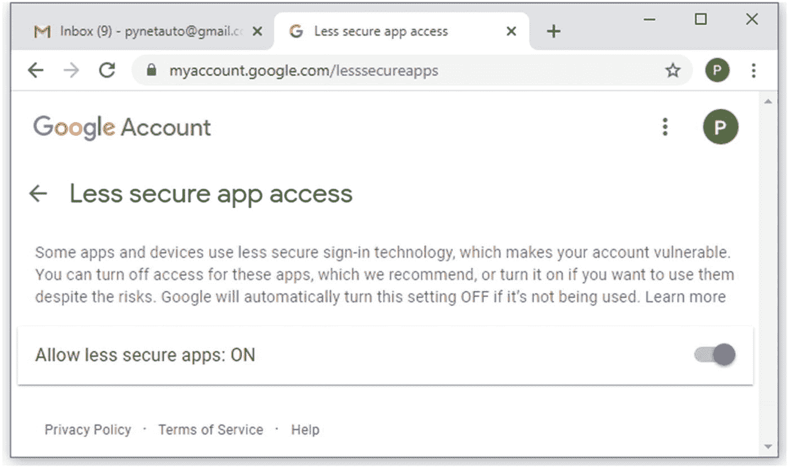图 16-7。Gmail，将不太安全的应用访问切换到打开 After you have turned on this feature, your security setting should look like Figure 16-8.图 16-8。Gmail，允许安全性较低的应用访问 |
| **8** | 回到您的 Docker 实例；您将使用两种不同的电子邮件发送方法，使用简单的 Python 脚本，向自己发送两封测试电子邮件。首先，创建一个 Python 文件并复制以下脚本的内容，该脚本使用了`email.mime.text`和 Linux 子进程。`root@062fc2a30243:/#` `nano sendmail_test01.py``GNU nano 4.8` `sendmail_test01.py``from email.mime.text import MIMEText``from subprocess import Popen, PIPE``msg = MIMEText("Python & sendmail email test 01.")``msg["From"] = "brendanchoi@italchemy.com" # Update to your test email address``msg["To"] = "pynetauto@gmail.com" # Update to your test email address``msg["Subject"] = "Python & sendmail email test 01"``p = Popen(["/usr/sbin/sendmail", "-t", "-oi"], stdin=PIPE, universal_newlines=True)``p.communicate(msg.as_string())``print("Email sent!")``^G Get Help  ^O Write Out    ^W Where Is  ^K Cut Text    ^J Justify   ^C Cur Pos``^X Exit      ^R Read File    ^\ Replace   ^U Paste Text  ^T To Spell  ^_ Go To Line`将测试电子邮件地址更新为您的电子邮件地址。 |
| **9** | 完成脚本后，从 Docker 实例运行它。发送电子邮件会有一点延迟。大约需要两到五分钟的时间来发送电子邮件。`root@062fc2a30243:/#` `cat sendmail_test01.py` |
| **10** | 另一种发送邮件的方法是使用 Python 的标准`smtplib`。让我们创建第二个脚本并发送另一封测试邮件，这次使用`smtplib`。`root@062fc2a30243:/#` `nano sendmail_test02.py``GNU nano 4.8` `sendmail_test02.py``import smtplib``sender = 'no_reply@italchemy.com'``receivers = ['pynetauto@gmail.com']``message = """``From: No Reply <no_reply@italchemy.com>``To: Python Network Automation <pynetauto@gmail.com>``Subject: Sendmail SMTP Email test 01``This is a Sendmail SMTP Email test 01``"""``try:``smtpObj = smtplib.SMTP('localhost')``smtpObj.sendmail(sender, receivers, message)``print("Successfully sent email")``except SMTPException:``print("Error: unable to send email")``^G Get Help  ^O Write Out   ^W Where Is   ^K Cut Text    ^J Justify   ^C Cur Pos``^X Exit      ^R Read File   ^\ Replace    ^U Paste Text  ^T To Spell  ^_ Go To Line` |
| **11** | 使用以下命令发送第二封测试电子邮件:`root@062fc2a30243:/#` `python3 sendmail_test02.py``Successfully sent email` |
| **12** | Wait for a couple of minutes and check your email’s Spam folder. If both scripts worked correctly, you should receive your first and second test emails in your Gmail Spam folder. See Figure 16-9.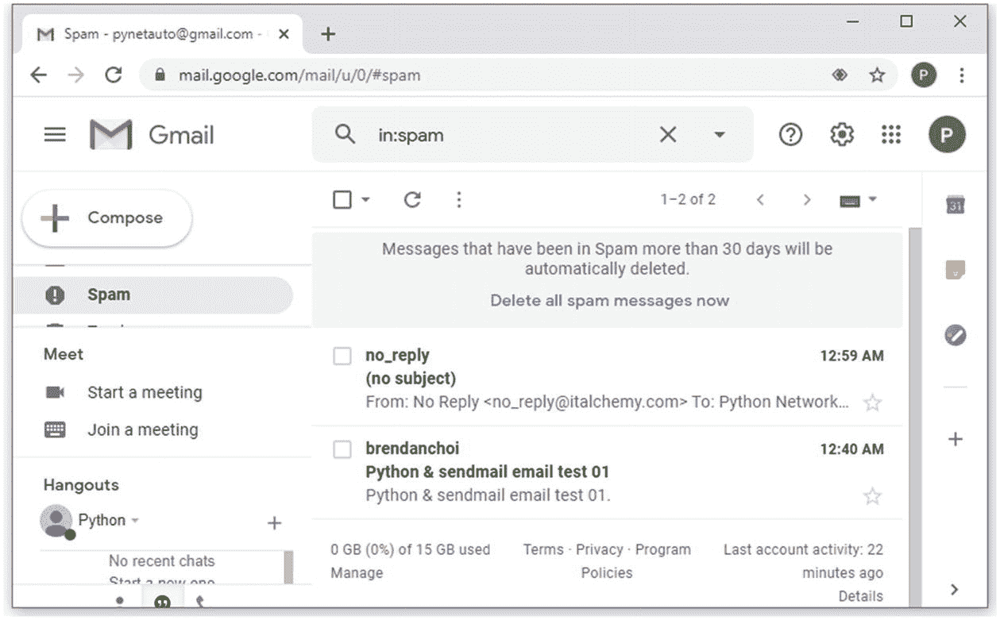图 16-9。Python Sendmail 测试电子邮件，检查垃圾邮件文件夹 |

### 实验:Sendmail 电子邮件通知脚本开发

在本实验中，让我们创建一个简单的 Python 监控脚本，该脚本监控一个套接字`LAN-SW1`(为了方便起见，在端口 22 上)并在交换机在网络上变得不可达时触发电子邮件通知。在现实世界中，此类电子邮件通知将被定向到 24/7 服务台团队或 SNMP 服务器，这些操作将触发 IT 企业票证系统(如 ITSM、ServiceNow 和 Remedy)上的自动案例记录。建立实验室的美妙之处在于，你可以自由地测试任何你想研究的东西，验证各种概念。本书所展示的只是使用 Python 和其他基于 Python 的自动化工具在网络中实现自动化的冰山一角。作为个体，每个人都来自不同的背景。我们有不同的背景和教养，所以我们的想法和行为不同，这就是在编写代码时需要你的创造力的地方。你在某些方面会比你旁边的人更有创造力，而她在其他方面也会更有创造力。当你编码时，没有正确或错误的答案，只有建议。打开你的思维，让你的想象力保持开放；想想你想在工作或学习中用 Python 实现什么。我们知道有更好的工具可用，它们是专门为 SNMP 监控、电子邮件通知工具和案例记录工具而设计的。尽管如此，通过编写代码来模拟这种工具，我们将更深入地了解这种工具如何在 IT 生态系统中工作。

本实验中的所有任务都将在 Docker 环境中完成，因此您也可以在工作中接触到 Docker 的强大功能。借用前面的实验，让我们创建一个套接字监视工具，每三秒检查一次套接字的可用性。如果套接字连续十次不可用，它将离线 30 秒，脚本将使用 Sendmail 向您的测试电子邮件收件箱发送电子邮件通知。脚本将持续监控套接字，直到您停止应用。假设您有一台需要监控的带链路挡板的设备，要求您每隔几分钟监控一次链路。你不希望整天坐在电脑前，盯着控制台信息。您将创建一个简单的脚本，将日志保存到一个文件中，并让您的脚本通知需要通知的适当人员，在本例中是通过电子邮件。让我们看看如何轻松实现这一点。

<colgroup><col class="tcol1 align-left"> <col class="tcol2 align-left"></colgroup> 
| 

#

 | 

工作

 |
| --- | --- |
| **1** | 您将继续使用上一节中的 Docker 实例。如果您已经停止 Docker 实例或从 Docker 实例分离，请将其重新附加到 Docker 实例。以下示例显示了启动并重新附加到 Docker 实例的示例:`pynetauto@ubuntu20s1:~$``docker ps –a``CONTAINER ID        IMAGE                          COMMAND             CREATED             STATUS                      PORTS               NAMES``062fc2a30243        pynetauto/pynetauto_ubuntu20   "/bin/bash"         45 hours ago        Exited (130) 43 hours ago                       pynetauto_ubuntu20sendmail``pynetauto@ubuntu20s1:~$``docker start pynetauto_ubuntu20sendmail``pynetauto_ubuntu20sendmail``pynetauto@ubuntu20s1:~$``docker ps``CONTAINER ID        IMAGE                          COMMAND             CREATED             STATUS              PORTS                                NAMES``062fc2a30243        pynetauto/pynetauto_ubuntu20   "/bin/bash"         45 hours ago        Up 5 seconds        20-22/tcp, 25/tcp, 12020-12025/tcp   pynetauto_ubuntu20sendmail``pynetauto@ubuntu20s1:~$``docker attach pynetauto_ubuntu20sendmail``root@062fc2a30243:/#` |
| **2** | 转到映射到主机的`/home`目录，创建一个新目录；为了简单起见，这个目录被命名为`monitoring`。将工作目录更改为新目录。`root@062fc2a30243:/#` `ls /home``testfil999.txt  testfile123.txt``root@062fc2a30243:/#` `cd /home``root@062fc2a30243:/home#` `mkdir monitoring``root@062fc2a30243:/home#` `cd monitoring``root@062fc2a30243:/home/monitoring#` |
| **3** | 现在，创建两个空 Python 文件，一个用于脚本，另一个用于电子邮件。`root@062fc2a30243:/home/monitoring#` `touch monitor_sw1.py send_email.py``root@062fc2a30243:/home/monitoring#` `ls``monitor_sw1.py send_email.py` |
| **4** | 下面的脚本是一个套接字检查脚本，我经常用它来检查 SSH 端口，端口 22。如果您的设备上打开了另一个端口，如端口 23 (Telnet)、69 (TFTP)或 80 (HTTP)，它们也可以在本例中替换，但您已经知道端口 22 是拓扑中所有 Cisco 设备上的开放端口；因此，这个脚本将检查端口 22。使用这个基本的端口检查脚本和我们从前面的练习中学到的知识，您将重写代码并应用它来解决我们的问题。`GNU nano 4.8` `check_port_22.py``import socket``ip = '192.168.183.101'``def check_port_22():` `# Define a function``for port in range (22, 23):` `# port 22``dest = (ip, port)` `# new tuple variable``try` `: # using try & except, we can avoid check process being stuck in a loop``with socket.socket(socket.AF_INET, socket.SOCK_STREAM) as s:``s.settimeout(3)``connection = s.connect(dest)` `# Connect to socket``print(f"On {ip}, port {port} is open!")` `# Informational``print("OK - This device is on the network.")` `# Informational``except:``print(f"On {ip}, port {port} is closed. Exiting!")` `# Informational``print("! FAILED - to reach the device. Check the connectivity to this device")` `# Informational``exit()` `# Exit application``check_port_22()` `# Run the function``^G Get Help  ^O Write Out   ^W Where Is   ^K Cut Text    ^J Justify   ^C Cur Pos``^X Exit      ^R Read File   ^\ Replace    ^U Paste Text  ^T To Spell  ^_ Go To Line` |
| **5** | 现在在 nano 文本编辑器中打开`monitor_sw1.py`，开始输入以下脚本。是的，您可以下载该脚本，剪切和粘贴代码会节省时间。但是，在现实世界中，这绝不是剪切和粘贴那么简单。大多数时候，你必须输入所有的代码，除非你的公司花钱请人编写一个完整的、可以工作的应用。所以，试着按照脚本写每一行代码。`root@062fc2a30243:/home/monitoring#` `nano monitor_sw1.py``GNU nano 4.8` `monitor_sw1.py``import socket``import time``from datetime import datetime``# Custom module``from send_email import send_email` `# import send_email module from email_send.py``starttime = time.time()``# Variables``ip = "192.168.183.101"``port = 22``dest = (ip, port)``def check_sw1():` `# Define check_sw1 function``counter = 0` `# Set counter's original value to 0``while (counter < 10):` `# Run the script until counter 10 is reached``f = open('./monitoring_logs.txt', 'a')` `# Open monitoring logs file for record in appending mode``try:` `# This is basically the same code as check_port_22.py``with socket.socket(socket.AF_INET, socket.SOCK_STREAM) as s:``s.settimeout(3)``connection = s.connect(dest)``counter = 0` `# Reset the counter to 0 on successful check``counter1 = str(counter)` `# convert counter to string``f.write(datetime.now().strftime('%Y-%m-%d %H:%M:%S'))` `# Write time to file``print(f" {counter1} port {port} is open")` `# Informations for console user``f.write(f" {counter1} port {port} is open\n")` `# Write to log file for task completion``f.close()` `# close file``time.sleep(3)` `# Wait for 3 seconds before another check``except:` `# If port 22 is closed``counter += 1` `# Adds 1 to counter every loop``counter2 = str(counter)` `# convert counter to string``f.write(datetime.now().strftime('%Y-%m-%d %H:%M:%S'))` `# Write time to file``print(f" {counter2} port {port} is closed")` `# Informations for console user``f.write(f" {counter2} port {port} is closed\n")` `# Write to log file for task completion``time.sleep(3)` `# Wait for 3 seconds before another check``if counter == 10:` `# Check if counter is 10``counter=0` `# Only resets the counter to 0 on 10th time``print(“send failed email here”)` `# Informations for console user``send_email()` `# Send an email notification, calling send_email() from send_email.py script``f.close()` `# close file``check_sw1()` `# Run check_sw1 function``^G Get Help  ^O Write Out   ^W Where Is   ^K Cut Text    ^J Justify   ^C Cur Pos``^X Exit      ^R Read File   ^\ Replace    ^U Paste Text  ^T To Spell  ^_ Go To Line` |
| **6** | 现在让我们编写一个`smtplib` Python 文件，以便前面的主脚本可以导入它并发送电子邮件。这是脚本的电子邮件部分。通过将脚本分解成多个功能部分，您可以保持代码整洁。`root@062fc2a30243:/home/monitoring#` `nano send_email.py``GNU nano 4.8` `send_email.py``import smtplib``sender = 'no_reply@italchemy.com'` `# A variable, sender``receivers = ['pynetauto@gmail.com']` `# A variable, receivers. Add more emails using comma separator``# This is the main message which will be sent to the email recipient(s). Anything between the triple quotes``message = """``From: No Reply <no_reply@italchemy.com>``To: Python Network Automation <pynetauto@gmail.com>``Subject: SW1 not reachable for more than 30 seconds``SW1 is not reachable. Please investigate.``"""``def send_email():` `# Define send_email function``try:``smtpObj = smtplib.SMTP('localhost')` `# Define smtpObj``smtpObj.sendmail(sender, receivers, message)` `# Send an email using smtpObj and variables``print("Successfully sent email")` `# Informational``except SMTPException:` `# SMTP Exception``print("Error: unable to send email")` `# Informational``^G Get Help  ^O Write Out   ^W Where Is   ^K Cut Text    ^J Justify   ^C Cur Pos``^X Exit      ^R Read File   ^\ Replace    ^U Paste Text  ^T To Spell  ^_ Go To Line` |
| **7** | 一旦创建了主脚本和辅助脚本，就可以使用下面的命令在 Docker 环境中运行代码。一旦在屏幕上看到消息，就可以让脚本继续运行。`root@062fc2a30243:/home/monitoring#` `python3 monitor_sw1.py`登录`LAN-SW1` (192.168.183.101)并关闭端口 Gi0/0，等待大约 30 秒，发送`no shut`命令。然后再等 30 秒；这将模拟 link flap 场景，并将触发脚本更改其状态。`LAB-SW1(config)#` `interface Gi0/0``LAB-SW1(config-if)#``shut``LAB-SW1(config-if)#``no shut`如果您让端口关闭(不可达)超过 30 秒，那么脚本将触发一封电子邮件，您将在收件箱中收到一封电子邮件。在您调出界面之前，脚本应该每 30 秒发送一次通知电子邮件并继续运行。`root@062fc2a30243:/home/monitoring#` `python3 monitor_sw1.py``...``0 port 22 is open``0 port 22 is open``0 port 22 is open``1 port 22 is closed``2 port 22 is closed``3 port 22 is closed``4 port 22 is closed``5 port 22 is closed``6 port 22 is closed``7 port 22 is closed``8 port 22 is closed``9 port 22 is closed``10 port 22 is closed``send failed email here``Successfully sent email``...` |
| **8** | Check the Spam folder of your email account. If you keep the interface shut down for three minutes, you should receive six email notifications, as shown in Figure 16-10.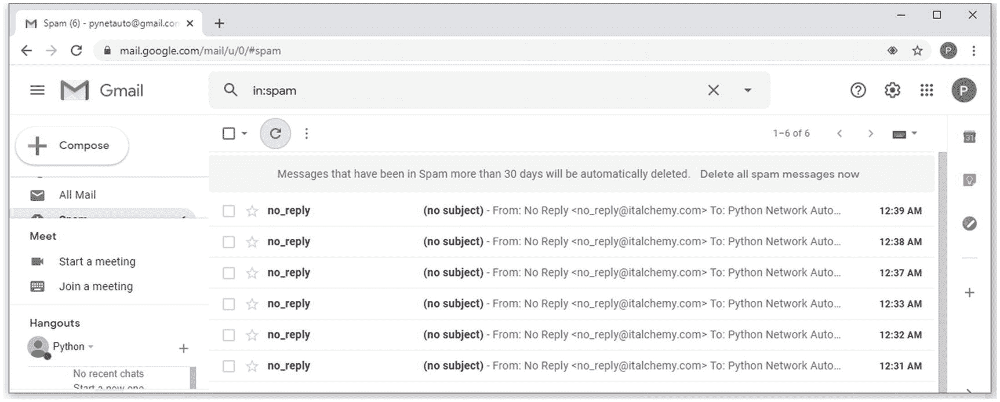图 16-10。检查垃圾邮件文件夹中收到的测试电子邮件测试电子邮件的以下内容将与此类似:**From:没有回复<??【no_reply@italchemy.com】??****到:Python 网络自动化<pynetauto@gmail.com********主题:超过 30 秒无法联系到 SW1****SW1 不可达。请调查。** |
| **9** | 按 Ctrl+P，然后按 Ctrl+Q 键从 Docker 实例中分离。这将使脚本持续运行。要停止脚本和 Docker 实例，请按 Ctrl+Z。您也可以使用`docker stop <container>`正常关闭容器实例。 |

假设现在是星期五下午 5 点，你的老板让你监控一台连接不可靠的设备(路由器、交换机或防火墙)。如果设备失去连接，立即通知所有利益相关方。Docker 实例上运行的脚本可以为您检查与网络的通信，当事件发生时，它会向您发送电子邮件通知。你可以随时从智能手机上查看邮件，甚至是在回家的路上或晚饭后。下午 5 点，当您离开办公室时，使用`cron`安排运行脚本，让您的 Python 应用为您工作。

## CPU 利用率监控实验:使用 Twilio 发送短信

在本实验中，您将快速开发一个 REST API 短信工具；然后，您将编写 Python 代码来监控路由器的 CPU 利用率。当达到某个阈值时，该脚本将使用 REST API 调用向您的智能手机触发一条 SMS 消息。随着较新的网络设备平台和大多数虚拟和云网络平台开始支持 REST API，理解 REST API 并将理论应用于实际用例将是网络自动化中的必备技能之一。这本书不会讨论如何开始 REST API 研究，也不会试图广泛地涵盖这个主题；这是一个简单的例子，可以让你体会一下。不过你可以从 YouTube 或者 LinkedIn 视频教程开始学习 REST API 大多数教程都会让你安装一个 REST 客户端，比如 POSTMAN 或者 REST for Visual Studio。如果您有时间，建议您在完成本实验之前访问以下网站并做一些初步阅读。参见图 16-11 。

网址: [`https://www.postman.com/`](https://www.postman.com/) (邮差休息客户端)

网址: [`https://marketplace.visualstudio.com/items?itemName=humao.rest-client`](https://marketplace.visualstudio.com/items%253FitemName%253Dhumao.rest-client) (微软 Visual Studio 的 REST 客户端)

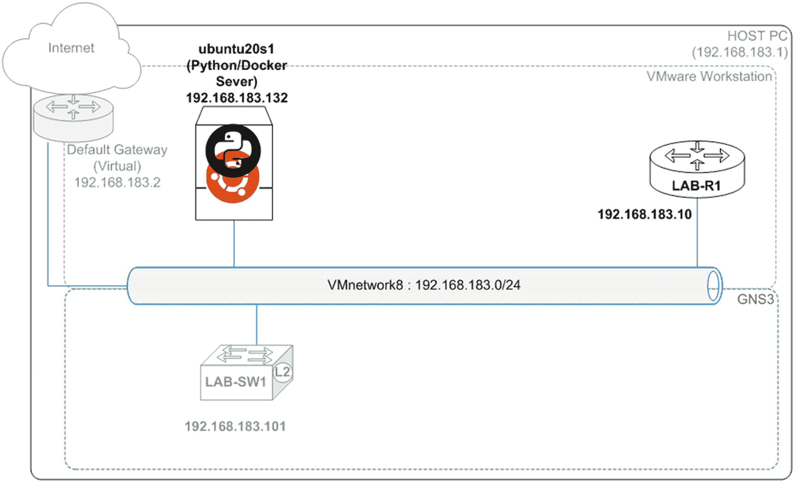

图 16-11。

CPU 利用率监控实验室，使用的设备

### 创建 TWILIO 帐户，安装 Twilio Python 模块和 SMS 消息设置

在本节中，您将设置一个 Twilio 测试帐户来免费发送短信。根据维基百科的说法，Twilio 是一家作为服务公司的云通信平台，允许软件开发人员通过编程方式拨打和接听电话，发送和接收短信，以及使用 Twilio 的 web 服务 API 执行其他通信功能。在我们的使用中，我们需要在系统监控拓扑中的网络设备时，在满足特定条件时发送 SMS 通知消息。首先，创建一个帐户来接收美国测试号、帐户 SID 和授权码；然后在 Python 上安装 Twilio 模块，并编写一条简单的 SMS 消息发送到您的智能手机号码。此后，您将编写一个 CPU 利用率监控脚本，模拟安全攻击下的高 CPU 利用率场景，并触发一个 SMS 通知。首先，让我们快速设置帐户，并向您的智能手机号码发送第一条测试消息。

<colgroup><col class="tcol1 align-left"> <col class="tcol2 align-left"></colgroup> 
| 

#

 | 

工作

 |
| --- | --- |
| **1** | 去 Twilio 创建一个试用账户。参见图 16-12 。URL: [`https://www.twilio.com/try-twilio`](https://www.twilio.com/try-twilio)图 16-12。Twilio 帐户注册 |
| **2** | 注册后，您必须登录您的电子邮件帐户，并确认您的电子邮件。Enter your smartphone number, and once the verification code is sent to your smartphone, enter the code into the Twilio code verification site. Follow the prompts to complete the account registration. See Figure 16-13.图 16-13。Twilio 项目仪表板 |
| **3** | A trial number will be offered from an available number range. Choose the first number. See Figure 16-14.图 16-14。Twilio 美国试用电话号码 |
| **4** | You will get the free trial balance and account SID and authorization token along with your new phone number. An account SID and authorization token will be used in the code to send an SMS message. See Figure 16-15.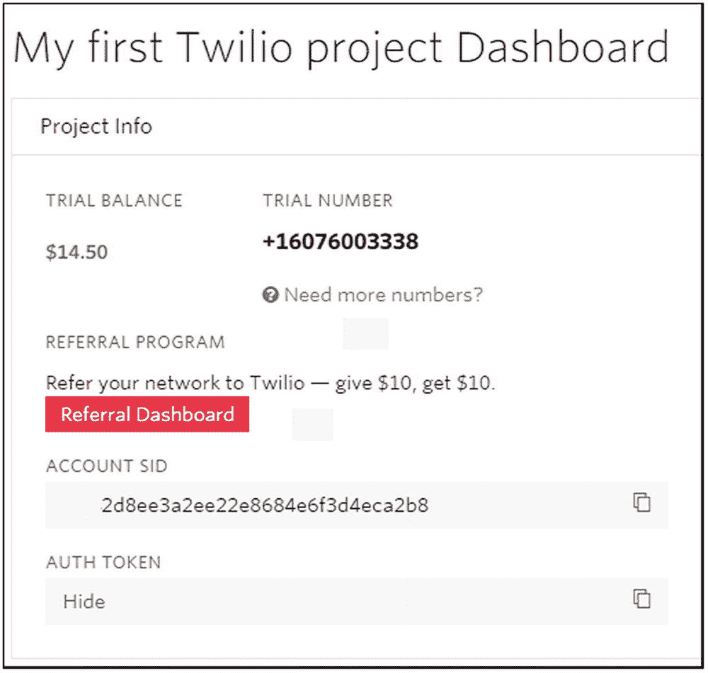图 16-15。带有试用编号的项目仪表板 |
| **5** | 要了解更多关于如何开始使用 Twilio 的信息，请访问以下网站并阅读官方文档。URL: [`https://www.twilio.com/docs/sms/quickstart/python`](https://www.twilio.com/docs/sms/quickstart/python) |
| **6** | 在本实验中，我们将在 Docker 实例中隔离该实例，使其不会直接影响您的实验设置。使用 Docker，您可以根据需要删除实例并重新创建任意数量的实例。让我们继续创建另一个 Docker 实例来运行 Twilio 实验室。`pynetauto@ubuntu20s1:~$` |
| **7** | 为了准备 Twilio SMS 消息，使用`pip3`命令在 Docker 实例上安装 Twilio。因为您是在 Docker 环境中测试的，所以您不必担心破坏真正的 Linux 主机的软件兼容性问题。`pynetauto@ubuntu20s1:~/monitor_cpu$` `pip3 install Twilio``[...omitted for brevity]``Successfully installed twilio-6.45.3`如果您得到一个`bash: snmpwalk: command not found`错误消息，请在您的 Linux 服务器上安装`snmp`。`pynetauto@ubuntu20s1:~$` `apt-get install snmp –y` |
| **8** | 您将创建两个文件来从 Python 脚本发送测试 SMS 消息。创建一个名为`credentials.py`的凭证馈送器脚本，然后创建一个 SMS 脚本来发送名为`twilio_sms.py`的 SMS。请用您的凭据和号码更新和替换凭据和号码。`pynetauto@ubuntu20s1:~$` `mkdir monitor_cpu``pynetauto@ubuntu20s1:~$` `cd monitor_cpu``pynetauto@ubuntu20s1:~/monitor_cpu$` `nano credentials.py``GNU nano 4.8` `/home/pynetauto/monitor_cpu/credentials.py``account_sid = " AC42d8ee3a2ee22e8684e6f3d4eca2b8c7"``auth_token = "5233e8502a3dd3a2d006913c937a6f26"``my_smartphone = "+61498765432"``twilio_trial = "+16076003338"``^G Get Help  ^O Write Out  ^W Where Is   ^K Cut Text    ^J Justify  ^C Cur Pos``^X Exit      ^R Read File  ^\ Replace    ^U Paste Text  ^T To Spell ^_ Go To Line`这是将向您的智能手机发送`my_message`的短信脚本。`pynetauto@ubuntu20s1:~/monitor_cpu$` `nano twilio_sms.py``GNU nano 4.8                              /` `home/pynetauto/monitor_cpu/twilio_sms.py``from twilio.rest import Client``from credentials import account_sid, auth_token, my_smartphone, twilio_trial``client = Client(account_sid, auth_token)``my_message = f"High CPU utilization notice, LAB-R1 has reached 99% CPU utilization."``message = client.messages.create(body=my_message, from_=twilio_trial, to=my_smartphone)``print(message.sid)``^G Get Help  ^O Write Out   ^W Where Is   ^K Cut Text    ^J Justify  ^C Cur Pos``^X Exit      ^R Read File   ^\ Replace    ^U Paste Text  ^T To Spell  ^_ Go To Line` |
| **9** | 从 Docker 容器命令行，运行`python3`命令来运行 SMS 脚本以发送您的第一条 Twilio SMS。如果一切都设置正确，它将发送短信到您的智能手机。`pynetauto@ubuntu20s1:~/monitor_cpu$` `python3 twilio_sms.py``SMf1c0d46e60b245b08e56a58563a434aa` |
| **10** | On your smartphone, check the SMS message, and you should receive an SMS message similar to Figure 16-16.图 16-16。测试收到的 SMS 消息示例 |

如果您在智能手机上成功收到了 SMS 消息，您就可以开始下一个实验了。

### 使用 SMS 消息监控 CPU 利用率实验室

既然您已经知道如何向智能手机发送 SMS 消息，那么是时候编写一些代码并集成前面的代码片段，以便在现实世界的模拟中使用。让我们使用 SNMP v3 为网络设备编写一个简单的 CPU 监控应用，该应用可以监控 R1 实验室 5 分钟间隔的 CPU 利用率水平。我们可以使用第三方流量生成器来使我们的路由器非常繁忙，并将 CPU 利用率提高到 90%以上，但这意味着您必须学习另一种工具来完成本实验。为了简单起见，我们将使用`debug all`命令和多个`ping`包来提高`LAB-R1`的 CPU 利用率。是的，您将在`LAB-R1`上启用`debug all`命令，这将把 CPU 利用率提高到 50%左右。您将发送大量 ping 数据包，将其它路由器和交换机的 CPU 利用率推至 90%以上。在生产环境中小心使用`debug all`命令，并让它在生产环境中的 Cisco 设备上运行；您可能会关闭您的网络并导致中断。

首先，让我们编写一个简单的 CPU 监控脚本，并将 SMS 脚本集成到其中，这样，当 CPU 利用率超过 90%超过 5 分钟时，我们的脚本将向您的智能手机发送一条 SMS 警报消息，说明 CPU 利用率超过 90%超过 5 分钟。

为此，我们需要找出准确的 OID 参考号，如表 16-2 所示。前往 [`https://oidref.com/1.3.6.1.4.1.9.9.109.1.1.1.1`](https://oidref.com/1.3.6.1.4.1.9.9.109.1.1.1.1) 查看各种思科 IOS 设备 CPU 相关的 OID 值。

表 16-2。

思科设备 CPU 利用率 OID id

<colgroup><col class="tcol1 align-left"> <col class="tcol2 align-left"></colgroup> 
| 

OID 标识

 | 

描述

 |
| --- | --- |
| 1.3.6.1.4.1.9.9.109.1.1.1.1.3 | 过去五秒钟内整体 CPU 繁忙百分比 |
| 1.3.6.1.4.1.9.9.109.1.1.1.1.4 | 过去一分钟内整体 CPU 繁忙百分比 |
| 1.3.6.1.4.1.9.9.109.1.1.1.1.5 | 过去五分钟内整体 CPU 繁忙百分比 |

*来源:* [`https://oidref.com/`](https://oidref.com/)

对于 CPU 利用率，您将使用 OID ID 1 . 3 . 6 . 1 . 4 . 1 . 9 . 109 . 1 . 1 . 1 . 1 . 5，并每五分钟检查一次。您将在 Ubuntu 服务器上使用`crontab`每五分钟运行一次脚本。当过去五分钟的 CPU 利用率超过 90%时，该脚本将使用上一个 lab+中的 Twilio API 帐户发送 SMS 警报。

<colgroup><col class="tcol1 align-left"> <col class="tcol2 align-left"></colgroup> 
| 

#

 | 

工作

 |
| --- | --- |
| **1** | 让我们首先编写一个简单的`snmpwalk`脚本，它向`LAB-R1`发送一个`snmpwalk`命令并检索 CPU 利用率信息。以下命令应该返回路由器在过去五分钟内的 CPU 利用率。在正常运行情况下，路由器的 CPU 利用率应该低于 80 %,但是当进行一些更改或更新时，在更改窗口期间看到高 CPU 利用率是正常的。`pynetauto@ubuntu20s1:~/monitor_cpu$` `python3 cpu_util_5min.py``iso.3.6.1.4.1.9.9.109.1.1.1.1.5.1 = Gauge32: 3`这是原剧本。创建以下文件，并检查它是否仍然有效。如果您还没有阅读 SNMP 部分，请回到上一章继续阅读。`cpu_util_5min.py``import os``stream = os.popen('snmpwalk -v3  -l authPriv -u SNMPUser1 -a SHA -A "AUTHPass1"  -x AES -X "PRIVPass1" 192.168.183.10 1.3.6.1.4.1.9.9.109.1.1.1.1.5')``output = stream.read()``print(output)` |
| **2** | 现在让我们使用之前练习中的 Twilio SMS 脚本并更新信息。`pynetauto@ubuntu20s1:~/monitor_cpu$` `nano credentials.py``credentials.py``account_sid = "2d8ee3a2ee22e8684e6f3d4eca2b8"` `# Twilio Account SID``auth_token = "3e8502a3dd3a2d006913c937a6"` `# Twilio Authorization Token``my_smartphone = "+61498765432"` `# Your country code and smartphone number``twilio_trial = "+16076003338"` `# Your Twilio trial number``Create another python file called, 'twilio_sms.py'.``pynetauto@ubuntu20s1:~/monitor_cpu$` `nano twilio_sms.py``twilio_sms1.py``from twilio.rest import Client` `# Import required twilio module``from credentials import account_sid, auth_token, my_smartphone, twilio_trial` `# import information from credentials.py file``client = Client(account_sid, auth_token)` `# Create a variable``my_message = f" High CPU utilization notice, LAB-R1 has reached 90% CPU utilization` `. # Write a SMS message to send``message = client.messages.create \``(body=my_message, from=twilio_trial, to=my_smartphone)``# Send``print(message.sid)` `# Print sent message SID` |
| **3** | 现在，让我们看看如何从输出中获得我们想要的确切值，并再次使用优秀的旧正则表达式提取 CPU 利用率值。创建新代码并针对`LAB-R1`运行它。**cpu_util_5min1.py**`import os` `# Import os and re modules``import re``stream = os.popen('snmpwalk -v3  -l authPriv -u SNMPUser1 -a SHA -A "AUTHPass1"  -x AES -X "PRIVPass1" 192.168.183.10 1.3.6.1.4.1.9.9.109.1.1.1.1.5')` `# SNMPwalk from previous chapter modified``output = stream.read()` `# Read output``print(output)``p1 = re.compile(r"(?:Gauge32: )(\d+)")` `# Use re positive lookbehind and match the digit``m1 = p1.findall(output)` `# Match the CPU utilization value (digit) in output``cpu_util_value = int(m1[0])` `# Index item 0 in the list and convert to an integer``print(pu_util_value)` `# print the integer` |
| **4** | 当您从服务器上运行代码时，您应该得到 1 到 100 之间的 CPU 利用率值。在下面的示例中，返回了 5%或 5%的利用率。`pynetauto@ubuntu20s1:~/monitor_cpu$` `python3 cpu_util_5min.py``iso.3.6.1.4.1.9.9.109.1.1.1.1.5.1 = Gauge32: 5``5` |
| **5** | 结合前面显示的脚本，是时候完成我们的脚本了。为了简化实验，所有三个脚本，`credentials.py`、`twilio_sms1.py`和`cpu_util_5min1.py`，将被重写为`cpu_util_5min_monitor.py`。重复和集成是开发这样的工作应用的关键，这种方法将被扩展到最终的 IOS 升级实验室。`pynetauto@ubuntu20s1:~/monitor_cpu$` `nano cpu_util_5min_monitor.py`在组合所有三个脚本的最后，您的工作脚本应该类似于以下内容:`GNU nano 4.8` `/home/pynetauto/monitor_cpu/cpu_util_5min_monitor.py``from twilio.rest import Client` `# import required libraries and modules``import os``import re``import time``from time import strftime``current_time = strftime("%a, %d %b %Y %H:%M:%S")` `# Create your own time string format``account_sid = "AC42d8ee3a2ee22e8684e6f3d4eca2b8c7"` `# Replace this with your own Twilio SID``auth_token = "5233e8502a3dd3a2d006913c937a6f26"` `# Replace this with your own Twilio token``my_smartphone = "+61490417510"` `# Replace this your own country code and Smartphone number``twilio_trial = "+16076003338"` `# Twilio trial number``def send_sms():` `# Define send_sms function``client = Client(account_sid, auth_token)``my_message = f"High CPU utilization notice, LAB-R1 has reached 90% CPU utilization."``message = client.messages.create (body=my_message, from_=twilio_trial, to=my_smartphone)``print(message.sid)``stream = os.popen('snmpwalk -v3 -l authPriv -u SNMPUser1 -a SHA -A "AUTHPass1"  -x AES -X "PRIVPass1" 192.168.183.10 1.3.6.1.4.1.9.9.109.1.1.1.1.5')` `# SNMPwalk command``output = stream.read()` `# Read and capture output``time.sleep(3)` `# Pause script for 3 seconds``print("-"*80)``print(current_time, output)` `# Informational``with open('./cpu_oid_log.txt', 'a+') as f` `: # When manually run, writes to this file``if "Gauge32:" in output:` `# Check if 'Gauge32' is in the output``p1 = re.compile(r"(?:Gauge32: )(\d+)")` `# Positive look behind to locate CPU digit value``m1 = p1.findall(output)` `# Find and match the digit``cpu_util_value = m1[0]` `# Re findall returns value as a list, so index it to get it as an item``if int(cpu_util_value) < 90` `: # If CPU utilization value is less than 90 ( 90%)``f.write(f”{current_time} {cpu_util_value}%, OK\n’”)` `# Write to file``print(“OK”)` `# Write to cron.log``elif int(cpu_util_value)>= 90:` `# If CPU utilization value is more than 90 ( 90%)``f.write(f”{current_time} {cpu_util_value}%, High CPU\n’”)``print(“High CPU”)` `# Write to cron.log``send_sms()``elif "Timeout:" in output:` `# if 'Timeout' is in output, send an SMS``f.write(f"{current_time} High CPU, Timeout: No Response\n'")``print("Timeout: No Response")` `# Write to cron.log``send_sms()``elif "snmpwalk:" in output:` `# if 'snmpwalk' is in output, send an SMS``f.write(f"{current_time} High CPU, snmpwalk: Timeout\n'")``print("No Response")` `# Write to cron.log``send_sms()``else` `: # Everything else``f.write(f"{current_time} High CPU utilization, IndexError\n")``print("IndexError occured due to High CPU Utilization")` `# Write to cron.log``send_sms()``print("Finished")` `# This should print when the script runs successfully.``^G Get Help  ^O Write Out   ^W Where Is   ^K Cut Text    ^J Justify   ^C Cur Pos``^X Exit      ^R Read File   ^\ Replace    ^U Paste Text  ^T To Spell  ^_ Go To Line` |
| **6** | 要在`LAB-R1`上获得高 CPU 利用率，请执行以下操作。在这里，我们希望提高该路由器的 CPU 利用率，以便我们的脚本可以在满足特定条件时运行并发送 SMS。下面是如何打开`LAB-R1`上的所有调试:`LAB-R1#``debug all`这可能会严重影响网络性能。继续吗？(是/[否]): **是** #实验室环境，一个大大的是永久变量调试全部启用从其它交换机和路由器，连续发送大尺寸数据报。我们想要的是在`LAB-R1`达到 90%或更高的 CPU 利用率。`LAB-SW1#``ping``Protocol [ip]:``Target IP address:``192.168.183.10``Repeat count [5]:``100000``Datagram size [100]:``1500``Timeout in seconds [2]:``Extended commands [n]:``Sweep range of sizes [n]:`重复并启用来自`lab-sw2`和`lab-r2`的相同`ping`命令。等待大约两到五分钟，让`LAB-R1`的 CPU 利用率达到 90%或以上。 |
| **7** | 在正常负载下，CPU 利用率将保持相对较低和稳定。当调试重大变化或奇怪的问题时，CPU 利用率可能会达到 90%以上。假设 CPU 利用率长时间持续运行在 90%或以上，这可能会对该设备上运行的服务的性能产生重大影响，如果该设备是核心路由器或边缘路由器，该问题将变得非常严重。以下是正常负载条件下的日志示例:`pynetauto@ubuntu20s1:~/monitor_cpu$` `cat cpu_oid_log.txt``'Thu, 24 Sep 2020 12:22:44 16% OK``'Thu, 24 Sep 2020 12:22:47 16% OK``'Thu, 24 Sep 2020 12:23:56 24% OK``'Thu, 24 Sep 2020 12:24:13 26% OK``'Thu, 24 Sep 2020 12:24:39 31% OK`以下是高 CPU 利用率下的日志示例:`pynetauto@ubuntu20s1:~/monitor_cpu$` `cat cpu_oid_log.txt``'Thu, 24 Sep 2020 13:06:25 96%, High CPU``'Thu, 24 Sep 2020 13:10:53 97%, High CPU``'Thu, 24 Sep 2020 13:29:56 High CPU utilization, IndexError``Thu, 24 Sep 2020 13:31:12 98%, High CPU``Thu, 24 Sep 2020 13:50:24 High CPU utilization, IndexError` |
| **8** | 如果在过去的五分钟内 CPU 的使用率超过了 90 %,这个脚本将会给你的手机发送一条短信。使用此处显示的 Python 命令运行完整的应用。这个实验可能有一点难以模拟和正确计时，但是如果您严格按照步骤操作，您的应用将触发 Twilio 服务器(在云中的某个地方)向您的智能手机发送 SMS 消息。`pynetauto@ubuntu20s1:~/monitor_cpu$` `python3 cpu_util_5min_monitor2.py``iso.3.6.1.4.1.9.9.109.1.1.1.1.5.1 = Gauge32: 97``97``SM9bc812d18dd74a6d95cb8c4cc4c8d758``Finished` |
| **9** | 如果从路由器收到了`snmpwalk timeout`或`Timeout: No Response`消息，脚本也会发送一条 SMS。`Example of "snmpwalk: Timeout"``pynetauto@ubuntu20s1:~/monitor_cpu$` `python3 cpu_util_5min_monitor2.py``snmpwalk: Timeout``SMfe169235c757467cb16fd621ee58e457``Finished``Example of "Timeout: No Response"``pynetauto@ubuntu20s1:~/monitor_cpu$` `python3 cpu_util_5min_monitor2.py``Timeout: No Response from 192.168.183.10``SMbd36cc1b70ec4e61a988b8a51b524ee6``Finished` |
| **10** | If you followed the steps correctly, then when the router meets the high CPU utilization conditions we have set, it should send an SMS message similar to Figure 16-17. Now that everything is working as tested, let’s use `cron` to run the script every five minutes to check the CPU utilization of `LAB-R1`. Remember, if this was in a real production environment, the ultimate goal would be to make you spend less time in front of your computer physically monitoring the high CPU utilization in use.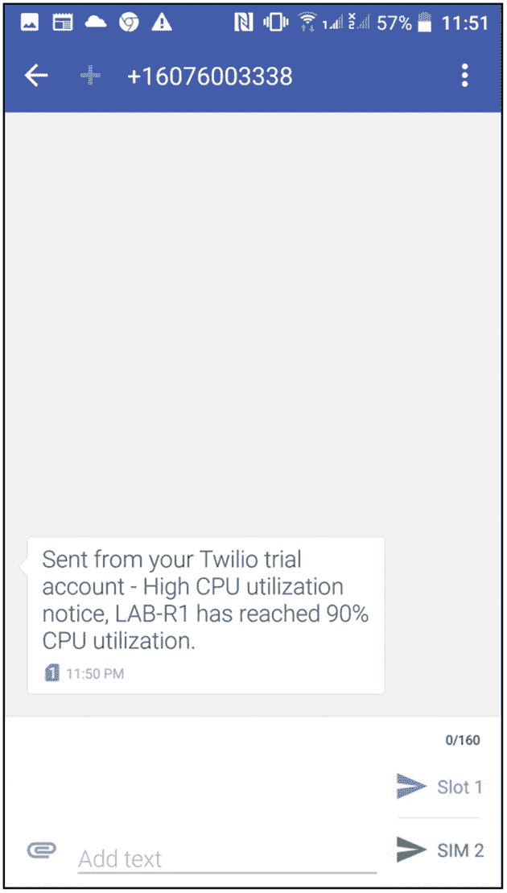图 16-17。从 Python 脚本收到的 SMS 消息 |
| **11** | 从您的`ubuntu20s1`服务器，使用`crontab –e`命令打开`cron`,并安排脚本每五分钟运行一次，以检查路由器的 CPU 利用率。`pynetauto@ubuntu20s1:~/monitor_cpu$` `pwd``/home/pynetauto/monitor_cpu``pynetauto@ubuntu20s1:~/monitor_cpu$` `ls``cpu_util_5min_monitor.py  cpu_oid_log.txt  credentials.py  nano.save  __pycache__  twilio_sms.py`添加到`crontab`的最后一行如下所示。一旦在`crontab`中安排了以下任务，它将开始每五分钟运行一次。`pynetauto@ubuntu20s1:~/monitor_cpu$` `crontab -e``GNU nano 4.8` `/tmp/crontab.DbnMHK/crontab``[...omitted for brevity]``# For more information see the manual pages of crontab(5) and cron(8)``#``# m h  dom mon dow   command``*/5 * * * * /usr/bin/python3.8 /home/pynetauto/monitor_cpu/cpu_util_5min_monitor.py  >> /home/pynetauto/monitor_cpu/cron.log``^G Get Help  ^O Write Out   ^W Where Is   ^K Cut Text    ^J Justify   ^C Cur Pos``^X Exit      ^R Read File   ^\ Replace    ^U Paste Text  ^T To Spell  ^_ Go To Line` |
| **12** | 让脚本运行并使用`ls`命令检查是否已经创建了`cron.log`。`pynetauto@ubuntu20s1:~/monitor_cpu$` `ls``cpu_util_5min_monitor.py  credentials.py  nano.save    twilio_sms.py``cpu_oid_log.txt                 cron.log        __pycache__` |
| **13** | 检查记录在工作目录下的`cron.log`文件中的日志。当脚本运行并将记录写入日志文件时，您应该可以找到带有时间戳的 CPU 利用率日志。`pynetauto@ubuntu20s1:~/monitor_cpu$` `cat cron.log``--------------------------------------------------------------------------------``Thu, 24 Sep 2020 14:25:01 iso.3.6.1.4.1.9.9.109.1.1.1.1.5.1 = Gauge32: 97``97``High CPU``SM5d062edec4e844bda63ab372a568c883``Finished``--------------------------------------------------------------------------------``Thu, 24 Sep 2020 14:30:02 iso.3.6.1.4.1.9.9.109.1.1.1.1.5.1 = Gauge32: 98``High CPU``SMde58b1ebfc554ea1b94637ab26db256e``Finished``--------------------------------------------------------------------------------``Thu, 24 Sep 2020 14:35:02 iso.3.6.1.4.1.9.9.109.1.1.1.1.5.1 = Gauge32: 97``High CPU``SMb5365d20960848459d87e0b14570596d``Finished` |
| **14** | Check SMS alerts on your smartphone. If the `cron` job properly runs every five minutes, it should check for high CPU utilization, and if high CPU utilization has been detected, then send an SMS message. If the CPU for the last five minutes is less than 90 percent, it just writes the `cron` logs and should not send the SMS utilization. See Figure 16-18.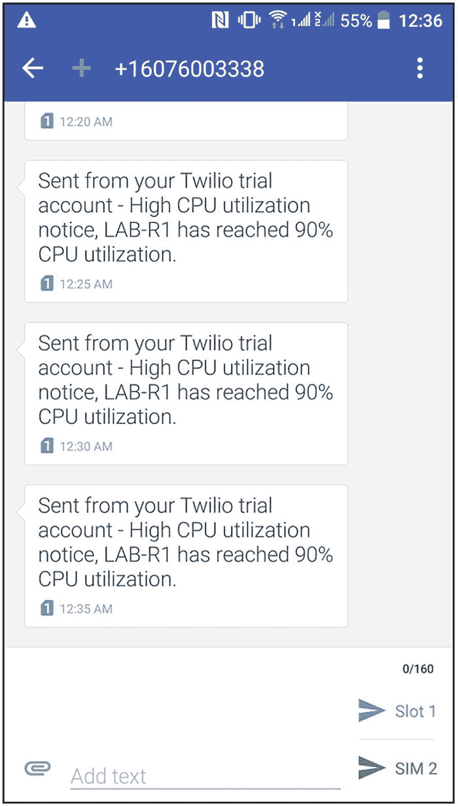图 16-18。CPU 利用率达到或超过 90%时收到的 SMS 消息 |
| **15** | 实验结束时，使用所有 pingss 设备上的 Ctrl+^键停止 ICMP 对`LAB-R1`的 ping。 |
| **16** | 最后，通过发出`u all`、`un all`或`undebug all`命令停止`LAB-R1`上的调试。`LAB-R1#` `un all``All possible debugging has been turned off` |

您已经完成了 CPU 监控实验，并向您的智能手机发送了事件通知短信。这是在个人笔记本电脑/PC 上的简单集成；然而，这些想法延伸到更大规模的生产基础设施。

## 摘要

很好地完成了本章中的所有任务！本章旨在让您跳出框框思考，探索管理网络基础设施的各种 Python 用例。在这个阶段，你应该开始思考你在工作中遇到的自动化挑战，并开始研究你将如何解决公司的问题。在本章中，您已经在 Python 上安装了`virtualenv`,并简单测试了 Ansible 和 pyATS。然后，您从 Docker 概念开始，并完成了在 Docker 环境中运行的电子邮件发送应用。最后，你在 Twilio 上注册了一个免费账户。您编写了一个 Python 应用来检查路由器的 CPU 利用率，当满足特定条件时，您会向智能手机发送一条 SMS 警告消息。我希望您可以开始思考工作中的其他 Python 应用用例，并尝试通过将各种可用的开源和专有源代码工具放在一起来解决这个问题。在第十七章中，我们将详细讨论思科 IOS XE 升级，作为开发我们应用的第一阶段。只有当任务被文档化时，它们才能以正确的顺序使用编程语言被自动化。