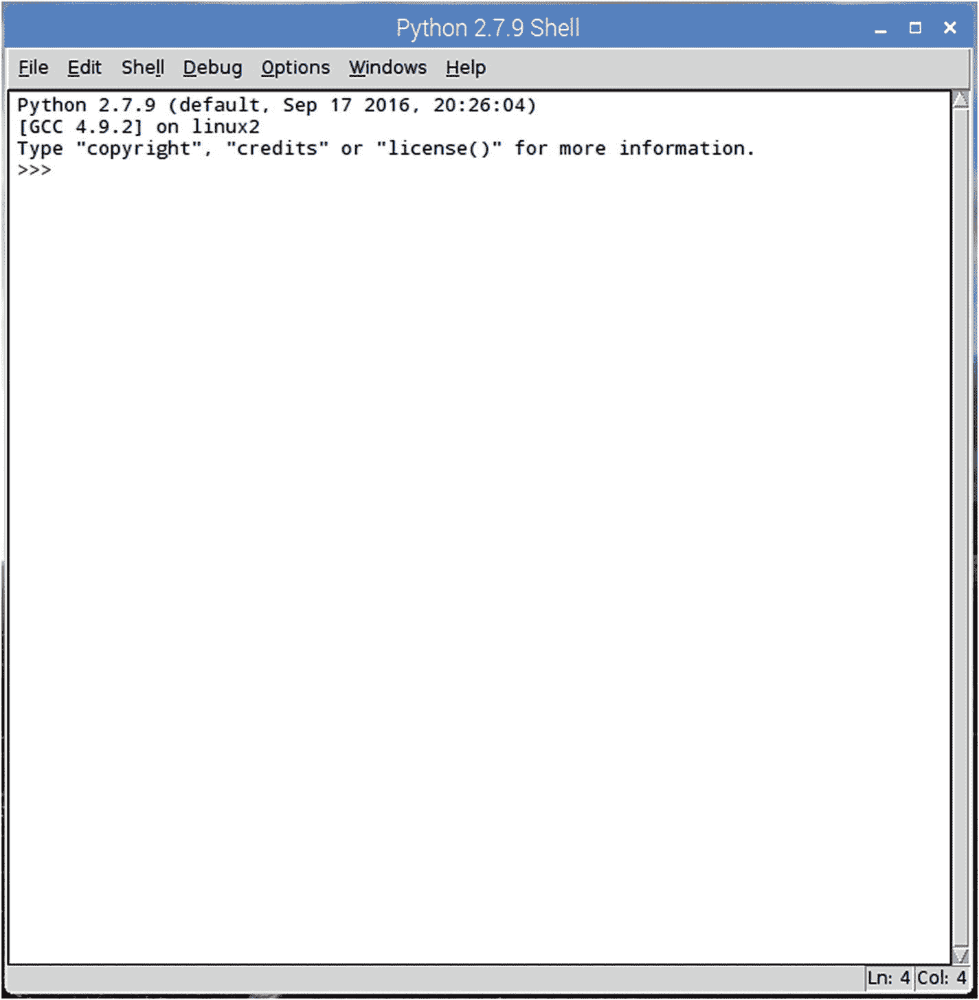
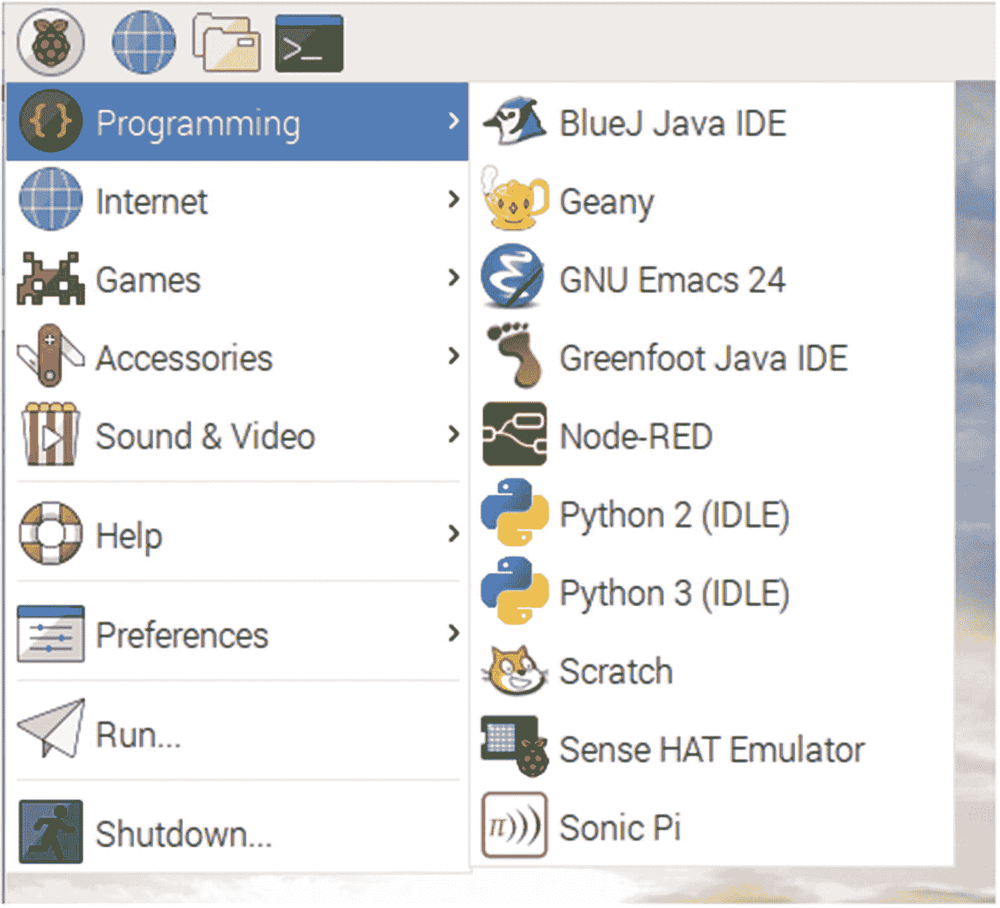

# 三、Python 简介

你可能记得从第一章开始，Raspberry Pi 的创造背后的动力是让编程对每个人来说更容易理解，尤其是孩子。为此，创造者希望发布一款相对强大的计算机，它不会花很多钱，任何人都可以简单地连接到键盘、鼠标和显示器并开始编程。

这一创造的另一个方面是使编程更容易，因此 Eben Upton 和他的同伴决定将 Python 作为 Pi 操作系统的一个组成部分。他们认为，Python 是一种强大的语言，但它足够简单，没有任何编程经验的人也能很快掌握。

在这一章中，我将向您简要介绍 Python，带您完成创建几个脚本、运行它们的过程，并在此过程中学习这种强大语言的一些基础知识。我假设你至少对什么是 Python 有一点点了解，也许对编程有一点点了解，但仅此而已，因为——让我们面对现实吧——这就是你买这本书的原因。

## 脚本与编程语言

Python 是一种脚本语言。有些人可能会对它是编程语言还是脚本语言吹毛求疵，但是为了让严格的技术专家满意，我们称它为脚本语言。

脚本语言在几个方面不同于真正的编程语言。当您阅读以下比较时，请注意斜体部分:

*   编程语言是编译的，不像脚本语言。像 C、C++和 Java 这样的通用语言必须由编译器编译。编译过程会产生一个机器代码文件，人类无法读取，但计算机可以读取并遵循。当你用 C 写一个程序并编译它时。o 文件是计算机读取的内容。这样做的副作用/结果之一是编程语言*可能*产生更快的程序，这既是因为编译只发生一次，也是因为编译器经常在编译过程中优化代码，使其比最初编写时更快。

    另一方面，脚本语言在每次运行时都会被读取、解释和执行。它们不产生编译的文件，并且完全按照编写的指令执行。如果你写草率的代码，你会得到草率的结果。出于这个原因，脚本语言*会*导致程序变慢。

*   编程/编译语言*通常*直接运行在编写它们的硬件之上。当你用 C++编写和编译一个程序时，产生的代码直接由你的台式机上的处理器执行。

    脚本语言通常在另一个程序“内部”运行，这个程序负责刚才提到的编译步骤。PHP 是一种常见的脚本语言，运行在 PHP 脚本引擎内部。Bash 脚本在 bash shell 中运行，这在前一章中已经介绍过了。

*   编程语言*往往更复杂，更难学。脚本语言可读性更强，语法要求更少，对非程序员来说也不那么可怕。*

    仅仅因为这个原因，脚本语言经常在学校的入门编程课程中教授，直到学生掌握了编程的基础知识，才会向他们介绍更严格的语言，如 C 或 Java。

然而，两者之间的界限在过去的几年里变得如此模糊，以至于两者之间的区别几乎完全消失了。列举如下:

*   虽然严格的编程语言是编译的，而脚本语言不是，但当今计算机中处理器速度和内存管理的进步几乎使编译语言的速度优势过时了。一个用 C 语言编写的程序和一个用 Python 编写的程序可能都执行相同的任务，而速度上的差异几乎可以忽略不计。某些任务可能确实更快，但不是全部。

*   是的，脚本语言运行在另一个程序中。然而，Java 被认为是一种“真正的”编程语言，因为它必须在运行时进行编译，但它是在每个设备上的 Java 虚拟机内部运行的。事实上，这就是 Java 如此可移植的原因:代码是可转移的，只要某个版本的虚拟机运行在您的特定设备上。C#也是一种编译语言，但是它运行在另一种编程环境中。

*   好吧，我真的不能否认这样一个事实:编程语言*往往更复杂更难学，脚本语言*的确更容易阅读和学习，语法规则更少，上下文更像英语。以下面两种打印“Hello，world！”的方式为例对着屏幕。**

    在 C++中，您应该写:

    ```py
    #include <iostream>
    int main()
    {
    std::cout << "Hello, world!" << std::endl;
    return 0;
    }

    ```

    在 Python 中，您可以编写:

    ```py
    print "Hello, world!"

    ```

    当然也有例外；我见过几乎难以辨认的 Python 脚本。同样，也有一些非常可读的 C 程序在流传。但是，总的来说，脚本对于程序员新手来说更容易学习，并且它们可以像编译的代码一样强大。

    是的，你可以用 C，C++，甚至 Java，或者(如果你特别喜欢)汇编语言来编写 Pi。但是现在你已经知道并看到了编程和脚本语言之间的区别，难道你不想使用 Python 吗？

    使用 Python 对 Pi 编程意味着，许多从未梦想过对计算机编程的人可以拿起一个 Raspberry Pi，用它做一些非常酷的事情，比如构建本书中介绍的一个项目，而无需学习一门困难的语言。毕竟，这就是 Pi 存在的原因——让更多的学生可以使用编程——因此 Python 被预装在 Pi 上。

## Python 哲学

在脚本语言的世界中，Python 相对来说是一个新人，尽管它并不像许多人认为的那样新。它是在 20 世纪 80 年代后期开发的，可能比 Unix 的概念晚了 15 年。

其主要作者 Guido Van Rossum 于 1989 年 12 月实施了该计划。他一直积极参与 Python 的开发和进步，他对这种语言的贡献得到了 Python 社区的奖励，社区授予他终身慈善独裁者(BDFL)的称号。

Python 的哲学一直是让代码可读和可访问。Python 的“PEP 20(Python 的禅)”文档总结了这一理念，内容如下:

*   漂亮总比难看好。

*   显性比隐性好。

*   简单比复杂好。

*   复杂总比复杂好。

*   扁平的比嵌套的好。

*   疏比密好。

*   可读性很重要。

*   特例不足以特殊到打破规则。

*   虽然实用性战胜了纯粹性。

*   错误永远不应该无声无息地过去。

*   除非明确沉默。

*   面对暧昧，忍住猜测的诱惑。

*   应该有一种——最好只有一种——显而易见的方法来做这件事。

*   尽管这种方式一开始可能并不明显，除非你是荷兰人。

*   现在总比没有好。

*   虽然永远也不会比现在的*对*好。

*   如果实现很难解释，这是一个坏主意。

*   如果实现很容易解释，这可能是一个好主意。

*   名称空间是一个非常棒的想法——让我们多做一些吧！

除了这些戒律之外，Python 还有一个“包含电池”的思维模式，这意味着无论你需要在 Python 中做什么奇怪的任务，很有可能已经有一个模块可以完成，所以你不必重新发明轮子。

## Python 入门

我们开始吧。在您的 Pi 上运行 Python 有三种方式:使用内置的解释器空闲、在终端窗口中或者作为脚本。我们将从使用 IDLE 开始。

### 使用 IDLE 运行 Python

空闲解释器是一种“沙箱”,在这里你可以与 Python 交互地工作，而不必编写整个脚本来查看它们做了什么。IDLE 这个名字代表“集成开发环境”，但它也向英国喜剧团体 Monty Python 的创始人之一埃里克·艾多尔致敬。(见侧栏“给我一个灌木林！”)

因为这是对用户最友好的测试代码的方式，所以让我们先使用 IDLE。点击菜单栏左上方的树莓图标，然后打开编程子菜单就可以找到了(见图 [3-1](#Fig1) )。选择 Python 2(空闲)选项，因为我们将在 Python 2 中进行所有的 Python 编程(参见侧栏)。你应该会看到如图 [3-2](#Fig2) 所示的窗口。



图 3-2

空闲窗口



图 3-1

查找空闲接口

为了遵循伟大的编程传统，让我们从程序员用任何语言编写的第一个程序开始。在提示符下，键入

```py
>>> print "Hello, world!"

```

然后按回车键。你应该立即受到问候

```py
Hello, world!

```

这是 Python 的`print`语句，默认选项是到屏幕。现在打字

```py
>>> x=4

```

然后按回车键。提示符将会返回，但没有任何反应。实际发生的是 Python 的解释器现在已经将`x`与`4`关联起来。如果你现在打字

```py
>>> x

```

迎接你的将是

```py
4

```

同样，如果你输入

```py
>>> print x

```

你会再次受到欢迎

```py
4

```

这说明了 Python 另一个很酷的方面:*动态类型化*。在像 C 这样的语言中，必须在声明变量之前定义变量的类型，如下所示:

```py
string x = "This is a string.";

```

或者

```py
int x = 5;

```

### 注意

有关字符串的更多信息，请参阅本章后面的“字符串”一节。

当你告诉 Python`x = 4`的时候，python“知道”了`x`是一个`int`(整数)。

尽管是动态类型的，Python 是*强类型的*。这意味着它会抛出一个错误，而不是允许你做一些事情，比如给一个`string`添加一个`int`。您也可以使用类定义自己的类型；Python 完全支持面向对象编程(OOP)。我稍后会谈到这一点，但简而言之，这意味着您可以创建一个可能是整数、字符串和其他类型混合的对象，并且该对象将是它自己的类型。Python 有几种内置的数据类型:数字、字符串、列表、字典、元组、文件和其他一些类型(比如布尔)。我们将在本章的后面简要地介绍每一个。

接下来，让我们尝试在 IDLE 中使用一些变量和操作。打字

```py
>>> print x+5

```

会返回`9`；然而，打字

```py
>>> x + "dad"

```

会导致错误。然而，在这种情况下，打字

```py
>>> "DAD" + "hello"

```

给你

```py
'Dadhello'

```

因为对于 Python 来说，添加字符串等同于连接字符串。如果你想列一个清单，用方括号把它括起来:

```py
>>> y = ['rest', 1234, 'sleep']

```

此外，字典(一种由相关的键和键值组成的文件)必须用花括号括起来:

```py
>>> z = {'food' : 'spam', 'taste' : 'yum'}

```

### 注意

键和键值是 Python 字典不可或缺的一部分。它们只是相互关联的价值对。例如，在前面代码示例中的`z`字典中，`'food'`和`'spam'`分别是一个键和一个键值。同样，`'taste'`和`'yum'`是一个键和一个键值。要使用字典，需要输入它的键，然后返回相关的键值。

### 给我一根灌木！

Python 是*而不是*以蛇命名的；更确切地说，它的创造者范·罗森以 BBC 喜剧团的巨蟒剧团命名，他是该剧团的超级粉丝。因此，语言中大量引用了 Monty Python。在其他程序中用来说明代码的传统“foo”和“bar”在 Python 示例中变成了“spam”和“eggs”。如果你是 Monty Python 的粉丝，你会看到“Brian”、“ni”和“bushebry”的引用，所有这些对你来说都很有意义。就连翻译 IDLE 也是以议员埃里克·艾多尔的名字命名的。如果你不熟悉他们的作品，我劝你放下这本书，去看一些他们的草图。我强烈推荐《死鹦鹉小品》和《傻瓜式行走部》。学习这门语言不一定要熟悉他们的作品，但这可能有助于增加你的乐趣。

### Python 2 对 Python 3

Python 在编程语言中有些独特，因为它有两个当前可用的受支持版本:版本 2 和版本 3。前者是 2.7.14 版本，Python 3 目前是 3.6.4 版本。Python 3 发布于 2008 年；2.7 是在 2010 年发布的，不会有更多的主要版本(即，不会有 2.8 版本)。Python 的创造者决定用第 3 版“清理”这种语言，对向后兼容性的考虑比你预期的要少。

最大的改进是 Python 3 处理 Unicode 的方式，该语言的几个方面对初学者来说更加用户友好。不幸的是，由于向后兼容性有限，有许多用 Python 2 编写的 Python 软件如果不进行一些重大的修改就无法在 Python 3 中运行，坦率地说，这并不是很有吸引力，尤其是因为 Python 2 仍然受支持。

我的建议是，集中精力学习 Python 2，因为 3 并没有太大的不同。在这本书里，我将使用 Python 2，但是如果你觉得有必要的话，可以随意翻译成 Python 3。

### 使用终端运行 Python

让我们快速访问一下 Python 的另一种使用方式，那就是使用终端。打开 Pi 桌面上的终端，在提示符下键入`python`。你会看到与打开空闲窗口相同的介绍性文本和相同的交互式`>>>`提示。此时，您可以发出与上一节“使用 IDLE 运行 Python”中讨论的相同的命令，并获得相同的结果。

### 使用脚本运行 Python

IDLE 和 terminal 的问题都是你写不出真正的脚本。一旦你关闭了窗口，你声明的所有变量都消失了，并且没有办法保存你的工作。在文本编辑器中编写 Python 的最后一种方法解决了这个问题。你可以写一个完整的程序，用一个`.py`扩展名保存，然后从终端运行它。

让我们使用 Pi 的默认文本编辑器编写一个非常短的脚本。从附件菜单中打开它(图 [3-3](#Fig3) )。


图 3-3

访问文本编辑器

在出现的窗口中，键入以下内容:

```py
x = 4
y = x + 2
print y

```

将其保存到您的桌面上作为`test.py`。现在，打开终端，通过键入以下命令导航到您的桌面

```py
cd ~/Desktop

```

您现在可以通过键入以下命令来运行您的脚本

```py
python test.py

```

你应该会看到号码`6`。恭喜你！您刚刚编写、保存并运行了您的第一个 Python 脚本！

当您编写本书中的脚本时，可以随意使用任何文本编辑器。如果您习惯使用默认的文本编辑器，那就使用它吧。我倾向于使用基于终端的编辑器 nano 或 emacs，因为我经常远程登录到我的 Pi，并且默认编辑器不能在远程登录会话中运行。出于这个原因，我经常告诉你像这样编辑文件:

```py
sudo nano spam-and-eggs.py

```

你想用哪个编辑器就用哪个编辑器。

接下来，让我们简单地看一下每种数据类型，看看您可以对每种类型做些什么。

## 探索 Python 数据类型

如前所述，Python 为您提供了几种内置的数据类型。在下面几节中，您将了解数字、字符串、列表、字典、元组和文件。

### 民数记

数字似乎是不言自明的，事实上，如果您有编程经验，您会认识到 Python 的数字类型:整数、短整型、长整型、浮点型等等。Python 有表达式运算符，允许您对此类数字进行计算；这些包括`+`、`-`、`/, *`和`%`；比较运算符，如`>`、`>=`、`!=`、`or`、`and`；和许多其他人。

所有这些操作符都是内置的，但是您可以通过使用 Python 的另一个伟大特性来*导入*其他操作符:导入*模块*。模块是额外的库，可以导入到脚本中，增加 Python 的本地功能。在这方面，Python 很像 Java:如果你想做某件事，很有可能有一个库的存在使它变得更容易。例如，如果您想解析文本，如网页，您可以查看漂亮的 Soup 模块。需要登录到一台远程计算机上(对于某些项目，您会这样做)？导入 telnetlib 模块，需要的都有了。对于数字，math 模块有各种数学函数，增加了 Python 的数字功能。你可以自己试试。在空闲会话中，键入

```py
>>> abs(-16)

```

并且你应该得到结果`16`。这是因为绝对值函数(我将在本章后面的独立章节中讨论函数的主题)已经包含在 Python 的默认库中。然而，打字

```py
>>> ceil(16.7)

```

将返回一个错误，因为在那些默认库中，上限函数是*而不是*。肯定是进口的。现在打字

```py
>>> import math
>>> math.ceil(16.7)

```

终端将返回`17.0`—x 的*上限*，或者大于 x 的最小整数。虽然您可能不需要使用`ceiling`函数，但简单地导入`math`模块将为您提供各种额外的功能，如对数和三角函数以及角度转换，所有这些都只需要一行代码。

### 用线串

在 Python 中，字符串被定义为用于表示基于文本的信息的字符的有序集合。Python 不像 C 和其他语言那样有`char`类型；单个字符就是单个字符的字符串。字符串可以包含任何可视的文本:字母、数字、标点符号、程序名等等。当然，这意味着

```py
>>> x = 4

```

和

```py
>>> x = "4"

```

*和*不是一回事吗？您可以将`3`添加到第一个示例`x`中，但是如果您尝试使用第二个示例，Python 将会给出一个错误— *即* `x`指向一个值为`4`的字符串，而不是一个整数，因为`4`被括在引号中。Python 不区分单引号和双引号；您可以在任一个中包含一个字符串，它将被识别为一个字符串。这有一个很好的副作用:您可以在字符串中包含另一种类型的引号字符，而不必像在 c 语言中那样用反斜杠进行转义。例如:

```py
>>> "Brian's"

```

给你

```py
"Brian's"

```

不需要任何转义字符。

在您的 Python 生涯中，有一些基本的字符串操作您可能会用到很多次，比如`len`(字符串的长度)、连接、迭代、索引和切片(Python 的 substring 操作的等价物)。举例来说，在空闲会话中键入以下代码，注意结果与您在这里看到的输出相匹配:

```py
>>> len('shrubbery')

9

'shrubbery' is 9 characters long.

>>> 'spam' + 'and' + 'eggs'

'spam and eggs'

'spam', 'and', and 'eggs' are concatenated.

>>> title = "Meaning of Life"
>>> for c in title: print c,
(hit Enter twice)

M e a n i n g  o f  L i f e

```

对于'`title`'中的每个字符，打印出来。(注意`print c`后的逗号；它告诉解释器一个接一个地打印字符，而不是按向下的列打印。)

```py
>>> s = "spam"
>>> s[0], s[2]
('s', 'a')

```

“`spam`”的第一([0])和第三([2])字符是“`s`”和“”。

```py
>>> s[1:3]
'pa'

```

第二个*到*第四个字符是“`pa`”。(在命名字符串或其他数组中的一系列字符时，第一个参数是包含性的，第二个不是。)

当您有一个当前类型为 string 的整数(如`"4"`)并且您想要执行一个操作(如求平方)时，您还可以在 string 对象和 string 对象之间进行转换。要做到这一点，就像打字一样简单

```py
>>> int("4") ** 2
16

```

只要使用 Python 的内置字符串库，您就可以在 ASCII 代码之间进行转换，使用像%d 和%s 这样的转义字符进行格式化，从大写转换为小写，以及一系列其他操作。

### 列表

列表和字典可以说是 Python 内置数据类型中最强大的。它们实际上是其他数据类型的集合，非常灵活。它们可以根据需要改变位置、增长和收缩，以及包含和被包含在其他种类的对象中。

如果您有使用其他编程语言的经验，您可能会认为 Python 列表相当于 C 语言中的指针数组，事实上，列表实际上是 Python 解释器中的 C 语言数组。因此，它们可以是任何其他类型对象的集合，因为它们包含的指针对象可以指向任何其他数据类型，包括其他列表。它们也是可索引的——和索引 C 数组一样快。它们可以像 C++和 C#的列表一样伸缩；它们可以被分割、切块和连接——几乎任何你对字符串做的事情，你都可以对列表做。

要创建一个列表，用方括号(`[]`)声明它，如下所示:

```py
>>> l = [1, 2, 3, 4, 5]

```

或者

```py
>>> shrubbery = ["spam", 1, 2, 3, "56"]

```

声明它们之后，你可以用它们玩各种游戏，比如连接等等:

```py
>>> l + shrubbery
[1, 2, 3, 4, 5, 'spam', 1, 2, 3, '56']

>>> len(shrubbery)
5

>>> for x in l: print x,
...
1 2 3 4 5

>>> shrubbery[3]
3

```

(您可能还注意到，列表和数组一样，是从 0 开始索引的。)通过使用索引和切片操作，您可以通过组合删除和插入来就地更改列表:

```py
>>> cast = ["John", "Eric", "Terry", "Graham", "Michael"]
>>> cast[0:2] = ["Cleese", "Idle", "Gilliam"]
>>> cast
['Cleese', 'Idle', 'Gilliam', 'Graham', 'Michael']

```

列表还允许你使用与它们相关的特定函数调用，比如`append`、`sort`、`reverse`和`pop`。更新名单(没有双关语！`list`的功能，键入

```py
>>> help(list)

```

### 注意

Python 的`help`函数极其有用。如果你不知道如何做某事，或者有什么可用的，或者如何使用一个特定的功能，在提示符下键入`help(<confusing object>)`可以给你很大的帮助。(参见侧栏“Python 帮助”)

### Python 帮助

如果您曾经沉迷于 Python，它的在线文档是非常有用的资源。将您的浏览器指向 [`http://docs.python.org/2/library/stdtypes.html`](http://docs.python.org/2/library/stdtypes.html) 以阅读所有可用的标准数据类型以及如何使用它们。同样， [`http://docs.python.org/2/library/functions.html`](http://docs.python.org/2/library/functions.html) 会显示所有可供您使用的功能。它内置的帮助功能也很彻底。要尝试它，在空闲会话类型中

```py
>>> import string

```

然后

```py
>>> help(string)

```

你会得到你想知道的关于弦的一切。同样，打字

```py
>>> help(string.capitalize)

```

将向您展示如何使用大写功能。

### 字典

像列表一样，Python 字典是极其灵活的对象集合。字典的不同之处在于，不像列表，它们是无序的；你可以通过索引来访问列表中的条目，但是字典中的条目是通过键来访问的。换句话说，字典包含键值对；请求该键将返回与该键相关联的值。例如，在下面的字典中，值'`spam`'可以通过它的键']'来访问:

```py
>>> dict = {'food': 'spam', 'drink': 'beer'}
>>> dict['food']
'spam'

```

像列表一样，字典可以嵌套:

```py
>>> dict2 = {'food': {'ham': 1, 'eggs': 2}}

```

这意味着键'`food`'有一个关联的键值`{'ham': 1, 'eggs': 2}`，它本身就是一个字典。

字典有特定的方法调用:

```py
>>> dict.keys()
['food', 'drink']

```

这列出了`dict`中的所有键。

```py
>>> dict.has_key('food')
True

```

如果`dict`包含关键字“`food`”，则返回`True`，否则返回`False`。

字典可以就地更改:

```py
>>> dict['food'] = ['eggs']
>>> dict
{'food': ['eggs'], 'drink': 'beer'}

```

这将把'`food`'的键值从'`spam`'更改为'`eggs`'。(在这里，你会注意到']'除了是一个普通的项目，也是一个单项式列表。)

### 注意

正如您在这里看到的，键并不总是字符串。你可以使用任何不可变的对象作为键；如果您碰巧使用整数，字典的行为更像一个列表——也就是说，是可索引的(通过整数键)。

### 元组和文件

这里我要提到的最后一种主要数据类型是元组和文件。元组是不能更改的其他对象的集合，文件是指计算机上文件对象的接口。

元组是对象的有序集合。它们很像列表，但是不像列表，它们不能在适当的位置改变，并且用圆括号写，而不是方括号，像这样:

```py
>>> t = (0, 'words', 23, [1, 2, 3])

```

这里，`t`包含两个整数、一个字符串和一个列表。您可以嵌套元组、索引它们、分割它们，以及做几乎任何您可以用列表做的事情，除了就地改变它们。

那么，如果元组几乎和列表一模一样，为什么还会有元组呢？最普遍接受的答案是*,因为*它们是不变的——它们不能被改变。通过将对象集合声明为元组而不是列表，可以确保该集合不会在程序的其他地方被更改。这有点像在 C 语言中把某个东西声明为`const`——如果你以后试图改变它，编译器会给你一个错误。

回想一下，我在第 [2](02.html) 章中谈到了文件，所以这个概念你应该很熟悉。Python 有一个内置函数`open`，它创建一个文件对象，该文件对象链接到计算机内存中的一个文件。文件对象与其他类型有点不同，因为它们实际上只不过是可以在那些外部文件上调用的函数的集合。这些函数包括`read`、`write`、`open`、`close`，以及对文本文件的各种解析函数。举例来说，下面几行打开一个文件`test.txt`(如果它不存在，则创建它)进行写入，向其中写入一行文本(以换行符结束)，然后关闭该文件:

```py
>>> myfile = open('test.txt', 'w')
>>> myfile.write('Hello there, text file!\n')
>>> myfile.close()

```

当您执行命令时，所有这些都发生在您所在的目录中。

然而，请注意，如前所述，如果`test.txt`已经存在，其内容将被`myfile.write()`调用覆盖。如果您想要*将*附加到文件而不是覆盖它，请在打开文件时使用“`a`标志，而不是“`w`”。

一旦打开了一个文件，您就可以读取和写入它，记住您只能从 file 对象中读取 string 对象。这仅仅意味着，在对文件中的所有对象执行任何操作之前，必须将它们转换成“真正的”数据类型；如果`myfile.readline()`返回“`456`”，如果要对其进行计算，必须用`int()`将 456 转换成整数。

文件操作非常有用，因为它们允许你创建和写入文本文件，但是它们超出了本章介绍的范围。当我们在项目中使用它们时，我们将在后面重新讨论它们。

正如您所看到的，Python 的内置数据类型可以做“真正的”编程语言可以做的任何事情——有时更容易也更经济。通过组合这些类型，您可以用 Python 完成一些真正强大的过程，接下来您将看到这一点。

## 用 Python 编程

现在您已经看到了数据类型，让我们研究一下如何在实际程序中使用它们。要创建 Python 程序，必须退出解释器并打开文本编辑器，如 emacs 或 Pi 的 Leafpad。创建程序后，用扩展名`.py`保存它。然后，您可以通过键入以下命令来运行它

```py
$ python myprogram.py

```

Python 在语法上是编程语言中独一无二的，因为它使用空白或缩进块来屏蔽代码。像 C 这样的语言用花括号括起了一个代码块，比如一个`if`语句；Python 使用冒号和缩进来描述块。

C 语言中的代码如下所示:

```py
if (x==4)
{
    printf("x is equal to four\n");
    printf("Nothing more to do here.\n");
}
printf("The if statement is now over.\n");

```

Python 中的相同代码如下所示:

```py
if x == 4:
    print "x is equal to four"
    print "Nothing more to do here."
print "The if statement is  now over."

```

您可能会注意到关于 Python 程序的两个附加细节。首先，`if`语句中的括号是不必要的。在 Python 中，括号是可选的，但在大多数情况下，使用括号被认为是良好的编程实践，因为它增强了代码的可读性。您还会注意到，大多数其他语言都以分号结束它们的代码行；Python 没有。这可能需要一些时间来适应，但这是一个很好的改变，不会因为某个地方的分号放错位置或丢失而导致程序编译失败。在 Python 中，行尾就是语句的结尾——就这么简单。

您已经看到了一些语句，例如

```py
x = 4
y = "This is a string."

```

如前所述，Python 不需要声明来告诉它`x`是一个整数而`y`是一个字符串——它只需要*知道*。这些语句被称为*赋值*，其中右边的值被赋给左边的变量。不同的语言有不同的变量命名约定，但是我能给你的最好的建议是选择一个约定并坚持下去。如果你更喜欢帕斯卡格(`ThisIsAVariable`)，就用它；如果你喜欢驼背(`thisIsAVariable`)，就用那个。保持一致——你以后会感谢自己的。在任何情况下，赋值就是这样做的:给一个变量赋值，不管这个变量是数字、字符串、列表还是其他什么。这是最简单的编程功能。

### IF 测试

我们要看的下一个编程功能是`if`语句和它的派生物——`elif`和`else`。正如您所料，`if`执行一个测试，然后根据测试结果从备选方案中进行选择。最基本的`if`语句是这样的:

```py
>>> if 1:
... print 'true'
...
true

```

`1`与布尔值`true`相同，所以前面的语句将总是打印`true`。

### 注意

当您在终端(或空闲状态)的 Python 提示符下键入`if`语句并以冒号结尾时，下一个提示符将总是省略号(`...`)，这意味着 Python 需要一个缩进的块。如果你完成了缩进块，只需再次按回车键结束它。如果你在文本编辑器中写程序，确保你缩进了你需要缩进的块。

从现在开始，我将格式化代码，就像它在文本编辑器中一样，并打印输出，就像您运行了脚本一样。

更复杂的测试使用`elif`和`else`，如下所示:

```py
x = 'spam'
if x == 'eggs':
    print "eggs are better when they're green!"
elif x == 'ham':
    print 'this little piggy stayed home."
else:
    print "Spam is a wonderful thing!"

```

很明显，这段代码输出的是“垃圾邮件是个奇妙的东西！”当程序执行时，计算机检查第一个`if`。如果该语句被确定为真，它就直接执行其后的缩进块。如果该语句为 false，它将跳过缩进的块并查找一个`elif`，然后对其求值。同样，如果确定为真，或者没有`elif`，计算机执行下面的块；如果没有，它跳过那个块，寻找另一个`elif`或一个`else`。

这里有三点很重要，值得一提。首先，请记住，如果一个`if`语句被确定为假，那么*下面缩进的块中的*不会被执行——计算机直接跳到下一个未缩进的行。

其次，Python 和其他语言一样，使用双等号来表示对相等性的测试。单个等号用于赋值；替身是一种考验。我提到这一点是因为每个程序员——我指的是每一个程序员——都在某个时候在一个`if`语句中使用了一个等号，结果他们的程序做了各种奇怪的、意想不到的事情。你也会这么做的，但我希望至少能提前给你省下一点恼怒。

第三，Python 忽略空行和空格(当然，除了交互提示和缩进块)以及注释。这一点很重要，因为它让你可以确保你的代码对其他程序员来说是可读的，即使那个程序员是你。

### 注意

Python 中的注释前面有一个`#`；程序忽略该行后面的任何内容。

代码的可读性非常重要；希望我定期向你灌输这一点。您更愿意尝试调试前面的程序还是类似这样的程序:

```py
x='this is a test'
if x=='this is not a test':
    print"This is not "+x+" nor is it a test"
    print 89*2/34+5
else:
    print x+" and I'm glad "+x+str(345*43/2)
print"there are very few spaces in this program"

```

虽然你肯定可以读第二个，但这并不有趣，在没有空格、空行或注释的数百行代码之后，你的眼睛会感谢你——相信我。如果使用空格，请注意倒数第二行的不同之处:

```py
print x + " and I'm glad " + x + str(345 * 43 / 2)

```

你可以使用空格，所以请随意使用！

我想提到的`if`语句的最后一部分是布尔运算符。在真值测试中，如果 X 和 Y 都为真，则 X `and` Y 为真。如果 X 或 Y 为真，X `or` Y 为真，如果 X 为假，X`not`为真。Python 使用单词，而不是 C 或 C++的`&&`、`||`或`!`操作符。学习这些运算符；它们会很有用的。

### 环

通常，一个程序从上到下执行，一次一行。但是，某些语句会导致程序执行到处乱跳；这些*控制流语句*包括`if` / `then`和循环。

最简单的循环可能是执行固定次数的代码块，例如

```py
for x in range (0, 10):
    print "hello"

```

这只是打印

```py
hello
hello
hello
hello
hello
hello
hello
hello
hello
hello

```

您还可以使用`for`循环来遍历可迭代的项，比如一个字符串甚至一个列表:

```py
for x in "Camelot":
    print "Ni!"

Ni!
Ni!
Ni!
Ni!
Ni!
Ni!
Ni!

```

或者，迭代并打印字符本身:

```py
for x in "Camelot":
    print x

C
a
m
e
l
o
t

```

虽然`for`循环的语法与 C 或 Java 有点不同，但是一旦你习惯了，使用语法就成了你的第二天性。

另一个循环语句是`while`语句。该语句计算一个条件，只要该语句为真，就继续执行缩进块:

```py
x = 0
while (x < 10):
    print x
    x = x + 1

0
1
2
3
4
5
6
7
8
9

```

与您预期的不同，这段代码不会打印“10”，因为 x 在打印后会递增。在第十次迭代时，解释器打印“9 ”,然后将`x`增加到 10。此时，`while`条件不再为真，所以块内的代码永远不会被执行。

如果你在等待某个特定事件的发生，比如按键或用户按“Q”退出，语句会很有用。这方面的一个例子如下:

```py
while True:
    var = raw_input("Enter something, or 'q' to quit):
    print var
    if var == 'q':
        break

```

关于这个脚本有两个细节需要注意:首先，在 Python 2.x 中，命令`raw_input`用于从用户那里获取输入。在 Python 3.x 中，这个命令被简单地改成了`input`。第二，记住`break`的命令。这个命令实际上打破了您碰巧所在的循环。所以，在这种情况下，循环的`while`部分使它永远运行下去，但是如果检查`var == 'q'`返回`true`，脚本就会跳出循环并结束程序。

### 功能

函数允许程序员重用代码，提高效率。一般来说，如果你发现你需要在你的代码中执行一个特定的任务超过两次，那么这个任务很可能是一个函数的候选者。

假设你写了一个简单的程序来计算一个矩形的面积和周长。它要求用户输入矩形的高度和宽度，然后执行必要的计算。最简单的方法之一是创建一个函数，将矩形的高度和宽度作为输入参数。然后打印矩形的面积和周长，并返回程序。为此，我们使用一个复合语句块，以`def`赋值开始。`def`赋值是我们如何定义一个函数，语法是`def functionname (firstparameter, secondparameter):`

```py
def AreaPerimeter (height, width):
    height = int(height)
    width = int(width)
    area = height * width
    perimeter = (2 * height) + (2 * width)
    print "The area is:" + area
    print (The perimeter is:" + perimeter
    return

while True:
    h = raw_input("Enter height:")
    w = raw_input("Enter width:")
    AreaPerimeter (h, w)

```

这个小程序只是简单地接受你输入的数字并返回计算结果。虽然这可能不是*最好的*例子(你可以用更少的代码进行动态计算)，但它说明了代码重用的思想。有了这个函数，无论你在程序中的什么地方需要计算面积或周长，你只需要用“`height`”和“`width`”两个参数调用`AreaPerimeter`，就为你完成了。

这里要注意一点:`raw_input`总是返回一个字符串，即使你输入了数字。这就是为什么在进行任何计算之前，`AreaPerimeter`中的`height`和`width`变量必须转换成`int` s。

如果您熟悉其他语言，Python 的函数与其他语言中的方法、函数和过程略有不同。首先，在 Python 中，所有函数都是*引用调用*。在不深入编程的情况下，这意味着当你传递一个参数给一个函数时，你实际上只传递了一个指向变量的指针，而不是变量本身。这有助于使 Python 对内存更加友好——例如，您不必随意地复制整个列表，并将它们来回传递给函数。相反，如果一个函数把一个列表作为参数，你把列表第一项的内存位置传递给它，它就根据这个位置和项做它需要做的事情。

函数的另一个有趣的方面是它们是可执行的语句。例如，这意味着函数定义实际上可以在一个`if`语句中声明和调用。虽然不正常，但这样做是合法的(有时是有用的)。`def`可以嵌套在循环、其他`def`甚至列表和字典中。

我们将在项目中再次访问函数；现在，请注意它们的存在，它们是你编写的任何程序中非常有用的部分。

### 对象和面向对象编程

在这篇 Python 简介中，我想说明的另一个重要事项是它运行面向对象代码的固有能力。虽然面向对象编程(OOP)可能是一个高级主题，并且可能超出了本书的范围，但我认为它是一个足够重要的主题，可以轻松地浏览一下。

OOP 是一种范例，其中程序数据被分成混合的*对象*和函数或方法。对象是一种数据类型——通常是其他数据类型的集合，如整数、字符串等等。对象通常是*类*的一部分，这些类有关联的方法可以作用于该类的成员。

也许说明这一点最简单的方法是用一个使用形状的例子。在这个例子中，*形状*是一类对象。那个类有相关的值，比如`name`和`numberOfSides`。那个类也有相关的方法，比如`findArea`或者`findPerimeter`。

`shape`类有子类，更具体。正方形是一个`shape`对象，其值`shapeType`等于`square`,`numberOfSides`等于`4`。它的`findArea`方法获取`lengthOfSides`值并求平方。同时，`triangle`对象对于`name`、`shapeType`、`numberOfSides`有不同的值，其`findArea`方法也不同。

这个例子在快速介绍对象的同时，也说明了继承的概念，继承是 OOP 不可分割的一部分。三角形对象*从其*父*类`shape`继承*的`name`、`numberOfSides`和`findArea`部分(尽管这些部分有不同的值和实现)。如果一个对象从`shape`类继承，它也将继承那些部分。它不一定*用*那些零件，但它有。它可能有额外的部分(例如，`circle`对象可能有一个`radius`值)，但是它总是有那些部分。

如果你开始在编程中使用类，Python 比它的同类，如 C++或 Java，更容易理解。您几乎可以用语法`object.attribute`命名任何对象或方法，无论该属性是对象还是方法。如果你有一个名为`holyGrail`的`circle`物体，它的半径是`holyGrail.radius`。名为`unexplodedScotsman`的`square`具有由`unexplodedScotsman.findArea`定义的区域。

就像我说的，OOP 超出了本书的范围。然而，像函数一样，它也非常有用，尤其是在更长、更复杂的程序中。随着您在 Python 研究方面的进步，您可以随时进行进一步的研究。您会发现 Python 也是一种非常通用的语言，甚至允许您执行函数和其他高级编程任务。

## 摘要

在这一章中，我给了你一个简短而实用的 Python 介绍，从它的一点历史开始，然后继续讲述如何与 Python 提示符交互，帮助你学习它的一些数据类型，然后向你展示一点使用编辑器编写脚本。如果你不能一下子理解所有这些信息，不要担心。这里有很多要学的东西，我会在我们进行书中的项目时解释我在做什么。与此同时，Python 上有数以千计的书籍和课程，所以如果你想了解更多，请随意在网上和当地的书店里寻找。

在下一章，我们将学习电子学 101。毕竟，你将会进行项目建设，在此之前，你应该对电、动力以及各种电子部件和小发明有一个基本的了解。