# 四、时速 100 英里的电子设备

您购买这本书是为了学习使用 Python 编程，并了解 Raspberry Pi。您还想构建一些很酷的项目，了解 Pi 如何运行 Linux，以及如何使用 Python 与 Pi 和各种附加组件进行交互。

我们会谈到这一点，但在此之前，我需要解释一些其他重要的先决条件，即电子和电气规则、工具、安全规则以及一些操作方法。它们可能不是最性感的话题，但任何涉及建筑电子项目的书都应该至少有一章涉及像欧姆定律和 ?? 如何焊接这样的概念，事实是，是的，?? 完全有可能用 9V 电池电死自己。(见侧栏。)更不用说，我不希望我的读者因为我没有做足够的安全指导而受到任何身体伤害。所以，如果这些信息对你来说是全新的，请至少浏览一下这一章并做些笔记。如果你读完这一章，觉得有必要穿得像图 4-1 那样来保护自己，那完全没问题。

图 4-1

可能的实验室安全装备

### 达尔文奖

如果你还不知道的话，达尔文奖是一个幽默的奖项，每年颁发给那些由于自己的愚蠢，通过死亡或绝育，成功将自己从基因库中移除的人类成员。过去的获奖者包括在从变电站偷铜线时触电身亡的小偷，在高速行驶时与乘客交换位置的司机，以及在静脉中注射罂粟籽的吸毒者。

9V 电池电死事件发生时，一名海军水手试图测量他的身体电阻，将他的 9V 万用表的尖头插入他的拇指，使他的血液成为完美的导体。电流穿过他的心脏，扰乱了他的心跳，杀死了他。

你可以在达尔文奖的网站上了解更多关于达尔文奖的信息: [`www.darwinawards.com`](http://www.darwinawards.com) 。

## 基本电学概念

> 。。。他说，他是这样说的:"只有一个定律，这个定律是欧姆定律，那就是 V 等于 I 乘以 r。"

好吧，我知道这个报价有些俗气；但是，欧姆定律确实是任何一个电气工程专业的学生学习的第一件事，它影响着你在电子学方面所做的一切。这意味着总电压(V；用伏特测量)等于电路中任何一点的电流(I；测量单位为安培)乘以电阻(R；以欧姆测量)。 *I* 代表*电感*，这就是为什么它是 I，而不是 c。因此，如果有一个 200 欧姆的电阻，有 0.045 安培的电流流过它，该电阻上的电压等于 9 伏。像任何好的代数方程一样，它是可以互换的:

*   *V*=*I*×*R I*=*V**R R*=*V**I*

电路中的另一个重要变量是功率，用 *P* 表示，单位是瓦特。功率等于电压乘以电流，电压的平方除以电阻，或者电流的平方乘以电阻。如果这令人困惑，使用图 4-2 中的图表来更好地想象这些关系。

图 4-2

常见电气方程

举例来说，说明不同电气概念的常见方式是用水和不同尺寸的管道。在“水回路”中，水力是由水泵提供的。在电路中，电源由电池提供。在水回路中，泵在低压下取水，增加压力，并将水沿着回路输送。在电路中，电池获得“低压”电压，增加电压，并在电路中传输。在这两种情况下，*电流*意味着电路周围的电子或水的流动。电路的*电阻*类似于水管有多大。如果管子很大，它对水流的阻力就较小。在电路中，如果导线的电阻较小，电子就可以更自由地流动。这反过来影响了*的力量*。

功率随着电阻和电流的增加而增加。把功率想象成电的“速度”;如果有一定量的水从软管的一端流出，你把手指放在软管的一端，增加阻力，水的速度就会增加。增加电路的电阻会增加功率。当然，这也有副产品。部分堵塞软管末端会增加软管口处的摩擦，从而增加热量。同样，增加电路的电阻通常意味着增加热量。热量对电路不利，尤其是像集成电路(ic)这样的易碎物品，因此许多产生热量的电子元件(由于内阻等原因)通常内置有散热器来散发它们产生的热量。

从最基本的角度来说，电只不过是电子沿着电线或其他路径来回移动。该路径总是阻力最小的路径。给定两种旅行方式的选择，电子将总是选择最容易的路径，无论是通过导线、螺丝刀还是人类躯干。当与这些电子一起工作时，你的目标是确保最容易的路径不涉及你的身体。你不会永远成功；我被电击的次数都数不清了。(事实上，除了我经历过的电池和电源的多次电击之外，我实际上还被闪电击中过三次。)一个有良知的实验者应该努力减少这些事件，如果没有别的原因，仅仅是因为它们会*伤害*！橡胶手套会有帮助(尽管一直戴着有点不切实际)，橡胶靴或橡胶底鞋也可以。橡胶靴之所以是个好主意，除了它们非常时尚之外，还因为电子总是想接地。该“地”可以是电源地，如电池的端子；底盘接地，就像汽车中的发动机组；或者实际接地，称为*接地*。你和地面之间的橡胶屏障阻止了这些电子通过你的身体。

了解了电学基础知识之后，让我们来谈谈构建项目所需的工具。

## 机器人所需的工具

所有的工程师都需要好的工具，作为一个初露头角的爱好者/实验者/工程师，你也不例外。放在你厨房垃圾抽屉里的那个凹陷的、破损的螺丝刀可能可以用来撬墙钉，但如果你试图用它来做你项目中的任何精细工作，你只是在自找麻烦。同样，当你试图在计时器到达零点之前伸进一个小孔去剪断红线时，一把齿缝很大的钢丝钳不会给你带来任何好处。要做酷的东西，你需要好的工具。以下部分将描述您应该拥有的必要工具。

### 螺丝刀

你需要一套好的小型珠宝商螺丝刀。多花 10 美元，买一台质量好、能用很长时间的电视机，最好是由淬火钢制成的。该套件应至少有*三把普通螺丝刀和三把十字螺丝刀，普通尺寸从 3/64 英寸到 1/8 英寸，十字尺寸包括#0 和#1。一把好的螺丝刀价值相当于黄金，因为它不太可能剥开螺丝或出现损坏的尖端，根本抓不住螺丝。*

此外，确保你手头有一把标准尺寸的普通螺丝刀和一把 2 号十字螺丝刀，因为你很容易组装/拆卸普通尺寸的物品和微型物品。我建议你买一把带有不同刀头的棘轮螺丝刀，这样你就可以为大部分项目做好准备。

### 钳子和剥线钳

同样，把钱花在好的钳子和剥线钳上，因为物有所值。你肯定需要一把好的尖嘴钳(如图 4-3 所示),它可以被用作镊子或者用来弯曲零件。

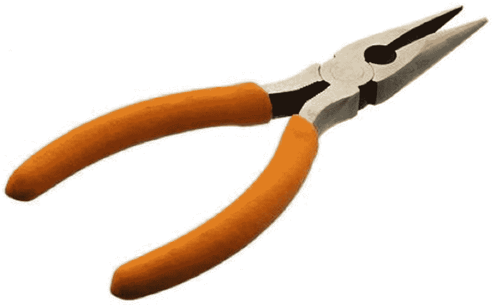

图 4-3

尖嘴钳

没有普通的钳子，你可能也能逃脱，尽管我不建议你这么做。好好照顾你的钳子，它们也会好好照顾你。用一把有缝隙或不能正确闭合的钳子很难弯曲电线或切断触点。

你还需要一些剥线钳。是的，你可以用钳子上的钳子小心地刻划电线绝缘层并将其剥去，但是当你每次需要电线末端时都必须重复这样做，这很快就会变得乏味。找些剥线钳，省得你头疼。无论是图 4-4 所示的那种还是图 4-5 所示的那种都可以——只要确保你知道如何使用它们。

图 4-5

剥线器，版本 2

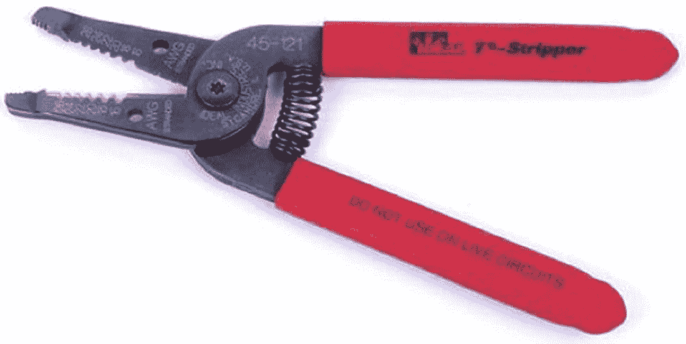

图 4-4

剥线钳，版本 1

我实际上两者都用，因为虽然我很高兴能够在图 4-4 所示的线对中选择我的线尺寸，但我经常遇到不适合该型号任何预定尺寸孔的奇数尺寸线。这就是图 4-5 所示的剥离器发挥作用的地方。这些工具使用起来要快得多，如果你一次剥开很多电线，你会体会到它的速度和方便。

### 钢丝钳

你需要两种类型的刀具:普通刀具(图 4-6 )和精细刀具(图 4-7 )。

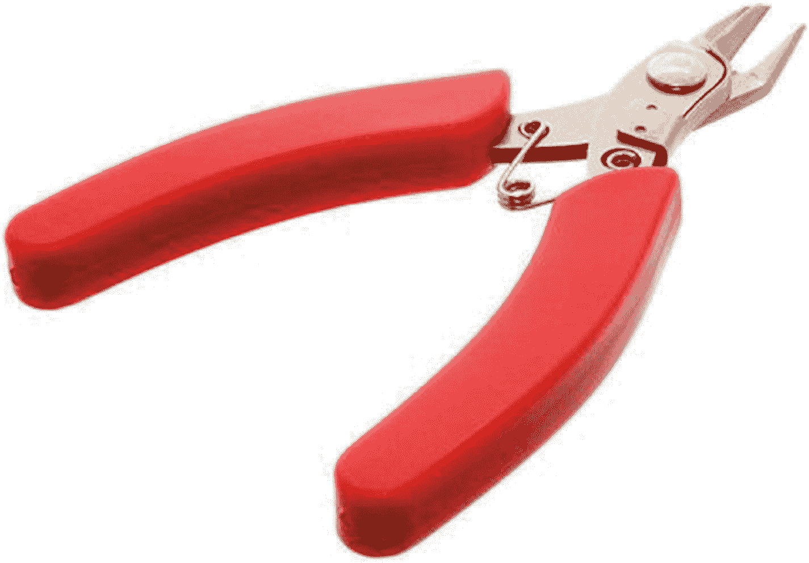

图 4-7

细钢丝钳

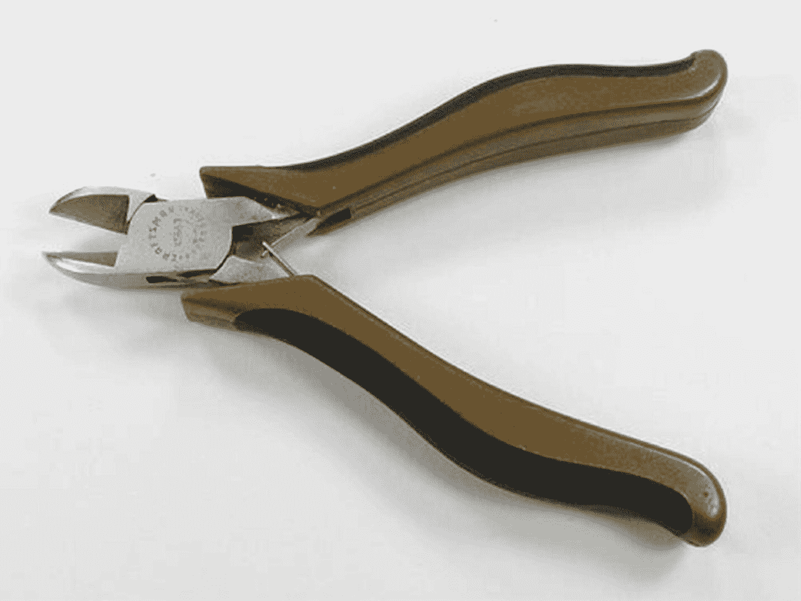

图 4-6

剪钳

常规尺寸的刀具非常适合日常工作，但是当你必须剪断微小的断裂焊点或 24 号线的磨损末端时，较小的刀具是非常宝贵的。

### 文件

当涉及到锉刀时，你不需要任何花哨的东西，只需要一套具有不同*切口*或粗糙度的小锉刀。较细的切口可用于在焊接前使接头变粗糙，或者在将导线插入试验板之前从导线末端去除一点焊料，而较粗的切口可用于重塑金属和塑料外壳、增加孔的尺寸以及各种其他任务。

### 放大镜

你将与许多非常小的物体打交道，从电阻到电线到伺服连接，你的眼睛很快就会疲劳。一盏内置放大镜的可调节台灯是非常有价值的投资。我使用的是专为珠宝商和珠饰商设计的，当我试图处理微型作品时，它的作用是不言而喻的。(参见图 4-8 。)

图 4-8

放大镜

### 热胶枪

在某些情况下，你需要将一些东西粘到其他东西上，比如将一个伺服系统粘到另一个伺服系统上，或者将印刷电路板(PCB)粘到机器人的平台主体上，而使用螺钉或螺栓可能并不可行。最好的方法之一是用热胶枪。忽略剪贴簿和纸板/通心粉设计的耻辱，得到一个好的胶枪。热熔胶在各种应用中的效果令人惊讶——木材与塑料、塑料与塑料、木材与金属等等。

### 各种胶水

说到胶水，你可能会想买一种其他的非热胶枪胶水。强力胶是必备的(不过要买名牌的，不要买商店里的牌子)，建模水泥也是。我还储备了五分钟环氧树脂和橡胶胶水，最近发现大猩猩胶水是迄今为止最棒的胶水之一。你可能还会发现这些冷焊棒的用途——将两种类似油灰的物质混合在一起，形成一种“粘土”，硬化成钢铁般的稠度。

将磁带也添加到该列表中；准备一些普通的透明胶带、双面胶、遮蔽胶带、绝缘胶带，当然还有管道胶带。

### 万用表

万用表测量电路的不同方面——某些点上的电压、电流和电阻(见图 4-9 )。你是得到一个模拟还是数字版本取决于你，但准备花一点钱，因为一个好的万用表是一个非常有价值的工具。它可以用来跟踪电路短路，确保您使用正确的电压，并计算出电路中两点之间存在多大的电阻。

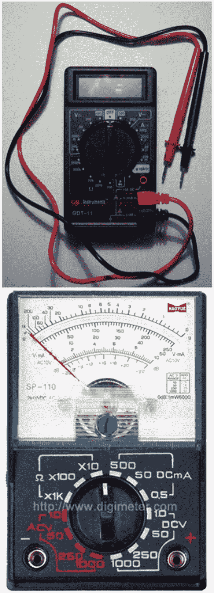

图 4-9

模拟和数字万用表( [`www.digimeter.com`](http://www.digimeter.com) )

当选择你的万用表时，确保它能测量交流和 DC 电压水平，因为在某些时候你可能会同时使用这两种电压。它应该能够测量电阻和连续性以及电流。当你试图追踪系统中的电线或短路时，两点连接时发出声音的仪表非常有用。然而，最重要的特征是易用性。如果你不知道如何使用万用表，你就不会使用它，你就浪费了一个重要的工具。所以，买一个你喜欢的，对你有意义的，然后花些时间学习如何使用它。

### 电力供应

当涉及到为您的实验和项目提供动力时，有几种不同的途径可供您选择。显然，您将经常使用电池或电池组，我将针对每个具体项目讨论这些内容。然而，当涉及到为原型供电或只是确定特定配置是否工作时，你不能错过壁式电源——目前几乎所有电子设备都配备的交流 DC 转换器。

你可以在我推荐的电子商店买到可调节的壁疣，但是你也可以去当地的旧货店。在电子产品后面的某个地方，你可能会发现一个装满废弃电源的箱子，每个大约一美元。您可以切断连接器，这样就可以直接将其插入您的试验板，或者使用如图 4-10 所示的适配器。

图 4-10

电源插头适配器

每当我看到电源时，我都会捡起来，或者当我把设备扔在家里时，我会保留它们，所以我有一个相当好的分类。尝试找到至少 9V 和 12V 的不同额定电流，因为它们是常见的电压源。例如，如果你的设备在 12V 电源下运行良好，这意味着它在你的车上也可能运行良好。如果你碰巧遇到一个不常用的电源，比如交流到交流的变压器，一定要保留它——它可能会派上用场！

### 面包板

在开始焊接和永久化之前，当你把电子设备组装在一起，看看一切是否正常工作时，试验板是另一个必须拥有的东西。你可以全力以赴，用一个有电源连接和仪表以及各种铃铛和哨子的豪华模型(如图 4-11 所示)。

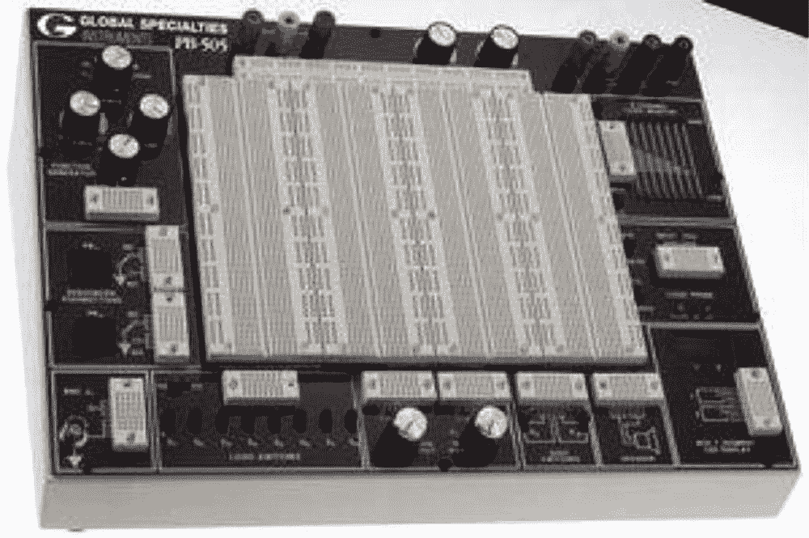

图 4-11

原型试验板设置

或者你可以选择一个更老派的版本，如图 4-12 所示。

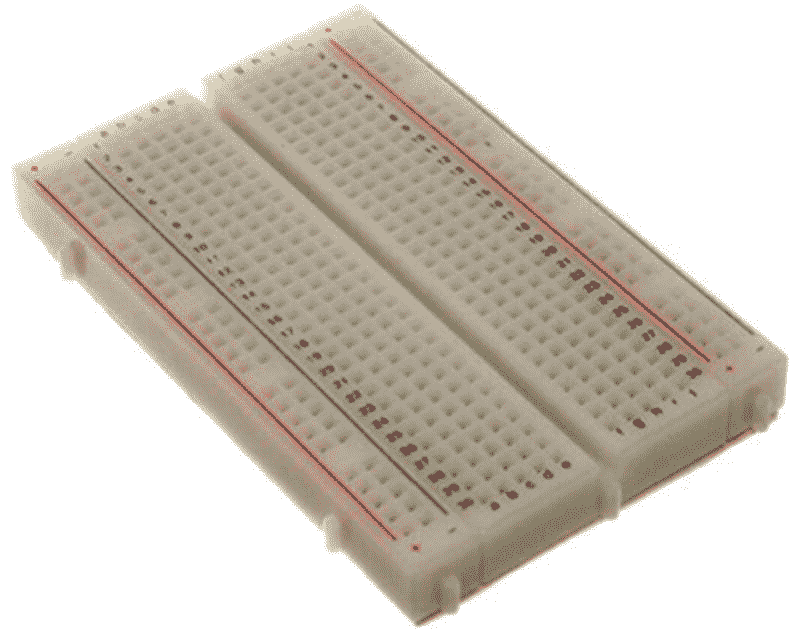

图 4-12

模拟试验板

无论哪种方式，只要确保可以将电阻和 IC 等器件插入其中，并且可以使用跳线连接这些器件即可。随着你技能的提高和兴趣的多样化，做好准备，有一天你的实验板会看起来像图 4-13 中的图片。

图 4-13

面包板出了大问题

是的，你要调试那团电线，不，我帮不了你。但是我同情你——真的。

### 工具

你需要一个电源板，但不需要任何复杂的东西。把你所有的电子产品——台灯、烙铁、Pi 等等——都插在一个电源上是个好主意，这样你就有了一个安全的方法，可以在需要的时候中止。一按开关，一切都停止了。如果可以的话，买一个内置电涌保护器的。

### 烙铁

你清单上的另一个关键工具应该是烙铁，这是一个你不应该吝啬成本的东西。你可以在当地百货商店买到的 9.99 美元的烙铁可能适合修补房子周围的一些电路，但如果你是一个认真的建筑者/爱好者，你需要一个高质量的可调烙铁。我有一把威勒 WES51(如图 4-14 )。

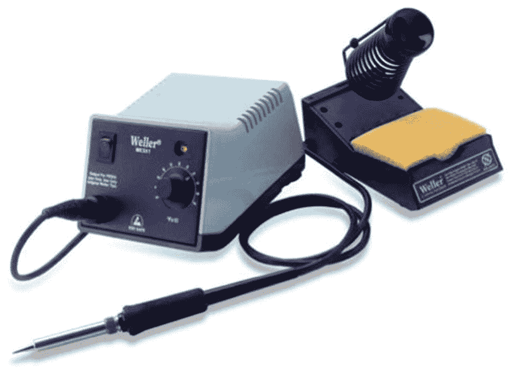

图 4-14

焊接站

这无疑是我电子职业生涯中花得最值的 100 美元。买一个带支架、可调节热度和可以互换小费的。相信我:当你可以使用正确的温度使焊料熔化而不熔化你的电路，或者当你可以使用均匀的热量来消除一个坏的焊点时，你的项目将会感谢你。

当你买熨斗的时候，也买一些焊接附件。吸钎器(一种从焊点移除熔化焊料的手持式真空泵)是必备工具，辅助工具也是必备工具(见图 4-15 )。

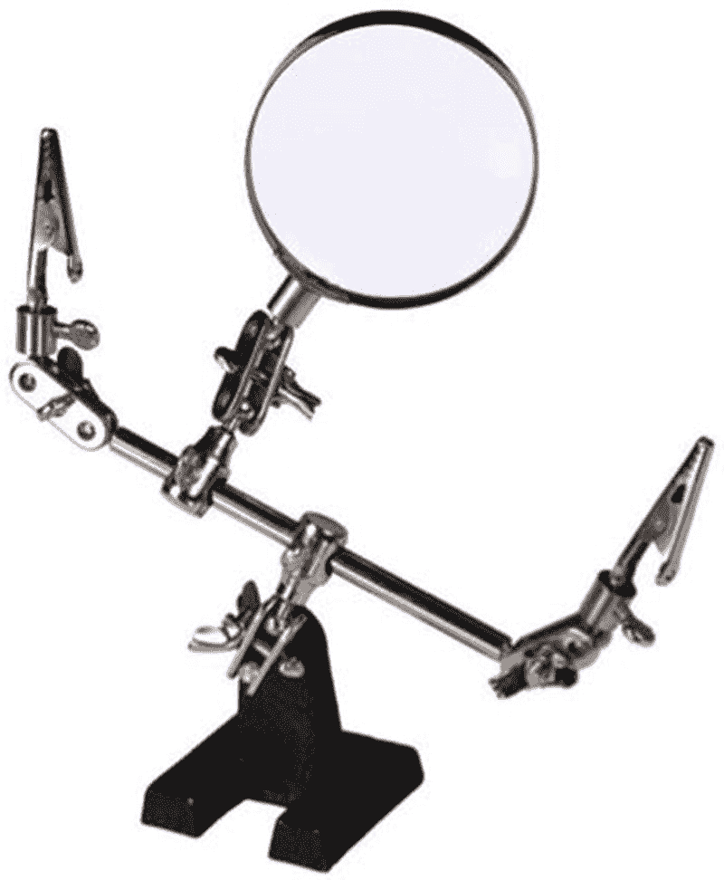

图 4-15

助人工具

当你需要两只手握着一个接头，另外两只手焊接那个接头，而你又烧伤了你妻子的手指*很多次*而你的孩子又无处可寻时，一个帮助的工具就非常方便了。你甚至可以用硬铁丝、鳄鱼夹和一个木架来制作自己的东西。

## 一般安全规则

在这里我可以像你妈妈一样问你是否安全。毕竟，尽管我们在本书中构建相对无害的项目，但您仍然要处理一些可能严重伤害您的组件。例如，烙铁的尖端平均温度约为 450 华氏度，热熔胶，即使是低温胶，也能在 250 华氏度左右融化。当然，编程是一项相当无害的活动，但你也会进行切割、钻孔、打磨以及其他任何可能对你造成严重伤害的工作。所以，请认真对待这次安全讲座。

### 加热工作

时刻记住，你周围都是会变得很热的工具和组件，你应该记住它们是什么，并相应地对待它们。不仅烙铁是热的，而且你正在使用的焊料在 350 华氏度左右熔化，这意味着你刚刚焊接的部分是*热的*！在触摸它之前，给它几秒钟冷却，看看你的关节是否牢固。等到你的热胶水冷却到至少凝胶状的状态，再去触摸它。从个人经验来说:热胶水最糟糕的地方是，当你把它粘在手指上时，你不能把它抖掉。相反，它会留在你的手指上，然后*发出嘶嘶声*。

### 处理尖锐物体

这应该是不言而喻的，但当涉及到您的切割工具时，遵循良好的安全实践也是必要的。这意味着:

*   从你的身体上切掉。

*   保持你的工具锋利。

向自己砍去，即使是轻轻的或者很小的一刀，都是自找麻烦。用 X-ACTO 刀滑了一下，你可能会切腹自杀，或者至少去急诊室缝针。相信我，缝针一点都不好玩，尤其是当医生在伤口注射麻醉剂的时候。如果你完全失去一根手指，机器人实验将立即变得更加困难至少 10 %,因为你将只有 9 根手指而不是 10 根——立即减少 10%。

保持刀刃锋利，因为任何厨师都知道，钝刀是一把危险的刀。如果你的美工刀变钝了，换一个新的。同样的事情也适用于你的 X-ACTO 刀片。一把钝刀片更有可能滑倒并割伤你，而一把锋利的刀只会在你正在砍的东西上割得更深。

### 佩戴安全眼镜

准备一副安全眼镜或护目镜。这是没有商量余地的——如果你没有一双，在做任何实验之前先买一双。你的视力太重要了，不能因为你的钢丝钳上的一个金属飞点或者你的砂轮上的一个火花而失去它。如果你有一双不舒服的，那就换一双——如果合适，你更有可能穿上它们。我更喜欢安全眼镜，但许多人更喜欢用松紧带固定在头上的护目镜，因为它们不会脱落。无论你喜欢哪一种，都要小心保管，以避免划伤和破损，并且在工作时佩戴它们。

### 准备好灭火器

我给你讲个小故事吧。当我用 Pi 制作我的第一个小移动机器人时，我第一次使用锂聚合物(LiPo)电池。这是一个 11.1 伏，1300 毫安时的小电池。我把它连接到我的伺服电机上，我设法用鳄鱼夹把正负极短接在一起。

紧接在响亮的*砰砰声之后！和火花，包装开始迅速升温，包装开始膨胀。我尽可能快地思考，设法断开鳄鱼夹，把包扔到地板中间，并把一杯水泼到电池上。我侥幸躲过了一次爆炸，后来我发现那些脂肪电池威力很大。*

这个故事的寓意是，虽然我用了一杯水，但我身边有一个灭火器，如果需要的话，我随时可以使用，你也应该这样做。它们并不贵，而且当谈到可能从火灾中拯救你的房子或车间时，它们是非常值得的。准备一个灭火器，并确保它充满电。

另外，在你需要灭火器之前，一定要学会如何使用它。想象一下，当你在阿拉斯加的野外徒步旅行，需要避开一只熊的时候，它就像是熊喷雾。你肯定会在徒步旅行前练习使用它，因为在逃离愤怒的灰熊时阅读方向是非常困难的。你的灭火器也是类似的——当你的车间变成一个*高耸的地狱*的翻版时，阅读和遵循说明书会非常困难。熟悉它，希望你永远不会用到它。

### 手边放一个急救箱

尽管这是不言而喻的，但你要在身边准备一个急救箱。你不需要一个完整的 1 级应急装备包来进行南极探险，但是一个小的、储备充足的装备包应该在附近的某个地方。工具包里应该有一些创可贴、酒精、棉签，也许还有一些其他零碎东西。当你全身都是血时，很难焊接起来。

### 在通风区域工作

工作时要记住的一个重要细节是保持工作间通风良好，因为你很可能会进行打磨、油漆、锯木和其他各种可能使空气(和肺部)充满危险物质的活动。举例来说，你可能没有刷足够多的油漆来担心油漆味，但是你肯定会接触到焊料味。焊料含有铅——不多，但有一些——而且铅是有毒的。如果你接触太多太频繁，它会导致铅中毒。症状包括腹痛、意识模糊、头痛和易怒。在严重的情况下，它会导致癫痫发作甚至死亡，这两种情况都不利于进一步的机器人实验。

尽管你不太可能在焊接时接触到足以毒死自己的铅，但要知道它是有毒的。不要吸入烟雾，在接触焊接部件后，要经常彻底洗手。你应该在通风良好的地方工作，开着窗户，或者至少开着风扇。一些实验者将一个旧的电脑风扇连接到一个干燥通风软管上，以定制一个除烟解决方案。

### 组织你的工作场所

随着你通过购买额外的工具、零件、芯片、电路板等等来进行实验，你将需要一种方法来组织这一切。保持你的工作区域有条不紊也很容易安全，因为把所有东西都整齐地存放在原处也可以消除工作场所的危险。

至少，买几个不同尺寸的三明治袋子，这样你就可以把不同的部分分开，但是当你过了不能回头的时候，看看储存的方法。我在当地工艺品商店的串珠区运气不错，因为许多电子零件都和珠子差不多大。我的一个存储区如图 4-16 所示，而另一个存储区如图 4-17 所示。

图 4-17

项目存储区

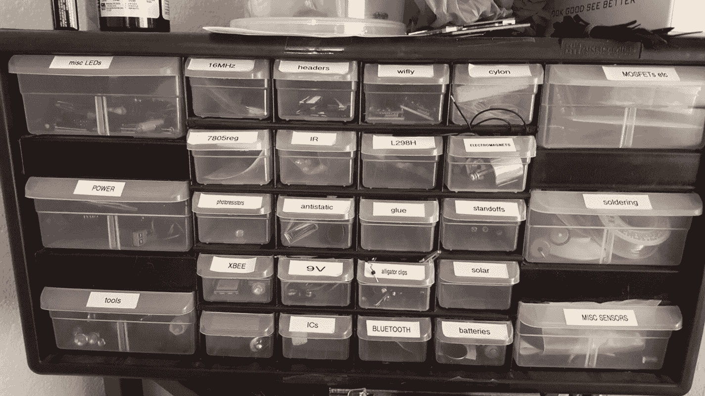

图 4-16

小型零件储存区

注意标签；给自己买个标签制作机吧！很容易，这是我最好的一次购买——你可以给抽屉、电源、电线、孩子贴上标签。。。可能性是无限的。此外，一旦你开始着手并同时有多个项目在进行中，你会发现按项目而不是按部分来划分更容易，至少有时是这样。有些东西，比如开关，到处都在使用，但是我知道当我再次攻击我的时间喷泉或者做更多的光画的时候，我可以在那些各自的盒子里找到我一直在使用的所有部件。

我必须在这里补充一点，当谈到组织一个商店时，特别是在工具方面，可以看看亚当·沙维奇在 YouTube 上的*测试*系列。在许多视频中，他解释了如何整理工具，以及如何建造(如果有必要的话)存放设备的容器。它鼓舞人心，一定会给你很多灵感，即使你只是利用厨房后面的一个小角落。

总的来说，保持你的区域干净就行了。不仅在它们应该在的地方找到它们更有效率，而且在拿着 X-ACTO 刀时被电源线绊倒可能是一个危险的事件。把你的工具或零件从原处拿走，使用它，然后放回原处。(这是另一个你可能必须照我说的做，而不是照我做的地方。在整本书中，你会看到我工作空间的照片，我不能保证它永远是最整洁的地方。当我工作时，我倾向于散开。但是你明白了。)

## 奖励:焊接技术

在这最后一节介绍电子章节，我会给你一些提示如何焊接。焊接是一门艺术，也是一项技能，它需要练习。如果你以前从来没有焊接过，你的第一个接头肯定是凹凸不平的，丑陋的团块，但是如果你坚持下去，改善会很快。当你在一个真实的项目中完成时，仅仅花几个小时将元件焊接在一起的练习就能产生巨大的不同。

焊接基本上分为四个步骤:准备表面，必要时上锡，连接零件，加热:

1.  准备好你的 **面**。如果你要连接电线——连接到其他电线或另一个表面——剥去最后半英寸左右的绝缘层，将线束缠绕在一起，形成一个紧凑的线束。其他金属部件可能需要清洁，如果是特别光滑的表面，用砂纸打磨可能有助于焊料更好地附着在上面。

2.  **必要时上锡**。在一个表面上镀锡就是在你把它粘在另一个表面上之前在上面熔化一点焊料。例如，在将电线连接到 IC 引脚时，这是一个很好的实践。给电线上锡时，用烙铁从底部加热，然后将焊料保持在顶部。当电线变得足够热时，焊料就会融化进去。

3.  **连接零件**。如果可以的话，用机械方式连接这些部件——将电线缠绕在一起，将电线缠绕在 IC 引脚上，等等。如果这是不可能的，这就是你的帮助工具发挥作用的地方——用它来把各部分结合在一起。

4.  **热度** **零件**。用一个*清洁的*烙铁头，加热焊点，同时将焊料保持在焊点上。当连接足够热时，焊料会熔化并流到接头上。

最后一步可能是最重要的。你的熨斗尖应该是干净的；养成习惯，每当你吸完一口，开始吸另一口之前，用湿海绵擦拭。干净的尖端会更好地传热。你还应该加热接头，而不是焊料。*不要*将焊料熔化到烙铁的尖端，然后涂抹到连接处——你可能会产生冷焊点(如图 4-18 )，这最终肯定会失败。记住:加热零件，而不是焊料。如果你很难将焊点加热到足以让焊料熔化，你可以在接触焊点之前在烙铁顶端熔化一点焊料，因为焊料会更有效地传递热量。你应该得到一个看起来像图 4-19 中的关节。

图 4-19

良好的焊点

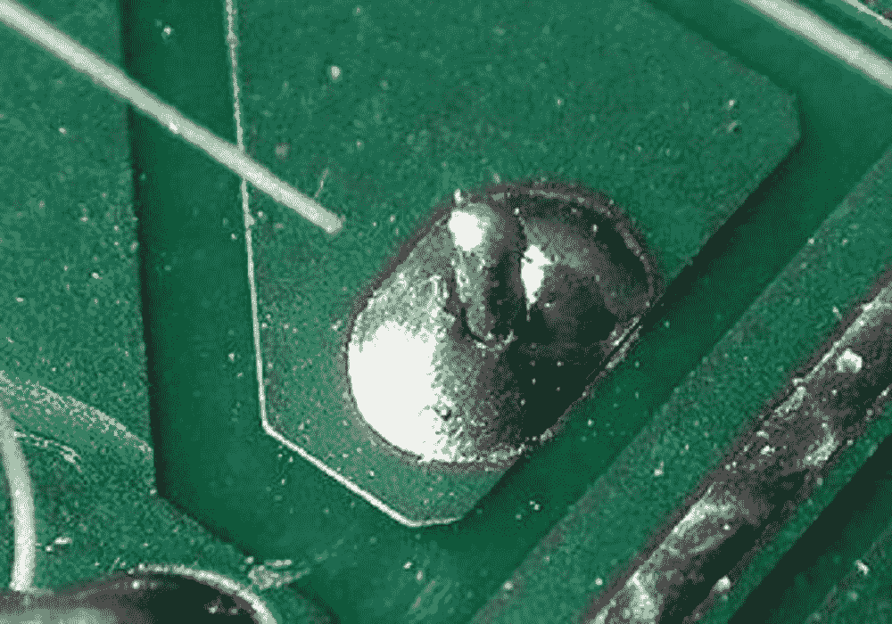

图 4-18

冷焊点。注意不良连接。

同样，不要过分强调你的焊接技能或缺乏焊接技能。稍加练习，你就会像专家一样焊接电路。

除了动手之外，也许学习焊接的最好方法就是观看，YouTube 的魔力让这成为可能。快速搜索“如何焊接”会出现 30 多万个结果。我不能挑出任何两三个突出的，但如果你看一些，你应该得到的想法。Makezine 是一个信息量惊人的在线博客，它有一个很好的页面，上面有学习如何焊接的资源。它位于 [`http://makezine.com/2006/04/10/how-to-solder-resources/`](http://makezine.com/2006/04/10/how-to-solder-resources/) 。

## 摘要

在了解了一些基本的电学原理后，你了解了实验室中一些常见的电子工具，并了解了如何安全使用它们的基本知识。我还向您介绍了焊接，并为您指出了一些可以帮助您更好地学习焊接的资源。

让我们带上工具，进入项目，从一个不需要任何工具的简单项目开始 WebBot。