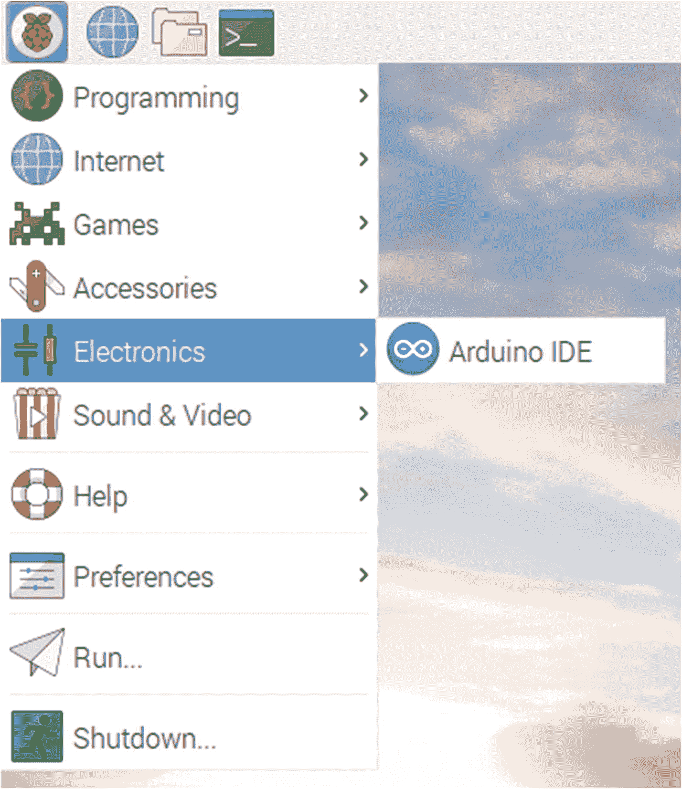
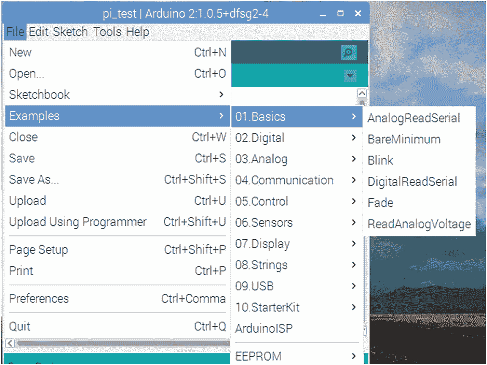
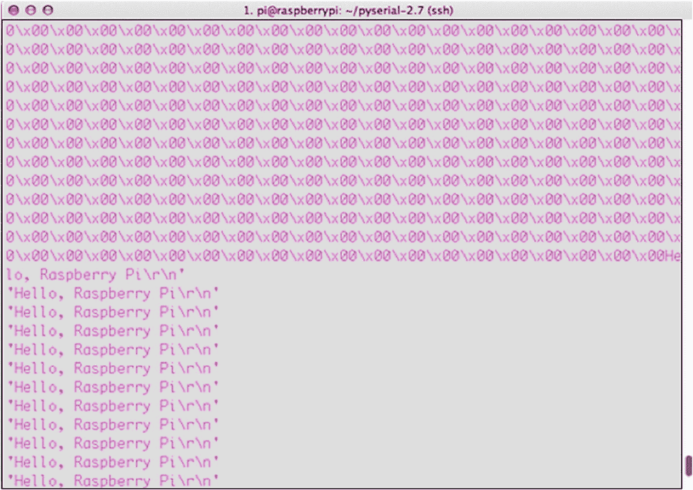

# 十三、树莓派和 Arduino

花生酱和果冻。蝙蝠侠和罗宾。哲基尔博士和海德先生。有些东西是注定要在一起的，从我们第一眼看到这个组合的那一刻起，我们就知道了。树莓派和 Arduino 就是这种情况。许多爱好者和工程师(包括我)一直在项目中使用 Arduino，但他们希望有一个尺寸类似的设备，只是功率多一点。嗯，我们的愿望随着 Pi 的出现而实现了。它比 Arduino 有更强的处理能力(Arduino 只是一个微控制器)，它有一个完整的 ARM 处理器——在新的 Pi 3 中相当于四个内核。这显然是一个完美的匹配，自从 Pi 首次亮相以来，我们就一直在一起使用这两者。

当然，消费者微处理器板市场上还有 Arduino 的其他替代品。一个流行的选择是 Beagleboard，这是一种基于 ARM 处理器的板，也运行不同版本的 Linux，包括 Angstrom 甚至 Ubuntu。然而，它更像 Pi 而不是 Arduino，另一个缺点是它 100 美元的价格标签。Parallax 也推出了一些 prosumer 级的主板，如内置试验板的八处理器 Propeller，但同样，它更类似于 Pi 而不是 Arduino，截至目前，售价为 129 美元。其基本的微控制器产品线自 20 世纪 80 年代初就已出现，但从未像 Arduino 那样达到市场饱和。自 Pi 推出以来的几年里，其他各种各样的板也相继推出，取得了不同程度的成功，比如 Pine64 和 BBC 的 micro:bit(我在另一篇文章中也提到过)。

然而，这些主板中没有一个获得了接近 Arduino 的成绩。围绕这种流行的小板子，以及普通人可以用它做的不可思议的事情，一种完整的文化已经兴起。有很多很多的书籍、网站、论坛和团体致力于它的项目，所以我不会在这里重复这些来源。然而，关于 Arduino 与 Raspberry Pi 接口的信息却少之又少。Pi *是一台基于 Linux 的计算机，因此完全能够运行 Arduino 软件。在这一章中，我将带您安装该软件，并创建一两个简单的项目，这些项目只在 Pi 和 Arduino 上运行——不需要桌面计算机。*

## 探索 Arduino

对于那些不熟悉 Arduino 的人来说，Arduino 是一种流行的微控制器技术实现，它的封装使外行人可以轻松地编程，并用一些复杂的电子设备完成复杂、有趣的任务。对于只想*制作*东西的人来说，这是个福音；用于 Arduino 编程的集成开发环境(IDE)几乎可以在任何计算机上运行，编程语言非常像 C 语言，而且——也许是最好的——该板价格低廉，大多数 Arduino 版本的价格不到 30 美元。

Arduino 有几个版本，从微小的 Arduino Nano 到大得多(也是最受欢迎的)的 Arduino Uno(如图 13-1 所示)和 Mega。所有的板都有一个 Atmega168 或 328 芯片作为它们的中央处理器，它们有一个串行转 USB 芯片，使它们能够与你的计算机通信。它们有一系列跳线，类似于 Pi 上的 GPIO 引脚，但大多数是母插座而不是公引脚。


图 13-1

Arduino Uno

在普通电脑上使用 Arduino 是一个简单的过程，首先从项目的主网站 [`http://www.arduino.cc`](http://www.arduino.cc) 下载适合您电脑的 IDE 版本。安装完成后，你可以打开一个新的 Arduino 程序，称为“草图”，并立即开始与连接到主板的硬件进行交互(参见图 13-2 )。


图 13-2

典型的 Arduino 草图

在图中，您可以看到用于与伺服接口的代码；您包括了`Servo.h`库，创建了一个名为`myservo`的伺服对象，然后向该对象写入值以移动它。类似地，例如，要点亮一个 LED，您只需将一个特定的引脚设置为输出，然后向其发送“1”或“0”值，分别打开或关闭连接的 LED。正如我之前提到的，你可以看到它不是 Python 代码。行以分号结束，代码块用括号而不是缩进来描述。

Arduino 设置的另一个很好的特点是，你可以将 Atmega 芯片从电路板上取下，并在一个独立的试验项目中使用它。换句话说，假设你想在 Arduino 上设计一个电路，它将使用伺服系统和电机来打开和关闭你家的宠物门。你可以在你的 Arduino 板上编写和测试程序，然后你可以把芯片放在你的独立电路中。然后，你可以用 Atmega 的另一个芯片(成本约为 3 美元)替换板上的芯片，将 Arduino bootloader 刻录到芯片上，然后继续编程。每次设计新电路时，您不必使用整个 Arduino。

## 在 Pi 上安装 Arduino IDE

在 Pi 上安装 Arduino IDE 很简单，只需打开命令行并键入

```py
sudo apt-get install arduino

```

系统将提示您接受所有必需的依赖项，然后 IDE 将下载并安装。

当它完成时，你需要安装`pyserial`——一个 Python 库，它使得通过串行接口与 Arduino 通信变得容易。打开您 Pi 的互联网浏览器(菜单栏中的地球图标)并浏览至 [`http://sourceforge.net/projects/pyserial/`](http://sourceforge.net/projects/pyserial/) 。点击“下载”按钮并保存文件。这是一个 gzipped tar 文件，这意味着您必须解压缩它。回到您的终端，浏览到文件的位置(`/home/pi/Downloads/`)并通过输入

```py
gunzip pyserial-2.7.tar.gz
tar -xvf pyserial-2.7.tar

```

您将拥有一个名为`pyserial-2.7`的新文件夹。使用`cd`导航到该文件夹，并通过键入

```py
sudo python setup.py install

```

### 注意

本节描述的过程是安装基于 Python 的库时的常规过程。`setup.py`是用来安装类似这样的 Python 库的常用脚本，它需要`install`参数才能运行。如果你正在安装一个系统范围的模块(换句话说，一个不需要你在同一个目录下运行它的模块)，在它的解压文件夹中，你通常会找到一个名为`build`的文件夹和一个名为`setup.py`的文件。你不需要对`build`文件夹做任何事情，因为`setup.py`脚本为你做了一切。使用`sudo`(您将更改系统级文件，因此您需要以 root 用户身份执行脚本)，在您的终端中键入`sudo python setup.py install`，脚本将安装该模块。

该库现在可供您在任何 Python 脚本中使用。

为了测试它，我们必须写一些 Arduino 代码。请耐心听我说，我将带您浏览一遍，因为这对您来说可能是新的。打开您的 Arduino IDE(如图 13-3 所示)，在出现的草图窗口中，键入以下代码:

```py
int ledPin = 13;
void setup()
{
    pinMode(ledPin, OUTPUT);
    Serial.begin(9600);
}

void loop()
{
    Serial.println("Hello, Raspberry Pi!");
    delay(1000);
}

```



图 13-3

在 Pi 上打开 Arduino IDE

这个脚本的第一行将变量`ledPin`设置为一个数字 13。下面的`setup()`功能将引脚 13 设置为输出，然后打开与串口的通信。最后，`loop()`函数(这是每个 Arduino sketch 的主程序循环)每 1000 毫秒(1 秒)将字符串`"Hello, Raspberry Pi!"`打印到串口。保存草图并将其命名为`pi_test`。

现在，使用 Arduino 的 USB 电缆将 Arduino 连接到您的 Pi。请记住:虽然它是一根 USB 电缆，但 Pi 实际上将通过串行协议进行通信，因为 Arduino 有一个板载 USB 到串行转换器。当 Arduino 的绿色电源灯亮起时，您需要从 Arduino IDE 的工具菜单中的可用板中选择它(参见图 13-4 )。


图 13-4

选择您的 Arduino 主板

在你上传你刚刚写的`pi-test`脚本之前，最好确保你的电路板连接正确，并且你可以上传一个草图。为此，让我们运行 Arduino IDE 附带的“Blink”草图。从“文件”菜单中，选择“示例➤ 01”。基础➤眨眼(见图 13-5 )。眨眼草图将在一个新窗口中打开，这样您就不会丢失您为`pi-test`草图所做的工作。闪烁草图只是简单地闪烁 Arduino 的嵌入式 LED，它通常用于确保您的设置中的所有内容都配置正确。



图 13-5

加载眨眼草图

加载闪烁草图后，从“文件”菜单中选择“上传”(或单击工具栏中的向右箭头图标),等待 IDE 编译闪烁草图并将其上传到您的主板。当 Arduino 窗口显示“上传完成”时，Arduino 上的红色 LED 应该会缓慢闪烁。如果没有，请仔细检查您的连接，然后再次尝试上传。您可能会收到一条错误消息，指出找不到您选择的 COM 端口，并询问您是否要选择另一个端口。记下建议的端口(稍后您将使用该信息)，选择它，并上传您的草图。

一旦你知道你的连接是正确的，切换到`pi_test`草图并上传到 Arduino。

编译并上传草图后，在新的终端窗口中，启动 Python 会话并键入以下内容:

```py
>>> import serial
>>> ser = serial.Serial('/dev/ttyUSB0', 9600)

```

在这里，您导入了`serial`库，并通过 USB0 端口以 9600 波特开始通信，这是我们放在 Arduino 代码中的值。如果您必须在之前的连接协议中使用不同的端口，请使用该端口。例如，您可能需要将第二行改为

```py
>>> ser = serial.Serial('/dev/ttyACM0', 9600)

```

如果您必须使用`/dev/ttyACM0`端口进行连接。

现在我们可以从串行设备——Arduino——读取数据，我们告诉它每秒传输一次。继续 Python 会话，输入

```py
>>> while True:
...       ser.readline()

```

按两次回车键结束`while`循环，你的终端应该立即充满文本，如图 13-6 所示。当你厌倦了看着`"Hello, Raspberry Pi\r\n"`行每秒填充时，按 Ctrl+C 退出正在运行的`while`循环



图 13-6

从 Arduino 的串行端口读取

所以，我们现在已经确定我们可以*通过串行连接从 Arduino 读取*。让我们假设我们也可以用*写*给它。返回 Arduino `pi-test`草图，将`void loop()`功能更改如下:

```py
void loop()
{
    if (Serial.available())
    {
        flash(Serial.read()—'0');
    }
}

```

这段代码告诉 Arduino，如果它能够从串行连接中读取第一个接收到的整数(0)，并将其作为参数发送给下面的`flash()`函数。完成`loop()`功能后，在草图中输入以下内容:

```py
void flash(int n)
{
    for (int i = 0; i < n; i++)
    {
        digitalWrite(ledPin, HIGH);
        delay(100);
        digitalWrite(ledPin, LOW);
        delay(100);
    }

}

```

该函数使 Arduino 的板载 LED(硬连线至其引脚#13) `n`闪烁一定次数，该次数作为参数传递给它。正如你所看到的，这个概念类似于 GPIO 的输出功能；首先你声明这个管脚是一个输出，然后你写一个高或低的值来打开或关闭它。再次保存草图，并将其重新上传到 Arduino 板上。然后，回到您的终端，在同一个 Python 会话类型中

```py
>>> ser.write('4')

```

你应该会得到 Arduino 的板载 LED 闪烁四次的奖励。用不同的号码试一试，确保有效。但是请记住，Arduino 被设置为只读取发送给它的第一个整数。如果你打字

```py
>>> ser.write('10')

```

它会闪一次，而不是 10 次。

恭喜你！你现在可以从你的 Raspberry Pi 读写你的 Arduino 了！

## 运行伺服系统

不可否认的是，使用 Arduino/Pi 组合时，闪烁 LED 并不是最令人印象深刻的操作。我的主要目标是教你如何让这两个设备进行通信，可能的用途和含义由你自己决定，但是让我们来讨论如何与连接到 Arduino 的伺服系统进行通信。

事实上，我们需要做的只是稍微修改我们的 LED 代码，使之与伺服系统而不是 LED 接口。清除`pi_test`草图中的文本，并替换为以下内容:

```py
#include <Servo.h>
Servo myservo;

void setup()
{
    myservo.attach(9);
    Serial.begin(9600);
}

void loop()
{
    if (Serial.available())
    {
        drive(Serial.read()—'0');
    }
    delay (1000);
}

void drive (int n)
{
    if (n < 5)
    {
        myservo.write(50);
    }
    else
    {
        myservo.write(250);
    }
}

```

这段代码接受您在 Python 提示符中输入的整数，根据它的值将其转换成一种或另一种速度，然后将该值作为速度写入伺服系统。为了测试它，把你的伺服系统的电源线挂在 Arduino 的 5V 管脚上，地线挂在 Arduino 的 GND 管脚上，信号线挂在 Arduino 的 9 号管脚上。然后，保存代码，将它上传到您的板上，并再次在 Python 提示符下输入不同的

```py
>>> ser.write('5')

```

从 0 到 9 到提示符，看看伺服如何响应。

是的，这是一个非常简单的代码，但希望您理解其中的基本概念。通过 Pi 的串行接口与 Arduino 通信与与 GPS 单元或其他小型分支芯片通信没有什么不同。然而，Arduino 不仅更加智能，而且还具有无限的可扩展性，允许您添加 Pi 允许的任何附加部件，如果不是更多的话。

## 摘要

虽然本章只是简单介绍了如何将 Arduino 与您的 Raspberry Pi 接口，但我希望您现在能够认识到，与 Arduino 之类的另一块电路板进行通信，尤其是通过串行连接进行通信，是一件非常简单的事情，与其他任何设备进行通信没有什么不同。当然，主要的区别是，您可以使用它的 IDE 对 Arduino 进行编程，允许它根据 Pi 提供给它的信息进行操作。同样，Arduino 可以连接传感器，充当传感器网络集线器，并向 Pi 提供信息。这可以让您将一些处理能力卸载到 Arduino，并释放您的 Pi 用于更多处理器密集型任务。

简而言之，Arduino 和 Raspberry Pi 不是相互竞争，而是相互补充。每一个都以不同的方式完成任务，它们可以一起用于项目中的简单操作。花些时间熟悉一下这个界面——你会很高兴你这样做了。