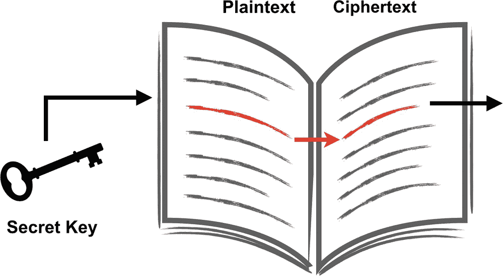
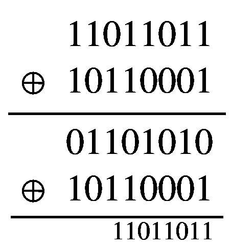
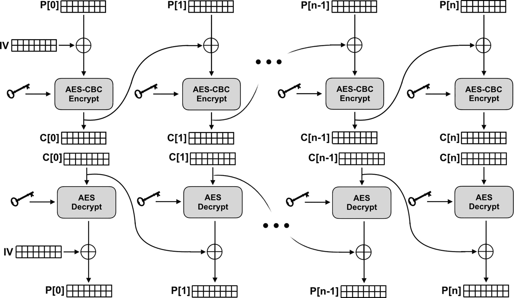
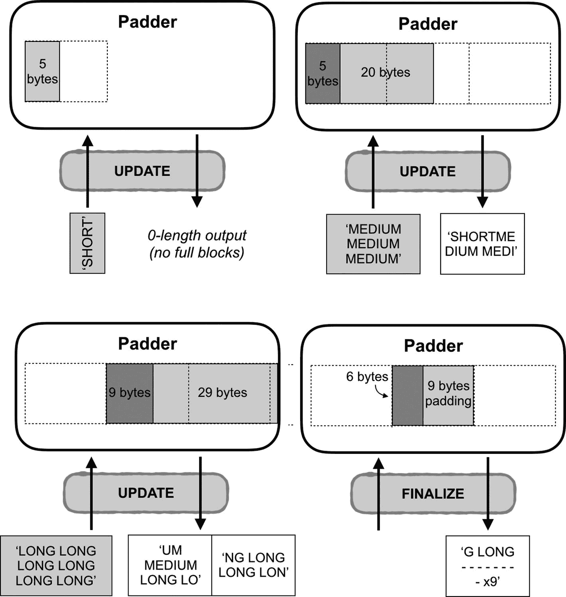
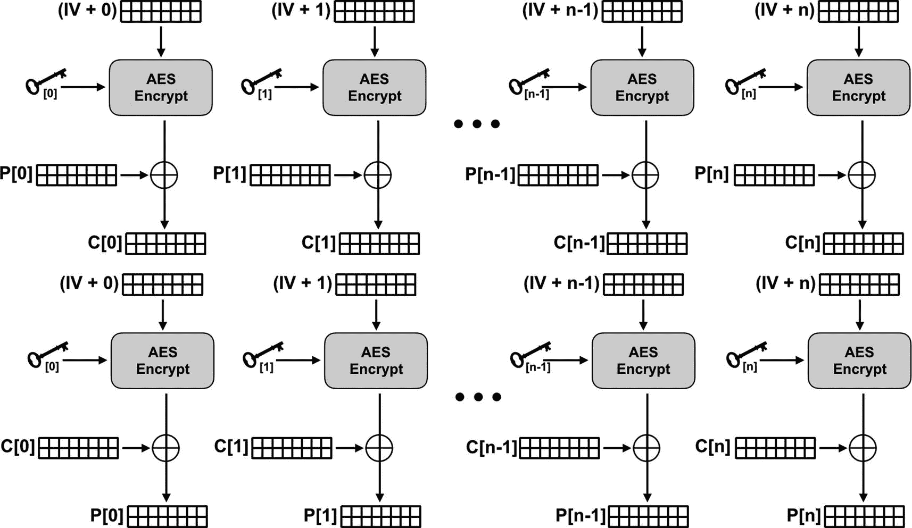
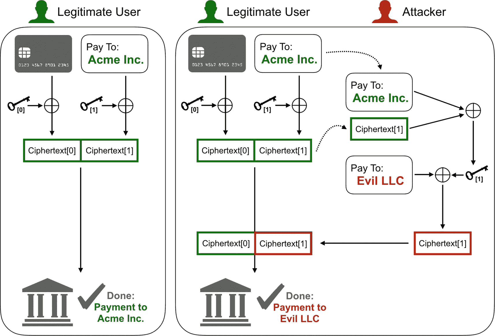
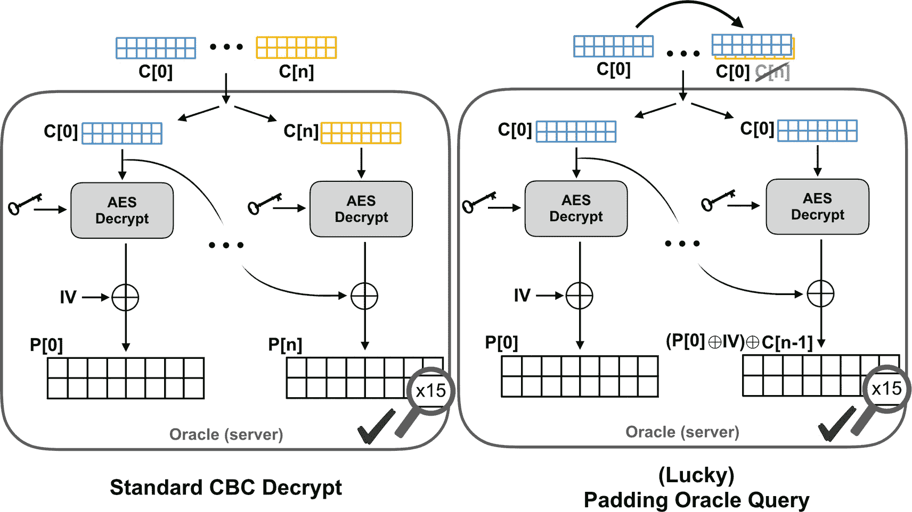
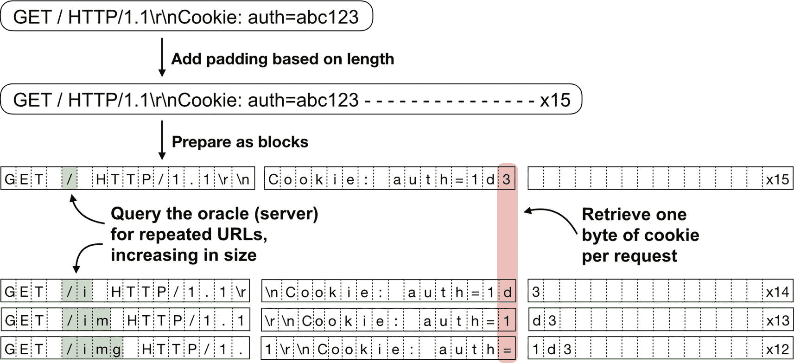

# 三、对称加密：双方，一个密钥

对称加密是所有现代安全通信的基础。我们用它来“扰乱”信息，这样，只有当人们能够使用加密信息的同一密钥时，他们才能解密信息。这就是“对称”在这种情况下的含义:在通信信道的两端使用一个密钥来加密和解密消息。

## 我们抢吧！

不出所料，东南极的反派 <sup>[1](#Fn1)</sup> 又来了，给他们的邻居带来各种麻烦。这一次，爱丽丝和鲍勃正在监视西边的敌军，侦察他们雪球的大小和投掷的准确性。

在早期的任务中，爱丽丝和鲍勃使用第 1 章中的凯撒密码来保护他们的信息。正如你所发现的，这个密码很容易破解。因此，东南极洲真相间谍机构(EATSA)为他们配备了现代加密技术，使用一把钥匙来编码和解码秘密信息。这项新技术属于一种被称为**对称密码**的加密算法，因为加密和解密过程使用相同的共享密钥。他们在这个后外星人时代使用的特定算法是高级加密标准(AES)。<sup>2[2](#Fn2)</sup>

Alice 和 Bob 不太了解如何正确护理和处理不良事件。他们有足够的文档来进行加密和解密。

“医生说我们必须创建 AES 密钥，”爱丽丝拿着一本手册说。“显然，这相当容易。我们这里有样本代码。”

```py
import os
key = os.urandom(16)

```

“等等...真的吗？”鲍勃问道。“就这样？”

爱丽丝是对的:这就是全部！AES 密钥只是随机位:在本例中有 128 位(相当于 16 个字节)。这将允许我们使用 AES-128。

创建了随机密钥后，我们如何加密和解密消息呢？前面，我们使用 Python `cryptography`模块来创建哈希。它还做许多其他事情。让我们看看 Bob——受到创建密钥的便利性的鼓舞——现在如何使用它通过 AES 加密消息。

Bob 从 Alice 那里拿过文档，看了下一节，注意到 AES 计算有许多不同的*模式*。必须在它们之间做出选择听起来有点让人不知所措，所以 Bob 挑选了看起来最容易使用的一个。

“我们用欧洲央行模式吧，爱丽丝，”他从文件上抬起头说。

“欧洲央行模式？那是什么？”

“我真的不知道，但这是*高级*加密标准。应该一切正常，对吧？”

### 警告:欧洲央行:不适合你

我们稍后会发现欧洲央行模式很糟糕，应该永远不使用 T2 模式。但我们现在只能跟着走。

清单 [3-1](#PC2) 有他们用来创建“加密器”和“解密器”的代码

```py
 1   # NEVER USE: ECB is not secure!
 2   from cryptography.hazmat.primitives.ciphers import Cipher, algorithms, modes
 3   from cryptography.hazmat.backends import default_backend
 4   import os
 5
 6   key = os.urandom(16)
 7   aesCipher = Cipher(algorithms.AES(key),
 8                      modes.ECB(),
 9                      backend=default_backend())
10   aesEncryptor = aesCipher.encryptor()
11   aesDecryptor = aesCipher.decryptor()

Listing 3-1AES ECB Code

```

“那还不算太坏，”爱丽丝说。“现在发生了什么？”

显然，加密器和解密器都有一个`update`方法。差不多就是这样。加密器的更新返回密文。

### 练习 3.1。秘密消息

不看其他文档，试着弄清楚`aesEncryptor.update()`和`aesDecryptor.update()`方法是如何工作的。提示:您将会得到一些意想不到的行为，所以尝试大量的输入。考虑从`b"a secret message"`开始，然后解密结果。

爱丽丝和鲍勃开始尝试找出`update`的方法。也许是受到上一章哈希的启发，在那里他们哈希自己的名字，他们尝试在一个交互式 Python shell 中加密自己的名字。爱丽丝先来。

这里的 AES 示例代码使用了键`b"\x81\xff9\xa4\x1b\xbc\xe4\x84\xec9\x0b\x9a\xdbu\xc1\x83"`，以防您想要获得相同的结果。

```py
>>> aesEncryptor.update(b'alice')
b''

```

“我没有收到任何密文，”爱丽丝抱怨道。“我做错了什么？”

“我不知道。让我试试，”鲍勃回答。

```py
>>> aesEncryptor.update(b'bob')
b''

```

“我也是，”他困惑地说。出于沮丧，他又试了几次。

```py
>>> aesEncryptor.update(b'bob')
b''
>>> aesEncryptor.update(b'bob')
b''
>>> aesEncryptor.update(b'bob')
b'\xe7\xf9\x19\xe3!\x1d\x17\x9f\x80\x9d\xf5\xa2\xbaTi\xb2'

```

“等等！”爱丽丝阻止了他。“你有东西！”

“诡异！”鲍勃惊呼道。“我没有做任何不同的事情。发生了什么事？”

“现在试着解密它，”爱丽丝建议道。

```py
>>> aesDecryptor.update(_)
b'alicebobbobbobbo'

```

Alice 和 Bob 又玩了一会儿，并重新阅读了文档，了解到您已经从练习中发现的东西:用于加密和解密的`update`函数总是一次处理 16 个字节。调用少于 16 字节的 update 不会立即产生结果。相反，它会累积数据，直到至少有 16 个字节可以处理。一旦 16 个或更多字节可用，就产生尽可能多的 16 字节密文块。如图 [3-1](#Fig1) 所示。


图 3-1

对`update`方法的两次调用。前 8 个字节不返回任何内容，因为还没有完整的数据块要加密。

### 练习 3.2。最新技术

从第 [1 章](1.html)升级 Caesar cipher 应用以使用 AES。与其指定一个*移位值*，不如弄清楚如何让*键*进出程序。您还必须处理 16 字节消息大小的问题。祝你好运！

## 到底什么是加密？

对于那些听说过密码学的人来说，加密可能是他们听说得最多的。网站和在线服务通常会提到加密，以向您保证您的信息是“安全的”它们通常会包含类似“所有通过互联网传输的数据都受到 128 位加密保护，防止被盗”的语句

你不是已经感觉好多了吗？

像这样的声明实际上只是营销。它们听起来不错，但通常没有多大意义。这是因为“加密”包括像凯撒密码这样容易破解的东西，它本身也不足以保证通信安全。在密码学中，有几个*属性有助于不同方面的安全，它们需要协同工作。1].这些特性通常被认为是最重要的:*

1.  机密

2.  完整

3.  证明

我们在本章探索的加密都是关于*机密性*的。**保密性**意味着只有拥有正确密钥的人才能够读取数据。我们使用加密来保护信息，这样外人就无法阅读。

同样重要的是*诚信*。**完整性**意味着数据不能在你没有注意到的情况下*被更改。理解这一点很重要，因为某些东西不能被*读取*并不意味着它不能被*有效地改变*。为了说明这一点，我们将在这一章中进行这种恶作剧。*

最后，*认证*与了解你与之通信的一方的身份有关。**认证**通常包括一些机制来建立*身份和存在、* <sup>[3](#Fn3)</sup> 以及将通信绑定到已建立的身份的能力。

很明显，这三个属性在许多交流形式中都是必不可少的。如果伊芙可以在他们不知道的情况下改变消息的内容，保密对爱丽丝和鲍勃没什么好处:伊芙不需要*阅读消息来引起真正的问题。同样，如果 Alice 和 Bob 不确定在信道的另一端是否有合适的人，他们的秘密通信也不会成功。*

当你阅读这一章时，请记住这些想法！我们对保密性的关注有助于展示，它确实是安全性的一个重要组成部分，但这还不够。花一些时间在保密本身上，将有助于我们证明，没有它的朋友，保密是多么的不充分。

## AES:一种对称分组密码

如前所述，对称加密背后的思想是加密和解密使用相同的密钥。在现实世界中，几乎所有物理锁的钥匙都可以被认为是“对称的”:锁门的同一把钥匙也可以开锁。还有其他非常重要的加密方法，对每个操作使用不同的密钥，但是我们将在后面的章节中讨论这些方法。

对称密钥加密算法通常分为两个子类型:**分组密码**和**流密码**。块密码的名字来源于它对数据块的工作:在它能做任何事情之前，你必须给它一定量的数据，并且较大的数据必须被分解成块大小的块(而且，每个块必须是满的)。另一方面，流密码可以一次加密一个字节的数据。

AES 基本上是一种对称密钥、分组密码算法。无论如何，这都不是唯一的一个，但却是我们在这里关注的唯一一个。它用于许多常见的互联网协议和操作系统服务，包括 TLS(由 HTTPS 使用)、IPSec 和文件级或全磁盘加密。鉴于其无处不在，它可以说是知道如何正确使用的最重要的密码。更重要的是，AES 的正确使用原则很容易转移到其他密码的正确使用。

最后，尽管 AES 本质上是一种分组密码，但它(像许多其他分组密码一样)可以像流密码一样使用，因此我们不会因为将本机流密码排除在讨论之外而失去任何教学机会。在过去，RC4 是一种常用的流密码，但是已经发现它容易受到各种攻击，并且正在被 AES 的流模式所取代。

还有，就像 Bob 说的，“这是*高级！*“这对任何人来说都足够了，对吧？

### 练习 3.3。历史课

在网上做一些关于 **DES** 和 **3DES** 的研究。DES 的块大小是多少？它的密钥大小是多少？3DES 如何强化 DES？

### 练习 3.4。其他密码

做一些关于 RC4 和两条鱼的研究。它们用在哪里？RC4 有什么样的问题？Twofish 比 AES 有哪些优势？

因为 AES 是一个很好的起点，所以让我们深入了解一些背景知识。我们知道这是一种对称密钥分组密码。根据我们看到的 Alice 和 Bob 使用它的尝试，您能猜出块的大小吗？

如果你在想“16 字节！”(128 位)，你得到一颗金星。告诉你所有的朋友！ <sup>[4](#Fn4)</sup>

AES 有几种工作模式，允许我们实现不同的加密属性:

1.  电子代码簿(ECB) ( ***警告！危险！*** )

2.  密码分组链接(CBC)

3.  计数器模式

这些并不是 AES 的唯一工作模式。7].事实上，虽然 CBC 和 CTR 仍在使用，但现在推荐使用一种称为 GCM 的新模式在许多情况下取代它们，我们将在本书后面详细研究 GCM。然而，这三种模式非常有指导意义，它们一起涵盖了最重要的概念。它们将提供一个坚实的基础，在此基础上建立对分组密码，特别是 AES 的更好理解。

## ECB 不适合我

请注意，依赖欧洲央行模式来保障安全是不负责任的危险行为，T2 永远不应该使用这种模式。请将它视为仅用于测试和教育目的。请不要在您的应用或项目中使用它！说真的。你已经被警告了。别让我们过去。

顺便说一句，你看到这里的发展模式了吗？有时候*解释*一件事情的最佳方法根本不适合*在实践中使用*它。这似乎特别适用于密码学，这也是我们敦促人们总是使用成熟的库而不是构建自己的库的一个原因。基本的原则很简单，但是如果没有成熟库所具有的复杂特性和对如何使用它们的深刻理解，仅仅这些原则将会给你*非常差的安全性，而不仅仅是“稍微不完美”的安全性。很少有中间立场；保险箱一旦被破解，它的壁有多厚都没用。密码*概念*通常很简单，但是安全和正确的*实现*通常很复杂。*

随着所有这些警告的消失(事实上，还会有更多)，欧洲央行是什么？在某种程度上，ECB 是“原始”AES:它独立处理每个 16 字节的数据块，使用提供的密钥以完全相同的方式加密每个数据块。正如我们将在计数器模式和密码块链接模式中看到的，有很多有趣的方法可以将这种方法用作更高级(更安全)密码的*构建块*，但这真的不是加密*本身的好方法*。

“电子密码本”这个名字可以追溯到早期的密码本，你可以拿着你的(小)钥匙，找到书上正确的那一页，使用那一页上的表格来查找与你的输入(明文)的每一部分相对应的输出(密文)。AES ECB 模式可以这样想，但要用一本大得令人难以置信的书。关键相似度(哈！)就是一旦有了密钥，*每个可能的块的加密值都是已知的*，解密也是如此；就像我们正在查找它们一样，如图 [3-2](#Fig2) 所示。



图 3-2

ECB 模式类似于一个从明文到密文的大字典。每 16 字节的明文都有一个相应的 16 字节输出。

正如我们将看到的，确定性和独立性的属性对于消息安全性是有用的，但不是充分的属性。ECB 模式非常有用，因为它可以用于测试，例如，确保 AES 算法按预期运行。一些系统会选择一个特殊的密钥，比如全零，作为“测试密钥”作为自检的一部分，系统将使用测试密钥在 ECB 模式下运行 AES，以查看它是否如预期的那样加密。你有时会看到这种被称为“KATs”(已知答案测试)的测试。

美国国家标准和技术研究所(NIST)发布了一个用于实现验证的 kat 列表。你可以从 [`https://csrc.nist.gov/CSRC/media/Projects/Cryptographic-Algorithm-Validation-Program/documents/aes/KAT_AES.zip`](https://csrc.nist.gov/CSRC/media/Projects/Cryptographic-Algorithm-Validation-Program/documents/aes/KAT_AES.zip) 下载这些 kat 的 zip 文件。该档案包含响应(。rsp)文件，为给定的输入标识预期的输出。例如，在`ECBGFSbox128.rsp`文件中，前四个加密条目是

```py
COUNT = 0
KEY = 00000000000000000000000000000000
PLAINTEXT = f34481ec3cc627bacd5dc3fb08f273e6
CIPHERTEXT = 0336763e966d92595a567cc9ce537f5e

COUNT = 1
KEY = 00000000000000000000000000000000
PLAINTEXT = 9798c4640bad75c7c3227db910174e72
CIPHERTEXT = a9a1631bf4996954ebc093957b234589

COUNT = 2
KEY = 00000000000000000000000000000000
PLAINTEXT = 96ab5c2ff612d9dfaae8c31f30c42168
CIPHERTEXT = ff4f8391a6a40ca5b25d23bedd44a597

COUNT = 3
KEY = 00000000000000000000000000000000
PLAINTEXT = 6a118a874519e64e9963798a503f1d35
CIPHERTEXT = dc43be40be0e53712f7e2bf5ca707209

```

这似乎很有用。让我们使用清单 [3-2](#PC8) 来测试这个理论。

```py
 1   # NEVER USE: ECB is not secure!
 2   from cryptography.hazmat.primitives.ciphers import Cipher, algorithms, modes
 3   from cryptography.hazmat.backends import default_backend
 4
 5   # NIST AES ECBGFSbox128.rsp ENCRYPT Kats
 6   # First value of each pair is plaintext
 7   # Second value of each pair is ciphertext
 8   nist_kats = [
 9       ('f34481ec3cc627bacd5dc3fb08f273e6', '0336763e966d92595a567cc9ce537f5e'),
10       ('9798c4640bad75c7c3227db910174e72', 'a9a1631bf4996954ebc093957b234589'),
11       ('96ab5c2ff612d9dfaae8c31f30c42168', 'ff4f8391a6a40ca5b25d23bedd44a597'),
12       ('6a118a874519e64e9963798a503f1d35 ', 'dc43be40be0e53712f7e2bf5ca707209')
13   ]
14
15   # 16–byte test key of all zeros.
16   test_key = bytes.fromhex('00000000000000000000000000000000')
17
18   aesCipher = Cipher(algorithms.AES(test_key),
19                      modes.ECB(),
20                      backend=default_backend())
21   aesEncryptor = aesCipher.encryptor()
22   aesDecryptor = aesCipher.decryptor()
23
24   # test each input
25   for index, kat in enumerate(nist_kats):
26       plaintext, want_ciphertext = kat
27       plaintext_bytes = bytes.fromhex(plaintext)
28       ciphertext_bytes = aesEncryptor.update(plaintext_bytes)
29       got_ciphertext = ciphertext_bytes.hex()
30
31       result = "[PASS]" if got_ciphertext == want_ciphertext else "[FAIL]"
32
33       print("Test {}. Expected {}, got {}. Result {}.".format(
34           index, want_ciphertext, got_ciphertext, result))

Listing 3-2AES ECB KATs

```

假设您的处理器工作正常，您应该会看到 4/4 的及格分数。

### 练习 3.5。所有 NIST kat

编写一个程序来读取这些 NIST KAT“RSP”文件之一，并解析出加密和解密 KAT。在几个 ECB 测试文件的所有向量上测试和验证您的 AES 库。

这一切似乎都很合理。那么，ECB 怎么了？除非你已经完全睡着了，否则你会注意到我们关于它的可怕警告。为什么呢？简单地说，因为它的独立性。

让我们回到爱丽丝、鲍勃和他们在南极洲的死对头夏娃。爱丽丝和鲍勃在南极洲西部边界执行秘密任务。他们会通过伊芙能监听到的无线电频道互相发送秘密信息。在他们离开之前，他们生成一个共享密钥来加密和解密他们的消息，并且他们在旅行中保持这个密钥的安全。

我们也能做到。我们将从生成一个密钥开始。通常情况下，密钥是随机的，但我们将只选择一个容易记住的，然后我们也可以完美地重现以下结果。这是关键:

```py
key = bytes.fromhex('00112233445566778899AABBCCDDEEFF')

```

爱丽丝和鲍勃是政府特工，他们使用标准的 EATSA 表格互相发送信息。例如，要安排会议:

```py
FROM: FIELD AGENT<codename>
TO: FIELD AGENT<codename>
RE: Meeting
DATE: <date>

Meet me today at <location> at <time>

```

如果 Alice 告诉 Bob 晚上 11 点在码头见她，那么消息应该是

```py
FROM: FIELD AGENT ALICE
TO: FIELD AGENT BOB
RE: Meeting
DATE: 2001-1-1

Meet me today at the docks at 2300.

```

我们将使用之前设定的密钥对该消息进行加密。我们需要*填充*消息以确保它是 16 字节长度的倍数。我们可以在末尾添加额外的字符，直到它的长度是 16 的倍数，就像这样。 <sup>[5](#Fn5)</sup>

```py
 1   # NEVER USE: ECB is not secure!
 2   from cryptography.hazmat.primitives.ciphers import Cipher, algorithms, modes
 3   from cryptography.hazmat.backends import default_backend
 4
 5   # Alice and Bob's Shared Key
 6   test_key = bytes.fromhex('00112233445566778899AABBCCDDEEFF')
 7
 8   aesCipher = Cipher(algorithms.AES(test_key),
 9                      modes.ECB(),
10                      backend=default_backend())
11   aesEncryptor = aesCipher.encryptor()
12   aesDecryptor = aesCipher.decryptor()
13
14   message = b"""
15   FROM: FIELD AGENT ALICE
16   TO: FIELD AGENT BOB
17   RE: Meeting
18   DATE: 2001-1-1
19
20   Meet me today at the docks at 2300."""
21
22   message += b"E" * (-len(message) % 16)
23   ciphertext = aesEncryptor.update(message)

Listing 3-3AES

ECB Padding

```

清单 [3-3](#PC12) 显示了一个简单但可能不是最佳的填充。我们将在下一节使用更多的标准方法。然而，就目前而言，这已经足够好了。当 Bob 解码他的消息时，它只是在结尾有几个额外的“E”字符。

### 练习 3.6。给鲍勃发信息

使用前面程序的修改版或本章开头的 AES 加密器，创建两条从 Alice 到 Bob 的 meetup 消息。也创造一些从鲍勃到爱丽丝。确保您可以正确地加密和解密消息。

有了新的加密技术，爱丽丝和鲍勃开始在西南极洲进行监视。他们偶尔会面，分享信息，协调行动。

与此同时，伊夫和她的反情报同事了解到渗透，并很快开始识别编码信息。从 Eve 的角度看一下 Alice 给 Bob 的几条消息，她能看到的只有密文。你注意到什么了吗？

考虑这两条消息:

```py
FROM: FIELD AGENT ALICE
TO: FIELD AGENT BOB
RE: Meeting
DATE: 2001-1-1

Meet me today at the docks at 2300.

FROM: FIELD AGENT ALICE
TO: FIELD AGENT BOB
RE: Meeting
DATE: 2001-1-2

Meet me today at the town square at 1130.

```

并排查看这些消息的两个密文输出。注意:即使是间距和换行符也很重要，所以要确保使用所示的格式。

<colgroup><col class="tcol1 align-left"> <col class="tcol2 align-left"></colgroup> 
| 消息 1，块 1 | `a3a2390c0f2afb700959b3221a95319a` |
| 消息 2，块 1 | `a3a2390c0f2afb700959b3221a95319a` |
| 消息 1，块 2 | `0fd11a5dcfa115ba89630f93e09312b0` |
| 消息 2，块 2 | `0fd11a5dcfa115ba89630f93e09312b0` |
| 消息 1，块 3 | `87597bf7f98759410ae3e9a285912ee6` |
| 消息 2，块 3 | `87597bf7f98759410ae3e9a285912ee6` |
| 消息 1，块 4 | `8430e159229e4bf5c7b39fe1fb72cfab` |
| 消息 2，块 4 | `8430e159229e4bf5c7b39fe1fb72cfab` |
| 消息 1，块 5 | `a5c7412fda6ac67fe63093168f474913` |
| 消息 2，块 5 | `c9b3ccefda71f286895b309d85245421` |
| 消息 1，块 6 | `dbd386db053613be242c6059539f93da` |
| 消息 2，块 6 | `699f1cd5adbeb94b80980a0860ead320` |
| 消息 1，块 7 | 800 D3 ECE 3b 12931 be 974 f 36 ef 5 da 4342 |
| 消息 2，块 7 | S7-1200 可编程控制器 |

16 字节块中有多少是相同的？为什么呢？

请记住，原始模式下的 AES 就像一本代码书。对于每个输入和键，都只有一个输出，独立于任何其他输入。因此，因为大部分消息头是在消息之间共享的，所以大部分输出也是相同的。

Eve 和她的同事注意到他们日复一日看到的信息中的重复元素，并很快开始理解它们的含义。他们是怎么做到的？他们可能会以猜测作为一个良好的开端。如果你看到同样的信息被重复发送，你可以开始猜测它的一些内容。

另一种取得进展的方法可能是利用敌人组织中的逃兵或内奸。他们可以想象得到 Eve 一份表格的拷贝或者一个被丢弃的解码信息。总的来说，对手有很多种方法可以了解加密消息的结构和组织，你永远也不应该假设不是这样。那些试图保护信息的人所犯的一个常见错误是假设敌人无法知道系统如何工作的一些细节。

相反，永远按照克霍夫的原则生活。这位 19 世纪(远在现代计算机之前)的密码学家教导说，即使除了密钥之外的所有信息都是已知的，密码系统也必须是安全的。这意味着，如果敌人知道我们系统的所有信息，只是缺少获取密钥的途径，我们应该找到一种方法来确保我们的信息安全。

我们用过度官僚化的形式做了这个愚蠢的例子，但是即使在真实的消息中，也经常有大量可预测的结构。考虑 HTML、XML 或电子邮件。这些通常有大量可预测的定位相同的数据。对于窃听者来说，仅仅因为一条消息与其他所有消息共享协议头就开始了解消息中的内容，这将是一件可怕的事情。

更糟糕的是，想象一下如果 Eve 的团队能够想出一种方法来进行所谓的“选择明文”攻击。在这次攻击中，他们想出了一个让 Alice 或 Bob 代表他们加密的方法。想象一下，例如，他们发现爱丽丝总是在西南极洲的总理发表公开演讲后召集鲍勃开会。一旦他们知道了这一点，他们就可以利用政治演讲来引发一个信息，其中大部分内容都是已知的。或者他们设法塞给鲍勃一些假信息，加密后发给爱丽丝。一旦他们可以控制部分或全部明文，他们就可以查看加密并开始*创建他们自己的密码本*。

Eve 也可以很容易地通过将旧信息的片段组合在一起来创建新信息。如果 Eve 知道密文的第一个块是带有当前日期的标题，她可以获取一个旧的消息体，将 Bob 指向一个旧的会议站点，并将其附加到新的标题。然后鲍勃在错误的时间出现在了错误的地方。

### 练习 3.7。给鲍勃发了一条假消息

从 Alice 到 Bob 拿两份不同的密文，上面有不同日期的不同会议指示。将第一条消息正文中的密文拼接到第二条消息正文中。也就是说，首先用前一个消息的最后一个块(如果更长，则为多个块)替换新消息的最后一个块。消息解密了吗？你改变鲍勃去哪里见爱丽丝了吗？

所有这一切可能看起来仍然只是一点假设。或许欧洲央行模式并不真的那么糟糕。也许只有在极端的情况下或者类似的情况下才是不好的。为了以防万一，让我们再做一个测试(一个非常有趣的测试)来说服我们自己，ECB 模式永远不应该用于真正的消息保密。

在这个实验中，您将构建一个非常基本的 AES 加密程序。用什么键不重要；随意生成一个随机的，或者使用一个固定的测试密钥。读入一个二进制文件，加密除前 54 个字节以外的所有内容*，然后写出到一个新文件。它可能看起来像清单 [3-4](#PC14) 。<sup>6[6](#Fn6)</sup>*

```py
1   # Partial Listing: Some Assembly Required
2
3   ifile, ofile = sys.argv[1:3]
4   with open(ifile, "rb") as reader:
5       with open(ofile, "wb+") as writer:
6           image_data = reader.read()
7           header, body = image_data[:54], image_data[54:]
8           body += b"\x00"*(16-(len(body)%16))
9           writer.write(header + aesEncryptor.update(body))

Listing 3-4AES Exercise Example

```

我们不加密前 54 个字节的原因是因为这个程序要加密位图文件(BMP)的内容，而文件头的长度是 54 个字节。一旦你写好了这个清单，在你选择的图像编辑器中，创建一个大的图像，文本占据了大部分的空间。在图 [3-3](#Fig3) 中，我们的图像简单地写着“绝密”它是 800x600 像素。


图 3-3

带有文本“绝密”的图像加密后应该就不可读了，对吧？

获取您新创建的文件，并通过您的加密程序运行它，将输出保存到类似于`encrypted_image.bmp`的地方。完成后，在图像浏览器中打开加密文件。你看到了什么？

我们的加密图像如图 [3-4](#Fig4) 所示。


图 3-4

这张图像是用 ECB 模式加密的。这个消息不是很机密。

这里发生了什么？为什么图片的文字还是那么易读？

AES 是一种分组密码，一次处理 16 个字节。在这个图像中，许多 16 字节的块是相同的。一块黑色像素在任何地方都用相同的比特编码。每当有一个全黑或全白的 16 字节块时，它们就编码成相同的加密输出。因此，即使单个的 16 字节块被加密，图像的*结构*仍然可见。

真的。千万不要用 ECB。把这种事情留给东南极洲真相调查机构的“专业人士”吧。

## 通缉:自发独立

为了获得有效的密码，我们需要

*   每次以不同的方式加密相同的消息。

*   消除块之间的可预测模式。

为了解决第一个问题，我们使用了一个简单但有效的技巧来确保我们永远不会发送相同的*明文*两次，这意味着我们也永远不会发送相同的*密文*两次！我们用一个“初始化向量”或 IV 来做这件事。

IV 通常是一个随机字符串，用作加密算法中除密钥和明文之外的第三个输入。具体如何使用取决于模式，但其思想是防止给定的明文加密成可重复的密文。与密钥不同，IV 是公共的。也就是说，假设攻击者知道或者能够获得 IV 的值。静脉注射的存在并不能帮助事情保密，反而有助于防止它们被重复*，避免暴露共同的模式。*

 *至于第二个问题，即能够消除块之间的模式，我们将通过引入新的方法来解决这个问题，将消息*作为一个整体*进行加密，而不是像 ECB 模式那样将每个块视为单独、独立的迷你消息。

每个解决方案的细节都特定于所使用的模式，但是原则可以很好地概括。

### 不是那个区块链

回想一下第 [2](2.html) 章，好的哈希算法应该具有*雪崩*属性。也就是说，一个输入位的单一变化将导致大约一半的输出位发生变化。分组密码应该有类似的特性，谢天谢地，AES 有。然而，在 ECB 模式下，雪崩的影响仅限于块的大小:如果明文有十个块长，则第一个位的变化只会改变第一个块的输出位。其余九个街区将保持不变。

如果一个块的密文的改变会影响所有的*后续的*块呢？嗯，可以，而且很容易实现。例如，在加密时，可以将一个块的加密输出与下一个块的未加密输入进行异或运算。为了在解密时反转这一点，对密文进行解密，然后对先前的密文块再次应用 XOR 运算，以获得明文。这被称为**密码块链接(CBC)模式**。

让我们在这里暂停片刻，回顾一下称为 XOR 的运算，通常象征性地写成⊕.我们将在整本书中不断使用 XOR，因此有必要回顾一下。XOR 是一个二进制布尔运算符，具有下面的真值表(这里我们用 0 和 1 代替“假”和“真”)。

<colgroup><col class="tcol1 align-left"> <col class="tcol2 align-left"> <col class="tcol3 align-left"></colgroup> 
| 

输入 1

 | 

输入 2

 | 

输出

 |
| --- | --- | --- |
| Zero | Zero | Zero |
| Zero | one | one |
| one | Zero | one |
| one | one | Zero |

真值表很有用，它精确地显示了像 XOR 这样的函数在所有输入组合下的行为，但是实际上你不需要在这个层次上考虑 XOR。重要的是 XOR 有一个惊人的反转性质:XOR 运算是它自己的逆！也就是说，如果你从某个二进制数 *A* 开始，并与 *B* 进行异或运算，你可以通过再次与 *B* 进行异或运算来恢复 *A* 。数学上看起来是这样的:(*a*⊕*b*⊕*b*=*a*。

为什么会这样？如果你把“输入 1”看成一个控制位，当它是 0 时，出来的就是简单的“输入 2”另一方面，当“输入 1”为 1 时，输出的是“输入 2”的倒数如果您获取输出并再次对“输入 1”应用 XOR，它会保持之前未更改的内容不变(再次对 0 进行 XOR)，同时将反转的内容翻转回原来的样子(再次对 1 进行 XOR)。

我们经常不是对单个比特进行异或运算，而是对比特序列同时进行异或运算。这就是我们在本书中使用 XOR 的方式:作为位块之间的运算，就像这样:



你可以在这里看到如何应用⊕10110001 两次到 11011011 导致它再次出现。

### 练习 3.8。XOR 练习

因为我们会经常使用 XOR，所以熟悉 XOR 运算是个好主意。在 Python 解释器中，对几个数字进行异或运算。Python 支持直接使用^作为运算符的异或运算。例如，5^9 的结果是 12。当你尝试 12^9 时，你会得到什么？当你尝试 12^5 时，你会得到什么？用几个不同的数字试试这个。

### 练习 3.9。XOR-O 的面具？

虽然这个练习在计数器模式下更重要，但是理解 XOR 如何被用来屏蔽*数据还是很有用的。创建 16 字节的明文(16 个字符的消息)和 16 字节的随机数据(例如，使用`os.urandom(16)`)。将这两条消息进行异或运算。没有内置的对一系列字节进行异或运算的操作，所以你必须单独对每个字节进行异或运算，比如使用一个循环。完成后，看一下输出。它的“可读性”如何？现在，再次将这个输出与相同的随机字节进行 XOR 运算。现在输出是什么样子的？*

从我们的 XOR 中断返回到 CBC，在这种模式下，我们将一个密文块的输出与下一个*明文*块进行 XOR 运算。更准确地说，如果我们称明文的 *P* [ *n* 块 *n* 和“加密前明文”的*P*′[*n*块 *n* (使用 XOR 运算来完成非常科学地命名为“加密”的过程)，我们首先从先前加密的块*C*创建*P*′[*n*创建*P*′[*n*的公式如下:**

![$$ {P}^{\prime}\left[n\right]=P\left[n\right]\oplus C\left[n-1\right], $$](img/472260_1_En_3_Chapter_TeX_Equb.png)

从那里，我们可以将 AES 加密应用于*P*'[*n*]，这是一个 AES 块的长度，以获得 *C* [ *n* 。当解密时，我们得不到明文，我们得到的是“加密前的明文”*P*′[*n*。要获得实际的明文，我们需要颠倒前面的过程，我们可以通过对它与前面的加密块进行 XOR 运算来做到这一点(回想一下 XOR 是它自己的逆运算)。通过执行一些基本的代数运算，您可以明白为什么这样做:

![$$ {\displaystyle \begin{array}{l}\kern7.75em {P}^{\prime}\left[n\right]=P\left[n\right]\oplus C\left[n-1\right]\\ {}\kern3.875em {P}^{\prime}\left[n\right]\oplus P\left[n\right]=P\left[n\right]\oplus P\left[n\right]\oplus C\left[n-1\right]\\ {}\kern3.875em {P}^{\prime}\left[n\right]\oplus P\left[n\right]=C\left[n-1\right]\\ {}{P}^{\prime}\left[n\right]\oplus {P}^{\prime}\left[n\right]\oplus P\left[n\right]={P}^{\prime}\left[n\right]\oplus C\left[n-1\right]\\ {}\kern7.875em P\left[n\right]={P}^{\prime}\left[n\right]\oplus C\left[n-1\right].\end{array}} $$](img/472260_1_En_3_Chapter_TeX_IEq1.png)

因此，为了在解密时得到原始明文，我们只需要将解密的块与先前加密的块进行异或运算。没有前身的第一个块在解密后简单地与初始化向量进行异或运算。这就是 CBC 模式的本质:每个块都依赖于之前的块。这个过程在图 [3-5](#Fig5) 中被形象化了，或许更直观一点。



图 3-5

CBC 加密和解密的可视化描述。请注意，在加密中，第一个明文块在 AES 之前与 IV 进行异或运算，而在解密中，密文首先经过 AES，然后与 IV 进行异或运算，以正确反转加密过程。

在 CBC 模式下，任何输入模块的变化都会影响所有后续模块的输出模块。这不会产生完整或完美的雪崩属性，因为它不会影响任何在块之前的*,但是即使向前移动雪崩效应也会防止暴露我们在 ECB 模式中观察到的各种模式。*

CBC 模式的配置是最熟悉的:我们生成一个密钥，然后采取额外的步骤生成一个初始化向量(IV)。因为 IV 与第一个块进行异或运算，所以 AES-CBC IV<sup>[8](#Fn8)</sup>*总是* 128 位长(16 字节)，即使密钥大小更大(通常为 196 或 256 位)。在下面的例子中，密钥是 256 位，IV 是 128 位，这是必须的(清单 [3-5](#PC15) )。

```py
 1   from cryptography.hazmat.primitives.ciphers import Cipher, algorithms, modes
 2   from cryptography.hazmat.backends import default_backend
 3   import os
 4
 5   key = os.urandom(32)
 6   iv = os.urandom(16)
 7
 8   aesCipher = Cipher(algorithms.AES(key),
 9                      modes.CBC(iv),
10                      backend=default_backend())
11   aesEncryptor = aesCipher.encryptor()
12   aesDecryptor = aesCipher.decryptor()

Listing 3-5AES-CBC

```

注意，在这个例子中，`algorithms.AES`将密钥作为参数，而`modes.CBC`将 IV 作为参数；AES *总是*需要一个密钥，但是 IV 的使用取决于模式。

#### 适当的填充

当我们在做改进的事情时，让我们引入一个更好的填充机制。`cryptography`模块提供了两种方案，一种遵循所谓的 PKCS7 规范，另一种遵循 ANSI x . 923。pkcs 7 追加 *n 个*字节，每个填充字节保存值 *n* :如果需要 3 个字节的填充，则追加`\x03\x03\x03`。类似地，如果需要 2 个字节的填充，它会追加`\x02\x02`。

ANSI X.923 略有不同。所有追加的字节都是 0，除了最后一个字节，它是总填充的长度。在这个例子中，3 个字节的填充是`\x00\x00\x03`，两个字节的填充是`\x00\x02`。

`cryptography`模块提供类似于 AES 密码上下文的填充上下文。在下一个代码清单中，创建了`padder`和`unpadder`对象来添加和移除填充。注意，这些对象也使用了`update`和`finalize`，因为调用`update()`方法不会产生任何填充。然而，它会返回完整的块，为下一次调用`update()`或`finalize()`操作存储剩余的字节。当调用`finalize()`时，所有剩余的字节连同足够的填充字节一起返回，以形成一个完整的块大小。

尽管这个 API 看起来很简单，但它的行为并不一定像人们预期的那样。

```py
 1   from cryptography.hazmat.primitives.ciphers import Cipher, algorithms, modes
 2   from cryptography.hazmat.backends import default_backend
 3   from cryptography.hazmat.primitives import padding
 4   import os
 5
 6   key = os.urandom(32)
 7   iv = os.urandom(16)
 8
 9   aesCipher = Cipher(algorithms.AES(key),
10                      modes.CBC(iv),
11                      backend=default_backend())
12   aesEncryptor = aesCipher.encryptor()
13   aesDecryptor = aesCipher.decryptor()
14
15   # Make a padder/unpadder pair for 128 bit block sizes.
16   padder = padding.PKCS7(128).padder()
17   unpadder = padding.PKCS7(128).unpadder()
18
19   plaintexts = [
20       b"SHORT",
21       b"MEDIUM MEDIUM MEDIUM",
22       b"LONG LONG LONG LONG LONG LONG",
23   ]
24
25   ciphertexts = []
26
27   for m in plaintexts:
28       padded_message = padder.update(m)
29       ciphertexts.append(aesEncryptor.update(padded_message))
30
31   ciphertexts.append(aesEncryptor.update(padder.finalize()))
32
33   for c in ciphertexts:
34       padded_message = aesDecryptor.update(c)
35       print("recovered", unpadder.update(padded_message))
36
37   print("recovered", unpadder.finalize())

Listing 3-6
AES-CBC Padding

```

运行清单 [3-6](#PC16) 中的代码并观察输出。这是你所期望的吗？它应该是这样的:

```py
recovered b''
recovered b''
recovered b'SHORTMEDIUM MEDIUM MEDIUMLONG LO'
recovered b'NG LONG LONG LON'
recovered b'G LONG '

```

为什么它没有完全按照指定生成原始消息？

从技术上讲，这段代码没有任何错误，但是在代码的表面意图和实际输出之间肯定存在不匹配。这段代码表明作者打算将三个字符串中的每一个作为独立的消息进行加密。换句话说，该代码的可能意图是加密三个不同的消息，并在解密后得到三个等效的消息。

这不是我们得到的。清单 [3-6](#PC16) 报告了五个输出，其中两个为空。

让我们再说一次`update()`和`finalize()` API。由于这些方法在某些模式下(如 ECB 模式)的表现方式，很容易将`update()`视为一个独立的加密器，其中明文块作为输入，密文块作为输出。

实际上，API 被设计成调用`update()`的次数是不相关的。也就是说，被加密的不是到`\lstinline{update()}`、`but \emph{the concatenation of every input}`到一些`\lstinline{update()}`调用的输入，当然，也不是来自最后一个`finalize()`调用的输出(如果有的话)。

因此，清单 [3-6](#PC16) 中的程序不是加密三个输入并产生五个输出，而是处理一个连续输出并产生一个连续输出。

理解`update()`和`finalize()` API 对于我们已经介绍的填充操作尤其重要。如果你试着把`update()`看作一个独立的操作，填充行为会显得不寻常。图 [3-6](#Fig6) 展示了填充如何处理来自列表 [3-6](#PC16) 的输入。注意，对`update()`的单独调用不会产生填充。只有`finalize()`行动会做到这一点。



图 3-6

PKCS7 填充在完成操作之前不会添加任何填充

解绑会更加刺耳。与填充操作不同，您可以向解填充器提交一个完整的块，但仍然不会得到任何 T2。这是因为解填充器必须保留在`update()`调用中接收的最后一个块，以防它是最后一个块。因为解包需要检查最后一个块，所以解包器必须确定它已经收到了所有的块，才能知道它有最后一个块。

再次浏览清单 [3-6](#PC16) 说明了当 padder 和 encryptor 一起使用时，这些操作的效果是如何复合的。在第一次通过消息加密循环时，输入是`SHORT`。五个字符比一个块少。padder 的`update()`方法不添加任何填充，所以 *padder* 缓冲这五个字符，`update()`方法返回一个空字节字符串。当它被传递给加密器时，显然没有一个完整的块，所以加密器的 update 方法也返回一个空的字节字符串。这将被附加到密文列表中。

在我们第二次通过循环时，输入是`MEDIUM MEDIUM MEDIUM`。这 20 个字符被传递到 padder 的内部缓冲区，并添加到之前的 5 个字符中。`UPDATE`方法现在返回这 25 个字节中的前 16 个(一个完整的块)，剩下的 9 个字节留在内部缓冲区中。padder 中的 16 个字节被加密并存储在密文列表中。

在最后一遍中，`LONG LONG LONG LONG LONG LONG`输入被添加到 padder 的内部缓冲区。这 29 个字节与缓冲区中当前的 9 个字节相加，总共为 38 个字节。padder 返回 2 个完整的块(每个块 16 字节),将最后 6 个字节留在其缓冲区中。这两个块被加密，并且这两个块的输出被存储在密文列表中。

一旦循环退出，就会调用 padder 的 finalize 方法。它获取输入的最后一个字节，附加必要的填充，并将其传递给加密操作。密文被添加到列表中，加密结束。现在有四条密文信息需要解密。您可能还记得，与这个过程相反，第一条消息是空缓冲区。它只是直接穿过所有东西，然后作为一个空消息出来。

但是下一个恢复的文本也是空的。这是因为去填充器的第一个完整块是出于我们解释过的原因而保留的。它产生一个空输出，输入到 AES 解密器的`update()`方法中。这生成了我们的第二个空输出。

剩下的三个更简单。

既然演练已经完成，您是否注意到我们仍在使用不正确的术语？我们将来自`update()`方法的单个输出称为单个密文，而不是*密文的片段。类似地，我们将解密器更新方法的输出称为恢复文本，而不是单个恢复消息的一部分。*

 *这是故意的。关键的原则是语义很重要。我们对代码的思考方式可能与它的运行方式不同，这可能会导致意想不到的、通常是*不安全的*结果。当你使用一个库(总是比创建你自己的库好！)，您必须了解 API 的方法和设计。关键是你*认为*API 的设计使用方式是正确的。

对于`cryptography`库，总是把提交给一系列加密`update()`调用和一个`finalize()`调用的所有东西都看作一个单独的输入。类似地，把从一系列解密`update()`调用和一个`finalize()`调用中恢复的所有东西都看作一个输出。

解密是怎么回事？我们如何得到五个输出而不是四个？列表中的第一个密文只是空字符串，所以第一个“恢复”的明文为空是有道理的。但是为什么第二个也是空的呢？

让我们看看另一种错误的做法。 <sup>[9](#Fn9)</sup> 假设我们决定创建自己的 API，它实际上将在消息级上工作。也就是说，每条消息都可以单独和独立地加密和解密。代码如清单 [3-7](#PC18) 所示。

```py
 1   from cryptography.hazmat.primitives.ciphers import Cipher, algorithms, modes
 2   from cryptography.hazmat.backends import default_backend
 3   from cryptography.hazmat.primitives import padding
 4   import os
 5
 6   class EncryptionManager:
 7       def __init__(self):
 8           self.key = os.urandom(32)
 9           self.iv = os.urandom(16)
10
11       def encrypt_message(self, message):
12           # WARNING: This code is not secure!!
13           encryptor = Cipher(algorithms.AES(self.key),
14                              modes.CBC(self.iv),
15                              backend=default_backend()).encryptor()
16           padder = padding.PKCS7(128).padder()
17
18           padded_message = padder.update(message)
19           padded_message += padder.finalize()
20           ciphertext = encryptor.update(padded_message)
21           ciphertext += encryptor.finalize()
22           return ciphertext
23
24       def decrypt_message(self, ciphertext):
25           # WARNING: This code is not secure!!
26           decryptor = Cipher(algorithms.AES(self.key),
27                              modes.CBC(self.iv),
28                              backend=default_backend()).decryptor()
29           unpadder = padding.PKCS7(128).unpadder()
30
31           padded_message = decryptor.update(ciphertext)
32           padded_message += decryptor.finalize()
33           message = unpadder.update(padded_message)
34           message += unpadder.finalize()
35           return message
36
37   # Automatically generate key/IV for encryption.
38   manager = EncryptionManager()
39
40   plaintexts = [
41       b"SHORT",
42       b"MEDIUM MEDIUM MEDIUM",
43       b"LONG LONG LONG LONG LONG LONG"
44   ]
45
46   ciphertexts = []
47
48   for m in plaintexts:
49       ciphertexts.append(manager.encrypt_message(m))
50
51   for c in ciphertexts:
52       print("Recovered", manager.decrypt_message(c))

Listing 3-7
Broken AES-CBC Manager

```

运行代码并观察输出。这次你收到每条信息了吗？很好！你可能更喜欢这个版本！

这一次，API 可能在语义上更加一致，但是实现非常不完整，非常危险。在我们告诉你它有什么问题之前，你能自己试试看吗？在本章中，我们是否违反了任何安全原则？如果不明显，请继续阅读！

#### 卫生静脉注射的关键

清单 [3-7](#PC18) 的问题是*对不同的消息重用相同的键和 IV* 。看看创建 key 和 IV 的构造函数。使用这个单一的 key/IV 对，违规的代码在每次调用`encrypt_message`和`decrypt_message`时重新创建 encryptor 和 decryptor 对象。记住，每次加密时，IV 应该是不同的，以防止相同的数据被加密成相同的密文！**这不是可选的。**

同样，理解 API 是如何构建的以及与之相关的安全参数也很重要。回去看看图 [3-5](#Fig5) 。请记住，在 CBC 加密中，该算法在应用 AES 运算之前，使用 XOR 运算将第一个明文块与 IV 相结合。在 AES 加密之前，使用 XOR 将每个后续明文块与前一个密文块合并。使用 Python API，对`update()`的每次调用都会向这个链中添加块，在内部缓冲区中为后续调用留下不到一个完整块的数据。`finalize()`方法实际上并不做更多的加密，但是如果还有不完整的数据等待加密，就会产生一个错误。

反复调用`update()`方法是*而不是*重用一个键和 IV，因为我们追加到了 CBC 链的末尾。另一方面，如果你创建了新的加密器和解密器对象，就像我们在清单 [3-7](#PC18) 中所做的那样，你将从头开始重新创建这个链。如果你在这里重用一个键和 IV，你会用同样的键和 IV！这导致*每次对相同的输入产生完全相同的输出！*

相应地，在使用 Python 的`cryptography`模块的 API 时，千万不要多次给一个加密器相同的密钥和 IV 对(很明显，你给了对应的解密器相同的密钥和 IV)。事实上，最好不要再重复使用同一个密钥。

在清单 [3-8](#PC19) 中，我们纠正了之前的错误，只使用了一次 key/IV 对。加密器和解密器对象被移到构造函数中，我们使用由`cryptography`模块使用的更新/完成模式，而不是使用一个单独的`encrypt_message()`或`decrypt_message()`调用。

```py
 1   from cryptography.hazmat.primitives.ciphers import Cipher, algorithms, modes
 2   from cryptography.hazmat.backends import default_backend
 3   from cryptography.hazmat.primitives import padding
 4   import os
 5
 6   class EncryptionManager:
 7       def __init__(self):
 8           key = os.urandom(32)
 9           iv = os.urandom(16)
10           aesContext = Cipher(algorithms.AES(key),
11                               modes.CBC(iv),
12                               backend=default_backend())
13           self.encryptor = aesContext.encryptor()
14           self.decryptor = aesContext.decryptor()
15           self.padder = padding.PKCS7(128).padder()
16           self.unpadder = padding.PKCS7(128).unpadder()
17
18       def update_encryptor(self, plaintext):
19           return self.encryptor.update(self.padder.update(plaintext))
20
21       def finalize_encryptor(self):
22           return self.encryptor.update(self.padder.finalize()) + self.encryptor.finalize()
23
24       def update_decryptor(self, ciphertext):
25           return self.unpadder.update(self.decryptor.update(ciphertext))
26
27       def finalize_decryptor(self):
28           return self.unpadder.update(self.decryptor.finalize()) + self.unpadder.finalize()
29
30   # Auto generate key/IV for encryption
31   manager = EncryptionManager()
32
33   plaintexts = [
34       b"SHORT",
35       b"MEDIUM MEDIUM MEDIUM",
36       b"LONG LONG LONG LONG LONG LONG"
37   ]
38
39   ciphertexts = []
40
41   for m in plaintexts:
42       ciphertexts.append(manager.update_encryptor(m))
43   ciphertexts.append(manager.finalize_encryptor())
44
45   for c in ciphertexts:
46       print("Recovered", manager.update_decryptor(c))
47   print("Recovered", manager.finalize_decryptor())

Listing 3-8
AES-CBC Manager

```

清单 [3-8](#PC19) 没有重用 key/IV 对，但是您可能已经注意到我们不再将单个消息视为单个消息。现在我们回到了`update() finalize()`模式，我们必须将传递给单个上下文的所有数据视为单个输入。如果我们希望每条消息被单独处理，每个输入有一系列的`update()`调用和`finalize()`调用*。或者，从加密和解密的角度来看，我们可以将所有三个消息作为单个输入提交，并拥有一个独立的机制来将单个解密输出拆分成消息。*

总之，仔细理解您使用的任何加密 API、它们如何工作以及它们的要求(尤其是安全要求)是很重要的。理解创建一个看起来做了正确的事情，但实际上却让您容易受到攻击的 API 有多容易也很重要。

记住，YANAC(你不是一个密码学家...还没有！).不要像我们在这些教育例子中所做的那样使用你自己的密码。

那么为什么`cryptography`模块使用更新/完成模式呢？在许多实际的加密操作中，数据经常需要分块处理。假设您正在通过网络传输数据。您真的想等到拥有全部内容后再加密吗？即使您正在加密硬盘上的本地文件，对于一次性加密来说，它可能太大了，不切实际。`update()`方法允许您在数据可用时将其提供给加密引擎。

`finalize()`操作对于强制要求很有用，比如 CBC 操作没有留下未加密的不完整块，以及会话已经结束。

当然，只要一个键和 IV 没有被重用，那么每个消息的 API 就没有问题。我们稍后将研究这方面的策略。

### 练习 3.10。确定性输出

使用相同的密钥和 IV 通过 AES-CBC 运行相同的输入。您可以使用清单 [3-7](#PC18) 作为起点。每次输入都要相同，并打印出相应的密文。你注意到了什么？

### 练习 3.11。加密图像

加密之前用 ECB 模式加密的图像。加密后的图像现在是什么样子？不要忘记保持前 54 个字节不变！

### 练习 3.12。手工制作的 CBC

ECB 模式只是原始 AES。您可以使用 ECB 作为构建块来创建自己的 CBC 模式。 <sup>[10](#Fn10)</sup> 对于这个练习，看看你能否构建一个与`cryptography`库兼容的 CBC 加密和解密操作。对于加密，请记住在加密之前获取每个块的输出，并将其与下一个块的明文进行 XOR 运算。逆转解密过程。

### 穿过小溪

与 CBC 模式相比，计数器模式有许多优点，而且在我们看来，比 CBC 模式更容易理解。此外，虽然 CTR 是传统的缩写，但“CM”是一组非常好的首字母缩写。

虽然很简单，但这种模式背后的概念一开始可能有点反直觉(没错)。在 CTR 模式下，实际上*永远不会使用 AES* 对数据进行加密或解密。相反，这种模式生成一个与明文长度相同的*密钥流*，然后使用 XOR 将它们组合在一起。

回想一下本章前面的练习，通过将明文数据与随机数据相结合，XOR 可以用来“屏蔽”明文数据。前面的练习用 16 字节的随机数据掩盖了 16 字节的明文。这是一种名为“一次性密码本”(OTP)的真实加密形式。6].它工作得很好，但是要求*密钥与明文的大小相同。*我们在这里没有足够的空间来进一步探讨 OTP 重要的概念是，使用 XOR 来组合明文和随机数据是一种创建密文的好方法。

AES-CTR 模拟了 OTP 的这一方面。但它不要求密钥与明文大小相同(加密 1TB 文件时这是一个真正的痛苦)，而是使用 AES 和计数器从小到 128 位的 AES 密钥生成几乎任意长度的密钥流。

为此，CTR 模式使用 AES 加密一个 16 字节的计数器，从而生成 16 字节的密钥流。为了获得 16 个字节的密钥流，该模式将计数器加 1 并加密更新的 16 个字节。通过不断增加计数器和加密结果，CTR 模式可以产生几乎任意数量的密钥流材料。 <sup>[11](#Fn11)</sup>

虽然计数器每次都有少量的变化(通常只变化一位！)，AES 具有良好的每块雪崩特性。因此，每个输出块看起来与上一个完全不同，并且流作为一个整体看起来是随机数据。

### 注:随想

随机性在密码学中是非常重要的。许多其他可接受的算法如果没有足够的密钥随机性来源，就会在实践中受到损害。我们简单提到的 OTP 算法需要一个与明文大小相同的密钥(不管它有多大),并且整个密钥是真正的随机数据。AES-CTR 模式只要求 AES 密钥是真正随机的。AES-CTR *产生的密钥流看起来*随机，实际上是*伪随机*。这意味着，如果您知道 AES 密钥，您就知道整个密钥流，不管它看起来有多随机。

确保您有足够随机的数据源超出了本书的范围。出于我们的目的，我们将*假设*认为`os.urandom()`能够返回满足我们需求的可接受的随机数据。在生产加密环境中，您需要更加仔细地分析这一点。

随机性是如此重要，我们将不止一次地提到它。事实上，我们将在这一章快结束时回到这个问题上来。

虽然 AES-CTR 是一个流密码，但我们仍然可以一次考虑一个块。要加密任何给定的明文块，为该块的索引生成密钥流，并将其与(可能是部分)块进行异或运算。用另一种方式表达(其中下标 *k* 表示“用密钥 *k* 加密”):

![$$ C\left[n\right]=P\left[n\right]\oplus {n}_k. $$](img/472260_1_En_3_Chapter_TeX_Equc.png)

差不多就是这样！唯一的另一个小变化是，我们不想每次都从相同的计数器值开始。因此，我们的 IV(我们称之为“nonce”)被用作起始计数器值。更新我们的定义:

![$$ C\left[n\right]=P\left[n\right]\oplus {\left( IV+n\right)}_k. $$](img/472260_1_En_3_Chapter_TeX_Equd.png)

XOR 是一种非常通用的数学运算。你可以把它想象成“受控比特翻转”:为了计算 *A* ⊕ *B* ，你一前一后地向下移动它们的比特；当你在 *B* 中遇到 1 时，你反转 *A* 中相应的位，当你在 *B* 中遇到 0 时，你把那个位单独留在 *A* 中。这样想的话，很容易理解为什么做两次*就能简单地将 *A* 恢复到之前的状态。*

 *更正式地说，如前所述，异或是它自己的逆运算:(*a*⊕*b*)⊕*b*=*a*。因为我们通过对密钥流中的适当值应用 XOR 来创建加密块流，所以我们简单地做*完全相同的事情*来解密:对加密块及其对应的密钥应用 XOR:

![$$ P\left[n\right]=C\left[n\right]\oplus {\left( IV+n\right)}_k. $$](img/472260_1_En_3_Chapter_TeX_Eque.png)

当然，如果你只是与 0 进行异或运算，什么都不会发生(因为 *A* ⊕ 0 = *A* ，这就是逆属性的来源)，所以流中的密钥需要由看起来随机的位组成，但这正是 AES 产生的密钥流的类型。

图 [3-7](#Fig7) 提供了 AES-CTR 操作的直观表示。



图 3-7

CTR 加密和解密的可视化描述。注意加密和解密是同一个过程！

幸运的是，流密码不需要填充！很简单，只对部分块进行异或运算，丢弃不需要的密钥的后面部分。

一般来说，这种方法要简单得多。填充消失，块可以再次彼此独立地被加密。

让我们看看它在`cryptography`模块中的运行情况(列表 [3-9](#PC20) )。

```py
 1   from cryptography.hazmat.primitives.ciphers import Cipher, algorithms, modes
 2   from cryptography.hazmat.backends import default_backend
 3   import os
 4
 5   class EncryptionManager:
 6       def __init__(self):
 7           key = os.urandom(32)
 8           nonce = os.urandom(16)
 9           aes_context = Cipher(algorithms.AES(key),
10                                modes.CTR(nonce),
11                                backend=default_backend())
12           self.encryptor = aes_context.encryptor()
13           self.decryptor = aes_context.decryptor()
14
15       def updateEncryptor(self, plaintext):
16           return self.encryptor.update(plaintext)
17
18       def finalizeEncryptor(self):
19           return self.encryptor.finalize()
20
21       def updateDecryptor(self, ciphertext):
22           return self.decryptor.update(ciphertext)
23
24       def finalizeDecryptor(self):
25           return self.decryptor.finalize()
26
27   # Auto generate key/IV for encryption
28   manager = EncryptionManager()
29
30   plaintexts = [
31       b"SHORT",
32       b"MEDIUM MEDIUM MEDIUM",
33       b"LONG LONG LONG LONG LONG LONG"
34   ]
35
36   ciphertexts = []
37
38   for m in plaintexts:
39       ciphertexts.append(manager.updateEncryptor(m))
40   ciphertexts.append(manager.finalizeEncryptor())
41
42   for c in ciphertexts:
43       print("Recovered", manager.updateDecryptor(c))
44   print("Recovered", manager.finalizeDecryptor())

Listing 3-9AES-CTR

```

因为不需要填充，所以除了“关闭”对象，finalize 方法实际上是不必要的。它们是为了对称和教学而保留的。

如何在 CTR 和 CBC 模式之间选择？几乎在所有情况下，都建议使用计数器模式(CTR)。 <sup>[12](#Fn12)</sup> 不仅更容易，在某些情况下也更安全。似乎这还不够，计数器模式也更容易并行化，因为密钥流中的密钥是根据它们的索引计算的，而不是根据之前的计算。

那为什么还要谈论 CBC 呢？至少它还在广泛使用，所以当你在野外遇到它时，了解它会让你受益匪浅。

我们将在本书的后面介绍其他模式，它们建立在计数器模式的基础上，使事情变得更好。现在，理解 CBC 和 CTR 模式的基本特征以及每种模式如何从底层分组密码构建更好的算法就足够了。

### 练习 3.13。写一个简单的计数器模式

与 CBC 一样，从 ECB 模式创建计数器模式加密。这应该比 CBC 更容易。通过获取 IV 块并对其加密来生成密钥流，然后将 IV 块的值加 1 以生成密钥流材料的下一个块。完成后，将密钥流与明文进行异或运算。用同样的方式解密。

### 练习 3.14。并行计数器模式

扩展您的计数器模式实现，使用线程池来并行生成密钥流。记住，为了生成密钥流分组，所需要的只是起始 IV 和正在生成密钥流的哪个分组(例如，0 用于第一个 16 字节分组，1 用于第二个 16 字节分组，等等)。).首先创建一个可以生成*任何*特定密钥流分组的函数，可能类似于`keystream(IV, i)`。接下来，通过在独立的进程之间任意划分计数器序列，并行生成多达 *n* 的密钥流，并让它们都独立地生成密钥流块。

## 密钥和 IV 管理

正如您所看到的，拥有一个像`cryptography`这样的库可以使各种加密变得方便和简单。不幸的是，这种简单性可能具有欺骗性并导致错误；有很多方法会出错。我们已经简单地提到了其中的一个:重用密钥或 iv。

这种错误属于“密钥和 IV 管理”这一更广泛的类别，不正确地做是问题的常见来源。

### 重要的

您必须*永远不要*重用密钥和 IV 对。这样做严重损害了安全性，并让密码学书籍的作者失望。就是不做。当加密任何东西时，总是使用新的密钥/IV 对。

*为什么*不想重用一个 key 和 IV 对？对于 CBC，我们已经提到了一个潜在的问题:如果你重用一个 key 和 IV 对，你将得到*可预测头*的可预测输出。你可能倾向于根本不去想的信息部分，因为它们是样板文件或包含隐藏的结构，将成为一种负担；对手可以使用可预测的密文来了解您的密钥。

例如，考虑一个 HTML 页面。前几个字符在多页中通常是相同的(例如，`"<!DOCTYPE html>\n"`)。如果 HTML 页面的前 16 个字节(一个 AES 块)是相同的，并且您使用相同的 key/IV 对对它们进行加密，那么每个页面的密文将是相同的。您刚刚将数据泄露给了您的敌人，他们可以开始分析您的加密数据的模式。

如果您的网站有大量相同生成的静态内容或动态结果，则每个加密页面都具有唯一的可识别性。敌人可能不知道每一页说了什么，但他们可以确定使用频率，并跟踪哪一方收到了相同的页面。

在 CBC 模式下重用一个键和 IV 是*坏*。

另一方面，在计数器模式下重用一个键和 IV 会更糟糕。因为计数器模式是一种流密码，所以明文只是与密钥流进行异或运算。如果刚好知道明文，可以*恢复密钥*:*k*⊕*p*⊕*p*=*k*！

“那又怎样？”你可能会想。“谁在乎他们能不能得到密钥流？如果他们已经知道了明文，我们为什么还要在乎？”

问题是，在许多情况下，攻击者可能知道一条明文消息的部分或全部内容。如果*其他*消息用相同的密钥流加密*，攻击者也可以恢复*那些*消息！*

糟糕，糟糕，糟糕。

让我们进一步探讨这个想法。假设你在商店用信用卡买了 100 美元的东西。让我们假设一个简化版本的世界，其中读卡器向您的银行发送一条消息，以授权仅受 AES-CTR 加密保护的购买。

假设从信用卡读卡器发送到银行的消息是如下所示的 XML:

```py
1   <XML>
2     <CreditCardPurchase>
3       <Merchant>Acme Inc</Merchant>
4       <Buyer>John Smith</Buyer>
5       <Date>01/01/2001</Date>
6       <Amount>$100.00</Amount>
7       <CCNumber>555-555-555-555</CCNumber
8     </CreditCardPurchase>
9   </XML>

```

商店创建这一消息，对其加密，并将其发送给银行。为了进行通信，商店和银行必须共享一个密钥。如果编写代码的程序员懒惰和疏忽，他们可能已经创建了一个在每个消息中重复使用的具有常量键和 IV 的系统，就像我们在清单 [3-10](#PC22) 中发现的那样。

```py
 1   # ACME generates a purchase message in their storefront.
 2   from cryptography.hazmat.primitives.ciphers import Cipher, algorithms, modes
 3   from cryptography.hazmat.backends import default_backend
 4
 5   # WARNING! Never do this. Reusing a key/IV is irresponsible!
 6   preshared_key = bytes.fromhex('00112233445566778899AABBCCDDEEFF')
 7   preshared_iv = bytes.fromhex('00000000000000000000000000000000')
 8
 9   purchase_message = b"""
10   <XML>
11     <CreditCardPurchase>
12       <Merchant>Acme Inc</Merchant>
13       <Buyer>John Smith</Buyer>
14       <Date>01/01/2001</Date>
15       <Amount>$100.00</Amount>
16       <CCNumber>555-555-555-555</CCNumber
17     </CreditCardPurchase>
18   </XML>
19   """
20
21   aesContext = Cipher(algorithms.AES(preshared_key),
22                       modes.CTR(preshared_iv),
23                       backend=default_backend())
24   encryptor = aesContext.encryptor()
25   encrypted_message = encryptor.update(purchase_message)

Listing 3-10AES-CTR

for a Store

```

为简单起见，购买消息包含在前面的代码中。您可以随意更改它，以接受一个文件或命令行标志来设置购买者的姓名、购买价格等等。您可能还应该将加密的消息写入文件。

回到我们的场景，如果你试图破解这个系统，你可以在这个商店花 100 美元，然后窃听线路，拦截传输到银行的购买消息。如果你这样做，你知道多少明文信息？你全都知道了！你知道是谁买的，你知道购买的数量，你知道日期，你知道你自己的信用卡号码。

这意味着您可以重新创建明文消息，将其与密文进行异或运算，并恢复密钥流材料。因为商家正在为下一个客户重用相同的密钥和 IV，所以您可以轻松地解密消息并读取内容。哎呀。我们感到一个关于数据泄露的新闻故事即将发生。

### 练习 3.15。乘坐密钥流

实施这个密钥流窃取攻击。也就是说，使用相同的密钥和 IV 加密两条不同的购买消息。“截取”两条消息中的一条，并将密文内容与已知明文进行异或运算。这会给你一个密钥流。接下来，将密钥流与其他消息进行 XOR 运算，以恢复该消息的明文。消息大小可能略有不同，但是如果您缺少一些密钥流字节，请尽可能恢复。

即使攻击者不知道明文的任何内容，也无法恢复密钥流，他或她仍然可以利用用相同的密钥和 IV 对加密的消息。如果你有两条用相同密钥流加密的消息，你可以做下面的技巧(其中 *K* 是密钥流):


对两个明文消息进行异或运算会得到什么？可读吗？看情况。因为明文消息通常是有结构的，私有数据通常是可提取的或可猜测的。以我们的例子中的这些虚构的购买消息为例。如果你把两条这样的消息异或在一起，你能学到什么？

首先，任何完全重叠的部分都简化为 0。很快，你就知道哪些信息是相同的，哪些是不同的。如果攻击者足够幸运，两条消息中买方的姓名长度相同，那么金额字段也会排成一行。当两者进行异或运算时，该字段会产生大量信息，因为该字段的合法字符很少(“0”-“9”和)。”).ASCII 字符与数字的异或运算只留下了几种可能性。

例如，只有两对数字的 ASCII 值的异或为 15。它们是“7”和“8”(ASCII 值 55 和 56)，以及“6”和“9”(ASCII 值 54 和 57)。因此，如果我们知道我们有两个购买金额字段数字的 XOR，并且 XOR 值是 15，那么这两个消息每个都有这两对数字中的一对。这只是四种可能性，对于攻击者来说，在大多数情况下都不难发现。

如果不小心，您可能会惊讶于这种漏洞出现的频率。一个简单的例子是全双工消息。如果有两方希望向对方发送加密消息，他们不能使用相同的密钥和 IV 来加密连接的每一端。每一方的加密必须独立于另一方。如果你想想 CBC 和 CTR 模式是如何工作的，这将是非常明显的。如果你要双向写消息，每一面都需要一个单独的读密钥和写密钥。 <sup>[13](#Fn13)</sup> 第一方的读取密钥将是第二方的写入密钥，反之亦然。这样，不同的消息就不会写在同一个键和 IV 对下。

### 练习 3.16。通过 XOR 筛选

对一些明文消息进行异或运算，并寻找模式和可读数据。这不需要使用任何加密，只需要一些常规的、人类可读的消息，然后对字节进行异或运算。尝试人类可读的字符串、XML、JSON 和其他格式。你可能找不到很多可以立即解读的东西，但这是一个有趣的练习。

## 利用延展性

起初，密码学的某些方面是不直观的。例如，一个敌人可能无法*读取*一条机密信息，但仍然能够*以有意义的、欺骗性的方式*改变它。在本节中，我们将尝试在无法读取加密消息的情况下对其进行修改。

出于前面描述的所有原因，计数器模式是一种非常好的加密模式。然而，冒着过于重复的风险，它只能保证*机密性*。事实上，因为它是一个流密码，所以改变消息的一小部分而不改变其余部分是微不足道的。例如，在计数器模式下，如果攻击者修改了密文的一个字节，它只会影响对应的明文字节。虽然这一个字节的明文无法正确解密，但其余的字节将保持不变。

密码块链接模式是不同的，因为对密文的一个字节的改变将影响所有后续的块。

### 练习 3.17。可视化密文更改

为了更好地理解计数器模式和密码块链接模式之间的区别，回到您以前编写的图像加密实用程序。将其修改为首先加密，然后解密图像，使用 AES-CBC 或 AES-CTR 作为模式。解密后，原始图像应该完全恢复。

现在在密文中引入一个错误，并解密修改后的字节。例如，尝试选取加密图像数据中间的字节，并将其设置为 0。损坏数据后，调用解密函数并查看恢复的图像。编辑对 CTR 有多大影响？编辑对 CBC 有多大影响？

提示:如果你看不到任何东西，尝试一个全白的图像。如果还是看不出来，就改 50 个字节左右，算出哪里发生了变化。一旦您找到了发生变化的地方，返回到改变单个字节来查看 CTR 和 CBC 之间的差异。你能解释发生了什么吗？

为了说明可延展性的概念，我们将让攻击者知道加密消息的一些明文。这些知识将允许他们在途中改变信息。这次不同的是，这个漏洞是*而不是*依赖于重用的密钥流。

如果攻击者知道密钥流加密消息背后的明文，就很容易从密文中提取密钥流。如果密钥流被重用，攻击者可以解密所有使用它的消息。即使是*而不是*被重用，攻击者也可以*修改*一条已知明文的消息。

让我们重温一下加密的购买信息。假设 Acme 的竞争对手 Evil LLC 希望将这笔付款转给他们自己。他们可以监听来自 Acme 商店的网络连接，并可以拦截和修改消息。当这种消息的加密形式出现时，即使他们没有密钥并且不能解密，他们也可以去掉已知的原始消息部分，并用他们自己选择的部分替换它们。

Evil LLC 想要改变的部分是这个部分:

```py
1   <XML>
2     <CreditCardPurchase>
3       <Merchant>Acme Inc</Merchant>

```

该数据在每个支付消息中都是已知和固定的。为了获得密钥流，Evil LLC 所要做的就是将该数据与密文进行 XOR 运算。一旦这部分被异或，他们就有了这么多字节的密钥流。然后，他们创建修改后的消息:

```py
1   <XML>
2     <CreditCardPurchase>
3       <Merchant>Evil LLC</Merchant>

```

此消息与真实消息的大小完全相同。因为 AES-CTR 的可塑性很强，所以很容易将这部分消息与提取的密钥流进行异或运算，并将其加入到仍然加密的消息的其余部分中。该过程如图 [3-8](#Fig8) 所示。



图 3-8

如果攻击者知道 CTR 模式密文中的明文，她可以提取密钥流来加密自己的邪恶消息！

### 练习 3.18。拥抱邪恶

你为(或自己)工作！)Evil LLC。是时候从 Acme 偷些钱了。从您在前面的练习中创建的一条加密付款消息开始。通过商家的标识来计算报头的大小，并提取加密数据的多个字节。将明文头与密文头进行异或运算，得到*密钥流*。一旦你有了这个，XOR 提取的密钥流与识别 Evil LLC 为商家的报头。这是“邪恶”的密文。将其复制到加密文件的字节上，以创建一个新的支付消息，将您的公司标识为接收方。通过解密修改后的文件来证明它是有效的。

这里的关键教训是，加密本身不足以保护数据。在随后的章节中，我们将使用消息认证码、认证加密和数字签名来确保在不中断通信的情况下数据不会被修改。

### 凝视衬垫

虽然 CBC 模式比计数器模式更不容易被更改，但在这方面它绝不是完美的。事实上，正是 CBC 的可塑性使 SSL 的早期版本之一变得脆弱。请记住，CBC 模式是基于块的模式，需要填充。填充规范中的一个有趣错误和 AES-CBC 的延展性使得攻击者能够执行“填充 oracle 攻击”并解密机密数据。

让我们现在就发起攻击。它非常有趣而且有教育意义。

对于这个小练习，您需要编写自己的填充函数；`cryptography`模块里的太安全了。您的函数将遵循非常不完善的 SSL 3.0 规范(我们将在最后一章中更多地讨论 SSL/TLS)。基本上，*N*–1 字节的*任何东西*后跟一个字节，表示填充的总长度。因为在该规范中总是需要填充，所以即使明文是块大小的倍数，也要添加填充。这一点以后会很重要。

```py
1   def sslv3Pad(msg):
2       padNeeded = (16 - (len(msg) % 16)) - 1
3       padding = padNeeded.to_bytes(padNeeded+1, "big")
4       return msg+padding
5
6   def sslv3Unpad(padded_msg):
7       paddingLen = padded_msg[-1] + 1
8       return padded_msg[:-paddingLen]

Listing 3-11SSLv3 Padding

```

先说说我们目前掌握的情况(列举 [3-11](#PC25) )。除了最后一个字节，该方案中的填充字节完全被忽略*。字节是什么并不重要，只要最后一个字节是正确的。填充在信息的结尾，对吗？猜猜 CBC 信息的哪一部分最有延展性。*

CBC 消息的最后部分更具延展性的原因是它对任何后续块没有影响。它可以在不弄乱其他任何东西的情况下被改变。回想一下，CBC 解密开始时对每个块都是一样的，不管它在哪里。AES 使用密钥对密文块进行解密。只有在解密之后，它才会与前一个块的密文进行异或运算。

这意味着你可以在链的最末端替换 CBC 链中的任何块。它将在最后被解密，就像在中间或开始时一样。解密后，它与前一个块的密文进行异或运算。

这有什么帮助？假设我们足够幸运，原始明文消息的长度是 16 字节的倍数，即 AES 分组长度。因为我们使用的填充方案是*总是*使用填充，所以最后会有一个完整的填充块。由于除了最后一个字节之外，我们不关心填充中有哪些字节，所以即使我们替换了最后一个块，只要最后一个字节解码为 *15* (有完整填充块时的填充长度)，我们也可以正确地恢复整个消息。

换句话说，当末尾有一个完整的填充块时，16 个字节中的 15 个被完全忽略。他们是什么并不重要。如果我们要尝试“愚弄”解密，这是一个很好的地方，因为我们只需要得到正确的*一个*字节！

这个小小的改变，只关心最后一个字节的值，改变了一切！它将蛮力猜测减少到合理的程度。通常，如果您想要“猜测”一个正确的 AES 块，您必须尝试所有 16 个字节的所有可能组合。您可能还记得之前的讨论，这是一个非常大的数字，不可能尝试所有实际用途的每种组合。

但是现在我们只关心最后一个字节，我们只需要正确猜测*一个*字节的数据。重复一遍，只要最后一个字节解密为 15，我们的填充就是“正确的”一个字节的数据有 256 个可能的值，所以如果我们的最后一个字节是随机选择的，那么 256 次中有 1 次将正确解密为 15！

你可能会抗议说数据*不是*随机的。我们正试图解密一个特定的字节。非常正确！但是请记住，在 CBC 中，我们将真正的明文与前一个块的密文进行异或运算！密文，至少对我们来说，就像随机数据一样。对于任何给定的 key/IV 对，密文的最后一个字节将与我们的明文字节进行异或运算，它有相等的机会成为 256 个可能的 1 字节值中的任何一个。如果我们幸运的话，密文的“随机”字节与我们的明文字节异或将是 15！

如果填充符被接受并解密到 15，我们可以使用我们对先前密文块的了解来获得真正的明文字节。

实际上，恢复明文字节是一个小技巧，需要我们仔细考虑 CBC 解密。请记住，最后一个明文块(例如，原始消息中的真实填充)与倒数第二个块中的密文进行异或运算。这个中间数据由 AES 算法加密。因此，反向工作，如果我们覆盖最终的密文块，CBC 操作将首先通过 AES 解密操作运行该块，以产生中间值，然后与前面的密文进行 xor 运算。如果这很难做到，回头参考图 [3-5](#Fig5) 。

如果接受填充(例如最后一个字节是 15)，我们知道 AES 解密的中间值的*最后一个字节*是 15 和*前一密文块*的最后一个字节的异或。当然，我们有密文。现在，即使没有 AES 密钥，我们也可以简单地直接计算中间字节(例如，通过取 15 和倒数第二密文块的最后一个字节的异或)。

但是中间值不是明文字节。记住，我们正在解密一个更早的密文块。该密文块是实际明文与实际的前一密文(或者 IV，如果它是第一个明文块)异或的 AES 加密。因此，当我们恢复中间的最后一个字节时，我们仍然需要通过适当的 XOR 运算来移除混合的数据。

让我们努力把它写成代码。首先，我们需要定义我们的“甲骨文”在现实生活中，oracle 是 SSLv3 服务器。如果你给它发送一个填充错误的消息，它会给你发送一个错误消息，告诉你填充错误。这些信息是完成这次攻击的必要条件。对于清单 [3-12](#PC26) 中的代码，我们将在`Oracle`类中有一个`accept()`方法来指示填充是否有效，执行与服务器相同的目的。

```py
 1   from cryptography.hazmat.primitives.ciphers import Cipher, algorithms, modes
 2   from cryptography.hazmat.backends import default_backend
 3
 4   class Oracle:
 5       def __init__(self, key, iv):
 6           self.key = key
 7           self.iv = iv
 8
 9       def accept(self, ciphertext):
10           aesCipher = Cipher(algorithms.AES(self.key),
11                              modes.CBC(self.iv),
12                              backend=default_backend())
13           decryptor = aesCipher.decryptor()
14           plaintext = decryptor.update(ciphertext)
15           plaintext += decryptor.finalize()
16           return plaintext[-1] == 15

Listing 3-12
SSLv3 Padding Oracle

```

这可能看起来有点奇怪:我们有钥匙，并用它来创建先知。请记住:我们正在模拟一个易受攻击的远程服务器，该服务器*将*拥有自己的密钥。我们下面写的攻击将在不知道这里使用的密钥的情况下进行。

一旦我们有了神谕，就很容易看到我们能否幸运地解码密文中任意块的最后一个字节，如清单 [3-13](#PC27) 所示。

```py
 1   # Partial Listing: Some Assembly Required
 2
 3   # This function assumes that the last ciphertext block is a full
 4   # block of SSLV3 padding
 5   def lucky_get_one_byte(iv, ciphertext, block_number, oracle):
 6       block_start = block_number * 16
 7       block_end = block_start + 16
 8       block = ciphertext[block_start: block_end]
 9
10       # Copy the block over the last block.
11       mod_ciphertext = ciphertext[:-16] + block
12       if not oracle.accept(mod_ciphertext):
13           return False, None
14
15       # This is valid! Let's get the byte!
16       # We first need the byte decrypted from the block.
17       # It was XORed with second to last block, so
18       # byte = 15 XOR (last byte of second-to-last block).
19       second_to_last = ciphertext[-32:-16]
20       intermediate = second_to_last[-1]^15
21
22       # We still have to XOR it with its *real*
23       # preceding block in order to get the true value.
24       if block_number == 0:
25           prev_block = iv
26       else:
27           prev_block = ciphertext[block_start-16: block_start]
28
29       return True, intermediate ^ prev_block[-1]

Listing 3-13
Lucky SSLv3 Padding Byte

```

重复一遍:我们指望倒数第二个街区是幸运的！如图 [3-9](#Fig9) 所示，我们必须足够幸运，倒数第二个块的最后一个字节刚好与我们的中间字节异或为 15。我们所依赖的运气取决于所选择的键和 IV。同样，对于任何给定的 key/IV 对，倒数第二个块有 1/256 的机会“意外”与我们的中间明文块进行 XOR 运算，得到 15。



图 3-9

如果填充块的前 15 个字节被忽略，我们可以在倒数第二个块中进行替换，看看 oracle 是否告诉我们填充是正确的。如果是这样，我们可以算出前一个块的最后一个字节。

那真的那么有用吗？首先，我们必须足够幸运地拥有一整块衬垫。其次，我们只有 1/256 的机会解码单个字节。这似乎没什么帮助。

是吗？

再说一次，密码学可能非常反直觉。计算机的行为不像我们期望的那样，这就是我们遇到麻烦的地方。

虽然 SSLV3 忙于保护 web 流量，但事实证明恶意广告可以通过多种方式为 SSL 加密的网站带来流量。但是因为广告产生了流量，它的作者可以控制加密信息的长度。因此，如果攻击者试图解密一个加密的 cookie，触发不同长度的 GET 请求可以控制整个消息的长度。

在这种情况下，获取完整的填充块并不十分困难，因为恶意的请求者可以在 GET 请求中放入任意数据。

对于一台计算机来说，通过网络发出 256 个请求并不算什么。注意，在 SSLV3 上下文中，客户机和服务器将对每个连接使用不同的密钥(正如我们所看到的，这是有充分理由的！).这意味着在每个连接上，密文将是不同的！因此，如果攻击者发送 256 个请求，倒数第二个块每次都会不同，这提供了一个新的幸运机会，可以获得正确的“随机”数字，提供所需的 15 个。



图 3-10

为了解密一个重要的字节，攻击者控制 GET 请求的大小，以便 cookie 位于正确的位置。这需要能够在 TLS 安全的上下文中插入任意请求，例如广告客户。

它仍然只是一个字节，对吗？如图 [3-10](#Fig10) 所示，攻击者可以控制消息的长度。一旦解码了一个字节，通过在消息的前面插入一个字节，将新的字节推入任意块的最后一个槽，可以很简单地将消息长度增加 1。再尝试 256 次，第二个字节也将被解码！清洗，冲洗，然后重复！

### 练习 3.19。反抗是徒劳的

完成填充预言攻击的代码。我们已经给了你主要的部分，但是仍然需要一些工作来把所有的东西放在一起。我们将做一些事情来尽可能地简化。首先，选择一个长度正好是 16 字节(AES 块大小)的倍数的消息，并创建一个固定的填充来追加。固定填充可以是任何 16 个字节，只要最后一个字节是 15(这就是整个练习的要点，对吗？).加密此消息并将其传递给 oracle，以确保代码正常工作。

接下来，测试恢复消息的第一个块的最后一个字节。在一个循环中，创建一个新的 key 和 IV 对(以及一个包含这些值的新 oracle)，加密消息，并调用`lucky_get_one_byte()`函数，将 block number 设置为 0。重复该循环，直到该函数成功，并验证恢复的字节是否正确。注意，在 Python 中，单个字节不被视为字节类型，而是被转换为整数。

解码整个消息的最后一步是能够使任何字节成为一个块的最后一个字节。同样，为了简单起见，将消息加密为 16 的整数倍。要将任何一个字节推到一个块的末尾，在开头添加一些额外的字节，在结尾去掉一个相等的数字。现在，您可以一次一个字节地恢复整个消息！

### 练习 3.20。统计也是徒劳的

在上一个练习中，测试您的填充 oracle 攻击，以计算完全解密整个消息需要多少次猜测，并计算每个字节的平均尝试次数。理论上，每字节应该有 256 次尝试。但是你可能处理的数字很小，以至于变化很大。在我们对 96 字节消息的测试中，我们的平均值在每字节 220 次猜测和每字节 290 次猜测之间变化。

再说一次，加密是关于保密性的，而保密性根本不足以解决所有的安全问题。在接下来的章节中，我们将学习如何结合机密性和完整性来解决一大类问题。

## 脆弱的钥匙，糟糕的管理

为了结束本章，让我们简单讨论一下*键*。希望你已经很清楚钥匙有多重要了。

在几乎所有的密码系统中，密钥管理是最难的部分。生成好的密钥、共享密钥以及事后管理密钥(例如，保密、更新或撤销密钥)可能会很困难。现在，我们将关注密钥生成。

密钥必须从好的随机来源中抽取。我们已经在本章的一个简短的旁白中提到了随机性，但是让我们再看一看。比如下面这段代码*真的错了*。

```py
import random
key = random.getrandbits(16, "big")

```

随机包是一个*伪随机数发生器，甚至不是一个好的发生器。伪随机数发生器是*确定性的*，产生对人类来说看似随机的数字，但给定一个已知的种子值，这些数字总是相同的。默认种子曾经基于系统时间。这看起来似乎是合理的，但这意味着如果攻击者能够猜出随机数生成器何时被播种，他们就可以完全预测所有产生的随机数。使情况变得更糟的唯一方法是硬编码密钥或种子(这实际上是一回事)。*

```py
import random

# Set the random number generator seed to 0.

r = random.Random(0)
key = r.getrandbits(16, "big")

```

这段代码将在程序的每次运行中产生相同的“随机”数字。这有时对测试很有用，但是你不能把它留在产品代码中！

尽管 Python 的默认播种不再那么容易预测，但它不适合生成密码之类的秘密。相反，总是从`os.urandom()`拉，或者，如果使用 Python 3.6 或更高版本，从`secrets.SystemRandom()`拉。在大多数情况下，这是足够的随机性。如果你需要更强的东西，你可能需要使用不同的硬件，并且应该咨询一个专业的密码学家。

在某些部署中，密钥不是从随机数中提取的。相反，它是从密码中派生出来的。如果你要从一个密码中得到一个密钥，这个密码需要非常安全！在前一章中，您学习了暴力攻击，所有这些课程在这里都适用。

让我们感受一下在这些场景中猜出一个键的难度有什么不同。尝试所有可能的 128 位(随机)密钥需要多长时间？那是多少次尝试？

有 2 个 <sup>128 个</sup>不同的 128 位密钥。有这么多不同的键:

340,282,366,920,938,463,463,374,607,431,768,211,456.

但是，如果您的密钥是由一个五位数的 pin 码得到的，那么您已经将它减少到了 99，999！的确，很少有密码像一个真正随机的 128 位密钥那样难以破解。毕竟，你需要一个由大约 20 个随机字符组成的密码，才能像一个 128 位的密钥一样需要强力破解。但是，99，999 只是在乞求一台计算机接受你的挑战。你可以做得更好！

提醒一下，有一些经过验证的算法可以从密码中导出密钥。一定要用好的。在前一章中，我们使用了 scrypt。还有一些人觉得更好的(比如 bcrypt 或者 Argon2)。什么是好的求导函数？一个特点是需要多长时间。如果有人选择了一个弱密码(例如，“puppy1”)，攻击者不会花很长时间就能猜出它。然而，如果求导函数很慢，可能会花费太长时间。

简而言之，不要麻烦使用一个好的密码和一个坏的密钥。确保您的密钥是安全生成的，并且能够充分抵御坚定的对手滥用。

### 练习 3.21。预测基于时间的随机性

编写一个使用 Python 随机数生成器生成密钥的 AES 加密程序(或者修改您为本章编写的其他程序)。使用 seed 方法，使用四舍五入到最近的秒的`time.time()`,根据当前时间明确配置发生器。然后使用这个生成器创建一个密钥并加密一些数据。编写一个单独的程序，将加密的数据作为输入，并尝试猜测密钥。它应该将最小时间和最大时间作为一个范围，并尝试在这两点之间迭代，作为 random 的种子值。

## 其他加密算法

在本章中，我们专门关注 AES 加密。这是有充分理由的。AES 是目前使用的最流行的对称密码。它被用于网络通信以及在磁盘上存储数据。正如我们将在第 [7](7.html) 章中看到的，它是一些高级 AEAD(关联数据认证加密)的基础。

但是，也可以使用其他对称密钥加密算法。下面是一些受`cryptography`库支持的例子:

*   山茶

*   查查 20

*   三重度

*   CAST5

*   种子

尽管我们总是鼓励您使用经过充分测试、备受尊敬的第三方库，但是要知道，这些库通常包含对不太理想的算法的支持，以支持遗留系统。在这个由`cryptography`支持的算法列表中，一些密码已经被认为是不安全的，正在被淘汰。例如，虽然 DES 不包含在`cryptography`库的密码中(好！DES 很烂！)，模块确实包含 3DES (TripleDES)。虽然 3DES 不像 DES 那么破，但应该尽快退役。CAST5 也属于这一类。

`cryptography`支持的另一个密码是 Blowfish。这种算法也不推荐使用，其更强的继任者 Twofish 在当前的`cryptography`实现中不可用。

## 最终确定()

这一章涵盖了大量的材料，我们仅仅触及了表面。也许你能从这一章学到的最重要的原则是，密码学通常比乍看起来要复杂得多。我们讨论的不同操作模式有不同的优点和缺点，其中一些我们通过示例进行了探讨。我们发现，即使我们如何处理加密操作的 API，也会对安全性产生重大影响。

希望这一课强化了 YANAC 原则(你不是一个密码学家...还没！).请记住，这些练习是介绍性的，有教育意义的。请不要将这些代码复制到产品中，也不要使用您已经获得的入门知识来编写安全关键操作。你真的想拿别人的个人信息、财务信息或其他敏感数据去冒险吗？

同时，在学习了一章关于加密的内容后，你会对这个词的含义有更广泛的理解。下次你听到“受 AES 128 位加密保护”时，你可能想知道他们是在使用 CTR、CBC 还是(但愿不会！)ECB 模式。您可能还想知道他们是否正确地使用了他们的加密，因为您已经经历了对称加密被破解的一些方式(通常是意想不到的)。

是的，你已经向密码世界迈出了第一步。你准备好再拍几张了吗？那我们来说说*非对称*加密吧！

<aside class="FootnoteSection" epub:type="footnotes">Footnotes [1](#Fn1_source)

...或者英雄，取决于你的观点，学徒。

  [2](#Fn2_source)

“高级加密标准”这个名称实际上更多的是一个标题。许多算法竞相成为“高级加密标准”，包括许多今天仍然可用的算法。算法的原名是 *Rijndael* ，是两个发明者姓氏的合成。

  [3](#Fn3_source)

**身份和存在**大致意思是“我知道这是谁，我知道他们同意我现在就知道。”如果你曾经不得不翻出你的信用卡向一个网站提供“CVV 代码”，而这个网站说*已经把你的卡存档*，那么你就遇到了在场的概念:CVV 代码意味着你的卡*在那里*，因此*你同意使用它*。这就假设你是唯一一个能持有自己的牌的人，一个*巨大*又容易被证伪的假设。因此，CVV 是一个极其微弱的存在迹象，但最终建立存在正是它试图完成的。

  [4](#Fn4_source)

...通过加密频道。

  [5](#Fn5_source)

我们利用 Python 方便的“负模数”行为，其中`-len(msg) % 16`与`16 - (len(msg) % 16)`相同。

  [6](#Fn6_source)

这个代码清单没有显示所有必需的导入，但是与前面的清单相比，它不需要什么新的东西。出于篇幅的考虑，我们将定期省略在前面的示例中已经展示过的细节。

  [7](#Fn7_source)

在现实生活中，如果文件头是加密的，您可以根据文件大小用合理的内容覆盖它。

  [8](#Fn8_source)

我们保证下次会用更多的缩写。

  [9](#Fn9_source)

是的，这是书中的一个主题。我们发现，通常当东西被打破时，它们才最容易被理解。

  [10](#Fn10_source)

不要将它用于生产代码！始终使用经过良好测试的库。

  [11](#Fn11_source)

有限制，但这些超出了本书的范围。

  [12](#Fn12_source)

你可以记住它，因为它也代表“选择正确的”你甚至可以购买“CTR”戒指，作为一种友好的、持续的，并且当稍微扭曲一下以达到我们的目的时，*密码*提醒。

  [13](#Fn13_source)

从技术上讲，他们可以使用同一个密钥，前提是 iv 不同。但是，在实践中，iv 可能会有意或无意地重叠，因此通常建议使用不同的键，不要依赖于不同的 iv。

 </aside>***