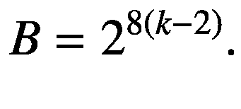
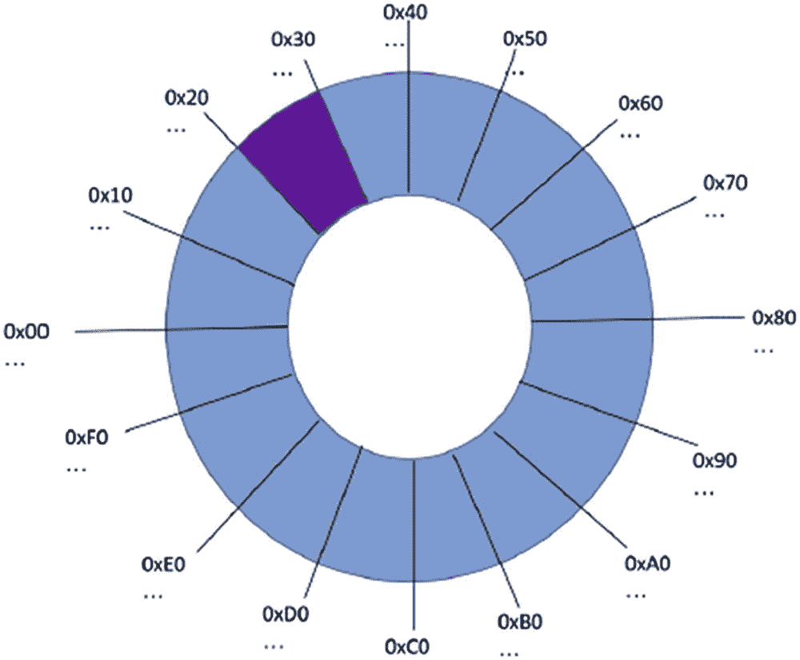
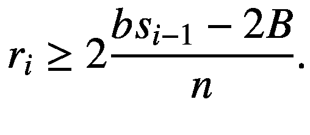
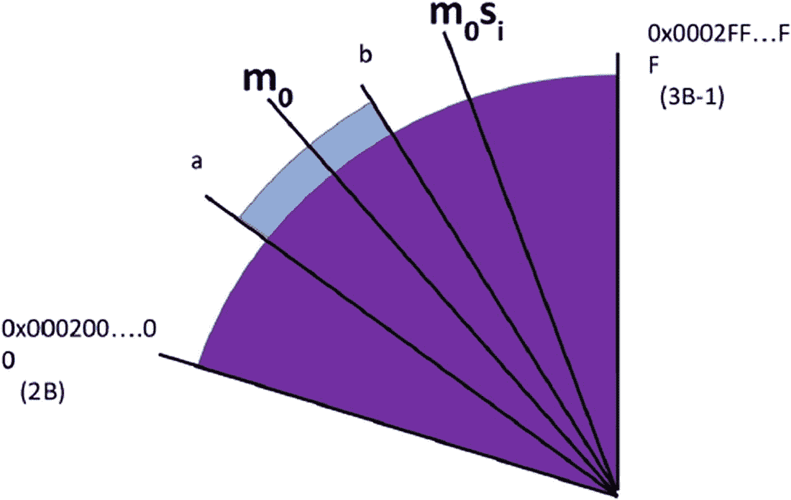
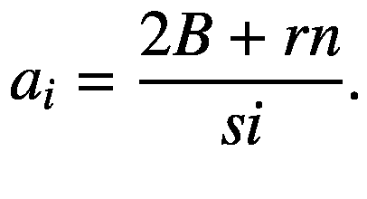

# 四、不对称加密：公钥/私钥

非对称加密是加密安全领域有史以来最重要的进步之一。它是网络、Wi-Fi 连接、安全电子邮件和其他各种通信安全的基础。它无处不在，但也很微妙，很容易被错误地实现或使用，缺乏正确性意味着有时安全性会大大降低。

也许你听说过“公钥”、“公钥基础设施”和/或“公钥加密”实际上，在非对称加密和许多不同的算法中有多种操作。在本章中，我们将专门关注*非对称加密*，特别是使用一种被称为 *RSA* 的算法。我们将把其他非对称操作，如签名和密钥交换，留到后面的章节。

事实上，RSA 加密几乎完全过时了。为什么要研究它？因为 RSA 是经典的非对称算法之一，而且在我们看来，它很好地引入了一些核心概念，这些概念将有助于学习更现代的方法。

## 两把钥匙的故事

东南极洲真相间谍机构(EATSA)给爱丽丝和鲍勃一个新的任务。鲍勃将留在东南极洲(EA)作为爱丽丝的负责人，爱丽丝将在西南极洲政府的小餐馆(WAGGS)得到一个秘密职位。爱丽丝将向鲍勃报告西南极洲(WA)的政客们在吃什么。EATSA 计划要挟这些政客吃多少热食物，而他们的选民却只能吃冷冻晚餐。

然而，EATSA 担心通信受到影响。如果爱丽丝被用对称密钥捕获，西南极洲中央骑士办公室(WACKO)将能够用它来解密他们截获的她发给 EATSA 的任何信息。那会毁了整个计划！

EATSA 决定实施一项新技术:非对称加密。当他们发现有*两个*密钥的加密方案:用一个密钥*加密的东西只能被另一个*解密时，他们的集体头脑都炸了！

使用这项新技术，Bob 只需使用两把钥匙中的一把(“公共”钥匙)就可以将 Alice 发送到现场。爱丽丝将能够加密回给鲍勃的消息，即使她也无法解密！只有在 EA 领域内安全并且拥有相应的“私有”密钥的 Bob 可以解密消息。这听起来很完美——如果她的密钥被泄露，至少不会允许她的捕获者解密她写的东西，这比以前严格地说要好。 <sup>1</sup> 会出什么差错呢？

为了完成这个方案，EATSA 选择使用 RSA 加密，这是一种非对称算法，使用非常大的整数作为密钥和消息，并使用“模幂运算”作为加密和解密的主要数学运算符。该算法易于理解，并且使用现代编程语言，相对容易实现。从各方面来看，这都是烹饪花招的完美配方。

## 变得紧张

在 RSA 中生成密钥有点棘手，因为它需要找到两个非常大的整数，这两个整数很有可能是*互质*。对 EATSA 的代理人来说，这看起来像是一大堆数学，所以他们选择只使用现有的库来完成这一部分。清单 4-1 显示了他们放入 Python 3 的包以及他们编写的利用它的代码。

```py
 1   from cryptography.hazmat.backends import default_backend
 2   from cryptography.hazmat.primitives.asymmetric import rsa
 3   from cryptography.hazmat.primitives import serialization
 4
 5   # Generate a private key.
 6   private_key = rsa.generate_private_key(
 7        public_exponent=65537,
 8        key_size=2048,
 9        backend=default_backend()
10   )
11
12   # Extract the public key from the private key.
13   public_key = private_key.public_key()
14
15   # Convert the private key into bytes. We won't encrypt it this time.
16   private_key_bytes = private_key.private_bytes(
17       encoding=serialization.Encoding.PEM,
18       format=serialization.PrivateFormat.TraditionalOpenSSL,
19       encryption_algorithm=serialization.NoEncryption()
20   )
21
22   # Convert the public key into bytes.
23   public_key_bytes = public_key.public_bytes(
24       encoding=serialization.Encoding.PEM,
25       format=serialization.PublicFormat.SubjectPublicKeyInfo
26   )
27
28   # Convert the private key bytes back to a key.
29   # Because there is no encryption of the key, there is no password.
30   private_key = serialization.load_pem_private_key(
31       private_key_bytes,
32       backend=default_backend(),
33       password=None)
34
35   public_key = serialization.load_pem_public_key(
36       public_key_bytes,
37       backend=default_backend())

Listing 4-1
RSA Key Generation

```

一旦你知道如何使用它，那还不算太坏。这种模式对于任何私钥/公钥的生成都是一样的，所以即使有一些长名字的常量，看起来这个库确实让 EATSA 变得更容易了。

看看 RSA 中的私钥是如何决定一切的吧？公钥就是从它派生出来的。虽然其中一个密钥可用于加密(另一个可用于解密)，但由于这个属性，私钥是特殊的。RSA 密钥不仅是不对称的，因为一个加密，另一个解密，它们也是不对称的，因为您可以从私钥导出 RSA 公钥，而不是相反。

`private_bytes`和`public_bytes`方法将大整数键转换成标准网络和磁盘编码的字节，称为 PEM。在从磁盘中读取这些字节后，可以使用相应的序列化“load”方法来解码这些字节，这样它们看起来就像加密和解密算法的密钥。

加密*私钥本身*是可能的(也是一个非常好的想法)，但是我们选择不在这里这样做，这就是为什么没有使用密码。

## RSA 做错了:第一部分

Alice 和 Bob 将通过探索错误使用 RSA 的所有方法来帮助我们了解 RSA。

对于 EATSA 来说，实际的加密和解密部分看起来非常简单，他们查看的每个库似乎都有许多不必要的额外内容，这使得它更难理解，甚至(气喘吁吁地)降低了速度。由于没有学习过 YANAC 原理，他们决定自己实现加密和解密。他们没有像写的那样使用第三方库，而是选择省略*填充*。这就产生了一个非常“原始”或基本形式的 RSA，它对我们学习内部机制很有用，即使结果很不完整。

### 警告:不要滚动您自己的加密

同样，实现你自己的 RSA 加密/解密，而不是使用一个库，根本不是一个好主意。使用没有填充的 RSA 是非常不安全的，原因有很多，我们将在本节中探讨其中的一些。尽管我们将出于教育目的在这里编写我们自己的 RSA 函数，**在任何情况下都不要在真实的交流中使用这些代码**。

下面是加密的数学公式，其中 *c* 是密文， *m* 是消息，其余的参数形成公钥和私钥，稍后解释:


(4.1)

同样，下面是解密:


(4.2)

看起来不算太糟，对吧？模幂运算在大型整数数学库中是一个相当标准的运算， <sup>2</sup> 所以这个真的没有太多。

如果你是这方面的新手，不要被。为了简单起见，你通常可以认为它是一个等号。

(4.1)和(4.2)中的运算可以使用`gmpy2`(一个大数数学库)用 Python 简洁地编写。`powmod`函数执行必要的模幂运算，如清单 4-2 所示。

```py
 1   #### DANGER ####
 2   # The following RSA encryption and decryption is
 3   # completely unsafe and terribly broken. DO NOT USE
 4   # for anything other than the practice exercise
 5   ################
 6   def simple_rsa_encrypt(m, publickey):
 7       # Public_numbers returns a data structure with the 'e' and 'n' parameters.
 8       numbers = publickey.public_numbers()
 9
10       # Encryption is(m^e) % n.
11       return gmpy2.powmod(m, numbers.e, numbers.n)
12
13   def simple_rsa_decrypt(c, privatekey):
14       # Private_numbers returns a data structure with the 'd' and 'n' parameters.
15       numbers = privatekey.private_numbers()
16
17       # Decryption is(c^d) % n.
18       return gmpy2.powmod(c, numbers.d, numbers.public_numbers.n)
19   #### DANGER ####

Listing 4-2GMPY2

```

如前所述，现在可能更明显了，RSA 操作的是整数，而不是消息字节。我们如何将消息转换成整数？Python 使这变得很方便，因为它的`int`类型有`to_bytes`和`from_bytes`方法。让我们让它们在清单 4-3 中使用起来更好一些。

```py
1   def int_to_bytes(i):
2       # i might be a gmpy2 big integer; convert back to a Python int
3       i = int(i)
4       return i.to_bytes((i.bit_length()+7)//8, byteorder="big")
5
6   def bytes_to_int(b):
7       return int.from_bytes(b, byteorder="big")

Listing 4-3
Integer/Byte Conversion

```

### 重要的

因为 RSA 处理的是整数，而不是字节，所以默认实现会丢失前导零。就整数而言，01 和 1 是同一个数。如果您的字节序列以任意数量的零开头，它们将无法通过加密/解密。对于我们的例子，我们发送文本，所以它永远不会是一个问题。然而，对于二进制数据传输，它可能是。这个问题用填充就解决了。

EATSA 现在拥有了创建一个简单的 RSA 加密/解密应用所需的所有组件。在查看清单 4-4 中的代码之前，尝试创建自己的版本。

```py
  1   # FOR TRAINING USE ONLY! DO NOT USE THIS FOR REAL CRYPTOGRAPHY
  2
  3   import gmpy2, os, binascii
  4   from cryptography.hazmat.backends import default_backend
  5   from cryptography.hazmat.primitives.asymmetric import rsa
  6   from cryptography.hazmat.primitives import serialization
  7
  8   #### DANGER ####
  9   # The following RSA encryption and decryption is
 10   # completely unsafe and terribly broken. DO NOT USE
 11   # for anything other than the practice exercise
 12   ################
 13   def simple_rsa_encrypt(m, publickey):
 14       numbers = publickey.public_numbers()
 15       return gmpy2.powmod(m, numbers.e, numbers.n)
 16
 17   def simple_rsa_decrypt(c, privatekey):
 18       numbers = privatekey.private_numbers()
 19       return gmpy2.powmod(c, numbers.d, numbers.public_numbers.n)
 20   #### DANGER ####
 21
 22   def int_to_bytes(i):
 23       # i might be a gmpy2 big integer; convert back to a Python int
 24       i = int(i)
 25       return i.to_bytes((i.bit_length()+7)//8, byteorder="big")
 26
 27   def bytes_to_int(b):
 28       return int.from_bytes(b, byteorder="big")

 29
 30   def main():
 31       public_key_file = None
 32       private_key_file = None
 33       public_key = None
 34       private_key = None
 35       while True:
 36           print("Simple RSA Crypto")
 37           print("--------------------")
 38           print("\tprviate key file: {}".format(private_key_file))
 39           print("\tpublic key file: {}".format(public_key_file))
 40           print("\t1\. Encrypt Message.")
 41           print("\t2\. Decrypt Message.")
 42           print("\t3\. Load public key file.")
 43           print("\t4\. Load private key file.")
 44           print("\t5\.  Create and load new public and private key files.")
 45           print("\t6\. Quit.\n")
 46           choice = input(" >> ")
 47           if choice == '1':
 48               if not public_key:
 49                   print("\nNo public key loaded\n")
 50               else:
 51                   message = input("\nPlaintext: ").encode()
 52                   message_as_int = bytes_to_int(message)
 53                   cipher_as_int = simple_rsa_encrypt(message_as_int, public_key)
 54                   cipher = int_to_bytes(cipher_as_int)
 55                   print("\nCiphertext (hexlified): {}\n".format(binascii.hexlify(cipher)))
 56           elif choice == '2':
 57               if not private_key:
 58                   print("\nNo private key loaded\n")
 59               else:
 60                    cipher_hex = input("\nCiphertext (hexlified): ").encode()
 61                   cipher = binascii.unhexlify(cipher_hex)
 62                   cipher_as_int = bytes_to_int(cipher)
 63                   message_as_int = simple_rsa_decrypt(cipher_as_int, private_key)
 64                   message = int_to_bytes(message_as_int)
 65                   print("\nPlaintext: {}\n".format(message))
 66           elif choice == '3':
 67               public_key_file_temp = input("\nEnter public key file: ")
 68               if not os.path.exists(public_key_file_temp):
 69                   print("File {} does not exist.")
 70               else:
 71                   with open(public_key_file_temp, "rb") as public_key_file_object:
 72                       public_key = serialization.load_pem_public_key(
 73                                        public_key_file_object.read(),
 74                                        backend=default_backend())
 75                       public_key_file = public_key_file_temp

 76                       print("\nPublic Key file loaded.\n")
 77
 78                       # unload private key if any
 79                       private_key_file = None
 80                       private_key = None
 81           elif choice == '4':
 82               private_key_file_temp = input("\nEnter private key file: ")
 83               if not os.path.exists(private_key_file_temp):
 84                   print("File {} does not exist.")
 85               else:
 86                   with open(private_key_file_temp, "rb") as private_key_file_object:
 87                       private_key = serialization.load_pem_private_key(
 88                                        private_key_file_object.read(),
 89                                        backend = default_backend(),
 90                                        password = None)
 91                       private_key_file = private_key_file_temp
 92                       print("\nPrivate Key file loaded.\n")
 93
 94                       # load public key for private key
 95                       # (unload previous public key if any)
 96                       public_key = private_key.public_key()
 97                       public_key_file = None
 98           elif choice == '5':
 99               private_key_file_temp = input("\nEnter a file name for new private key: ")
100               public_key_file_temp = input("\nEnter a file name for a new public key: ")
101               if os.path.exists(private_key_file_temp) or os.path.exists(public_key_file_temp):
102                   print("File already exists.")
103               else:
104                   with open(private_key_file_temp, "wb+") as private_key_file_obj:
105                       with open(public_key_file_temp, "wb+") as public_key_file_obj:
106
107                           private_key = rsa.generate_private_key(
108                                             public_exponent =65537,
109                                             key_size =2048,
110                                             backend = default_backend()
111                                         )
112                           public_key = private_key.public_key()
113
114                           private_key_bytes = private_key.private_bytes(
115                               encoding=serialization.Encoding.PEM,
116                               format=serialization.PrivateFormat.TraditionalOpenSSL,

117                               encryption_algorithm=serialization.NoEncryption()
118                           )
119                           private_key_file_obj.write(private_key_bytes)
120                           public_key_bytes = public_key.public_bytes(
121                               encoding=serialization.Encoding.PEM,
122                               format=serialization.PublicFormat.SubjectPublicKeyInfo
123                           )
124                           public_key_file_obj.write(public_key_bytes)
125
126                           public_key_file = None
127                           private_key_file = private_key_file_temp
128           elif choice == '6':
129               print("\n\nTerminating. This program will self destruct in 5 seconds.\n")
130               break
131           else:
132               print("\n\nUnknown option {}.\n".format(choice))
133
134   if __name__ == '__main__':
135       main()

Listing 4-4RSA Done Simply

```

在我们一起练习之前，花几分钟时间自己尝试一下这个练习。顺便注意，因为公钥可以从私钥派生出来，所以加载私钥的同时也加载了公钥。

当你准备好了，继续读！你可能想不时地回头参考清单 4-4 。我们随后的许多清单将重用这些导入和函数定义。为了节省空间，我们一般不会重印它们，所以这个列表也是一个有用的模板。

### 练习 4.1。简单 RSA 加密

使用前面的应用，建立从 Alice 到 Bob 的通信，然后从 Alice 向 Bob 发送一些加密的消息进行解密。

## 填充发件箱

一旦 EATSA 建立了 RSA 加密应用，他们就把它交给 Alice 和 Bob，并命令他们开始这项任务。爱丽丝将渗透到 WAGGS，并发送更新给鲍勃。爱丽丝和鲍勃首先需要做什么？

公钥/私钥对的神奇之处在于，为了让 Alice 向 Bob 发送安全消息，它们在分开之前不需要就任何事情达成一致！ <sup>3</sup> 只要爱丽丝知道去哪里找，鲍勃就可以在任何地方向她的*发布公钥*。他可以把它登在报纸上，在电话里背诵给她听，或者在环绕西南极洲飞行的固特异飞艇上宣传它。关键是*公*。如果西南极洲反情报部门看到了也没关系:他们将无法解密爱丽丝的信息。

正确

爱丽丝离开 EATSA 总部，穿过边境，来到西南极洲城市，在那里她渗透到 WAGGS。当她从事秘密烹饪活动时，Bob 生成了一对公钥/私钥。他保留私钥并公布公钥给 Alice 看。

让我们跟着走。启动代表 Bob 版本的应用实例，并选择选项 5，这会生成新的密钥对并将它们保存到磁盘。完成后，您将有两个可以在编辑器中检查的文件。

看一下公钥文件(在出现提示时为它选择了名称)。它的内容应该是这样的:

```py
-----BEGIN PUBLIC KEY-----
MIIBIjANBgkqhkiG9w0BAQEFAAOCAQ8AMIIBCgKCAQEAuGFr+NV3cMu2pdl+i52J
XkYwwSHgZvA0FyIPsZ/rp6Ts5iBTkpymt7cf+cQCQro4FSw+udVt4A8wvZcppnBZ
h+17ZZ6ZZfj0LCr/3sJw8QfZwuaX5TZxFbJDxWWwsR4jLHsiGsPNf7nzExn7yCSQ
sXLNqc+mLKP3Ud9ta14bTQ59dZIKKDHVGlQ1iLlhjcE1dhOAjWlsdCVfE+L/bSQk
Ld9dWKCM57y5tiMsoqnVjl28XcsSuiOd4QPGITprsX0jb7/p/rzXc9OQHHGyAQzs
WTAbZNaQxf9AY1AhE4wgMVwhnrxJA2g+DpY1yXUapOIH/hpD0sMH56IGcMx9oV/y
SwIDAQAB
-----END PUBLIC KEY-----

```

那是一个 PEM 格式的公钥。恭喜你！鲍勃可以拿着这把钥匙，在分类广告栏里把它发表给西南极洲的一家报纸。

与此同时，爱丽丝一直在仔细观察西南极洲的政客们喜欢吃什么。多么不像南极人！当她看着他们吃着*热狗*和*热巧克力*时，她心想。然后，回头看了一眼手中的报纸，她找到了她一直在寻找的分类广告！公钥已经到了！她小心翼翼地将它复制到一个文件中，现在已经能够为 Bob 的眼睛加密信息了。

接下来，让我们将刚刚生成的公钥复制到一个新文件中。这代表 Alice 从分类广告中复制文本后创建的文件。现在启动应用的一个新实例，它代表程序的 Alice 副本。选择选项 3 来加载她的公钥。

爱丽丝需要给鲍勃发回一条消息。这是我们计划中的选项 1。运行它，选择选项 1，并在明文字段中输入文本“热狗”。加密信息突然出现。 <sup>4</sup> 如果您使用前面的公钥，您将得到以下输出:

```py
Plaintext: hot dogs

Ciphertext (hexlified): b'56d5586cab1764fae575bc5815115f1c5d759
daddccbd6c9cb4a077026e2616dfca756ffa7733538e66997f06ebbbb853028
3926383a6bb80b7145990a29236d042048eed8eb7607bd35fcafe3dadd5d60a
1f8694192bddedac5728061234ffbb7a407155844a7e79b3dbc9704df0de818
d24acad32ccd6d2afe2d0734199c76e5c5c770fa8c3c208eceae00554aa2f29
9a8510121d388d85f35fa49c08f3e9d7540f22fe5eb4ea15da5f387dbdd0e00
6710aa9031b885094773ef3329cde91dbede53ed77b96483d34daa4fedbf5bc
d95e95b6b482a7decbf47fe2df0e309d706ab9c73ce73a2bdef33b786dd12e9
8a9ce34bbc1847f36e13ae9eea4007b616'

```

我们再来一次，但这次是“热巧克力”如果您使用我们向您展示的前面的公钥这样做，您将得到这个输出(但是继续使用您自己生成的公钥):

```py
Plaintext: hot chocolate

Ciphertext (hexlified): b'4d1e544e71c4cb15636ef4b0d629294538a05
979db762952cc5f0fc494f71535dff326dbb8543d0f2ace51a2279f65c2a76b
2a5ca5a3ee151e65e516afcb1d4da9ca9871dc7ce1dd4361a3b49def05c5089
99f5fab81b869b251ba8694fb171ab56ca1cde7cef0ac3934da4c28f7bfbb65
b03afa9cff30db974f0bd4fb8dee7fac75c99cd4def94ca8de83d46fffa092a
90642c9cfbfbf07c371f5aa3a62dc997d20e9959fcbec7dd0b434709b679619
ea195008a9a12eaa7462ffdbe8e6f765dd86b21f0f1d9b8b2b523ca7f11785e
fc6da84ec717bd1f0e2191e5a3bef74e489b5e396c49bd8f222ccd89984dbec
8b5e4cbb23ba739637d3307bca4e9f57e7'

```

同样，Alice 不能解密这些消息，即使她自己加密了它们:她没有私钥。至少，理论是这么告诉他们的。

她对自己的“可食用间谍”充满信心，带着这些信息，通过一只不安全的企鹅把它们发送给鲍勃。Bob 收到消息并重新加载他的应用。首先，他使用选项 4 加载私钥文件，然后选择选项 2 尝试解密。果不其然，当他把消息复制给爱丽丝时，它正确地解密了:

```py
Ciphertext (hexlified): 56 d5586cab1764fae575bc5815115f1c5d759da
ddccbd6c9cb4a077026e2616dfca756ffa7733538e66997f06ebbbb85302839
26383a6bb80b7145990a29236d042048eed8eb760735fcafe3dadd5d60a1f86
94192bddedac5728061234ffbb7a407155844a7e79b3dbc9704df0de818d24a
cad32ccd6d2afe2d0734199c76e5c5c770fa8c3c208eceae00554aa2f299a85
10121d388d85f35fa49c08f3e9d7540f22fe5eb4ea15da5f387dbdd0e006710
aa9031b885094773ef3329cde91dbede53ed77b96483d34daa4fedbf5bcd95e
95b6b482a7decbf47fe2df0e309d706ab9c73ce73a2bdef33b786dd12e98a9c
e34bbc1847f36e13ae9eea4007b616

Plaintext: b'hot dogs'

```

“热狗！”鲍勃惊呼道。“不光彩！”

```py
Ciphertext (hexlified): 4d1e544e71c4cb15636ef4b0d629294538a05979
db762952cc5f0fc494f71535dff326dbb8543d0f2ace51a2279f65c2a76b2a5c
a5a3ee151e65e516afcb1d4da9ca9871dc7ce1dd4361a3b49def05c508999f5f
ab81b869b251ba8694fb171ab56ca1cde7cef0ac3934da4c28f7bfbb65b03afa
9cff30db974f0bd4fb8dee7fac75c99cd4def94ca8de83d46fffa092a90642c9
cfbfbf07c371f5aa3a62dc997d20e9959fcbec7dd0b434709b679619ea195008
a9a12eaa7462ffdbe8e6f765dd86b21f0f1d9b8b2b523ca7f11785efc6da84ec
717bd1f0e2191e5a3bef74e489b5e396c49bd8f222ccd89984dbec8b5e4cbb23
ba739637d3307bca4e9f57e7

Plaintext: b'hot chocolate'

```

鲍勃的眼睛眯了起来。“热巧克力？！他们没有羞耻心吗？!"

到目前为止，一切顺利！鲍勃收到了爱丽丝的信息。它们被特工伊芙·瓦克截获了，但她应该读不出来，尽管她也有公钥。如果爱丽丝不能阅读她自己的信息，为什么夏娃可以？

爱丽丝和鲍勃不知道的是，夏娃即将造成各种破坏。在本章的其余部分，我们将介绍 RSA 可能受到攻击的一些方式以及如何正确应对。但是首先，练习！

### 练习 4.2。谁鲍勃。是你吗？

假设 Eve 的角色，想象你知道 Alice 和 Bob 操作*的一切，除了*私钥。也就是说，假设你知道分类广告，载体企鹅，甚至加密程序。他们的方案通过使用非对称加密得到了加强，但是仍然容易受到 MITM(中间人)攻击。伊芙如何定位自己，让她可以欺骗爱丽丝发送伊芙可以解密的信息，而鲍勃只能从伊芙而不是爱丽丝那里收到*假信息？*

### 练习 4.3。生命，宇宙，一切的答案是什么？

我们已经在前一章讨论过选择明文攻击。这里可以使用相同的攻击。再次承担伊夫的作用，古怪的代理人。你在报纸上截获了鲍勃的公开密钥，你可以进入 RSA 加密程序。如果你怀疑你知道爱丽丝在她的加密信息中发送了什么，解释或演示你将如何验证你的猜测。

## 非对称加密有何不同？

正如您在本节中已经了解到的，RSA 是*非对称加密*的一个例子。如果您之前没有听说过非对称加密，希望您刚刚完成的练习已经让您了解了关键概念。现在让我们明确一些事情。

在对称加密中，有一个单独的共享密钥对消息进行加密和解密。这意味着任何有能力创建加密消息的人都有同样的能力解密相同的消息。给某人解密对称加密的消息的权力而不给他们加密同类消息的能力是不可能的，反之亦然。

在非对称加密中，总有一个绝对不能公开的私钥和一个可以广泛公开的公钥。密钥对到底能做什么取决于算法。在本章中，我们一直关注 RSA 加密。我们将在本节中作为一个具体的例子来回顾 RSA 的运算，但是请记住，它们可能不适用于其他非对称算法和运算。

具体来说，RSA 支持非对称加密方案，在该方案中，您可以使用一个密钥来加密消息，而使用另一个密钥来解密消息。通常，任一密钥都可以充当任一角色:私钥可以加密可以被公钥解密的消息，反之亦然。当然，对于 RSA，一个密钥显然是*私有*密钥，因为公共密钥可以从私有密钥中*导出*，而不是相反。有 RSA 私钥而*没有与之匹配的公钥是不可能的。因此，一个密钥被明确地指定为“私有的”，另一个是“公共的”*

受适当保护的 RSA 私钥和足够健壮的协议的拥有者可以出于两个目的使用非对称加密:

1.  **加密收存箱**:任何有公钥的人都可以加密一条消息，并将其发送给私钥的所有者。只有拥有私钥的人才能解密这条消息。

2.  **签名**:任何有公钥的人都可以解密用私钥加密的消息。这显然无助于保密(任何人都可以解密该消息)，但它有助于证明*发送者*的身份，或者至少发送者拥有私钥；否则，他们就不能加密一个可用公钥解密的消息。这是一个加密*签名*的例子，我们稍后会谈到。

### 注意:RSA 加密小东西

我们现在正在学习的加密 dropbox 操作几乎从未被用来以这种方式发送完整的消息。RSA 加密最常用的方式(同样，它正在被淘汰)是加密一个对称密钥，以便从一方传输到另一方。这是另一个概念，我们将留到下一章讨论。

RSA 加密的非对称本质的真正奇妙之处在于，双方不需要见面就可以开始交换消息。在我们的例子中，Alice 和 Bob 不需要一起创建任何共享密钥。爱丽丝甚至不需要认识鲍勃。只要 Alice 有 Bob 的公钥，她就可以加密只有 Bob 能读懂的消息。

不幸的是，只为一个人加密的能力并不是现实生活中唯一重要的事情。如练习中所示，非对称加密的优势也是其弱点。没有任何先前互动的交流能力也意味着，在没有额外信息的情况下，没有办法知道你正在与*正确的人*交流。

如果你已经完成了前面的练习，你会发现对于疯子来说，通过截取信息和密钥欺骗双方来读取和修改爱丽丝和鲍勃之间的通信是非常简单的。

1.  他们可以通过截取和修改报纸上公布的公钥来欺骗爱丽丝。通过插入*他们自己的*公钥——爱丽丝现在误认为是鲍勃的——他们可以读取爱丽丝发送给鲍勃的所有信息。没有附加信息，Alice 无法知道公钥已经被泄露。

2.  然后，他们可以通过阻止 Alice 不正确加密的消息到达 Bob，并向他发送用正确的公钥加密的假消息来欺骗 Bob，他们截获了这些消息。没有附加信息，Bob 无法知道是谁在发送消息。

这是对称密钥和非对称密钥之间的一个关键区别。事实上，一些密码学家区分“秘密的”对称密钥和“私有的”非对称密钥。两个人可以共享一个秘密，但是只有一个人知道他们自己的私钥。这在实践中意味着，如果对称密钥*对双方*都是保密的，那么它可以用来确定你正在与正确的人(即，与你创建共享密钥的人)交谈，而非对称密钥则不能。 <sup>6</sup>

让我们暂时回避这个问题，留待以后解决，因为在*证书*的上下文中确实讨论了这个问题的解决方案。

## 传递填料

回想一下前面的内容，EATSA 选择在没有任何填充的情况下实现 RSA。他们真的不应该那样做；这是一个相当严重的错误。事实上，它是如此严重，以至于`cryptography`模块甚至*不允许*你用 RSA 无填充加密！

那么，什么是填充，为什么填充如此重要？

解释这一点的最佳方式是演示如何读取用公钥*加密的消息，即使您没有私钥*，只要这些消息没有被填充。另一个很好的练习是在互联网上搜索 RSA 填充攻击。使用无填充明文有许多*问题。*

### 确定性输出

先说最基本的问题。RSA 本身就是一种*确定性*算法。这意味着，给定相同的密钥和消息，您将总是得到相同的密文，一个字节一个字节地。回想一下，我们在 AES 之类的对称密钥加密算法上也有同样的问题。有必要使用*初始化向量(IV)* 来防止确定性输出。你还记得为什么确定性输出如此糟糕吗？

确定性输出的问题是，它们使被动窃听者(如 Eve)能够进行一些密码逆向工程。因为加密是确定性的，如果伊芙知道 *m* 加密到 *c* ，那么任何时候伊芙看到 *c* 她就知道明文是什么。


图 4-1

如果 RSA 的输出是确定性的，那么发现明文和对应密文之间映射的对手可以将其记录到查找表中以备后用。这个图看起来眼熟吗？

Eve 既有公钥*又有算法*(你永远不能假设一个密码算法是秘密的)。她可以加密任意数量的潜在消息，并存储预加密值的查找表。图 4-1 看着眼熟吗？我们在第三章中展示了同样的图像，来讨论对称密码的 ECB 模式及其存在的问题。

但是确定性非对称加密会更糟。与对称加密不同，我们必须假设对手*拥有*(公共)密钥。在我们假设的南极冲突中，Eve 可能会发现，或者简单地猜测，Alice 正在根据她对自助餐厅的监视发送信息。如果她试图通过列出房间内发现的东西来加密几百个单词(例如，在自助餐厅吃饭的政治家的名字、谈话的主题和正在吃的食物)，一旦她加密了“热狗”或“热巧克力”，加密的值就会与在返回给 Bob 的消息中截取的内容完全匹配。对于像这样的短消息，尤其是如果 EA Intelligence 总是用小写字母写单词，那么只有不到 3 亿条 8 个字符长的消息可以尝试。创建这么多消息的密文表并不太麻烦。使用这个查找表，Eve 可以相对快速地识别“热狗”。

即使夏娃不能猜出这个信息，仍然有各种各样的分析可以做。假设爱丽丝继续日复一日地发送同样的信息。虽然 Eve 可能无法解密这条消息，但她仍然能够自信地声明这是同一条消息。在前几章中，我们已经考虑了许多利用这种“信息泄露”的例子。

### 练习 4.4。强力 RSA

编写一个程序，使用蛮力解密一个 RSA 加密的全小写(无空格)少于四个字符的字。该程序应该将公钥和 RSA 加密的密文作为输入。使用 RSA 加密程序生成四个或更少字母的几个单词，并用您的暴力程序破解这些代码。

### 练习 4.5。等待是最难的部分

修改蛮力程序，尝试五个或更少字母的所有可能单词。测量暴力破解一个四个字母的单词和一个五个字母的单词所花费的时间(最坏情况下)。大约需要多长时间，为什么？尝试所有可能的六个字母单词需要多长时间？

### 练习 4.6。字典攻击

很明显，尝试所有可能的长度远大于四或五的小写 ASCII 单词将花费比你可能的注意力跨度更长的时间。但是我们在前面的章节中已经看到了同样的问题。让我们尝试相同的解决方案。修改你的强力程序，将字典作为输入来尝试任意的英语单词。

### 选择密文攻击

没有填充的 RSA 也容易受到所谓的“选择密文攻击”当你能让受害者代表你解密*你选择的一些*密文时，这种类型的攻击就起作用了。这听起来可能违背直觉。为什么有人会为你解密任何东西？例如，为什么鲍勃要为伊芙解密任何东西？

请记住，许多计算机安全都与心理学、诡计和人类思维有关。2].鲍勃在找什么？Bob 假设他正在解密来自 Alice 的可读信息。如果他收到了人类无法阅读的信息呢？例如，假设在解密一条消息(假设来自 Alice)时，他得到以下输出:

```py
b'\xe8\xca\xe6\xe8'

```

完全有可能，这只是假设由于传输错误。这些事情在现实生活中无时无刻不在发生。这可能是一个小错误，或者是一只载体企鹅弄脏了墨水。Bob 可能会看到许多无法正确解密的消息。

鲍勃是做什么的？如果他没有很好的安全控制，他可能会把它扔掉。但是如果爱丽丝能渗透到敌人内部，它也能以另一种方式工作。你觉得哪个更容易被 Eve 弄到手？被发送到指挥链进行分析的绝密信息，还是被扔进垃圾桶的“不正确”信息？如果 Eve 在门卫工作人员中有自己的秘密特工，很有可能会得到丢弃的纸张或未完全销毁的数据。

让我们假设这个场景:Eve 可以向 Bob 发送任意的密文。出于我们的目的，Eve 看不到任何人类可读的消息，但是可以恢复被 Bob 丢弃的假定错误的消息，因为它们看起来毫无意义。

不幸的是，对于爱丽丝和鲍勃来说，伊芙可以用这个技巧解密爱丽丝发送回她基地的几乎所有信息。这个技巧背后的数学知识非常酷，在本章的多个例子中都有使用。所以让我们暂停一分钟来谈谈加密中的*同态*。

加密同态的基本概念是，如果您对密文执行某种计算，结果会反映在明文中。不是所有的密码系统都具有同态性质，但 RSA 在一定程度上具有同态性质。在 RSA 中，我们将看到对密文进行乘法运算的方法会导致对明文进行乘法运算。目前还有其他一些特殊的同态加密技术正在开发中，这些技术使第三方能够在无法读取数据的情况下提供数据服务。你可能听说过其中的一些；如果没有，可以试着在网上搜索“同态加密”。这是非常有趣的东西。

虽然 RSA 不是一个同态加密方案，但这种乘法特性非常有趣(也造成了许多漏洞)。还记得代数课上说的(*a*<sup>*c*</sup>)(*b*<sup>*c*</sup>)=(*ab*<sup>*c*</sup>)？模幂运算也是如此，如下式所示:


(4.3)

这个等式的任何部分看起来熟悉吗？回头看看(4.1)。你现在明白了吗？

任何时候我们在 RSA 中加密一个值( *m* )，最终都会得到*m*<sup>emod*n*。在(4.3)的左侧，我们有两个加密*，一个是 *m* <sub>*1*</sub> 一个是 *m* <sub>*2*</sub> ，两者都使用相同的公共指数 *e* 并且两者都取相同的模数 *n* 。*</sup>

在右手边，我们有一个*单次*加密的值 *m* <sub>1</sub> 次*m*2。这个等式告诉我们的是，如果将这些单独加密的值相乘(mod *n* )，就可以得到相乘的加密结果！

换句话说，两个密文(在同一公钥下加密)的乘积解密为两个明文的乘积。在我们开始之前，请尝试自己完成以下练习。

### 练习 4.7。无填充 RSA 的同态性质

使用(4.3)将两个 RSA 加密的数字相乘，并解密结果以验证等式。

这个练习的代码非常简单，所以一定要先自己尝试一下。当你准备好了，我们的解决方案就在清单 4-5 中。

```py
 1   # FOR TRAINING USE ONLY! DO NOT USE THIS FOR REAL CRYPTOGRAPHY
 2
 3   import gmpy2, sys, binascii, string, time
 4   from cryptography.hazmat.backends import default_backend
 5   from cryptography.hazmat.primitives import serialization
 6   from cryptography.hazmat.primitives.asymmetric import rsa
 7
 8   #### DANGER ####
 9   # The following RSA encryption and decryption is
10   # completely unsafe and terribly broken. DO NOT USE
11   # for anything other than the practice exercise
12   ################
13   def simple_rsa_encrypt(m, publickey):
14       numbers = publickey.public_numbers()
15       return gmpy2.powmod(m, numbers.e, numbers.n)
16
17   def simple_rsa_decrypt(c, privatekey):
18       numbers = privatekey.private_numbers()
19       return gmpy2.powmod(c, numbers.d, numbers.public_numbers.n)

20
21   private_key = rsa.generate_private_key(
22         public_exponent=65537,
23         key_size=2048,
24         backend=default_backend()
25   )
26   public_key = private_key.public_key()
27
28   n = public_key.public_numbers().n
29   a = 5
30   b = 10
31
32   encrypted_a = simple_rsa_encrypt(a, public_key)
33   encrypted_b = simple_rsa_encrypt(b, public_key)
34
35   encrypted_product = (encrypted_a * encrypted_b) % n
36
37   product = simple_rsa_decrypt(encrypted_product, private_key)
38   print("{} x {} = {}".format(a,b, product))

Listing 4-5Solution

```

如果这种数学没有太大的意义，在这一点上不要太担心它。即使你不完全确定它是如何工作的，也要试着理解它是如何被使用的。

回到我们当前的例子，假设 Eve 有一个通过 *m* 的 RSA 公钥加密获得的密文 *c* 。没有私钥，Eve 应该无法解密。想必鲍勃也不会为她解密。然而，如果他将解密它的一个*倍数*，伊芙就能恢复原来的。

对于我们的例子，让我们选择我们的倍数为 2。Eve 首先使用(4.1)和公钥加密 2，得到*c*<sub>r。</sub>

为清楚起见，我们称原始密文为*c*0。如果我们将 *c* <sub>0</sub> 和 *c* <sub>*r*</sub> (模 *n* )相乘，我们将得到一个新的密文，我们称之为 *c* <sub>1</sub> 。


从(4.3)式可以看出，这是


那么 Eve 怎么用这个呢？假设伊芙截获了爱丽丝的一个密文 *c* 。Eve 将她计算的*c*<sub>r</sub>(同样，这只是在公钥下加密的值 2)然后将两个加密值相乘(模 *n* )。Eve 将这个新的密文发送给 Bob。

鲍勃接收到 *c* <sub>1</sub> 并将其解密给 *mr* 并将整数转换成字节。他发现它不能解密成任何清晰可辨的东西，并认为某些东西在运输过程中被损坏了。他耸耸肩，把纸揉成一团，扔进了废纸篓。那天晚上晚些时候，伊芙的经纪人在垃圾桶里找到了那张皱巴巴的纸。她快速复制了一份，通过秘密的载体送回给伊芙。

夏娃现在有了*先生*，需要提取 *m* 。没问题。她选择 *r* 为 2。在熟悉的算法中，你将除以 r 得到 m。但是在用模运算做这个算术的时候，你必须使用一个不同的逆运算:*r*1(mod*n*)。幸运的是，有一些库可以为我们计算这类数字，比如`gmpy2`。

```py
r_inv_modulo_n = gmpy2.powmod(r, -1, n)

```

### 练习 4.8。夏娃的门徒

重现夏娃选择的密文攻击。像前面一样，用 Python 创建一个示例消息，使用公钥对其进行加密。然后，加密一个值 *r* (比如 2)。将密文的两个*数字*版本相乘，不要忘记取模 *n* 的答案。解密这个新的密文，并尝试将其转换为字节。它不应该是人类可读的东西。取这个解密的数字版本，乘以 *r* (mod *n* )的倒数。你应该回到原来的数字。将其转换为字节以查看原始消息。

### 共模攻击

没有填充的 RSA 的另一个问题是“共模”攻击。回想一下， *n* 参数是模数，包含在公钥和私钥中。出于超出本书范围的数学原因，如果相同的 RSA 消息由两个不同的公钥加密，并且具有相同的 *n* 模数，那么该消息可以在没有私钥的情况下被解密。

在选择密文的例子中，我们详细地研究了数学，因为它可以相对容易地描述，也因为它对于多重攻击是至关重要的。对于这个例子，为了简单和节省空间，我们不会进入数学细节。相反，使用清单 4-6 中的代码来测试和探索攻击。如果你对数学的细节感兴趣，你可以阅读 Hinek 和 Lam 的“对小私有指数 RSA 和一些快速变体的共模攻击(实践)”。

```py
 1   # Partial Listing: Some Assembly Required
 2
 3   # Derived From: https://github.com/a0xnirudh/Exploits-and-Scripts/tree/master/RSA At tacks
 4   def common_modulus_decrypt(c1, c2, key1, key2):
 5       key1_numbers = key1.public_numbers()
 6       key2_numbers = key2.public_numbers()
 7
 8       if key1_numbers.n != key2_numbers.n:
 9           raise ValueError("Common modulus attack requires a common modulus")

10       n = key1_numbers.n
11
12       if key1_numbers.e == key2_numbers.e:
13           raise ValueError("Common modulus attack requires different public exponents")
14
15       e1, e2 = key1_numbers.e, key2_numbers.e
16       num1, num2 = min(e1, e2), max(e1, e2)
17
18       while num2 != 0:
19           num1, num2 = num2, num1 % num2
20       gcd = num1
21
22       a = gmpy2.invert(key1_numbers.e, key2_numbers.e)
23       b = float(gcd - (a*e1))/float(e2)
24
25       i = gmpy2.invert(c2, n)
26       mx = pow(c1, a, n)
27       my = pow(i, int(-b), n)
28       return mx * my % n

Listing 4-6Common Modulus

```

注意，为了测试这种攻击，您需要两个具有相同模数( *n* 值)和不同公共指数( *e* 值)的公钥。回想一下 *e* 建议总是 65537。但是很明显，在这个例子中，你不会对两个键都使用它。

如何创建公钥？到目前为止，在我们所有的例子中，我们要么生成新的键，要么从磁盘加载它们。

回想一下， *n* 和 *e* 值*定义了*公钥。其他一切都只是为了方便而包装。`cryptography`模块提供了一个 API，用于直接从这些值创建一个键。RSA 私钥对象有一个名为`private_numbers`的方法，RSA 公钥对象有一个名为`public_numbers`的方法。这些方法返回带有数据元素的数据结构，如 *n* 、 *d* 或 *e* 。这些“数字”对象也可以用来创建关键对象。

在清单 4-7 中，我们生成一个私钥，然后手动创建另一个具有相同模数和不同公共指数的密钥。

```py
 1   # Partial Listing: Some Assembly Required
 2
 3   private_key1 = rsa.generate_private_key(
 4       public_exponent =65537,
 5       key_size=2048,
 6       backend = default_backend()
 7   )
 8   public_key1 = private_key1.public_key()
 9
10   n = public_key1.public_numbers().n
11   public_key2 = rsa.RSAPublicNumbers(3, n).public_key(default_backend())

Listing 4-7Common Modulus Key Generation

```

现在，您应该有了测试这种攻击所需的所有 Python 代码。

此时，您可能会问自己，“这种攻击有多实际？”为了实现它，你必须有*相同的消息*在*两个具有相同模数*的密钥下加密。为什么同一条消息会在两个不同的密钥下被加密两次，为什么两个不同的密钥会有相同的模数？

在处理密码学的时候，千万不要依赖这种思维。如果有办法利用加密技术，坏人就会想出办法来利用它。让我们首先考虑如何用两个不同的密钥加密相同的消息。

一种可能性是让 Alice 相信已经创建了新的公钥，并且她需要进行交换。如果我们控制了新的公钥，我们可以给她一个我们选择的具有 *n* 和 *e* 值的密钥。

但是如果我们能控制她的密钥，为什么我们需要使用共模攻击呢？为什么不直接给她一个我们创建的公钥，并且我们有配对的私钥呢？

的确，一个新的私钥/公钥对将允许 Eve 在将来解密 Alice 发送的任何消息。但是通用模数攻击将允许 Eve 潜在地确定在过去发送的一些消息。在我们的例子中，爱丽丝渗透进自助餐厅，食物服务可能有规律地重复。事实上，正如我们之前所讨论的，即使 Eve 不能解密，她也已经可以知道相同的消息是否被重发。如果 Eve 观察到相同的消息被一遍又一遍地发送，则共模攻击提供了关于发送内容的历史以及关于将来发送的消息的信息的更大视图。

### 练习 4.9。共模攻击

通过创建一个通用模数攻击演示来测试本节中的代码。

### 练习 4.10。常见模数用例

写出一个附加场景，说明使用共模攻击可能对攻击者有用。

## 证据就在衬垫里

正如我们刚刚演示的，这种非常原始的 RSA 形式，有时被称为“教科书式 RSA”，相对容易被破解。有两个关键问题。正如我们已经看到的，教科书 RSA 的一个问题是输出是确定的。这使得需要对同一消息加密两次的普通模数攻击变得更加容易。

也许更大的问题是这些信息的可塑性有多大。我们在前一章讨论了对称加密的可扩展性。对于 RSA，我们有类似的问题，例如，将 RSA 密文相乘并得到一个可解密的值。

尝试加密微小的消息也有潜在的问题，比如我们在练习中加密的一些小消息。除了练习中的强力方法之外，还有一些方法可以破解较小的消息，特别是使用较小的公共指数(例如， *e* = 3)。

为了减少或消除这些问题，RSA 的实际使用总是利用填充有*随机元素*的填充。RSA 填充在加密前通过我们一直在处理的原始 RSA 计算应用于明文消息。填充确保消息不会太小，并提供一定的结构来降低延展性。此外，随机化元素的操作与对称加密的 IV 没有什么不同:良好的随机化填充确保 RSA 加密操作生成的每个密文(即使对于相同的明文)都是唯一的(概率非常高)。

没有填充的 RSA 足够危险，`cryptography`模块甚至没有无填充的 RSA 操作。你应该非常清楚，你不能在没有填充的情况下使用 RSA 进行加密。虽然`cryptography`模块不允许这样做，但其他库允许。值得注意的是，这包括 OpenSSL。

在撰写本文时，通常使用两种填充方案。旧的方案被称为 PKCS #1 v1.5，另一个是 OAEP，代表最佳非对称加密填充。清单 4-8 中所示的`cryptography`模块可以使用这些填充方案中的任何一种。

```py
 1   from cryptography.hazmat.backends import default_backend
 2   from cryptography.hazmat.primitives.asymmetric import rsa
 3   from cryptography.hazmat.primitives import serialization
 4   from cryptography.hazmat.primitives import hashes
 5   from cryptography.hazmat.primitives.asymmetric import padding
 6
 7   def main():
 8       message = b'test'
 9
10       private_key = rsa.generate_private_key(
11             public_exponent =65537,
12             key_size=2048,
13             backend=default_backend()
14         )
15       public_key = private_key.public_key()
16
17       ciphertext1 = public_key.encrypt(
18           message,
19           padding.OAEP(
20               mgf = padding.MGF1(algorithm = hashes.SHA256()),

21               algorithm = hashes.SHA256(),
22               label = None # rarely used. Just leave it 'None'
23           )
24       )
25
26       ###
27       # WARNING: PKCS #1 v1.5 is obsolete and has vulnerabilities
28       # DO NOT USE EXCEPT WITH LEGACY PROTOCOLS

29       ciphertext2 = public_key.encrypt(
30           message,
31           padding.PKCS1v15()
32       )
33
34       recovered1 = private_key.decrypt(
35       ciphertext1,
36       padding.OAEP(
37           mgf=padding.MGF1(algorithm=hashes.SHA256()),
38           algorithm=hashes.SHA256(),
39           label=None # rarely used.Just leave it 'None'
40       ))
41
42       recovered2 = private_key.decrypt(
43       ciphertext2,
44        padding.PKCS1v15()
45     )
46
47       print("Plaintext: {}".format(message))
48       print("Ciphertext with PKCS #1 v1.5 padding(hexlified): {}".format(ciphertext1.hex()))
49       print("Ciphertext with OAEP padding (hexlified): {}".format(ciphertext2.hex()))
50       print("Recovered 1: {}".format(recovered1))
51       print("Recovered 2: {}".format(recovered2))
52
53   if __name__=="__main__":
54       main()

Listing 4-8RSA Padding

```

如果您重复运行这个演示脚本，您会发现两种填充方案的密文都会导致输出在每次时发生变化。因此，像 Eve 这样的对手既不能执行选择密文攻击，也不能执行本章前面演示的共模攻击。她也无法使用 RSA 的确定性加密来分析消息模式、频率等等。

填充还解决了加密过程中丢失前导零的问题。填充确保输入总是固定的大小:模数的比特大小。因此，例如，使用填充，模数大小为 2048 的 RSA 加密的输入将始终是 256 字节(2048 位)。因为输出的大小是已知的，所以它还允许明文以前导零开始。不管组合消息是否以 0 开始，已知的大小意味着可以附加零，直到达到正确的大小。

所以现在一切都好了，对吗？Alice 和 Bob 将切换到使用填充，Eve 将被关在他们的通信之外？

首先，请注意填充不能解决中间人或认证问题。Eve 仍然可以截获并更改公钥，从而完全解密 Alice 的消息。鲍勃仍然不知道是谁在给他发信息。这些问题将在下一章讨论。

其次，敏锐的读者可能注意到了源代码清单中的警告。以防你没有注意就浏览了一遍，我们将再次强调它。

### 警告:对 PKCS 1 号说“不”

不要使用 PKCS #1 v1.5，除非你必须这样做以兼容传统协议。它已经过时并且存在漏洞(包括我们将在下一节测试的一个漏洞)！对于加密，尽可能使用 OAEP。

在离开这一节之前，关于 OAEP 的使用，还有两个评论是适当的:

1.  你可能已经注意到 OAEP 的“标签”参数。这很少使用，通常可以保留为`None`。使用标签不会增加安全性，所以现在忽略它。

2.  OAEP 要求使用哈希算法。在这个例子中，我们使用了 SHA-256。为什么不是 SHA-1？这与 SHA-1 已知的弱点有关吗？不。事实上，没有已知的针对 OAEP 的攻击依赖于 SHA-1 的弱点。因为 SHA-1 被认为是过时的，所以在编写自己的代码时最好不要使用它，但是如果出于兼容性原因或者为了维护别人的代码而不得不将 OAEP 与 SHA-1 一起使用，那么在撰写本文时，它还不知道是否不如 SHA-256 *安全。*

### 练习 4.11。获得升级

帮助爱丽丝和鲍勃。重写 RSA 加密/解密程序，使用`cryptography`模块代替`gmpy2`操作。

## 利用 PKCS #1 v1.5 填充的 RSA 加密

这一部分将会令人兴奋和有趣！Eve 不是密码学家，而你——因为你正在读这本书——可能也不是密码专家。然而，你和伊芙将要实施一个由杰出的密码学家设计的攻击，并用它来破解爱丽丝和鲍勃的密码。

这次攻击不仅*好玩*，而且非常真实。它不仅在过去是一种真正的攻击，而且今天仍然被用来攻击配置不佳的 TLS 服务器。它既是历史的又是当代的。

这篇论文是由 Daniel Bleichenbacher 撰写的“针对基于 RSA 加密标准 PKCS #1 的协议的选择密文攻击”[2]。您可以在网上找到这篇论文，一些读者可能对攻击背后的数学原理感兴趣。在接下来的章节中，我们将通过这篇文章创建一个攻击的实现。同时，我们会尝试给出某些关键概念背后的一些直觉。如果您发现深入的细节令人沮丧或不感兴趣，您应该能够忽略大部分解释，只需从源代码清单中整理出一个可用的 RSA 破解程序。我们不会被冒犯。

这个例子会有很多代码片段。您应该从清单 4-9 开始，它初始化了一些导入。不要忘记本章中我们已经看到的对其他函数的依赖。当我们处理新的片段时，将它们添加到这个框架中。

```py
 1   from cryptography.hazmat.primitives.asymmetric import rsa, padding
 2   from cryptography.hazmat.primitives import serialization
 3   from cryptography.hazmat.primitives import hashes
 4   from cryptography.hazmat.backends import default_backend
 5
 6   import gmpy2
 7   from collections import namedtuple
 8
 9   Interval = namedtuple('Interval', ['a','b'])
10   # Imports and dependencies for RSA Oracle Attack
11   # Dependencies: simple_rsa_encrypt(), simple_rsa_decypt()
12   #                bytes_to_int()

Listing 4-9RSA Padding Oracle Attack

```

爱丽丝和鲍勃又在吵架了。不过，这一次，他们使用了带填充的 RSA。但是 EATSA 仍然在做错误的决定。他们决定使用 PKCS # 1 1.5 版，因为它不需要参数。最初他们打算使用 OAEP，但东南极洲工作队为现代操作 RSA 就业和更好的加密，特别是在外地(EATMOREBEEF)显然争论了几个星期的工作队*名称*。时间紧迫，无法就哪种哈希算法应该用于 OAEP，以及“EATMOREBEEF”是否应该用于标签达成一致，他们举手说，“我们非常确定 PKCS #1 v1.5 足够好了。”

我们再一次发现爱丽丝在西南极洲监视她的邻居。然而，这一次，爱丽丝假扮成一家制冰公司的首席执行官，在南极洲西部城市的一次会议上与制冰行业的其他高管会面。在过去的几年里，冰毒的销售已经融化，而政府面临着自身的资产冻结和流动性下降的问题，既不能也不愿意提供补贴。爱丽丝的任务是继续明确反对当前执政党的不同意见，试图在下次选举中巩固影响力。

会议结束后，Alice 需要向 Bob 发送一份她已说服向反对党大量捐款的首席执行官的报告。爱丽丝使用 PKCS #1 v1.5 的 RSA 传输以下消息:“简·温特斯、f·罗·曾和约翰·怀特。”

爱丽丝迅速拿出一部翻盖手机(他们在技术上正慢慢赶上来...还没有智能手机，但他们最终摆脱了企鹅)。她把信息输入给 Bob，它自动把它转换成一个数字，加密，然后发送出去。几秒钟后，她的手机震动了，出现了一条新信息:

`Received: OK`

在城市的其他地方，伊芙观察着这种交流。她从穿越边境开始就一直在追踪爱丽丝。但是她不能解密这些信息。爱丽丝甚至带着已经安装在手机里的公钥来了，所以伊芙也不能给她一个假密钥。她能做什么？

对 Eve 来说幸运的是，她通过自己的情报机构发现 Alice 和 Bob 正在使用 PKCS #1 v1.5 进行 RSA 填充。伊芙很惊讶。在经历了本章前面的所有事件之后，Eve 已经对 RSA 有了相当多的了解，她知道这种填充方案有已知的漏洞。她想知道他们为什么要用它。他们没收到备忘录吗？

伊芙拿了一份布莱肯巴赫的报纸，开始阅读。该白皮书解释说，PKCS #1 v1.5 填充可以被类似于我们在上一章中看到的 oracle 攻击破坏。

在这种情况下，Eve 需要一个神谕来告诉她一个给定的密文(一个数字)是否可以解密成具有适当填充的东西。神谕当然不会告诉她密文解密到了什么；关于填充，它只需要说“是”或“否”。

幸运的是，Eve 一直在监控 EA 的通讯，看起来他们在他们的技术中建立了一个错误报告系统。当 Alice 发送有效消息时，她会返回

`Received: OK`

但是当 Eve 发送一个随机数(密文)时，她几乎总能得到回复

`Failed: Padding`

在发送了成千上万个随机数之后，她最终还是收到了一个回复“OK”的消息。据她所知，这不是一个“真正的”消息(人类可读的，或者 Bob 理解的)，但它确实有自动处理系统报告的正确填充。

这是夏娃的神谕。这是她完全解密密文信息所需要的。

为了方便编写她的攻击程序，Eve 将首先用自己生成的私钥破解本地加密的消息。Eve 将使用可插拔的 oracle 配置，以便在攻击 Bob 时，她可以简单地关闭用于支持攻击的 oracle。测试 oracle 使用真实私钥解密消息，并检查消息是否具有正确的格式。

伊芙开始阅读 PKCS 1.5 版，并开始尝试自己的实验。她创建了自己的密钥对，用填充符加密消息，然后检查输出。她加密消息“test ”,然后在不移除填充符的情况下解密消息*。清单 4-10 显示了她使用的代码的关键片段。*

```py
 1   # Partial Listing: Some Assembly Required
 2
 3   from cryptography.hazmat.primitives.asymmetric import rsa, padding
 4   from cryptography.hazmat.primitives import hashes
 5   from cryptography.hazmat.backends import default_backend
 6   import gmpy2
 7
 8   # Dependencies: int_to_bytes(), bytes_to_int(), and simple_rsa_decrypt()
 9
10   private_key = rsa.generate_private_key(
11         public_exponent=65537,
12         key_size=2048,
13         backend=default_backend()
14     )
15   public_key = private_key.public_key()
16
17   message = b'test'
18
19   ###
20   # WARNING: PKCS #1 v1.5 is obsolete and has vulnerabilities
21   # DO NOT USE EXCEPT WITH LEGACY PROTOCOLS
22   ciphertext = public_key.encrypt(
23       message,
24       padding.PKCS1v15()
25   )
26
27   ciphertext_as_int = bytes_to_int(ciphertext)
28   recovered_as_int = simple_rsa_decrypt(ciphertext_as_int, private_key)
29   recovered = int_to_bytes(recovered_as_int)
30
31   print("Plaintext: {}".format(message))
32   print("Recovered: {}".format(recovered))

Listing 4-10Encrypt with Padding

```

您可以看到她正在使用`cryptography`模块创建加密。但是她使用自己的`simple_rsa_decrypt`操作进行解密，以便保留填充。

这是她所看到的:

```py
Plaintext: b'test'
Recovered: b'\x02@&\x1cC\xb1\xe4\x0f\x14\xd9\x93oU
\x07\x1b\xfdC\xe1\xe2K\xeeP\xdd\x8b\x10\xf9cZJ\x0c
42\x8e\xbblZ\xfb\x80\x8b\xfcA?p\xac\xba\xf7I\x9e\x
11\x1cn&t\xb8\x15\xbfo\xfe\xcc\xdf\xe7=\xc2\x9e\x
ca<v\xcd\x9ep\xd8\x1c\xf6b2"\x8c\xc0\x1e\xb8\xdb\x
97\x89\xfauj\x8f``\x99m~,\x18h\xc2k6d~qr-\x0c\xb9\
xfe?\xf9\xf9\xa6o\x05\\ZV\xfd4?\x0e;y\xf3\xd3q\xb2
\x94\xf6\xf8~a\xc1eA\xe4\x14\xce\x82\xdcc\xbf4e\xa
e\xa3<"\xcb,L\xd8\xed\xca}\xeb\x82\xa67\x1a\xd1\xc
7)\x13\xc1D)\xe8\x05h\xbe/\x97\xdf>\xf0\xef\xeb\xe
4Q\xc2\x85(*\xdcE\x9ct\x08c0\xb1\x80la\x94_/2\xd4y
\xc7\x95\x01\x90@\xea\x92\xaa\xb8\x18!\xc7\xff\xab
\x03\xea\x8b\xa3\xb4\xf6\xf2\xd6GH\x98-fM\x1c\x99\
x84\x8d4\xaf"\x95\xa7XR(M\x836\xd4\x17\x99m\xa8\x1
a\xb3\x00test'

```

Eve 注意到实际的消息在填充的末尾，符合 PKCS #1 v1.5 标准。(在本节的其余部分，我们将只说“PKCS”)

她注意到恢复文本的第一个字节是 2。她觉得这很奇怪，因为标准规定填充应该以 0 和 2 开始。最初的 0 去哪了？

然后夏娃记得！当然可以！因为 RSA 处理的是整数而不是字节，所以任何前导零都会被删除。幸运的是，当使用 RSA 填充时，字节的大小固定为密钥的大小。Eve 决定用清单 4-11 中所示的可选参数 <sup>8</sup> 来更新她的转换函数。

```py
 1   # Partial Listing: Some Assembly Required
 2
 3   # RSA Oracle Attack Component
 4   def int_to_bytes(i, min_size = None):
 5       # i might be a gmpy2 big integer; convert back to a Python int
 6       i = int(i)
 7       b = i.to_bytes((i.bit_length()+7)//8, byteorder="big")
 8       if min_size != None and len(b) < min_size:
 9           b = b'\x00'*(min_size-len(b)) + b
10       return b

Listing 4-11Integer to Bytes

```

现在适当地更新，Eve 写了她的“假”神谕，她将只用于测试。清单 4-12 中的代码执行简单的 RSA 解密，将结果转换为字节(使用我们刚刚实现的最小大小参数)，并检查第一个和第二个字节是否分别为 0 和 2。确保新的`int_to_bytes`正常工作。旧版本将总是删除前导零，oracle 将总是报告错误。

```py
 1   # Partial Listing: Some Assembly Required
 2
 3   # RSA Oracle Attack Component
 4   class FakeOracle:
 5       def __init__(self, private_key):
 6           self.private_key = private_key
 7
 8       def __call__(self, cipher_text):
 9           recovered_as_int = simple_rsa_decrypt(cipher_text, self.private_key)
10           recovered = int_to_bytes(recovered_as_int, self.private_key.key_size //8)
11           return recovered [0:2] == bytes([0, 2])

Listing 4-12
Fake Oracle

```

有了神谕，Eve 准备攻击论文中描述的算法。该算法分四步描述。我们将逐个审查每一个，并逐步开发代码。

### 第一步:失明

Bleichenbacher 的算法要求设置和“隐蔽”消息的隐蔽步骤。但是，算法末尾的备注部分解释说，对于我们的情况来说，这大部分是不必要的:

*   如果 *c* 已经是符合 PKCS 的(即当 *c* 是加密的消息时)，可以跳过步骤 1。在这种情况下，我们设置*s*0←1。

在这一步中有三个值需要配置。因为我们正在处理一个已经用 PKCS 填充的加密消息，所以我们只需要将这些值设置为规定的默认值:

![$$ {\displaystyle \begin{array}{c}\kern3.5em {c}_0\leftarrow c{\left({s}_0\right)}^e\kern0.5em \left(\operatorname{mod}\ n\right)\\ {}\kern2.5em {M}_0\leftarrow \left[2B,3B-1\right]\\ {}i\leftarrow 1.\end{array}} $$](img/472260_1_En_4_Chapter_TeX_Equc.png)

因为*s*0= 1，我们可以将第一次赋值简化为


显然，1 的任何次方仍然只是 1，所以无论是幂还是模都没有任何影响。

*M* 参数将会是一个区间列表的列表(稍后会有更多关于区间的内容)。该算法包括由 *i* 标识的重复步骤。 *M* <sub>0</sub> 记录由 *i* = 1 标识的步骤中标识的区间列表。在这种情况下，只有单个区间[2 *B* ，3*B*–1]。

什么是 *B* ？正如本文前面所解释的， *B* 是具有适当填充的合法值的数量。它被定义为



基本上， *k* 是以字节为单位的密钥大小。因此，如果我们使用 2048 位密钥，k = 256。但是为什么要减去 2 呢？

让我们这样分解它。对于带填充的 RSA，我们的明文大小(以字节为单位)应该总是与密钥大小相同。如果我们使用 2048 位的密钥，我们的填充明文也必须是 2048 位(256 字节)。这意味着有 2 个 <sup>2048 个</sup>可能的明文值。

不过，这不是真的，对吧？我们知道，前两个字节必须是 0 和 2，这将合法值的数量减少了 2 × 8 = 16 位。因此， *B* 是在考虑前两个固定字节时该密钥大小的最大值。

回到区间，2 *B* 和 3 *B* 是什么？该数据结构中的区间代表实际明文消息所在的 PKCS 数的合法值。因为开头的字节是最高有效字节，所以 0 对整数没有影响(例如，0020 = 20)。但是 2 意味着任何合法的数字必须至少是 2 *B* 但是必须小于 3 *B* 。

这么想吧。如果我告诉你一个两位数的数字必须在 20 和 30 之间，你会知道它可能有 10 个可能的值。而且，你知道最小值是 2 × 10。这是同样的想法。

这种算法的工作方式是通过缩小合法区间，直到它只是一个单一的数字。这个数字就是明文信息！

Eve 决定为算法的每一步创建一个函数。假设有状态数据需要在这些函数之间共享(例如， *B* ， *M* 等)。)，她决定使用一个类来存储状态。构造函数接受一个公钥和一个预言。请记住，oracle 只是将密文作为输入，如果密文解密为适当的 PKCS 填充明文，则返回 true。

现在，Eve 为算法的这一步(步骤 1)编写代码。该步骤需要一个密文作为输入( *c* ，并初始化*c*0、 *B* 、 *s* 和 *M* 的值。Eve 还在一个名为`_step1_blinding`的便利函数中从公钥中复制出 *n* ，如清单 4-13 所示。

```py
 1   # Partial Listing: Some Assembly Required
 2
 3   class RSAOracleAttacker:
 4       def __init__(self, public_key, oracle):
 5           self.public_key = public_key
 6           self.oracle = oracle
 7
 8       def _step1_blinding(self, c):
 9           self.c0 = c
10
11           self.B = 2**(self.public_key.key_size-16)
12           self.s = [1]
13           self.M = [ [Interval(2*self.B, (3*self.B)-1)] ]
14
15           self.i = 1
16           self.n = self.public_key.public_numbers().n

Listing 4-13RSA Oracle Attack: Step 1

```

*B* 的值直接从位计算，而不是从字节转换。其他一切都是按照论文中描述的那样精确计算的。

这段代码中的`Interval`数据结构是使用`collections.namedtuple`工厂创建的。它的两个值是 *a* (下限)和 *b* (上限)。

### 步骤 2:搜索符合 PKCS 的邮件

对于这一节，我们需要从乘法 RSA 密文中重新学习数学。花一点时间复习(4.3)。

从概念上讲，步骤 2 是在*M*<sub>*I*–1</sub>间隔内搜索新的符合 PKCS 的消息，这些消息是原始明文消息 *m* 和某个其他整数 *s* <sub>*i*</sub> 的倍数。

图 4-2 描绘了所有可能的 RSA 密文值内的 PKCS 一致性空间的(简化)视图。RSA 加密的输出范围从 0 到 2<sup>*k*</sup>–1，其中 *k* 是以位为单位的密钥大小。不管密钥大小如何，每个数字(十六进制)都以 0 到`f`的 16 位数字中的 1 开始。2 和 3 之间突出显示的部分表示具有适当 PKCS 填充的 RSA 密文值。(这个视图过于简化，因为在现实中，正确的切片应该是从`00`到`ff`范围内的从 02 到 03，所以它实际上只是 256 个切片中的 1 个。)

消息空间显示为一个环的原因是因为我们正在处理模块化(回绕)算法。如果你在这个空间内取两个数，并把它们相乘(取模 *n* )，如果乘积大于 *n* ，它就绕回。



图 4-2

PKCS 共形空间的简化视图

这让我们回到将明文消息 *m* 乘以另一个数字。在图 4-2 的简化视图中， *m* 一定在高亮区域的某处。如果我们使用模乘，用特定的数乘以 m 会产生同样在同一区域内的其他数。

当然，我们不知道*确切的*在哪里 *m* 因为我们所有的都是加密版本 *c* 。我们所知道的是，因为它符合 PKCS，所以它在这个区域内的某个地方。同样，因为我们不知道 *m* 在哪里，我们也不知道 *m* 的倍数会落在环中的什么地方。当然，例外的是，使用我们的神谕，我们可以确定多次波是否落在 PKCS 整合区域内！

然后，使用神谕，我们将搜索一个 *s* <sub>*i*</sub> 值，当该值乘以 *m* (模 *n* )时，是 PKCS 一致的，因此在 RSA 消息空间的 PKCS 一致区域内。我们仍然不知道 *m* 在哪里，但是知道它有一个倍数落在某个区域内会引入对包含它的区间的额外约束。我们将在第 3 步中详细讨论这些约束以及如何使用它们。不过现在，还是先找 *s* <sub>*i*</sub> ！

Bleichenbacher 将寻找 *s* <sub>*i*</sub> 分成三个子步骤:

1.  2 *a* **开始搜索**是我们第一次做这个操作(即当 *i* = 1)。

2.  2 *b*

3.  2 *c* **剩余一个区间搜索**用于只有一个区间且 *i* 不为 1 时。其他情况应该都是这样。

这些子步骤中的每一个都需要搜索一系列可能的 *s* <sub>*i*</sub> 值，以查看它是否产生一致的密文。

具体来说，对于每个候选人*s*<sub>I，我们用 RSA 加密产生 *c* <sub>*i*</sub> 。</sub>


我们将加密的 *s* <sub>*i*</sub> 值乘以我们的原始密文 *c* <sub>0</sub> 来创建一个测试密码 *c* <sub>*t*</sub> 。因为 *c* <sub>0</sub> 是未知明文的加密*m*<sub>*0*</sub><sup>9</sup>，我们得到


我们向 oracle 发送 *c* <sub>*t*</sub> 来测试它是否符合。对于我们的假甲骨文，它只是简单地用私钥解密 *c* <sub>*t*</sub> 并检查明文是否以字节 0 和 2 开头。(记住，要破解 Alice 的消息，我们不会有一个支持私钥的 oracle。相反，我们将把密文发送给 Bob，并检查填充错误消息响应。)

因为每个子步骤都需要能够以这种方式检查一系列的 *s* <sub>*i*</sub> 值，所以 Eve 决定创建一个助手函数来执行搜索。它接受一个起始值和一个可选的包含上限(如清单 4-14 )。

```py
 1   # Partial Listing: Some Assembly Required
 2
 3   # RSA Oracle Attack Component, part of class RSAOracleAttacker
 4       def _find_s(self, start_s, s_max = None):
 5           si = start_s
 6           ci = simple_rsa_encrypt(si, self.public_key)
 7       while not self.oracle((self.c0 * ci) % self.n):
 8           si += 1
 9           if s_max and (si > s_max):
10               return None
11           ci = simple_rsa_encrypt(si, self.public_key)
12       return si

Listing 4-14Find “s”

```

使用这个助手函数，前两个子步骤非常简单。步骤 2 *a* 需要测试*s*<sub>I</sub>≥*n*/(3*B*)的所有值，直到其中一个值符合为止。Eve 对这个步骤进行编码，如清单 4-15 所示。

```py
1   # Partial Listing: Some Assembly Required
2
3   # RSA Oracle Attack Component, part of class RSAOracleAttacker
4       def _step2a_start_the_searching(self):
5           si = self._find_s(start_s=gmpy2.c_div(self.n, 3*self.B))
6           return si

Listing 4-15Step 2a

```

请注意，使用来自`gmpy2`模块的`c_div`函数，起始 s 值被计算为 *n* /(3 *B* )。因为我们正在处理如此大的数字，所以我们不能信任 Python 的内置浮点。我们正在计算的许多值只是范围，并不保证是整数，因此小数值是可能的。`gmpy2`模块为我们提供了对非常大的数字的快速运算，包括浮点。

`c_div`函数本身提供了向上舍入到上限的除法。因此，例如，`c_div(3,4)`计算 3/4 并向上舍入，返回 1。

使用这些 RSA 概念，该步骤搜索将 *c* 乘以*另一个* PKCS 一致性值的 *s* <sub>*i*</sub> 的值。具体来说，对于一个 *s* <sub>*i*</sub> 的候选值，我们 RSA 加密，然后乘以原始密文。我们使用上限是因为 *s* <sub>*i*</sub> 必须是一个整数，并且必须大于或等于初始值。无论起始值是否为整数，下一个整数(即上限)都是 *s* <sub>*i*</sub> 的起点。

子步骤 2 *b* 也相当容易做到。该子步骤处理罕见的情况，其中 *m* <sub>0</sub> 的间隔被一分为二。当这种情况发生时，我们向前迭代 *s* <sub>*i*</sub> ，直到我们找到另一个符合的值(清单 4-16 )。

```py
1   # Partial Listing: Some Assembly Required
2
3   # RSA Oracle Attack Component, part of class RSAOracleAttacker
4       def _step2b_searching_with_more_than_one_interval(self):
5       si = self._find_s(start_s=self.s[-1]+1)
6       return si

Listing 4-16Step 2b

```

我们将保存在`self.s`数组中找到的每个*的*值，以便能够访问这些值。事实上，我们只需要前一个值，但是我们使用这个习语来匹配论文的写作方式。

最后，最后一个子步骤，2 *c* ，稍微复杂一点。它需要在一系列可能的值中搜索 *s* 。回想一下，在上一步中只找到了一个区间，我们将下限作为 *a* ，上限作为 *b* 。接下来，我们必须迭代通过 *r* <sub>*i*</sub> 值:



我们用这些*r*<sub>I 的值来绑定两边的 *s* <sub>*i*</sub> 搜索:</sub>


我们在这里所做的是挑选特定范围内的 *s* <sub>*i*</sub> 值，这将帮助我们继续缩小解决方案的范围。Bleichenbacher 在他的论文中解释了为什么这些界限有效，我们在这里不再重复他的评论。当我们谈到第 3 步时，我们将给出整个算法的一些进一步的直觉，这将有助于澄清正在发生的事情。

同时，Eve 将这个算法编码为清单 4-17 。

```py
 1   # Partial Listing: Some Assembly Required
 2
 3   # RSA Oracle Attack Component, part of class RSAOracleAttacker
 4       def _step2c_searching_with_one_interval_left(self):
 5           a,b = self.M[-1][0]
 6           ri = gmpy2.c_div(2*(b*self.s[-1] - 2*self.B),self.n)
 7           si = None
 8
 9           while si == None:
10               si = gmpy2.c_div((2*self.B+ri*self.n),b)
11
12               s_max = gmpy2.c_div((3*self.B+ri*self.n),a)

Listing 4-17Step 2c

```

```py
13               si = self._find_s(start_s=si, s_max=s_max)
14               ri += 1
15           return si

```



图 4-3

描述布莱肯巴赫的攻击

与之前的计算一样，除法是使用`gmpy2.c_div`来处理的。这一点非常重要。如果只是使用 Python 的除法运算符，很可能会得到不完整的结果。

### 步骤 3:缩小解决方案的范围

一旦从步骤 2 中找到了一个 *s* <sub>*i*</sub> 值，我们就更新我们在 *m* 的位置上的界限。在讨论数学之前，我们先来讨论一下这个算法是怎么回事。

在图 4-3 中，我们再次可视化了包含合法 PKCS 填充值的 RSA 消息空间环的切片。这个空间的下限是从 000200 开始的数字...00，并且包含上限是 0002 `FF`...`FF`。明文消息 *m* <sub>0</sub> 在这里的某个地方*。在算法开始时，我们不知道在哪里。*

 *然而，对于我们发现一致的每个 *s* <sub>*i*</sub> 值，我们了解到新的值*m*<sub>0</sub>*s*<sub>*I*</sub>也在该区域内(因为模运算而绕回)。我们知道*m*<sub>0</sub>*s*<sub>*I*</sub>(模 *n* )落在特定范围内的事实引入了关于 *m* <sub>0</sub> 可以在哪里的新约束。我们能够使用这些约束来计算新的区间 *a* 到 *b* ，在该区间内 *m* <sub>0</sub> *必须是*。

一旦我们更新了界限，我们可以使用进一步收紧界限的*s*<sub>I</sub>的新值来重复该过程。最终，边界会将*m*0 限制为单一值。*那个*就是我们要找的明文！

希望这种直觉会有所帮助，即使下面的公式没有多大意义。或者，如果你真的试着去理解 Bleichenbacher 的论文，那会很有帮助。在任何情况下，我们计算新的上限和下限如下。

对于前一个*M*0 中的每个 *a* 、 *b* (通常会有一个，但有时会有两个)，找出 *r* 的所有整数值，使得


对于 *a* 、 *b* 和 *r* 中的每一个值，我们计算一个新的间隔。首先，我们如下计算下限候选者:



和上限候选者


我们定义一个新的区间为[ *max* ( *a* ， *a* <sub>*i*</sub> )， *min* ( *b* ，*b**I*)]。

将所有音程的集合插入到*M*<sub>I 中。同样，通常只有一个间隔。</sub>

Eve 按照清单 4-18 对算法的这一步进行编码。

```py
 1   # Partial Listing: Some Assembly Required
 2
 3   # RSA Oracle Attack Component, part of class RSAOracleAttacker
 4       def _step3_narrowing_set_of_solutions(self, si):
 5           new_intervals = set()
 6           for a,b in self.M[-1]:
 7               r_min = gmpy2.c_div((a*si - 3*self.B + 1),self.n)
 8               r_max = gmpy2.f_div((b*si - 2*self.B),self.n)
 9
10               for r in range(r_min, r_max+1):
11                   a_candidate = gmpy2.c_div((2*self.B+r*self.n),si)
12                   b_candidate = gmpy2.f_div((3*self.B-1+r*self.n),si)
13
14                   new_interval = Interval(max(a, a_candidate), min(b, b_candidate))
15                   new_intervals.add(new_interval)
16           new_intervals = list(new_intervals)
17           self.M.append(new_intervals)
18           self.s.append(si)
19
20           if len(new_intervals) == 1 and new_intervals[0].a == new_intervals[0].b:
21               return True
22           return False

Listing 4-18Step 3

```

在这段代码中，注意`r_max`是使用`f_div`计算的。这将计算舍入到地板而不是天花板的除法。我们使用这个值是因为 *r* 是一个整数，并且必须小于或等于这个值。

一旦计算出间隔，代码就将它们添加到`self.M`数据结构中，并将*s*<sub>I</sub>值添加到`self.s`中。

最后，它检查我们是否找到了解决方案。伊芙在这里想得太多了。这是第 4 步的一部分，但是放在这里更方便。

### 步骤 4:计算解决方案

正如前面几节所暗示的，这个算法有终止条件。希望，考虑到前面的讨论，这是相当明显的。也

*   *M*<sub>I 只包含一个音程，或者</sub>

*   在 *M* <sub>*i*</sub> 的区间上下限相同。

简而言之，当限制 *m* 的位置的区间减少到一个数字时，我们终止。

我们已经在步骤 3 的末尾看到了 Eve 检查这个条件的代码。Bleichenbacher 的步骤 4 也处理了一个比我们的更普遍的问题，包括当 *s* <sub>0</sub> 为 1 时不必要的步骤。回想一下，为了处理明文已经被 PKCS 填充的 RSA 加密消息， *s* <sub>0</sub> 被设置为 1。

尽管有些不必要，但为了完整性和一致性，Eve 确实为步骤 4 创建了一个方法(清单 4-19 )。

```py
1   # Partial Listing: Some Assembly Required
2
3   # RSA Oracle Attack Component, part of class RSAOracleAttacker
4       def _step4_computing_the_solution(self):
5           interval = self.M[-1][0]
6           return interval.a

Listing 4-19Step 4

```

就这样！这就是整个算法！Eve 将这些步骤组合成清单 4-20 的攻击方法。

```py
 1   # Partial Listing: Some Assembly Required
 2
 3   # RSA Oracle Attack Component, part of class RSAOracleAttacker
 4       def attack(self, c):
 5           self._step1_blinding(c)
 6
 7           # do this until there is one interval left
 8           finished = False
 9           while not finished:
10               if self.i == 1:
11                   si = self._step2a_start_the_searching()
12               elif len(self.M[ -1]) > 1:
13                   si = self._step2b_searching_with_more_than_one_interval()
14               elif len(self.M[-1]) == 1:
15                   interval = self.M[-1][0]
16                   si = self._step2c_searching_with_one_interval_left()
17
18               finished = self._step3_narrowing_set_of_solutions(si)
19               self.i += 1
20
21           m = self._step4_computing_the_solution()
22           return m

Listing 4-20Attack!

```

请注意，`attack()`方法的输入是密文，但它必须已经是整数形式。别忘了先调用密文上的`bytes_to_int()`！

### 练习 4.12。发动进攻！

使用前面的代码，运行一些用 PKCS 填充破解 RSA 加密的实验。你应该使用`cryptography`模块来创建加密的消息，将加密的消息转换成整数，然后使用你的攻击程序(和假 oracle)来破解加密。首先，在大小为 512 的 RSA 密钥上测试你的程序。这将更快地中断，并使您能够更快地验证您的代码。

### 练习 4.13。花时间

攻击需要多长时间？使用计时检查和 oracle 函数调用次数的计数来检测您的代码。对一组输入运行攻击，并确定破解大小为 512、1024 和 2048 的密钥所需的平均时间。

### 练习 4.14。保持最新状态

尽管这种攻击已经有 20 多年的历史了，但它仍继续困扰着互联网。做一些谷歌搜索，找出这种攻击的当前状态，包括预防和更新的变种。一定要弄清楚机器人袭击的事。这个我们讨论 TLS 的时候再讲。

## 关于 RSA 的附加说明

在这一章中，我们在 RSA 上花了很多时间，我们甚至还没有深入了解它在实践中的实际应用。像大多数非对称密码一样，RSA 几乎从未被用来加密信息，就像我们在本章中让 Alice 和 Bob 做的那样。当使用它时，它通常用于加密一个*对称*密码或签名的会话密钥。

然而，理解非对称密码的工作原理以及如何破解它们是至关重要的。尽管有这些缺点，RSA 仍然被广泛使用，而且经常是不正确的。浏览本章中的漏洞应该有助于您走上正确的道路。

这里有几个其他项目需要考虑。

### 密钥管理

和所有的密码一样，它们的安全性很大程度上取决于正确地创建和保护密钥。

创建 RSA 密钥时，请确保使用库。不要试图自己生成公钥和私钥。同时，留意你所使用的库的任何错误报告。例如，已经发现一些库在没有足够随机性的情况下生成 RSA 私钥，从而产生易受各种攻击的私钥。您不可能预料到所有会出错的事情，或者您使用的库或算法何时会暴露为易受攻击的，因此您必须通过更新已知的漏洞来“维护”您的加密技术。

漏洞可能是特定于系统的。例如，ROCA 漏洞主要局限于某些硬件芯片。

创建 RSA 密钥时，使用正确的参数也很重要。密钥大小通常应该至少为 2048 位，除非遗留约束迫使您选择更小的值。并且公共指数 *e* 的值应该总是 65537。

您还必须小心地守护和保护私钥及其秘密。显然，私钥本身应该安全地存储，并具有适当的权限。您的私钥至少应该以绝对最小的权限存储在文件系统中。非常敏感的密钥可能需要脱机存储。

您还应该考虑以加密形式存储私钥。这将需要一个密码来解密密钥，这在全自动系统中有其自身的困难。但是，如果使用得当，如果攻击者获得主机系统的访问权限，它可以降低私钥泄露的风险。

此外，私钥由许多组成值组成。在我们的例子中，我们可以认为 *d* 是私钥，因为这是我们用来实际解密的值。但是除了 *d* 之外，还必须小心不要暴露用来生成它的秘密。例如，模数 *n* 本身并不是秘密，而是产生它的两个大素数 *p* 和 *q* 。

创建私钥时会生成额外的值，如果泄露，会危及安全性。与 *p* 和 *q* 一起，这些值在密钥生成后并不是严格必需的，因为一切都可以从 *e* 、 *d* 和 *n* 中计算出来。然而，大多数库确实将它们作为私钥的一部分保存在内存和磁盘上。您应该阅读关于私钥生成的库文档，并遵循推荐的处理过程。

非对称加密的弱点之一是无法“撤销”私钥。如果 Bob 的私钥泄露，Alice 如何知道停止发送在相关公钥下加密的数据？在实践中，您的 RSA 密钥可能会与证书一起使用，证书可以包括一个证书和密钥的层次结构，允许一些密钥不如其他密钥敏感，还包括一个过期日期，以限制泄露的密钥。关于这一点，其他地方说得更多。

### 练习 4.15。分解 RSA 密钥

在本节中，我们建议使用 2048 位密钥。在这个练习中，在互联网上搜索一下，找出当前容易被分解的键的大小。例如，搜索“保理服务”，看看保理一个 512 位的密钥要花多少钱。

### 练习 4.16。ROCA 脆弱键

除非您的 RSA 密钥是由某些 RSA 硬件模块生成的，否则您为本章练习生成的密钥应该不会受到 ROCA 的攻击，但检查一下也无妨。在这个练习中，访问在线 ROCA 漏洞检查网站 [`https://keychest.net/roca#/`](https://keychest.net/roca%2523/) 并测试几个关键点。

### 算法参数

如果有什么东西是你应该从本章中吸取的，那就是这个:*特别注意 RSA 的填充参数*。在撰写本文时，您应该对加密操作使用 OAEP 填充方案，对签名使用 PSS 填充方案。不要*不要*使用 PKCS #1 v1.5，除非它对于遗留应用是绝对必要的。

### 量子密码术

在本书中，我们没有足够的篇幅来深入研究量子密码术，但是我们不能在不提及 RSA 的情况下结束对它的讨论。当量子计算到来时，我们目前的大多数非对称算法都将变得不可破解。RSA 已经很容易受到一些当代攻击，但当量子计算变得可行时，它将被彻底打破。因此，在未来十年左右，RSA 将完全无用。

## 非常短的附录

如果从这一章中可以得出什么，那就是:参数很重要，正确的实现是微妙的，并且随着时间的推移而发展。非对称加密如何工作以及如何使用的直觉很容易解释，但是有许多细节可以使一种实现安全，而另一种实现非常容易受到攻击。

为工作选择正确的工具，并为工具选择正确的参数。

哦，砸东西很有趣！

<aside class="FootnoteSection" epub:type="footnotes">Footnotes 1

他们仍然可以伪装成她发送假消息，但对称加密也是可能的。

  2

在 PKI 发明之后，它当然变得流行起来。

  3

Bob 不一定知道它们来自谁，但这是一个独立的(也是非常有趣的)问题。至少他会知道他是唯一能读懂它们的人。

  4

消息显示为其字节的十六进制表示，以便于选择和粘贴到其他地方。

  5

还记得克霍夫原理吗？又来了！

  6

除非公钥*也*保证是秘密的，但是这样我们就在某种程度上挫败了非对称密钥的目的，因为我们需要一个安全的共享通道来进行密钥交换。

  7

选择密文攻击(CCA)比我们在这里讨论的空间要复杂得多。请认为我们的 CCA 讨论过于简单。如果你想了解更多关于 CCA 和 CCA 下的不可区分性，Matthew Green 博士有一些很棒的博客文章[7]。

  8

在大多数源代码中，因为大小是固定的，所以它被指定为预期的大小，代码检查以确保它不会太大。

  9

我们只是把这个 *m* ，但是为了把它与*c*0 值联系起来，我们将把它称为*m*0。

 </aside>*