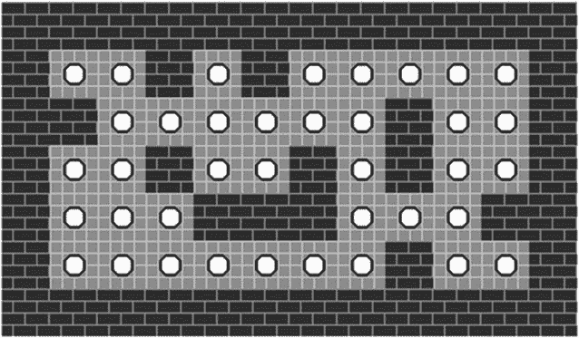
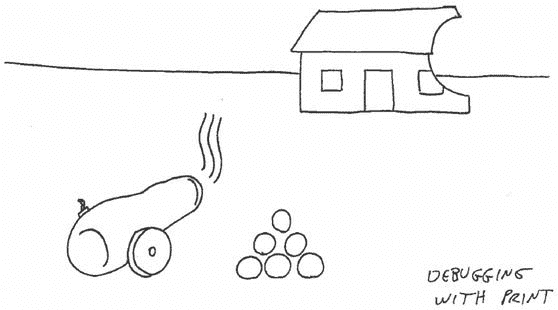

# 五、使用打印语句调试

我看到一片黑暗。—威尔·奥德哈姆，同样由约翰尼·卡什演出

在前三章中，我们已经看到了大量的程序错误和导致这些错误的缺陷。我们已经学习了错误传播和作为消除错误的一般方法的科学方法。我们如何将这些知识付诸实践？在这一章和接下来的章节中，我们将收集工具来诊断程序，以便发现缺陷。在这一章中，我们从一个非常简单但功能强大的诊断工具开始:`print`。

我们将诊断的代码是绘制游戏中的图形。我们将把我们生成的迷宫绘制成屏幕上的图像。作为输入数据，我们将使用第三章中基于字符串的表示法。这意味着每当游戏中的一些东西改变时，我们将重新计算图像(对于一个快速的游戏，这不是一个很好的方法，但对现在来说足够了)。在这一章中，我们将编写一个函数，从`X * Y`个小方块中合成整个迷宫的图像。我们将从几个导入和一个表示随机迷宫的字符串开始:

```py
from pygame import image, Rect, Surface
from load_tiles import load_tiles, get_tile_rect, SIZE
from generate_maze import create_maze

level = """

        ############
        #...#.##.#.#
        #.##.......#
        #....##.##.#
        #.#.##...#.#
        #......#...#
        ############"""

```

我们首先通过将字符串分成单独的行，将迷宫数据转换成一个列表。为了便于重用，我们将代码包装在一个函数中:

```py
def  parse_grid(data):
     """Parses the string representation into a nested list"""

     return [list(row) for row  in data.strip().split("\n")]

```

在得到的嵌套列表中，我们可以通过瓦片的行和列索引(即`level[y][x])`)来寻址瓦片。接下来，我们实现绘制网格本身的函数。我们使用 Pygame 的`Surface.blit`方法将图像的一部分从一个矩形区域复制到另一个矩形区域:

```py
def draw_grid(data, tile_img, tiles):
    """Returns an image of a tile-based grid"""

    xs = len(data[0]) * SIZE
    ys = len(data) * SIZE
    img = Surface((xs,  ys))
    for y, row in enumerate(data):
        for x, char in enumerate(row):
            img.blit(tile_img,  tiles[char],  get_tile_rect(xs, ys))
        return img

```

使用第二章中的`load_tiles`函数，我们可以尝试只用三行画一个关卡。为了清晰和更好的可测试性，我们将把图像写入一个文件:

```py
If __name__== '__main__':
    tile_img, tiles = load_tiles()
    level = create_maze(12, 7)
    level = parse_grid(level)
    maze = draw_grid(level,  tile_img,  tiles)
    image.save(maze,  'maze.png')

```

当我们执行这段代码时，我们观察到程序没有错误地完成了。它还写入一个图像文件。但是当我们查看图像`maze.png`本身时，它只是显示 384 x 224 像素的黑暗(图 5-1 )。


图 5-1。

Output of the buggy function draw grid(). To find out why we see darkness, we need to generate diagnostic information.

程序完成了，但是没有我们预期的那样。我们刚刚发现了另一个语义错误。在本章中，我们将通过添加`print`语句来诊断我们的代码。对于很多 Python 程序员来说，`print`是他们的头号调试工具。`print`解决了调试语义错误的一个主要问题:缺乏信息。

印刷品是收集观察数据的一种非常直接、简单的工具。尽管如此，它也不是没有危险:很容易过度使用`print`并用诊断语句搞乱你的整个代码。为了避免这样的陷阱，我们将继续严格使用第四章中的科学方法。在这一章中，我们将陈述可以通过在代码中添加`print`语句来回答的假设。

## 诊断代码是否被执行

print 最简单的用法是检查一段代码是否已经执行。在我们的例子中，一个原因可能是没有到达`for`循环。因此，我们制定了以下假设:不执行 for 循环。为了测试这个假设，我们在第一个`for`之后添加了一个单独的`print`语句，它的作用是给我们一个生命的信号。我们预测，如果我们的假设为真，我们将看不到消息:

```py
for y, row in enumerate(data):
    print("I'm stuck in Folsom prison.")
    for x, char in enumerate(row):
        ...

```

实际上，大多数程序员不会在他们的诊断语句中引用约翰尼·卡什的话。下面的内容写起来更快，也更容易在屏幕上看到:

```py
print
("A" * 40)

```

你可能会在喉科医生那里听到这样的输出:

```py
AAAAAAAAAAAAAAAAAAAAAAAAAAAAAAAAAAAAAAAA

```

无论您在`for`之后使用哪个`print`，您都会在输出中看到该消息。`print`的声明给出了一个来自循环内部的生命迹象。执行`for`循环中的代码。因此，我们需要拒绝我们的假设。

## 打印变量的内容

然而，你可能会注意到一些奇怪的事情。我们期望迷宫的每一行都有一条打印线，但是我们只观察到一条。我们需要更多这方面的信息。让我们制定一个新的假设:只处理迷宫的第一行。我们预测`y`将取值`0`并且`x`从 0 到 11(迷宫的宽度)循环。我们将使用`print`来显示这些变量的值，并检验假设。这一次，我们在内部循环中插入一个`print`语句来观察它的工作情况:

```py
for y, row in enumerate(data):
    for x, char in enumerate(row):
        print("x={} \t y={} \t {}".format(x,y,char))

```

这给了我们输出:

```py
x=0     y=0     #
x=1     y=0     #
x=2     y=0     #
x=3     y=0     #
..
x=10     y=0     #
x=11     y=0     #

```

我们已经发现证据表明内部循环执行了 12 次，外部循环只执行了一次。因此我们接受这个假设。打印变量信息是一个非常强大的诊断工具，因为它易于使用。但是，您需要仔细选择要打印的信息。想象一下，我们将处理一个更大的迷宫(或者更一般地说，一个巨大的数据表)。输出会散落在许多屏幕页面上，我们仍然什么也看不到。要有效地使用`print`，必须很好地了解 Python 中的格式字符串和字符串方法。

### 漂亮打印数据结构

寻找只打印第一行的原因，我们可以进一步细化假设。我们应该检查的一点是迷宫数据本身是否有问题。一种可能的解释是迷宫中只有一排(其他的不知何故迷路了)。我们精炼的假设变成:迷宫里只有一排。我们可以通过在函数的开头打印`data`来测试迷宫的完整性。然而，`print(data)`的输出可能很长，难以阅读，因为换行符与列表的行不对应。字符串格式在这里没有多大帮助。更好的替代方法是使用 Python 标准库中的`pprint`模块:

```py
def draw_grid(data, tile_img, tiles):
    """Returns an image of a tile-based grid"""

    from pprint import pprint
    pprint(data)
    ...

```

这给了我们一个很好的迷宫:

```py
['############',
 '#...#.##.#.#',
 '#.##.......#',
 '#....##.##.#',
 '#.#.##...#.#',
 '#......#...#',
 '############']

```

漂亮打印适用于列表、字典、集合、元组以及由前者组成的任何数据。有几个选项，最重要的设置是要显示的嵌套数据结构的线宽和深度。

例如，我们可以用`pprint` `(data, depth=1, width=500)`强制将迷宫打印在一个超长的行上。`pprint`模块对于诊断和产生常规程序输出都很有用。

正如我们所看到的，迷宫数据是正确的，并且包含不止一行。我们再次拒绝这个假设。寻找替代的解释，我们迟早会得出一个类似于下面的假设:外部 for 循环退出得太早。通过剥离、追踪或简单地审查程序代码，我们迟早会发现看似无辜的那一行

```py
        return img

```

该行与内部 for 循环对齐。这意味着，第一行一结束，函数就返回。将语句取消一个级别

```py
    return img

```

让两个循环迭代正确的次数(前面的一个`print`语句将证实这一点)。至此，我们已经纠正了代码中的至少一个缺陷，并生成了大量的控制台输出。在继续之前，这是清理代码中打印语句的好时机。

## 简化输入数据

即使我们刚刚修复了一个缺陷，我们仍然在输出图像中看不到任何东西。显然还有更多缺陷需要修复。因为图像本身是以正确的尺寸创建和书写的，所以最可能的缺陷来源是线条

```py
rect = get_tile_rect(xs, ys)
img.blit(tile_img, tiles[char], rect)

```

我们的后续假设是:带`blit`的线用错了坐标。在这一点上，严格使用科学方法可以避免我们迷失在细节中。简单地打印循环中所有图块的坐标很有诱惑力:

```py
rect = Rect((xs, ys, SIZE, SIZE))
print(tiles[char], rect)
img.blit(tile_img, tiles[char], rect)

```

这会产生一长串 Pygame 矩形对象作为输出:

```py
<rect(0, 0, 32, 32)> <rect(...)>
<rect(0, 0, 32, 32)> <rect(...)>
<rect(0, 0, 32, 32)> <rect(...)>
...

```

只要我们不知道预期的坐标，这些信息就几乎毫无用处。`print`产生的输出数量变得势不可挡。我们不知道先检查哪个矩形。手动计算每个矩形的预期输出也不是一个好主意。我们需要另一个调试策略:简化输入数据。

How exactly does blit work?

在测试我们的假设之前，我们需要预测预期的坐标。这次我已经从上一章的错误中吸取了教训，在写代码之前读了一点关于`blit`的内容。Pygame 方法`blit`将一个矩形区域从一个图像`img`复制到第二个图像`map_img`中的第二个矩形区域。该方法需要三个参数:复制的图像`img`、目标矩形`map_img,`和指定源图像哪一部分应该被复制的矩形。`Rect`对象本身包含四个值:左上角的`x`和`y`坐标以及矩形的宽度和高度。

### 从最少的投入开始

使用 Pygame 时，获得正确的矩形坐标是一个反复出现的问题。我总是把它们弄乱。处理一个持续的问题(它已经持续了四页)，我们将很高兴看到至少一个瓷砖被正确绘制，而不是空白图像。我们缩小了问题的规模，因为我们只需要一个由单块瓷砖组成的迷宫:

```py
level = ['#']

```

当我们计算预期的坐标时，目标图像上的矩形应该在(`0, 0, 32, 32`)处，源矩形也应该在(`0, 0, 32, 32`)处，因为墙砖在`tiles.png`的左上角。使用最少的输入将前面的`print`语句产生的信息量减少到一行:

```py
(<rect(0, 0, 32, 32)>, <rect(1024, 1024, 32, 32)>)

```

产生的图像仍然是黑色的，只是小得多。当我们将打印的坐标与我们的预期值进行比较时，发现第二个矩形`rect`是不正确的。我们有足够的证据接受这个假设。错误的坐标从何而来？当我们仔细检查第二章中的`get_tile_rect`函数时，我们看到它从图块索引计算矩形；例如，(`0, 0`)用于左上角的图块，(`1, 0`)用于左起第二个图块，依此类推。因此，需要检查参数`xs`和`ys`。一个精确的假设是:xs 和 ys 是错误的图块索引。在任何情况下，我们都希望索引是(0，0)。我们可以用一条打印语句来检验这个假设:

```py
print("xs={} \t ys={}".format(xs, ys))

```

这会产生以下输出:

```py
xs=32       ys=32

```

这与预期的 0，0 相差甚远。因此，我们接受这个假设。原来我们把图像的大小`xs`和循环索引`x`搞混了。对这两个变量使用相似的名称可能不是一个好主意。我们需要使用循环索引`x`和`y`来计算矩形:

```py
rect = get_tile_rect(x, y)

```

我们不仅观察正确的矩形:

```py
(<rect(0, 0, 32, 32)>, <rect(0, 0, 32, 32)>)

```

我们还可以在生成的图像上看到单块墙砖(参见图 5-2 )。我们已经修复了另一个缺陷。耶！


图 5-2。

Single wall tile

### 逐渐添加更多的输入数据

现在我们已经让程序处理最少的数据，我们可以再次尝试生成完整的迷宫。但是如果我们用原来的变量代替微观层次，重新运行程序，一切又会一片漆黑。我们又回到了起点！我们的假设仍然是:带有`blit`的线使用了错误的坐标。同样，我们需要更多的诊断数据。同样，开始检查大输出中的单个位置是非常诱人的(例如，使用条件短语):

```py
# check bottom right tile
if x == 11 and y == 6:
    print(tiles[char], rect)

```

这是个馊主意！为什么将一个`if`条件和`print`结合起来是一个坏主意？首先，它通过添加代码块使我们的代码更难阅读。因为我们可能需要测试不止一个条件，有条件的`prints`往往会迅速扩散。第二，使用有条件的打印，我们只探查了数据的一小部分。这使得发现全局变得更加困难。偶尔我会使用条件`print`来限制输出的大小。然而，我更喜欢通过引入一个`ZeroDivisionError`来完全退出程序的策略(也是肮脏的):

```py
print(tiles[char], rect)
1/0

```

虽然有点奇怪，但我更喜欢这个短语，而不是`sys.exit(0)`和`assert False`，因为它写起来更快，而且显然是错误的。条件打印和过早退出都会在调试过程中破坏我们的程序。请将这些工具视为最后的手段。我们将在第七章中看到一种更优雅的探测单值的方式。

在用条件句探索一个巨大的迷宫之前，我们将检查一个几乎最小的输入。什么比单个瓷砖更复杂一点？两块瓷砖！

```py
level = ['##']

```

作为预期输出，我们预测四个矩形:

```py
(<rect(0, 0, 32, 32)>, <rect(0, 0, 32, 32)>)
(<rect(32, 0, 32, 32)>, <rect(0, 0, 32, 32)>)

```

我们观察到以下情况:

```py
(<rect(0, 0, 32, 32)>, <rect(0, 0, 32, 32)>)
(<rect(0, 0, 32, 32)>, <rect(32, 0, 32, 32)>)

```

输出显示了一个奇怪的非墙面瓷砖，旁边还有一个空瓷砖。此外，控制台输出表明矩形的顺序是错误的。因此，我们接受假设并检查代码。原来参数到`blit`的顺序是错的。它是`tiles[char], rect`,而它应该是`rect, tiles[char].`,我们可以完全解释我们的观察结果:两个图块中的第一个被正确绘制，因为两个矩形是相同的。第二块瓷砖覆盖第一块瓷砖(`1, 0`)(参见图 5-3 )。我们可以通过交换两个参数来修复缺陷:


图 5-3。

Full diagnosis of the defect with rectangle coordinates

```py
map_img.blit(img, get_tile_rect(x, y), tiles[char])

```

运行该程序可以正确绘制两块墙砖。这变得更加令人兴奋:我们现在可以再次切换到完整的迷宫，重新运行程序，保持我们的手指交叉…并最终看到完整的迷宫的所有美丽(见图 5-4 )！



图 5-4。

Generated maze image Tip

如果你觉得写自己的小游戏是一个很好的编程练习，但仍然觉得编程图形有点可怕，干脆不要图形了！计算机历史上许多成功的游戏完全基于 ASCII 字符构建的文本或图形。图形在这里主要是因为它们在书中比大量的字符图形看起来更好。

## 打开和关闭打印输出

在整个调试过程中，我们引入了几行代码来产生诊断信息。在我的副本中，我现在在一个 40 行的程序中有 12 行注释。为了正确清理一切，我们必须删除诊断代码。然而，如果我们知道可能需要再次诊断程序的这一部分，我们该怎么办呢？一遍又一遍地重写同样的`print`语句？来回编辑我们的代码会带来引入新错误的严重风险。难道没有可能打开和关闭`print`语句吗？

我们可以从定义调试常数开始:

```py
DEBUG = True

```

然后我们可以使用`DEBUG`变量来决定是否应该打印信息。但是如前所述，在我们的代码中加入诊断条件`prints`并不是一个好主意。想象一下，我们代码中的每个打印语句都被夸大成这样:

```py
if DEBUG:
    print(rect)

```

一个更好的替代方法是用一个`debug_print`函数代替 print，这个函数负责检查`DEBUG`变量并将参数传递给常规的`print`函数:

```py
def debug_print(*args):
    if DEBUG:
        print(*args)

```

我们甚至可以将它与一个条件项结合起来:

```py
def debug_print(*args, **kwargs):
    condition = kwargs.get('condition', True)
    if DEBUG and condition:

```

```py
        print(*args)

debug_print(rect, tiles[char], condition=(x==0))

```

尽管如此，每当我们想要打开或关闭调试时，我们都必须在代码中编辑`DEBUG`变量。我们可以添加一个简单的命令行选项:

```py
import sys
DEBUG = "-d" in sys.argv

```

现在我们可以在调试模式下用

```py
python draw_maze.py -d

```

随着程序的发展，对诊断输出和命令行选项的处理可以进一步扩展。标准模块`logging`和`argparse`为相同的目的提供了更健壮的实现。

## 完全码

下面给出了完整的工作代码，包括导入和可选的诊断语句:

```py
from pygame import image, Rect, Surface
from load_tiles import load_tiles, get_tile_rect,  SIZE
from generate_maze import create_maze
from util import debug_print

def  parse_grid(data):
     """Parses the string representation into a nested list"""

     return [list(row) for row in data.strip().split("\n")]

def  draw_grid(data,  tile_img,  tiles):
     """Returns an image of a tile-based grid"""

     debug_print("drawing level", data)
     xsize = len(data[0]) * SIZE ysize = len(data) * SIZE
     img = Surface((xsize,  ysize))
     for y, row in enumerate(data):
         for x, char in enumerate(row):
             rect = get_tile_rect(x,  y)
             img.blit(tile_img, rect, tiles[char])
     return img

if __name__ == ' main  ':
    tile_img, tiles = load_tiles()
    level = create_maze(12, 7)
    level = parse_grid(level)
    maze = draw_grid(level, tile_img, tiles)
    image.save(maze, 'maze.png')

```

## 使用打印报表的利弊

使用`print`来诊断我们的代码很容易。这是一种调试策略，即使是 Python 初学者也可以在一两节课之后应用。`print`允许我们观察工作中的程序，收集信息，并缩小 bug 的来源。这样可以发现很多缺陷。印刷与科学方法和第四章中描述的二分搜索法战略相得益彰。简化输入数据也是如此，这是一种通用的调试策略，并不局限于与`print`的结合。你可能会说，一旦我们发现第一个语义错误，或者甚至在我们开始编写任何代码之前，我们就应该转向最小化输入数据。这是一个伟大的想法；请加油吧！总的来说，`print`是一个强大的诊断工具。

然而，从工程的角度来看，将`print`语句添加到我们的代码中并不是一种优雅的调试方式。首先，我们让程序做一些它原本不想做的事情。从某种意义上来说，我们让代码变得更错误是为了修复它。想象在墙上打洞来检查建筑物是否着火(见图 5-5 )。第二，`print`语句让我们正在调试的代码变得更难读，输出变得更难读(当打印输出和程序的常规输出混在一起的时候)。第三，我们需要删除之后的每一个打印，这使得调试过程变得乏味并且更容易出错，特别是如果我们为了下一个 bug 而重新插入它们。最后，添加`print`语句对复杂的 bug 没有多大帮助。有许多缺陷，打印变量值不是很有用。



图 5-5。

Debugging with print is a bit like shooting holes into a wall to see what is inside

然而，`print`是一个非常有效且广泛使用的诊断工具。结合像科学方法这样的系统方法，你可以很好地使用`print`从中小型程序中收集数据。对于更大的程序，您可能需要更复杂的日志记录或其他诊断基础设施。请注意`print`不是唯一的调试工具，干净地使用它需要一点训练。

## 最佳实践

*   `print`是 Python 中一个强大的诊断工具。
*   `print`让您观察给定的行是否已经执行。
*   `print`让您观察变量中的值。
*   如果限制输入数据，输出更容易解释。
*   从最小输入开始，然后逐渐增加输入大小。
*   将条件语句视为最后的手段。
*   一个`DEBUG`变量允许打开和关闭打印信息。
*   使用`print`语句并不是一种非常简洁的编写程序的方式。应该谨慎使用，通常不太适合较大的程序。
*   与科学方法或二分搜索法等严格的方法论结合得很好。