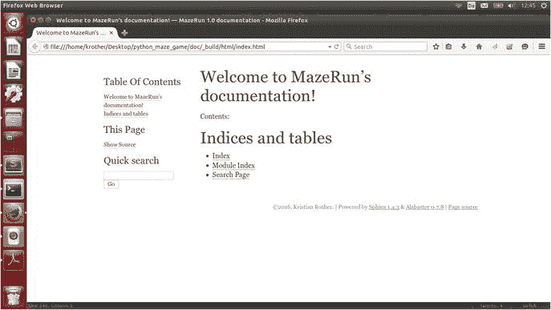
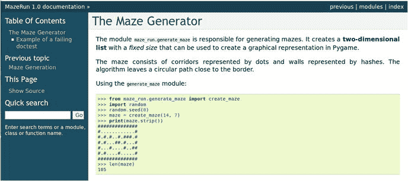

# 十七、文件

“但是即使是单独工作的黑客，”无名师说，“也会和其他人合作，并且必须不断地和他们清楚地交流，以免他的工作变得混乱和丢失。”“你说的其他人？”神童问道。无名师说:“你们所有未来的自己。”—Eric S. Raymond，“Foo 大师和编程神童”

20 世纪 80 年代，当我父母翻新房子的木板时，我母亲在墙和新木板之间放了一张报纸。当我想知道妈妈在做什么时，她解释说:“这是我们给未来的信息。无论谁是下一个更换面板的人，都会找到报纸，看到我们是如何看待当今世界的。”也许几十年后，其他人会在镶板建成时瞥见我们的生活(例如，报纸被认为是历史的见证)。回顾过去是困难的。当然，这比展望未来容易。有一些信息:我们可以看到旧的，木制面板，在他们可能枯萎的状态。我们可以看到已经建成的东西，但看不到我们的精神状态、我们的希望、我们的理由、我们的意图。记录软件是相似的。

当我们编写软件时，文档是我们未来的信息。它有助于未来的开发人员理解我们是如何构建某个东西的，以及它是如何构建的。考虑如下陈述:“该程序包含 7 个类和 23 个函数。”在最好的情况下，这将是对您在代码中看到的内容的准确描述。更常见的是，随着程序的不断发展，这种文档在短时间内就会出错。相比之下，像“我们建造迷宫作为游戏的中心数据结构和它周围的一切”这样的陈述有助于你理解在代码中很难看到的想法。但是后一种说法缺乏技术细节:我们需要在描述想法和技术细节之间找到正确的平衡。在这一章中，我们将探索如何为 Python 项目编写有用的、平衡的文档。

## 我们为谁写文档？

一般来说，我们为三类人写文档:开发人员、其他团队成员和用户。理解这一点是很重要的，在未来的几个月里，作为开发人员，你是你之前写的文档的主要受益者。这就是我们在这里关注以开发人员为中心的文档的原因。在某种程度上，一个好的面向开发人员的文档也可以帮助项目中的其他参与者，例如加入项目的新团队成员或者报告开源项目中的 bug 的人。

这里我们将忽略面向非程序员最终用户的文档。写用户手册或者，例如，一个项目相关的文档当然很重要，但是这是一种完全不同的技术写作。从工程的角度来看，是技术文档挽救了这个项目。

## sphinx:Python 的文档工具

很长一段时间以来，我们已经能够在我们的主项目目录中使用一个单独的`README` `.md`文件，加上一个用于法律事务的`LICENSE.TXT`文件，轻松地记录我们的程序。有很多项目的`README`文件都绰绰有余。但是随着程序的增长，它最终会达到单个文件不再足够的大小。以下是你的程序已经超出了`README`文件的一些症状:

*   `README`文件太长，浏览起来不舒服。
*   该文件描述了许多只与某些人相关的特殊情况。
*   有许多代码示例，很难使它们保持最新。
*   您无法自动验证文档中的代码示例是否正确。

当我们发现前面的一个或多个适用时，是时候切换到更大的文档工具了。我们仍将保留`README`文件，即使只是为了指向更大的文档。在这一章中，我们将使用 Sphinx(Python 可用的标准文档工具)记录我们项目中的迷宫(`generate maze`模块)。许多大大小小的 Python 项目都是用 Sphinx 编写的，包括 Python 本身。

简而言之，Sphinx 结合了我们编写的文档文件和我们正在记录的 Python 源代码。然后 Sphinx 将这些文件编译成 HTML、PDF 和 EPUB 文档(见图 17-1 )。文档文件以 ReStructuredText ( `.rst`格式编写，可能包含自动生成的目录、超链接，甚至自动化测试。在这一章中，在回到什么是好的文档的问题之前，我们将浏览所有这些特性。


图 17-1。

Workflow for creating documentation with Sphinx

### 建立狮身人面像

首先，我们需要安装斯芬克斯。这可以使用`pip:`来完成

```py
pip   install  Sphinx

```

Sphinx 使用了许多其他 Python 包。最值得注意的是，它使用`pygments`库在文本文档中创建语法突出显示的源代码。

我们将在项目的`docs/`文件夹中添加文档。如果您使用了`pyscaffold`来设置您的项目，它应该已经在那里了。如果没有，只需创建一个空的`docs/`目录:

```py
cd docs

```

接下来，我们运行`sphinx-quickstart`来初始化文档:

```py
sphinx-quickstart

```

斯芬克斯问了你很多问题。在大多数情况下，默认值就可以了，但是我建议更改一些值。对于第一个问题，使用默认设置就可以了:

```py
> Root path for the documentation [.]:
..
> Separate source and build directories (y/n) [n]:
..
> Name prefix for templates and static dir [_]:

```

对于项目名称、作者和版本号，您可以插入您喜欢的任何内容:

```py
>  Project  name:
..
>  Author  name(s):
..
>  Project  version:

```

对于接下来的三个问题，默认值是正确的:

```py
> Project release [1]:
> Source file suffix [.rst]:
>  Name  of your master  document  (without suffix) [index]:

```

现在我们已经到了有趣的部分。当程序询问以 epub 格式构建文档时，停止接受默认值。这是一个非常有用的东西，所以我们说“是”。

```py
Sphinx can also add configuration for epub output:
> Do you want to use the epub builder (y/n) [n]: y

```

接下来是扩展。我强烈建议更改一些非常有用的默认值，比如`autodoc,` `doctest,` `todo, ifconfig,`和`viewcode`。

```py
Please indicate if you want to use one of the following Sphinx extensions:
> autodoc: automatically insert docstrings from modules (y/n) [n]: y
> doctest: automatically test code snippets in doctest blocks (y/n) [n]: y
> intersphinx: link between Sphinx documentation of different projects (y/n) [n]:
> todo: write "todo" entries that can be shown or hidden on build (y/n) [n]: y
> coverage: checks for documentation coverage (y/n) [n]:
> pngmath: include math, rendered as PNG images (y/n) [n]:
> mathjax: include math, rendered in the browser by MathJax (y/n) [n]:
> ifconfig: conditional  inclusion  of  content  based  on  config  values  (y/n) [n]: y
> viewcode: include links to the source code of documented Python objects (y/n) [n]: y

```

最后，斯芬克斯询问剧本创作。您可以按两次 enter 键来完成配置。

```py
> Create Makefile? (y/n) [y]:
> Create Windows command file? (y/n) [y]:

```

我们将在后面使用这些特性中的大部分。

### Sphinx 创建的文件

Sphinx 在`doc/`文件夹中创建以下文件:

```py
_build      conf.py     index.rst   Makefile    _static      _templates

```

文件`index.rst`是您的文档的主文件。`_build/`目录将包含编译后的文档。文件`conf.py`包含我们在`sphinx-quickstart`配置脚本中选择的设置，这样我们可以在以后编辑它们。我们现在不需要担心其他文件。

### 构建文档

为了创建文档，我们需要在系统上安装 make 工具和 LaTeX。在 Ubuntu 上，我们可以用

```py
sudo apt-get install make
sudo apt-get install texlive-full

```

注意，LaTeX 包非常大(1.8 GB)！

#### 构建 HTML 文档

我们现在可以通过键入以下命令将文档编译成 HTML

```py
make html

```

当我们在网络浏览器中打开文件`_build/html/index.html`时，我们会看到一个默认页面。该页面还没有包含太多内容，因为我们还没有编写任何文档(您并不期望所有的文档都自己编写，对吗？).也参见图 17-2 。



图 17-2。

Barebones HTML documentation generated by Sphinx

#### 构建 PDF 文档

或者，我们可以编译 PDF 文档。这需要安装 LaTeX 和 pdflatex 包。

```py
make latexpdf

```

PDF 可在`_build/latex`目录中获得。

Warning

在撰写本文时，Sphinx 报告说它无法找到文件`iftex.sty`。我通过手动下载文件并在 Sphinx 需要时多次粘贴文件的完整路径来解决这个问题。我认为这本书出版时这个问题会得到解决。

#### 构建 EPUB 文档

您也可以构建 EPUB 电子书格式:

```py
make epub

```

使用您最喜欢的电子书阅读器打开来自`_build/epub`的文档。

按下`make [TAB]`键，你会看到一个构建文档的其他选项列表。在内部，make 使用了`sphinx-build`程序。构建 HTML 文档的一种更冗长的方式是

```py
sphinx-build -b html . _build/html

```

在哪里？是包含所有源文件的目录，而`_build/html`是编译文档被写入的目录。

## 编写文档

Sphinx 使用`reStructuredText`作为标记格式。一般来说，文档是以文本文件的形式编写的，后缀为`.rst`。记录`generate maze`模块的剩余文件`tile grid.rst`可以包含以下文本:

```py
The Maze Generator
------------------

The module "maze_run.generate_maze" is responsible for generating mazes. It creates a **two-dimensional list** with a *fixed size* that can be used to create a graphical representation in Pygame.

```

迷宫由圆点代表的走廊和散列代表的墙壁组成。该算法在边界附近留下一个圆形路径。

一些特殊字符用于表示格式。例如，给一行加下划线是一个标题，而双撇号为代码、shell 命令等创建固定宽度的字体。同样，您可以制作斜体和粗体文本、图像等等。一些例子见表 17-1 。完整的休止符格式在 [`www.sphinx-doc.org/en/stable/rest.html`](http://www.sphinx-doc.org/en/stable/rest.html) 中解释。

表 17-1。

Markup in the ReStructuredText Format

<colgroup><col> <col></colgroup> 
| 功能 | 剩余标记 |
| --- | --- |
| 大胆的 | *文本* |
| 意大利语族的 | **文本* * |
| 固定宽度(代码) | “代码” |
| 超链接 | `'link name` < [`http://academis.eu/`](http://academis.eu/) > |
| 项目符号列表 | `* first bullet` |
| 列举 | `1.  first item` |
| 标题 1 | `underline with '--------', same length as text` |
| 标题 2 | `underline with '========', same length as text` |
| 标题 3 | `underline  with  '++++++++',  same  length  as  text` |

### 指令

指令是一种特殊的标记。指令是决定 Sphinx 如何生成文档的规则:Sphinx 的大多数有趣特性，如将文档链接在一起、编写 Python 代码和包含 Python 文档字符串，都需要使用指令。所有指令都以..并以::)结尾，因此，例如，在文档中包含图像的指令是

```py
.. image:: example_maze.png

```

### 组织文档

中央的一个指示是`toctree`。它创建了一个树状目录。在 Sphinx 中，所有文档都是按照目录或 toctree 来组织的。

```py
.. toctree::
    mazes.rst
    tile_grid.rst
    sprite.rst
    :maxdepth:  2

```

这里，文档 mazes.rst 和 tile grid.rst 已添加到目录中。指令:`maxdepth` : 2 告诉 Sphinx 不仅要包含这里列出的文档，还要递归地将 toctree 语句中列出的任何文档包含在各自的文档中。当编写 toctree 指令时，我们可以使用绝对和相对路径，并且在一个文档中有多个`toctree`语句。Sphinx 将自动创建整个文档中所有目录树的导航和索引，使用文件中的标题作为标题。

Warning

指令中两个点后面的空格是至关重要的！如果你忘记了，写下来了，例如，..`toctree`:::代替..`toctree`::，Sphinx 会把那一行当做普通文本，不会抱怨。

### 代码示例

编写软件文档时最重要的事情之一就是代码本身。要在`.rst`文件中包含 Python 代码，我们只需设置一个双冒号(::)并引入一个缩进段落:

```py
Using the "generate_maze" module::
    >>> from maze_run.generate_maze import create_maze
    >>> maze = create_maze(14, 7)
    >>> print(maze)
    ##############
    #............#
    #.#.#..#.###.#
    #.#...##.#...#
    #...#....#..##
    #.#....#.....#
    ##############

```

Python 代码将被呈现为语法高亮显示的文本，无论它是否包含提示符号(> > >)。渲染由 pygments 库完成。这个选项足以编写一本包含许多代码示例的食谱(见图 17-3 )。



图 17-3。

HTML output with source code rendered by Sphinx

### 从文档字符串生成文档

如果我们在设置 Sphinx 时安装了`autodoc`扩展，我们可以从 docstrings 为函数、类或整个模块生成文档。在`autofunction`指令中，我们可以引用程序中的一个函数:

```py
.. autofunction:: maze_run.generate_maze.create_maze

```

在文档中，该函数的签名与文档一起出现。如果您还包含了 viewcode 扩展，那么您还会自动获得一个到源代码的链接。

Hint

您需要将`PYTHONPATH`变量设置为带有`maze run`包的目录，以便 Sphinx 可以导入它。你可能已经在前面的某一章中完成了(或者使用`pip`和`-e`选项)。为了使模块可以导入，我偶尔会添加正确的导入路径到`conf.py`中的`sys.path`，如果默认情况下在`PYTHONPATH`变量中找不到的话。

也可以用`automodule`指令发现整个模块:

```py
.. automodule:: maze_run.generate_maze
  :members:

```

Sphinx 收集所有具有 docstring 和模块级 docstring 的函数和类，并编译相应的文档。如果您没有看到由`autodoc`生成的函数描述，这并不意味着这样的函数不存在，只是它没有 docstring。

注意，即使导入失败，Sphinx 也会完成文档的构建。除了几个非常严重的错误，Sphinx 总是试图完成构建，而不是因错误而终止。在生成的文档中查找错误信息(参见图 17-4 )。


图 17-4。

Error messages generated by Python appear in the documentation generated by Sphinx Warning

`autofunction`和`automodule`都以与 Python 程序相同的方式导入模块。在函数体中执行的代码可能有副作用(例如，如果它创建或删除文件)。

## 文档测试

文档测试是将文档和自动化测试结合起来的有效方法。strongdoctests 由 Sphinx 文档中的 Python shell 会话组成。当执行测试时，Sphinx 执行这些会话中的命令，并将它们的输出与文档中的输出进行匹配。这样，我们可以有效地提供被证明是正确的文档。

要编写 doctest，我们需要在 Sphinx 中激活`doctest`扩展(如前面的初始配置中所述)。然后，我们将一个 Python shell 会话复制到一个`.rst`文件中，并将其放在`doctest`指令下。从一组走廊位置生成迷宫的 doctest 如下所示:

```py
.. doctest::

     >>> from maze_run.generate_maze import create_grid_string
     >>> dots = [(1,1), (1, 2), (2,2), (2,3), (3,3)]
     >>> maze = create_grid_string(dots, 5, 5)

     >>> print(maze.strip())
     #####
     #.###
     #..##
     ##..#
     #####

```

要执行测试，请编写

```py
make doctest

```

在输出中，我们获得了每个`.rst`文档通过和未通过测试的概述，以及最后的总结。每一行 Python 代码都被解释为一个单独的测试(因为每一行都可能单独失败):

```py
Document: tile_grid
-------------------
1 items passed all tests:
   4 tests in default
4 tests in 1 items.
4 passed and 0 failed.
Test passed.

Doctest summary
===============
    4 tests
    0  failures  in  tests
    0 failures in setup code
    0 failures in cleanup code
build succeeded.

```

相反，如果我们写了一个失败的测试:

```py
.. doctest::

   >>> 1 + 2
   2

```

在这种情况下，`make` `doctest`的输出包含一条故障消息，指示文档文件中的行:

```py
**********************************************************************
File "tile_grid.rst", line 21, in default
Failed   example:
    1 + 2
Expected:
    2
Got:
    3
**********************************************************************

```

Are doctests a replacement for Unit Tests and other kinds of automated testing?

在某种程度上，我们可以用 doctests 代替自动化测试，就像在第八章中用 pytest 创建的那些测试一样。特别是，如果我们正在测试 Python 库的以用户为中心的一面——它的接口——文档测试是非常有价值的。然而，对于测试较小代码单元的详细功能来说，它们并不是那么好。当我们试图用 doctests 覆盖很多边界案例或者一系列测试场景时，代码量会迅速暴涨。此外，doctests 缺少许多选项，如测试参数化或有选择地运行测试。因此，最佳实践是使用 doctests 来创建经过测试的、人类可读的文档，而不是详尽的测试集。

## 配置 Sphinx

### 待办事项条目

我们可以将文档中的条目标记为待办事项。例如，我们可以使用`todo`指令在文档中标记计划的特性。以下两个功能尚未实现:

```py
.. todo::
Adding caching to the function drawing mazes could accelerate graphics a lot.
.. todo::
Describe how to move an element of a maze.

```

#### 创建待办事项列表

`todolist`指令向我们显示了到目前为止定义的所有 TODO 项目:

```py
TODOs in the MazeRun project
++++++++++++++++++++++++++++
.. todolist::

```

使用`todo`扩展(启动 Sphinx 项目时可配置),我们可以在最终文档中打开和关闭 TODO 项目。`conf.py`中的配置变量用于切换待办事项(默认设置为`True`:

```py
todo_include_todos  =   True

```

或者，我们可以使用命令行选项覆盖配置设置:

```py
sphinx-build -b html -D todo_include_todos=1 . _build/html
sphinx-build -b html -D todo_include_todos=0 . _build/html

```

### 有条件建筑

类似地，我们可以添加自己的变量(例如，为不同的操作系统、处理器架构或简单的长版本和短版本编译文档)。让我们假设我们想要为开发人员构建一个长文档，为网站构建一个短文档作为开胃菜。

这需要打开`ifconfig`扩展(这应该在启动项目时发生，但是我们可以稍后在`conf.py`中添加它)。为了创建我们自己的交换机，我们需要在`conf.py`的末尾定义一个新的配置变量`size`。这可以用几行代码来完成:

```py
size = "long"
def setup(app):
    app.add_config_value('size', ", 'env')

```

接下来，我们在`.rst`文件的`ifconfig`指令中添加可选文本。我们为短版本添加了一小段文本，为长版本添加了一个额外的文档链接。

```py
.. ifconfig:: size == "short"
Magic Methods in MazeRun
++++++++++++++++++++++++
Some classes in MazeRun contain examples for reusable object-oriented design. It uses several magic methods and properties to make it easy to access the data.

.. ifconfig:: size == "long"

   .. include(’magic_methods.rst’)

```

`ifconfig`评估 Python 表达式`size == "short"`。如果计算结果为 True，将呈现段落中的额外文本。我们可以用以下代码来构建文档的长版本和短版本

```py
sphinx-build -b html -D size=long . _build/long_html
sphinx-build -b html -D size=short . _build/short_html

```

为了并行使用多个配置，我们可以编辑`Makefile`来包含它们，或者创建配置文件`conf.py`的第二个副本，并在构建文档时使用`-c`选项在它们之间切换。

### 改变外观和感觉

为了设计您的文档样式或者给它一个公司的外观和感觉，我们可能想要更改 Sphinx 正在使用的模板。Sphinx 有几个内置主题。我们可以通过改变`conf.py`文件中的`html theme`变量来配置它们:

```py
html_theme = 'classic'

```

可能的名字包括`'alabaster', 'classic', 'sphinxdoc', 'sphinx rtd theme', 'scrolls', 'agogo', 'traditional', 'nature', 'haiku', 'pyramid',`和`'bizstyle'`。

对于更详细或定制的更改，我们可以在模板目录中创建自己的模板。在内部，Sphinx 使用 Jinja 作为模板引擎。这意味着我们可以用自己的模板替换部分默认模板，或者只编辑 CSS 文件来改变网站的外观。更多信息见 [`www.sphinx-doc.org/en/stable/templating.html`](http://www.sphinx-doc.org/en/stable/templating.html) 。

## 如何写出好的文档？

写好文档不同于写小说或技术书籍。读者带着许多不同的意图接近他们。有些读者想了解我们节目的基本内容，有些人在寻找非常详细的答案，还有一些人只是想快速查找一些东西。由于这些意图，好的文档需要易于访问、准确且可操作。让每个人一直快乐是非常困难的，甚至可能是不可取的。但是有一些典型的文本部分在许多项目中经常出现。

### 技术文档中的文本部分

我们将考虑以下典型的文本部分作为记录软件的最佳实践。

#### 摘要

好的文档从回答为什么开始。我们为什么要使用这个软件？我们当初为什么要建造它？它解决的唯一问题是什么？好的总结需要简短。

#### 先决条件和安装

软件的一个必要方面是让它工作。我们的文档需要涵盖这一点，即使它只包含一个`pip install`命令。在其他情况下，您可能需要包括分步说明。提及可用的和/或经过测试的平台也是值得的。如果我们认为程序应该在一个特定的平台上工作，但是我们还没有测试它，这也是一个写在安装部分的好东西。

#### 入门指南

本节描述软件的预期主要用途。在许多情况下，这可以被理解为一个“Hello world”的例子。根据我们的程序，这个例子可能包括 Python 代码，一步一步的食谱或两者都有。如果我们的程序不止做一件事，我们可以在这一部分包括一个小的功能浏览。

#### 食谱

食谱是一套说明我们程序使用的食谱，包括代码示例。例子必须完整和准确，这也是 doctests 的荣耀所在。菜谱风格的文档适用于基本和高级功能。

#### 个案研究

一个比食谱更实际的方法是记录案例研究，我们在实践中如何实际使用软件的例子。这将有助于用户更好地感受软件的可行性和不可行性。

#### 技术参考资料

技术参考通常是部分的列举:输入格式的描述、参数表和程序中的函数列表(可能是自动生成的)。这部分是给想查资料的读者看的。Sphinx 的默认搜索功能派上了用场。

#### 设计资料

最高级的读者(那些想要使用我们的源代码的人)会对程序设计的细节感兴趣。在这里，为什么又变得重要了。我们为什么要这样构建程序？我们的主要设计考虑是什么？我们能提供我们软件的可视化概述吗？我们是否应该记录我们的程序设计很大程度上取决于软件的种类。在复杂的服务器架构中，这可能是文档中最重要的部分。

#### 法律方面

文档应该说明谁是作者，指向一个许可，并包含一个法律免责声明(可以在`LICENSE`文件中)。如果你希望被联系，不要忘记你的电子邮件地址。

##### 良好文档的示例

有许多 Python 项目都有很好的文档。这份文件的共同点是，它包含指导性的标题和简短的章节，并避免复杂的词汇。如果特定领域语言的使用不可避免，它们至少会被一致地使用。

一些记录良好的 Python 项目的例子有:

*   gizeh by `zulko` `(` `http://github.com/Zulko/gizeh` `):` gizeh 是一个基于 cairo 构建的用于创建矢量图形的库。文档可以放在一个网页上，但是这个库非常强大。这是一个文档不需要很长的例子。
*   本书中使用的测试框架文档在记录基本特性和高级特性之间找到了恰当的平衡。在首页，有一个详细但结构清晰的目录。前两节介绍了基础知识，对于基本的使用已经足够了。其余部分(大约三分之二)描述了特殊的用例。通过关注具体的例子，作者避免解释每一个可能的特例。
*   sci kit-learn`(`[`http://scikit-learn.org`](http://scikit-learn.org)):Python 中机器学习的头号库(Learning s ci kit-learn:Machine Learning in Python，Raúl Garreta 和 Guillermo Moncecchi，JMLR 12，第 2825–2830 页，Packt 出版社，2011 年。)必须平衡两个挑战:

首先，库本身是巨大的，其次，底层概念是复杂的。由此产生的文档非常庞大，其中有许多好东西可以找到。我想指出使用图像来说明不同的方法(如 [`http://scikit-learn.org/stable/auto_examples/classification/plot_classifier_comparison.html`](http://scikit-learn.org/stable/auto_examples/classification/plot_classifier_comparison.html) `).`

Tip

您可以使用以下浏览器查看 Pygame 文档:

```py
python  -m  pygame.docs

```

像编写软件一样，编写文档是一个迭代的过程。不要期望“一劳永逸地”清理文档理想的最佳实践是并行维护文档和代码。这并不意味着我们每次修改代码时都需要更新文档。目标是记录那些不经常改变的东西。对于经常变化的部分，我们的源代码中的注释或源代码本身是一个更好的地方。将 Sphinx 与 doctests 结合使用使我们的生活变得容易多了，因为我们可以检查文档的哪些部分是正确的。

## 其他文档工具

值得一提的是，还有许多其他工具可以帮助维护 Python 项目的文档。其中一些被认为是 Sphinx 的可能替代品，但大多数是对 Sphinx 提供的功能的补充:

### MkDocs

与 Sphinx 相比，MkDocs 是一个轻量级的文档工具。它将 Markdown 格式的文档呈现为 HTML，并提供了许多模板。它具有预览功能；也就是说，我们可以在编写时看到渲染的文档。目前，MkDocs 没有像 Sphinx 那样直接包含 Python 文档字符串的任何功能。 [`www.mkdocs.org/`见](http://www.mkdocs.org/)。

### jupyter 笔记型电脑

Jupyter 笔记本提供了文本和可执行代码的独特组合。它们服务于记录工作的目的，特别是在快速发展的项目中。当我们为数据分析编写代码，并希望与结果、图表和描述我们想法的文本一起分享时，笔记本是一种被广泛接受的工具。`http://jupyter.org/`见。Jupyter 笔记本可以结合 reveal.js 将笔记本转换成幻灯片演示`(` [`http://lab.hakim.se/reveal-js/`](http://lab.hakim.se/reveal-js/) `).`

### Gitbook

Gitbook 是一个以多种电子书格式(PDF、EPUB、MOBI 和 HTML)创建文档的程序。它也是一个门户网站，建立和托管由此产生的电子书。Gitbook 使用 Markdown 格式作为标记语言。对于教程和指南来说，Gitbook 是一个很好的选择，因为它与源代码的集成没有 Sphinx 那么紧密。在更新的版本中，Gitbook 支持多语言文档。 [`www.gitbook.io`见](http://www.gitbook.io)。

### 阅读文件

read Docs 提供了用 Sphinx 和 MkDocs 构建的文档的免费托管。该服务允许使用 git web-hooks，这样一旦我们将更改推送到包含我们文档的 git 存储库，文档就会自动重建。 [`http://readthedocs.org/`见](http://readthedocs.org/)。

### pydoc

`pydoc`工具显示控制台中任何可导入模块的文档。例如，如果我们在带有`maze run.py`文件的目录中:

```py
pydoc maze_run

```

`pydoc`还允许搜索文档、创建 HTML 文档以及启动本地 web 服务器浏览文档。`pydoc`默认随 Python 一起安装。详见`pydoc  --help`。

### 表面抗原-5

由 Eric A. Meyer 建立的 S5 布局是用于幻灯片演示的 HTML5 模板的标准。它们允许以 Markdown 格式编写演示文稿，并将其编译成幻灯片。 [`http://meyerweb.com/eric/tools/s5/`见](http://meyerweb.com/eric/tools/s5/)。

### 色素细胞

`pygments`是 Sphinx 用来将 Python 代码呈现为语法突出显示的表示的 Python 库。pygments 可以为这个星球上的大多数编程语言创建 HTML 表示。如果我们想在自己的基于 Python 的网站上显示 Python 代码，`pygments`是首选工具。 [`http://pygments.org/`见](http://pygments.org/)。

### doctest(测试)

Python 标准库中的`doctest`模块可以独立于 Sphinx 使用。我们可以将文档测试直接写入我们的文档字符串，并使用

```py
python  -m  doctest  my program.py

```

[`http://docs.python.org/3/library/doctest.html`见](http://docs.python.org/3/library/doctest.html)。

### PyPDF2

Python 库`PyPDF2`允许用几行 Python 代码拆分和合并 PDF 文档。我发现它对 pdf 的后处理非常有用(例如，添加封面)。`http://github.com/mstamy2/PyPDF2`见。

### 潘多克

使用 pandoc，您可以快速地将各种标记格式相互转换，并生成 Word 或 PDF 文档。控制各种不同的文件是非常方便的。 [`http://pandoc.org/`见](http://pandoc.org/)。

## 最佳实践

1.  Sphinx 是一个为 Python 项目构建文档的工具。
2.  Sphinx 将文档构建为 HTML、PDF 或 EPUB 文档。
3.  它使用 ReStructuredText 格式作为标记语言。
4.  指令链接多个`.rst`文档，包括图像，或者触发 Sphinx 的其他特殊功能。
5.  文档中的 Python 代码通过 pygments 语法高亮显示。
6.  Python 函数和模块的文档可以从 docstrings 自动生成。
7.  文档测试是写入文档的 shell 会话。它们可以由 Sphinx 执行，有效地验证您的文档是否正确。
8.  使用配置变量可以打开和关闭文档的某些部分。
9.  对于技术和非技术读者来说，好的文档包括为什么和如何使用一个软件。