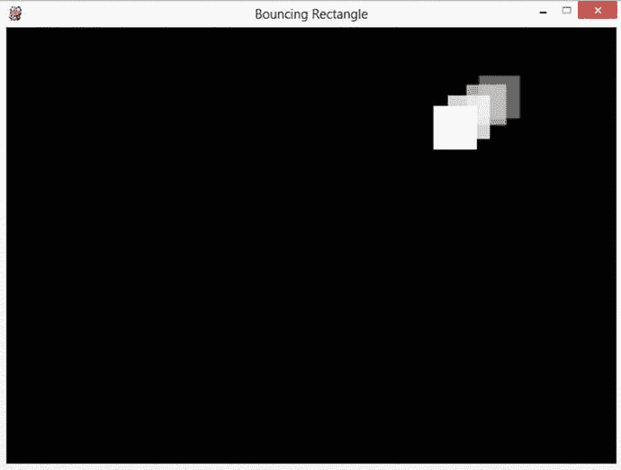
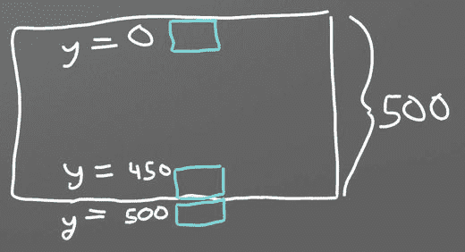
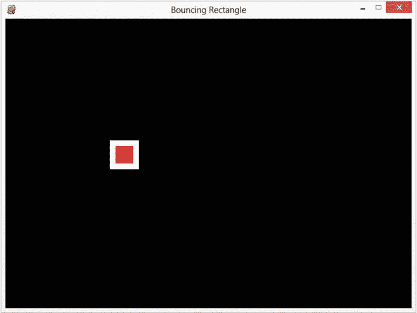
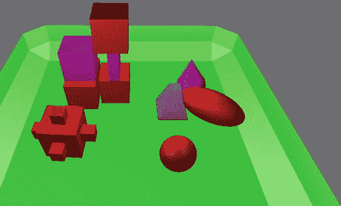

# 九、动画介绍

为了开始我们的第一个动画，让我们从《T2》第六章的基本 pygame 程序开始，它打开了一个空白屏幕。`pygame_base_template.py`的来源可以在这里找到: [`ProgramArcadeGames.com/python_examples/f.php?file=pygame_base_template.py`](http://ProgramArcadeGames.com/python_examples/f.php?file=pygame_base_template.py)

我们将编写一个程序，在黑色背景的屏幕上弹出一个白色的矩形。随意挑选你自己的颜色；只是要确保背景颜色不同于矩形的颜色！

第一步:从基础模板开始，将背景色从白色翻转为黑色。这段代码应该在第 46 行左右。

`screen.fill(BLACK)`

接下来，画出我们打算制作动画的矩形。一个简单的矩形就足够了。这段代码应该放在清空屏幕之后，翻转屏幕之前。

`pygame.draw.rect(screen, WHITE, [50, 50, 50, 50])`

每次通过循环，矩形将在(x，y)位置精确地(50，50)绘制。这由列表中的前两个 50 控制。在这些数字改变之前，正方形不会移动。

该矩形宽 50 像素，高 50 像素。尺寸由列表中的最后两个数字控制。我们也可以称这个矩形为正方形，因为它有相同的宽度和高度。我将坚持称它为矩形，因为所有的正方形也是矩形，并且取决于所使用的显示器和分辨率，像素并不总是正方形。如果你真的对这个主题感兴趣，可以查一下像素长宽比。

我们如何不断改变位置而不是停留在(50，50)？当然是用变量啦！下面的代码是实现这一目标的第一步:

`rect_x = 50`

`pygame.draw.rect(screen, WHITE, [rect_x, 50, 50, 50])`

要向右移动矩形，`x`可以每帧增加一。这段代码很接近，但并没有完全做到:

`rect_x = 50`

`pygame.draw.rect(screen, WHITE, [rect_x, 50, 50, 50])`

`rect_x += 1`

上面代码的问题是`rect_x`每次通过循环都被重置回 50。要解决这个问题，将`rect_x`的初始化移到循环之外。下一段代码将成功地将矩形向右滑动。

`# Starting x position of the rectangle`

`# Note how this is outside the main while loop.`

`rect_x = 50`

`# -------- Main Program Loop -----------`

`while not done:`

`for event in pygame.event.get(): # User did something`

`if event.type == pygame.QUIT: # If user clicked close`

`done = True # Flag that we are done so we exit this loop`

`# Set the screen background`

`screen.fill(BLACK)`

`pygame.draw.rect(screen, WHITE, [rect_x, 50, 50, 50])`

`rect_x += 1`

要更快地移动盒子，不要将`rect_x`增加 1，而是增加 5:

`rect_x += 5`

我们可以扩展这段代码，增加 x 和 y，使正方形同时向下和向右移动:

`# Starting position of the rectangle`

`rect_x = 50`

`rect_y = 50`

`# -------- Main Program Loop -----------`

`while not done:`

`for event in pygame.event.get():`

`if event.type == pygame.QUIT:`

`done = True`

`# Set the screen background`

`screen.fill(BLACK)`

`# Draw the rectangle`

`pygame.draw.rect(screen, WHITE, [rect_x, rect_y, 50, 50])`

`# Move the rectangle starting point`

`rect_x += 5`

`rect_y += 5`

盒子移动的方向和速度可以存储在一个矢量中。这使得移动物体的方向和速度很容易被改变。下一段代码展示了如何使用变量来存储(5，5)的 x 和 y 变化。

`# Starting position of the rectangle`

`rect_x = 50`

`rect_y = 50`

`# Speed and direction of rectangle`

`rect_change_x = 5`

`rect_change_y = 5`

`# -------- Main Program Loop -----------`

`while done == False:`

`for event in pygame.event.get(): # User did something`

`if event.type == pygame.QUIT: # If user clicked close`

`done = True # Flag that we are done so we exit this loop`

`# Set the screen background`

`screen.fill(BLACK)`

`# Draw the rectangle`

`pygame.draw.rect(screen, WHITE, [rect_x, rect_y, 50, 50])`

`# Move the rectangle starting point`

`rect_x += rect_change_x`

`rect_y += rect_change_y`

一旦盒子碰到屏幕的边缘，它就会继续前进。没有什么能让矩形从屏幕边缘反弹回来。为了反转方向，使矩形向右移动，一旦矩形到达屏幕的底部，`rect_change_y`需要从 5 变为-5。当`rect_y`大于屏幕高度时，矩形在底部。下面的代码可以进行检查并反转方向:

`# Bounce the rectangle if needed`

`if rect_y > 450:`

`rect_change_y = rect_change_y * -1`

基于 y 坐标的矩形定位

为什么对照 450 查`rect_y`？如果屏幕是 500 像素高，那么检查 500 将是一个合乎逻辑的第一猜测。但是记住矩形是从矩形的左上角开始绘制的。如果矩形从 500 开始画，它会从 500 画到 550，在反弹之前完全离开屏幕。

考虑到矩形是 50 像素高，正确的反弹位置是:$500-50=450$。

下面的代码将从 700x400 窗口的所有四个边反弹矩形:

`# Bounce the rectangle if needed`

`if rect_y > 450 or rect_y < 0:`

`rect_change_y = rect_change_y * -1`

`if rect_x > 650 or rect_x < 0:`

`rect_change_x = rect_change_x * -1`

对比矩形更复杂的形状感兴趣？基于`rect_x`和`rect_y`可以使用几个绘图命令。下面的代码在白色矩形内绘制了一个红色矩形。红色矩形在 x、y 方向上从白色矩形的左上角偏移 10 个像素。它在两个维度上都小了 20 个像素，导致红色矩形周围有 10 个白色像素。见上图。

中间有红色方块的白色矩形

`# Draw a red rectangle inside the white one`

`pygame.draw.rect(screen, WHITE, [rect_x, rect_y, 50, 50])`

`pygame.draw.rect(screen, RED, [rect_x + 10, rect_y + 10,30, 30])`

## 动画雪

只制作一个物品的动画还不够吗？需要更多动画？能够一次制作数百个物体的动画怎么样？让我们扩展上面的代码，学习如何制作许多物体的动画。

### 代码解释

要启动这个程序，从打开一个空白屏幕的基本 pygame 模板开始。同样，`pygame_base_template.py`的来源可以在这里找到:

[`ProgramArcadeGames.com/python_examples/f.php?file=pygame_base_template.py`](http://ProgramArcadeGames.com/python_examples/f.php?file=pygame_base_template.py)

通过使用随机数，可以为星星、雪或雨等事物创建 x，y 位置。尝试这个的最简单的方法是使用一个`for`循环在随机的 x，y 位置画圆。在主`while`循环中尝试下面的代码。

`for i in range(50):`

`x = random.randrange(0, 400)`

`y = random.randrange(0, 400)`

`pygame.draw.circle(screen, WHITE, [x, y], 2)`

试试看；这个程序有一个奇怪的问题！每秒二十次，每次通过循环，它在新的随机位置绘制雪。尝试调整雪花数量，看看它如何改变图像。

显然，我们需要随机放置雪花，并让它们保持在同一个位置。我们不想每秒钟生成 20 次新位置。我们需要保留一份他们在哪里的名单。该程序可以使用 python 列表来完成这项工作。这应该在主循环之前完成，否则程序会每 1/20 秒向列表中添加 50 个新雪花。

`for i in range(50):`

`x = random.randrange(0, 400)`

`y = random.randrange(0, 400)`

`snow_list.append([x, y])`

一旦雪花位置被添加，它们可以像普通列表一样被访问。以下代码将打印第一个位置的 x 和 y 坐标，存储在零位置:

`print(snow_list[0])`

如果我们只需要 x 或 y 坐标呢？我们在列表中有列表。主列表上有所有的坐标。在这个列表中，每个坐标都是一个 x 坐标(位置 0)和 y 坐标(位置 1)的列表。例如，这里有三个坐标:

`[[34, 10],`

`[10, 50],`

`[20, 18]]`

要打印位置 0 处的 y 坐标，首先选择坐标 0，然后选择位置 1 处的 y 值。代码将类似于:

`print(snow_list[0][1])`

要打印第 21 个坐标(位置 20)的 x 值，首先选择坐标 20，然后选择位置 0 的 x 值:

`print(snow_list[20][0])`

在主`while`循环中，程序可能会使用一个`for`循环来绘制雪列表中的每个项目。记住，`len(snow_list)`将返回雪花列表中元素的个数。

`# Process each snow flake in the list`

`for i in range(len(snow_list)):`

`#``Draw`

`pygame.draw.circle(screen, WHITE, snow_list[i], 2)`

记住，有两种类型的`for`循环。可以使用另一种类型的循环，它看起来像:

`# Process A COPY of each snow flake’s location in the list`

`for xy_coord in snow_list:`

`# Draw the snow flake`

`pygame.draw.circle(screen, WHITE, xy_coord, 2)`

然而，因为我们计划修改雪花的位置，所以我们不能使用这种类型的`for`循环，因为我们将修改雪花位置的副本的位置，而不是实际雪花的位置。

如果程序要让数组中的所有对象向下移动，比如雪，那么扩展上面创建的`for`循环将导致 y 坐标增加:

`# Process each snow flake in the list`

`for i in range(len(snow_list)):`

`# Draw the snow flake`

`pygame.draw.circle(screen, WHITE, snow_list[i], 2)`

`# Move the snow flake down one pixel`

`snow_list[i][1] += 1`

这使得雪向下移动，但是一旦离开屏幕，就没有新的东西出现了。通过添加下面的代码，雪将重置到屏幕顶部的一个随机位置:

`# If the snow flake has moved off the bottom of the screen`

`if snow_list[i][1] > 400:`

`# Reset it just above the top`

`y = random.randrange(-50, -10)`

`snow_list[i][1] = y`

`# Give it a new x position`

`x = random.randrange(0, 400)`

`snow_list[i][0] = x`

还可以向列表中添加内容，并为屏幕上的每个项目提供不同的大小、形状、颜色、速度和方向。然而，这变得很复杂，因为需要在列表中保存多种类型的数据。现在我们将保持它的简单，但是一旦我们在第 12 章中学习了“类”,管理多个对象的不同属性将变得容易。

### 完整的节目列表

`"""`

`Animating multiple objects using a list.`

`Sample Python/Pygame Programs`

[`http://programarcadegames.com/`](http://programarcadegames.com/)

`Explanation video:`[`http://youtu.be/Gkhz3FuhGoI`](http://youtu.be/Gkhz3FuhGoI)

`"""`

`# Import a library of functions called ’pygame’`

`import pygame`

`import random`

`# Initialize the game engine`

`pygame.init()`

`BLACK = [0, 0, 0]`

`WHITE = [255, 255, 255]`

`# Set the height and width of the screen`

`SIZE = [400, 400]`

`screen = pygame.display.set_mode(SIZE)`

`pygame.display.set_caption("Snow Animation")`

`# Create an empty array`

`snow_list = []`

`# Loop 50 times and add a snow flake in a random x,y position`

`for i in range(50):`

`x = random.randrange(0, 400)`

`y = random.randrange(0, 400)`

`snow_list.append([x, y])`

`clock = pygame.time.Clock()`

`# Loop until the user clicks the close button.`

`done = False`

`while not done:`

`for event in pygame.event.get():   # User did something`

`if event.type == pygame.QUIT:  # If user clicked close`

`done = True   # Flag that we are done so we exit this loop`

`# Set the screen background`

`screen.fill(BLACK)`

`# Process each snow flake in the list`

`for i in range(len(snow_list)):`

`# Draw the snow flake`

`pygame.draw.circle(screen, WHITE, snow_list[i], 2)`

`# Move the snow flake down one pixel`

`snow_list[i][1] += 1`

`# If the snow flake has moved off the bottom of the screen`

`if snow_list[i][1] > 400:`

`# Reset it just above the top`

`y = random.randrange(-50, -10)`

`snow_list[i][1] = y`

`# Give it a new x position`

`x = random.randrange(0, 400)`

`snow_list[i][0] = x`

`# Go ahead and update the screen with what we’ve drawn.`

`pygame.display.flip()`

`clock.tick(20)`

`pygame.quit()`

这个例子显示了每片雪花向同一个方向移动。如果每个项目都需要单独制作动画，并有自己的方向，该怎么办？如果你的游戏需要这个，请看第 13 章关于如何使用职业。附录中的“类和图形”练习指导你如何制作数百个不同的动画项目，每个项目都有自己的方向。

## 三维动画

从一个 2D 环境扩展到一个包含游戏物理的 3D 环境并不像看起来那么难。虽然这超出了本书的范围，但还是值得看看它是如何做到的。

有一个免费的 3D 程序叫做 Blender，它有一个“游戏引擎”，允许程序员创建 3D 游戏。游戏中的 3D 对象可以附加 Python 代码来控制它们在游戏中的动作。

基于搅拌机的游戏

看上图。这显示了一个绿色托盘，里面有几个对象。蓝色对象由 Python 脚本控制，该脚本使它在托盘周围移动，撞到其他对象。如下所示的脚本具有许多与 2D 程序相同的特性。有一个主循环，有一个 x，y 位置的列表，还有控制向量的变量。

主程序循环由 Blender 控制。清单中显示的 python 代码由 Blender 为游戏呈现的每个“帧”调用。这就是 Python 代码没有显示主程序循环的原因。然而，它确实存在。

蓝色对象的位置以 x，y，z 格式保存。可以通过使用`blue_object.position`变量来访问和更改它。数组位置 0 保存 x，位置 1 保存 y，位置 2 保存 z 位置。

这个 Blender 示例使用关联数组位置，而不是在这个转换器的 2D 示例中使用的`change_x`和`change_y`变量:

`blue_object["x_change"]`

`blue_object["y_change"]`

`if`语句检查蓝色物体是否已经到达屏幕边界，方向是否需要反转。与 2D 奥运会中使用的像素不同，物体的位置可以是浮点数类型。要将项目定位在 5 和 6 之间，允许将其位置设置为 5.5。

`# Import Blender Game Engine`

`import bge`

`# Get a reference to the blue object`

`cont = bge.logic.getCurrentController()`

`blue_object = cont.owner`

`# Print the x,y coordinates where the blue object is`

`print(blue_object.position[0], blue_object.position[1] )`

`# Change x,y coordinates according to x_change and`

`# y_change. x_change and y_change are game properties`

`# associated with the blue object.`

`blue_object.position[0] += blue_object["x_change"]`

`blue_object.position[1] += blue_object["y_change"]`

`# Check to see of the object has gone to the edge.`

`# If so reverse direction. Do so with all 4 edges.`

`if blue_object.position[0] > 6 and blue_object["x_change"] > 0:`

`blue_object["x_change"] *= -1`

`if blue_object.position[0] < -6 and blue_object["x_change"] < 0:`

`blue_object["x_change"] *= -1`

`if blue_object.position[1] > 6 and blue_object["y_change"] > 0:`

`blue_object["y_change"] *= -1`

`if blue_object.` `position[1] < -6 and blue_object["y_change"] < 0:`

`blue_object["y_change"] *= -1`

Blender 可从: [`http://www.blender.org/`](http://www.blender.org/) 下载

完整的 blender 示例文件可在: [`ProgramArcadeGames.com/chapters/08_intro_to_animation/simple_block_move.blend`](http://ProgramArcadeGames.com/chapters/08_intro_to_animation/simple_block_move.blend) 获得。

## 回顾

### 多项选择测验

In the bouncing rectangle program, if `rect_change_x` is positive and `rect_change_y` is negative, which way will the rectangle travel? Up   Up and right   Right   Down and right   Down   Down and left   Left   Up and left     In the bouncing rectangle program, if `rect_change_x` is zero and `rect_change_y` is positive, which way will the rectangle travel? Up   Up and right   Right   Down and right   Down   Down and left   Left   Up and left     This code is supposed to draw a white rectangle. But when the program is run, no rectangle shows up. Why? `import pygame` `# Define some colors` `BLACK    = (   0,   0,   0)` `WHITE    = ( 255, 255, 255)` `pygame.init()` `# Set the height and width of the screen` `size = [700, 500]` `screen = pygame.display.set_mode(size)` `# Loop until the user clicks the close button.` `done = False` `# Used to manage how fast the screen updates` `clock = pygame.time.Clock()` `# -------- Main Program Loop -----------` `while not done:`     `for event in pygame.event.get():`         `if event.type == pygame.QUIT:`             `done = True`     `# Set the screen background`     `screen.fill(BLACK)`     `# Draw the rectangle`     `pygame.draw.rect(screen, WHITE, [50, 50, 50, 50])`     `# Limit to 20 frames per second`     `clock.tick(20)` `# Be IDLE friendly. If you forget this line, the program will ’hang’` `# on exit.` `pygame.quit()` The rectangle dimensions are offscreen.   There is no `flip` command.   The rectangle is the same color as the background.   The rectangle is drawn outside the main program loop.   The rectangle is too small to see.   The rectangle should be drawn earlier in the code.     This code is supposed to draw a white rectangle. But when the program is run, no rectangle shows up. Curiously, when the user hits the close button, the rectangle briefly appears before the program closes. Why? `import pygame` `# Define some colors` `BLACK    = (   0,   0,   0)` `WHITE    = ( 255, 255, 255)` `pygame.init()` `# Set the height and width of the screen` `size = [700, 500]` `screen = pygame.display.set_mode(size)` `# Loop until the user clicks the close button.` `done = False` `# Used to manage how fast the screen updates` `clock = pygame.time.Clock()` `# -------- Main Program Loop -----------` `while not done:`     `for event in pygame.event.get():`         `if event.type == pygame.QUIT:`             `done = True`     `# Set the screen background`     `screen.fill(BLACK)`     `# Draw the rectangle`     `pygame.draw.rect(screen, WHITE, [50, 50, 50, 50])`     `# Limit to 20 frames per second`     `clock.tick(20)` `# Go ahead and update the screen with what we’ve drawn.` `pygame.display.flip()` `# Be IDLE friendly. If you forget this line, the program will ’hang’` `# on exit.` `pygame.quit()` The rectangle dimensions are offscreen.   The `flip` is unindented and doesn’t show until after the program ends.   The rectangle is the same color as the background.   The rectangle is drawn outside the main program loop.   The rectangle is too small to see.   The `flip` should be done before the rectangle is drawn.     This version of “The Bouncing Rectangle” doesn’t work. The rectangle won’t move. Why? `import pygame` `# Define some colors` `BLACK    = (   0,   0,   0)` `WHITE    = ( 255, 255, 255)` `pygame.init()` `# Set the height and width of the screen` `size = [700, 500]` `screen = pygame.display.set_mode(size)` `#Loop until the user clicks the close button.` `done = False` `# Used to manage how fast the screen updates` `clock = pygame.time.Clock()` `# Speed and direction of rectangle` `rect_change_x = 5` `rect_change_y = 5` `# -------- Main Program Loop -----------` `while not done:`     `for event in pygame.event.get():`         `if event.type == pygame.QUIT:`             `done=True`     `# Starting position of the rectangle`     `rect_x = 50`     `rect_y = 50`     `# Move the rectangle starting point`     `rect_x += rect_change_x`     `rect_y += rect_change_y`     `# Bounce the ball if needed`     `if rect_y > 450 or rect_y < 0:`         `rect_change_y = rect_change_y * -1`     `if rect_x > 650 or rect_x < 0:`         `rect_change_x = rect_change_x * -1`     `# Set the screen background`     `screen.fill(BLACK)`     `# Draw the rectangle`     `pygame.draw.rect(screen, WHITE, [rect_x, rect_y, 50, 50])`     `# Limit to 20 frames per second`     `clock.tick(20)`     `# Go ahead and update the screen with what we’ve drawn.`     `pygame.display.flip()` `# Be IDLE friendly. If you forget this line, the program will ’hang’` `# on exit.` `pygame.quit ()` `pygame.draw.rect` doesn’t change where the rectangle is drawn based on the variables.   `rect_x` and `rect_y` are reset to 50 each time through the loop.   The `50,50` in the draw command also needs to be changed to `rect_x,rect_y`   The lines to adjust `rect_x` and `rect_y` need to be outside the `while` loop.     What is the correct code to make the rectangle bounce of the left and right sides of the screen? `if rect_x > 450 or rect_x < 0:` `rect_x = rect_x * -1`   `if rect_x > 450 or rect_x < 0:` `rect_change_x = rect_change_x * -1`   `if rect_y > 450 or rect_y < 0:` `rect_y = rect_y * -1`   `if rect_y > 450 or rect_y < 0:` `rect_change_y = rect_change_y * -1`     Why does this code not work for drawing stars? `for i in range(50):`     `x = random.randrange(0,400)`     `y = random.randrange(0,400)`     `pygame.draw.circle(screen, WHITE, [x, y], 2)` The stars are drawn offscreen.   The variable `i` should be used when drawing stars.   The stars get brand-new locations each time a frame is drawn.   The stars are drawn too small to be seen.   The x and y coordinates are reversed.    

### 简答工作表

Why does using this code in the main loop not work to move the rectangle? `rect_x = 50` `pygame.draw.rect(screen, WHITE, [rect_x, 50, 50, 50])` `rect_x += 1`   The example code to bounce a rectangle used a total of four variables. What did each variable represent?   If the screen is 400 pixels tall, and the shape is 20 pixels high, at what point should the code check to see if the shape is in contact with the bottom of the screen.   Explain what is wrong with the following code (explain it, don’t just correct the code): `if rect_y > 450 or rect_y < 0:`     `rect_y = rect_y * -1`   A student is animating a stick figure. He creates separate variables for tracking the position of the head, torso, legs, and arms. When the figure moves to the right he adds one to each of the variables. Explain an easier way to do this that only requires one pair of x, y variables.   When drawing a starry background, explain why it doesn’t work to put code like this in the main program loop: `for i in range(50):`     `x = random.randrange(0, 400)`     `y = random.randrange(0, 400)`     `pygame.draw.circle(screen, WHITE, [x, y], 2)`   Explain how to animate dozens of items at the same time.   If you have a list of coordinates like the following, what code would be required to print out the array location that holds the number 33? `stars = [[ 3,  4],`           `[33, 94],`           `[ 0,  0]]`   This code example causes snow to fall: `# Process each snow flake in the list` `for i in range(len(snow_list)):`     `# Get the x and y from the lies`     `x = snow_list[i][0]`     `y = snow_list[i][1]`     `# Draw the snow flake`     `pygame.draw.circle(screen, WHITE, [x, y], 2)`     `# Move the snow flake down one pixel`     `snow_list[i][1] += 1` So does the example below. Explain why this example works as well. `# Process each snow flake in the list` `for i in range(len(snow_list)):`     `# Draw the snow flake`     `pygame.draw.circle(screen, WHITE, snow_list[i], 2)`     `# Move the snow flake down one pixel`     `snow_list[i][1] += 1`   Take a look at the `radar_sweep.py` program. You can find this example under the “graphics examples” subsection on the examples page. The `radar_sweep.py` is near the end of that list. Explain how this program animates the sweep to go in a circle.  

### 锻炼

查看附录中本章附带的练习“动画”。