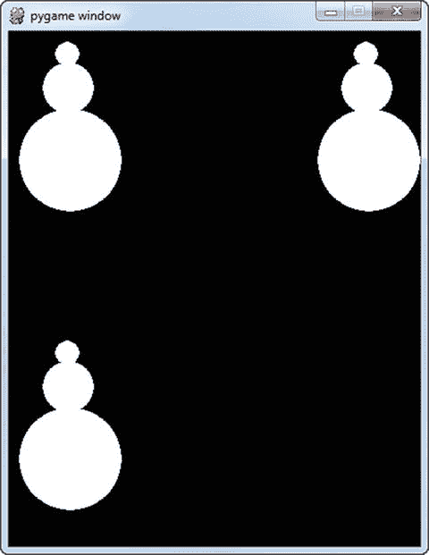
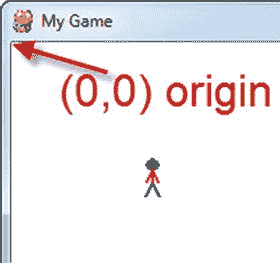
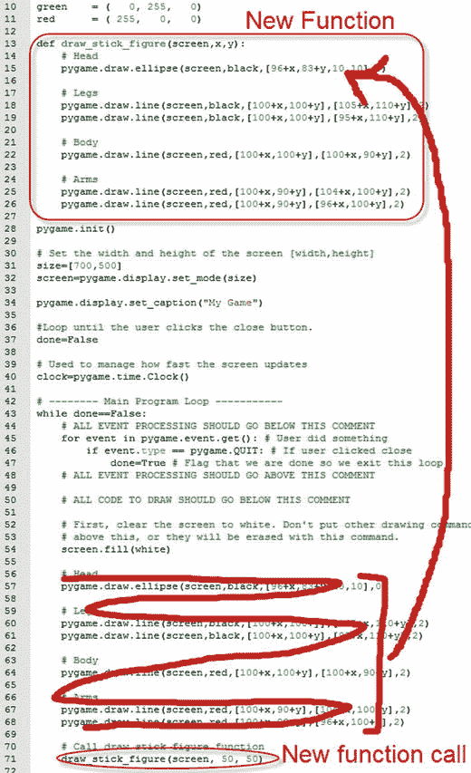
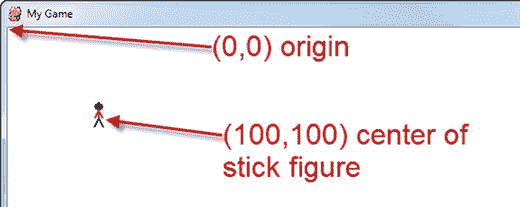

# 十一、控制器和屏幕

我们如何使用键盘、鼠标或游戏控制器来移动物体？

到目前为止，我们已经展示了如何在屏幕上制作动画，但没有展示如何与它们交互。我们如何使用鼠标、键盘或游戏控制器来控制屏幕上的动作？谢天谢地，这很容易。

首先，有一个可以在屏幕上移动的物体是必要的。最好的方法是用一个函数获取 x 和 y 坐标，然后在那个位置绘制一个对象。所以回到[第十章](10.html)！让我们来看看如何编写一个函数来绘制一个对象。

所有的 pygame 绘制函数都需要一个`screen`参数来让 Pygame 知道在哪个窗口上绘制。我们需要将它传递给我们创建的在屏幕上绘制对象的任何函数。

该函数还需要知道在屏幕上的何处绘制对象。这个函数需要一个 x 和 y，我们将这个位置作为参数传递给这个函数。下面是定义一个函数的示例代码，该函数在被调用时将绘制一个雪人:

`def draw_snowman(screen, x, y):`

`# Draw a circle for the head`

`pygame.draw.ellipse(screen, WHITE, [35+x, 0+y, 25, 25])`

`# Draw the middle snowman circle`

`pygame.draw.ellipse(screen, WHITE, [23+x, 20+y, 50, 50])`

`# Draw the bottom snowman circle`

`pygame.draw.ellipse(screen, WHITE, [0+x, 65+y, 100, 100])`

然后在主程序循环中，可以绘制多个雪人，如下图所示。

由函数绘制的雪人

`# Snowman in upper left`

`draw_snowman(screen, 10, 10)`

`# Snowman in upper right`

`draw_snowman(screen, 300, 10)`

`# Snowman in lower left`

`draw_snowman(screen, 10, 300)`

完整的工作示例可从以下网址在线获得:

`ProgramArcadeGames.com/python_examples/f.php?file=functions_and_graphics.py`

很有可能，从先前的实验室中，你已经有了一个可以画出很酷的东西的代码。但是你怎么把它变成一个函数呢？让我们举一个画简笔画的代码的例子:

`# Head`

`pygame.draw.ellipse(screen, BLACK, [96,83,10,10], 0)`

`# Legs`

`pygame.draw.line(screen, BLACK, [100,100], [105,110], 2)`

`pygame.draw.line(screen, BLACK, [100,100], [95,110], 2)`

`# Body`

`pygame.draw.line(screen, RED, [100,100], [100,90], 2)`

`# Arms`

`pygame.draw.line(screen, RED, [100,90], [104,100], 2)`

`pygame.draw.line(screen, RED, [100,90], [96,100], 2)`

人物线条画

通过添加一个函数`def`并缩进其下的代码，可以很容易地将这段代码放入函数中。我们需要引入该函数绘制简笔画所需的所有数据。我们需要`screen`变量来告诉函数在哪个窗口上绘制，以及在哪里绘制简笔画的 x 和 y 坐标。

但是我们不能在程序循环中间定义函数！这段代码应该从程序的主要部分删除。函数声明应该在程序的开始。我们需要将代码移到顶部。见图有助于形象化。

`def draw_stick_figure(screen,x,y):`

`# Head`

`pygame.draw.ellipse(screen, BLACK, [96,83,10,10], 0)`

`# Legs`

`pygame.draw.line(screen, BLACK, [100,100], [105,110], 2)`

`pygame.draw.line(screen, BLACK, [100,100], [95,110], 2)`

`# Body`

`pygame.draw.line(screen, RED, [100,100], [100,90], 2)`

`# Arms`

`pygame.draw.line(screen, RED, [100,90], [104,100], 2)`

`pygame.draw.line(screen, RED, [100,90], [96,100], 2)`

制作一个功能并把它放在正确的位置

现在，这段代码接受一个 x 和 y 坐标。不幸的是，它实际上对它们没有任何作用。您可以指定任何想要的坐标；简笔画总是画在同一个精确的位置。不是很有用。下一个代码示例将 x 和 y 坐标添加到我们之前的代码中。

`def draw_stick_figure(screen, x, y):`

`# Head`

`pygame.draw.ellipse(screen, BLACK,[96+x,83+y,10,10],0)`

`# Legs`

`pygame.draw.line(screen, BLACK, [100+x,100+y], [105+x,110+y], 2)`

`pygame.draw.line(screen, BLACK, [100+x,100+y], [95+x,110+y], 2)`

`# Body`

`pygame.draw.line(screen, RED, [100+x,100+y], [100+x,90+y], 2)`

`# Arms`

`pygame.draw.line(screen, RED, [100+x,90+y], [104+x,100+y], 2)`

`pygame.draw.line(screen, RED, [100+x,90+y], [96+x,100+y], 2)`

但问题是，图形已经画出了离原点一定的距离。它假设原点为(0，0 ),并向下绘制简笔画超过大约 100 个像素。看下一张图以及简笔画是如何不在传入的(0，0)坐标处绘制的。

人物线条画

通过在函数中添加 x 和 y，我们将棒图的原点移动该量。例如，如果我们调用:

`draw_stick_figure(screen, 50, 50)`

代码没有将简笔画放在(50，50)处。它将原点下移超过 50 个像素。因为我们的简笔画已经在大约(100，100)处被绘制，随着原点的移动，该图形大约是(150，150)。我们如何解决这个问题，使图形实际绘制在函数调用请求的地方？

寻找最小的 X 和 Y 值

如上图所示，求最小的 x 值和最小的 y 值。然后从函数中的每个 x 和 y 中减去这个值。不要弄乱高度和宽度值。这里有一个例子，我们减去了最小的 x 和 y 值:

`def draw_stick_figure(screen, x, y):`

`# Head`

`pygame.draw.ellipse(screen, BLACK,[96-95+x,83-83+y,10,10],0)`

`# Legs`

`pygame.draw.line(screen, BLACK, [100-95+x,100-83+y], [105-95+x,110-83+y], 2)`

`pygame.draw.line(screen, BLACK, [100-95+x,100-83+y], [95-95+x,110-83+y], 2)`

`# Body`

`pygame.draw.line(screen, RED, [100-95+x,100-83+y], [100-95+x,90-83+y], 2)`

`# Arms`

`pygame.draw.line(screen, RED, [100-95+x,90-83+y], [104-95+x,100-83+y], 2)`

`pygame.draw.line(screen, RED, [100-95+x,90-83+y], [96-95+x,100-83+y], 2)`

或者，为了使程序更简单，自己做减法:

`def draw_stick_figure(screen, x, y):`

`# Head`

`pygame.draw.ellipse(screen, BLACK, [1+x,y,10,10], 0)`

`# Legs`

`pygame.draw.line(screen, BLACK,[5+x,17+y], [10+x,27+y], 2)`

`pygame.draw.line(screen, BLACK, [5+x,17+y], [x,27+y], 2)`

`# Body`

`pygame.draw.line(screen, RED, [5+x,17+y], [5+x,7+y], 2)`

`# Arms`

`pygame.draw.line(screen, RED, [5+x,7+y], [9+x,17+y], 2)`

`pygame.draw.line(screen, RED, [5+x,7+y], [1+x,17+y], 2)`

## 老鼠

太好了，现在我们知道如何写一个函数来画一个物体在特定的坐标。我们怎么得到那些坐标？最容易操作的是鼠标。获得坐标只需要一行代码:

`pos = pygame.mouse.get_pos()`

诀窍是坐标作为列表返回，或者更具体地说，作为不可修改的元组返回。x 和 y 值都存储在同一个变量中。所以如果我们做一个`print(pos)`我们会得到下图所示的结果。

协调

变量`pos`是一个由两个数字组成的元组。x 坐标在数组的位置 0，y 坐标在位置 1。这些可以很容易地取出并传递给绘制该项目的函数:

`# Game logic`

`pos = pygame.mouse.get_pos()`

`x = pos[0]`

`y = pos[1]`

`# Drawing section`

`draw_stick_figure(screen, x, y)`

获取鼠标应该进入主程序循环的游戏逻辑部分。函数调用应该在主程序循环的绘图部分进行。

唯一的问题是鼠标指针画在简笔画的正上方，很难看到，如下图所示。

鼠标光标位于顶部的简笔画

在主程序循环之前，可以使用下面的代码隐藏鼠标:

`# Hide the mouse cursor`

`pygame.mouse.set_visible(False)`

完整的工作示例可在此处找到:

`ProgramArcadeGames.com/python_examples/f.php?file=move_mouse.py`

## 键盘

用键盘控制有点复杂。我们不能只从鼠标中抓取 x 和 y。键盘没有给出 x 和 y，我们需要:

*   为我们的起始位置创建一个初始 x 和 y。
*   设置按下箭头键时每帧的像素速度。(按键)
*   释放箭头键时，将速度重置为零。(击键)
*   根据速度调整每帧的 x 和 y。

这看起来很复杂，但这就像我们之前做的弹跳矩形一样，只是速度是由键盘控制的。

首先，在主循环开始之前设置位置和速度:

`# Speed in pixels per frame`

`x_speed = 0`

`y_speed = 0`

`# Current position`

`x_coord = 10`

`y_coord = 10`

在程序的主`while`循环中，我们需要向事件处理循环中添加一些项目。除了寻找一个`pygame.QUIT`事件，程序还需要寻找键盘事件。用户每次按键都会生成一个事件。

当一个键被按下时，产生一个`pygame.KEYDOWN`事件。当用户放开某个键时，会生成一个`pygame.KEYUP`事件。当用户按下一个键时，速度向量被设置为每帧 3 或-3 像素。当用户放开一个键时，速度向量被重置为零。最后通过矢量调整对象的坐标，然后绘制对象。请参见下面的代码示例:

`for event in pygame.event.get():`

`if event.type == pygame.QUIT:`

`done = True`

`# User pressed down on a key`

`elif event.type == pygame.KEYDOWN:`

`# Figure out if it was an arrow key. If so`

`# adjust speed.`

`if event.key == pygame.K_LEFT:`

`x_speed = -3`

`elif event.key == pygame.K_RIGHT:`

`x_speed = 3`

`elif event.key == pygame.K_UP:`

`y_speed = -3`

`elif event.key == pygame.K_DOWN:`

`y_speed = 3`

`# User let up on a key`

`elif event.type == pygame.KEYUP:`

`# If it is an arrow key, reset vector back to zero`

`if event.key == pygame.K_LEFT or event.key == pygame.K_RIGHT:`

`x_speed = 0`

`elif event.key == pygame.K_UP or event.key == pygame.K_DOWN:`

`y_speed = 0`

`# Move the object according to the speed vector.`

`x_coord += x_speed`

`y_coord += y_speed`

`# Draw the stick figure`

`draw_stick_figure(screen, x_coord, y_coord)`

有关完整示例，请参见:

`ProgramArcadeGames.com/python_examples/f.php?file=move_keyboard.py`

注意，这个例子并没有阻止角色离开屏幕边缘。为此，在游戏逻辑部分，需要一组`if`语句来检查`x_coord`和`y_coord`的值。如果它们在屏幕的边界之外，则将坐标重置为边缘。具体的代码留给读者作为练习。

下表显示了 Pygame 中可以使用的键码的完整列表:

<colgroup><col> <col> <col></colgroup> 
| Pygame Code(游戏代码) | 美国信息交换标准代码 | 普通名词 |
| --- | --- | --- |
| k _ 退格键 | \b | 退格键 |
| k _ 返回 | \r | 返回 |
| K_TAB | \t | 标签 |
| K_ESCAPE | [ | 逃跑 |
| k _ 空间 |   | 空间 |
| k _ 逗号 | , | 逗号符号 |
| k 减 | - | 负的 |
| k _ 周期 | 。 | 句点斜线 |
| k _ 斜线 | / | 向前 |
| k0 | Zero | Zero |
| k1 | one | one |
| k2 | Two | Two |
| k3 | three | three |
| k4 | four | four |
| K5 | five | five |
| K6 | six | six |
| k7 | seven | seven |
| k8 | eight | eight |
| K9 | nine | nine |
| k _ 分号 | ； | 分号符号 |
| k _ 等于 | = | 等号 |
| k _ 左括号 | [ | 左边的 |
| K_RIGHTBRACKET | ] | 正确 |
| k _ 反斜杠 | \ | 反斜杠括号 |
| k _ 反引号 | ` | 坟墓 |
| K_a | a | a |
| K_b | b | b |
| K_c | c | c |
| K_d | d | d |
| K_e | e | e |
| K_f | f | f |
| K_g | g | g |
| K_h | h | h |
| K_i | 我 | 我 |
| kj | j | j |
| K_k | k | k |
| K_l | l | l |
| K_m | m | m |
| K_n | n | n |
| k0 | o | o |
| K_p | p | p |
| K_q | q | q |
| K_r | r | r |
| K_s | s | s |
| K_t | t | t |
| K_u | u | u |
| K_v | v | v |
| K_w | w | w |
| K_x | x | x |
| K_y | y | y |
| kz | z | z |
| k _ 删除 | 删除 |   |
| K_KP0 | 小键盘 | Zero |
| K_KP1 | 小键盘 | one |
| K_KP2 | 小键盘 | Two |
| K_KP3 | 小键盘 | three |
| K_KP4 | 小键盘 | four |
| K_KP5 | 小键盘 | five |
| K_KP6 | 小键盘 | six |
| K_KP7 | 小键盘 | seven |
| K_KP8 | 小键盘 | eight |
| K_KP9 | 小键盘 | 9 期 |
| kkp 周期 | 。 | 键盘划分 |
| K _ KP _ 除 | / | 键盘乘法 |
| kkp 乘 | * | 键盘减号 |
| K _ KP _ 减 | - | 键盘加号 |
| S7-1200 可编程控制器 | + | 键盘输入 |
| K_KP_ENTER | \r | 键盘等于 |
| KP 等于 | = | 小键盘 |
| K_UP | 起来 | 箭 |
| K_DOWN | 向下 | 箭 |
| 爵士 | 正确 | 箭 |
| k _ 左 | 左边的 | 箭 |
| k _ 插入 | 插入 |   |
| K_HOME | 家 |   |
| K_END | 目标 |   |
| K_PAGEUP | 页，面，张，版 | 起来 |
| K_PAGEDOWN | 页，面，张，版 | 向下 |
| K_F1 | 子一代 |   |
| K_F2 | 第二子代 |   |
| K_F3 | 第三子代 |   |
| F4 k | 法乐四联症 |   |
| K_F5 | F5 |   |
| F6 k | F6 |   |
| F7 k | F7 |   |
| F8 k | F8 |   |
| K_F9 | F9 |   |
| F10 k | F10 |   |
| K_F11 | F11 |   |
| K_F12 | F12 |   |
| K_NUMLOCK | 键盘上的数字锁定键 |   |
| K_CAPSLOCK | 帽锁 |   |
| K_RSHIFT | 正确 | 变化 |
| 克 _LSHIFT | 左边的 | 变化 |
| S7-1200 可编程控制器 | 正确 | 计算机的 ctrl 按键 |
| S7-1200 可编程控制器 | 左边的 | 计算机的 ctrl 按键 |
| K_RALT | 正确 | 中高音 |
| k _ lalt(消歧义) | 左边的 | 中高音 |

## 游戏控制器

游戏控制器需要一套不同的代码，但想法仍然很简单。

首先，检查计算机是否有操纵杆，并在使用前进行初始化。这应该只做一次。在主程序循环之前完成:

`# Current position`

`x_coord = 10`

`y_coord = 10`

`# Count the joysticks the computer has`

`joystick_count = pygame.joystick.get_count()`

`if joystick_count == 0:`

`# No joysticks!`

`print("Error, I didn’t find any joysticks.")`

`else:`

`# Use joystick #0 and initialize it`

`my_joystick = pygame.joystick.Joystick(0)`

`my_joystick.init()`

操纵杆将返回两个浮点值。如果操纵杆完全居中，它将返回(0，0)。如果操纵杆向左完全抬起，它将返回(-1，-1)。如果操纵杆向下向右，它将返回(1，1)。如果操纵杆介于两者之间，数值会相应地缩放。从下图开始查看控制器图像，了解其工作原理。

居中(0，0)

左上(-1，-1)

向上(0，-1)

向右上方(1，-1)

右(1，0)

右下(1，1)

向下(0，1)

左下方(-1，1)

向左(-1，0)

在主程序循环中，操纵杆返回的值可能会根据对象应该移动的距离而增加。在下面的代码中，在一个方向上完全移动操纵杆会使其每帧移动 10 个像素，因为操纵杆值被乘以 10。

`# This goes in the main program loop!`

`# As long as there is a joystick`

`if joystick_count != 0:`

`# This gets the position of the axis on the game controller`

`# It returns a number between -1.0 and +1.0`

`horiz_axis_pos = my_joystick.get_axis(0)`

`vert_axis_pos = my_joystick.get_axis(1)`

`# Move x according to the axis. We multiply by 10 to speed up the movement.`

`# Convert to an integer because we can’t draw at pixel 3.5, just 3 or 4.`

`x_coord = x_coord + int(horiz_axis_pos * 10)`

`y_coord = y_coord + int(vert_axis_pos * 10)`

`# Clear the screen`

`screen.fill(WHITE)`

`# Draw the item at the proper coordinates`

`draw_stick_figure(screen, x_coord, y_coord)`

有关完整示例，请参见

`ProgramArcadeGames.com/python_examples/f.php?file=move_game_controller.py`。

控制器有很多操纵杆、按钮，甚至帽子开关。下面是一个示例程序和屏幕截图，它将所有内容打印到屏幕上，显示每个游戏控制器正在做什么。注意，游戏控制器必须在程序启动前插上电源，否则程序无法检测到它们。

操纵杆调用程序

`"""`

`Sample Python/Pygame Programs`

[`http://programarcadegames.com/`](http://programarcadegames.com/)

`Show everything we can pull off the joystick`

`"""`

`import pygame`

`# Define some colors`

`BLACK = (0, 0, 0)`

`WHITE = (255, 255, 255)`

`class TextPrint(object):`

`"""`

`This is a simple class that will help us print to the screen`

`It has nothing to do with the joysticks, just outputting the`

`information.`

`"""`

`def __init__(self):`

`""" Constructor """`

`self.reset()`

`self.x_pos = 10`

`self.y_pos = 10`

`self.font = pygame.font.Font(None, 20)`

`def print(self, my_screen, text_string):`

`""" Draw text onto the screen. """`

`text_bitmap = self.font.render(text_string, True, BLACK)`

`my_screen.blit(text_bitmap, [self.x_pos, self.y_pos])`

`self.y_pos += self.line_height`

`def reset(self):`

`""" Reset text to the top of the screen. """`

`self.x_pos = 10`

`self.y_pos = 10`

`self.line_height = 15`

`def indent(self):`

`""" Indent the next line of text """`

`self.x_pos += 10`

`def unindent(self):`

`""" Unindent the next line of text """`

`self.x_pos -= 10`

`pygame.init()`

`# Set the width and height of the screen [width,height]`

`size = [500, 700]`

`screen = pygame.display.set_mode(size)`

`pygame.display.set_caption("My Game")`

`# Loop until the user clicks the close button.`

`done = False`

`# Used to manage how fast the screen updates`

`clock = pygame.time.Clock()`

`# Initialize the joysticks`

`pygame.joystick.init()`

`# Get ready to print`

`textPrint = TextPrint()`

`# -------- Main Program Loop -----------`

`while not done:`

`# EVENT PROCESSING STEP`

`for event in pygame.event.get():`

`if event.type == pygame.QUIT:`

`done =` `True`

`# Possible joystick actions: JOYAXISMOTION JOYBALLMOTION JOYBUTTONDOWN`

`# JOYBUTTONUP JOYHATMOTION`

`if event.type == pygame.JOYBUTTONDOWN:`

`print("Joystick button pressed.")`

`if event.type == pygame.JOYBUTTONUP:`

`print("Joystick button released.")`

`# DRAWING STEP`

`# First, clear the screen to white. Don’t put other drawing commands`

`# above this, or they will be erased with this command.`

`screen.fill(WHITE)`

`textPrint.reset()`

`# Get count of joysticks`

`joystick_count = pygame.joystick.get_count()`

`textPrint.print(screen, "Number of joysticks: {}".format(joystick_count))`

`textPrint.indent()`

`# For each joystick:`

`for i in range(joystick_count):`

`joystick = pygame.joystick.Joystick(i)`

`joystick.init()`

`textPrint.print(screen, "Joystick {}".format(i))`

`textPrint.indent()`

`# Get the name from the OS for the controller/joystick`

`name = joystick.get_name()`

`textPrint.print(screen, "Joystick name: {}".format(name))`

`# Usually axis run in pairs, up/down for one, and left/right for`

`# the other.`

`axes = joystick.get_numaxes()`

`textPrint.print(screen, "Number of axes: {}".format(axes))`

`textPrint.indent()`

`for i in range(axes):`

`axis = joystick.get_axis(i)`

`textPrint.print(screen, "Axis {} value: {:>6.3f}".format(i, axis))`

`textPrint.unindent()`

`buttons = joystick.get_numbuttons()`

`textPrint.print(screen, "Number of buttons: {}".format(buttons))`

`textPrint.indent()`

`for i in range(buttons):`

`button = joystick.get_button(i)`

`textPrint.print(screen, "Button {:>2} value: {}".format(i, button))`

`textPrint.unindent()`

`# Hat switch. All or nothing for direction, not like joysticks.`

`# Value comes back in an array.`

`hats = joystick.get_numhats()`

`textPrint.print(screen, "Number of hats: {}".format(hats))`

`textPrint.indent()`

`for i in range(hats):`

`hat = joystick.get_hat(i)`

`textPrint.print(screen, "Hat {} value: {}".format(i, str(hat)))`

`textPrint.unindent()`

`textPrint.unindent()`

`# ALL CODE TO DRAW SHOULD GO ABOVE THIS COMMENT`

`# Go ahead and update the screen with what we’ve drawn.`

`pygame.display.flip()`

`# Limit to 60 frames per second`

`clock.tick(60)`

`pygame.quit()`

## 回顾

### 多项选择测验

What code will draw a circle at the specified x and y locations? `def draw_circle(screen, x, y):` `pygame.draw.ellipse(screen, WHITE, [x, y, 25, 25])`   `def draw_circle(screen,x,y):` `pygame.draw.ellipse(screen, WHITE, [x, y, 25 + x, 25 + y])`   `def draw_circle(screen, x, y):` `pygame.draw.ellipse(screen, WHITE, [0, 0, 25 + x, 25 + y])`     The following code draws an “X.” What would the code look like if it was moved from the main program loop to a function, with the ability to specify how the coordinates of X appear? `pygame.draw.line(screen, RED, [80, 80], [100, 100], 2)` `pygame.draw.line(screen, RED, [80, 100], [100, 80], 2)` `def draw_x(screen, x, y):`     `pygame.draw.line(screen, RED, [80, 80], [100, 100], 2)`     `pygame.draw.line(screen, RED, [80, 100], [100, 80], 2)`   `def draw_x(screen, x, y):`     `pygame.draw.line(screen, RED, [80+x, 80+y], [100, 100], 2)`     `pygame.draw.line(screen, RED, [80+x, 100+y], [100, 80], 2)`   `def draw_x(screen, x, y):`     `pygame.draw.line(screen, RED, [x, y], [20+x, 20+y], 2)`     `pygame.draw.line(screen, RED, [x, 20+y], [20+x, y], 2)`   `def draw_x(screen, x, y):`     `pygame.draw.line(screen, RED, [x, y], [20, 20], 2)`     `pygame.draw.line(screen, RED, [x, 20+y], [20, 0], 2)`   `def draw_x(screen, x, y):`     `pygame.draw.line(screen, RED, [80+x, 80+y], [100+x, 100+y], 2)`     `pygame.draw.line(screen, RED, [80+x, 100+y], [100+x, 80+y], 2)`     code will get the x and y position of the mouse? `pos = pygame.mouse.get_pos()` `x = pos[0]` `y = pos[1]`   `pos = pygame.mouse.get_pos()` `x = pos[x]` `y = pos[y]`   `pos = pygame.mouse.get_pos()` `x = pos(x)` `y = pos(y)`   `x = pygame.mouse.get_pos(x)` `y = pygame.mouse.get_pos(y)`   `x = pygame.mouse.get_pos(0)` `y = pygame.mouse.get_pos(1)`     In the keyboard example, if `x_speed` and `y_speed` were both set to 3, then: The object would be set to location (3, 3).   The object would move down and to the right at 3 pixels per frame.   The object would move down and to the right at 3 pixels per second.   The object would move up and to the right at 3 pixels per second.   The object would move up and to the left 3 pixels per frame.     The call `axes = joystick.get_numaxes()` will return how many axes for a game controller? 2   4   One for each analog joystick on the game controller.   Two for each analog joystick on the game controller.   One for each button on the game controller.     Depending on the button state, what value will the variable `button` be assigned using this code? `button = joystick.get_button( 0 )` 0 or 1   On or Off   Up or Down   True or False     What is the difference between a hat on a game controller and a joystick? Nothing, they are just different names for the same thing.   A hat can be moved in small amounts; an analog joystick is all or nothing.   An analog joystick can be moved in small amounts; a hat is all or nothing.     What axis values will be returned when the joystick is moved up and to the left? (-1, -1)   (1, 1)   (0, 0)     What axis values will be returned when the joystick is centered? (-1, -1)   (1, 1)   (0, 0)     What code would move an object based on the position of the joystick on the game controller? `horiz_axis_pos = my_joystick.get_axis(0)` `vert_axis_pos = my_joystick.get_axis(1)`   `x_coord = int(x_coord + horiz_axis_pos * 10)` `y_coord = int(y_coord + vert_axis_pos * 10)`   `x_coord = my_joystick.get_axis(0)` `y_coord = my_joystick.get_axis(1)`   `x_coord = my_joystick.get_axis(0)*10` `y_coord = my_joystick.get_axis(1)*10`    

### 简答工作表

What’s wrong with this code that uses a function to draw a stick figure? Assume the colors are already defined and the rest of the program is OK. What is wrong with the code in the function? `def draw_stick_figure(screen, x, y):`     `# Head`     `pygame.draw.ellipse(screen, BLACK, [96,83,10,10], 0)`     `# Legs`     `pygame.draw.line(screen, BLACK, [100,100], [105,110], 2)`     `pygame.draw.line(screen, BLACK, [100,100], [95,110], 2)`     `# Body`     `pygame.draw.line(screen, RED, [100,100], [100,90], 2)`     `# Arms`     `pygame.draw.line(screen, RED, [100,90], [104,100], 2)`     `pygame.draw.line(screen, RED, [100,90], [96,100], 2)`   Show how to only grab the x coordinate of where the mouse is.   Why is it important to keep the event processing loop together and only have one of them? It is more than organization; there will be subtle hard-to-detect errors. What are they and why will they happen without the event processing loop together? (Review “The Event Processing Loop” in [Chapter 5](05.html) if needed.)   When we created a bouncing rectangle, we multiplied the speed times -1 when the rectangle hit the edge of the screen. Explain why that technique won’t work for moving an object with the keyboard.   Why does movement with the keyboard or game controller need to have a starting x, y location, but the mouse doesn’t?   What values will a game controller return if it is held all the way down and to the right?  

### 锻炼

请查看本章附带的练习“功能和用户控制”的附录。