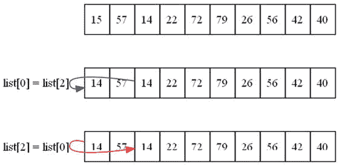
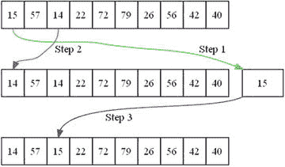
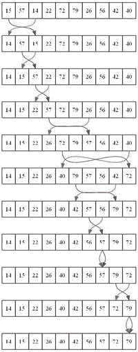

# 十八、排序

二进制搜索只对有序列表有效。那么程序如何按顺序得到一个列表呢？当用户点击一个列标题或者需要排序的东西时，程序如何排序一个条目列表？

有几种算法可以做到这一点。两种最简单的排序算法是选择排序和插入排序。也存在其他排序算法，比如 shell、merge、heap 和快速排序。

了解这些种类如何工作的最好方法是观察它们。要查看常用的排序算法，请访问这个优秀的网站:

[`http://www.sorting-algorithms.com`](http://www.sorting-algorithms.com)

每一种都有优点和缺点。有些人会很快对列表进行排序，如果列表几乎是按顺序排列的话。如果列表是完全随机的，有些人会快速排序。其他列表排序很快，但占用更多内存。理解排序是如何工作的对于为你的程序选择合适的排序是很重要的。

## 交换值

在学习排序之前，我们需要学习如何在两个变量之间交换值。这是很多排序算法中的常见操作。假设一个程序有一个如下所示的列表:

`my_list = [15,57,14,33,72,79,26,56,42,40]`

开发者想要交换位置 0 和 2，它们分别包含数字 15 和 14。见下图。

交换数组中的值

第一次尝试编写这段代码可能如下所示:

`my_list[0] = my_list[2]`

`my_list[2] = my_list[0]`

交换数组值的尝试不正确

请看上图，了解一下会发生什么。这显然行不通。第一次赋值`list[0] = list[2]`导致位置 0 中的值 15 被位置 2 中的值 14 覆盖，并且不可恢复地丢失。带有`list[2] = list[0]`的下一行只是将 14 复制回单元格 2，它已经有了一个 14。

要解决这个问题，应该分三步来交换数组中的值。有必要创建一个临时变量来保存交换操作期间的值。见下图。进行交换的代码如下所示:

`temp = my_list[0]`

`my_list[0] = my_list[2]`

`my_list[2] = temp`

第一行将位置 0 的值复制到`temp`变量中。这允许代码用位置 2 的值覆盖位置 0，而不会丢失数据。最后一行获取位置 0 的旧值，当前保存在`temp`变量中，并将其放在位置 2。

交换数组值的正确方法

## 选择排序

选择从查看元素 0 开始。然后，代码 next 从元素 1 到 n-1 扫描列表的其余部分，以找到最小的数字。最小的数字被交换到元素 0 中。然后代码移动到元素 1，然后是元素 2，依此类推。从图形上看，排序如下图所示。

选择排序

选择排序的代码包含两个嵌套循环。外部循环跟踪代码希望将最小值交换到的当前位置。内部循环从当前位置开始，向右扫描寻找最小值。当它找到最小值时，交换就发生了。

`def selection_sort(my_list):`

`""" Sort a list using the selection sort """`

`# Loop through the entire array`

`for cur_pos in range(len(my_list)):`

`# Find the position that has the smallest number`

`# Start with the current position`

`min_pos = cur_pos`

`# Scan left to right (end of the list)`

`for scan_pos in range(cur_pos + 1, len(my_list)):`

`# Is this position smallest?`

`if my_list[scan_pos] < my_list[min_pos]:`

`# It is, mark this position as the smallest`

`min_pos = scan_pos`

`# Swap the two values`

`temp = my_list[min_pos]`

`my_list[min_pos] = my_list[cur_pos]`

`my_list[cur_pos] = temp`

外部循环将总是运行 n 次。内部循环将运行次。无论列表是否有序，都会出现这种情况。通过在排序结束时代码进行交换之前检查`min_pos`和`cur_pos`是否相等，可以提高循环的效率。如果那些变量相等，就没有必要做那三行。

为了测试上面的选择排序代码，可以使用下面的代码。第一个函数将打印出列表。下一段代码将创建一个随机数列表，打印出来，排序，然后再打印一次。第 3 行的`print`语句将数字右对齐，使数字列更容易阅读。格式化打印报表将在第 21 章的[中介绍。](21.html)

`# Before this code, paste the selection sort and import random`

`def print_list(my_list):`

`for item in my_list:`

`print("{:3}".format(item), end="")`

`print()`

`# Create a list of random numbers`

`my_list = []`

`for i in range(10):`

`my_list.append(random.randrange(100))`

`# Try out the sort`

`print_list(my_list)`

`selection_sort(my_list)`

`print_list(my_list)`

在以下位置查看选择排序的动画:

[`http://www.sorting-algorithms.com/selection-sort`](http://www.sorting-algorithms.com/selection-sort)

要获得真正独特的选择排序可视化效果，请在 YouTube 上搜索“选择排序舞蹈”或使用以下链接:

[`http://youtu.be/Ns4TPTC8whw`](http://youtu.be/Ns4TPTC8whw)

## 插入排序

在外部循环的工作方式上，插入排序类似于选择排序。插入排序从数组的左侧开始，一直到右侧。不同的是，插入排序并不选择最小的元素并将其放入适当的位置；插入排序选择已排序元素右侧的下一个元素。然后，它向上滑动每个较大的元素，直到到达要插入的正确位置。从图形上看，它类似于下图。

插入排序

插入排序将列表分为两部分:排序的一半和未排序的一半。在每一轮外部循环中，算法将抓取下一个未排序的元素，并将其插入到列表中。

在下面的代码中，`key_pos`标记了列表中已排序和未排序部分的边界。该算法使用变量`scan_pos`扫描到`key_pos`的左侧。注意，在插入短消息中，`scan_pos`向下到左边，而不是向上到右边。大于`key_value`的每个单元格位置都上移(向右)一个位置。

当循环找到一个小于`key_value`的位置时，它停止并将`key_value`放在它的左边。

带有插入排序的外部循环将运行 n 次。如果循环被随机打乱，内部循环将平均运行次。如果循环已经接近一个已排序的循环，那么内部循环不会运行太多，排序时间更接近 n。

`def insertion_sort(my_list):`

`""" Sort a list using the insertion sort """`

`# Start at the second element (pos 1).`

`# Use this element to insert into the`

`# list.`

`for key_pos in range(1, len(my_list)):`

`# Get the value of the element to insert`

`key_value = my_list[key_pos]`

`# Scan from right to the left (start of list)`

`scan_pos = key_pos - 1`

`# Loop each element, moving them up until`

`# we reach the position the`

`while (scan_pos >= 0) and (my_list[scan_pos] > key_value):`

`my_list[scan_pos + 1] = my_list[scan_pos]`

`scan_pos = scan_pos - 1`

`# Everything’s been moved out of the way, insert`

`# the key into the correct location`

`my_list[scan_pos + 1] = key_value`

在以下位置查看插入排序的动画:

[`http://www.sorting-algorithms.com/insertion-sort`](http://www.sorting-algorithms.com/insertion-sort)

如果你想了解另一种舞蹈，可以在 YouTube 上搜索“插入排序舞蹈”或者使用以下链接:

[`http://youtu.be/ROalU379l3U`](http://youtu.be/ROalU379l3U)

## 回顾

### 多项选择测验

How many lines of code are normally used to swap two values? 3   2   4   5     What is key in writing code to properly swap two values? Using the swap operator.   Make sure you use the `==` operator rather than the `=` operator.   Using a variable to temporarily hold one of the values while swapping.     In the selection sort, what does the outside loop do? Selects the next element that we will be placing the smallest remaining value into.   Finds the smallest value in the list.   Counts the number of items in the list.     In the selection sort, what does the inside loop do? Selects the next element that we will be placing the smallest remaining value into.   Finds the smallest value in the list.   Counts the number of items in the list.     In the insertion sort, what does the outside loop do? Slides an element into a sorted position.   Selects the next element to be slid into a sorted position.   Finds the smallest value in the list.     In the insertion sort, what does the inside loop do? Slides an element into a sorted position.   Selects the next element to be slid into a sorted position.   Finds the smallest value in the list.     If the selection sort and insertion sort run in n2 time, what is n? The number of lines of code.   The number of elements to sort.   The time it takes to sort in milliseconds.   The number of lines of code.   The size of each element.     If the selection sort and insertion sort run in n2 time, what does that mean if I have a problem size of 100 (n = 100) and increase it by 10 times to n = 1000? The 1,000 elements will take about 1,000 times longer to sort than a list of 100 elements.   The 1,000 elements will take about 100 times longer to sort than a list of 100 elements.   The 1,000 elements will take about 10 times longer to sort than a list of 100 elements.   The 1,000 elements will take about 4 times longer to sort than a list of 100 elements.   The 1,000 elements will take about 2 times longer to sort than a list of 100 elements.     What type of list does the insertion sort work particularly well on? A list that already close to being in order.   A list that is in reverse order.   A randomly sorted list.    

### 简答工作表

Write code to swap the values 25 and 40. `my_list = [55, 41, 52, 68, 45, 27, 40, 25, 37, 26]`   Write code to swap the values 2 and 27. `my_list = [27, 32, 18,  2, 11, 57, 14, 38, 19, 91]`   Why does the following code not work? `my_list = [70, 32, 98, 88, 92, 36, 81, 83, 87, 66]` `temp = list[0]` `my_list[1] = list[0]` `my_list[0] = temp`   Show how the following numbers can be sorted using the selection sort. Show the numbers after each iteration of the outer loop, similar to what is shown earlier in the chapter where we showed how the numbers move around. I am not looking for a copy of the code to do the sort. `97   74    8   98   47   62   12   11    0   60`   Show how the following numbers can be sorted using the selection sort: `74   92   18   47   40   58    0   36   29   25`   Show how the following numbers can be sorted using the insertion sort. Note: The 0 will not be immediately sorted into place. If you think it should, go back and review how the insertion sort works again. `74   92   18   47   40   58    0   36   29   25`   Show how the following numbers can be sorted using the insertion sort: `37   11   14   50   24    7   17   88   99    9`   Explain what `min_pos` does in the selection sort.   Explain what `cur_pos` does in the selection sort.   Explain what `scan_pos` does in the selection sort.   Explain what `key_pos` and `key_value` are in the insertion sort.   Explain `scan_pos` in the insertion sort.   Look at the example sort program in the examples section here: [`http://ProgramArcadeGames.com/python_examples/f.php?file=sorting_examples.py`](http://programarcadegames.com/python_examples/f.php?file=sorting_examples.py) Modify the sorts to print the number of times the inside loop is run and the number of times the outside loop is run. Modify the program to work with a list of 100\. Paste the code you used here. Run the program and list the numbers you got here. (Don’t forget this part!)