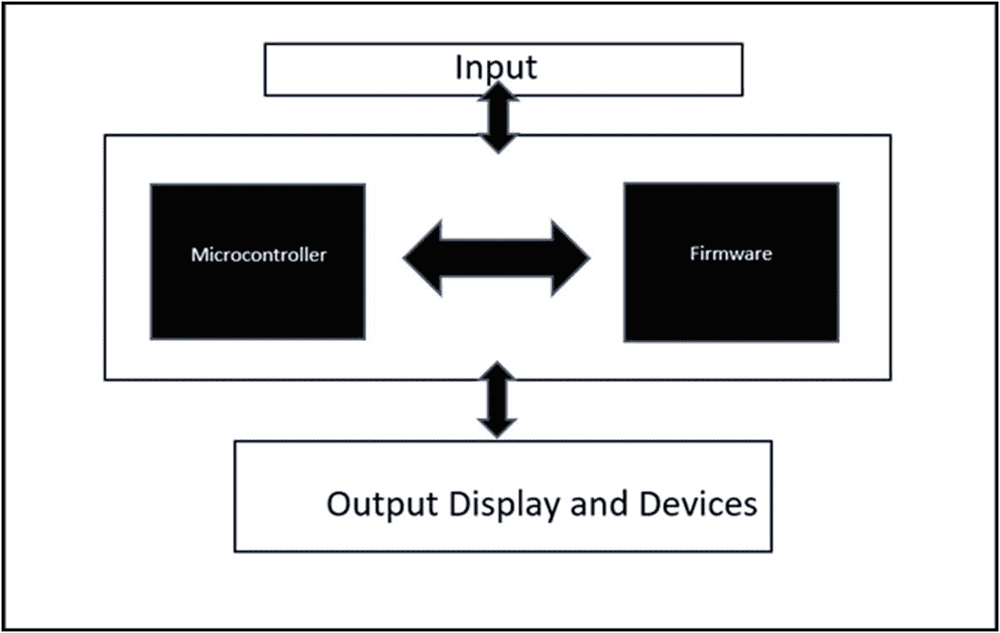
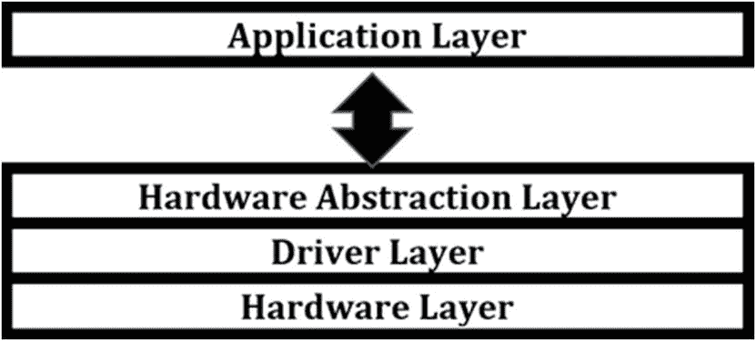
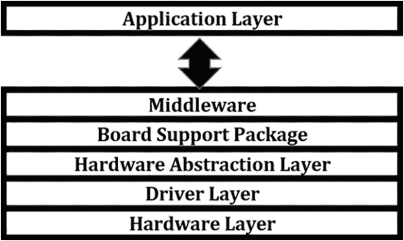
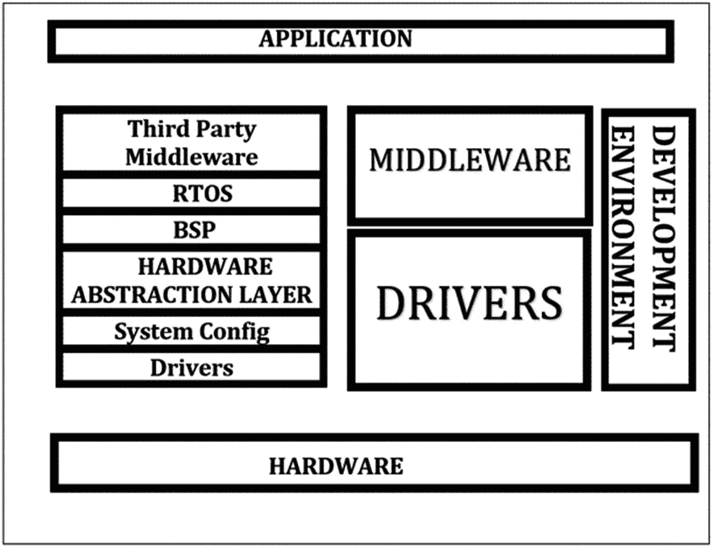

# 三、嵌入式系统概述

虽然我很希望你开始写代码，但我们必须谈一谈，这样你才能理解你的代码是如何构建的。在这一章中，我们将介绍一点嵌入式系统的理论，这将为你理解本书的其余部分提供背景知识。在上一章中，我们概述了一些基本的电子学，在本章中，我们将嵌入式系统作为一个整体来看，以便更好地理解微控制器在整个事物中的位置。的确，光是这一章的内容，本身就能占据一本书的篇幅！这一章一定会很长，并且会给你一些贯穿你整个职业生涯的原则。

## 嵌入式系统概述

我们将从一开始就开始我们的旅程，讨论什么是嵌入式系统。嵌入式系统是为一个目的或一个功能而设计的系统，它被期望以高度的可靠性和最少的用户干预来执行。嵌入式系统的定义特征是它们通常是资源受限的。这意味着它们通常没有千兆字节的 RAM、无尽的电力和常规计算系统的计算能力。

这些系统依次由两个主要的子系统组成，一个是由主处理设备和相关电子设备组成的硬件组件，另一个是在硬件配置上运行的软件系统。

嵌入式系统有时需要在其他计算系统会失效的恶劣环境中执行其功能，例如在深空或海底。一些嵌入式系统预计在单个电池上运行数年，因此节能设计对大多数嵌入式系统至关重要。

大多数嵌入式系统都是为实时操作而设计的，这意味着系统的延迟必须最小。在某些情况下，如果不在要求的规格范围内，这种延迟可能会导致受伤或死亡。

## 微控制器与应用处理器

在我们进一步讨论嵌入式系统之前，我认为有一个重要的区别是必须要做的。您将在嵌入式设计中遇到的处理设备类型之间的区别。你会遇到基于微控制器的系统和基于应用处理器的其他系统。

微控制器(MCU)是一种独立的设备，将处理器、内存和支持设备集成到一个封装中。微控制器通常用于实时应用或要求高容量、低成本、低功耗或三者兼备的应用。

智能手机行业的诞生催生了应用处理器。应用处理器可以被认为是“类固醇处理器”，因为这些设备通常与许多 CPU 内核、图形处理单元(GPU)、高速缓存、多媒体编解码器、通信控制器和许多其他好东西一起封装在一个封装中。

两者之间的主要区别在于它们的预期应用。虽然微控制器意味着深度嵌入式应用，其中最复杂的应用需要实时操作系统(RTOS)，但应用处理器通常至少具有 RTOS，更常见的是运行通用操作系统，如 Linux。应用处理器也可用于平板电脑或智能手机等通用计算系统。

## 嵌入式系统结构

尽管嵌入式系统的结构在不断变化，但大多数系统仍然在设计中使用经典的结构。嵌入式系统的经典结构如图 3-1 所示，由四个主要组件组成。嵌入式系统的主要硬件组件之一是与通常称为固件的软件程序协作的微控制器。固件是一种软件程序，最终用户不得更改。还有一些类型的输入和输出设备与这种微控制器-固件双核通信。虽然这种类型的配置不会很快出现，但重要的是要承认它不是构建系统的唯一方式。

图 3-1

嵌入式系统的经典结构

现在的趋势如图 3-2 所示，运行基于 Linux 操作系统的通用应用处理器系统与微控制器设备相结合，以执行实时处理功能。这可以被组合在一个系统级封装(SiP)中，该系统级封装将所有芯片包含在一个封装中或者在板上，其中应用处理器可以是位于“实时”处理器附近的系统级模块，该“实时”处理器通常运行实时操作系统(RTOS)或者裸机循环执行系统。

图 3-2

嵌入式系统的趋势结构

请记住，这些不是嵌入式系统的唯一结构，因为有时可编程逻辑结构可能存在于系统的某个地方。不管系统的结构如何，它都会从系统的输入/输出(I/O)端口接收一些输入，执行一些处理，然后通过一些输出设备向用户提供一些有用的输出。

具有经典结构的嵌入式系统的典型例子是计算器。计算器将通过键盘接收输入，然后嵌入式处理器将执行计算，输出将显示在屏幕上。类似地，大多数“哑”消费电器、办公自动化设备，甚至车辆的子系统都遵循这种“经典”结构。这是本书关注的焦点，因为它是构建其他结构的“基础”。

曾经为非常高端的系统保留的“更新”结构开始更频繁地出现。随着计算能力的提高，芯片成本不断下降，加上市场对“智能”设备的需求，导致了应用和实时处理器结构的这种耦合。机器人是利用这种结构的嵌入式系统的最好例子。一个微控制器执行实时处理，控制电机和读取传感器，然后与运行 Linux 的应用处理器通信，后者使用该数据来执行定位和映射，并通过某种串行协议与微控制器通信来控制平台的移动速度。

智能设备也具有这种结构，使用运行 Linux 的应用处理器来获得丰富的用户体验，它与底层微控制器或操作实时子系统的几个微控制器通信。

## 硬件系统

正如我们之前所讨论的，嵌入式系统的组件由硬件和软件组成，它们协同工作来执行某些任务。不管制造商是谁，硬件肯定会包括处理器、内存和 I/O 端口。

处理器通常是微控制器，在一个封装中包含中央处理器(CPU)内核、内存和 I/O 引脚。目前常用的微控制器内核有 ARM、PIC 和 AVR 架构。RISC-V 是另一种 CPU 核心架构，由于其设计的开源性质，有一天可能会流行起来。许多制造商，如许多 CircuitPython 板中使用的 SAM 微控制器的制造商 Microchip Technology，也将在封装中包括外设，以简化开发时间。

包装上的存储器分为两类，即程序存储器和数据存储器。程序存储器通常是基于闪存或 FRAM 的非易失性存储系统，通常大小从几千字节到几兆字节。程序存储器用于存储将由 CPU 内核执行的程序。另一方面，数据存储器是用于存储微控制器在运行时使用的数据的存储器，通常是几十或几百千字节的 SRAM。

I/O 引脚是拼图的第三块。它们允许 CPU 内核与系统外部的设备通信，例如传感器和其他集成电路。系统所需的 I/O 数量因应用程序而异。

最后，硬件设备上还包括外设。这些外围设备可以执行各种功能，例如系统支持、通信、数据转换、安全功能或者调试和诊断能力。一些较新的微控制器还具有核心独立外设(CIP ),无需 CPU 干预即可执行功能。诸如直接存储器存取(DMA)之类的一些外设可能需要 CPU 的初始干预，但是随后将执行它们的其余功能，而无需 CPU 的进一步干预。

在主处理器的外部，硬件系统可以包括其他设备，例如传感器、用户接口设备或某种类型的可编程逻辑设备。这些共同构成了嵌入式系统的硬件组件。

## 软件系统

软件负责使硬件变得有用。运行在嵌入式系统上的软件被称为固件，因为它不是为系统用户而设计的。然而，这并不是一成不变的，因为更新和升级可能会在部署后进行。现代物联网设备尤其如此，在这个消费者期待“最新最棒”的世界里也是如此。一般的理解是固件不应该被改变。

嵌入式系统中的软件通常分为两类。您可以设计一个裸机循环执行系统，也可以让一个实时操作系统运行该系统。两者的区别在于处理任务的方式。任务可以被认为是固件程序的最小单位。

在一个循环执行系统中，只有一个任务采取所谓无限循环的形式。在这样的系统中，程序会有一个主入口点，然后循环执行系统必须执行的一系列动作。大多数嵌入式设计都利用这种类型的系统。它实现起来很简单，并且在您不需要太多系统的时候使用。这是我们将在本书的开头部分使用的系统类型。

在基于 RTOS 的系统中，有许多任务需要执行。由于硬件系统的资源有限，因此需要一个调度程序来管理任务访问资源的方式。内核根据任务的优先级管理每个任务如何利用系统的硬件资源。RTOSs 通常被认为是一个高级主题，因此将在本书的高级部分讨论。

固件开发的一个主要方面是它必须被设计成模块化的。拥有模块化软件非常重要，因为它允许您在一个处理器家族中的多个成员之间，甚至在多个架构之间利用现有的代码库和知识。跨平台使用代码的能力被称为可移植性。从本质上讲，模块化和可移植性是协同工作的，我们可以在图 3-3 中看到这一点。

图 3-3

模块化和可移植性在好的软件设计中一起工作

这一点很重要，因为在对正确的软件开发过程进行初始投资后，新系统开发所需的技能和时间可以显著减少。有时，由于成本或设计要求，您可能需要升级或降级您设计的处理器，并且您将感谢您将您的软件设计为可移植的。

## 工具链

开发嵌入式系统时要考虑的一个重要部分是工具链。工具链是指用于创建嵌入式系统的工具，包括编译器和程序员/调试器。

先说编译器。我们编写软件的嵌入式设备称为主机，通常是 PC、MAC 或 Linux 机器，我们为其编写设备的设备称为目标。嵌入式工具链中的编译器在业内被称为交叉编译器。交叉编译器是一种特殊的编译器，它在主机上运行，但在链接器的帮助下创建最终的可执行程序，该程序是为目标程序设计的。

嵌入式工具链的第二部分是将交叉编译器创建的程序加载到设备上的机制。加载是一个过程，通过这个过程，称为程序员的设备将可执行映像放入目标的非易失性存储器中。这通常通过编程器经由主机和目标之间的 USB 或网络链路连接来实现。许多程序员也有调试能力，允许你验证一个程序是否正常工作。出于这个原因，许多程序员被称为在线调试器(ICD ),它允许您在不从电路中移除设备的情况下调试设备。

联合测试行动小组(JTAG)是一个流行的调试和测试嵌入式硬件的行业标准。

像 CircuitPython 这样的开发环境的好处是，通过将解释器放在芯片上，我们可以消除与使用传统开发环境相关的大多数常规细微差别。由于集成了引导加载程序，我们只需将程序放到芯片上，设备就会为我们解释它。

## 软件测试

嵌入式软件通常被忽视的一部分是测试。测试确保嵌入式软件按预期运行；这些测试被称为功能测试。还有性能测试，它主要确定软件是否满足“SSS”要求(速度、稳定性和可伸缩性)。性能测试本质上是质量测试。故障播种是我们可以执行的另一个常见测试，在该测试中，我们将故障引入系统，并确定它如何响应。我们这样做是为了确保我们的异常处理代码正常工作。

为了帮助测试，许多供应商提供了模拟器，这是一种在您将程序部署到实际硬件之前确保程序正常工作的方法。由于嵌入式硬件的限制，有时 LED 可能是帮助测试的最佳工具，因为它提供了程序按预期工作的视觉反馈。

## 嵌入式软件架构

为了保持固件的可移植性，开发人员的趋势是为他们的固件生态系统使用所谓的分层架构。分层架构的作用是将如何控制实际硬件的具体驱动程序细节与应用程序本身分开。甚至制造商也将这种类型的设计强加给开发者，所有微控制器供应商都提供某种硬件抽象层(HAL ),该硬件抽象层在软件设计中通过分层架构使用可重用固件的原理。

您将使用的分层应用程序的类型将取决于您的设计的复杂性。您将会遇到的典型分层软件配置通常有 2 到 7 层，我们现在来看一下。

这些层甚至可能没有这里所描述的布局，因为一旦它们被组合到框架中(稍后会有更多介绍)，它可能看起来不完全像这种严格的分层方法。一些制造商设计的框架在框架的同一层上有几层。然而，我在这里提供的信息将阐明嵌入式软件是如何构造的。让我们一次检查一层。

## 驱动程序层

驱动程序层具有特定于 CPU 内核的代码，并且是软件架构中唯一通常不可重用的部分。这是因为，即使在器件系列中，也可能有针对该器件的特殊外设说明。有时，芯片缺陷是存在的，为了确保开发人员仍然可以使用为其编写驱动程序的外设，有必要采取变通办法。

好的司机有四个主要功能。它们执行外设的初始化，配置外设，执行运行时控制，并正确关闭驱动程序。

有时，对于简单的系统，应用层是建立在驱动程序层之上的。因此，在这一点之后，可能不需要其他层，一旦驱动程序层就位，应用层就可以位于任何其他层之上。

这意味着所有后续层都可以放在驱动程序层之上，但在应用层之下。因此，在我看来，驱动程序层是软件架构中最重要的一层。很多开发后期出现的问题都可以追溯到这一层。这一层必须尽可能坚固耐用。

如果您想知道什么是应用层，应用层是包含您希望系统执行的任务的程序。这是根据系统需求实现程序的地方。我们在图 3-4 中看到了这种结构。

图 3-4

驱动程序层构建在硬件层之上

## 硬件抽象层

下一层是硬件抽象层(HAL)。HAL 位于驱动程序层和应用层之间。

HAL 为驱动程序层增加了模块性，允许开发者在不了解硬件细节的情况下使用特定的硬件特性。这提供了一致性，可以跨设备系列使用，甚至独立于 CPU 核心架构。许多微控制器供应商现在都提供了 HAL，可用于提高开发人员的工作效率。设备制造商通常投入大量资源来提供一个好的 HAL，因为它允许开发者尽可能容易地使用他们的设备。

图 3-5 允许我们消除该结构。

图 3-5

硬件抽象层(HAL)的布局

## 主板支持包(BSP)

一些架构在 HAL 之上有一个板支持包(BSP ),提供了更高层次的抽象。制造商通常为他们的产品提供开发板。制造商将提供一个板支持包，以便开发人员可以测试并确保一切正常工作。

由于电路板的布局，可能需要特殊的软件配置来确保电路板正常工作。有时，当您与设计公司签订合同来帮助产品开发时，他们可能还会提供 BSP，特别是当希望董事会运行操作系统来确保一切顺利运行时。当你计划迭代未来电路板的设计时，BSP 是很好的选择。如图 3-6 所示。

图 3-6

放置板支持包(BSP)

如果你正在开发一个基于 Linux 的系统，那么主板支持包是必不可少的。BSP 将配置通信总线、时钟、内存以及操作系统正常工作所需的任何其他相关外围设备。BSP 通常还包括一个 bootloader，它是一个在应用程序代码运行之前运行的小程序。

## 中间件

有一层可以让您的生活变得更加轻松，这一层通常是应用程序实现之前的最顶层，它就是中间件层。中间件通常位于 HAL(或者 BSP，如果该层存在的话)和应用程序之间。中间件将板支持包的软件组件与应用层连接起来。请记住，BSP 是可选的，所以很多时候你会发现中间件直接将 HAL 与应用层连接起来。

中间件很重要，因为它通常包含用于高级外设和复杂协议的软件。好的供应商提供中间件来确保他们的客户使用他们的产品。编写一个设备驱动程序可能需要几个小时到几天，而中间件的开发需要几个星期到几个月的时间。我们在图 3-7 中看到了新的结构。

图 3-7

中间件布局

## 软件框架

虽然分层体系结构有利于对软件的结构有一个总体的了解，但是嵌入式软件体系结构可以以不同的方式配置。这些层的互操作性的具体配置和布局被称为软件框架。框架提供的是简化开发的驱动程序和中间件库的特定配置。我们在图 3-8 中看到了这一切的全貌。

图 3-8

示例软件框架模型

虽然图 3-8 中的框架模型并不代表所有或任何特定的实现，但是它可以让你理解一个软件框架是如何构建的。软件框架是模块化的，注重可扩展性。它没有一种结构化的方法，也不一定具有前面提到的严格的分层方法。本质上，框架提供了构建应用程序的“脚手架”。通常不希望你修改框架。然而，在实践中，您可能会遇到框架中的错误，这可能需要修改。请记住，大多数框架都有许可证，可能会限制更改或要求您发布您所做的任何更改。在做任何修改之前，最好先看看您打算使用的框架的许可协议。

## 编码发生器

行业趋势表明，软件框架的下一个层次是代码生成器。代码生成器目前是嵌入式软件开发的最后前沿。代码生成器所做的通常是使用一个图形化的配置环境，它详细描述了您的应用程序中需要的软件框架的组件。生成您需要的组件，不需要的组件不会添加到项目中。代码生成器生成代码结构、目录、引导加载程序和最终应用程序所需的任何其他组件。

## 平台

一起工作的硬件和软件的组合被称为平台。该平台包括硬件、开发工具(包括工具链和 ide)、软件框架，有时还包括代码生成器。平台可以大大减少开发时间。我们可以用来学习嵌入式系统的一个平台是 Arduino 平台。Arduino 平台是由板、屏蔽、引导装载程序、库和开发环境组成的整个生态系统。类似地，CircuitPython 遵循这个概念，结合了硬件、软件和开发工具。图 3-9 显示了这种关系。

图 3-9

平台包含的三元组

## 嵌入式系统限制

嵌入式系统在设计上有各种各样的限制。最常见的限制是成本、性能和能源预算。我们将在下面的小节中讨论每一个问题。

## 费用

首先，嵌入式系统最关键的一个方面是成本。成本是嵌入式设计的主要驱动因素之一。由于大多数嵌入式系统被设计成消费类产品，这些产品将被大量生产，并且基本上是“一次性的”，因此设计中的组件成本至关重要。有时候，从长远来看，一个设计的几分钟会产生巨大的影响。

嵌入式设计中使用的组件列表称为物料清单(BOM)。在讨论成本时，你会碰到一个术语叫非经常性工程(NRE)成本。NRE 成本是指将产品投入生产的初始成本。像研究、原型、产品设计和文档都属于这一类。

设计嵌入式系统时需要考虑的另一个因素是您将使用的器件类型。有从零售商处或直接从制造商处购买的商业现货(COTS)零件。还有一些专用集成电路(ASICs)是为你在任何地方都找不到的特定目的而设计的。

虽然有些人可能不同意我的观点，但在 COTS 解决方案和 ASIC 之间存在一个中间点，ASIC 是现场可编程器件的一种混合解决方案。现场可编程门阵列(FPGAs)、可编程逻辑器件(PLD)和现场可编程模拟阵列(FPAAs)等器件可以“现货”购买，但需要设计人员确定器件的具体功能，因为这些器件在购买时并未设计具体功能。

然而，有时嵌入式设计的成本是不可避免的。如果你是为需要特殊组件的航空航天或深空应用而设计，你可能无法降低成本。例如，在深空探测中，抗辐射组件(rad-hard)可能需要几十万美元。在这里，可靠性和质量比成本更重要。一般来说，你通常需要在价格和质量之间做出平衡。

## 表演

性能是嵌入式系统设计的一个重要方面。当我们谈论性能时，我们谈论的是系统在合理的时间内执行其功能的能力。合理的定义将在设计的背景下。对于电动牙刷，合理的时间可能是几秒，而气囊展开系统将有十分之几秒来执行其功能。硬件和软件组件都可能影响系统的性能。

在硬件方面，处理器架构和时钟频率会对性能产生影响。运行在 400 MHz 的 32 位微控制器比运行在 4 MHz 的 8 位微控制器具有更好的性能。这两者是相辅相成的，选择合适的架构和合适的频率是一项需要时间学习的技能。

硅缺陷也会对性能产生影响。在许多情况下，CPU 内核或外设会出现问题，这是由制造商的设计错误引起的。这种错误被制造到产品中的结果导致硅缺陷。这些问题会对性能产生严重影响，尤其是在设计过程中未被发现的情况下。有时有必要查看您正在使用的芯片器件的勘误表，通常可以在数据手册中找到。

在软件方面，抽象和算法复杂性以及任务细节都会影响性能。尽管软件开发的当前趋势是在应用程序中有大量的抽象和复杂算法的实现，但重要的是要记住，抽象层越多，需要的 CPU 时间周期就越多。为此，有时从应用层，有时可能需要直接调用较低层次的驱动程序层，如果你需要一定水平的性能。保持算法简单也可以大大减少开发时间。总的来说，在设计你的算法和软件时，记住“KISS”(保持简单，愚蠢)。

任务细节指的是调度程序如何为系统中的任务分配优先级，以及任务之间如何通信会极大地影响系统的性能。根据您的调度程序如何向您的系统分配任务，如果资源分配有错误，它会影响您的最终应用程序。任务的互通也会影响绩效；如果有信息需要在任务之间传递，那么必须确保任务之间的通信没有错误。

## 能量预算

我把嵌入式系统约束的这个方面留到最后，因为所有嵌入式系统都有能源预算。即使是用市电供电的电器也有能源预算，因为它们在设计时必须考虑能效。嵌入式系统通常依靠电池运行，因此，它们必须尽可能节能。您将使用的电源类型也会影响设备的重量和尺寸。我说尺寸是因为电池和一些电源可能需要特殊冷却，这会增加系统的总重量和尺寸。

制定电池预算是确保您的系统不会消耗太多电力的好方法，尽管大多数设计师都是事后才考虑电力。我甚至可以说，在您开发应用需求之后，甚至在您选择处理器之前，就应该确定您的电池预算。问一个问题，系统将使用多少功率？确定预算后，您可以专注于选择处理器。

您还应该查看可用的处理器节能模式。这个重要的特性意味着你的产品运行几天和几个月的区别。阅读处理器的数据表，确定处理器的睡眠模式。通常，HAL 和驱动程序层将提供选择睡眠模式类型的功能。

拥有专用电源监控电路、通过 I/O 引脚为外部设备供电，以及使用更节能的现代设备，都是降低设备功耗的好方法。

## 嵌入式系统分类

既然我们对嵌入式系统的硬件和软件组件以及限制有了很好的了解，我们就可以专注于理解嵌入式系统是如何分类的。嵌入式系统可以分为小型、中型和高性能系统。

## 小规模系统

小型嵌入式系统采用单个微控制器设计，通常是 8 位、16 位或低功能 32 位微控制器。在硬件方面，单个微控制器控制整个系统。这种系统构成了当今世界嵌入式系统的主体。这些类型的嵌入式系统通常限制最多，通常要求极低的成本、低性能和超低功耗。它们有几千字节的程序存储器和几千字节的数据存储器。

这个市场由 8 位架构的设备主导，也可能包括 4 位架构的设备(是的，4 位)。制造商一直试图为这个市场设计 32 位设备，32 位正在逐渐蚕食 8 位微控制器在这个领域的份额。这类设备通常需要在单个电池上运行数年。此类别中的“高端”设备也可能是低功耗 16 位设备。尤其是较新的基于 ARM 的设备越来越能够满足这些标准。

在软件方面，小规模系统通常运行具有循环执行系统的裸机，并且在某些情况下可能实现协作调度器。这些设备通常具有两层软件架构，汇编代码甚至可能用于开发这些设备的应用程序。这些是我们将在本书中重点介绍的系统类型，因为您的大多数设计任务都属于这一类别。我们在图 3-10 中看到了这些系统的结构。

图 3-10

小规模系统

## 中型系统

中等规模的嵌入式系统可能只有一个处理设备，也可能有多个设备。它们可以将 8 位微控制器和 16 位或 32 位处理设备与几百千字节的数据存储器和高达大约 2 兆字节的程序存储器结合起来。一些供应商还为这一类别的设备提供 16 位和 32 位多核设备。

软件可能由运行 RTOS 的主处理器组成，尽管其他处理器可能是裸机小型系统。汇编语言可以在这一级使用，但可能只在小规模的子系统上使用。它们可能包括网络功能，用于“中档”嵌入式设计。这种设计如图 3-11 所示。

图 3-11

中等规模系统

## 高性能系统

高性能嵌入式系统可能有一个或多个处理设备。它们可能包含多个高端处理器和 FPGAs，有些可能需要数字信号处理器(DSP)作为其硬件设计的一部分。它们可以被设计成具有运行 RTOSss 的多个处理器子系统，RTOS 本身由几个子处理器系统组成。一些组件甚至可能由运行完整操作系统的应用处理器组成。这些是嵌入式系统所能得到的最昂贵和高性能的。

这种系统的软件设计通常需要几个具有不同专业领域的开发人员来设计。开发工具和调试器也可能需要昂贵的许可费用(尤其是在使用高端 FPGAs 的情况下)。可能还需要购买制造和工具供应商支持的额外费用。

## 分布式嵌入式系统

中型和高性能系统本身可以归类为分布式嵌入式系统。分布式嵌入式系统由不同的子系统组成，每个子系统都是一个更大系统的节点。这些系统可以具有不同的通信模型，可以是 TCP/IP、can、LIN 等，并且是存在于有线网络(例如汽车和飞机中的那些)以及无线网络(例如物联网)中的系统类型。

这种系统需要有经验的架构师来设计，因为需要协调系统事件，异步系统的设计至关重要。全分布式嵌入式系统没有“主”处理器；所有节点都独立运行，是一个独立的系统。

这些分布式系统允许模块化设计，这允许安全关键部件与非安全关键部件分离。安全关键系统是这样一种系统，如果该系统发生故障，将会导致严重的人身伤害或死亡，或者导致重大的经济损失。因此，例如，在汽车中，拥有分布式系统将允许控制车辆防抱死系统的设备与信息娱乐系统分离。

通常，分布式嵌入式系统是为大型系统保留的，如航空航天、汽车和军事工业中的系统。然而，最近发生的事情是，随着物联网(一种分布式嵌入式系统)的引入，开发人员需要了解分布式嵌入式系统。

## 开发嵌入式产品的七个步骤

开发嵌入式产品有七个步骤，即创意、需求规格、功能设计、快速原型制作、测试、保护和推向市场。

### 第一步:创意

第一步可能是最重要的，那就是提出你的想法。这可能是这个过程中最难的一步。最重要的是你的想法必须有一个预定的目标市场，最重要的是你的产品必须解决一些问题。很多时候，客户会提出这个想法。

### 步骤 2:需求规格

流程的第二步是设计需求规格。这一步很重要，因为你必须对你将要设计的东西有一个清晰的方向和焦点。如果你有一个客户，你的客户想要一个特性，然后又不想要，这种情况并不罕见，这导致了客户和开发人员之间的分歧。拥有一份清晰的需求规格文档将有助于作为客户需求的证明文件，否则你可能会发现自己不断地添加新功能，直到超出预算并落后于上市时间。确保在此步骤中包含一个框图，显示系统将如何组成。

### 第三步:功能设计

有了需求之后，下一步是进行功能设计。需求规格说明描述了我们将要设计的东西，而功能设计是我们将如何着手构建它。功能设计将包括制作系统模型和进行验证。这是使用统一建模语言(UML)等工具对系统建模的阶段。您还应该有功能块，这些功能块进一步细分需求部分中的块，以包括更多的细节。

### 第四步:快速原型制作

传统上，嵌入式系统开发遵循几个阶段或一系列步骤，并使用几个开发过程。这些包括常见的软件架构，如瀑布、V-Cycle 和基于螺旋的开发方法。大多数书和课程都会教这个。然而，在行业内，发展趋势是朝着快速成型。快速原型所做的是利用现有的高级硬件和软件工具来实现你的产品。快速原型制作利用平台、代码生成器和硬件模块来开发产品。您通常会对设计执行迭代，编写软件和测试，直到您完成原型设计，而不是遵循一系列增量步骤。

这样做的目的是以更快的速度给你一个原型，并提供更快的上市时间(TTM)，这是指从提出想法到销售你的产品的时间。快速原型制作节省了大量时间，就好像你必须重新设计一个原型一样；它包括简单地对模块进行“即插即用”和重写软件。

传统上，你会在试验板上设计一个电路，然后为原型旋转 PCB 板，得到某种类型的外壳，修改它，然后你就有了你的原型。这一过程既昂贵又耗时。

借助 Arduino 等平台和 3D 打印等技术，有可能让您的产品在外观和功能上非常接近最终设计，因为您可以在几小时或几天内迭代设计，而不是几周或几个月。

### 第五步:测试

即使您将在原型阶段执行测试，在产品创建之后执行测试也是很重要的。测试是一个复杂的过程，可以跨越几本书的信息。出于这个原因，我已经包括了一些基本的测试，您可以执行这些测试来确保您有一个功能合理的系统。当涉及到测试时，总是有扩展的空间。

您将执行硬件测试，包括查找系统中的缺陷和错误。硬件缺陷是实际原型和设计之间的差异。当有缺陷的系统运行时会发生错误，这可能导致硬件系统的故障。

在软件方面，执行软件性能测试很重要，重点是速度和稳定性，有时是可伸缩性。原型完成并且重构软件之后，您必须执行单元测试。单元测试是分离软件的类和功能组件，并将其与系统的其余部分隔离开来进行测试的过程。您将执行数据测试和场景测试。

在数据测试中，您可以在广泛的输入值范围内测试隔离函数。在基于场景的测试中，您既要检查软件处于典型用例中的普通用例场景，也要检查与普通用例不一致的场景。对系统的这种测试会使系统中的任何错误变得可见。在这种类型的测试中，创造力是必不可少的，因为你永远不知道你的用户会做什么。尝试你能想到的任何事情。在极端情况下测试系统。执行基本的篡改，看看会发生什么。你会很高兴你做了。

您还必须执行交互测试。交互测试是一种测试硬件和软件系统互操作性的方法。您可以执行这种类型的测试的方法是执行故障播种，并查看系统的每个组件如何对该故障做出反应。尽管这些测试方法简单且不完整，但是简单地执行这些测试就可以让您领先于那些不执行这些基本测试就发布产品的开发人员。我见过无数失败的产品，它们本可以在产品上市前通过执行这些简单的步骤而受益。

### 步骤 6:保护您的系统

不用考虑系统安全性的日子已经一去不复返了。随着嵌入式系统上的软件变得越来越复杂，有必要引入安全措施来保护您的嵌入式系统。

没有连接到网络的小型系统通常需要实施较少的安全措施。对于此类系统，设置一些锁定位或熔丝位并启用代码保护可能就足够了。您还可以在软件中引入某种类型的 ID 认证方法，防止固件未经验证就运行。用环氧树脂涂覆您的重要组件也是保护您的系统免受恶意攻击的好方法。

虽然上述方法有利于保护未连接到网络的嵌入式系统，但是嵌入式系统还有一个额外的安全隐患，那就是联网。随着物联网(IoT)的日益普及，需要将更多设备连接到互联网。事实上，物联网寻求将一切连接到互联网。

针对连接的嵌入式系统的一些常见攻击是广播风暴、重放攻击和端口探测。广播风暴攻击是指通过网络链路向最初广播数据的节点重新广播数据，从而导致网络故障的过程。重放攻击包括破坏加密或使用不安全的网络来拦截在网络上传输的数据，然后延迟其传输或稍后重新发送。端口探测是在网络上寻找开放端口以利用漏洞的过程。

黑客利用嵌入式系统安全性的另一种常见方式是使用上述攻击之一来访问您的嵌入式系统，对您的设备重新编程，然后将其与其他嵌入式设备一起使用来发起分布式拒绝服务攻击(DDoS)。如果您引入了我们安全讨论第一部分中提到的 ID 认证，它将防止黑客对您的设备重新编程，并防止 DDoS 攻击。

不可能为您的系统提供所有级别的安全性。最强大的设备是人类的大脑。因为人们是如此有创造力，如果一个黑客想找到进入你的系统的方法，他们会找到这样做的方法。你所能做的就是通过采取上述措施来降低与你的产品相关的风险。通常用于基于 CitcuitPython 的电路板的 SAMD 微控制器制造商 Microchip Technology 也提供有助于网络安全的解决方案，并为物联网设备提供使用案例。微芯片 ATECC608A 等设备提供了可用于保护您设备的算法和安全协议。他们为两家最大的云提供商提供了使用案例，这是为您的网络嵌入式系统增加安全性的良好开端。

### 第七步:推向市场

创建嵌入式设备的最后一步是将其推向市场。这是最长和最详细的步骤。在下面的步骤中，您创建了一个工程原型。将设备推向市场的步骤太多了，本书无法一一介绍。因此，如果你没有这方面的经验，我建议你使用专注于产品开发的工程公司。

如果你没有经验，我建议你使用工程公司的原因是，这个行业是一个鲨鱼吃鲨鱼的世界。组件供应商和外壳制造商，尤其是那些不在美国的供应商和制造商，会窃取你的设计，给你假的组件，甚至可能拿走你的钱，却不提供你所购买的产品。这些工程公司将与经过验证的供应商和设计师建立联系，并利用他们的专业知识帮助你将产品推向市场。

## 结论

在这一章中，我们研究了软件开发的所有方面，包括嵌入式系统的概述、嵌入式软件架构、嵌入式系统的分类以及开发嵌入式产品的步骤。本章包含的信息将在您的嵌入式职业生涯中为您服务。在使用 CircuitPython 开发自己的微控制器产品时，以及在使用复杂工具和更高性能系统时，这里学到的技术和术语将对您有所帮助。