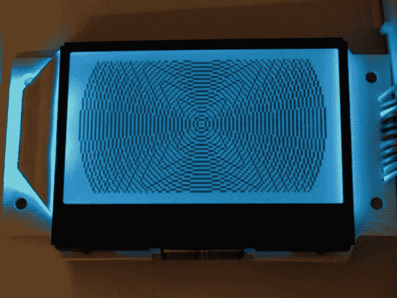
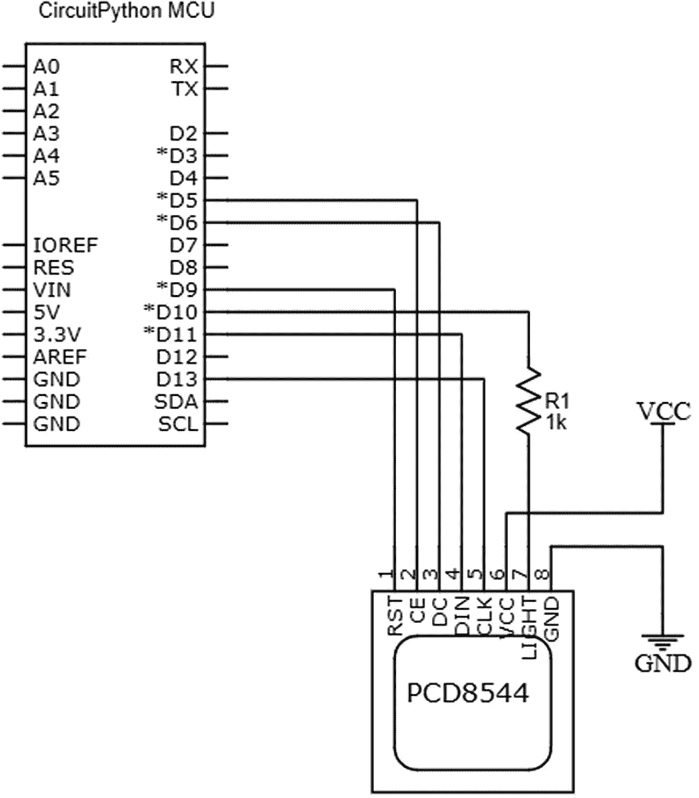
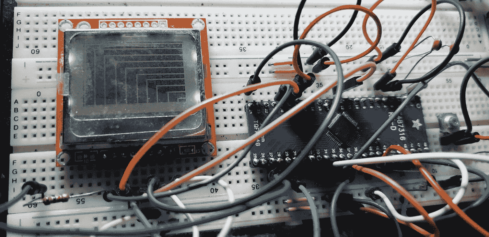
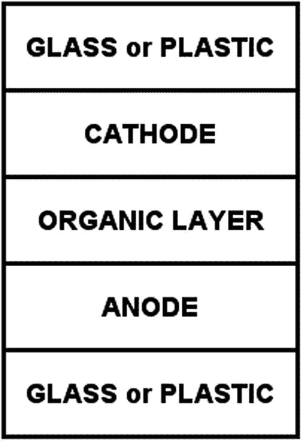
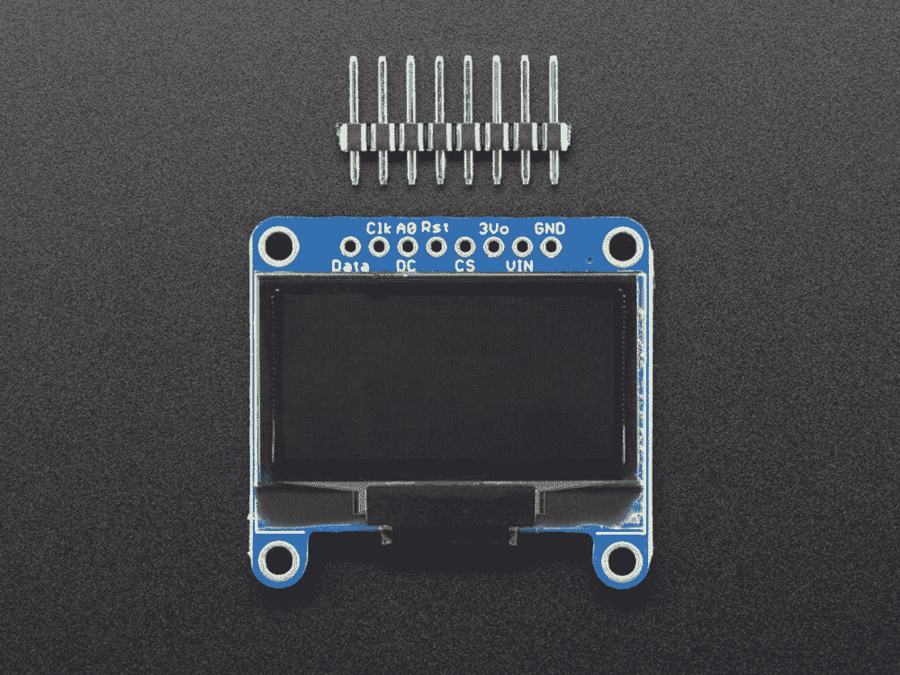
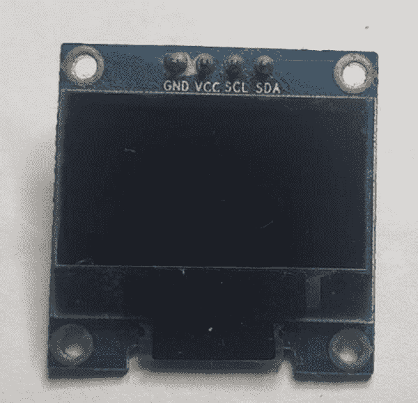

# 八、显示界面

到目前为止，我们所有的电路都是在没有使用任何显示器的情况下构建的。我们可以使用 LED 或蜂鸣器等设备获得传感器数据的反馈，但要真正可视化传感器数据，我们需要一个显示器。虽然到目前为止我们一直使用的串行控制台是一种可视化信息的好方法，但您需要将您的 MCU 连接到您的计算机才能从中获取任何信息。然而，大多数嵌入式系统(计算器、手表等)都有一个显示器，用来给用户提供信息。在本节中，我们将通过学习显示器为制作这类设备打下基础。

## 该液晶显示器

我们将了解的第一种显示器是液晶显示器或 LCD。液晶显示器是由一种叫做液晶的特殊晶体制成的，这种晶体对电起反应。LCD 的工作原理是液晶被夹在玻璃层之间形成网格。这些陷印点中的每一个都称为一个像素。当电流通过它们时，它们具有能够阻挡光通过的效果。这种对光的阻挡使显示器变暗，并允许我们制作我们识别为信息的图案。这是单色显示器工作的前提。我们可以在图 8-1 中看到这种单色 LCD 的样子。



图 8-1

单色液晶显示器鸣谢:adafruit.com 阿达弗洛

虽然单色 LCD 在过去很受欢迎，但如今我们的产品中设计全彩色 LCD 更为常见。我们说它们是单色的，因为它们只有一种不同的色调，通常是黑色。也有彩色液晶显示器，其工作原理与单色不同。

在我们讨论彩色液晶显示器之前，让我们花点时间来讨论颜色。在光的领域里，有两种颜色。我们称之为加色和减色。

加色有红、绿、蓝三原色，我们称之为 RGB。如果我们有一个黑色的背景(没有光线),我们在这个黑色的背景上加上加色的组合，我们可以得到各种各样的颜色。所有的加色混合会给你白色。

然而，如果我们有白色背景(白光存在)，我们可以通过添加颜色来去除部分白光。某些被称为减色法的颜色可以去除光线中的其他颜色。我们可以添加青色(去除红色)、洋红色(去除绿色)和黄色(去除蓝色)来获得无数种颜色。这些颜色被表示为 CMY 或(-R，-G，-B)。当我们把所有的减色法结合起来，我们就得到黑色。

有没有想过为什么我们在打印机上使用 CMY 的颜色？这是因为如果我们有一张白纸(白色背景),我们从其中去除某些光线成分，我们就可以创建出我们在印刷媒体中使用的光谱。然而，混合所有的 CMY 颜色不会产生完全的黑色。这就是为什么我们的打印机必须使用黑色墨盒的原因。在印刷过程中，当我们使用黑色的 CMY 时，它被称为 CMYK，其中 K 代表黑色成分。

现在我们了解了颜色，我们可以继续讨论显示器了。

彩色显示器的像素由红色、绿色和蓝色(RGB)成分组成。像素可以阻挡它们必须表现的光的某些成分，这些被称为透射型液晶显示器。然而，也有显示器发出这些颜色，我们称之为发射型液晶显示器。

为了控制这些像素，我们使用了一个显示控制器，它可以处理有效操作 LCD 所需的所有细粒度控制。显示控制器本身是一个基于微处理器的设备，可以与我们的 MCU 通信，以控制显示器上的像素。如果我们没有显示控制器，那么我们将不得不编写代码来控制 LCD 上的每个像素，这将增加很多复杂性和软件开销。

## 使用 GLCD

我们将从如何连接单色 GLCD 开始我们的显示界面。虽然单色显示器通常使用并行接口，但如今，控制这些 LCD 通常使用串行通信接口。我们将使用的第一种显示器基于 PCD8544 显示驱动器，使用 SPI 通信协议。

基于 PCD8544 的液晶显示器很受欢迎，因为它们曾经是诺基亚 5110 手机的一部分，因此，它们有时被称为诺基亚 5110 显示器。这些显示器不仅能显示字母数字字符，还能显示图形和位图图像。当 LCD 可以显示图形和字母数字字符时，这种显示器有时被称为图形液晶显示器(GLCD)。

显示器具有 84x48 单色像素。图 8-2 向我们展示了 PCD8544 显示器的样子。


图 8-2

基于 PCD8544 的 LCD 认证:adafruit.com Adafruit

尽管图 8-2 中的显示器安装在绿色 PCB 上，但有时也经常发现显示器印刷在功能相同的红色 PCB 上。显示器有八个引脚，其功能如下:

*   VCC-连接 VCC。

*   GND-连接到地面。

*   SCE–我们的串行芯片使能引脚，用于在低电平有效时选择显示器。

*   RST–此引脚在拉低时复位 LCD。

*   d/C–这是数据和命令引脚，用于告诉 LCD 我们是否正在向 LCD 发送数据或命令。

*   MOSI–我们的主机输出从机输入引脚用于 SPI 通信。

*   SCLK–这是用于 SPI 通信的串行时钟线。

*   LED–LED 或 LIGHT 引脚为显示器上的背光供电。

## 单色 GLCD 示意图

我们现在可以将基于 PCD8544 的 LCD 连接到我们的显示器，如图 8-3 所示。



图 8-3

带 MCU 的 PCD8544

请务必检查与 SPI MOSI 和 SPI SCLK 线相关的主板引脚排列。一旦你接通了电路，我们就可以进入下一步了。

1.  用一根跳线将显示器的 GND 引脚连接到试验板的 GND 轨。

2.  将 LED 引脚连接到微控制器上的 D10 引脚。

3.  用一根跳线将显示器上的 VCC 引脚连接到试验板上的 VCC 导轨。

4.  将 LCD 时钟引脚连接到微控制器的引脚 D13。

5.  将 DIN 引脚连接到微控制器的 D11 引脚。

6.  用一根跳线将 LCD 上的 DC 引脚连接到微控制器的 D6 引脚。

7.  将 LCD 上的 CE 引脚连接到微控制器的 D5 引脚。

8.  最后，将 LCD RST 引脚连接到微控制器的 D9 引脚。

## 带 CircuitPython 的 PCD8544

PCD8544 器件有一个为 CircuitPython 编写的库。要在 CircuitPython 中使用 LCD，我们必须将 Adafruit 库包中的以下文件添加到微控制器上的 lib 文件夹中:

*   -=伊甸园美剧 http://sfile . ydy . com =-荣誉出品本字幕仅供学习交流，严禁用于商业途径

*   -= ytet-伊甸园字幕组=-翻译

*   adafruit_bus_device 文件夹

一旦你将它们添加到你的 lib 文件夹中，我们就可以编写清单 8-1 中给出的程序了。

```py
# import the board module
import board

# import time library
import time

# import library for working with SPI
import busio

# import library for digital I/O
import digitalio

# import the LCD library
(1) import adafruit_pcd8544

(2) # Initialize SPI bus
spi = busio.SPI(board.SCK, MOSI=board.MOSI)

       #initialize the control pins
dc = digitalio.DigitalInOut(board.D6)
cs = digitalio.DigitalInOut(board.D5)
reset = digitalio.DigitalInOut(board.D9)

# create instance of display
(3) display = adafruit_pcd8544.PCD8544(spi, dc, cs, reset)

(4) # set bias and contrast
display.bias = 4
display.contrast = 60

(5) # Turn on the Backlight LED
backlight = digitalio.DigitalInOut(board.D10)
backlight.switch_to_output()
backlight.value = True

# we'll draw from corner to corner, lets define all the pair coordinates here
(6) corners = (
    (0, 0),
    (0, display.height - 1),
    (display.width - 1, 0),
    (display.width - 1, display.height - 1),
)

(7) #draw some graphics
       display.fill(0)
for corner_from in corners

:
    for corner_to in corners:
        display.line(corner_from[0], corner_from[1], corner_to[0], corner_to[1], 1)
display.show()
time.sleep(2)

(8) # draw some graphics
display.fill(0)
w_delta = display.width / 10
h_delta = display.height / 10
for i in range(11):
    display.rect(0, 0, int(w_delta * i), int(h_delta * i), 1)
display.show()
time.sleep(2)

(9) # draw text
display.fill(0)
display.text("hello world", 0, 0, 1)
display.show()

(10) #super loop
while True:
    # invert display
    display.invert = True

    time.sleep(0.5)

    # remove invert
    display.invert = False
    time.sleep(0.5)

Listing 8-1PCD8544 with CircuitPython

```

我们的程序工作如下。首先，我们执行常规导入来设置电路板并使其运行。在(1)中，我们导入了用于处理 LCD 的库。在(2)中，我们初始化 SPI 总线，然后初始化控制引脚。At (3)是我们创建将要使用的实际模块的实例的地方。然后，我们继续设置选项，以控制(4)处显示的偏差和对比度。下一步是打开背光 LED，我们在(5)中这样做。

我们的下一步是展示 LCD 的图形功能。在(6)处，我们在显示器上画角，在(7)和(8)处画一些漂亮的图形效果，在(9)处，我们在 LCD 上写一些文字。在(10)的超级循环中，我们演示了库反转功能。

## 解决纷争

在撰写本文时，如果您试图按原样运行该程序，可能会出现错误。你会看到一个抱怨字体的输出，如图 8-4 所示。


图 8-4

找不到字体错误

解决方法是将字体文件“font5x8.bin”放在 CIRCUITPY 驱动器的根文件夹中，如图 8-5 所示。


图 8-5

放置字体文件

放置字体文件后，再次运行程序，您将看到文本输出到您的显示器上。程序输出的图形之一将如图 8-6 所示。



图 8-6

试验板上的电路

现在，我们的单色 LCD 可以与 CircuitPython 配合使用。在下一节中，我们将看看如何扩展我们已经知道的内容。

## 帧缓冲区

为了更有效地更新显示输出，我们可以导入一个名为“adafruit_framebuf.mpy”的库，它提供了 framebuffer 功能。帧缓冲区是用来存放我们将要输出到内存中的数据帧的名称。framebuffer 不仅可以用于 LCD，还可以用于任何输出设备，包括串行终端。查看清单 8-2 ，我们使用帧缓冲区将数据输出到串行终端。

```py
# import the frame buffer library
(1) import adafruit_framebuf

print("framebuf test will draw to the REPL")

(2) WIDTH = 32
HEIGHT = 8

(3) buffer = bytearray(round(WIDTH * HEIGHT / 8))
fb = adafruit_framebuf.FrameBuffer(
    buffer, WIDTH, HEIGHT, buf_format=adafruit_framebuf.MVLSB

)

(4) # Ascii printer for very small framebufs!
def print_buffer(the_fb):
    print("." * (the_fb.width + 2))
    for y in range(the_fb.height):
        print(".", end="")
        for x in range(the_fb.width):
            if fb.pixel(x, y):
                print("*", end="")
            else:
                print(" ", end="")
        print(".")
    print("." * (the_fb.width + 2))

(5) # Small function to clear the buffer
def clear_buffer():
    for i, _ in enumerate(buffer):
        buffer[i] = 0

(6) print("Shapes test: ")
fb.pixel(3, 5, True)
fb.rect(0, 0, fb.width, fb.height, True)
fb.line(1, 1, fb.width - 2, fb.height - 2, True)
fb.fill_rect(25, 2, 2, 2, True)
print_buffer(fb)

(7) print("Text test: ")
# empty
fb.fill_rect(0, 0, WIDTH, HEIGHT, False)

# write some text
fb.text("hello", 0, 0, True)
print_buffer(fb)
clear_buffer()

# write some larger text

fb.text("hello", 8, 0, True, size=2)
print_buffer(fb)

Listing 8-2Framebuffer with CircuitPython

```

清单 8-2 中的 framebuffer 示例是 CircuitPython 库包中提供的示例，它演示了我们如何使用 CircuitPython framebuffer 输出到显示器。首先，我们在(1)导入帧缓冲库。在(2)中，我们设置缓冲区的尺寸，然后在(3)中创建缓冲区。我们的下一步是创建一个打印缓冲区的函数，我们在(4)中完成。在(5)中，我们有一个清除缓冲区的函数。在(6)中，我们将形状打印到串行终端，在(7)中，我们打印一些文本，然后是一些更大的文本。

当您运行该程序时，您会发现在写入您的串行终端的 ASCII 代码中有文本和形状。

## 有机发光二极管（Organic Light Emitting Diode 的缩写）

液晶显示器是一项伟大的技术，已经为技术世界服务了很长时间。然而，另一种显示技术已经在技术世界中流行起来。这是基于有机发光二极管(有机发光二极管)的显示器。

有机发光二极管显示器产生丰富清晰的色彩，并且比传统的 LCD 显示器具有更宽的视角。它们还具有更快的响应时间。与液晶显示器相比，有机发光二极管显示器很容易辨别。由于显示器提供了更高的对比度，颜色更加清晰。与 LCD 显示器相比，有机发光二极管显示器在其结构中具有额外的层。这些层由允许它们发光的有机物质构成。将有机发光二极管想象成一个三明治，如图 8-7 所示。



图 8-7

基本有机发光二极管结构

图 8-7 中的简化三明治很好地代表了有机发光二极管的样子。它由位于阳极和阴极材料之间的有机层组成。然后将它们放在由玻璃或塑料制成的底层之间，我们称之为基底。有机层本身由两层组成，即发射层和导电层。有机发光二极管通过使电流从阴极层穿过有机层到达阴极层来发光。这种电流导致了光的发射。由于有机发光二极管能够发出自己的光，所以不需要像大多数 LCD 显示器那样的背光。

与 LCD 一样，有机发光二极管显示器也需要一个驱动程序来轻松控制有机发光二极管，在下一节中，我们将探讨如何将显示器与我们自己的微控制器电路接口。

## 使用有机发光二极管

目前市场上有许多显示器；然而，有时与驱动程序接口可能是一个问题。出于这个原因，我们将考虑使用一个带有驱动程序的有机发光二极管，该驱动程序有一个我们可以轻松控制的可用库。

我们将使用的有机发光二极管显示器是基于 SSD1306 的有机发光二极管，具有 128 x 64 像素，屏幕尺寸为 1.44 英寸。该显示器的许多版本可以同时使用 SPI 和 I2C，例如图 8-8 中 Adafruit 提供的版本。



图 8-8

基于 SSD1306 的 LCD 认证:adafruit.com Adafruit

如图 8-9 所示，我们将在 I2C 模式下使用显示器，因为有许多低成本的 I2C 专用版本。



图 8-9

仅基于 SSD1306 的液晶 I2C

显示器的 I2C 模式使用四条线，分别是 VCC、GND、SCL 和 SDA。我们的 MCU 只使用 SCL 和 SDA 线，只需要两条 I/O 线来驱动有机发光二极管。


图 8-10

内置 SSD1306 的 MCU 有机发光二极管原理图

## 带有机发光二极管原理图的 MCU

原理图包括将我们的有机发光二极管连接到 I2C 总线，如图 8-10 所示。一些版本的显示器包括 I2C 总线的上拉电阻；我们仍将包括它们，以防您的显示器版本不包括上拉电阻。

我们将显示器连接到微控制器，如下所示:

1.  使用跳线将有机发光二极管上的 GND 引脚连接到试验板上的 GND 引脚。

2.  用一根跳线将有机发光二极管的 VCC 引脚连接到试验板上的 VCC 轨。

3.  将有机发光二极管上的 SDA 引脚连接到微控制器的 SDA 引脚。

4.  将有机发光二极管的 SCL 引脚连接到微控制器的 SCL 引脚。

5.  拿起电阻，按如下方式连接。将每个电阻的一根引线连接到试验板的 VCC 轨。取出自由引脚，将一端分别连接到有机发光二极管的 SDA 和 SCL 引脚。

## CircuitPython 与有机发光二极管程序

在我们的程序中，我们使用 Adafruit 提供的示例在显示器上制作弹跳球的动画。清单 8-3 中给出了程序。

```py
# usual imports
import board
import busio

(1) # import library for working with SSD1306
import adafruit_ssd1306

# Create the I2C interface.
i2c = busio.I2C(board.SCL, board.SDA)

(2) # Create the SSD1306 OLED class.
# The first two parameters are the pixel width and pixel height.  Change these
# to the right size for your display!
oled = adafruit_ssd1306.SSD1306_I2C(128, 64, i2c)

(3) # Helper function to draw a circle from a given position with a given radius
# This is an implementation of the midpoint circle algorithm,
# see https://en.wikipedia.org/wiki/Midpoint_circle_algorithm#C_example for details
def draw_circle(xpos0, ypos0, rad, col=1):
    x = rad - 1
    y = 0
    dx = 1
    dy = 1
    err = dx - (rad << 1)
    while x >= y

:
        oled.pixel(xpos0 + x, ypos0 + y, col)
        oled.pixel(xpos0 + y, ypos0 + x, col)
        oled.pixel(xpos0 - y, ypos0 + x, col)
        oled.pixel(xpos0 - x, ypos0 + y, col)
        oled.pixel(xpos0 - x, ypos0 - y, col)
        oled.pixel(xpos0 - y, ypos0 - x, col)
        oled.pixel(xpos0 + y, ypos0 - x, col)
        oled.pixel(xpos0 + x, ypos0 - y, col)
        if err <= 0:
            y += 1
            err += dy
            dy += 2
        if err > 0:
            x -= 1
            dx += 2
            err += dx - (rad << 1)

(4) # initial center of the circle
center_x = 63
center_y = 15
# how fast does it move in each direction
x_inc = 1
y_inc = 1
# what is the starting radius of the circle
radius = 8

# start with a blank screen
oled.fill(0)
# we just blanked the framebuffer. to push the framebuffer onto the display, we call show()
oled.show()
(5) while True

:
    # undraw the previous circle
    draw_circle(center_x, center_y, radius, col=0)

    # if bouncing off right
    if center_x + radius >= oled.width:
        # start moving to the left
        x_inc = -1
    # if bouncing off left
    elif center_x - radius < 0:
        # start moving to the right
        x_inc = 1

    # if bouncing off top
    if center_y + radius >= oled.height:
        # start moving down
        y_inc = -1
    # if bouncing off bottom
    elif center_y - radius < 0:
        # start moving up

        y_inc = 1

    # go more in the current direction
    center_x += x_inc
    center_y += y_inc

    # draw the new circle
    draw_circle(center_x, center_y, radius)
    # show all the changes we just made
    oled.show()

Listing 8-3Bouncing Ball Program

```

在我们的程序中，我们创建了一个弹跳球。在(1)中执行我们通常的导入后，我们导入库以使用 SSD1306 显示器。在(2)中，我们创建了一个可以操作的 SSD1306 类的实例。由于球本质上是一个实心圆，在(3)中，我们有一个画圆的函数。在(4)中，我们设置球的参数，包括它的尺寸和速度。在(5)处，无限循环将弹跳球吸引到显示器。如果您查看 Adafruit 库包，您会看到其他可以用来处理显示的示例程序。

## 结论

在这一章中，我们看了界面显示。我们研究了如何同时使用液晶显示器(LCD)和有机发光二极管(有机发光二极管)。在这个过程中，我们了解了 LCD 和 GLCDs 的工作原理，并了解了如何使用 Adafruit 缓冲库向串行控制台输出信息。有了使用显示器的能力，您现在可以显示与计算机无关的信息。使用传感器的能力与显示信息的能力相结合，涵盖了许多嵌入式系统的功能。