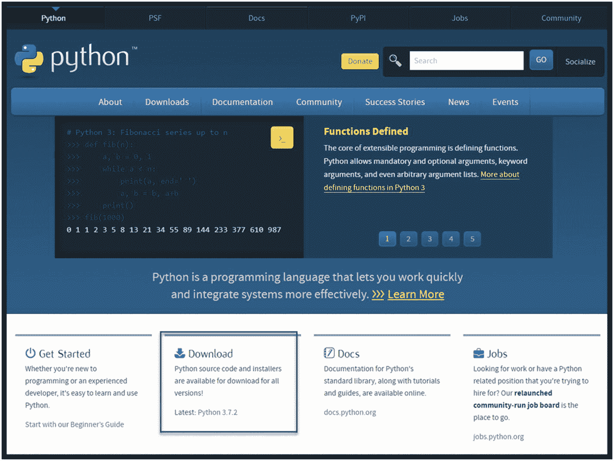
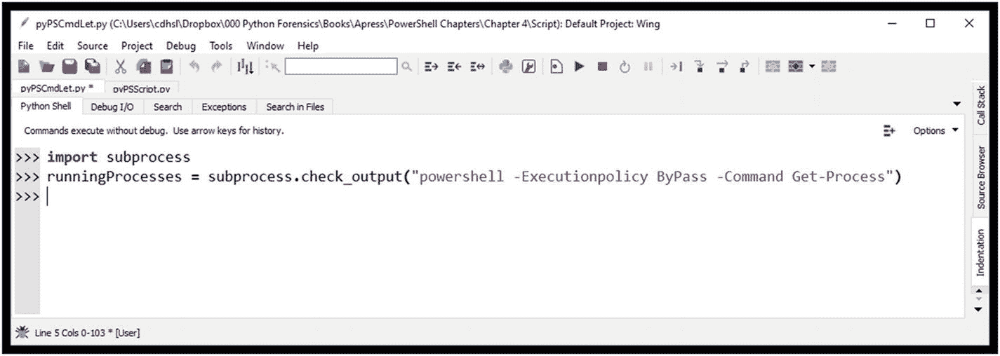
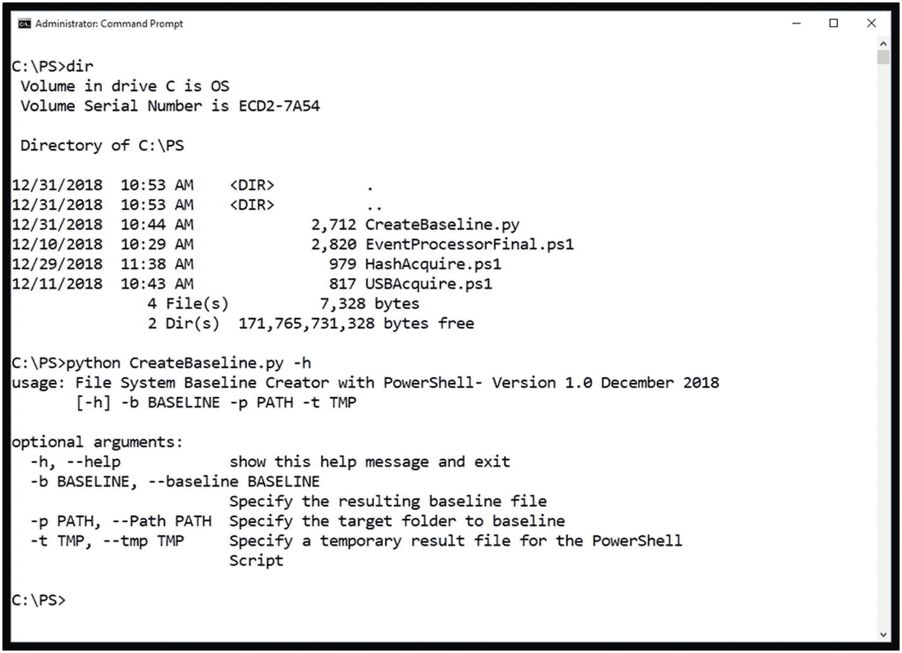
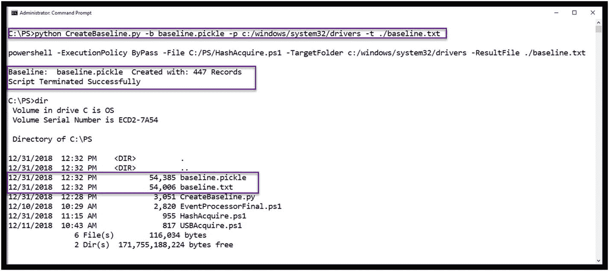

# 四、Python 和现场调查/采集

搜索是数字调查的主体。在过去十年中发生变化的是要搜索的大量数据、要搜索的各种类型的内容以及将具体犯罪活动联系起来所需的信息类型。

如今，数字数据与所有犯罪活动都有关联。使用这些数据来理解(并可能证明)犯罪的动机、机会和/或手段是至关重要的。在许多情况下，我们可以利用这些数据来建立嫌疑人的档案并预测未来的活动。此外，我们可以发现特定数字设备的位置、行为和内容，无论它们是电话、平板电脑、计算机、无人机、手表还是各种物联网设备。

目前，许多人仍然认为数字证据是在我们对数字媒体成像后检查的静态数据。当然，这种情况正在发生变化，尤其是在数字取证事件响应或 DFIR 活动中。收集、检验和推理“活”证据并不新鲜——我早在 2006 年就开始写这方面的文章并开发解决方案。 <sup>1</sup>

随着对即时反应、早期指示和警告、异常行为检测以及在不良行为发生前对其进行预测的需求在社会中变得至关重要，“现场”法医学最终将与传统的尸检实践携手合作。因此，通过利用 PowerShell 来获取特定的目标证据，我们可以在动作发生时采取下一步的处理和推理。

所有这些都为开发新的检测、推理、分析方法，当然还有犯罪活动的证据提供了重要的机会。然而，在我们能够飞行、奔跑、行走甚至爬行之前，我们需要解决一些基本的挑战，并开发将 PowerShell 驱动的获取与 Python 的能力相集成的软件。有两种基本方法可以解决这个问题:

*   方法 1:启动 PowerShell CmdLets 或脚本，然后在 Python 中收集和后处理结果。

*   方法 2:执行 PowerShell CmdLets 或脚本，并将结果传送给等待的 Python 脚本。

方法 1 将在本章中讨论，方法 2 将在第五章中讨论。在这两种情况下，将通过示例来探索这些方法。

## 什么是“以身作则”？

现有数百本关于 Python 的书籍，大多数都集中在如何编程上，并且通常采用教授您这门语言的复杂性的方法。这些文本是为那些从事计算机科学、软件工程、网络开发或大数据处理的人设计的。

我们的目标是将 Python 应用于具体的数字调查挑战，并结合 Python 和 PowerShell 来创建解决方案。有趣的是，在这个过程中，您将学习新的脚本技术。

我能想到的最好的类比是学习一种新的文化。你可以阅读玛雅文化，观看关于他们历史的电影，并查看他们居住的国家的地图。或者你可以去那里旅行，走进他们的世界，与玛雅人交谈，探索他们的圣地，亲身体验他们的文化。

### 用 Python 指导 PowerShell

由于 Python 2.7 的结束日期即将到来，本书中所有基于 Python 的例子都将使用 Python 3.7。Python 2 和 3 包含了大量的内置标准库以及数以千计的第三方库。尽可能使用 Python 标准库，以确保最广泛的跨平台兼容性。可以直接从 [`www.python.org`](http://www.python.org) 获取 Python 3.7。截至本文撰写之时，可用的最新版本是 Python 3.7.2，如图 4-1 所示。



图 4-1

下载 Python 3.7.2 ( [`www.python.org`](http://www.python.org)

除了最新版本的 Python，我强烈推荐使用 Python 集成开发环境。我最喜欢的是 WingIDE。

个人版是免费的，可以很好地应对大多数 Python 开发和脚本挑战。该网站提供了大量关于如何配置和使用 WingIDE 的教程，可以在以下位置找到:

[`www.wingware.com`](http://www.wingware.com)


图 4-2

翼服/翼服首页( [`www.wingware.com`](http://www.wingware.com)

### 从 Python 启动 PowerShell CmdLets

现在您已经有了基本的工具(PowerShell 已安装并运行，Python 已安装并运行，WingIDE 已准备好进行实验)，您可以执行 Python 和 PowerShell 的第一次集成了。

在第 1 和 2 章中，涵盖了 CmdLets 的发现、使用和取证应用。我相信您已经尝试了各种附加的 CmdLets。因此，如果我们可以从 Python 执行 PowerShell CmdLet 并捕获结果，会怎么样呢？由于 PowerShell 是一个可执行的进程，所以我们将使用 Python 的标准库来提供启动进程的能力。这是使用子过程标准库完成的。在 Python 中，为了利用任何标准或第三方库，您必须导入它们。这是通过一个简单的 import 语句完成的。在这种情况下，语句简单地说就是:

```py
import subprocess

```

这提供了对子进程库中包含的方法和属性的访问。有许多选项可用——最流行的是使用 check.output 方法，它执行指定的过程并返回结果。这里有一个例子:

```py
runningProcesses = subprocess.check_output("powershell -Executionpolicy ByPass -Command Get-Process")

```

WingIDE Python 集成开发的一个很好的特性是能够在交互式 shell 中试验命令，如图 4-3 所示。三个大于号(> > >)是交互式 shell 提示符。如果从命令行或终端窗口启动 Python，您会收到同样的提示。



图 4-3

从 Python shell 执行 PowerShell CmdLet

子过程代码各元素的细分如下，如图 4-4 所示。

*   **A.** 该命令的结果将存储在名为`runningProcesses`的变量中。当然，您可以使用任何允许的变量名。在 Python 中定义变量时，我使用 camel case，以小写字母开始，然后将每个后续单词大写。这使得识别代码中的变量变得容易。

*   **B.** 赋值运算符 or =等号将子流程命令的结果分配给变量`runningProcesses`。

*   **c .**是从子过程库中选择的方法。它接受一个用引号括起来的参数，并定义您希望执行的命令行。

*   **D.** 括号内的引用字符串指定要执行的命令。E-H 定义了要执行的 powershell 命令的每个元素。

*   **e .`powershell`是命令，或者在本例中是要执行的流程。**

***   **F.** `-Executionpolicy ByPass`，默认情况下，PowerShell 不会在没有明确许可的情况下执行脚本或 CmdLets。参数- `Executionpolicy`指定 PowerShell 命令的策略。参数`ByPass`告诉 PowerShell 不要阻止任何东西，也不要发出警告或提示。

    *   **G.** `-Command`指定后面是 PowerShell 命令。在这种情况下，它是一个简单的 CmdLet，但也可能是一个更复杂的基于管道的命令。如果您希望执行 PowerShell 脚本，这将被更改为`-File`,后跟一个有效的. ps1 文件名。

    *   **h .**是要执行的特定 CmdLet。在此示例中，Get-Process CmdLet 在没有参数的情况下执行。** 

 **

图 4-4

Python 子进程命令分解

在 Python 3.x 中，subprocess.check_output()方法返回一个字节字符串，而在 Python 2.7 中，它返回一个简单的字符串。因此，要显示该命令的输出，需要对 runningProcesses 变量进行解码，如下所示:

```py
print(runningProcesses.decode())

```

在 WingIDE Python 交互式 shell 中执行该命令会产生如图 4-5 所示的结果。注意，为简洁起见，结果被截断。


图 4-5

打印出 runningProcesses 变量的内容

此时，您可能会说，我为什么要大费周章地从 Python 中执行 PowerShell 命令或 CmdLet 呢？为了回答这个问题，让我们把这个例子带到下一个层次。

### 使用 PowerShell 和 Python 创建系统文件基线

假设您希望建立当前安装在 Windows 下的驱动程序的基线，特别是 c:\windows\system32\drivers\。就此而言，您可以将任何目录、子目录或整个系统作为目标，但是系统驱动程序以特权运行，并且在调查过程中检测新的驱动程序、现有驱动程序的修改或驱动程序的删除可能会很有用。

获取有关文件的信息是使用 PowerShell 中的 Get-ChildItem CmdLet 完成的。此 CmdLet 有许多相关的功能、属性和方法。我们对创建基线感兴趣的是:

1.  每个文件的哈希，用于创建取证软件使用的已知良好哈希集

2.  每个文件的名称

使用如下所示的管道命令从 PowerShell 获取这些信息非常简单。截断结果如图 4-6 所示，命令分解如图 4-7 所示。

```py
Get-ChildItem c:\windows\system32\drivers\ |
Get-FileHash | Select-object -Property Hash, Path | Format-Table -HideTableHeaders

```


图 4-7

PowerShell 管道细分 Get-ChildItem、Get-FileHash、Select-Object 和 Format-Table


图 4-6

使用 PowerShell 获取文件哈希和路径(注意输出被截断)

流水线命令的分解如下所示，如图 4-7 所示。

*   **A.** Get-ChildItem CmdLet 指定目标文件夹 windows\system32\drivers。

*   **b .**Get-child item CmdLet 的输出通过管道传输到 Get-FileHash CmdLet，默认情况下，Get-file hash CmdLet 将生成每个文件的 SHA-256 哈希。

*   **c .**Get-File hash CmdLet 的结果将通过管道传输到 Select-Object CmdLet，该 CmdLet 将只提取所需的两个输出的 SHA-256 哈希值和文件路径。

*   **d .**Select-Object CmdLet 的结果然后被传递给 Format-Table CmdLet，该 CmdLet 从输出中移除表格标题。

创建一个带有输入参数的 PowerShell 脚本将使这个命令更有用，更可重用。完整的脚本如清单 4-1 所示。

```py
<#
.synopsis
Collect Hash and Filenames from specified folder

- User Specifies the target computer
- User Specifies the target folder

The script will produce a simple ascii output file containing
SHA-256Hash and FilePath

.Description
This script collects Hash and Filenames from specified computer and folder

.parameter targetComputer
Specifies the computer to collect the specified file hash information

.parameter UserName
Specifies the Administrator UserName on the Target Computer

.parameter outFile
Specifies the full path of the output file

.example

HashAcquire
Collects the file hashes on the target Computer
#>

# Parameter Definition Section
param(
    [string]$TargetFolder="c:/windows/system32/drivers/",
    [string]$ResultFile="c:/PS/baseline.txt"
)

Get-ChildItem $TargetFolder | Get-FileHash | Select-Object -Property Hash, Path | Format-Table -HideTableHeaders | Out-File $ResultFile -Encoding ascii

Listing 4-1
HashAquire.ps1 Script

```

该脚本具有标准的部分，以便提供适当的 Get-Help 支持，如清单 4-2 所示。

```py
PS C:\PS> Get-Help .\HashAcquire.ps1

NAME
    C:\PS\HashAcquire.ps1

SYNOPSIS
    Collect Hash and Filenames from specified folder

    - User Specifies the target computer
    - User Specifies the target folder

    The script will produce a simple ascii output file containing
    SHA-256Hash and FilePath

SYNTAX
    C:\PS\HashAcquire.ps1 [[-TargetFolder] <String>] [[-ResultFile] <String>] [<CommonParameters>]

DESCRIPTION
    This script collects Hash and Filenames from specified computer and folder

RELATED LINKS

REMARKS
    To see the examples, type: "get-help C:\PS\HashAcquire.ps1 -examples".
    For more information, type: "get-help C:\PS\HashAcquire.ps1 -detailed".
    For technical information, type: "get-help C:\PS\HashAcquire.ps1 -full".

Listing 4-2Get-Help Results for the HashAquire.ps1 PowerShell Script

```

该脚本包含两个输入参数 TargetFolder 和 ResultFile。

```py
# Parameter Definition Section
param(
    [string]$TargetFolder="c:/windows/system32/drivers/",
    [string]$ResultFile="c:/PS/baseline.txt"
)

```

该脚本使用默认参数创建 baseline.txt 文件。简略结果如图 4-8 所示。通过提供指定目标文件夹的参数，这个脚本现在可以应用于任何合法的文件夹。


图 4-8

baseline.txt 简略结果

### 注意

访问某些文件夹需要管理员权限。确保您以管理员身份运行 PowerShell。

```py
PS C:\PS> .\HashAcquire.ps1

```

#### 使用 Python 创建基线

现在我们有了一个使用 HashAcquire.ps1 PowerShell 脚本提取散列和文件名的可靠方法，我们可以使用 Python 从这些结果中创建一个基线。然而，为此我们将创建一个 Python 脚本/程序，而不是使用交互式 shell。

计划是从 Python 启动 PowerShell 脚本，并从创建的文本文件中提取结果。您可以使用脚本提供的 ResultFile 参数来指定结果文件的名称和位置。

### 注意

当前的 PowerShell 脚本仅处理指定的目录。但是，Get-ChildItem CmdLet 有一个可选参数，也可用于指定子文件夹获取。该参数是-recurse，通过使用:

`Get-Help Get-ChildItem`

你会发现 Get-ChildItem 有很多选项和用法示例。

下一步是将提取的结果存储在 Python 字典中，以生成基线。一旦创建了字典基线，就可以存储生成的字典并用于比较。这样，您可以从目标文件夹中检测任何新的、修改的或删除的文件。

### 注意

Python 字典很像传统的 Webster 风格的字典，有一个键和值，通常称为键/值对。在 Python 中，键和值都可以很复杂，唯一的规则是键必须是可哈希类型，比如整数、长整型、字符串或元组。键/值对的值部分可以是列表或其他不可散列的数据类型。此外，字典的键必须是唯一的(很像真正的字典)。

完整的 CreateBaseline.py 脚本如清单 4-3 所示。

### 注意

对于本书其余部分中的 PowerShell 和 Python 脚本，创建了目录 c:\PS 来保存脚本和结果。

另外，不要试图从书中复制和粘贴 Python 脚本。Python 使用一种严格缩进的方法，这种方法可能会在复制和粘贴过程中被破坏。发布者已经提供了对位于 [`www.apress.com/9781484245033`](http://www.apress.com/9781484245033) 的源代码文件的访问。

```py
'''
Step One Create a baseline hash list of target folder
December 2018, Python Forensics

'''

''' LIBRARY IMPORT SECTION '''

import subprocess       # subprocess library
import argparse         # argument parsing library
import os               # Operating System Path
import pickle           # Python object serialization

'''ARGUMENT PARSING SECTION '''

def ValidatePath(thePath):
    ''' Validate the Folder thePath
        it must exist and we must have rights
        to read from the folder.
        raise the appropriate error if either
        is not true
    '''
    # Validate the path exists
    if not os.path.exists(thePath):
        raise argparse.ArgumentTypeError('Path does
        not exist')

    # Validate the path is readable
    if os.access(thePath, os.R_OK):
        return thePath
    else:
        raise argparse.ArgumentTypeError('Path is not readable')

#End ValidatePath

''' Specify and Parse the command line, validate the arguments and return results'''

parser = argparse.ArgumentParser('File System Baseline Creator with PowerShell- Version 1.0 December 2018')

parser.add_argument('-b', '--baseline',
required=True,
help="Specify the resulting dictionary baseline file")

parser.add_argument('-p', '--Path',
required=True, type= ValidatePath,
help="Specify the target folder to baseline")

parser.add_argument('-t', '--tmp',
required=True,
help="Specify a temporary result file for the PowerShell Script")

args = parser.parse_args()

baselineFile = args.baseline
targetPath   = args.Path
tmpFile      = args.tmp

''' MAIN SCRIPT SECTION '''
if __name__ == '__main__':

    try:
        ''' POWERSHELL EXECUTION SECTION '''
         command = "powershell -ExecutionPolicy ByPass
-File C:/PS/HashAcquire.ps1"+"
-TargetFolder "+ targetPath+" -ResultFile "+ tmpFile

        print(command)

        powerShellResult = subprocess.run(command, stdout=subprocess.PIPE)

        if powerShellResult.stderr == None:

            ''' DICTIONARY CREATION SECTION '''
            baseDict = {}

            with open(tmpFile, 'r') as inFile:
                for eachLine in inFile:
                    lineList = eachLine.split()
                    if len(lineList) == 2:
                        hashValue = lineList[0]
                        fileName  = lineList[1]
                        baseDict[hashValue] = fileName
                    else:
                        continue

            with open(baselineFile, 'wb') as outFile:
                pickle.dump(baseDict, outFile)

                print("Baseline: ", baselineFile,
" Created with:", "{:,}".format(len(baseDict)), "Records")

                print("Script Terminated Successfully")
        else:
            print("PowerShell Error:", p.stderr)

    except Exception as err:
        print ("Cannot Create Output File: "+str(err))
        quit()

Listing 4-3
CreateBaseLine Python Script

```

不熟悉 Python 的人可能会觉得这个脚本有点复杂。因此，该脚本在这里被分成以下几个部分:

1.  库导入

2.  参数解析

3.  主要的

4.  POWERSHELL 执行

5.  词典创作

**库导入**:顾名思义，这是加载所需 Python 库的地方。它们包括:

*   子进程:用于启动 PowerShell 脚本

*   os:用于文件和文件夹验证

*   argparse:用于解析命令行参数

*   pickle:用于将结果字典存储到一个文件中以备后用

**参数解析**:这个部分设置并处理用户命令行参数。对于此脚本，必需的参数包括:

*   -b 指定生成的字典基线文件名。

*   -p 指定 PowerShell 脚本用来存储提取的哈希和文件名的目标路径。

*   -t 指定 PowerShell 脚本将用来存储哈希数据的 tmp 文件。

Python 中的 argparse 库会自动处理命令行，并验证用户是否输入了所有必需的参数，并在用户请求时提供帮助。图 4-9 描述了测试文件夹和只使用-h 选项执行脚本的结果。



图 4-9

执行请求帮助的 CreateBaseline.py 脚本

参数处理部分会创建三个变量:

1.  [-b] baselineFile:指定生成的基线字典文件。该文件将由 Python 脚本创建。

2.  [-p] targetPath:传递给 PowerShell 脚本以指定基线化哪个文件夹。这由 PowerShell 脚本使用。

3.  [-t] tmpFile:它被传递给 PowerShell 脚本以指定将保存中间结果的临时文本文件。Python 脚本使用 PowerShell 脚本生成的临时文件。

**MAIN** :初步设置完成后，MAIN 部分执行脚本的核心元素。

**POWERSHELL 执行**:这个部分启动 POWERSHELL 脚本。它首先创建一个名为**命令**的变量，subprocess.run()方法将使用该变量启动 PowerShell 脚本。请注意，本例中的执行指定了一个文件，-File，而不是一个命令，-Command，这在前面的示例中使用过。它指定 PowerShell 脚本 HashAcquire.ps1。在完成 subprocess 命令后，将检查标准错误或 stderr 结果是否成功完成。结果应该是零。否则，Python 脚本将报告返回的错误。

**字典创建**:如果 PowerShell 命令成功完成，Python 脚本将处理临时结果文件以创建字典。由于结果文件的格式是在 PowerShell 脚本中定义的，因此可以使用 Python 迭代循环来处理文件的每一行以提取哈希值和文件路径。使用哈希值作为键/值对的**键**，使用文件路径作为键/值对的**值**，为每一行创建一个字典条目。处理完所有行之后，Python pickle 库用于将创建的字典存储在命令行上指定的文件中，该文件现在包含在变量 baselineFile 中。Python 脚本将报告脚本的详细信息。如果 Python 脚本运行期间出现任何错误或异常，脚本将会报告异常。

图 4-10 显示了 CreateBaseline.py Python 与 HashAcquire.ps1 PowerShell 脚本的成功执行。如您所见，该脚本为 c:/windows/system32/drivers/文件夹中包含的文件生成了 447 个字典条目。此外，在 c:/PS/文件夹中创建了两个指定的文件 baseline.txt 和 baseline.pickle。



图 4-10

Python/PowerShell 脚本组合脚本执行

#### 使用 Python 验证基线

下一步是创建一个 Python 脚本，该脚本将验证所选文件夹的当前版本是否已更改。基本上，我们正在创建一个简单的绊网。验证脚本应该完成哪些具体的验证？

1.  是否添加了任何文件？

2.  有文件被删除了吗？

3.  是否有文件被更改？

我们将重用 HashAcquire.ps1 PowerShell 脚本，并对 HashAcquire.ps1 返回的每个条目的处理进行一些修改。唯一的修改包括:

1.  添加基线字典加载部分

2.  增加了字典测试部分和相关的字典验证功能

清单 4-4 包含了完整的验证 Python 脚本。注意，HashAcquire.ps1 PowerShell 脚本保持不变。

```py
'''
Step Two Verify a baseline hash list against a target folder
December 2018, Python Forensics

'''

''' LIBRARY IMPORT SECTION '''

import subprocess       # subprocess library
import argparse         # argument parsing library
import os               # Operating System Path
import pickle           # Python object serialization

"'ARGUMENT PARSING SECTION "'

def ValidatePath(thePath):
    ''' Validate the Folder thePath
        it must exist and we must have rights
        to read from the folder.
        raise the appropriate error if either
        is not true
    '''
    # Validate the path exists
    if not os.path.exists(thePath):
        raise argparse.ArgumentTypeError('Path does not exist')

    # Validate the path is readable
    if os.access(thePath, os.R_OK):
        return thePath
    else:
        raise argparse.ArgumentTypeError('Path is not readable')

#End ValidatePath ===================================

''' Specify and Parse the command line, validate the arguments and return results'''

parser = argparse.ArgumentParser('File System Baseline Validation with PowerShell- Version 1.0 December 2018')

parser.add_argument('-b', '--baseline',required=True,
help="Specify the source baseline file to verify")

parser.add_argument('-p', '--Path',
type= ValidatePath, required=True,
help="Specify the target folder to verify")

parser.add_argument('-t', '--tmp', required=True,
help="Specify a temporary result file for the PowerShell Script")

args = parser.parse_args()

baselineFile = args.baseline
targetPath   = args.Path
tmpFile      = args.tmp

def TestDictEquality(d1,d2):
    """ return True if all keys and values are the same
        otherwise return False """
    if all(k in d2 and d1[k] == d2[k] for k in d1):
        if all(k in d1 and d1[k] == d2[k] for k in d2):
            return True
        else:
            return False
    else:
        return False

    '''
    return all(k in d2 and d1[k] == d2[k]
               for k in d1) \
        and all(k in d1 and d1[k] == d2[k]
               for k in d2)
    '''

def TestDictDiff(d1, d2):
    """ return the subset of d1 where the keys don't exist in d2 or the values in d2 are different, as adict """

    diff = {}

    for k,v in d1.items():
        if k in d2 and v in d2[k]:
            continue
        else:
            diff[k+v] = "Baseline Missmatch"

    return diff

''' MAIN SCRIPT SECTION '''
if __name__ == '__main__':

    try:
        ''' POWERSHELL EXECUTION SECTION '''
        print()
        command = "powershell -ExecutionPolicy ByPass -File C:/PS/HashAcquire.ps1"+" -TargetFolder "+ targetPath+" -ResultFile "+ tmpFile
        print(command)
        print()

        powerShellResult = subprocess.run(command, stdout=subprocess.PIPE)
        if powerShellResult.stderr == None:

            ''' BASELINE DICTIONARY LOAD SECTION '''
            # Load in the baseline dictionary

            with open(baselineFile, 'rb') as baseIn:
                baseDict = pickle.load(baseIn)

            ''' DICTIONARY CREATION SECTION '''

            # Create a new dictionary for the target folder
            newDict  = {}

            with open(tmpFile, 'r') as inFile:
                for eachLine in inFile:
                    lineList = eachLine.split()
                    if len(lineList) == 2:
                        hashValue = lineList[0]
                        fileName  = lineList[1]
                        newDict[hashValue] = fileName

                    else:
                        continue

            ''' DICTIONARY TEST SECTION '''
            if TestDictEquality(baseDict, newDict):
                print("No Changes Detected")
            else:
                diff = TestDictDiff(newDict, baseDict)
                print(diff)

        else:
            print("PowerShell Error:", p.stderr)

    except Exception as err:
        print ("Cannot Create Output File: "+str(err))
        quit()

Listing 4-4
Verify Baseline Python Script

```

#### VerifyBaseline.py 中新代码部分的概述

**DICTIONARY LOAD:** 这个部分从保存的 pickle 文件中加载指定的字典，该文件是在 CreateBaseline.py 脚本中创建的。pickle.load()方法用于从指定文件中恢复字典。

**字典测试:**这个部分使用了两个新创建的函数:

*   TestDictEquality()

*   TestDictDiff()

TestDictEquality 函数将目标文件夹中新创建的字典与使用 pickle.load()方法加载的已保存字典进行比较。两本词典

*   基础词典

*   新词典

包含要比较的词典。这些字典包含每个字典的 SHA-256 散列(键)和文件名(值)。Python 提供了许多有用的内置机制来比较和遍历字典。TestDictEquality 函数验证这两个字典是否完全匹配。如果是，函数将返回 True。如果它们不相等，那么函数返回 False。为了确定存在哪些差异，仅当不相等时才调用 TestDictDiff()函数。

TestDictDiff 函数将 baseDict 的内容与 newDict 的内容进行比较，并创建一个新的字典来保存任何不匹配的值。包含任何差异的字典由 TestDictDiff 函数返回。一旦返回，就会显示 diffDictionary 的内容。

图 4-11 显示了 VerifyBaseline.py 脚本的执行，包括新的帮助结果和未检测到的更改。


图 4-11

验证基线执行并帮助不做任何更改

图 4-12 显示了 VerifyBaseline.py 脚本的执行，该脚本识别了添加到 c:/windows/system32/drivers 目录中的两个无害文件。


图 4-12

用检测到的变更验证基线执行

### 使用 PowerShell 执行 Python 概述

这个例子为 Python 中 PowerShell 结果的执行和后处理提供了一个很好的模型。更重要的是，这个模型可以扩展到其他用途。例如:

1.  通过修改 PowerShell 脚本和参数，可以添加目标计算机名。PowerShell 脚本接下来可以添加 Invoke-Command CmdLet，然后执行远程获取，这在 Python 中要困难得多。因此，我们使用 PowerShell 作为采集引擎，使用 Python 作为后台处理器。下面是一个必要的修改后的 PowerShell 命令的示例:

    ```py
    Invoke-Command -ComputerName $targetComputer -Credential $User
    -ScriptBlock {Get-ChildItem $TargetFolder | Get-FileHash | Select-Object -Property Hash, Path | Format-Table -HideTableHeaders | Out-File $ResultFile -Encoding ascii}

    ```

2.  获取 CmdLet Get-ChildItem 可以用大量其他面向获取的 CmdLet 替换，例如:
    *   获取流程

    *   获取服务

    *   Get-NetTCPConnections

    *   Get-NetFirewallSetting

    *   、或任何其他具有调查兴趣的本地或网络值

        然后，无需修改即可应用 Python CreateBaseline 和 VerifyBaseline 脚本来创建基线，然后检测环境中的任何变化。

3.  使用 subprocess.run()的接口模型可以应用于 PowerShell 脚本的其他获取。使用创建可以从 Python 中逐行获取的简单 ASCII 结果文件的模型，在 Python 和 PowerShell 之间建立一个可靠的接口。你当然可以通过标准输出返回数据。但是，当从 PowerShell 生成大量输出时，这种方法不太稳定。

## 挑战问题:执行远程脚本执行

利用您从 Python 和所提供的模型中学到的关于 PowerShell 脚本执行的知识:

1.  通过探索提供调查或事件响应值的其他 PowerShell CmdLets 来扩展所提供的解决方案。根据需要调整 PowerShell 和 Python 脚本。
    1.  获取流程

    2.  获取服务

    3.  Get-NETTCPConnections

    4.  get-防火墙设置

2.  修改 PowerShell 和 Python 脚本，以包括对其他计算机的访问。这将需要更改这两个脚本，以便提供附加计算机的名称。此外，PowerShell 脚本需要添加适当的 Invoke-Command CmdLet。

## 摘要

本章重点介绍了通过 Python 执行 PowerShell CmdLets 和脚本。本章讲述了使用 Python 子进程库与 PowerShell 交互的主要方法。

此外，还讨论了将 PowerShell 结果交付给 Python 进行后处理的方法。这种集成的可重用模型为 PowerShell 和 Python 的集成提供了基线。

最后，通过示例讨论了 Python 语言、库和数据类型。这些包括参数解析、子进程用法、字典、函数和一般 Python 程序结构。

第五章将通过额外的例子和方法来扩展 PowerShell 和 Python 的集成。

<aside class="FootnoteSection" epub:type="footnotes">Footnotes 1

[`https://gcn.com/Articles/2006/07/27/Special-Report%2D%2DLive-forensics-is-the-future-for-law-enforcement.aspx`](https://gcn.com/Articles/2006/07/27/Special-Report%252D%252DLive-forensics-is-the-future-for-law-enforcement.aspx)

 </aside>**