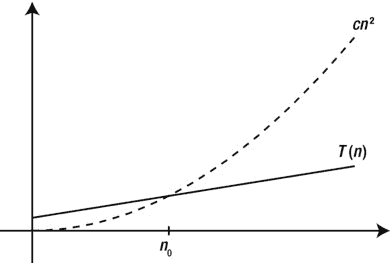
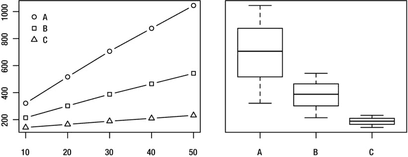
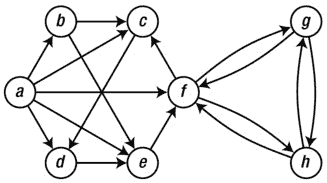

# 二、基础知识

特蕾西:我不知道你在那里。

佐伊:算是说到点子上了。隐身——你可能听说过。

特蕾西:我想他们在 basic 中没有涉及到这一点。

——摘自*萤火虫*第 14 集《讯息》

在继续讨论构成本书主要内容的数学技术、算法设计原则和经典算法之前，我们需要了解一些基本的原则和技术。当你开始阅读下面的章节时，你应该清楚诸如“没有负循环的有向加权图”和“θ(*n*LG*n*)的运行时间”等短语的含义您还应该知道如何用 Python 实现一些基本的结构。

幸运的是，这些基本概念一点也不难理解。本章的两个主要主题是渐近符号，它让你专注于运行时间的本质，以及用 Python 表示树和图的方式。此外，还有一些实用的建议，告诉你如何安排节目时间，避免一些基本的陷阱。不过，首先，让我们看看我们算法学家在描述我们算法的行为时倾向于使用的抽象机器。

计算中的一些核心思想

20 世纪 30 年代中期，英国数学家艾伦·图灵发表了一篇名为《论可计算数及其在 Entscheidungsproblem 中的应用》的论文，并在许多方面为现代计算机科学奠定了基础。他的抽象概念*图灵机*已经成为计算理论的核心概念，很大程度上是因为它直观上容易理解。图灵机是一个简单的抽象设备，可以读取、写入和移动无限长的纸条。机器的实际行为各不相同。每个都是所谓的有限状态机:它有一组有限的状态(其中一些表示它已经完成)，它读取的每个符号都可能触发读取和/或写入并切换到不同的状态。你可以把这个机器想象成一套*规则*。(“如果我在状态 4，看到一个 *X* ，我向左移动一步，写一个 *Y* ，切换到状态 9。”)虽然这些机器看起来很简单，但令人惊讶的是，它们可以用来实现任何人迄今为止能够想象到的任何形式的计算，大多数计算机科学家认为它们包含了我们所认为的计算的本质。

一个*算法* 是一个过程，由一组有限的步骤组成，可能包括循环和条件，解决一个给定的问题。图灵机是对一个算法到底解决了什么问题的正式描述， [<sup>2</sup>](#Fn2) 并且这种形式主义经常在讨论哪些问题可以被解决的时候使用(要么完全解决，要么在合理的时间内解决，就像在本章后面和第 11 章[中讨论的那样](11.html))。然而，对于更细粒度的算法效率分析，图灵机通常不是首选。我们使用一大块可以直接访问的内存*，而不是沿着纸带滚动。由此产生的机器通常被称为*随机存取机*。*

 *虽然随机存取机器的形式可能会变得有点复杂，但我们只需要知道一些关于其能力的限制，这样我们就不会在算法分析中作弊。该机器是标准单处理器计算机的抽象简化版本，具有以下特性:

*   我们无法访问任何形式的并发执行；机器只是一条接一条地执行指令。
*   标准的基本操作，如算术、比较和内存访问，都需要恒定(尽管可能不同)的时间。没有排序等更复杂的基本操作。
*   一个计算机字(我们可以在恒定时间内处理的值的大小)不是无限的，但它足够大，可以寻址所有用于表示我们问题的内存位置，再加上我们变量的额外百分比。

在某些情况下，我们可能需要更具体，但这个机器草图目前应该可以了。

我们现在对什么是算法，以及运行算法的抽象硬件有了一点直觉。拼图的最后一块是一个问题的概念。就我们的目的而言，问题是输入和输出之间的关系。事实上，这比听起来要精确得多:一个*关系，在数学意义上的*，是一组对——在我们的例子中，哪些输出对于哪些输入是可接受的——通过指定这个关系，我们已经确定了我们的问题。例如，排序问题可以指定为两个集合 A 和 B 之间的关系，每个集合都由序列组成。 [<sup>3</sup>](#Fn3) 无需描述*如何执行*排序(这将是算法)，我们可以指定哪些输出序列(B 的元素)是可接受的，给定一个输入序列(A 的元素)。我们将要求结果序列由与输入序列相同的元素组成，并且结果序列的元素按升序排列(每个元素都大于或等于前一个元素)。这里 A 的元素——也就是输入——被称为*问题实例*；关系本身就是实际问题。

为了让我们的机器处理问题，我们需要将输入编码为 0 和 1。这里我们不会太担心细节，但是这个想法很重要，因为运行时间复杂性的概念(如下一节所述)是基于知道一个问题实例有多大*和多大*，而这个大小就是对它进行编码所需的内存量。正如您将看到的，这种编码的确切性质通常无关紧要。

渐近符号

还记得第一章中[对`insert`的例子吗？不知何故，在列表末尾添加条目比在前面插入条目更能适应列表的大小；参见`list`上附近的“黑匣子”边栏获得解释。这些内置操作都是用 C 编写的，但是假设您用纯 Python 重新实现了`list.append`;姑且武断地说，新版本比原版慢 50 倍。让我们假设你在一台非常慢的机器上运行你缓慢的、基于纯 Python `append`的版本，而快速的、优化的、基于插件的版本在一台比*快 1000 倍*的计算机上运行。现在插入版的速度优势是 5 万倍。您通过插入 100，000 个数字来比较这两种实现。你认为会发生什么？](01.html)

直觉上，速度快的解决方案显然应该胜出，但是它的“快”只是一个不变的因素，它的运行时间比“慢”的解决方案增长得更快。对于手头的例子，在较慢的机器上运行的 Python 编码版本实际上将在另一台机器的一半时间内完成。让我们把问题的规模扩大一点，比如增加到 1000 万个数字。现在慢机上的 Python 版本会比快机上的 C 版本*快 2000 倍*。这就像跑一分钟和跑一天半的区别！

随着问题规模的增加，*常数因子*(例如，与通用编程语言性能和硬件速度相关)和运行时间的*增长*之间的区别在算法研究中至关重要。我们关注的是全局——解决问题的给定方法的独立于实现的特性。我们希望摆脱分散注意力的细节，深入核心分歧，但为了做到这一点，我们需要一些形式主义。

**黑匣子:列表**

Python 列表并不是传统计算机科学意义上的真正列表，这解释了为什么`append`比`insert`更有效。一个经典的列表——所谓的链表——被实现为一系列的*节点*,每个节点(除了最后一个)都保存着对下一个节点的引用。一个简单的实现可能是这样的:

`class Node:`
`def __init__(self, value, next=None):`
`self.value = value`

您可以通过指定所有节点来构建一个列表:

`>>> L = Node("a", Node("b", Node("c", Node("d"))))`
`>>> L.next.next.value`


这就是所谓的单链表；双向链表中的每个节点也将保持对前一个节点的引用。

Python 的`list`类型的底层实现有点不同。一个`list`基本上是一个单一的、连续的内存块，而不是几个相互引用的独立节点——这通常被称为一个*数组*。这导致了与链表的一些重要区别。例如，虽然遍历列表的内容对这两种类型都同样有效(除了链表中的一些开销)，但在数组中直接访问给定索引处的元素要有效得多。这是因为可以计算元素的位置，可以直接访问正确的内存位置。然而，在链表中，人们必须从头开始遍历链表。

不过，我们遇到的差异与插入有关。在链表中，一旦知道要在哪里插入东西，插入是廉价的；无论列表包含多少个元素，都需要大致相同的时间。数组则不是这样:插入必须移动插入点右侧的所有元素，如果需要，甚至可能将所有元素移动到一个更大的数组中。追加的*的一个具体解决方案是使用通常所说的一个*动态*数组，或*向量*。 [<sup>4</sup>](#Fn4) 想法是分配一个太大的数组，然后每当它溢出的时候线性时间重新分配。这似乎使得追加和插入一样糟糕。在这两种情况下，我们都有不得不移动大量元素的风险。主要的区别在于，使用 append 时，这种情况较少发生。事实上，如果我们能够确保我们总是移动到一个比上一个大一个固定百分比(比如 20%甚至 100%)的数组，那么平均*成本(分摊到许多追加中)是恒定的。**

我一窍不通！

自 19 世纪晚期以来，渐近符号一直在使用(有一些变化),并且是分析算法和数据结构的基本工具。核心思想是将我们正在分析的资源(通常是时间，但有时也是内存)表示为一个函数，以输入大小作为其参数。例如，我们可以有一个运行时间为*T*(*n*)= 2.4*n*+7 的程序。

一个重要的问题随即产生:这里的单位是什么？无论我们用秒或毫秒来度量运行时间，还是用比特或兆字节来表示问题的大小，这似乎都无关紧要。然而，有些令人惊讶的答案是，它不仅微不足道，而且实际上根本不会影响我们的结果。我们可以用木星年来度量时间，用千克来度量问题的大小(大概是所用存储介质的质量)，而这*并不重要*。这是因为我们忽略实现细节的初衷也适用于这些因素:渐近符号忽略了所有这些因素！(不过，我们通常假设问题大小是一个正整数。)

我们最终经常做的是让运行时间成为执行某个基本操作的次数，而问题大小要么是处理的项目数(例如要排序的整数数)，要么在某些情况下，是以某种合理的编码方式对问题实例进行编码所需的位数。


***遗忘。*** *当然，这个断言是行不通的。(* *`http://xkcd.com/379`* *)*

 **注意**只要你是合理的，你如何将你的问题和解决方案编码成位模式通常对渐近运行时间没有什么影响。例如，避免用一元数字系统表示数字(1=1，2=11，3 = 111……)。

渐近符号由一串操作符组成，写为希腊字母。最重要的，也是我们将使用的，是 *O* (最初是一个 omicron，但现在通常称为“大 Oh”)、ω(ω)和θ(θ)。 *O* 操作符的定义可以作为其他两个操作符的基础。表达式 *O* ( *g* )，对于某个函数 *g* ( *n* )，表示一个函数的*集合*，一个函数 *f* ( *n* )如果满足以下条件则在这个集合中:存在一个自然数 *n* <sub>0</sub> 和一个正常数 *c* 使得

*f*(*n*)≤T4【CG】(*n*

对于所有 *n* ≥ *n* <sub xmlns:m="http://www.w3.org/1998/Math/MathML" xmlns:pls="http://www.w3.org/2005/01/pronunciation-lexicon" xmlns:ssml="http://www.w3.org/2001/10/synthesis">0</sub> 。换句话说，如果我们被允许调整常数 *c* (例如，通过在不同速度的机器上运行算法)，函数 *g* 将最终(即，在*n*0 处)变得比 *f* 大。示例见[图 2-1](#Fig1) 。



[图 2-1](#_Fig1) 。对于 n 大于 n <sub>0</sub> 的值，T(n)小于 cn <sup>2</sup> ，所以 T(n)为 O(n <sup>2</sup>

这是一个相当简单易懂的定义，尽管乍一看可能有点陌生。基本上， *O* ( *g* )就是*增长速度不超过 g* 的函数集合。例如，函数*n*2 在集合*O*(*n*2)中，或者，在集合符号中，*n*<sup xmlns:m="http://www.w3.org/1998/Math/MathML" xmlns:pls="http://www.w3.org/2005/01/pronunciation-lexicon" xmlns:ssml="http://www.w3.org/2001/10/synthesis">2</sup>∈*O*(*n*<sup xmlns:m="http://www.w3.org/1998/Math/MathML" xmlns:pls="http://www.w3.org/2005/01/pronunciation-lexicon" xmlns:ssml="http://www.w3.org/2001/10/synthesis">2</sup>)。我们经常简单的说*n*2 就是*O*(*n*2)。

*n* <sup xmlns:m="http://www.w3.org/1998/Math/MathML" xmlns:pls="http://www.w3.org/2005/01/pronunciation-lexicon" xmlns:ssml="http://www.w3.org/2001/10/synthesis">2</sup> 并不比自身增长得快，这个事实并不特别有趣。也许更有用的是，无论是 2.4*n*2+7 还是线性函数 *n* 都不会。也就是说，我们两者都有

2.4*n*<sup xmlns:m="http://www.w3.org/1998/Math/MathML" xmlns:pls="http://www.w3.org/2005/01/pronunciation-lexicon" xmlns:ssml="http://www.w3.org/2001/10/synthesis">【2】</sup>+7”*或*(

 *和

*n*∈*O*(*n*2)。

第一个例子告诉我们，我们现在能够不用花里胡哨地描述一个函数；我们可以去掉 2.4 和 7，简单地将函数表示为 *O* ( *n* <sup>2</sup> )，这就给出了我们需要的信息。第二个向我们展示了 *O* 也可以用来表示宽松的限制:任何比 *g* 更好(也就是没有增长得更快)的函数都可以在 *O* ( *g* )中找到。

这与我们最初的例子有什么关系？嗯，事情是这样的，即使我们不能确定细节(毕竟它们取决于 Python 版本和您使用的硬件)，我们也可以近似地描述操作:将 *n* 个数字附加到 Python 列表的运行时间是 *O* ( *n* )，而在其开头插入 *n* 个数字的运行时间是 *O* ( *n* <sup>2</sup> )。

另外两个，ω和θ，只是 *O* 的变体。ω是它的完全反义词:一个函数 *f* 在ω(*g*中)如果满足以下条件:存在一个自然数*n*0 和一个正常数 *c* 使得

*f*(*n*)≥T4【CG】(*n*

对于所有 *n* ≥ *n* <sub>0</sub> 。所以，其中 *O* 形成所谓的渐近上界，ω形成渐近*下界*。

 **注**我们的前两个渐近算子 *O* 和ω是彼此的逆:如果 *f* 是 *O* ( *g* ，那么 *g* 是ω(*f*)。练习 2-3 要求你展示这个。

θ形成的集合只是另外两个的交集，即θ(*g*)=*O*(*g*)∩ω(*g*)。换句话说，如果满足以下条件，函数 *f* 在θ(*g*)中:存在自然数 *n* <sub xmlns:m="http://www.w3.org/1998/Math/MathML" xmlns:pls="http://www.w3.org/2005/01/pronunciation-lexicon" xmlns:ssml="http://www.w3.org/2001/10/synthesis">0</sub> 和*两个正常数 *c* <sub xmlns:m="http://www.w3.org/1998/Math/MathML" xmlns:pls="http://www.w3.org/2005/01/pronunciation-lexicon" xmlns:ssml="http://www.w3.org/2001/10/synthesis">1</sub> 和 *c* <sub xmlns:m="http://www.w3.org/1998/Math/MathML" xmlns:pls="http://www.w3.org/2005/01/pronunciation-lexicon" xmlns:ssml="http://www.w3.org/2001/10/synthesis">2</sub> 使得*

*<sub xmlns:m="http://www.w3.org/1998/Math/MathML" xmlns:pls="http://www.w3.org/2005/01/pronunciation-lexicon" xmlns:ssml="http://www.w3.org/2001/10/synthesis">【1】</sub>*(*)≤【f】(*)≤****

 ***对于所有 *n* ≥ *n* <sub>0</sub> 。这意味着 *f* 和 *g* 具有*相同的渐近增长*。例如，3 *n* <sup>2</sup> + 2 是θ(*n*<sup>2</sup>)，但是我们也可以写成 *n* <sup>2</sup> 是θ(3*n*<sup>2</sup>+2)。通过同时提供一个上界和一个下界，θ操作符是三个中信息最丰富的，我将尽可能使用它。

交通规则

虽然渐近算子的定义可能有点难以直接使用，但它们实际上导致了一些有史以来最简单的数学。您可以删除所有乘法和加法常数，以及函数中的所有其他“小部分”，这大大简化了事情。

作为处理这些渐近表达式的第一步，让我们看看一些典型的渐近类，或*阶*。[表 2-1](#Tab1) 列出了其中的一些，以及它们的名字和一些具有这些渐近运行时间的典型算法，有时也被称为运行时间*复杂性*。(如果你的数学有点生疏，你可以看看本章后面的边栏“快速数学复习”。)该表的一个重要特征是复杂性已经排序，因此每一行*支配前一行*:如果在表中发现 *f* 比 *g* 高，那么 *f* 就是 *O* ( *g* )。 [<sup>5</sup>](#Fn5)

[表 2-1](#_Tab1) 。渐近运行时间的常见示例

| 

复杂性

 | 

名字

 | 

例子，评论

 |
| --- | --- | --- |
| I（1） | 常数 | 散列表查找和修改(参见`dict`的“黑盒”侧栏)。 |
| θ(LG*n* | 对数的 | 二分搜索法(见[第六章](06.html))。对数底数不重要。 [<sup>7</sup>](#Fn7) |
| θ(*n* | 线性的 | 遍历一个列表。 |
| θ(*n*LG*n* | 对数线性 | 任意值的最优排序(见[第 6 章](06.html))。同θ(LG*n*！). |
| ο(t1<sup xmlns:m="http://www.w3.org/1998/Math/MathML" xmlns:pls="http://www.w3.org/2005/01/pronunciation-lexicon" xmlns:ssml="http://www.w3.org/2001/10/synthesis">2</sup> | 二次的 | 将 *n* 个对象相互比较(参见[第三章](03.html))。 |
| θ(*n*<sup>3</sup> | 立方体的 | 弗洛伊德和沃肖尔的算法(见[第八章](08.html)和[第九章](09.html))。 |
| *O* ( *nk* ) | 多项式 | *k* 嵌套在 *n* 上的 for 循环(如果 *k* 是正整数)。对于任意常数*k*0。 |
| φ(kn | 指数的 | 产生每一个 *n* 项的子集(*k*= 2；参见[第三章](03.html)。任意*k*1。 |
| θ(*n*！） | 阶乘 | 产生 *n* 个值的每个排序。 |

 **注**其实关系更严格: *f* 是 *o* ( *g* )，其中“小哦”如果是“大哦”就是更严格的版本凭直觉，它不是“增长速度不快于”，而是“增长速度慢于”从形式上来说，它声明随着 *n* 增长到无穷大，*f*(*n*)/*g*(*n*)收敛到零。不过，你真的不需要担心这个。

*任意*多项式(即任意次幂*k*0，甚至是分数次)支配*任意*对数(即任意底数)*任意*指数(任意底数*k*1)支配*任意*多项式(见习题 2-5 和 2-6)。实际上，所有的对数都是渐近等价的——它们只有常数因子不同(见练习 2-4)。然而，多项式和指数分别根据它们的指数或基底具有不同的渐近增长。所以，*n*5 比*n*4 长得快，5 *n* 比 4 *n* 长得快。

该表主要使用θ符号，但术语*多项式*和*指数*有点特殊，因为它们在将*易处理的*(“可解”)问题与*难处理的*(“不可解”)问题分开时发挥了作用，正如在[第 11 章](11.html)中所讨论的。基本上，具有多项式运行时间的算法被认为是可行的，而指数运行时间通常是无用的。虽然这在实践中并不完全正确，但θ(*n*100)并不比θ(2*n*)更实用；在许多情况下，这是一个有用的区别。 [<sup>6</sup>](#Fn6) 因为这种划分，任何运行时间在 *O* ( *nk* )，对于任何 *k* > 0，都称为多项式，即使极限可能不紧。例如，即使二分搜索法(在[第 6 章](06.html)中`bisect`的“黑盒”边栏中解释)的运行时间为θ(LG*n*)，它仍然被认为是一个多项式时间(或仅仅是多项式)算法。相反，任何ω(*kn*)的运行时间—甚至是一个，比如说，θ(*n*)！)—据说是指数级的。

现在我们已经对一些重要的增长顺序有了一个总体的了解，我们可以制定两个简单的规则:

*   In a sum, only the dominating summand matters.

    比如θ(*n*<sup>2</sup>+*n*<sup>3</sup>+42)=θ(*n*<sup>3</sup>)。

*   In a product, constant factors don’t matter.

    比如θ(4.2*n*LG*n*)=θ(*n*LG*n*)。

总的来说，我们尽量保持渐近表达式尽可能简单，尽可能多地删除不必要的部分。对于 *O* 和ω，我们通常遵循第三个原则:

*   Keep your upper or lower limits tight.

    换句话说，我们试图使上限低，下限高。例如，虽然技术上来说 *n* <sup xmlns:m="http://www.w3.org/1998/Math/MathML" xmlns:pls="http://www.w3.org/2005/01/pronunciation-lexicon" xmlns:ssml="http://www.w3.org/2001/10/synthesis">2</sup> 可能是*O*(*n*3)，但我们通常更喜欢更严格的限制，*O*(*n*<sup xmlns:m="http://www.w3.org/1998/Math/MathML" xmlns:pls="http://www.w3.org/2005/01/pronunciation-lexicon" xmlns:ssml="http://www.w3.org/2001/10/synthesis">2</sup>)。然而，在大多数情况下，最好的方法是简单地使用θ。

在算术表达式中，使用渐近表达式*而不是实际值*会使渐近表达式更加有用。尽管这在技术上是不正确的(毕竟每个渐近表达式都产生一组函数)，但这是很常见的。比如θ(*n*<sup>2</sup>)+θ(*n*<sup>3</sup>)简单来说就是 *f* + *g* ，对于一些(未知的)函数 *f* 和 *g* ，其中 *f* 为θ(*n*<sup>2</sup>和 *g* 即使我们找不到精确的和 *f* + *g* ，因为我们不知道精确的函数，我们*可以*找到渐近表达式来覆盖它，如下面两个“奖励规则”所示

*   θ(*f*)+θ(*g*)=θ(*f*+*g*
*   θ(*f*)θ(*g*)=θ(*f**g*

练习 2-8 要求你证明这些是正确的。

带着渐近线兜一圈

让我们看一些简单的程序，看看我们是否能确定它们的渐近运行时间。首先，让我们考虑这样的程序，其中(渐近)运行时间只随问题大小而变化，而不随问题实例的具体情况而变化。(下一节讨论如果实例的实际内容影响运行时间会发生什么。)这意味着，例如，`if`语句现在是相当不相关的。除了简单的代码块之外，重要的是循环。函数调用不会使事情变得复杂；只需计算调用的复杂度，并将其插入正确的位置。

 **注意**有一种情况下函数调用会让我们出错:当函数是递归的。该案例在[第 3 章](03.html)和[第 4 章](04.html)中处理。

无循环的情况很简单:我们在一个语句之前执行另一个语句，因此增加了它们的复杂性。比方说，我们知道对于一个大小为 *n* 的列表，调用 append 是θ(1)，而调用 insert 在位置 0 是θ(*n*)。考虑下面的两行小程序片段，其中`nums`是大小为 *n* 的列表:

```py
nums.append(1)
nums.insert(0,2)
```

我们知道直线首先需要恒定的时间。当我们到达第二行时，列表大小已经改变，现在是 *n* + 1。这意味着第二行的复杂度为θ(*n*+1)，与θ(*n*)相同。这样，总的运行时间就是两个复杂度之和，θ(1)+θ(*n*)=θ(*n*)。

现在，让我们考虑一些简单的循环。这里有一个简单的`for`循环，遍历一个有 *n* 个元素(比如数字；比如`seq = range(n)` ): [<sup>8</sup>](#Fn8)

```py
s = 0
for x in seq:
    s += x
```

这是`sum`函数的一个简单实现:它遍历`seq`并将元素添加到`s`中的初始值。这为`seq`的 *n* 个元素的每一个执行一个单一的恒定时间操作(`s += x`)，这意味着它的运行时间是线性的，或者θ(*n*)。注意，恒定时间初始化(`s = 0`)由这里的循环控制。

例如，同样的逻辑适用于我们在列表(或集合或字典)理解和生成器表达式中发现的“伪装的”循环。下面的列表理解也具有线性运行时复杂性:

```py
squares = [x**2 for x in seq]
```

几个内置函数和方法中也有“隐藏的”循环。这通常适用于处理容器中每个元素的任何函数或方法，例如`sum`或`map`。

当我们开始嵌套循环时，事情变得有点(但不是很多)棘手。假设我们要总结`seq`中元素所有可能的乘积；这里有一个例子:

```py
s = 0
for x in seq:
    for y in seq:
        s += x*y
```

关于这个实现值得注意的一点是，每个产品将被添加两次。例如，如果`42`和`333`都在`seq`，我们就把`42*333`和`333*42`都加上。那其实不影响运行时间；这只是一个不变的因素。

现在的运行时间是多少？基本规则很简单:一个接一个执行的代码块的复杂性只是增加了。嵌套循环的复杂性是*乘以*。原因很简单:对于外部循环的每一轮，内部循环都被完全执行。在这种情况下，这意味着“线性乘以线性”，这是二次的。换句话说，运行时间是θ(*n*n)=θ(*n*2)。实际上，这个乘法规则意味着对于更高层次的嵌套，我们将只增加幂(即指数)。三个嵌套的线性循环给我们θ(*n*<sup xmlns:m="http://www.w3.org/1998/Math/MathML" xmlns:pls="http://www.w3.org/2005/01/pronunciation-lexicon" xmlns:ssml="http://www.w3.org/2001/10/synthesis">3</sup>)，四个给我们θ(*n*<sup xmlns:m="http://www.w3.org/1998/Math/MathML" xmlns:pls="http://www.w3.org/2005/01/pronunciation-lexicon" xmlns:ssml="http://www.w3.org/2001/10/synthesis">4</sup>)，以此类推。

当然，顺序和嵌套案例可以混合使用。考虑以下轻微的扩展:

```py
s = 0
for x in seq:
    for y in seq:
        s += x*y
    for z in seq:
        for w in seq:
            s += x-w
```

可能不完全清楚我们在这里计算什么(我当然不知道)，但是我们应该仍然能够使用我们的规则找到运行时间。`z`-循环运行线性次数的迭代，它包含一个线性循环，所以总复杂度是二次的，即θ(*n*<sup xmlns:m="http://www.w3.org/1998/Math/MathML" xmlns:pls="http://www.w3.org/2005/01/pronunciation-lexicon" xmlns:ssml="http://www.w3.org/2001/10/synthesis">2</sup>)。`y`-回路明明是θ(*n*)。这意味着 x 循环内部的代码块是θ(*n*+*n*<sup xmlns:m="http://www.w3.org/1998/Math/MathML" xmlns:pls="http://www.w3.org/2005/01/pronunciation-lexicon" xmlns:ssml="http://www.w3.org/2001/10/synthesis">2</sup>)。对于每一轮运行 *n* 次的`x`循环，执行整个程序块。我们用我们的乘法法则，得到θ(*n*(*n*+*n*2)=θ(*n*2+*n*<sup xmlns:m="http://www.w3.org/1998/Math/MathML" xmlns:pls="http://www.w3.org/2005/01/pronunciation-lexicon" xmlns:ssml="http://www.w3.org/2001/10/synthesis">3</sup>)=θ(*n*<sup xmlns:m="http://www.w3.org/1998/Math/MathML" xmlns:pls="http://www.w3.org/2005/01/pronunciation-lexicon" xmlns:ssml="http://www.w3.org/2001/10/synthesis">3</sup>)，也就是三次。通过注意到`y`循环受`z`循环支配，可以忽略不计，给内部块一个二次运行时间，我们可以更容易地得出这个结论。“二次乘以线性”得出的是立方。

当然，这些循环不需要都重复θ(*n*)次。假设我们有两个序列，`seq1`和`seq2`，其中`seq1`包含 *n* 元素，`seq2`包含 *m* 元素。下面的代码运行时间为θ(*nm*)。

```py
s = 0
for x in seq1:
    for y in seq2:
        s += x*y
```

事实上，对于外部循环的每次迭代，内部循环甚至不需要执行*相同的次数*。这就是事情变得有点复杂的地方。在前面的例子中，例如 *n* 和 *m* 不是仅仅乘以两个迭代计数，我们现在必须*求和*内循环的迭代计数。下面的例子应该很清楚这意味着什么:

```py
seq1 = [[0, 1], [2], [3, 4, 5]]
s = 0
for seq2 in seq1:
    for x in seq2:
        s += x
```

语句`s += x`现在被执行 2 + 1 + 3 = 6 次。`seq2`的长度给了我们内循环的运行时间，但是因为它是变化的，所以不能简单的乘以外循环的迭代次数。下面是一个更现实的例子，它重温了我们最初的例子——将序列中的每个元素组合相乘:

```py
s = 0
n = len(seq)
for i in range(n-1):
    for j in range(i+1, n):
        s += seq[i] * seq[j]
```

为了避免将对象与自身相乘或者将相同的乘积相加两次，外部循环现在避免最后一项，内部循环只迭代外部循环当前考虑的之后的*项。这实际上没有看起来那么令人困惑，但是发现这里的复杂性需要多一点小心。这是计数的重要情况之一，将在下一章讨论。 [<sup>9</sup>](#Fn9)*

三个重要案例

到目前为止，我们一直假设运行时间是完全确定的，并且只取决于输入大小，而不取决于输入的实际内容。然而，这并不太现实。例如，如果您要构建一个排序算法，您可以这样开始:

```py
def sort_w_check(seq):
    n = len(seq)
    for i in range(n-1):
        if seq[i] > seq[i+1]:
            break
    else:
        return
    ...
```

在进入实际排序之前，会执行一个检查:如果序列已经排序，函数会简单地返回。

 **注意**如果循环没有被`break`语句提前结束，Python 中循环的可选`else`子句将被执行。

这意味着，无论我们的主排序是多么低效，如果序列已经排序，运行时间将总是线性的。一般来说，没有任何排序算法可以实现线性运行时间，这意味着这种“最佳情况”是一种异常——突然间，我们再也无法可靠地预测运行时间。解决这一难题的方法是更加具体。我们可以更精确地指定输入，而不是笼统地谈论一个问题，我们经常谈论三种重要情况中的一种:

*   **最好的情况。** 这是当输入最适合你的算法时你得到的运行时间。例如，如果对`sort_w_check`的输入序列进行排序，我们将得到最好的运行时间，这将是线性的。
*   **最坏的情况。** 这通常是最有用的情况——可能的最坏运行时间。这是有用的，因为我们通常希望能够对我们的算法的效率给出一些保证，并且这是我们通常能够给出的最好的保证。
*   **一般情况下。** 这是一个棘手的问题，大部分时间我会避开它，但在某些情况下它会很有用。简单地说，它是运行时间的期望值，对于随机输入，具有给定的概率分布。

在我们将要使用的许多算法中，这三种情况具有相同的复杂性。当他们不这样做时，我们通常会遇到最糟糕的情况。然而，除非明确说明，否则无法对正在研究的是哪种情况做出假设。事实上，我们可能根本不会把自己限制在单一种类的输入上*。例如，如果我们想用一般的来描述`sort_w_check` *的运行时间会怎样？这仍然是可能的，但是我们不能相当精确。**

 *假设我们在检查后使用的主要排序算法是对数线性的；即它的运行时间为θ(*n*LG*n*)。这是典型的，事实上，在排序算法的一般情况下是最佳的。我们算法的*最好情况*运行时间是θ(*n*)，当检查发现一个排序序列时，*最坏情况*运行时间是θ(*n*LG*n*)。然而，如果我们想要给出运行时间的一般描述——对于任何类型的输入——我们根本不能使用θ符号。没有单一的函数描述运行时间；不同类型的输入有不同的运行时间函数，这些函数有不同的渐近复杂性，这意味着我们不能用一个θ表达式来概括它们。

解决方案？我们用 *O* 或ω来代替θ的“双界限”,只提供一个上限或下限。我们可以比如说`sort_w_check`的运行时间为 *O* ( *n* lg *n* )。这涵盖了最好和最坏的情况。同样，我们可以说它的运行时间为ω(*n*)。请注意，这些限制是我们尽可能严格的。

 **注意**使用我们的渐近算子来描述这里讨论的三种情况中的任何一种都是完全可以接受的。我们完全可以说`sort_w_check`的最坏情况运行时间是ω(*n*LG*n*)，或者最好情况是 *O* ( *n* )。

算法的经验评估

本书主要关注的是*算法设计*及其近亲*算法分析*。然而，在构建现实世界的系统时，还有另一个重要的算法学科可能至关重要，那就是*算法工程*，高效*实现*算法的艺术。在某种程度上，算法设计可以被视为通过设计高效的算法来实现低渐进运行时间的一种方式，而算法工程则专注于减少渐进复杂性中的隐藏常数。

虽然我可能会在这里或那里提供一些关于 Python 算法工程的技巧，但是很难准确预测哪些调整和改进将为您正在处理的特定问题提供最佳性能——或者，实际上，为您的硬件或 Python 版本提供最佳性能。这些正是渐近线设计用来避免的怪癖。在某些情况下，这样的调整和修改可能根本不需要，因为你的程序可能已经足够快了。在许多情况下，你能做的最有用的事情就是去尝试和观察。如果你有一个你认为会改进你的程序的调整，那就试试吧！实现这个调整，并运行一些实验。有改善吗？如果这种调整使你的代码可读性更差，并且改进很小，那么这真的值得吗？

注意这部分是关于评估你的程序，而不是工程本身。关于加速 Python 程序的一些提示，参见[附录 A](12.html) 。

虽然所谓的实验算法学的理论方面——也就是说，实验评估算法及其实现——超出了本书的范围，但我会给你一些实用的入门技巧，应该可以让你走得很远。

 **小贴士 1** 如果可能的话，不要担心。

担心渐近复杂性可能很重要。有时候，这就是*解决方案*和实际上的*非*解决方案之间的区别。然而，运行时间中的常数因素往往并不那么关键。首先尝试你的算法的简单实现，看看是否足够好。实际上，你甚至可以先尝试一个简单的算法；引用编程大师 Ken Thompson 的话，“当有疑问时，使用蛮力。”在算法学中，蛮力通常指的是一种直接的方法，尝试每一种可能的解决方案，运行时间见鬼去吧！如果成功了，就成功了。

 **小贴士 2** 计时的事情，用`timeit`。

`timeit`模块设计用于执行相对可靠的计时。虽然获得真正可信的结果，比如你要在科学论文上发表的那些结果，需要大量的工作，但是`timeit`可以帮助你轻松获得“实践中足够好的”计时。这里有一个例子:

```py
>>> import timeit
>>> timeit.timeit("x = 2 + 2")
0.034976959228515625
>>> timeit.timeit("x = sum(range(10))")
0.92387008666992188
```

你得到的实际时间值肯定不会和我的完全一样。如果您想对一个函数计时(例如，它可能是一个包装了部分代码的测试函数)，从 shell 命令行使用`timeit`可能更容易，使用`-m`开关:

```py
$ python -m timeit -s"import mymodule as m" "m.myfunction()"
```

使用`timeit`时有一件事你要小心。避免会影响重复执行的副作用。为了提高精度，`timeit`函数将多次运行您的代码，如果先前的执行影响了后面的运行，您可能就有麻烦了。例如，如果您对类似于`mylist.sort()`、、的事情计时，列表将只在第*个*时间排序。在语句运行的其他几千次中，列表已经被排序了，这使得您的计时低得不切实际。例如，同样的注意适用于任何涉及到可能耗尽的生成器或迭代器的东西。您可以在标准库文档中找到关于该模块及其工作原理的更多详细信息。 [<sup>10</sup>](#Fn10)

 **提示 3** 要找到瓶颈，使用分析器。

猜测程序的哪个部分需要优化是一种常见的做法。这种猜测往往是错误的。与其胡乱猜测，不如让一个侧写师帮你找出答案！Python 附带了一些分析器变体，但是推荐使用 cProfile。它和`timeit`一样容易使用，但是给出了更多关于执行时间花费在哪里的详细信息。如果您的主函数是`main`，您可以使用 profiler 运行您的程序，如下所示:

```py
import cProfile
cProfile.run('main()')
```

这将打印出程序中各种函数的计时结果。如果您的系统上没有 cProfile 模块，请使用`profile`来代替。同样，更多信息可在图书馆参考中找到。如果你对你的*实现*的细节不太感兴趣，而只是想在给定的问题实例上凭经验检验你的*算法*的行为，那么标准库中的`trace`模块会很有用——它可以用来计算每条语句被执行的次数。您甚至可以使用诸如 Python 调用图 之类的工具来可视化您代码的调用。 [<sup>11</sup>](#Fn11)

 **提示 4** 绘制你的结果。

在解决问题时，视觉化是一个很好的工具。查看性能的两个常见图表是*图*、[图 <sup>12</sup>](#Fn12) 图，例如问题大小与运行时间的关系，以及*箱线图*，显示运行时间的分布。参见 1 [图 2-2](#Fig2) 中的示例。用 Python 绘图的一个很棒的包是`matplotlib`(可从`http://matplotlib.org`获得)。



[图 2-2](#_Fig2) 。可视化程序 A、B 和 C 的运行时间和问题大小 10-50

 **小贴士 5** 根据时间对比得出结论时要小心。

这个技巧有点模糊，但那是因为当根据计时实验得出哪种方式更好的结论时，有太多的陷阱。首先，你观察到的任何差异都可能是随机变化造成的。如果您使用的是诸如`timeit`之类的工具，这种风险会小一些，因为它会多次重复要计时的语句(甚至会多次运行整个实验，保持最佳运行)。尽管如此，仍然会有随机的变化，如果两个实现之间的差异不大于这种随机性的预期，您就不能真正得出它们不同的结论。(你也不能断定他们*不是*。)

 **注意**如果需要在千钧一发的时候得出结论，可以使用*假设检验*的统计技术。然而，出于实用的目的，如果差别很小，您不确定，那么您选择哪个实现可能并不重要，所以选择您最喜欢的实现。

如果要比较两个以上的实现，这个问题就更复杂了。正如《T2》第三章、*中所解释的那样，要比较的配对数量随着版本数量的增加而成二次方*增加*，*极大地增加了至少两个版本出现异常不同的可能性，这只是偶然的。(这就是所谓的多重比较的*问题*。)这个问题有个统计解决方案，但是最简单实用的方法是用这两个有问题的实现重复这个实验。甚至有几次。他们看起来还是不一样吗？

第二，在比较平均值时存在问题。至少，您应该坚持比较实际计时的平均值。在进行计时实验时，为了得到更有意义的数字，通常的做法是将每个程序的运行时间归一化，用某个标准的简单算法的运行时间来除它。这确实很有用，但是在某些情况下会使你的结果没有意义。请参阅 Fleming 和 Wallace 的文章“如何避免用统计数据撒谎:总结基准测试结果的正确方法”,以获得一些提示。对于其他一些观点，你可以阅读巴斯特和韦伯的《不要比较平均值》，或者香橼等人最近的论文《调和或几何平均值:真的重要吗？

第三，你的结论可能不能一概而论。例如，在其他问题实例或其他硬件上运行类似的实验可能会产生不同的结果。如果其他人要解释或复制你的实验，重要的是你*彻底记录你是如何进行实验的*。

提示 6 从实验中得出渐近性的结论时要小心。

如果你想对一个算法的渐近行为下结论，你需要分析它，就像本章前面所描述的。实验可以给你一些提示，但是它们本质上是有限的，渐近法处理任意大的数据量会发生什么。另一方面，除非你在理论计算机科学领域工作，渐近分析的*目的*是说明算法在实际问题实例上实现和运行时的行为，这意味着实验*应该*相关。

假设你*怀疑*一个算法有二次运行时间复杂度，但是你无法最终证明它。你能用实验来支持你的观点吗？如前所述，实验(和算法工程)主要处理常量因素，但有一种方法是*。主要问题是你的假设无法通过实验来验证。如果你声称算法是，比如说， *O* ( *n* <sup xmlns:m="http://www.w3.org/1998/Math/MathML" xmlns:pls="http://www.w3.org/2005/01/pronunciation-lexicon" xmlns:ssml="http://www.w3.org/2001/10/synthesis">2</sup> )，没有数据可以证实或反驳这一点。然而，如果你把你的假设*变得更具体*，它就变得可检验了。例如，根据一些初步结果，您可能认为在您的设置中运行时间永远不会超过 0.24*n*2+0.1*n*+0.03 秒。也许更实际的是，您的假设可能涉及给定操作执行的次数，您可以用跟踪模块来测试。这个*是*一个可检验的——或者更确切地说，*可反驳的*——假设。如果你做了很多实验，却找不到任何反例，这在某种程度上支持了你的假设。有趣的是，你也间接地支持了算法是*O*(*n*2)的说法。*

 *实现图形和树

第一章中的第一个例子，我们想在瑞典和中国导航，是典型的可以在算法学中最强大的框架之一中表达的问题——即*图*。在许多情况下，如果你能把你正在做的事情公式化为一个图的问题，你至少已经成功了一半。如果你的问题实例以某种形式表现为*树*，你就很有可能得到一个真正*有效的*解决方案。

图形可以代表各种各样的结构和系统，从交通网络到通信网络，从细胞核中的蛋白质相互作用到在线的人类相互作用。您可以通过添加额外的数据来增加它们的表现力，如*重量*或*距离*，这使得尽可能充分利用他们的能力来表示诸如下棋或为一组人匹配尽可能多的工作等不同的问题成为可能。树只是一种特殊的图，所以大多数图的算法和表示也适用于树。然而，由于它们的特殊性质(它们是连通的，没有环)，一些专门的和相当简单的表示和算法版本是可能的。有许多实用的结构，比如 XML 文档或目录层次结构，可以用树来表示，所以这种“特例”实际上是相当普遍的。

如果你对图形术语的记忆有些生疏，或者对你来说这是全新的，看一看[附录 C](14.html) 。以下是 T2 最精彩的部分:

*   一个图 *G* = ( *V* ， *E* )由一组*节点*， *V* ，以及它们之间的*边*， *E* 组成。如果边有方向，我们说图是*有向的*。
*   中间有边的节点是与相邻的*。那边儿是接着*事件*来的俩人。与 *v* 相邻的节点是 *v* 的*邻居*。节点的*度*是与其关联的边的数量。*
*   *G* = ( *V* ， *E* )的一个*子图*由 *V* 的一个子集和 *E* 的一个子集组成。 *G* 中的*路径*是一个子图，其中边连接序列中的节点，而不需要重新访问任何节点。一个*循环*就像一条路径，除了最后一条边将最后一个节点链接到第一个节点。
*   如果我们将一个*权重*与 *G* 中的每条边相关联，我们说 *G* 是一个*加权图*。一条路或一个圈的*长度*是它的边权重之和，或者，对于未加权的图，就是边的数量。
*   一个*森林*是无圈图，一个连通森林是一棵*树*。换句话说，一个森林由一棵树或多棵树组成。

虽然用图的术语来表达你的问题会让你走得更远，但是如果你想实现一个解决方案，你需要以某种方式将图表示为数据结构。事实上，即使你只是想设计一个算法，这也是适用的，因为你必须知道在你的图形表示上不同操作的运行时间。在某些情况下，图形已经存在于您的代码或数据中，不需要单独的结构。例如，如果你正在写一个网络爬虫，通过跟随链接自动收集关于网站的信息，图就是网络本身。如果您有一个带有`friends`属性的`Person`类，是其他`Person`实例的列表，那么您的对象模型本身就是一个图形，您可以在其上运行各种图形算法。然而，有专门的方法来实现图形。

抽象地说，我们通常在寻找一种实现邻居函数的方法， *N* ( *v* )，这样`N[v]`就是`v`的邻居的某种形式的容器(或者，在某些情况下，仅仅是一个可迭代的对象)。像许多其他关于这个主题的书一样，我将集中讨论两个最著名的表示法，*邻接表*和*邻接矩阵*，因为它们非常有用和通用。有关备选方案的讨论，请参阅本章后面的“多种表示”一节。

**黑盒:字典和设置**

大多数算法书中详细介绍了一种技术，通常被 Python 程序员认为是理所当然的，那就是*散列*。散列涉及从任意对象中计算一些通常看似随机的整数值。例如，该值可以用作数组的索引(需要进行一些调整以适应索引范围)。

Python 中的标准散列机制可通过`hash`函数获得，该函数调用对象的`__hash__`方法:

`>>> hash(42)`
`42`
`>>> hash("Hello, world!")`

这是字典中使用的机制，使用所谓的哈希表来实现。集合使用相同的机制实现。重要的是哈希值可以在基本恒定的时间内构建。它相对于哈希表的大小是常数，但作为被哈希对象大小的函数是线性的。如果在后台使用的数组足够大，使用哈希值访问它在一般情况下也是θ(1)。最坏的情况是θ(*n*)，除非我们事先知道这些值，并且可以编写一个定制的散列函数。尽管如此，哈希在实践中非常有效。

这对我们来说意味着访问一个`dict`或`set`的元素可以被假定为花费恒定的预期时间，这使得它们对于更复杂的结构和算法来说是非常有用的构建块。

注意，`hash`函数专门用于哈希表。对于散列的其他用途，比如在密码学中，有标准的库模块`hashlib`。

邻接表等等

实现图的最直观的方法之一是使用邻接表。基本上，对于每个节点，我们可以访问它的邻居列表(或者集合或者其他容器或者可迭代的)。让我们以最简单的方式实现它，假设我们有 *n* 个节点，编号为 0。。。*n*–1。

 **注意**节点当然可以是任何对象，或者有任意的标签或名称。使用 0 范围内的整数。。。*n*–1 可以使许多实现变得更容易，因为节点编号可以很容易地用作索引。

每个邻接(或邻居)列表就是一个这样的数字列表，我们可以将列表本身放入一个大小为 *n* 的主列表中，通过节点号进行索引。通常，这些列表的排序是任意的，所以我们真正讨论的是使用列表来实现邻接*集*。术语*列表*在这个上下文中主要是历史性的。在 Python 中，我们很幸运有一个单独的集合类型，这在很多情况下是更自然的选择。

关于将用于说明各种图形表示的示例，参见图 2-3 。



[图 2-3](#_Fig3) 。用于说明各种图形表示的示例图

 **提示**关于帮助你可视化你自己的图形的工具，参见本章后面的边栏“图形库”。

首先，假设我们已经对节点进行了编号，即 *a* = 0， *b* = 1，以此类推。这个图可以用一种简单的方式来表示，如[清单 2-1](#list1) 所示。为了方便起见，我将节点编号分配给了与图中节点标签同名的变量。当然，你可以直接处理这些数字。注释指出了哪个邻接集属于哪个节点。如果你愿意的话，花一分钟来确认这个表示确实与这个数字相对应。

[***清单 2-1***](#_list1) 。一种简单的邻接集表示法

```py
a, b, c, d, e, f, g, h = range(8)
N = [
    {b, c, d, e, f},    # a
    {c, e},             # b
    {d},                # c
    {e},                # d
    {f},                # e
    {c, g, h},          # f
    {f, h},             # g
    {f, g}              # h
]
```

 **注意**在 Python 2.7(或 3.0)之前的版本中，你会把 set 文字写成`set([1, 2, 3])`而不是`{1, 2, 3}`。注意，空集仍然被写成`set()`，因为`{}`是一个空字典。

名称`N`在这里被用来对应前面讨论的 *N* 函数。在图论中， *N* ( *v* )代表 *v* 的邻居的集合。类似地，在我们的代码中，`N[v]`现在是一组`v`的邻居。假设您已经在前面的交互式解释器中定义了`N`，那么现在您就可以摆弄这个图形了:

```py
>>> b in N[a]  # Neighborhood membership
True
>>> len(N[f])  # Degree
3
```

 **提示**如果你在一个源文件中有一些代码，比如[清单 2-1](#list1) 中的图形定义，并且你想像前面的例子一样交互地探索它，你可以用`-i`开关运行`python`，就像这样:

```py
python -i listing_2_1.py
```

这将运行源文件并启动一个交互式解释器，该解释器从源文件停止的地方继续运行，并带有任何可用于实验的全局定义。

另一种可能的表示方法是用实际的邻接*列表*替换邻接集，这在某些情况下开销会小一些。这方面的一个例子，见[清单 2-2](#list2) 。现在可以使用相同的操作，除了成员检查现在是θ(*n*)。这是一个显著的减速，但当然，只有当你真的需要它时，这才是一个问题。(如果你的算法只是迭代邻居，使用集合对象不仅没有意义；这种开销实际上会对您的实现的持续因素造成损害。)

[***清单 2-2***](#_list2) 。邻接表

```py
a, b, c, d, e, f, g, h = range(8)
N = [
    [b, c, d, e, f],    # a
    [c, e],             # b
    [d],                # c
    [e],                # d
    [f],                # e
    [c, g, h],          # f
    [f, h],             # g
    [f, g]              # h
]
```

有人可能会说，这种表示实际上是一组*邻接数组*，而不是传统意义上的邻接*列表*，因为 Python 的列表类型实际上是幕后的动态数组；参见前面关于`list`的“黑匣子”侧栏。如果您愿意，您可以实现一个链表类型并使用它，而不是 Python 列表。这将允许您在每个列表的任意点上渐进地插入更便宜的内容，但是这是一个您可能不需要的操作，因为您可以很容易地在末尾追加新的邻居。使用`list`的优势在于它是一种调优良好的快速数据结构，而不是任何可以用纯 Python 实现的列表结构。

处理图表时一个反复出现的主题是，最佳表现取决于您需要对图表做什么。例如，使用邻接表(或数组)可以保持较低的开销，并让您有效地迭代任何节点 *v* 的 *N* ( *v* )。然而，检查 *u* 和 *v* 是否是邻居在其度的最小值上是线性的，如果图是*密集的*，也就是说，如果它有许多边，这可能是有问题的。在这种情况下，邻接集可能是正确的方法。

 **提示**我们也看到了从 Python 中间删除对象`list`的代价很高。然而，从`list`的*端*删除需要恒定的时间。如果你不在乎邻居的顺序，在调用`pop`方法之前，你可以通过用邻接表中最后一个邻居覆盖它们来在常量时间内删除任意邻居。

一个微小的变化是将邻居集合表示为*排序列表*。如果你不经常修改列表，你可以对它们进行排序，并使用二分法(参见《T4》第六章中`bisect`的“黑盒”边栏)来检查成员资格，这可能会导致内存使用和迭代时间方面的开销稍小，但会导致成员资格检查的复杂度为θ(LG*k*)，其中 *k* 是给定节点的邻居数量。(这个还是很低的。然而实际上，使用内置的`set`类型要简单得多。)

然而这个想法的另一个小调整是使用字典而不是集合或列表。在这个字典中，邻居就是关键字，你可以自由地将每个邻居(或外边缘)与一些额外的值相关联，比如边缘权重。清单 2-3 中的[显示了这种情况，添加了任意的边权重。](#list3)

[***清单 2-3***](#_list3) 。带边权的邻接字典

```py
a, b, c, d, e, f, g, h = range(8)
N = [
    {b:2, c:1, d:3, e:9, f:4},    # a
    {c:4, e:3},                   # b
    {d:8},                        # c
    {e:7},                        # d
    {f:5},                        # e
    {c:2, g:2, h:2},              # f
    {f:1, h:6},                   # g
    {f:9, g:8}                    # h
]
```

邻接字典版本可以像其他版本一样使用，具有额外的边权重功能:

```py
>>> b in N[a]  # Neighborhood membership
True
>>> len(N[f])  # Degree
3
>>> N[a][b]    # Edge weight for (a, b)
2
```

如果你愿意，你可以使用邻接字典，即使你*没有*任何有用的边权重或类似的东西，当然(使用，也许，`None`，或其他占位符代替)。这将为您提供邻接集的主要优势，但它也适用于没有集合类型的非常非常旧的 Python 版本。 [<sup>14</sup>](#Fn14)

到目前为止，包含邻接结构的主要集合——无论是列表、集合还是字典——都是一个列表，由节点号索引。一种更灵活的方法是使用 dict 作为主结构，这种方法允许我们使用任意的、可散列的节点标签。 [<sup>15</sup>](#Fn15) [清单 2-4](#list4) 显示了包含邻接集的字典看起来会是什么样子。注意，节点现在用字符表示。

[***清单 2-4***](#_list4) 。有邻接集的字典

```py
N = {
    'a': set('bcdef'),
    'b': set('ce'),
    'c': set('d'),
    'd': set('e'),
    'e': set('f'),
    'f': set('cgh'),
    'g': set('fh'),
    'h': set('fg')
}
```

 **注意**如果你删除了[清单 2-4](#list4) 中的`set`构造函数，你最终会得到邻接*字符串*，它也可以作为不可变的字符邻接表工作，并且开销稍微低一些。这似乎是一个愚蠢的表示，但是正如我之前所说的，它取决于你程序的其余部分。你从哪里得到的图表数据？例如，它已经是文本的形式了吗？你打算如何使用它？

邻接矩阵

另一种常见的图形表示形式是邻接矩阵。主要区别如下:不是列出每个节点的所有邻居，我们有一个行(一个数组)，其中每个*可能的*邻居有一个位置(也就是说，图中的每个节点有一个位置)，并存储一个值，如`True`或`False`，指示该节点是否确实是邻居。同样，最简单的实现是使用嵌套列表，如清单 2-5 所示。请注意，这同样要求节点编号从 0 到*V*–1。使用的真值是 1 和 0(而不是`True`和`False`，只是为了让矩阵更易读。

[***清单 2-5***](#_list5) 。用嵌套列表实现的邻接矩阵

```py
a, b, c, d, e, f, g, h = range(8)

#     a b c d e f g h

N = [[0,1,1,1,1,1,0,0], # a
     [0,0,1,0,1,0,0,0], # b
     [0,0,0,1,0,0,0,0], # c
     [0,0,0,0,1,0,0,0], # d
     [0,0,0,0,0,1,0,0], # e
     [0,0,1,0,0,0,1,1], # f
     [0,0,0,0,0,1,0,1], # g
     [0,0,0,0,0,1,1,0]] # h
```

我们使用它的方式与邻接表/集略有不同。不是检查`b`是否在`N[a]`中，而是检查矩阵单元`N[a][b]`是否为真。此外，您不能再使用`len(N[a])`来查找邻居的数量，因为所有的行都是等长的。相反，使用`sum`:

```py
>>> N[a][b]    # Neighborhood membership
1
>>> sum(N[f])  # Degree
3
```

邻接矩阵有一些有用的性质值得了解。首先，只要我们不允许自循环(也就是说，我们不使用伪码)，对角线就是假的。此外，我们经常通过在表示中添加两个方向的边来实现无向图。这意味着无向图的邻接矩阵将是对称的。

扩展邻接矩阵以允许边权重是微不足道的:不存储真值，只存储权重。对于一条边( *u* 、 *v* ，设`N[u][v]`为边权重 *w* ( *u* 、 *v* )而不是`True`。通常，出于实际原因，我们让不存在的边获得一个无限的权重。这是为了保证它们不会被包括在最短路径中，只要我们能沿着存在的边找到一条路径。如何表示无穷大不一定是显而易见的，但是我们确实有一些选择。

一种可能是使用非法的权重值，例如`None`，或者如果所有权重都已知为非负，则使用`-1`。在许多情况下，使用一个真正大的值可能更有用。对于整数权重，您可以使用`sys.maxint`，即使它不能保证是最大的可能值(长整型可以更大)。然而，有一个值被设计用来表示浮点数中的无穷大:`inf`。在 Python 中，不能直接在这个名称下获得它，但是可以通过表达式`float('inf')`获得它。 [<sup>16</sup>](#Fn16)

清单 2-6 展示了一个用嵌套列表实现的权重矩阵可能是什么样子。我使用了与清单 2-3 中[相同的权重，并使用了`inf = float('inf')`。请注意，对角线仍然全为零，因为即使我们没有自循环，权重也经常被解释为距离的一种形式，节点到自身的距离通常为零。](#list3)

[***清单 2-6***](#_list6) 。缺失边的无限权权矩阵

```py
a, b, c, d, e, f, g, h = range(8)
inf = float('inf')

#       a    b    c    d    e    f    g    h

W = [[  0,   2,   1,   3,   9,   4, inf, inf], # a
     [inf,   0,   4, inf,   3, inf, inf, inf], # b
     [inf, inf,   0,   8, inf, inf, inf, inf], # c
     [inf, inf, inf,   0,   7, inf, inf, inf], # d
     [inf, inf, inf, inf,   0,   5, inf, inf], # e
     [inf, inf,   2, inf, inf,   0,   2,   2], # f
     [inf, inf, inf, inf, inf,   1,   0,   6], # g
     [inf, inf, inf, inf, inf,   9,   8,   0]] # h
```

当然，权重矩阵使得访问边权重变得很容易，但是，例如，成员检查和查找节点的度数，或者甚至迭代邻居，现在必须以稍微不同的方式来完成。你需要考虑无穷大的值。这里有一个例子:

```py
>>> W[a][b] < inf   # Neighborhood membership
True
>>> W[c][e] < inf   # Neighborhood membership
False
>>> sum(1 for w in W[a] if w < inf) - 1  # Degree
5
```

注意度和减去 1 是因为我们不想算对角线。这里的度数计算是θ(*n*)，而隶属度和度数都可以很容易地用适当的结构在常数时间内找到。同样，你应该时刻记住你将如何*使用*你的图表并相应地表现它。

**带 NUMPY 的专用阵列**

NumPy 库有很多与多维数组相关的功能。对于图形表示，我们实际上不需要太多，但是 NumPy 数组类型非常有用，例如，用于实现邻接矩阵或权重矩阵。

其中为 *n* 个节点创建一个空的基于列表的权重或邻接矩阵，例如，像这样

`>>> N = [[0]*10 for i in range(10)]`

在 NumPy 中，您可以使用`zeros`功能:

`>>> import numpy as np`


然后可以使用逗号分隔的索引来访问各个元素，如`A[u,v]`所示。要访问一个给定节点的邻居，可以使用一个索引，如`A[u]`所示。

如果你有一个相对稀疏的图，只有一小部分矩阵被填充，你可以通过使用一个更加特殊的形式的*稀疏*矩阵来节省相当多的内存，在`scipy.sparse`模块中可以作为 SciPy 发行版的一部分获得。

NumPy 包从`http://www.numpy.org`开始提供。从`http://www.scipy.org`可以得到 SciPy。

请注意，您需要获得一个与您的 Python 版本兼容的 NumPy 版本。如果 NumPy 的最新版本还没有“跟上”您想要使用的 Python 版本，那么您可以直接从源代码库中编译和安装。

您可以在网站上找到关于如何下载、编译和安装 NumPy 的更多信息，以及关于其使用的详细文档。

实现树

任何通用的图形表示都可以用来表示树，因为树只是一种特殊的图形。然而，树本身在算法中起着重要的作用，并且已经提出了许多特殊用途的树结构。大多数树算法(甚至是搜索树上的操作，在第 6 章中讨论过)可以用一般的图形概念来理解，但是特殊的树结构可以使它们更容易实现。

最简单的方法是专门化有根的树的表示，树的每条边都指向下方，远离根。这种树通常代表数据集的层次化*划分*，其中根代表所有对象(可能保存在叶节点中)，而每个内部节点代表在以该节点为根的树中作为叶找到的对象。您甚至可以直接使用这种直觉，使每个子树成为包含其子树的列表。考虑图 2-4 中[所示的简单树。](#Fig4)


[图 2-4](#_Fig4) 。一个示例树，突出显示了从根到叶的路径

我们可以用列表的列表来表示这棵树，就像这样:

```py
>>> T = [["a", "b"], ["c"], ["d", ["e", "f"]]]
>>> T[0][1]
'b'
>>> T[2][1][0]
'e'
```

在某种程度上，每个列表都是匿名内部节点的邻居(或子)列表。在第二个例子中，我们访问根的第三个孩子，那个孩子的第二个孩子，最后是那个孩子的第一个孩子(图中突出显示的路径)。

在某些情况下，我们可能知道任何内部节点中允许的最大子节点数。例如，*二叉树* 树中每个内部节点最多有两个子节点。然后我们可以使用其他表示，甚至是每个孩子都有一个属性的对象，如[清单 2-7](#list7) 所示。

[***清单 2-7***](#_list7) 。二叉树类

```py
class Tree:
    def __init__(self, left, right):
        self.left = left
        self.right = right
```

您可以像这样使用 Tree 类:

```py
>>> t = Tree(Tree("a", "b"), Tree("c", "d"))
>>> t.right.left
'c'
```

例如，您可以使用`None`来指示缺少的子节点，比如当一个节点只有一个子节点时。当然，您可以自由地将这些技术组合到您的核心内容中(例如，在每个节点实例中使用子列表或子集合)。

实现树的一种常见方式，尤其是在没有内置列表的语言中，是“第一个孩子，下一个兄弟”表示。这里，每个树节点都有两个“指针”，或者引用其他节点的属性，就像二叉树的情况一样。然而，第一个引用节点的第一个子节点，而第二个引用它的下一个兄弟节点，顾名思义。换句话说，每个树节点引用一个兄弟(其子节点)的链表，每个兄弟引用一个自己的链表。(参见本章前面关于列表的“黑盒”边栏，了解链表的简要介绍。)因此，对[清单 2-7](#list7) 中的二叉树稍加修改，我们就得到一棵多向树 ，如[清单 2-8](#list8) 所示。

[***清单 2-8***](#_list8) 。一个多路树类

```py
class Tree:
    def __init__(self, kids, next=None):
        self.kids = self.val = kids
        self.next = next
```

这里单独的`val`属性只是为了在提供值时有一个更具描述性的名称，比如`'c'`，而不是一个子节点。当然，你可以随意调整。以下是如何访问此结构的示例:

```py
>>> t = Tree(Tree("a", Tree("b", Tree("c", Tree("d")))))
>>> t.kids.next.next.val
'c'
```

这是那棵树的样子:


`kids`和`next`属性被绘制成虚线箭头，而树的隐含边被绘制成实线。请注意，我做了一点手脚，没有为字符串`"a"`、`"b"`等绘制单独的节点；相反，我将它们视为其父节点上的标签。在更复杂的树结构中，除了 kids 之外，您可能还有一个单独的值字段，而不是将一个属性用于两个目的。

通常，与本例中的硬编码路径相比，您可能会使用更复杂的代码(包括循环或递归)来遍历树结构。你会在第 5 章中找到更多相关信息。在[第 6 章](06.html)中，你也会看到一些关于多路树和树平衡的讨论。

**束状图案**

当原型化甚至最终确定数据结构(比如树)时，拥有一个灵活的类会很有用，它允许您在构造函数中指定任意属性。在这些情况下，集束模式(由 Alex Martelli 在 *Python 食谱*中命名)可以派上用场。有许多实现它的方法，但它的要点如下:

`class Bunch(dict):`
`def __init__(self, *args, **kwds):`
`super(Bunch, self).__init__(*args, **kwds)`

这种模式有几个有用的方面。首先，它允许您通过提供命令行参数来创建和设置任意属性:

`>>> x = Bunch(name="Jayne Cobb", position="Public Relations")`
`>>> x.name`


第二，通过子类化`dict`，你可以免费获得许多功能，比如迭代键/属性或者轻松检查属性是否存在。这里有一个例子:

`>>> T = Bunch`
`>>> t = T(left=T(left="a", right="b"), right=T(left="c"))`
`>>> t.left`
`{'right': 'b', 'left': 'a'}`
`>>> t.left.right`
`'b'`
`>>> t['left']['right']`
`'b'`
`>>> "left" in t.right`
`True`
`>>> "right" in t.right`


当然，这种模式不仅仅在构建树的时候有用。您可以在任何需要灵活对象的情况下使用它，您可以在构造函数中设置该对象的属性。

众多的陈述

尽管有大量的图形表示在使用，大多数学习算法的学生到目前为止只学习了本章所涉及的两种类型(有变化)。Jeremy P. Spinrad 在他的书*高效的图形表示*，中写道，作为图形的计算机表示的研究者，大多数介绍性的文本对他来说是“特别令人恼火的”。他们对最著名的表示(邻接矩阵和邻接表)的正式定义大多是适当的，但是更一般的解释经常是错误的。他根据几个文本中的错误陈述，提出了以下*斯特劳曼对图表表示的* [<sup>17</sup>](#Fn17) 评论:

在计算机中有两种表示图的方法:邻接矩阵和邻接表。使用邻接矩阵更快，但是它们比邻接表占用更多的空间，所以你将根据哪个资源对你更重要来选择一个或另一个。

正如 Spinrad 指出的，这些陈述在几个方面存在问题。首先，有许多有趣的表示图形的方式，不仅仅是这里列出的两种。比如有*边列表*(或*边集*)，简单来说就是包含所有边作为节点对(甚至是特殊边对象)的列表；有*关联矩阵*，表示哪些边关联在哪些节点上(对多图有用)；对于诸如树(前面描述过)和区间图(这里不讨论)之类的图形类型，有专门的方法。看看斯平拉德的书，你可能会需要更多的表述。第二，空间/时间权衡的想法很容易让人误解:有些问题用邻接表解决比用邻接数组更快，对于随机图，邻接表实际上比邻接矩阵使用更多的空间。

你应该考虑你的问题的具体情况，而不是依赖于简单的，笼统的陈述，比如前面的稻草人的评论。主要标准可能是你正在做的事情的渐近表现。比如在一个邻接矩阵中查找边( *u* ， *v* )是θ(1)，而迭代 *u* 的邻居是θ(*n*)；在邻接表表示中，两种操作都是θ(*d*(*u*))，也就是说，按照节点拥有的邻居数量的顺序。如果你的算法的渐近复杂度是相同的，不管是什么表示，你可以执行一些经验测试，就像本章前面讨论的那样。或者，在许多情况下，您应该简单地选择使您的代码清晰且易于维护的表示。

到目前为止还没有讨论的一种重要的图形实现更多的是一种非表示:许多问题都有一个固有的图形结构——甚至可能是一个树结构——我们可以对它们应用图形(或树)算法，而不需要显式地构造一个表示。在某些情况下，这种情况发生在程序外部。例如，当解析 XML 文档或遍历文件系统中的目录时，树结构就在那里，带有现有的 API。在其他情况下，我们自己在构造图，但它是*隐式的*。例如，如果您想找到给定魔方配置的最有效的解决方案，您可以定义一个魔方状态，以及用于修改该状态的操作符。即使您没有显式地实例化和存储所有可能的配置，*可能的状态*形成了一个隐式的图(或节点集)，以改变操作符作为边。然后你可以使用一种算法，比如 A*或双向 Dijkstra(两者都在[第 9 章](09.html)中讨论过)找到到达解决状态的最短路径。在这种情况下，邻居函数 *N* ( *v* )将动态计算邻居，可能将它们作为集合或某种其他形式的可迭代对象返回。

我将在这一章提到的最后一种图是*子问题图*。这是一个相当深奥的概念，在讨论不同的算法技术时，我将多次重温。简而言之，大多数问题可以分解成*子问题* : 更小的问题，这些问题通常具有非常相似的结构。这些构成了子问题图的节点，依赖关系(即哪些子问题依赖于哪些子问题)构成了边。虽然我们很少将图算法直接应用于这种子问题图(它们更多的是一种概念或心理工具)，但它们确实为分而治之([第 6 章](06.html))和动态编程([第 8 章](08.html))等技术提供了重要的见解。

**图库**

本章描述的基本表示技术对于大多数图形算法编码来说可能已经足够了，特别是在一些定制的情况下。然而，有一些高级操作和操纵可能很难实现，比如临时隐藏或合并节点。有一些第三方库负责这些事情，其中一些甚至是作为 C 扩展实现的，这可能会带来额外的性能提升。它们使用起来也很方便，其中一些有现成的图形算法。虽然快速的网络搜索可能会找到最受支持的图形库，但是这里有几个可以帮助你开始:

*   *【网络 x】*:`http://networkx.lanl.gov`
*   *python-graph* : `http://code.google.com/p/python-graph`
*   *图* : `https://gitorious.org/graphine/pages/Home`
*   *图形工具* : `http://graph-tool.skewed.de`

还有 Pygr，一个图形数据库(`https://github.com/cjlee112/pygr`)；加托，一个图形动画工具箱(`http://gato.sourceforge.net`)；还有 PADS，一个图形算法的集合(`http://www.ics.uci.edu/~eppstein/PADS`)。

当心黑盒

虽然算法学家通常在一个相当抽象的层次上工作，但实际实现你的算法需要一些小心。在编程时，你一定会依赖那些不是你自己写的组件，依赖这样的“黑盒”而不知道它们的内容是一件危险的事情。在本书中，你会发现标有“黑盒”的边栏，简要讨论了作为 Python 一部分的各种算法，这些算法要么内置于语言中，要么可以在标准库中找到。我把这些包括进来是因为我认为它们很有启发性；它们告诉您一些关于 Python 如何工作的信息，并让您对一些更基本的算法有所了解。

然而，这些并不是你会遇到的唯一的黑匣子。一点也不。Python 和它所依赖的机制都使用了许多机制，如果你不小心的话，它们可能会让你犯错。总的来说，你的程序越重要，你就越应该不信任这样的黑箱，并寻求发现隐藏在背后的东西。在接下来的几节中，我将向您展示需要注意的两个陷阱，但是如果您没有从这一节学到任何东西，请记住以下几点:

*   当性能很重要时，依靠实际的分析而不是直觉。您可能有隐藏的瓶颈，它们可能不在您怀疑的地方。
*   当正确性至关重要时，你能做的最好的事情就是使用单独的实现，最好是由单独的程序员编写，多次计算你的答案。

后一种冗余原则被用在许多性能关键的系统中，也是 Foreman S. Acton 在他的书*Real Computing make Real*中给出的关于防止科学和工程软件中的计算错误的关键建议之一。当然，在每个场景中，您都必须权衡正确性和性能的成本与它们的价值。举个例子，就像我之前说的，如果你的程序足够快*，就没有必要优化它。*

 *以下两节讨论两个完全不同的主题。第一个是关于隐藏的性能陷阱:看起来足够无害，但是可以将线性操作变成二次操作的操作。第二个是关于一个在算法书上不常讨论的话题，但需要注意的很重要，那就是用浮点数计算的诸多陷阱。

隐藏的正方形

考虑以下两种在列表中查找元素的方法:

```py
>>> from random import randrange
>>> L = [randrange(10000) for i in range(1000)]
>>> 42 in L
False
>>> S = set(L)
>>> 42 in S
False
```

它们都非常快，从列表中创建一个集合似乎没有意义——不必要的工作，对吗？嗯，看情况。如果你要做*多次*成员资格检查，可能会有回报，因为列表的成员资格检查是*线性*的，集合的成员资格检查是*常数*的。例如，如果您要逐渐向一个集合中添加值，并且每一步都检查值是否已经被添加了呢？这是你在整本书中会反复遇到的情况。使用列表会给你二次方的运行时间，而使用集合会是线性的。这是一个巨大的差异。教训是，为工作选择正确的内置数据结构很重要。

前面讨论的例子也是如此，关于使用 deque 而不是在列表的开始插入对象。但也有一些不太明显的例子会导致同样多的问题。例如，从为我们提供片段的来源开始，采用以下“显而易见”的方式逐步构建一个字符串:

```py
>>> s = ""
>>> for chunk in string_producer():
...     s += chunk
```

这是可行的，并且由于 Python 中一些非常聪明的优化，它实际上运行得非常好，直到某个大小——但是随后优化失败了，并且您会遇到二次增长。问题是(在没有优化的情况下)您需要为每个+=操作创建一个新的字符串，复制前一个字符串的内容。你会在下一章看到为什么这类事情是二次的详细讨论，但是现在，要知道这是有风险的事情。更好的解决方案如下:

```py
>>> chunks = []
>>> for chunk in string_producer():
...     chunks.append(chunk)
...
>>> s = ''.join(chunks)
```

你甚至可以这样进一步简化:

```py
>>> s = ''.join(string_producer())
```

这个版本是高效的，原因与前面的附加示例一样。追加允许您按百分比进行过度分配，以便可用空间呈指数增长，并且追加成本在所有操作中平均(分摊)后保持不变。

然而，有二次运行时间设法隐藏得比这更好。例如，考虑以下解决方案:

```py
>>> s = sum(string_producer(), '')
Traceback (most recent call last):
   ...
TypeError: sum() can't sum strings [use ''.join(seq) instead]
```

Python 抱怨并要求您使用`''.join()`来代替(这样做是正确的)。但是如果你使用列表呢？

```py
>>> lists = [[1, 2], [3, 4, 5], [6]]
>>> sum(lists, [])
[1, 2, 3, 4, 5, 6]
```

这很有效，甚至看起来很优雅，但实际上不是。你看，在幕后，sum 函数并不太了解你要求和的内容，它必须一个接一个地做加法。这样，您就回到了字符串的`+=`示例的二次运行时间。这里有一个更好的方法:

```py
>>> res = []
>>> for lst in lists:
...    res.extend(lst)
```

试着给两个版本计时。只要`lists`挺短就不会有太大差别，但是用不了多久`sum`版本就彻底被打了。

浮动的问题是

大多数实数没有精确的有限表示。浮点数的惊人发明让它们看起来像是真的一样，尽管它们给了我们强大的计算能力，但它们也会让我们犯错。大时代。在《T2:计算机编程的艺术》第二卷中，Knuth 说，“浮点计算本质上是不精确的，程序员很容易滥用它，以至于计算出的答案几乎完全是‘噪音’” [<sup>18</sup>](#Fn18)

Python 非常擅长对您隐藏这些问题，如果您正在寻求保证，这可能是一件好事，但它可能无法帮助您弄清楚真正发生了什么。例如，在当前版本的 Python 中，您将获得以下合理的行为:

```py
>>> 0.1
0.1
```

当然*看起来*像是数字 0.1 被精确地表示了。除非你更了解情况，否则你可能会惊讶地发现这是*而不是*。试试 Python 的早期版本(比如 2.6)，其中的黑盒稍微透明一些:

```py
>>> 0.1
0.10000000000000001
```

现在我们有进展了。让我们更进一步(这里可以随意使用最新的 Python):

```py
>>> sum(0.1 for i in range(10)) == 1.0
False
```

哎哟！如果没有之前对 floats 的了解，这不是你所期望的。

事实是，整数可以用任何数字系统精确表示，无论是二进制、十进制还是其他数字。然而，真实的数字有点棘手。官方的 Python 教程在这方面有很精彩的一节， [<sup>19</sup>](#Fn19) ，大卫·戈德堡也写了一篇很棒很透彻的教程论文。如果你考虑如何将 1/3 表示为一个十进制数，这个基本概念应该很容易理解。你不能完全做到，对吗？如果你使用的是*三进制*数字系统(基数为 3)，那么它很容易被表示为 0.1。

这里的第一个教训是永远不要比较浮点数是否相等。一般没什么意义。尽管如此，在许多应用中，如计算几何，你非常想这样做。相反，你应该检查它们是否*大约*相等。例如，您可以采用来自`unittest`模块的`assertAlmostEqual`的方法:

```py
>>> def almost_equal(x, y, places=7):
...     return round(abs(x-y), places) == 0
...
>>> almost_equal(sum(0.1 for i in range(10)), 1.0)
True
```

如果您需要精确的十进制浮点数，也可以使用一些工具，例如 decimal 模块。

```py
>>> from decimal import *
>>> sum(Decimal("0.1") for i in range(10)) == Decimal("1.0")
True
```

例如，如果您正在处理金融数据，需要精确计算特定的小数位数，则此模块可能是必不可少的。在某些数学或科学应用中，你可能会发现 Sage 这样的工具很有用: [<sup>20</sup>](#Fn20)

```py
sage: 3/5 * 11/7 + sqrt(5239)
13*sqrt(31) + 33/35
```

如您所见，Sage 象征性地进行数学运算，因此您可以获得精确的答案，尽管如果需要，您也可以获得小数近似值。然而，这种符号数学(或十进制模块)远不如使用内置硬件功能进行浮点计算有效。

如果您发现自己正在进行精度非常关键的浮点计算(也就是说，您不只是对它们进行排序之类的)，那么前面提到的 Acton 的书是一个很好的信息来源。让我们简单地看一下他的例子:如果你减去两个几乎相等的子表达式，你很容易丢失有效数字。为了达到更高的准确性，你需要重写你的表达式。例如，考虑表达式`sqrt(x+1)-sqrt(x)`，这里我们假设`x`非常大。要做的事情是摆脱危险的减法。通过乘以并除以`sqrt(x+1)+sqrt(x)`，我们最终得到一个表达式，它在数学上等同于原始表达式，但是我们去掉了减法:`1.0/(sqrt(x+1)+sqrt(x))`。让我们比较一下这两个版本:

```py
>>> from math import sqrt
>>> x = 8762348761.13
>>> sqrt(x + 1) - sqrt(x)
5.341455107554793e-06
>>> 1.0/(sqrt(x + 1) + sqrt(x))
5.3414570026237696e-06
```

正如你所看到的，即使表达式在数学上是等价的，它们给出了不同的答案(后者更准确)。

**快速数学复习课程**

如果你对[表 2-1](#Tab1) 中使用的公式不完全满意，这里有一个它们含义的快速概括:一个*幂*，像 *x y* ( *x* 的 *y* 次方)，基本上是 *x* 乘以自身 *y* 的倍数。更准确地说， *x* 以因子 *y* 的形式出现了多次。这里， *x* 称为*底数*， *y* 为*幂*(或者有时为*幂*)。所以，比如 3 <sup>2</sup> = 9。嵌套异能只是把它们的指数相乘:(3<sup>2</sup>)<sup>4</sup>= 3<sup>8</sup>。在 Python 中，你把幂写成`x**y`。

一个*多项式* 只是几个幂的和，每个都有自己的常数因子。比如 9*x*T5 5+2*x*2+*x*+3。

可以有*小数幂*，也可以，作为一种逆:(*x y*)<sup>1/</sup>*y*=*x*。这些有时被称为*根*，例如*平方根*是平方的倒数。在 Python 中，你可以使用来自`math`模块的`sqrt`函数或者简单地使用`x**0.5`得到平方根。

根是相反的，因为它们“消除”了异能的效果。对数是另一种倒数。每个对数都有固定的底数；算法中最常见的是以 2 为底的对数，写 log <sub>2</sub> 或简称 lg。(以 10 为底的对数习惯上简单写成 log，而所谓的自然对数，以 *e* 为底，写成 ln)。对数给出了我们需要的给定底数的指数，所以如果 *n* = 2 *k* ，那么 lg *n* = *k* 。在 Python 中，可以使用`math`模块的`log`函数来获取对数。

阶乘，或 *n* ！，计算为*n*×(*n*–1)×(*n*–2)…1。它可以用来计算 *n* 元素的可能排序数。第一个位置有 *n* 种可能性，对于其中的每一种，第二个位置还有*n*–1，依此类推。

如果这仍然像泥浆一样清晰，不要担心。你会在整本书中反复遇到幂和对数，在相当具体的环境中，它们的含义应该是可以理解的。

摘要

这一章从一些重要的基础概念开始，稍微松散地定义了算法、抽象计算机和问题的概念。接下来是两个主题，渐近符号和图形。渐近符号用于描述函数的增长；它让我们忽略不相关的加法和乘法常数，专注于占主导地位的部分。这允许我们抽象地评估算法运行时的显著特征，而不用担心给定实现的细节。三个希腊字母 *O* 、ω和θ给出了上限、下限和组合渐近极限，每一个都可以用于算法的最佳情况、最差情况或平均情况行为。作为对这一理论分析的补充，我给了你一些测试你的程序的简单指南。

图是抽象的数学对象，用来表示各种网络结构。它们由一组通过边连接的节点组成，边可以具有方向和权重等属性。图论有着丰富的词汇，其中很多都在[附录 C](14.html) 中进行了总结。本章的第二部分处理在实际的 Python 程序中表示这些结构，主要使用邻接表和邻接矩阵的变体，用`list`、`dict`和`set`的各种组合实现。

最后，有一部分是关于黑匣子的危险。你应该四处寻找潜在的陷阱——你在不知道它们如何工作的情况下使用的东西。例如，内置 Python 函数的一些相当直接的用法可以给你二次运行时间，而不是线性运行时间。对您的程序进行概要分析也许可以发现这样的性能问题。还有与准确性相关的陷阱。例如，不小心使用浮点数会给你不准确的答案。如果得到一个准确的答案是至关重要的，那么最好的解决方案可能是用两个独立实现的程序来计算，比较结果。

如果你好奇的话…

如果你想了解更多关于图灵机和计算基础的知识，你可能会喜欢查尔斯·佩佐德的《图灵注释》。它的结构是图灵原始论文的注释版，但大部分内容是 Petzold 对主要概念的解释，并附有大量例子。这是一个很好的话题介绍。关于计算的基础教科书，你可以看看 Lewis 和 Papadimitriou 的《计算理论的 T2 元素》。关于算法学基本概念的通俗易懂的介绍，我推荐 Juraj Hromkovi 的*算法冒险:从知识到魔法*。关于渐近分析的更多细节，一本扎实的教科书，比如第一章中讨论的那种，可能是个好主意。科尔曼等人的书被认为是这类事情的很好的参考书。你当然也可以在网上找到很多好的信息，比如在维基百科上，但是你应该在依赖这些信息做任何重要的事情之前仔细检查一下。如果你想了解一些历史背景，你可以阅读唐纳德·克努特 1976 年的论文《大欧米茄和大欧米茄和大西塔》。

关于算法实验的风险和实践的一些细节，有几篇很好的论文，如“走向实验算法学的一个学科”、“关于比较分类器”、“不要比较平均值”、“如何不用统计说谎”、“在算法学中呈现来自实验的数据”、“通过箱线图可视化呈现数据”和“使用有限实验研究渐近性能”(细节在“参考资料”部分)。对于可视化数据，请看 Shai Vaingast 的*开始 Python 可视化*。

有许多关于图论的教科书——有些相当专业和先进(例如 Bang-Jensen 和 Gutin、Bondy 和 Murty 或 Diestel 的教科书),有些甚至对于数学家新手来说也很可读(例如 West 的那本)。甚至有专门的书籍，比如关于图的类型(brandstdt 等人，1999 年)或图的表示(Spinrad，2003 年)。如果这是一个你感兴趣的话题，你应该很容易找到大量的资料，无论是在书上还是网上。更多关于使用浮点数的最佳实践，请看 Foreman S. Acton 的*Real Computing make Real:防止科学工程计算中的错误*。

练习

2-1.当使用 Python 列表构造多维数组时，需要使用`for`循环(或者类似的东西，比如列表理解)。为什么用表达式`[[0]*10]*10`创建一个 10×10 的数组会有问题？

2-2.假设分配一块内存需要恒定的时间，这可能有点不切实际，只要你不初始化它(也就是说，它包含上次使用时留在那里的任意“垃圾”)。您想要一个由 n 个整数组成的数组，并且您想要跟踪每个条目是否未被单位化，或者它是否包含您放在那里的一个数字。这是一个您希望能够在恒定时间内对任何条目进行的检查。如果只有恒定的初始化时间，你会怎么做呢？你如何用它在常量时间内初始化一个空的邻接数组，从而避免必须的二次最小运行时间？

2-3.表明 *O* 和ω是彼此的倒数；即如果 *f* 是 *O* ( *g* )，那么 *g* 是ω(*f*)，反之亦然。

2-4.对数可以有不同的基数，但算法学家通常不会在意。要知道为什么，考虑一下等式 log*b n*=(log*a n*)/(log*a b*)。首先，你能看出为什么这是真的吗？第二，为什么这意味着我们通常不担心碱基？

2-5.证明任意递增的指数(θ(*kn*)对 *k* > 1)渐近支配任意多项式(θ(*n j*)对*j*0)。

2-6.证明任意多项式(即θ(*NK*，对于任意常数 *k* > 0)渐近支配任意对数(即θ(LG*n*))。(注意，这里的多项式包括，例如， *k* = 0.5 的平方根。)

2-7.研究或推测 Python 列表上各种操作的渐近复杂性，例如索引、项分配、反转、追加和插入(后两者在`list`的“黑盒”侧栏中讨论)。这些在链表实现中有什么不同？比如说`list.extend`呢？

2-8.证明表达式θ(*f*)+θ(*g*)=θ(*f*+*g*)和θ(*f*)θ(*g*)=θ(*f**g*)是正确的。还有，在 max(θ(*f*)，θ(*g*)=θ(max(*f*，*g*)=θ(*f*+*g*)。

2-9.在[附录 C](14.html) 中，你会找到一个关于树的陈述列表。证明它们是等价的。

2-10.设 *T* 是至少有三个节点的任意根树，其中每个内部节点正好有两个子节点。如果 *T* 有 *n* 片叶子，那么它有多少个内部节点？

2-11.表明有向无环图(DAG)可以具有任何底层结构。换句话说，任何无向图都可以是 DAG 的底层图，或者，给定一个图，你总是可以确定它的边的方向，使得得到的有向图是 DAG。

2-12.考虑下面的图形表示:您使用一个字典，让每个键是两个节点的一对(元组)，相应的值设置为边权重。比如`W[u, v] = 42`。这种表示法的优点和缺点是什么？你能补充它以减轻缺点吗？

参考

阿克顿，F. S. (2005 年)。真正的计算成为现实:防止科学和工程计算中的错误。多佛出版公司。

j . bang-Jensen 和 g . Gutin(2002 年)。*有向图:理论、算法和应用*。斯普林格。

巴斯特和韦伯(2005 年)。不要比较平均值。《计算机科学讲义》第 3503 卷，67-76 页。斯普林格。

Bondy，J. A .和 Murty，苏联(2008 年)。*图论*。斯普林格。

brandstdt，a .，Le，V. B .，和 Spinrad，J. P. (1999 年)。图类:综述。SIAM 离散数学及其应用专论。工业和应用数学学会。

citron d .，Hurani a .，和 GNA drey a .(2006 年)。调和或几何意义:真的重要吗？ACM SIGARCH 计算机体系结构新闻，34(4):18–25。

迪斯特尔，R. (2005 年)。*图论*，第三版。斯普林格。

弗莱明和华莱士(1986 年)。如何不对统计撒谎:总结基准测试结果的正确方法。社区。美国计算机学会，29(3):218–221。

戈德堡博士(1991 年)。每个计算机科学家都应该知道的浮点运算。 *ACM 计算调查* (CSUR)，23(1):5–48。`http://docs.sun.com/source/806-3568/ncg_goldberg.html`。

Hromkovi，J. (2009 年)。*算法冒险:从知识到魔法*。斯普林格。

Knuth 博士(1976 年)。大欧米茄，大欧米茄和大西塔。ACM SIGACT 新闻，8(2):18–24。

刘易斯和帕帕迪米特里乌(1998 年)。*计算理论的要素*，第二版。普伦蒂斯霍尔公司。

Martelli，a .，Ravenscroft，a .，和 Ascher，d .，编辑(2005 年)。 *Python 食谱*，第二版。奥赖利&联合公司。

Massart，D. L .，Smeyers-Verbeke，j .，Capron，x .，和 Schlesier，K. (2005 年)。通过箱线图直观地展示数据。 *LCGC 欧洲*，18:215–218。

McGeoch，c .，Sanders，p .，Fleischer，r .，Cohen，P. R .，和 pre COPD，D. (2002 年)。用有限试验研究渐近性能。*计算机科学讲义*，2547:94–126。

莫雷特，B. M. E. (2002 年)。走向实验算法的学科。《数据结构、近邻搜索和方法论:第五和第六次 DIMACS 实施挑战》, DIMACS:离散数学和理论计算机科学系列第 59 卷，第 197-214 页。美国数学学会。

Petzold，C. (2008 年)。带注释的图灵:艾伦·图灵关于可计算性和图灵机的历史性论文的导游。威利出版公司。

萨尔茨伯格(1997 年)。比较分类器:要避免的陷阱和推荐的方法。*数据挖掘与知识发现*，1(3):317–328。

桑德斯，P. (2002 年)。展示算法实验的数据。*计算机科学讲义*，2547:181–196。

斯平拉德，J. P. (2003 年)。*高效的图形表示*。菲尔兹研究所专论。美国数学学会。

图灵，A. M. (1937)。可计算数及其在 Entscheidungsproblem 问题上的应用。《伦敦数学会学报》，S2-42(1):230–265。

Vaingast，S. (2009 年)。*开始 Python 可视化:制作可视化转换脚本*。阿普瑞斯。

韦斯特博士(2001 年)。*图论入门*，第二版。普伦蒂斯霍尔公司。

___________________

[<sup>1</sup>](#_Fn1)*Entscheidungsproblem*是戴维·希尔伯特提出的一个问题，基本上是问是否存在一种算法，可以决定一个数学陈述大体上是真还是假。图灵(以及他之前的阿隆佐·邱奇)表明这样的算法不可能存在。

[<sup>2</sup>](#_Fn2) 也有解决不了任何问题的图灵机——根本就不会停下来的机器。这些仍然代表我们可能称之为*的程序*，但是我们通常不称它们为算法。

[<sup>3</sup>](#_Fn3) 因为输入和输出是同一类型，我们实际上可以只指定 A 和 A 之间的关系

[<sup>4</sup>](#_Fn4) 关于在序列的*开始*处插入对象的“开箱即用”解决方案，请参见第 5 章[中`deque`处的黑盒侧栏](05.html)。

[<sup>5</sup>](#_Fn5) 对于“三次”和“多项式”行，这仅在 *k* ≥ 3 时成立。

有趣的是，一旦一个问题被证明有多项式解，一个*有效的*多项式解通常也能被找到。

[<sup>7</sup>](#_Fn7) 我这里用的是 lg 而不是 log，不过两者都可以。

[<sup>8</sup>](#_Fn8) 如果元素是整数，则每个+=的运行时间是常数。然而，Python 也支持大整数或长整数，当你的整数足够大时，它们会自动出现。这意味着你可以通过使用非常大的数字来打破恒定时间的假设。如果你使用的是浮动，那就不会发生(但是请参阅本章末尾关于浮动问题的讨论)。

[<sup>9</sup>](#_Fn9) 剧透:这个例子的复杂度还是θ(*n*<sup>2</sup>)。

[<sup>10</sup>](#_Fn10)

[<sup>11</sup>](#_Fn11)

[<sup>12</sup>](#_Fn12) 不，不是网络的那种，这在本章后面讨论。另一种是某些参数的每个值的测量图。

[<sup>13</sup>](#_Fn13) 分别用 IDREFs 和 symlinks，XML 文档和目录层次结构其实就是一般的图。

[<sup>14</sup>](#_Fn14) 集合是在 Python 2.3 中以`sets`模块的形式引入的。从 Python 2.4 开始，内置的集合类型就可用了。

[<sup>15</sup>](#_Fn15) 这是一本带有邻接表的字典，是吉多·范·罗苏姆在他的文章《Python 模式——实现图》中使用的，这篇文章可以在`https://www.python.org/doc/essays/graphs/`的网上找到。

[<sup>16</sup>](#_Fn16) 这个表达式保证从 Python 2.6 开始就可以使用。在早期版本中，特殊的浮点值是依赖于平台的，尽管`float('inf')`或`float('Inf')`应该可以在大多数平台上工作。

[<sup>17</sup>](#_Fn17)

[<sup>18</sup>](#_Fn18) 这种麻烦已经不止一次导致灾难了(比如见`www.ima.umn.edu/~arnold/455.f96/disasters.html`)。

[<sup>19</sup>](#_Fn19)。

[<sup>20</sup>](#_Fn20) Sage 是 Python 中用于数学计算的工具，从`http://sagemath.org`开始可用。

[<sup>21</sup>](#_Fn21)********