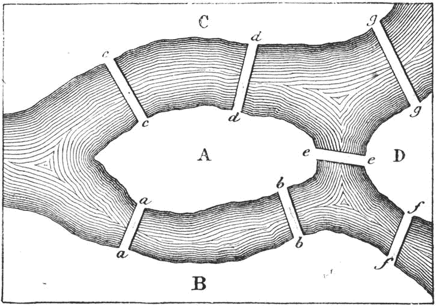
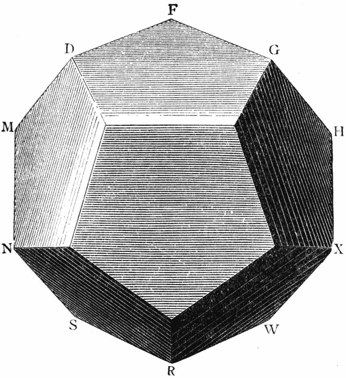
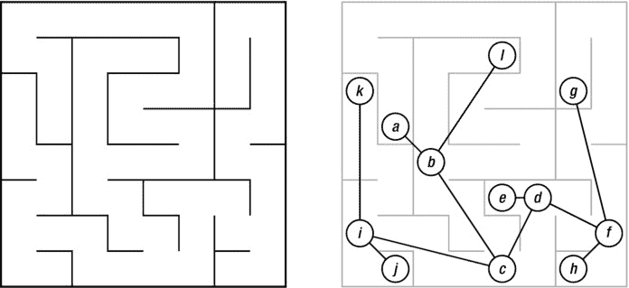
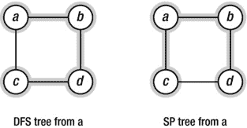
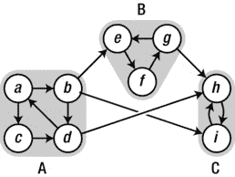

# 五、遍历：算法学的万能钥匙

你在一条狭窄的走廊里。这种情况持续了几米，在一个门口结束。沿着走廊走了一半，你可以看到一个拱门，那里有几级台阶向下延伸。你会走向门口(转到 5)，还是蹑手蹑脚地走下台阶(转到 344)？

—史蒂夫·杰克逊，*混乱的城堡*

一般来说，图形是一种强大的心理(和数学)结构模型；如果你能把一个问题表述成一个处理图形的问题，即使它看起来不像图形问题，你可能离解决它又近了一步。碰巧还有一个非常有用的思维模型用于图形*算法*——一个万能钥匙，如果你愿意的话。 [<sup>1</sup>](#Fn1) 该骨架关键是*遍历*:发现并随后访问图中的所有节点。这不仅仅是关于*明显的*图。例如，想想 GIMP 或 Adobe Photoshop 等绘画应用如何用单一颜色填充一个区域，即所谓的泛色填充。这是您在这里学到的知识的应用(见练习 5-4)。或者您想序列化一些复杂的数据结构，并需要确保检查其所有组成对象？这就是遍历。列出文件系统一部分中的所有文件和目录？管理软件包之间的依赖关系？更多遍历。

但是遍历不仅仅是直接有用；这是许多其他算法的关键组成部分和潜在原则，比如《??》第 9 章和《??》第 10 章中的算法。例如，在第 10 章的[中，我们将尝试将 *n* 人与 *n* 份工作相匹配，其中每个人的技能仅与部分工作相匹配。该算法的工作原理是，先暂时给人们分配工作，然后在需要其他人接替时再重新分配。这种重新分配然后可以触发*另一个*重新分配，可能导致级联。正如你将看到的，这种级联包括在人和工作之间来回移动，以一种之字形模式，从一个闲散的人开始，到一个可用的工作结束。这是怎么回事？你猜对了:遍历。](10.html)

我将从几个角度介绍这个想法，并在几个版本中，尽可能地将各个部分联系起来。这意味着涵盖了两个最著名的基本遍历策略， *深度优先搜索*和*广度优先搜索*，建立了一个稍微复杂一点的基于遍历的算法，用于查找所谓的强连通分量。

遍历是有用的，因为它让我们在一些基本归纳的基础上构建一个抽象层。考虑寻找一个图的连通分量的问题(见[图 5-1](#Fig1) 举例)。正如你在《??》第二章中所回忆的，一个图是连通的，如果从每个节点到其他每个节点都有一条路径，并且如果连通分量是(单独)连通的最大子图。寻找连通分量的一种方法是从图中的某个地方开始，逐渐增长到一个更大的连通子图，直到我们不能再前进为止。我们如何确定我们已经重建了一个完整的组件？


[图 5-1](#_Fig1) 。有三个连通分量的无向图

我们来看下面这个相关的问题。说明可以对连通图中的节点进行排序， *v* <sub xmlns:m="http://www.w3.org/1998/Math/MathML" xmlns:pls="http://www.w3.org/2005/01/pronunciation-lexicon" xmlns:ssml="http://www.w3.org/2001/10/synthesis">1</sub> ， *v* <sub xmlns:m="http://www.w3.org/1998/Math/MathML" xmlns:pls="http://www.w3.org/2005/01/pronunciation-lexicon" xmlns:ssml="http://www.w3.org/2001/10/synthesis">2</sub> ，。。。， *v* <sup xmlns:m="http://www.w3.org/1998/Math/MathML" xmlns:pls="http://www.w3.org/2005/01/pronunciation-lexicon" xmlns:ssml="http://www.w3.org/2001/10/synthesis">n</sup> ，这样对于任何一个 *i* = 1。。。 *n* ，超过*v*1 的子图。。。，*v*I 相连。如果我们可以展示这一点，并且我们可以弄清楚如何进行排序，我们就可以遍历一个连接组件中的所有节点，并知道它们何时用完。

我们如何做到这一点？归纳思考，我们需要从*I*–1 到 *i* 。我们知道在*I-*1 首节点上的子图是连通的。接下来呢？因为任何一对节点之间都有路径，所以考虑第一个*I-*1 节点中的节点 *u* 和其余节点中的节点 *v* 。在从 *u* 到 *v* 的路径上，考虑到目前为止我们已经构建的组件中的最后一个节点*，以及*之外的第一个节点*。让我们称它们为 *x* 和 *y* 。很明显，它们之间肯定有一条边，所以将 *y* 添加到我们不断增长的组件的节点中，可以保持它的连接，我们已经展示了我们想要展示的内容。*

我希望您能看到最终的过程实际上是多么简单。这只是添加连接到组件的节点的问题，我们通过跟踪一条边来发现这样的节点。有趣的一点是，只要我们继续以这种方式将新节点连接到我们的组件，我们就在构建一棵*树*。这棵树叫做*遍历树*，是我们正在遍历的组件的生成树。(当然，对于有向图，它只跨越我们可以到达的节点。)

为了实现这一过程，我们需要跟踪这些“边缘”或“前沿”节点，它们仅在一条边之外。如果我们从单个节点开始，边界将只是它的邻居。当我们开始探索时，新访问的节点的邻居将形成新的边缘，而我们现在访问的那些节点将落入其中。换句话说，我们需要将边缘作为某种集合来维护，在这里我们可以删除我们访问的节点并添加它们的邻居，除非它们已经在列表中或者我们已经访问过它们。它变成了我们想要访问但还没有抽出时间去做的节点列表。你可以认为我们*已经*访问过的那些已经被检查过了。

对于那些玩过像龙与地下城(Dungeons & Dragons)这样的老派角色扮演游戏的人来说，图 5-2 可能有助于澄清这些想法。它显示了一个典型的地牢地图。 [<sup>2</sup>](#Fn2) 把房间(和走廊)想象成节点，把它们之间的门想象成边。这里有一些多重边缘(门),但这真的不是问题。我还在地图上添加了一个“你在这里”的标记，以及一些指示你如何到达那里的轨迹。


[图 5-2](#_Fig2) 。一个典型角色扮演地牢的局部遍历。把房间想象成节点，把门想象成边缘。遍历树是由你的轨迹定义的；边缘(遍历队列)包括相邻的房间，没有足迹的浅色房间。剩余的(黑暗的)房间还没有被发现

请注意，有三种房间:你实际参观过的房间(有轨道穿过的房间)，你因为看到他们的门而知道的房间，以及你还不知道的房间(变暗的)。未知房间(当然)通过已知但未被访问的房间的边界与被访问的房间分开，就像在任何类型的遍历中一样。清单 5-1 给出了这个通用遍历策略的一个简单实现(注释指的是图而不是地牢)。 [<sup>3</sup>](#Fn3)

[***清单 5-1***](#_list1) 。遍历用邻接集表示的图的连通分量

```py
def walk(G, s, S=set()):                        # Walk the graph from node s
    P, Q = dict(), set()                        # Predecessors + "to do" queue
    P[s] = None                                 # s has no predecessor
    Q.add(s)                                    # We plan on starting with s
    while Q:                                    # Still nodes to visit
        u = Q.pop()                             # Pick one, arbitrarily
        for v in G[u].difference(P, S):         # New nodes?
            Q.add(v)                            # We plan to visit them!
            P[v] = u                            # Remember where we came from
    return P                                    # The traversal tree
```

 **提示`set`类型的**对象可以让你在其他类型上执行集合操作！例如，在[清单 5-1](#list1) 中，我在`difference`方法中使用字典`P`，就好像它是一个(它的键的)集合。这也适用于其他的可重复项，例如`list`或`deque`，以及其他的 set 方法，例如`update`。

关于这个新代码的一些事情可能不会立即显现出来。例如，`S`参数是什么，为什么我要使用字典来记录我们访问过的节点(而不是一个集合)？`S`参数现在并不那么有用，但是当我们试图找到*强*连接的组件时(接近本章末尾)，我们将需要它。基本上，它代表了一个“禁区”——一组我们在遍历过程中可能没有访问过但被告知要避开的节点。至于字典`P`，我用它来代表*前辈*。每次我们添加一个新的节点到队列中，我设置它的前任；也就是说，当我找到它的时候，我确定我记得我是从哪里来的。这些前辈将一起形成遍历树。如果您不关心树，您当然可以使用一组访问过的节点(我将在本章后面的一些实现中这样做)。

 **注意**无论是在将节点添加到队列的同时将它们添加到这种“已访问”集合中，还是稍后将它们从队列中弹出，通常都不重要。这确实会影响到你需要在哪里添加“如果被访问过…”不过，检查一下。在这一章中，你会看到通用遍历策略的几个版本。

`walk`函数将遍历单个连通分量(假设图是无向的)。为了找到*所有的*组件，你需要在节点上将它包装成一个循环，就像清单 5-2 中的[一样。](#list2)

[***清单 5-2***](#_list2) 。查找连接的组件

```py
def components(G):                              # The connected components
    comp = []
    seen = set()                                # Nodes we've already seen
    for u in G:                                 # Try every starting point
        if u in seen: continue                  # Seen? Ignore it
        C = walk(G, u)                          # Traverse component
        seen.update(C)                          # Add keys of C to seen
        comp.append(C)                          # Collect the components
    return comp
```

`walk`函数返回它访问过的节点的前任映射(遍历树),我在`comp`列表(连接组件)中收集这些。我使用`seen`集合来确保我不会从一个先前已经访问过的组件中的节点开始遍历。请注意，即使操作`seen.update(C)`在`C`的大小上是线性的，对`walk`的调用已经完成了同样多的工作，所以从渐近线来看，它不会花费我们任何东西。总而言之，像这样寻找组件是θ(*E*+*V*)因为每个边和节点都要探索。 [<sup>4</sup>](#Fn4)

`walk`函数实际上并没有做那么多。尽管如此，在许多方面，这段简单的代码是本章的主干，也是理解你将要学习的许多其他算法的万能钥匙。或许值得研究一下。试着在你选择的图上手动执行算法(例如[图 5-1](#Fig1) 中的那个)。你看到如何保证探索整个连接组件了吗？需要注意的是，节点从`Q.pop` *返回的顺序与*无关。无论如何，整个组件都将被探索。然而，这个顺序是定义行走行为的关键元素，通过调整它，我们可以得到一些现成的有用算法。

要遍历其他几个图形，参见[图 5-3](#Fig3) 和[图 5-4](#Fig4) 。(有关这些示例的更多信息，请参见附近的侧栏。)



[图 5-3](#_Fig3) 。1759 年，柯尼斯堡(今天的加里宁格勒)的桥梁。插图摘自《数学研究》第一卷(卢卡斯，1891 年，第 22 页)



[图 5-4](#_Fig4) 。一个十二面体， ，目标是追踪边，这样你就可以精确地访问每个顶点一次。该插图摘自《数学研究》第二卷(卢卡斯，1896 年，第 205 页)

**在加里宁格勒跳岛**

听说过柯尼斯堡七桥(现称加里宁格勒)？1736 年，瑞士数学家莱昂哈德·欧拉遇到了一个处理这些问题的难题，许多居民很长时间以来一直试图解决这个难题。问题是，你能从镇上的任何地方开始，穿过所有七座桥一次，然后回到你开始的地方吗？(你可以在[图 5-3](#Fig3) 中找到桥梁的布局。)为了解决这个难题，欧拉决定抽象出细节。。。发明了图论。似乎是个好的开始，不是吗？

正如你可能注意到的，图 5-3 中的河岸和岛屿的结构是一个多重图；比如 A 和 B 之间，A 和 c 之间有两条边，那其实并不影响问题。(我们可以很容易地在这些边的中间虚构一些岛来得到一个普通的图。)

欧拉最终证明了，当且仅当一个(多)图是连通的，并且每个节点都有偶数度时，访问该图的每条边恰好一次并到达起点是可能的。由此产生的*封闭行走*(粗略地说，可以不止一次访问节点的路径)被称为*欧拉游*，或者*欧拉回路*，这样的图就是*欧拉*。(你很容易看出柯尼斯堡不是欧拉；它的所有顶点都是奇数次。)

不难看出，连通性和偶数度节点是必要条件(不连通性显然是一个障碍，奇数度节点必然会在某个时候阻止你的旅程)。不太明显的是，它们是*充分*条件。我们可以用归纳法证明这一点(大惊喜，嗯？)，但是我们需要对我们的诱导参数小心一点。如果我们开始移除节点或边，简化的问题可能不再是欧拉问题，我们的归纳假设将不再适用。让我们不要担心连通性。如果简化的图是不连通的，我们可以将假设应用于每个连通的部分。但是偶数度呢？

我们被允许按我们想要的频率访问节点，所以我们将移除(或“用完”)的是一组边。如果我们从访问的每个节点中去掉偶数条边，我们的假设将适用。这样做的一种方法是删除一些封闭遍历的边(当然，不一定要访问所有节点)。问题是这样的封闭行走是否会一直存在于欧拉图中。如果我们只是从某个节点开始走， *u* ，我们进入的每一个节点都会从偶数度到奇数度，所以我们可以放心的再次离开它。只要我们从不两次访问一个边缘，我们最终会回到 *u* 。

现在，假设归纳假设是，任何具有偶数度节点且边少于 *E* 条的连通图都有一条包含每条边恰好一次的闭行走。我们从 *E* 边开始，去掉任意封闭行走的边。我们现在有一个或多个欧拉分量，每个分量都包含在我们的假设中。最后一步是在这些组件中组合欧拉旅行。我们的原始图是连通的，所以我们移除的封闭行走必然会连接组件。最终的解决方案由这种组合行走组成，每个组件都有一个“迂回”的欧拉游。

换句话说，决定一个图是否是欧拉的是很容易的，找到一个欧拉之旅也不是很难(见练习 5-2)。然而，欧拉之旅有一个更成问题的亲戚:汉密尔顿循环。

哈密尔顿循环是以爱尔兰数学家威廉·罗恩·汉密尔顿爵士的名字命名的(除了别的以外)，他提出它是一个游戏(称为*阿科斯游戏* )，目标是访问十二面体(一个 12 面的柏拉图立体，或 d12)的每个顶点正好一次，然后回到你的原点(见[图 5-4](#Fig4) )。更一般地说，哈密尔顿圈是包含整个图的所有节点的子图(恰好一次，因为它是真圈)。我相信你可以看到，柯尼希斯堡是哈密顿的(也就是说，它有一个哈密顿圈)。证明十二面体是哈密顿的有点难。事实上，在一般的图中寻找哈密尔顿路径是一个困难的问题——一个没有有效算法的问题(在第 11 章中有更多关于这个的内容)。考虑到问题是如此相似，这有点奇怪，你不觉得吗？

轻而易举的事

1887 年的深秋，一位法国电信工程师正在精心打理的花园迷宫中漫步，看着树叶开始变黄。当他走过迷宫的通道和十字路口时，他认出了一些绿色植物，并意识到他一直在转圈。作为一个有创造力的人，他开始思考如何避免这个错误，如何找到最好的出路。他记得小时候有人告诉他，如果他在每个十字路口都向左拐，他最终会找到出路，但他很容易看到这样一个简单的策略是行不通的。如果在他到达出口之前，他的左转把他带回到他开始的地方，他就被困在一个无限的循环中。不，他需要另想办法。当他最终摸索着走出迷宫时，他灵光一现。他冲回家拿起笔记本，准备开始勾画他的解决方案。

好吧，事实可能不是这样。我承认，这都是我编的，甚至是年份。[](#Fn5)*然而，19 世纪 80 年代末，一位名叫 Trémaux 的法国电信工程师发明了一种穿越迷宫的算法。我一会儿就会谈到这个问题，但首先让我们探索一下“继续左转”策略(也称为*左手法则*)，看看它是如何工作的，以及什么时候不工作。*

 *不允许循环

考虑图 5-5 中的迷宫。如你所见，其中没有循环；它的底层结构是一棵树，如右图所示。在这种情况下,“把一只手放在墙上”的策略会很有效。 [<sup>6</sup>](#Fn6) 了解其工作原理的一种方法是观察迷宫实际上只有一面内壁(或者，换句话说，如果你在里面放墙纸，你可以使用一个连续的长条)。看外面的方块。只要你不被允许创建循环，你画的任何障碍都必须在一个确切的地方连接到它，这不会给左手定则带来任何问题。按照这种遍历策略，您将发现所有节点，并对每个通道遍历两次(每个方向一次)。



[图 5-5](#_Fig5) 。一棵树，被画成一个迷宫和一个更传统的图表，叠加在迷宫上

左手规则被设计为由实际行走迷宫的个体执行，仅使用局部信息。为了牢牢把握到底发生了什么，我们可以放弃这种观点，递归地制定同样的策略*。 [<sup>7</sup>](#Fn7) 一旦你熟悉了递归思想，这样的公式可以更容易地看出一个算法是正确的，这是最简单的递归算法之一。对于一个基本的实现(假设树的一个标准图形表示)，见[清单 5-3](#list3) 。*

 *[***清单 5-3***](#_list3) 。递归树遍历

```py
def tree_walk(T, r):                            # Traverse T from root r
    for u in T[r]:                              # For each child. . .
        tree_walk(T, u)                         # ... traverse its subtree
```

就迷宫的比喻而言，如果你站在一个十字路口，你可以向左或向右走，你首先穿过迷宫向左的部分，然后是向右的部分。就这样。很明显(也许借助于一点归纳),这个策略将遍历整个迷宫。请注意，这里只明确描述了在每个通道中向前*行走*的动作。当你遍历以节点 *u* 为根的子树时，你向前走到 *u* 并从那里开始工作新的段落。最终还是要回归根本， *r* 。像这样回溯，越过你自己的轨迹，叫做*回溯* ，隐含在递归算法中。每次递归调用返回时，您会自动回溯到发起调用的节点。(你看到这个回溯行为是如何符合左手定则的吗？)

想象一下，有人在迷宫的一面墙上戳了一个洞，相应的图形突然有了一个循环。也许他们在节点 e 打破了死胡同北边的墙。如果你从 *e* 开始向北走，你可以一直向左走，但你永远不会穿过整个迷宫——你会一直绕圈子。 [<sup>8</sup>](#Fn8) 这是我们在遍历一般图时面临的问题。 [<sup>9</sup>](#Fn9) 清单 5-1 中的总体思路给了我们一个解决这个问题的方法，但是在我开始之前，让我们看看我们的法国电报工程师想出了什么。

如何停止兜圈子

douard Lucas 于 1891 年在他的*数学记录*的第一卷中描述了 Tremaux 穿越迷宫的算法。卢卡斯在他的介绍中写道: [<sup>10</sup>](#Fn10)

要从任何一个起点完整地穿过迷宫的所有通道两次，只需遵循 Trémaux 提出的规则，在每个十字路口的入口或出口做上标记。这些规则可以总结如下:尽可能避免经过你已经走过的十字路口，避免走你已经走过的通道。这难道不是一种同样适用于日常生活的谨慎做法吗？

在本书的后面，他继续更详细地描述了这个方法，但是它真的很简单，前面的引用很好地涵盖了主要思想。而不是标记每个入口或出口(比如说，用一支粉笔)，让我们只说你有泥泞的靴子，这样你就可以看到我们自己的足迹(就像在[图 5-2](#Fig2) 中)。然后，Trémaux 会告诉你开始朝任何方向走，每当你走到死胡同或你已经走过的十字路口时，就往回走(以避免循环)。你不能穿越一个通道超过两次(一次向前，一次向后)，所以如果你在*原路返回*到一个十字路口，你会向前走进一个未被探索的通道，如果有的话。如果没有*，你就继续原路返回(进入另一个只有一组脚印的通道)。 [<sup>11</sup>](#Fn11)*

这就是算法。一个有趣的观察是，尽管您可以选择几个段落进行*向前*遍历，但总是只有*一个*可用于回溯。你知道为什么吗？可能有两个*(或更多)的唯一方法是，如果你从一个十字路口向另一个方向出发，然后没有原路返回。不过，在这种情况下，规则规定你应该*而不是*进入十字路口，而是立即原路返回。(这也是为什么你永远不会在同一个方向上穿越两次的原因。)*

 *我在这里使用“泥泞的靴子”描述的原因是为了使回溯真正清晰；这与递归树遍历中的规则完全一样(同样，它相当于左手规则)。事实上，如果递归地表述，Trémaux 的算法就像树遍历一样，只是增加了一点内存。我们知道我们已经访问了哪些节点，并假装有一堵墙阻止我们进入它们，实际上模拟了一个树形结构(这就是我们的遍历树)。

参见[清单 5-4](#list4) 中 Trémaux 算法的递归版本。在这个公式中，俗称*深度优先搜索*，是最基本(也是最重要)的遍历算法之一。 [<sup>12</sup>](#Fn12)

[***清单 5-4***](#_list4) 。递归深度优先搜索

```py
def rec_dfs(G, s, S=None):
    if S is None: S = set()                     # Initialize the history
    S.add(s)                                    # We've visited s
    for u in G[s]:                              # Explore neighbors
        if u in S: continue                     # Already visited: Skip
        rec_dfs(G, u, S)                        # New: Explore recursively
```

 **注意**与[清单 5-1](#list1) 中的`walk`函数相反，在这里的循环中对`G[s]`使用`difference`方法是错误的，因为`S`在递归调用中可能会改变，你很容易多次访问一些节点。

深入！

深度优先搜索(DFS)从其递归结构中获得一些最重要的属性。一旦我们开始处理一个节点，我们就要确保在继续处理之前，遍历我们可以从它到达的所有其他节点。然而，正如在第四章中提到的，递归函数总是可以被重写为迭代函数，可能用我们自己的栈来模拟调用栈。DFS 的这种迭代公式可能是有用的，既可以避免填满调用堆栈，也可以使算法的某些属性更加清晰。幸运的是，为了模拟递归遍历，我们需要做的是在算法中使用一个堆栈而不是集合，就像清单 5-1 中的[中的`walk`。清单 5-5](#list1) 显示了这种迭代 DFS。

[***清单 5-5***](#_list5) 。迭代深度优先搜索

```py
def iter_dfs(G, s):
    S, Q = set(), []                            # Visited-set and queue
    Q.append(s)                                 # We plan on visiting s
    while Q:                                    # Planned nodes left?
        u = Q.pop()                             # Get one
        if u in S: continue                     # Already visited? Skip it
        S.add(u)                                # We've visited it now
        Q.extend(G[u])                          # Schedule all neighbors
        yield u                                 # Report u as visited
```

除了使用堆栈(一个*后进先出*，或者 LIFO 队列，在本例中使用`append`和`pop`由一个列表实现)，这里还有一些调整。例如，在我最初的`walk`函数中，队列是一个集合，,所以我们绝不会冒险让同一个节点被安排多次访问。一旦我们开始使用其他队列结构，情况就不一样了。我已经通过在添加它的邻居之前检查一个节点在`S`中的成员资格(也就是说，我们是否已经访问过该节点)解决了这个问题。

为了使遍历更加有用，我还添加了一个`yield`语句，它将允许您按照 DFS 顺序遍历图节点。例如，如果你在变量`G`中有来自[图 2-3](02.html#Fig3) 的图形，你可以尝试如下:

```py
>>> list(iter_dfs(G, 0))
[0, 5, 7, 6, 2, 3, 4, 1]
```

值得注意的一点是，我刚刚在一个*有向图*上运行了 DFS，而我只讨论了它如何在*无向图*上工作。实际上，DFS 和其他遍历算法对有向图同样有效。然而，如果你在一个有向图上使用 DFS，你不能期望它探索整个连通的部分。例如，对于图 2-3 中的[图，从 *a* 之外的任何其他开始节点遍历将意味着 *a* 永远不会被看到，因为它没有入边。](02.html#Fig3)

 **提示**要在一个有向图中找到连通的部分，第一步可以很容易地构建底层无向图。或者你可以简单地浏览图表并添加所有的反向边。这对其他算法也很有用。有时，你甚至可能不构建无向图；当使用有向图时，简单地考虑两个方向上的每个边就足够了。

你也可以用 Trémaux 的算法来思考这个问题。你仍然可以双向穿越每个(定向)通道，但是你只能沿着边缘方向向前*前进*，并且你必须逆着边缘方向返回*。*

事实上，`iter_dfs`函数的结构非常接近我们可能实现的一般遍历算法——其中只需要替换队列。让我们加强`walk`到更成熟的`traverse` ( [清单 5-6](#list6) )。

[***清单 5-6***](#_list6) 。一个通用的图遍历函数

```py
def traverse(G, s, qtype=set):
    S, Q = set(), qtype()
    Q.add(s)
    while Q:
        u = Q.pop()
        if u in S: continue
        S.add(u)
        for v in G[u]:
            Q.add(v)
        yield u
```

这里默认的队列类型是`set`，使其类似于原来的(任意)`walk`。您可以很容易地定义一个堆栈类型(使用我们通用队列协议的适当的`add`和`pop`方法)，可能如下所示:

```py
class stack(list):
    add = list.append
```

先前的深度优先测试可以重复如下:

```py
>>> list(traverse(G, 0, stack))
[0, 5, 7, 6, 2, 3, 4, 1]
```

当然，实现各种遍历算法的特殊用途版本也是很好的，即使它们可以用几乎相同的形式表达。

深度优先时间戳和拓扑排序(再次)

如前所述，记住并避免以前访问过的节点是防止我们绕圈子(或者更确切地说，循环)的原因，没有循环的遍历自然会形成一棵树。这种遍历树根据它们的构造方式有不同的名称；对于 DFS，它们被恰当地命名为*深度优先树*(或 DFS 树)。与任何遍历树一样，DFS 树的结构是由访问节点的顺序决定的。DFS 树特有的一点是，节点 *u* 的所有后代在从发现 *u* 到我们回溯它的时间间隔内被处理。

为了利用这个属性，我们需要知道算法何时回溯，这在迭代版本中可能有点困难。尽管你可以从[清单 5-5](#list5) 中扩展迭代 DFS 来跟踪回溯(见练习 5-7)，我将在这里扩展递归版本([清单 5-4](#list4) )。参见清单 5-7 中的[版本，该版本为每个节点添加了时间戳:一个用于它被发现的时间(发现时间，或`d`)，一个用于我们回溯它的时间(完成时间，或`f`)。](#list7)

[***清单 5-7***](#_list7) 。带时间戳的深度优先搜索

```py
def dfs(G, s, d, f, S=None, t=0):
    if S is None: S = set()                     # Initialize the history
    d[s] = t; t += 1                            # Set discover time
    S.add(s)                                    # We've visited s
    for u in G[s]:                              # Explore neighbors
        if u in S: continue                     # Already visited. Skip
        t = dfs(G, u, d, f, S, t)               # Recurse; update timestamp
    f[s] = t; t += 1                            # Set finish time
    return t                                    # Return timestamp
```

参数`d`和`f`应该是映射(例如字典)。DFS 属性然后声明:( 1)每个节点在 DFS 树中其后代的之前*被发现，并且(2)每个节点在 DFS 中其后代的*之后*结束。这直接来自算法的递归公式，但是你可以很容易地做一个归纳证明来说服自己这是真的。*

这个性质的一个直接结果是，我们可以使用 DFS 进行拓扑排序，这已经在第 4 章中讨论过了。如果我们在 DAG 上执行 DFS，我们可以简单地根据它们的完成时间降序排列节点，并且它们将被拓扑排序。然后，每个节点 *u* 将在 DFS 树中其所有后代之前，这些后代将是从 *u* 可到达的任何节点，即依赖于 *u* 的节点。在这种情况下，了解算法如何工作是有好处的。我们可以简单地在定制 DFS 的过程中执行拓扑排序*，而不是首先调用我们的时间戳 DFS，在回溯时追加节点，如[清单 5-8](#list8) 所示。 [<sup>13</sup>](#Fn13)*

[***清单 5-8***](#_list8) 。基于深度优先搜索的拓扑排序

```py
def dfs_topsort(G):
    S, res = set(), []                          # History and result
    def recurse(u):                             # Traversal subroutine
        if u in S: return                       # Ignore visited nodes
        S.add(u)                                # Otherwise: Add to history
        for v in G[u]:
            recurse(v)                          # Recurse through neighbors
        res.append(u)                           # Finished with u: Append it
    for u in G:
        recurse(u)                              # Cover entire graph
    res.reverse()                               # It's all backward so far
    return res
```

在这个新的拓扑排序算法中，有几件事情值得注意。首先，我显式地在所有节点上包含了一个`for`循环，以确保遍历了整个图。(练习 5-8 要求你证明这是可行的。)检查一个节点是否已经在历史集合中(`S`)现在正好放在`recurse`中，所以我们不需要把它放在两个`for`循环中。另外，因为`recurse`是一个内部函数，可以访问周围的作用域(特别是`S`和`res`)，所以唯一需要的参数是我们要遍历的节点。最后，记住我们希望节点根据它们的完成时间以*反向*排序。这就是为什么`res`列表在返回之前是反转的。

这个 topsort 在回溯每个节点时对它们执行一些处理(它将它们附加到结果列表中)。DFS 在节点上回溯的顺序(也就是它们结束时间的顺序)被称为*后序*，而它首先访问它们的顺序被称为*前序*。这些时候的加工被称为*前序*或*后序*加工。(练习 5-9 要求你在 DFS 中为这种处理添加通用钩子。)

**节点颜色和边缘类型**

在描述遍历时，我区分了三种节点:我们不知道的节点、我们队列中的节点和我们已经访问过的节点(其邻居现在在队列中)。有些书(如[第一章](01.html)中提到的 Cormen 等人的*算法简介*)介绍了一种节点着色的形式，这在 DFS 中尤为重要。每个节点一开始都被认为是白色的；它们在发现时间和结束时间之间是灰色的，之后是黑色的。为了*实现* DFS，你并不真的需要这种分类，但是这对于理解它是有用的(或者，至少，如果你要阅读使用颜色的文本，了解它是有用的)。

根据 Trémaux 的算法，灰色交叉点是我们已经看到但已经避开的；黑色的十字路口是我们被迫第二次进入的路口(在原路返回时)。

这些颜色也可以用来对 DFS 树中的边进行分类。如果一条边 *uv* 被探索并且节点 *v* 是白色的，那么这条边就是一条*树边*——也就是说，它是遍历树的一部分。如果 *v* 是灰色的，那就是所谓的*后沿*，它可以追溯到 DFS 树中的一个祖先。最后，如果 *v* 为黑色，则边缘为所谓的*前边缘*或*横边缘*。前向边是遍历树中到后代的边，而交叉边是任何其他边(即，不是树、后向边或前向边)。

请注意，您可以在不使用任何显式颜色标签的情况下对边进行分类。假设一个节点的时间跨度是从它的发现时间到它的结束时间的间隔。后代的时间跨度将包含在其祖先的时间跨度中，而与祖先无关的节点将具有不重叠的时间间隔。因此，您可以使用时间戳来判断某个东西是后沿还是前沿。即使使用颜色标签，您也需要参考时间戳来区分前向边缘和交叉边缘。

你可能不太需要这个分类，尽管它有一个重要的用途。如果你找到了一个后沿，这个图就包含了一个循环，如果你没有找到，它就没有。(练习 5-10 要求你展示这个。)换句话说，您可以使用 DFS 来检查一个图是否是 DAG(或者，对于无向图，是树)。练习 5-11 要求你考虑其他的遍历算法如何实现这个目的。

无限迷宫和最短(未加权)路径

到目前为止，DFS 过于急切的行为还不是问题。我们让它在迷宫(图)中自由活动，在它开始原路返回之前，它尽可能向某个方向偏离。但是，如果迷宫非常大，这可能会有问题。也许我们在寻找的东西，比如一个出口，就在我们出发的地方附近；如果 DFS 向不同的方向出发，它可能在*年*内不会返回。如果迷宫是无限的，它将*永远不会*回来，即使不同的遍历可能在几分钟内找到出口。无限迷宫听起来可能有些牵强，但它们实际上非常类似于一种重要的遍历问题——在状态空间中寻找解决方案。

但是，像 DFS 一样，由于过于急切而迷失方向，不仅仅是大型图表中的问题。如果我们寻找从我们的开始节点到所有其他节点的最短路径*(暂时不考虑边权重)，DFS 很可能会给我们错误的答案。看看图 5-6 中[的例子。所发生的是，DFS，在它的渴望中，继续前进，直到通过一个*弯路*到达 *c* ，可以这么说。如果我们想要找到到所有其他节点的最短路径(如右图所示)，我们需要更加保守。为了避免走弯路并“从后面”到达一个节点，我们需要一次一步地推进我们的遍历“边缘”。首先访问一步之外的所有节点，然后访问两步之外的所有节点，依此类推。](#Fig6)*

 *

[图 5-6](#_Fig6) 。大小为四的循环的两次遍历。深度优先树(左侧突出显示)不一定包含最小路径，这与最短路径树(右侧突出显示)相反

为了与迷宫隐喻保持一致，让我们简单地看一下另一种迷宫探索算法，它是由 ystein(又名 Oystein) Ore 在 1959 年描述的。就像 Trémaux 一样，Ore 要求您在通道入口和出口处做标记。假设你从十字路口 *a* 开始。首先，你访问一个通道之外的所有十字路口，每次都返回到你的起点。如果你跟踪的任何一个通道都是死胡同，一旦你返回，你就把它们标记为关闭。任何带你去你已经去过的十字路口的通道也被标记为关闭(在两端)。

在这一点上，你想要开始探索两个步骤(也就是通道)之外的所有交叉点*。标记并浏览来自 *a* 的开放通道之一；它现在应该有两个标记。假设你最终到达十字路口 *b* 。现在，遍历(并标记)从 *b* 开始的所有开放通道，如果它们通向你已经看到的死胡同或交叉路口，确保关闭它们。完成后，返回到 *a* 。一旦你回到 *a* ，你就继续其他开放段落的过程，直到它们都得了两个分数。(这两个标记意味着你已经在通道中两步之外穿过了十字路口。)*

让我们跳到第*步第*步。 [<sup>14</sup>](#Fn14) 您已经访问了所有距离*n–1 步远的十字路口，所以从 *a* 开始的所有开放通道现在都有*n*1 标记。在 *a* 旁边的任何路口的开放通道，比如你之前去过的 *b* ，上面都会有*n—*2 的标记，以此类推。要访问距离您的起点 *n* 的所有路口，您只需移动到 *a* 的所有邻居(例如 *b* )，在这样做的同时向通道添加标记，并按照相同的程序访问距离它们*n*–1 的所有路口(根据归纳假设，这将有效)。*

同样，像这样只使用本地信息可能会使簿记有点乏味(并且解释有点混乱)。然而，就像 Trémaux 的算法在递归 DFS 中有一个非常接近的亲戚一样，Ore 的方法可以用一种可能更适合我们计算机科学大脑的方式来表述。结果是所谓的*迭代深化深度优先搜索*，或 IDDFS 、 [<sup>15</sup>](#Fn15) ，它简单地包括运行具有迭代递增深度限制的深度约束 DFS。

清单 5-9 给出了一个相当简单的 IDDFS 实现。它保存了一个名为`yielded`的全局集合，由第一次发现并因此产生的节点组成。内部函数`recurse`基本上是一个具有深度限制的递归 DFS`d`。如果限制为零，则不会递归地探索更多的边。否则，递归调用会受到限制`d-1`。`iddfs`函数中的主`for`循环遍历从 0(只访问并产生开始节点)到`len(G)-1`(最大可能深度)的每个深度限制。但是，如果在达到这样的深度之前已经发现了所有节点，那么循环就中断了。

[***清单 5-9***](#_list9) 。迭代深化深度优先搜索

```py
def iddfs(G, s):
    yielded = set()                             # Visited for the first time
    def recurse(G, s, d, S=None):               # Depth-limited DFS
        if s not in yielded:
            yield s
            yielded.add(s)
        if d == 0: return                       # Max depth zero: Backtrack
        if S is None: S = set()
        S.add(s)
        for u in G[s]:
            if u in S: continue
            for v in recurse(G, u, d-1, S):     # Recurse with depth-1
                yield v
    n = len(G)
    for d in range(n):                          # Try all depths 0..V-1
        if len(yielded) == n: break             # All nodes seen?
        for u in recurse(G, s, d):
            yield u
```

 **注意**如果我们在探索一个无界图(比如一个无限状态空间)，寻找一个特定的节点(或者一种节点)，我们可能只是不断尝试更大的深度限制，直到找到我们想要的节点。

IDDFS 的运行时间并不完全清楚。与 DFS 不同，它通常会多次遍历许多边和节点，因此线性运行时间远远不能保证。比如你的图是一条路径，你从一端开始 IDDFS，运行时间将是*二次*。然而，这个例子是相当病态的；如果遍历树向外分支一点，它的大部分节点将在底层(就像在[第 3 章](03.html)的淘汰赛中一样)，所以对于许多图来说，运行时间将是线性的或接近线性的。

试着在一个简单的图上运行`iddfs`,您将看到节点将从离开始节点最近到最远的顺序产生。返回所有距离为 *k* 的，然后返回所有距离为 *k* + 1 的，以此类推。如果我们想要找到实际的距离，我们可以很容易地在`iddfs`函数中执行一些额外的簿记，并产生距离和节点。另一种方法是维护一个距离表(类似于我们前面使用的 DFS 的发现和完成时间)。事实上，我们可以有一个距离字典和一个遍历树中的父字典。这样，我们可以检索实际的最短路径，以及距离。现在让我们专注于路径，而不是修改`iddfs`来包含额外的信息，我们将把它构建到*另一个*遍历算法 : *广度优先搜索* (BFS) 。

事实上，使用 BFS 进行遍历比使用 IDDFS 要容易得多。您只需使用带有*先进先出*队列的通用遍历框架([清单 5-6](#list6) )。 事实上，这是与 DFS 唯一显著的区别:我们用 FIFO 代替了 LIFO(见[清单 5-10](#list10) )。结果是，较早发现的节点将被较早地访问，我们将一层一层地探索图，就像在 IDDFS 中一样。不过，这样做的好处是，我们不需要多次访问任何节点或边，所以我们回到了有保证的线性性能。 [<sup>16</sup>](#Fn16)

[***清单 5-10***](#_list10) 。广度优先搜索

```py
def bfs(G, s):
    P, Q = {s: None}, deque([s])                # Parents and FIFO queue
    while Q:
        u = Q.popleft()                         # Constant-time for deque
        for v in G[u]:
            if v in P: continue                 # Already has parent
            P[v] = u                            # Reached from u: u is parent
            Q.append(v)
    return P
```

如你所见，`bfs`函数类似于`iter_dfs`，来自[清单 5-5](#list5) 。我用一个 deque 替换了这个列表，我跟踪遍历树中哪些节点已经接收了一个父节点(也就是说，它们在`P`中)，而不是记住我们访问过哪些节点(`S`)。要提取到节点`u`的路径，您可以简单地在`P`中“向后走”:

```py
>>> path = [u]
>>> while P[u] is not None:
...     path.append(P[u])
...     u = P[u]
...
>>> path.reverse()
```

当然，您也可以在 DFS 中自由使用这种父字典，或者使用`yield`来迭代 BFS 中的节点。练习 5-13 要求你修改代码来寻找距离(而不是路径)。

 **提示**将 BFS 和 DFS 形象化的一种方式是浏览网页。如果你一直跟随链接，然后在完成一个页面后使用后退按钮，你就会得到 DFS。回溯有点像“撤销”BFS 更像是在一个新窗口(或标签页)中打开你已经打开的链接，然后在你完成每一页后关闭窗口。

实际上，只有一种情况下 IDDFS 比 BFS 更好:当搜索一棵大树(或者一些“形状”像树的状态空间)时。因为没有循环，所以我们不需要记住我们访问过哪些节点，这意味着 IDDFS 只需要存储返回起始节点的路径。 [<sup>17</sup> 换句话说，在这些情况下，IDDFS 可以节省大量内存，几乎没有或根本没有渐进减速。](#Fn17)

**黑盒:DEQUE**

正如已经几次简要提到的，Python 列表产生了很好的堆栈(LIFO 队列),但是很差(FIFO 队列)。附加到它们需要恒定的时间(至少在许多这样的附加平均时)，但是从前面弹出(或插入)需要线性时间。对于 BFS 这样的算法，我们想要的是一个*双端队列*、或*双端队列*。这样的队列通常被实现为链表(其中追加/前置和两端的弹出是常数时间操作)，或者所谓的循环缓冲区— 数组，其中我们跟踪第一个元素(头部)和最后一个元素(尾部)的位置。如果头部或尾部移动超出了数组的末端，我们就让它“绕”到另一边，我们使用 mod ( `%`)操作符来计算实际的索引(因此有了术语*循环*)。如果我们完全填满数组，我们可以将内容重新分配到一个更大的数组，就像动态数组一样(参见第 2 章中`list`的“黑盒”侧栏)。

幸运的是，Python 在标准库中的`collections`模块中有一个 deque 类。除了在*右*侧执行的`append`、`extend`、`pop`等方法外，还有*左*等效，称为`appendleft`、`extendleft`、`popleft`。在内部，deque 被实现为一个由*块*组成的双向链表，每个块都是一个单独元素的数组。虽然在渐近上等同于使用单个元素的链表，但这减少了开销，并使其在实践中更有效。例如，如果表达式`d[k]`是一个普通的列表，那么它需要遍历队列`d`的第一个`k`元素。如果每个块都包含`b`元素，那么你只需要遍历`k//b`块。

强连通分量

虽然像 DFS、IDDFS 和 BFS 这样的遍历算法本身就很有用，但是我在前面提到过遍历作为底层结构在其他算法中的作用。您将在接下来的许多章节中看到这一点，但是我将用一个经典的例子来结束这一章——这是一个相当棘手的问题，只要对基本遍历有所了解就可以很好地解决。

问题是找到*强连通分量* (SCCs) ，有时简称为*强分量*。SCC 是连接组件的直接模拟，我在本章开始时向您展示了如何找到它。连通分量是一个极大子图，其中如果忽略边方向(或者如果图是无向的)，所有节点都可以到达彼此。然而，为了得到*强*连接的组件，你需要遵循边的方向；因此，SCCs 是从任意节点到任意其他节点有向路径的极大子图。例如，在现代优化编译器中，寻找 SCC 和类似结构是数据流分析的重要部分。

考虑图 5-7 中的图表。和我们开始用的那个([图 5-1](#Fig1) )挺像的；虽然有一些额外的边，这个新图形的 SCCs 由与无向原始图形的连接组件相同的节点组成。正如您所看到的，在(突出显示的)强组件中，任何节点都可以到达任何其他节点，但是如果您尝试向其中任何节点添加其他节点，该属性就会失效。



[图 5-7](#_Fig7) 。有三个 SCC(突出显示)的有向图:A、B 和 C

想象一下在这个图上执行 DFS(可能从几个起点开始遍历，以确保覆盖整个图)。现在考虑强组件 A 和 B 中节点的完成时间。如您所见，从 A 到 B 有一条边，但没有办法从 B 到 A。这对完成时间有影响。你可以确定 A 会晚于 b 完成，也就是说 A 中的最后完成时间会晚于 b 中的最后完成时间，看看[图 5-7](#Fig7) ，应该很明显为什么会这样。如果你从 B 开始，你永远不能进入 A，所以 B 会在你甚至*开始*(更不用说*完成*)遍历 A 之前完全结束。然而，如果你从 A 开始，你知道你永远不会卡在那里(每个节点都可以到达其他节点)，所以在完成遍历之前，你*将*最终迁移到 B，你必须在回溯到 A 之前完全完成那个(在这种情况下，还有 C)

事实上，一般来说，如果从任意一个强分量 X 到另一个强分量 Y 有一条边，那么 X 中的最后完成时间将晚于 Y 中的最晚完成时间，其推理与我们的例子相同(参见练习 5-16)。我的结论是基于这样一个事实，即你不能从 B 到达 A——事实上，这是 SCC 通常的工作方式，因为 SCC 形成了 DAG！因此，如果从 X 到 Y 有一条边，那么从 Y 到 X 就不会有任何路径。

考虑图 5-7 中[突出显示的组件。如果您将它们收缩为单个“超级节点”(将边保留在原来有边的地方)，您最终会得到一个图，我们称之为 SCC 图，如下所示:](#Fig7)


这显然是一个 DAG，但是为什么这样的 SCC 图*总是*是非循环的呢？假设 SCC 图中有一个循环。这意味着你可以从一个 SCC 到另一个 SCC，然后再回来。你觉得有问题吗？是的，完全正确:第一个 SCC 中的每个节点都可以到达第二个 SCC 中的每个节点，反之亦然；事实上，这样一个周期中的所有 SCC 将组合成一个*单个 SCC* ，这与我们最初认为它们是独立的假设相矛盾。

现在，假设你翻转了图中的所有边。这不会影响 SCC 中哪些节点属于同一个节点(见练习 5-15)，但它*会*影响 SCC 图。在我们的例子中，你不能再走出 A，如果你穿越了 A，在 B 开始了新一轮，你不能从中逃脱，只剩下 c 和...等一下...我只是在那里找到了强组件，不是吗？为了在一般情况下应用这个想法，我们总是需要在原始图中没有任何入边的 SCC 中开始(也就是说，在翻转后没有出边)。基本上，我们在 SCC 图的拓扑排序中寻找第一个 SCC。(然后我们会继续第二个，以此类推。)回顾我们最初的 DFS 推理，如果我们从具有*最晚完成时间*的节点开始遍历，那就是我们要去的地方。事实上，如果我们通过减少结束时间来选择最终遍历的起点，我们就能保证一次完全探索一个 SCC，因为反向边会阻止我们移动到下一个 SCC。

这种推理可能有点难以理解，但主要思想并不难理解。如果从 A 到 B 有一条边，A 将比 B 有更晚的(最终)完成时间。如果我们根据减少的完成时间选择(第二次)遍历的起点，这意味着我们将在 B 之前访问 A。现在，如果我们*反转*所有的边，我们仍然可以探索整个 A，但我们不能继续到 B，这使我们一次只能探索一个 SCC。

下面是算法的概要。请注意，我没有“手动”使用 DFS 并按照完成时间对节点进行反向排序，而是简单地使用了`dfs_topsort`函数，为我完成了这项工作。 [<sup>18</sup>](#Fn18)

1.  在图上运行`dfs_topsort`，产生一个序列`seq`。
2.  反转所有边缘。
3.  运行一次完整的遍历，从`seq`开始选择起点(按顺序)。

关于这一点的实现，见清单 5-11 。

[***清单 5-11***](#_list11) 。寻找强连通分量的 Kosaraju 算法

```py
def tr(G):                                      # Transpose (rev. edges of) G
    GT = {}
    for u in G: GT[u] = set()                   # Get all the nodes in there
    for u in G:
        for v in G[u]:
            GT[v].add(u)                        # Add all reverse edges
    return GT

def scc(G):
    GT = tr(G)                                  # Get the transposed graph
    sccs, seen = [], set()
    for u in dfs_topsort(G):                    # DFS starting points
        if u in seen: continue                  # Ignore covered nodes
        C = walk(GT, u, seen)                   # Don't go "backward" (seen)
        seen.update(C)                          # We've now seen C
        sccs.append(C)                          # Another SCC found
    return sccs
```

如果你试着在[图 5-7](#Fig7) 中的图上运行`scc`，你应该得到三组{ *a* 、 *b* 、 *c* 、*d*}；{ *e* ， *f* ，*g*}；还有{ *i* ， *h* }。 [<sup>19</sup>](#Fn19) 注意，在调用`walk`时，我现在已经提供了`S`参数，使其避开*之前的* SCCs。因为所有的边都指向后面，所以除非明确禁止，否则很容易开始遍历这些边。

然而，这是行不通的(如练习 5-17 所要求的)。

**目标和修剪**

本章讨论的遍历算法将访问它们能到达的每一个节点。然而，有时您正在寻找一个特定的节点(或一种节点)，并且您希望尽可能忽略图中的大部分内容。这种搜索称为*目标导向的*、和，忽略遍历的潜在子树的行为称为*修剪*。例如，如果您知道您正在寻找的节点在起始节点的 *k* 步内，那么运行深度限制为 *k* 的遍历将是一种修剪形式。二分法搜索或在搜索树中搜索(在第 6 章的[中讨论)也涉及修剪。您不必遍历整个搜索树，只需访问可能包含您要查找的值的子树。树的构造使得你通常可以在每一步丢弃大多数子树，从而产生高效的算法。](06.html)

知道你要去哪里也可以让你先选择最有希望的方向(所谓的*最佳优先搜索*)。 这是 A*算法的一个例子，在[第 9 章](09.html)中讨论过。如果你正在搜索一个可能解决方案的空间，你也可以评估一个给定方向的*前景*(也就是说，我们沿着这条边能找到多好的最佳解决方案？).通过忽略那些不会帮助你提高到目前为止发现的最好水平的边缘，你可以大大加快速度。这种方法称为*分支和绑定* ，在第 11 章的[中讨论。](11.html)

摘要

在这一章中，我已经向你展示了在图中移动的基本原理，不管它们是否有方向。这种遍历的思想直接或从概念上构成了本书后面将要学习的许多算法以及后面可能会遇到的其他算法的基础。我使用了迷宫遍历算法的例子(比如 Trémaux 和 Ore ),尽管它们主要是作为更计算机友好的方法的起点。遍历一个图的一般过程包括维护一个您已经发现的节点的概念性待办事项列表(一个队列),在这里您可以检查那些您实际访问过的节点。列表最初只包含开始节点，在每一步中，您访问(并检查)其中一个节点，同时将它的邻居添加到列表中。列表中项目的排序(时间表)在很大程度上决定了你正在进行的遍历类型:例如，使用 LIFO 队列(堆栈)进行深度优先搜索(DFS)，而使用 FIFO 队列进行广度优先搜索(BFS)。DFS 相当于一种相对直接的递归遍历，它允许您找到每个节点的发现和完成时间，后代节点的发现和完成时间间隔将在祖先节点的发现和完成时间间隔之内。BFS 有一个有用的特性，可以用来寻找从一个节点到另一个节点的最短(未加权)路径。DFS 的一个变种，叫做*迭代深化 DFS* ，也有这个属性，但是它对于在大树中搜索更有用，比如在[第 11 章](11.html)中讨论的状态空间。

如果一个图由几个相连的部分组成，你需要为每个部分重新开始一次遍历。为此，您可以遍历所有节点，跳过已经访问过的节点，然后从其他节点开始遍历。在有向图中，这种方法可能是必要的，即使图是连通的，因为边方向可能会阻止您到达所有节点。为了找到一个有向图的*强*连通部分——图中所有节点可以互相到达的部分——需要一个稍微复杂一点的过程。这里讨论的算法，Kosaraju 的算法，首先找到所有节点的完成时间，然后在*转置*图(所有边都反转的图)中运行遍历，使用递减的完成时间来选择起始点。

如果你好奇的话...

如果你喜欢遍历，不用担心。我们很快会做更多这样的事情。你也可以找到关于 DFS、BFS 和 SCC 算法的细节，例如，在 Cormen 等人的书中讨论的(见“参考文献”，第 1 章)。如果你对寻找强分量感兴趣，在本章的“参考”部分有关于 Tarjan 和 Gabow(或者更确切地说，Cheriyan-Mehlhorn/Gabow)算法的参考。

练习

5-1.在[清单 5-2](#list2) 中的`components`函数中，一次用整个组件更新可见节点集。另一种选择是在`walk`中逐个添加节点。那会有什么不同(或者，也许，没有那么不同)？

5-2.如果你面对一个图，其中每个节点的度数都是偶数，你会如何寻找欧拉之旅？

5-3.如果有向图中的每个节点都有相同的入度和出度，你可以找到一个*有向*欧拉之旅。为什么会这样？你会怎么做，这和 Trémaux 的算法有什么关系？

5-4.图像处理中的一个基本操作是所谓的*泛色填充*，其中图像中的一个区域用单一颜色填充。在绘画应用(如 GIMP 或 Adobe Photoshop)中，这通常是通过油漆桶工具来完成的。你如何实现这种填充？

5-5.在希腊神话中，当阿里阿德涅帮助忒修斯战胜牛头怪并逃离迷宫时，她给了他一团羊毛线，让他可以重新找到出路。但是，如果忒修斯在进来的时候忘记系好外面的线，并且只有在彻底迷路的时候才想起那个球，那该怎么办呢？

5-6.在递归 DFS 中，当您从一个递归调用返回时，会发生回溯。但是在迭代版本中回溯去了哪里？

5-7.写一个 DFS 的非递归版本，它可以决定完成时间。

5-8.在`dfs_topsort` ( [清单 5-8](#list8) )中，递归 DFS 从每个节点开始(尽管如果节点已经被访问过，它会立即终止)。即使起始节点的顺序完全是任意的，我们如何确定我们将得到一个有效的拓扑排序？

5-9.编写一个 DFS 版本，其中有钩子(可重写函数),允许用户按照前后顺序执行定制处理。

5-10.证明当(且仅当)DFS 找不到后边缘时，被遍历的图是非循环的。

5-11.如果你想使用除 DFS 之外的其他遍历算法在有向图中寻找环，你会面临什么挑战？为什么不用无向图面对这些挑战？

5-12.如果您在无向图中运行 DFS，您将不会有任何前向或交叉边。为什么会这样？

5-13.编写一个 BFS 版本，找出从起始节点到其他每个节点的距离，而不是实际路径。

5-14.正如在第四章中提到的，如果你能把节点分成两个集合，使得没有邻居在同一个集合中，那么这个图就叫做*二部图*。另一种思考方式是将每个节点涂成黑色或白色(例如),这样相邻节点就不会有相同的颜色。展示对于任何无向图，如果存在这样的二分图(或双色图),你将如何找到它。

5-15.如果你反转一个有向图的所有边，强连通分量保持不变。这是为什么呢？

5-16.设 X 和 Y 是同一个图的两个强连通分量， *G* 。假设从 X 到 y 至少有一条边，如果在 *G* 上运行 DFS(根据需要重新启动，直到所有节点都被访问过)，那么 X 中最晚的结束时间将总是晚于 y 中最晚的，这是为什么呢？

5-17.在 Kosaraju 的算法中，我们通过从初始 DFS 开始递减完成时间来找到最终遍历的开始节点，并且我们在转置图中执行遍历(即，所有边都反转)。为什么我们不能只使用*原始*图中的*上升*完成时间？

参考

Cheriyan，j .和 Mehlhorn，K. (1996 年)。随机存取计算机上的稠密图和网络算法。 *Algorithmica* ，15(6):521-549。

利特伍德高等教育学院(1949 年)。*数学的万能钥匙:复杂代数理论的简单叙述*。哈钦森&有限公司。

卢卡斯，是的。(1891 年)。*数学娱乐*第 1 卷，第二版。gau thier-villers 和 son，打印机-图书管理员。`http://archive.org`线上可用。

卢卡斯，是的。(1896 年)。*数学娱乐*第 2 卷，第二版。gau thier-villers 和 son，打印机-图书管理员。`http://archive.org`线上可用。

俄勒冈州，1959 年。迷宫之旅。*数学老师*，52:367-370。

塔尔詹河(1972 年)。深度优先搜索和线性图算法。 *SIAM 计算学报*，1(2): 146-160。

__________________

[<sup>1</sup>](#_Fn1) 我从达德利·欧内斯特·利特伍德的*数学万能钥匙*中“偷”出了这一章的副标题。

如果你不是游戏玩家，请随意把这里想象成你的办公大楼、梦想家园或任何你喜欢的地方。

[<sup>3</sup>](#_Fn3) 我将在下面使用带有邻接集的字典作为默认表示，尽管许多算法也可以很好地与第二章中的其他表示一起工作。通常，重写一个算法来使用不同的表示也不会太难。

[<sup>4</sup>](#_Fn4) 这是本章所有遍历算法的运行时间，除了(有时)IDDFS。

[<sup>5</sup>](#_Fn5) 嘿，连牛顿和苹果的故事都是杜撰的。

[<sup>6</sup>](#_Fn6) 从 *a* 开始追溯你的行程，你应该以节点顺序 *a* 、 *b* 、 *c* 、 *d* 、 *e* 、 *f* 、 *g* 、 *h* 、 *d* 、 *c* 结束 *c* ， *b* ， *l* ， *b* ， *a* 。

当然，如果你真的面对现实生活中的迷宫，这个递归版本会更难使用。

就这样，一个洞穴探险者可以变成洞穴人。

[<sup>9</sup>](#_Fn9) 人们在野外漫步时似乎也最终会绕圈子。美国陆军的研究表明，出于某种原因，人们更喜欢去南方(只要他们有自己的方向)。当然，如果您的目标是完全遍历，这两种策略都不是特别有用。

[<sup>10</sup>](#_Fn10) 我的翻译。

即使你的靴子没有沾上泥，你也可以进行同样的程序。只要确保清楚地标记入口和出口(比如用粉笔)。在这种情况下，当你来到一个旧的十字路口时，做两个标记并立即开始原路返回是很重要的。

[<sup>12</sup>](#_Fn12) 事实上，在某些上下文中，术语*回溯*被用作递归遍历，或者深度优先搜索的同义词。

[<sup>13</sup>](#_Fn13)`dfs_topsort`函数也可用于通过减少完成时间来对*一般*图的节点进行排序，这在寻找强连通组件时是需要的，这将在本章稍后讨论。

[<sup>14</sup>](#_Fn14) 换句话说，让我们进行归纳思考。

[<sup>15</sup> 添加那种标记当然是可能的，并且是一种*修剪*的形式，这将在本章后面讨论。](#_Fn15)

另一方面，我们将从一个节点跳到另一个节点，这在现实生活的迷宫中是不可能实现的。

[<sup>17</sup>](#_Fn17) 要想有任何内存储蓄，你就得去掉`S`设置。因为您将遍历一棵树，这不会引起任何麻烦(即遍历循环)。

[<sup>18</sup>](#_Fn18) 这看起来像是作弊，因为我在非 DAG 上使用拓扑排序。这个想法只是通过减少完成时间来对节点进行排序，这正是`dfs_topsort`在线性时间中所做的。

[<sup>19</sup>](#_Fn19) 其实，`walk`会为每个强分量返回一个遍历树。****