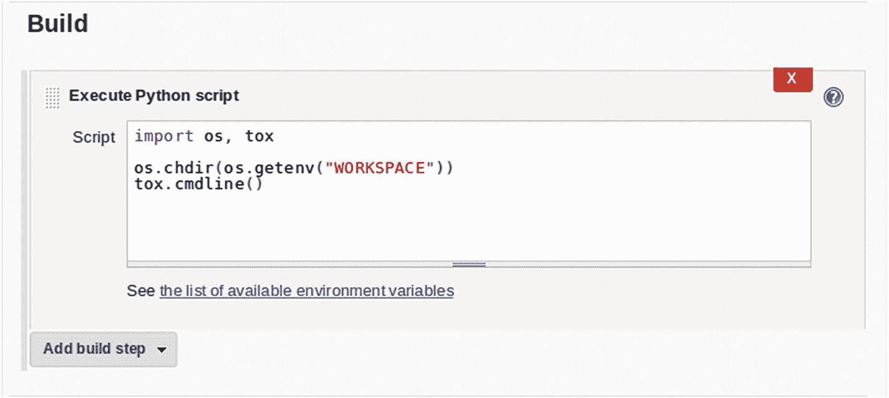
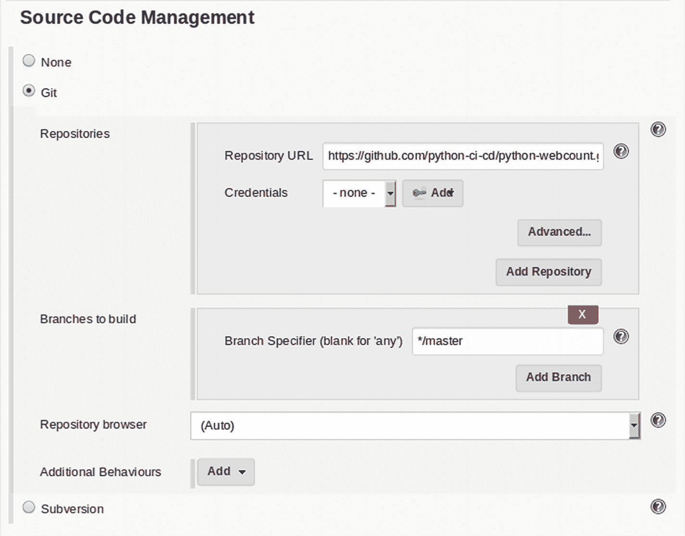

# 三、Jenkins 持续集成

一旦你对你的软件进行了自动化测试，你必须小心保持那些测试的通过。随着代码或基础设施的改变，或者新的库版本，测试可能开始失败。

如果你让它们失败，并且对这种蠕动熵不采取任何措施，测试的诊断价值开始下降，新的回归往往会被一般的噪音所掩盖。保持您的测试通过，并不断地检入新的特性和错误修复，是软件开发团队工程文化的一部分。

有工具可以帮助团队。*持续集成* (CI) *服务器*监控版本控制库，并在每次新提交时自动运行测试套件，可能在各种平台上运行。当他们导致一些测试失败时，他们可以通知开发人员，给出测试工作的历史概况，并可视化趋势数据，例如测试覆盖率。

当您使用这样的工具时，它通过提供独立的评估，帮助您发现测试何时开始失败，将失败分类到某些提交或平台，并使“它在我的机器上工作”的咒语过时。然而，从事软件工作的工程师仍然需要规程来修复 CI 工具发现的测试失败。

## 3.1 持续集成服务器

根据其部署模型，有两种 CI 服务器。您在自己的基础设施上安装和运行*本地*软件，而基于云的软件或*软件即服务* (SaaS)软件通常由创建 CI 服务器的供应商运行。

在企业设置中，内部软件往往是首选的解决方案，因为这意味着被测试的源代码不必离开组织的网络。

最流行的开源本地 CI 服务器软件是 [Jenkins](https://jenkins.io/) 、<sup>1一个基于 Java 的项目，在麻省理工学院的许可下，我们将在本章的后面使用它。这一类的其他例子还有[build bot](http://buildbot.net/)<sup>[2](#Fn2)</sup>(用 Python 写的)和 [CruiseControl](http://cruisecontrol.sourceforge.net/) 。 <sup>[3](#Fn3)</sup> 流行的封闭源码，内部 CI 软件有 JetBrains 的[team city](https://www.jetbrains.com/teamcity/)<sup>[4](#Fn4)</sup>和 Atlassian 的 [Bamboo](https://www.atlassian.com/software/bamboo) 。 <sup>[5](#Fn5)</sup></sup>

在托管 CI 服务领域，[Travis CI](https://travis-ci.org/)<sup>[6](#Fn6)</sup>由于其与 GitHub 的出色集成而非常受欢迎。Travis 也是开源的，可以自托管。[AppVeyor](https://www.appveyor.com/)<sup>[7](#Fn7)</sup>常用于基于 Windows 的 CI。Travis 和 AppVeyor 都为开源项目提供免费计划。

大多数 CI 软件都有一个中央服务器组件，可以轮询源代码库的变更，也可以由钩子触发。如果检测到源代码库中有变化，就会触发一个作业。该作业可以在服务器中集中配置，也可以在源代码存储库中配置。例如，Travis 希望在存储库的根目录中有一个名为`.travis.yml`的文件，该文件指导 Travis 如何准备环境以及执行哪些命令来触发构建和测试。

一旦 CI 服务器知道要执行哪些测试，以及在哪些环境中执行，它通常会将实际的测试运行委派给工作节点。然后，工作节点将它们的结果报告给服务器，服务器负责发送通知，并通过 web 界面提供输出和结果以供检查。

## 3.2 Jenkins 入门

首先，您需要一个正常工作的 Jenkins 安装。官方网站 <sup>[8](#Fn8)</sup> 包含如何在所有常见操作系统上安装和设置 Jenkins 的说明。接下来，你也可以找到快速指导，让一个 Docker 为基础的詹金斯操场跑步。

### 在 Docker 中运行 Jenkins

通常，在生产环境中，您会在一台机器上运行 Jenkins 服务器，并让几个构建人员在不同的(虚拟)机器上工作。为了便于设置，我们将放弃这种明智的区分，在同一个 docker 容器中运行服务器和所有构建作业，只是为了管理更少的 Docker 容器。

为此，我们使用来自 Jenkins 的官方 Docker 映像，但是添加了`tox` Python 模块(我们将使用它来创建可再现的构建环境)，以及我们想要测试的 Python 版本。

这个定制是通过一个定制`Dockerfile`来完成的，看起来像这样:

```py
FROM jenkins/jenkins:lts
USER root
RUN apt-get update \
    && apt-get install -y python-pip python3.5 \
    && rm -rf /var/lib/apt/lists/*
RUN pip install tox

```

要构建定制映像，您必须安装 Docker，并且您的用户必须能够访问 Docker 守护进程，在基于 UNIX 的系统上，它通过将用户添加到`docker`组并重新登录来工作。建筑看起来像这样:

```py
$ docker build -t jenkins-python .

```

这首先从 Dockerhub 下载图像`jenkins/jenkins:lts`，这可能需要几分钟。然后它运行 Dockerfile 的`RUN`行中的命令，docker file 安装`pip`，然后安装`tox`。由此产生的图像被命名为`jenkins-python`。

接下来，通过运行

```py
$ docker run --rm -p 8080:8080 -p 50000:50000 \
    -v jenkins_home:/var/jenkins_home jenkins-python

```

`-v ...`参数附加了一个卷，这使得 Jenkins 服务器在容器被终止并重启时不会丢失状态。

在启动过程中，容器在控制台上产生如下输出:

```py
Please use the following password to proceed to installation:

b1792b6c4c324f358a2173bd698c35cd

```

复制密码，然后将浏览器指向`http://127.0.0.1:8080/`，并按照设置说明进行操作(第一步需要输入密码)。说到插件，将 *Python 插件*添加到要安装的插件列表中。

插件安装过程可能需要几分钟时间。之后，您就有了一个正常工作的 Jenkins 服务器。

### 配置源代码库

Jenkins 基于源代码控制库中的源代码运行作业。对于一个合适的软件开发项目，您可能已经有了一个存储代码的地方。如果没有，可以使用众多云托管服务中的一个，比如 [GitHub](https://github.com/) 、<sup>9</sup>[git lab](https://about.gitlab.com/)、 <sup>[10](#Fn10)</sup> 或者 Atlassian 的 [Bitbucket](https://bitbucket.org/) 。 <sup>[11](#Fn11)</sup> 你也可以在自己的基础设施上安装 GitLab、 [Gitea](https://gitea.io/en-us/) 、<sup>[12](#Fn12)</sup>[Gogs](https://gogs.io/)、 <sup>[13](#Fn13)</sup> 或者其他 Git 管理项目。

无论哪种情况，您最终都会得到一个可以通过网络访问的 Git 存储库，这正是 Jenkins 所需要的。为了便于演示，我在 [`https://github.com/python-ci-cd/python-webcount`](https://github.com/python-ci-cd/python-webcount) 创建了一个公共的 GitHub 库。

对于私有存储库，您还需要一个 SSH 密钥对或用户名和密码的组合来访问存储库。

### 创建第一个詹金斯工作

我们希望 Jenkins 定期运行我们项目的测试。为此，我们需要创建一个*作业*，它配置 Jenkins 从哪里以及如何获得源代码并运行测试的所有细节。

要创建作业，请单击 Jenkins 起始页左栏中的 New Item 链接。然后，您必须输入一个名称，例如存储库的名称`python-webcount`，以及一个作业类型，这里是多配置项目。然后单击“确定”继续。

下一个屏幕提供了过多的配置选项。以下是让我们的示例作业运行的基本要素:

*   在源代码管理部分选择 Git，并输入存储库 URL(例如， [`https://github.com/python-ci-cd/python-webcount.git`](https://github.com/python-ci-cd/python-webcount.git) )。对于私有存储库，您还必须在 URL 下方输入有效凭证(图 [3-1](#Fig1) )。

*   在 Build Trigger 部分，选择 Poll SCM 并输入字符串`H/5 * * * *`作为调度，这意味着每五分钟轮询一次。

*   在配置矩阵下，添加一个名为`TOXENV`和值为`py35`的用户定义轴。如果你在 Jenkins 中安装了更多的 Python 版本并在项目的`tox.ini`文件中定义，你可以在这里添加它们，用空格分开(图 [3-2](#Fig2) )。

*   在构建部分，选择执行 Python 脚本，并将以下简短的 Python 脚本粘贴到脚本区域(图 [3-3](#Fig3) )。



图 3-3

Jenkins 配置:构建配置


图 3-2

Jenkins 配置:构建触发器和配置矩阵



图 3-1

Jenkins 配置:源代码管理

```py
import
os, tox

os.chdir(os.getenv("WORKSPACE"))
tox.cmdline()

```

添加这些信息后，您可以保存页面并拥有第一个工作配置项作业。

每五分钟，Jenkins 将检查 Git 存储库中的新提交，如果有，它将获取它们，通过 tox 运行测试，并在前端提供状态。

当您定义更多的 tox 环境时，Jenkins 会显示每个环境的测试是通过还是失败，并为您提供每个环境的历史记录。

## 3.3 将更多测试细节导出到 Jenkins

在当前状态下，Jenkins 完全基于运行的脚本的退出代码来检测测试状态，这并没有提供良好的粒度。我们可以通过指示 tox 编写一份机器可读的摘要并让 Jenkins 读取这些数据来提高粒度。

为此，将项目 Git 存储库中的`tox.ini`文件中的`commands = pytest`行改为

```py
commands = pytest --junitxml=junit-{envname}.xml

```

对于环境`py35`，pytest 然后创建一个文件`junit-py35.xml`,它更详细地描述了测试运行。

在 Jenkins 的作业配置中，单击 Post-build actions 并添加一个 Publish JUnit test result report 类型。在现场测试报告 XMLs 中，输入模式`**/junit-*.xml`。(见图 [3-4](#Fig4) 。)


图 3-4

构建后操作:发布 JUnit 测试结果报告

当作业再次运行时，Jenkins 会获得单个测试函数的状态，甚至会报告每个函数的运行时间。这允许直接从 Jenkins web 界面进行更好的诊断。

## 3.4 与 Jenkins 合作的模式

现在，用 Jenkins 进行测试的基础已经就绪，是时候考虑如何在日常工作中使用它了。大部分都集中在保持测试绿色上，也就是说，所有的测试都通过。经验表明，如果你不关注保持你的工作绿色，开发人员习惯了失败的测试，然后从仅仅 1%的失败测试下滑到测试运行成为纯粹的噪音，因此失去了他们的价值。

此外，您应该对开发工作流程中的测试部分进行审查，以确保测试准确地反映了需求，即使新特性改变了需求。

### 责任

如果几个开发人员在同一个代码基础上工作，为通过测试套件定义清晰的职责是很重要的。通常，破坏测试套件的人(根据 Jenkins 中从绿色到红色的变化来衡量)负责再次修复它。

在一个像润滑良好的机器一样工作的团队中，一条规则可能就足够了。如果不是这样，任命一个主要负责绿色测试套件的*构建大师*是有意义的。

这并不意味着构建大师必须清理所有失败的测试。这更像是一个管理角色，与那些破坏了测试套件的人交谈，并确保他们清理干净。如果事实证明这不可行，那么恢复导致问题的提交，并在通过所有测试后重新包含它。

如果没有人觉得有必要一直做这个工作，构建大师的角色也可以在不同的开发人员之间轮换。

### 通知

通知可以帮助开发团队保持测试绿色，简单地通过通知成员关于被破坏的测试，从而让他们知道需要一个动作。通知可以通过电子邮件发送到开发人员使用的聊天系统，甚至发送到开发人员办公室中的监视器。Jenkins 丰富的插件生态系统几乎涵盖了所有常用的通知技术。

如果您将 Jenkins 配置为在测试套件中断时发送通知，那么也要将其配置为在测试套件再次通过时发送通知。否则，每个相关人员都会讨厌 Jenkins 只给出负面反馈的通知，这对成功的 CI 流程来说不是一个好位置。

### 功能分支和拉请求

如果您的开发工作流是基于特性分支的，并且可能是基于合并请求或拉请求的(其中第二个人评审并合并变更)，那么在您的 CI 系统中包含这些分支也是有意义的。负责合并分支的开发人员可以在知道所有测试仍然通过特性分支的情况下这样做。

对于正式的合并请求或拉请求，GitHub 和 GitLab 等 Git 托管解决方案甚至支持这样一种模式，即只有在所有测试都通过的情况下，请求才能被合并。在这样的场景中，不仅要测试功能分支，还要测试功能分支和开发分支合并的结果，这是有意义的。这避免了所有测试在开发分支和特性分支中都通过，但是合并中断了一些测试的情况。

詹金斯可以将这些集成作为插件使用。 <sup>[14](#Fn14)</sup>

## 3.5 Jenkins 中的其他指标

一旦一个团队顺利地使用 CI 系统工作，您就可以使用它来收集关于软件的其他度量，并将其引导到一个理想的方向。请注意，仅在有限的实验中引入这样的度量，并且仅当您发现它们为开发过程提供了切实的价值时，才将其扩展到更大的项目。它们都伴随着维护成本和减少开发人员自主权的成本。

### 代码覆盖率

代码覆盖率衡量测试运行期间执行的一段源代码中的语句或表达式占表达式总数的百分比。代码覆盖率是一个简单的代理，代表了测试套件对代码的测试有多彻底，尽管应该有所保留，因为一段代码中路径号的组合爆炸会导致未检测到的错误，即使是在测试过的代码中。

pytest-cov<sup>[15](#Fn15)</sup>项目收集这样的数据，如果测试覆盖率低于某个阈值，您甚至可以使用它来使您的 CI 工作失败。

### 复杂性

衡量一个代码库的复杂度有各种各样的尝试，比如*圈* *复杂度*和*可维护性指数*，一个叫做[radon](https://radon.readthedocs.io/en/latest/intro.html)<sup>[16](#Fn16)</sup>的工具可以为 Python 代码计算出来。虽然这些数字不太可靠，但观察它们的趋势可以让你对代码库的健康状况有所了解。

### 编程风格

当一个项目定义了一种编码风格时，它可以使用类似于 [pylint](https://pypi.org/project/pylint/) <sup>[17](#Fn17)</sup> 或[flake 8](http://flake8.pycqa.org/en/latest/)<sup>[18](#Fn18)</sup>的工具来检查存储库中的代码是否真正遵守了指导方针，如果检测到违反，甚至会导致构建失败。这两个工具带有一组默认规则，但是可以定制成您自己的规则。

### 架构约束检查

如果一个项目遵循一个定义良好的架构，那么可能会有可以通过编程方式检查的代码规则。例如，由用户界面(UI)、业务逻辑和存储后端组成的封闭三层系统可能具有如下规则:

*   UI 可能不直接使用存储后端，只使用业务逻辑。

*   存储后端可能不会直接使用 UI。

如果这些层作为 Python 代码中的模块来处理，您可以编写一个小脚本来分析所有源文件中的导入语句，并检查它们是否违反了这些规则。静态导入分析器，如[snakefood](http://furius.ca/snakefood/)<sup>[19](#Fn19)</sup>可以使这变得更容易。

当检测到违规时，这样的工具应该使 CI 步骤失败。这允许您跟踪架构的思想是否在代码中实际实现，并防止代码慢慢削弱底层架构原则。

## 3.6 摘要

Jenkins 是一个 CI 服务器，它会自动为您运行测试套件，通常是针对源存储库中的每个新提交。这为您提供了测试套件状态的客观视图，可能在多个 Python 版本或平台上。

一旦你有了这个观点，你就可以有一个测试套件总是通过的过程，并且你可以从测试套件中获得价值。

当一个成熟的团队能够很好地处理 CI 过程时，您可以在 CI 过程中引入其他度量，比如代码覆盖率或者对架构规则的遵守。

<aside class="FootnoteSection" epub:type="footnotes">Footnotes [1](#Fn1_source)

[`https://jenkins.io/`](https://jenkins.io/) 。

  [2](#Fn2_source)

[`http://buildbot.net/`](http://buildbot.net/) 。

  [3](#Fn3_source)

[`http://cruisecontrol.sourceforge.net/`](http://cruisecontrol.sourceforge.net/) 。

  [4](#Fn4_source)

[`www.jetbrains.com/teamcity/`](http://www.jetbrains.com/teamcity/) 。

  [5](#Fn5_source)

[`www.atlassian.com/software/bamboo`](http://www.atlassian.com/software/bamboo) 。

  [6](#Fn6_source)

[`https://travis-ci.org/`](https://travis-ci.org/) 。

  [7](#Fn7_source)

[`www.appveyor.com/`](http://www.appveyor.com/) 。

  [8](#Fn8_source)

[`https://jenkins.io/download/`](https://jenkins.io/download/) 。

  [9](#Fn9_source)

[`https://github.com/`](https://github.com/) 。

  [10](#Fn10_source)

[`https://about.gitlab.com/`](https://about.gitlab.com/) 。

  [11](#Fn11_source)

[`https://bitbucket.org/`](https://bitbucket.org/) 。

  [12](#Fn12_source)

[`https://gitea.io/en-us/`](https://gitea.io/en-us/) 。

  [13](#Fn13_source)

[`https://gogs.io/`](https://gogs.io/) 。

  [14](#Fn14_source)

[`https://github.com/jenkinsci/gitlab-plugin/wiki/Setup-Example`](https://github.com/jenkinsci/gitlab-plugin/wiki/Setup-Example) 。

  [15](#Fn15_source)

[`https://pytest-cov.readthedocs.io/en/latest/`](https://pytest-cov.readthedocs.io/en/latest/) 。

  [16](#Fn16_source)

[`https://radon.readthedocs.io/en/latest/intro.html`](https://radon.readthedocs.io/en/latest/intro.html) 。

  [17](#Fn17_source)

[`https://pypi.org/project/pylint/`](https://pypi.org/project/pylint/) 。

  [18](#Fn18_source)

[`http://flake8.pycqa.org/en/latest/`](http://flake8.pycqa.org/en/latest/) 。

  [19](#Fn19_source)

[`http://furius.ca/snakefood/`](http://furius.ca/snakefood/) 。

 </aside>