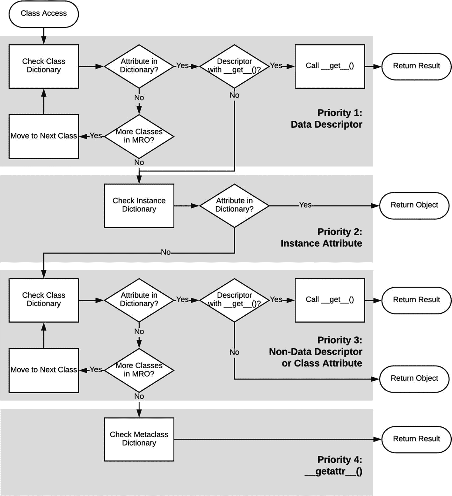
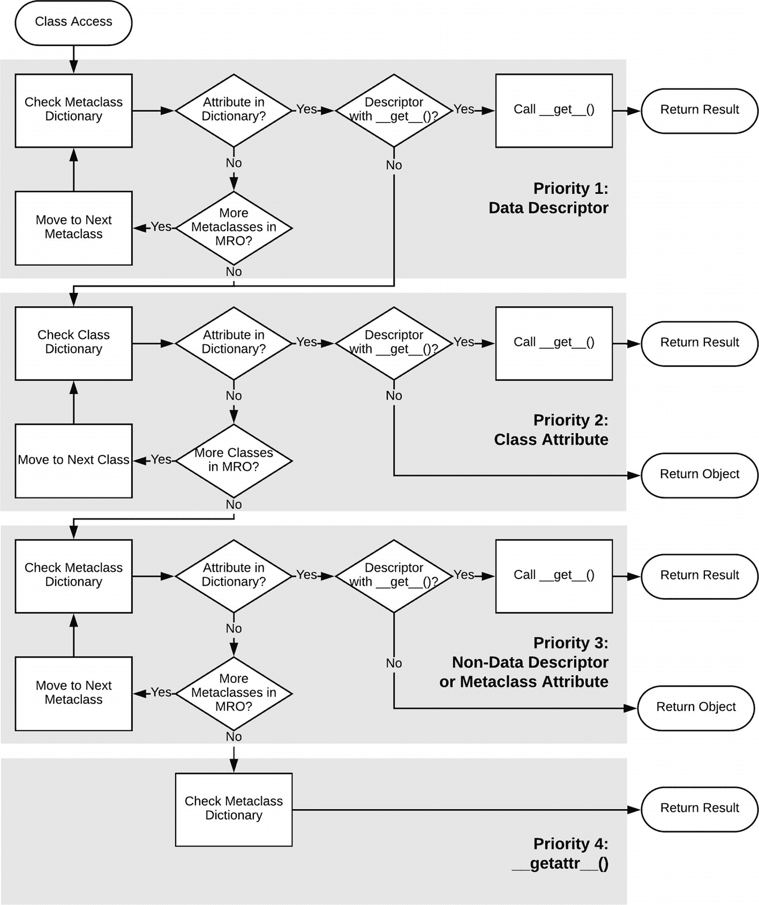

# 五、属性访问和描述符

前面已经说过，属性访问调用被转换成描述符调用，但是没有说明如何转换。简单的回答是`__getattribute__()`、`__setattr__()`和`__delattr__()`去做。这可能不是一个很好的答案，所以我会深入研究它。这三个方法存在于所有普通对象中，通过 object 类继承(类从 type 元类继承)。正如您所想象的，当检索、设置或删除对象的属性时，会分别调用这些方法，正是这些方法决定是否使用描述符、`__dict__`或`__slots__`，以及是否在类或实例上返回/设置某些内容。

关于这个决策过程的解释在一点点给出，但是现在我必须解释一些可能会困扰你的事情:为什么 set 和 delete 方法以`attr`结尾，而 get 方法以`attribute`结尾？

这个问题的部分答案是，实际上*是*的一个`__getattr__()`方法，但是它的用法和其他的不太一样。`__getattribute__()`处理所有正常的属性查找逻辑，而`__getattribute__()`调用`__getattr__()`是最后的努力，如果其他都失败的话。Python 建议，除非在极端情况下，并且只有当你真的知道自己在做什么时，才不要对`__getattribute__()`进行修改。有了一些经验，我可以同意这个建议。

我不知道为什么设置和删除没有类似的设置，但我可以理论化。这可能与这样的想法有关，如果通常的方法不起作用，典型的属性查找覆盖*是*作为故障保险，但是如果有人覆盖一个或两个其他的，有一个很好的机会，它可能是一个完全的替代，或者至少是第一件尝试的事情，而不是备份的事情。另外，事实上，在正常情况下(不使用`__slots__`),不是一个命名的元组，等等。)，设置总是有效的，删除是非常罕见的。但是你可能想问一个核心开发者，如果你真的那么好奇的话。

最后澄清一下:在本书的开头，我说过属性访问被“转换”成对描述符方法的调用。这听起来像是一个编译时的决定，但实际上不是。Python 是一种动态类型的语言，它不应该在编译时知道一个属性是否存在于一个对象上，以及它是否需要像描述符或普通属性一样被访问，特别是因为这在运行时会改变。它可以根据周围的代码做出某些猜测，但它永远不可能 100%确定。

不，有效地使用属性*被转换成对前面提到的方法中的描述符方法的调用，这些方法描述了语言如何决定做什么。这是真正动态的部分。所以让我们继续，看看这个决策过程是什么样子的。*

 *## 实例访问

简单地查找属性是属性的三种用法中最复杂的，因为有多个地方可以查找属性:在实例上和在类上。另外，如果是类的描述符，那么数据和非数据描述符有两种不同的行为。

有一个优先级顺序，描述了在哪里寻找属性以及如何处理它们。这个优先级是数据描述符和非数据描述符的主要区别。以下是优先事项列表:

*   数据描述符

*   实例属性

*   非数据描述符和类属性

*   `__getattr__`(可能与`__getattribute__`分开调用)

`__getattribute__()`做的第一件事是在类字典中查找属性。如果没有找到，它会按照类(线性顺序的超类)的方法解析顺序(MRO)继续寻找。如果仍然没有找到，它将移动到下一个优先级。如果找到了*，则检查它是否是数据描述符。如果不是，它就转移到下一个优先级。如果结果是一个数据描述符，它将调用`__get__()`并返回结果，假设它有一个`__get__()`方法。如果它没有`__get__()`方法，那么它就转移到下一个优先级。*

这有很多 if，而这只是确定是否有可行的数据描述符可用的第一要务。幸运的是，下一个优先级更简单。

优先级列表中的下一步是检查实例字典(或者插槽，如果对象正在使用的话)。如果它存在，我们简单地返回它。否则，它会移动到下一个优先级。

在这个优先级中，它再次检查类别字典，如果需要的话，沿着 MRO 列表向下工作。如果什么都没有找到，它将移动到下一个优先级。否则，它会检查找到的对象，看它是否是一个描述符(此时，我们只需要检查它是否是非数据描述符，因为如果我们已经找到了，它肯定不是数据描述符)。如果是，它调用描述符的`__get__()`方法并返回结果。否则，它只返回对象。这一次，如果它没有`__get__()`，它没有返回描述符对象本身的备份，因为它是一个非数据描述符，保证它有`__get__()`。

如果到目前为止所有其他的都失败了，它用`__getattr__()`检查任何可能的关于属性访问的定制行为。如果什么都没有，就会引发一个`AttributeError`。

有了这个复杂的定义，Python 用户应该感激大量的工作被投入到优化这个访问算法中，以至于它非常快。图 5-1 中的流程图显示了如何访问描述符，蓝色带表示每个优先级。

图 5-1

班级访问

在一般情况下，类的元类是`type`，或者元类上没有新的属性，与实例访问相比，类访问可以用一种简化的方式来看待；它甚至没有优先列表。它仍然使用`__getattribute__()`，但是它是在它的元类上定义的。它只是在类别字典中搜索，根据需要在 MRO 中前进。如果找到了，它用`__get__()`方法检查它是否是一个描述符。如果是，它进行适当的调用并返回结果。否则，它只返回对象。但是，在类级别，它不关心描述符是数据还是非数据；如果描述符有一个`__get__()`方法，则使用该方法。

如果什么都没有找到，则引发`AttributeError`，如图 5-2 所示。

图 5-2

引发了 AttributeError

不幸的是，如果元类上有*个新属性，这种简化是没有用的，因为它们可能会在查找中使用。事实上，类访问看起来几乎和实例访问一模一样(用“元类”代替“类”，用“类”代替“实例”)，只有一个很大的区别。它不仅检查当前的实例/类字典，还检查它的 MRO。它仍然将类上的描述符视为描述符，而不是自动返回描述符对象。了解了这一点，图 5-3 显示了*完整*类访问图，带有所有优先级。*

图 5-3

完整的类访问图

## 设置和删除通话

设置和删除只是有一点不同。如果所需的`__set__()`或`__delete__()`方法不存在，并且它是一个数据描述符，则会引发一个`AttributeError`。另一个区别是，设置和删除永远不会超出实例优先级。如果实例上不存在该属性，设置将添加它，删除将引发一个`AttributeError`。

图 5-4 显示了最后一个流程图，描述了设置和删除发生的情况。

图 5-4

设置和删除过程

## 数据与非数据描述符背后的推理

既然已经解释了数据和非数据描述符的区别，那么应该解释一下*为什么*会有这两个版本。

首先要看的是语言和标准库中每种类型的内置用例。数据描述符的主要例子是`property`。顾名思义，它的目的是为类创建属性(用看起来像简单属性用法的语法替换 getter 和 setter 方法)。这意味着不打算进行类级访问，因为属性表示实例上的字段。

同时，非数据描述符的主要用例是不同用法的修饰方法(`classmethod`、`staticmethod`，尤其是用于普通方法的隐式描述符)。虽然这些可以从实例中调用(正常的方法*应该从实例中调用*)，但它们并不意味着从实例中*设置*或*删除*。方法是在类上分配的。一个函数可以被分配给一个实例属性，但是它不能使它成为一个方法，因为`self`在被调用时不会自动作为第一个参数被提供。此外，当通过正常的“神奇的”方式调用“神奇的”dunder 方法(具有两个前导下划线和两个尾随下划线的方法)时，Python 被优化为直接查看类，跳过任何可能已经分配给实例的内容。

## 摘要

知道属性调用背后发生的事情的全部深度几乎没有用处，甚至知道基本的优先级列表也很少发挥作用，因为一旦你理解了它们是如何被访问的，描述符通常做显而易见的事情。但是，有时优先级列表，甚至可能是完整的深度，将有助于理解为什么描述符不能像希望的那样工作，或者如何设置描述符来完成更复杂的任务。*