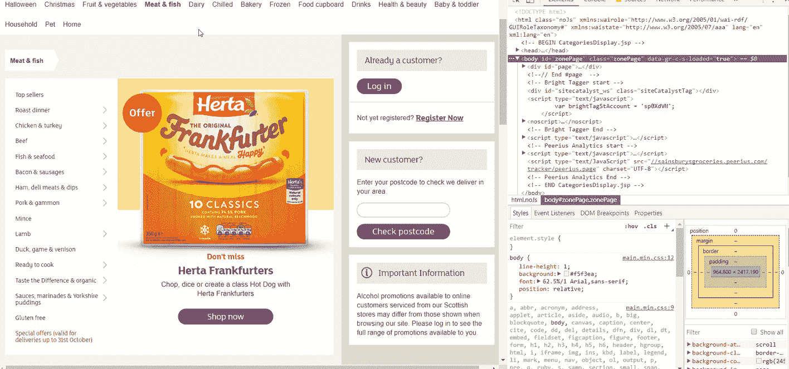
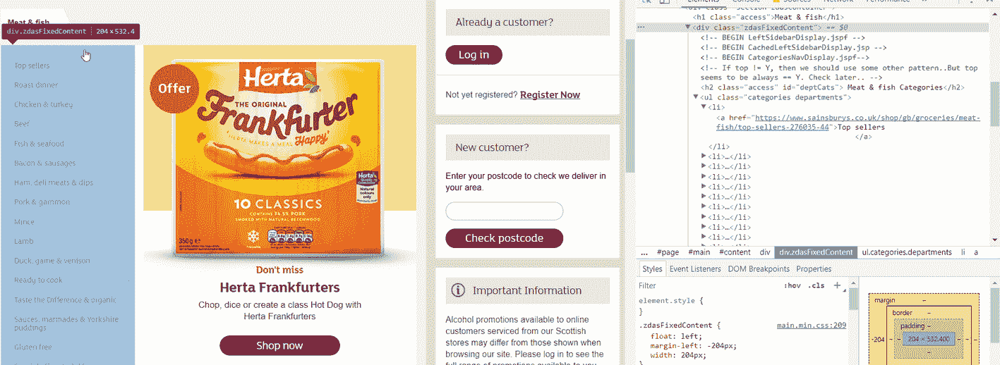
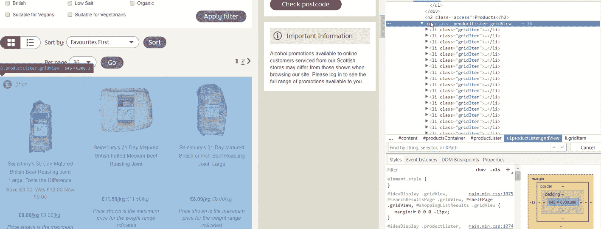
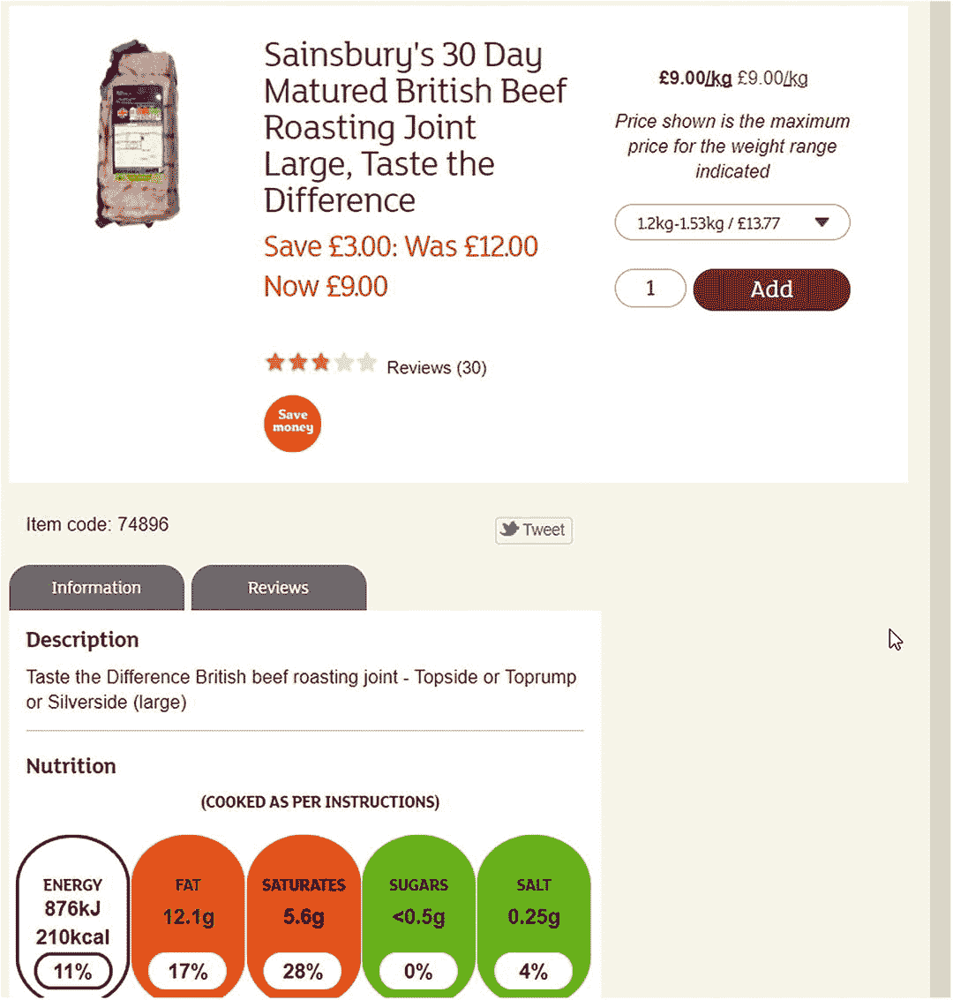
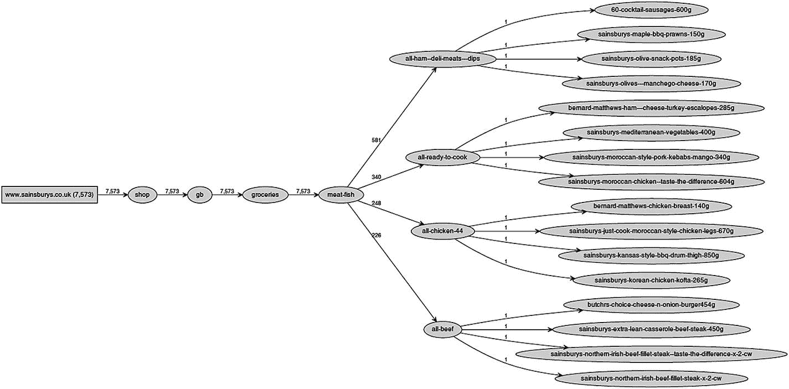

# 二、输入需求

在介绍性章节之后，是时候让你开始一个真正的刮擦项目了。

在本章中，您将学习在接下来的两章中，使用`Beautiful Soup`和`Scrapy`必须提取哪些数据。

不用担心；要求很简单。我们将从以下网站中提取信息: [`https://www.sainsburys.co.uk/`](https://www.sainsburys.co.uk/) 。

Sainsbury's 是一家提供大量商品的在线商店。这是一个伟大的网站抓取项目的来源。

我将指导您找到满足需求的方法，并且您将了解我是如何处理一个抓取项目的。


图 2-1

2017 年万圣节塞恩斯伯里的登陆页面

## 要求

如果你看看这个网站，你可以看到这是一个简单的网页，有很多信息。让我告诉你我们将提取哪些部分。

一个想法是从万圣节主题网站中提取一些东西(见图 [2-1](#Fig1) )。用于他们的主题登陆页面)。然而，这不是一个选项，因为你不能自己尝试；至少在 2017 年，当你读到这篇`—`的时候，万圣节已经结束了，我不能保证未来的销售会是一样的。

因此，您将提取食品杂货的信息。更具体地说，您将从“肉类和鱼类”部门收集营养细节。

对于每个包含营养详细信息的条目，您可以提取以下信息:

*   产品名称

*   产品的 URL

*   项码

*   每 100 克的营养成分:
    *   千卡能量

    *   能量单位为千焦

    *   脂肪

    *   浸透

    *   碳水化合物

    *   总糖

    *   淀粉

    *   纤维

    *   蛋白质

    *   盐

*   原产国

*   单价

*   单位

*   评论数量

*   平均分

这看起来很多，但不要担心！您将学习如何使用自动化脚本从该部门的所有产品中提取这些信息。而且如果你很敏锐，有上进心，你可以延伸这方面的知识，提取所有产品的所有营养信息。

## 准备

正如我在前一章提到的，在你开始你的 scraper 开发之前，你应该看看网站的条款和条件，以及`robots.txt`文件，看看你是否能提取你需要的信息。

在撰写这一部分时(2017 年 11 月)，网站的条款和条件中没有关于刮刀限制的条目。这意味着，你可以创建一个机器人来提取信息。

下一步是查看`robots.txt`文件，在`http://sainsburys.co.uk/robots.txt`找到。

```py
# __PUBLIC_IP_ADDR__  - Internet facing IP Address or Domain name.
User-agent: *
Disallow: /webapp/wcs/stores/servlet/OrderItemAdd
Disallow: /webapp/wcs/stores/servlet/OrderItemDisplay
Disallow: /webapp/wcs/stores/servlet/OrderCalculate
Disallow: /webapp/wcs/stores/servlet/QuickOrderCmd
Disallow: /webapp/wcs/stores/servlet/InterestItemDisplay
Disallow: /webapp/wcs/stores/servlet/ProductDisplayLargeImageView
Disallow: /webapp/wcs/stores/servlet/QuickRegistrationFormView
Disallow: /webapp/wcs/stores/servlet/UserRegistrationAdd
Disallow: /webapp/wcs/stores/servlet/PostCodeCheckBeforeAddToTrolleyView
Disallow: /webapp/wcs/stores/servlet/Logon
Disallow: /webapp/wcs/stores/servlet/RecipesTextSearchDisplayView
Disallow: /webapp/wcs/stores/servlet/PostcodeCheckView
Disallow: /webapp/wcs/stores/servlet/ShoppingListDisplay
Disallow: /webapp/wcs/stores/servlet/gb/groceries/get-ideas/advertising
Disallow: /webapp/wcs/stores/servlet/gb/groceries/get-ideas/development
Disallow: /webapp/wcs/stores/servlet/gb/groceries/get-ideas/dormant
Disallow: /shop/gb/groceries/get-ideas/dormant/
Disallow: /shop/gb/groceries/get-ideas/advertising/
Disallow: /shop/gb/groceries/get-ideas/development

Sitemap: http://www.sainsburys.co.uk/sitemap.xml

```

在代码块中，你可以看到什么是允许的，什么是不允许的，这个`robots.txt`非常严格，只有`Disallow`个条目，但这是针对所有机器人的。

从这篇课文中我们能发现什么？例如，你不应该创建通过这个网站自动订购的机器人。但这对我们来说并不重要，因为我们只需要收集信息`—`不需要购买。这个`robots.txt`文件对我们的目的没有限制；我们可以自由地继续我们的准备和刮擦。

### 什么会限制我们的目标？

问得好。在`robots.txt`中引用“肉&鱼”部门的条目可能会限制我们的抓取意图。一个示例条目如下所示:

`User-agent: *`

`Disallow: /shop/gb/groceries/meat-fish/`

`Disallow: /shop/gb/groceries/`

但这将使搜索引擎无法查找塞恩斯伯里销售的商品，这将是一个巨大的利润损失。

### 浏览“肉类和鱼类”

正如本章开始时提到的，我们将从“肉类和鱼类”部门提取数据。这部分网站的网址是 [`www.sainsburys.co.uk/shop/gb/groceries/meat-fish`](http://www.sainsburys.co.uk/shop/gb/groceries/meat-fish) 。

让我们在 Chrome 浏览器中打开 URL，禁用 JavaScript，并按照上一章所述重新加载浏览器窗口。请记住，禁用 JavaScript 使您能够看到网站的 HTML 代码，就像基本的 scraper 会看到它一样。

当我写这篇文章时，该部门的网站看起来如图 [2-2](#Fig2) 。



图 2-2

用 Chrome 的 DevTools 检查了“肉类和鱼类”部门的页面

出于我们的目的，左侧的导航菜单很有趣。它包含到我们将在其中找到要提取的产品的页面的链接。让我们使用选择工具(或点击 CTRL-SHIFT-C)选择包含这些链接的框，如图 [2-3](#Fig3) 所示。



图 2-3

选择左侧的导航栏

现在我们可以在 DevTools 中看到，每个链接都在一个无序列表(`<ul>`)的列表元素(`<li>`标签)中，类为`categories departments`。记下这些信息，因为我们以后会用到。

链接，有一个指向右边的小箭头(`>`)，告诉我们它们只是一个分组类别，如果我们点击它们，我们会在它们下面找到另一个导航菜单。让我们检查一下*烤晚餐*选项，如图 [2-4](#Fig4) 所示。


图 2-4

“烧烤晚餐”子菜单

在这里，我们可以看到该页面没有产品，但有另一个详细的网站链接列表。如果我们看看 DevTools 中的 HTML 结构，我们可以看到这些链接也是无序列表的元素。这个无序列表有一个类`categories aisles`。

现在我们可以进一步进入*牛肉*类别，这里我们列出了产品(在一个大过滤盒之后)，如图 [2-5](#Fig5) 所示。


图 2-5

“牛肉”类别的产品

这里我们需要考察两件事:一是产品列表；另一个是导航。

如果该类别包含的产品超过 36 个(这是网站上显示的默认数量)，这些产品将被拆分到多个页面中。因为我们想要提取所有产品的信息，所以我们必须浏览所有这些页面。如果我们选择导航，我们可以看到它又是一个无序的类列表`pages`，如图 [2-6](#Fig6) 所示。


图 2-6

带有类“pages”的无序列表

在这些列表元素中，我们感兴趣的是带有向右箭头符号的元素，它包含类`next`。这告诉我们，如果我们有下一页，我们必须导航或没有。

现在让我们找到产品详细信息页面的链接。所有产品都在一个无序列表中(再次)。该列表有`productLister` `gridView`类，如图 [2-7](#Fig7) 所示。



图 2-7

从开发工具中选择产品列表

每个产品都在带有类`gridItem`的列表元素中。如果我们打开其中一个产品的详细信息，我们可以看到导航链接在哪里:位于一些`div`和一个`h3`中。我们注意到最后一个`div`有类`productNameAndPromotions`，如图 [2-8](#Fig8) 所示。


图 2-8

选择产品名称

现在我们已经达到了产品的层次，我们可以更进一步，专注于真正的任务:识别所需的信息。

#### 选择所需信息

基于图 [2-9](#Fig9) 中所示的产品，我们将发现我们所需信息所在的元素。



图 2-9

我们将在示例中使用的详细产品页面

现在我们已经有了产品，让我们来确定所需的信息。和前面一样，我们可以使用选择工具，找到所需的文本，并从 HTML 代码中读取属性。

产品的**名称**在一个头(`h1`)里面，这个头在一个带有类`productTitleDescriptionContainer`的`div`里面。

**价格**和**单位**在`pricing`类的一个`div`中。价格本身就在`pricePerUnit`类的一段(`p`)；单位在`pricePerUnitUnit`班的一个`span`。

提取**评级**很棘手，因为这里我们只看到评级的星星，但我们想要数字评级本身。让我们来看看图片的 HTML 定义，如图 [2-10](#Fig10) 所示。


图 2-10

图像的 HTML 代码

我们可以看到图像的位置在类`numberOfReviews`的`label`中，它有一个属性`alt`，包含评论平均值的十进制值。在图像之后，是包含评论数量的文本。

**项目代码**在`itemCode`类的段落内。

如图 [2-11](#Fig11) 所示的**营养信息**在`nutritionTable`类的`table`中。该表的每一行(`tr`)都包含我们需要的数据的一个条目:该行的标题(`th`)包含名称，第一列(`td`)包含值。唯一的*例外*是能量信息，因为两行包含值，但只有第一行是标题。正如你将看到的，我们也将通过一些特定的代码来解决这个问题。


图 2-11

营养表

如图 [2-12](#Fig12) 所示，原产国在`productText`类 div 的一个段落内。这个字段不是惟一的:每个描述都在一个`productText div`中。这将使提取有点复杂，但也有一个解决方案。


图 2-12

在 Chrome 的开发工具中选择“原产国”

尽管我们必须提取许多字段，但我们很容易在网站中识别它们。现在是提取数据和学习交易工具的时候了！

## 概述应用

在定义了需求并且我们找到了要提取的每个条目之后，是时候计划应用的结构和行为了。

如果你想一想如何着手这个项目，你会从大爆炸开始，“让我们锤代码”的想法。但是你以后会意识到，你可以把整个脚本分解成更小的步骤。下面是一个例子:

1.  下载起始页面，在本例中是“肉类和鱼类”部门，并提取产品页面的链接。

2.  下载产品页面并提取详细产品的链接。

3.  从已经下载的产品页面中提取我们感兴趣的信息。

4.  导出提取的信息。

这些步骤可以识别我们正在开发的应用的功能。

步骤 **1** 还提供了一点东西:如果你还记得你看到的用 *DevTools* 进行的分析，一些链接只是一个分组类别，你必须从这个分组类别中提取细节页面链接。

## 浏览网站

在我们开始学习你将用来抓取网站数据的第一个工具之前，我想向你展示如何浏览网站`—`,这将是抓取器的另一个组成部分。

网站由页面和页面之间的链接组成。如果你还记得你的数学研究，你会意识到一个网站可以被描绘成一个图形，如图 [2-13](#Fig13) 所示。



图 2-13

导航路径

因为网站是一个图表，你可以使用图表算法来浏览页面和链接:广度优先搜索(BFS)和深度优先搜索(DFS)。

使用 BFS，你可以进入图形的一个层次，收集下一个层次所需的所有 URL。例如，您从“肉类和鱼类”部门页面开始，提取下一个**所需的**级别的所有 URL，如“*畅销商品*或“*烧烤晚餐”。*“然后你就有了所有这些网址，去*最畅销的网站*，提取所有链接到详细产品页面的网址。完成这些之后，您可以转到“*烧烤晚餐*”页面，并从那里提取所有产品的详细信息，以此类推。最后，您将获得所有产品页面的 URL，您可以从中提取所需的信息。

使用 DFS，您可以通过“肉与鱼”、“最畅销商品”、“最畅销商品”和“最畅销商品”直接找到第一种商品，并从其网站上提取信息。然后你去“*畅销商品*页面上的下一个商品，从那里提取信息。如果您有来自“*最畅销商品*的所有商品，那么您将移动到“*烧烤晚宴*”并从那里提取所有商品。

如果你问我，我会说这两种算法都很好，而且结果是一样的。我可以写两个脚本并比较它们，看哪一个更快，但是这种比较会有偏见和缺陷。 <sup>[1](#Fn1)</sup>

因此，您将实现一个导航网站的脚本，并且您可以更改它背后的算法以使用 BFS 或 DFS。

如果你对**感兴趣为什么？**对于这两种算法，我建议你考虑马格努斯·赫特兰德的书: *Python 算法*。<sup>2[2](#Fn2)</sup>

### 创建导航

如果你看算法，实现导航是简单的，因为这是唯一的诀窍:实现伪代码。

好吧，我有点懒，因为你也需要实现链接提取，这可能有点复杂，但你已经有了第 [1](1.html) 章中的构建块，你可以自由使用它。

```py
def extract_links(page):
    if not page:
        return []
    link_regex = re.compile('<a[^>]+href=["\'](.*?)["\']', re.IGNORECASE)
    return [urljoin(page, link) for link in link_regex.findall(page)]

def get_links(page_url):
    host = urlparse(page_url)[1]
    page = download_page(page_url)
    links = extract_links(page)
    return [link for link in links if urlparse(link)[1] == host]

```

所示的两个函数提取页面，链接仍然指向 Sainsbury 的网站。

### 注意

如果你不过滤掉外部 URL，你的脚本可能永远不会结束。这只有在你想浏览整个 WWW 来看看你能从一个网站到达多远的时候才有用。

`extract_links`函数负责一个空页面或`None`页面。`urljoin`不会对此抱怨，但是`re.findall`会抛出一个异常，你不希望这种情况发生。

`get_links`函数返回指向同一主机的网页的所有链接。要找出使用哪个主机，您可以利用`urlparse`函数、<sup>3返回一个元组。这个元组的第二个参数是从 URL 中提取的主机。</sup>

这些是最基本的。现在出现了两种搜索算法:

```py
def depth_first_search(start_url):
    from collections import deque
    visited = set()
    queue = deque()
    queue.append(start_url)
    while queue:
        url = queue.popleft()
        if url in visited:
            continue
        visited.add(url)
        for link in get_links(url):
            queue.appendleft(link)
        print(url)

def breadth_first_search(start_url):
    from collections import deque
    visited = set()
    queue = deque()
    queue.append(start_url)
    while queue:
        url = queue.popleft()
        if url in visited:
            continue
        visited.add(url)
        queue.extend(get_links(url))
        print(url)

```

如果你看一下刚刚展示的两个函数，你会发现它们的代码只有一个不同(提示:突出显示):你如何把它们放入队列，这是一个堆栈。

### `requests`图书馆

要成功实现这个脚本，您必须了解一点关于`requests`库的知识。

我非常喜欢 Python 核心库的可扩展性，但是有时你需要由社区成员开发的库。图书馆就是其中之一。

使用基本的 Python `urlopen`可以创建简单的请求和相应的数据，但是使用起来很复杂。`requests`库在这种复杂性之上添加了一个友好的层，使网络编程变得容易:它负责重定向，并且可以为您处理会话和 cookies。Python 文档推荐使用它作为工具。

同样，我不会向您详细介绍这个库，只提供必要的信息。如果您需要更多信息，请查看该项目的网站。 <sup>[4](#Fn4)</sup>

#### 装置

作为“Pythonista”，您已经知道如何安装库。但是为了完整起见，我把它包括在这里。

```py
pip install requests

```

现在你可以继续写这本书了。

#### 获取页面

使用请求库:`requests.get(url)`请求页面很容易。

这将返回一个包含基本信息的响应对象，比如状态代码和内容。内容通常是您请求的网站的主体，但是如果您请求一些二进制数据(如图像或声音文件)或 JSON，那么您会得到它们。对于这本书，我们将重点讨论 HTML 内容。

您可以通过调用响应的文本参数从响应中获取 HTML 内容:

```py
import requests
r = requests.get('http://www.hajba.hu')
if r.status_code == 200:
    print(r.text[:250])
else:
    print(r.status_code)

```

前面的代码块请求我的网站的首页，如果服务器返回状态代码`200`，这意味着 OK，它打印内容的前 250 个字符。如果服务器返回不同的状态，则打印该代码。

您可以看到如下成功结果的示例:

```py
<!DOCTYPE html>
<html lang="en-US">
<head>

<meta property="og:type" content="website" />
<meta property="og:url" content="http://hajba.hu/2017/10/26/red-hat-forum-osterreich-2017/" />
<meta name="twitter:card" content="summary_large_image" />

```

至此，我们完成了`requests`库的基础知识。随着我在本书后面介绍更多关于库的概念，我会告诉你更多关于它的内容。

现在是时候跳过 Python 3 的默认`urllib`调用，改为`requests`了。

### 切换到`requests`

现在是时候完成脚本并使用`requests`库下载页面了。

到目前为止，您已经知道如何实现这一点，但这里还是有代码。

```py
def download_page(url):
    try:
        return requests.get(url).text
    except:
        print('error in the url', url)

```

我用一个 try-except 块包围了请求方法调用，因为内容可能会有一些编码问题，我们会得到一个异常，它会杀死整个应用；我们不希望这样，因为网站很大，重新开始需要太多的资源。 <sup>[5](#Fn5)</sup>

### 将代码放在一起

现在，如果你把所有的东西放在一起，用 [`'https://www.sainsburys.co.uk/shop/gb/groceries/meat-fish/'`](https://www.sainsburys.co.uk/shop/gb/groceries/meat-fish/) 作为`starting_url`来运行这两个函数，那么你应该会得到与这个类似的结果。

```py
starting navigation with BFS

https://www.sainsburys.co.uk/shop/gb/groceries/meat-fish/
http://www.sainsburys.co.uk
https://www.sainsburys.co.uk/shop/gb/groceries
https://www.sainsburys.co.uk/shop/gb/groceries/favourites
https://www.sainsburys.co.uk/shop/gb/groceries/great-offers

starting navigation with DFS

https://www.sainsburys.co.uk/shop/gb/groceries/meat-fish/
http://www.sainsburys.co.uk/accessibility
http://www.sainsburys.co.uk/shop/gb/groceries
http://www.sainsburys.co.uk/terms
http://www.sainsburys.co.uk/cookies

```

如果您的结果略有不同，那么网站的结构在此期间发生了变化。

从打印的 URL 中可以看出，当前的解决方案是初步的:代码导航整个网站，而不是只关注“肉&鱼”部门和营养细节。

一种选择是扩展过滤器，只返回相关链接，但是我不喜欢正则表达式，因为它们很难阅读。相反，让我们继续下一章。

## 摘要

本章为您准备了本书的剩余部分:您已经满足了需求，分析了要抓取的网站，并确定了感兴趣的字段在 HTML 代码中的位置。您实现了一个简单的 scraper，主要使用基本的 Python 工具，它可以在网站中导航。

在下一章中，你将学习`Beautiful Soup`，一个简单的提取器库，帮助你忘记正则表达式，并增加了更多的功能来像 boss 一样遍历和提取 HTML 树。

<aside class="FootnoteSection" epub:type="footnotes">Footnotes [1](#Fn1_source)

在这里阅读更多关于这个话题: [`www.ibm.com/developerworks/library/j-jtp02225/index.html`](https://www.ibm.com/developerworks/library/j-jtp02225/index.html)

  [2](#Fn2_source)

[`www.apress.com/gp/book/9781484200568`](https://www.apress.com/gp/book/9781484200568)

  [3](#Fn3_source)

[`https://docs.python.org/3/library/urllib.parse.html`](https://docs.python.org/3.libraty/urllib.parse.html)

  [4](#Fn4_source)

人类请求:HTTP:[`http://docs.python-requests.org/en/master/`](http://docs.python-requests.org/en/master/)

  [5](#Fn5_source)

我将与你分享一个写作秘密:当我为这一章创建代码时，我遇到了六个由编码问题引起的异常，其中一个是在“肉和鱼”部分。

 </aside>